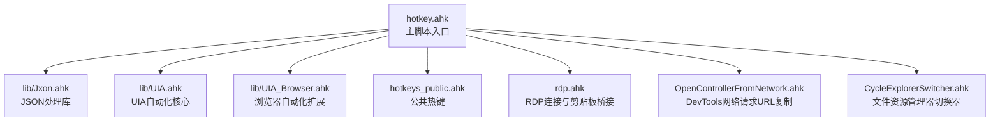
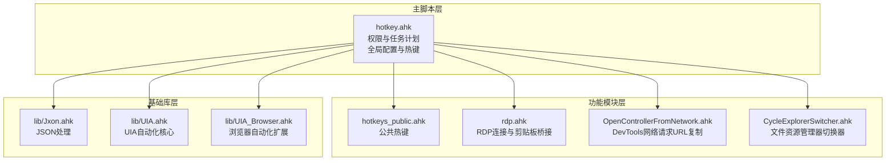
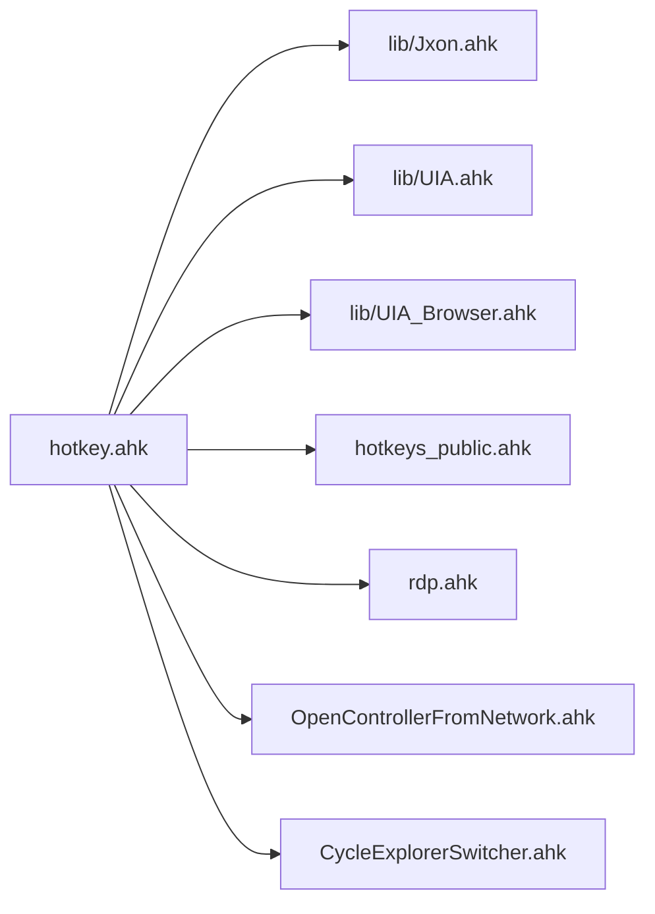

# API参考

<cite>
**本文档引用的文件**
- [hotkey.ahk](file://hotkey.ahk)
- [hotkeys_public.ahk](file://hotkeys_public.ahk)
- [lib/Jxon.ahk](file://lib/Jxon.ahk)
- [lib/UIA.ahk](file://lib/UIA.ahk)
- [lib/UIA_Browser.ahk](file://lib/UIA_Browser.ahk)
- [rdp.ahk](file://rdp.ahk)
- [OpenControllerFromNetwork.ahk](file://OpenControllerFromNetwork.ahk)
- [CycleExplorerSwitcher.ahk](file://CycleExplorerSwitcher.ahk)
- [README.md](file://README.md)
</cite>

## 目录
1. [简介](#简介)
2. [项目结构](#项目结构)
3. [核心组件](#核心组件)
4. [架构总览](#架构总览)
5. [详细组件分析](#详细组件分析)
6. [依赖关系分析](#依赖关系分析)
7. [性能考虑](#性能考虑)
8. [故障排除指南](#故障排除指南)
9. [结论](#结论)
10. [附录](#附录)

## 简介
本项目是一个基于 AutoHotkey v2 的热键脚本集合，提供以下能力：
- 热键管理与程序开关
- 窗口管理与多窗口切换
- 输入法智能切换与标点转换
- UIA 自动化与浏览器自动化
- JSON 处理工具
- RDP 远程桌面连接与剪贴板桥接
- 开发者工具（DevTools）网络请求 URL 复制

项目通过模块化组织，将公共热键、UIA 库、浏览器自动化库、JSON 库以及各功能模块（如 RDP、开发者工具、窗口切换器）分离，便于维护与扩展。

**章节来源**
- [README.md:1-2](file://README.md#L1-L2)

## 项目结构
项目采用按功能模块划分的组织方式：
- 根目录包含主脚本、热键定义、第三方库与工具脚本
- lib 目录包含 JSON 解析库与 UIA 自动化库
- 各功能模块独立文件，通过 #Include 引入主脚本

**图表来源**
- [hotkey.ahk:1-20](file://hotkey.ahk#L1-L20)
- [lib/Jxon.ahk:1-10](file://lib/Jxon.ahk#L1-L10)
- [lib/UIA.ahk:1-50](file://lib/UIA.ahk#L1-L50)
- [lib/UIA_Browser.ahk:1-20](file://lib/UIA_Browser.ahk#L1-L20)
- [hotkeys_public.ahk:1-10](file://hotkeys_public.ahk#L1-L10)
- [rdp.ahk:1-20](file://rdp.ahk#L1-L20)
- [OpenControllerFromNetwork.ahk:1-20](file://OpenControllerFromNetwork.ahk#L1-L20)
- [CycleExplorerSwitcher.ahk:1-20](file://CycleExplorerSwitcher.ahk#L1-L20)

**章节来源**
- [hotkey.ahk:1-20](file://hotkey.ahk#L1-L20)

## 核心组件
本节概述项目的核心组件及其职责：
- 热键与程序开关：提供通用的 ToggleWindow 系列函数，支持按进程名、窗口标题与路径启动或切换程序
- 窗口管理：提供窗口列表、窗口激活、最小化、最大化/还原等操作
- 输入法控制：基于 InputHook 的智能中英文输入法切换，支持代码上下文、行首字母、中文标点自动转换
- UIA 自动化：封装 UIA 接口，提供元素查找、属性访问、事件处理等能力
- 浏览器自动化：针对 Chrome、Edge、Firefox、Vivaldi 等浏览器的自动化操作
- JSON 处理：轻量级 JSON 解析与序列化库
- RDP 连接：提供 RDP 快速连接、安全探测连接、剪贴板桥接与最小化控制
- 开发者工具：从 DevTools 网络面板复制选中请求的 URL 并解析为 API 路径
- 窗口切换器：文件资源管理器的循环切换器，支持可视化列表与自定义绘制

**章节来源**
- [hotkey.ahk:120-163](file://hotkey.ahk#L120-L163)
- [hotkey.ahk:296-404](file://hotkey.ahk#L296-L404)
- [lib/UIA.ahk:51-150](file://lib/UIA.ahk#L51-L150)
- [lib/UIA_Browser.ahk:1-120](file://lib/UIA_Browser.ahk#L1-L120)
- [lib/Jxon.ahk:10-48](file://lib/Jxon.ahk#L10-L48)
- [rdp.ahk:47-146](file://rdp.ahk#L47-L146)
- [OpenControllerFromNetwork.ahk:34-96](file://OpenControllerFromNetwork.ahk#L34-L96)
- [CycleExplorerSwitcher.ahk:68-96](file://CycleExplorerSwitcher.ahk#L68-L96)

## 架构总览
系统采用“主脚本 + 多模块”的架构：
- 主脚本负责权限提升、任务计划注册、全局配置与热键绑定
- 各功能模块通过 #Include 引入，形成松耦合的插件式结构
- UIA 与浏览器自动化库作为底层基础设施，向上提供高层 API

**图表来源**
- [hotkey.ahk:14-19](file://hotkey.ahk#L14-L19)
- [lib/Jxon.ahk:1-10](file://lib/Jxon.ahk#L1-L10)
- [lib/UIA.ahk:1-26](file://lib/UIA.ahk#L1-L26)
- [lib/UIA_Browser.ahk:1-20](file://lib/UIA_Browser.ahk#L1-L20)
- [hotkeys_public.ahk:1-10](file://hotkeys_public.ahk#L1-L10)
- [rdp.ahk:1-20](file://rdp.ahk#L1-L20)
- [OpenControllerFromNetwork.ahk:1-20](file://OpenControllerFromNetwork.ahk#L1-L20)
- [CycleExplorerSwitcher.ahk:1-20](file://CycleExplorerSwitcher.ahk#L1-L20)

## 详细组件分析

### 热键与程序开关 API
- 函数：ToggleWindow(ahk_exe, APP_PATH)
  - 功能：根据进程名与路径切换或启动程序
  - 参数：
    - ahk_exe: 程序进程名（如 "msedge.exe"）
    - APP_PATH: 程序路径或协议路径（如 "obsidian://..."）
  - 返回：无
  - 说明：若窗口已存在则激活/最小化，否则尝试运行路径
  - 示例路径：[hotkey.ahk:123-134](file://hotkey.ahk#L123-L134)

- 函数：ToggleWindowByTitle(ahk_exe, WinTitle, APP_PATH)
  - 功能：根据窗口标题与进程名切换或启动程序
  - 参数：同上，增加 WinTitle
  - 示例路径：[hotkey.ahk:135-146](file://hotkey.ahk#L135-L146)

- 函数：ToggleWindow2(ahk_exe, WinTitle, APP_PATH)
  - 功能：带过滤器的窗口切换（如 "Photos and Videos"）
  - 示例路径：[hotkey.ahk:152-163](file://hotkey.ahk#L152-L163)

- 函数：RunAppPathWithPrefixFallback(path)
  - 功能：路径前缀互换与协议路径处理（如 C:/ 与 D:/ 切换）
  - 参数：path
  - 返回：布尔值（是否成功）
  - 示例路径：[hotkey.ahk:76-118](file://hotkey.ahk#L76-L118)

- 函数：SwapProgramsPrefix(path)
  - 功能：交换 Program Files 前缀（C:/ 与 D:/）
  - 示例路径：[hotkey.ahk:64-74](file://hotkey.ahk#L64-L74)

- 参数验证与错误处理
  - 文件存在性检查与异常捕获
  - 路径不存在时的消息提示
  - 协议路径直接运行，失败时提示

**章节来源**
- [hotkey.ahk:64-163](file://hotkey.ahk#L64-L163)

### 窗口管理 API
- 函数：WinGetList(scope, title, subtreeFilter)
  - 功能：获取符合条件的窗口句柄列表
  - 示例路径：[hotkey.ahk:180-198](file://hotkey.ahk#L180-L198)

- 函数：WinActivate(hwnd) / WinMinimize(hwnd) / WinRestore(hwnd)
  - 功能：激活、最小化、还原窗口
  - 示例路径：[hotkey.ahk:183-185](file://hotkey.ahk#L183-L185)

- 函数：WinGetMinMax(hwnd)
  - 功能：获取窗口最小化/还原状态
  - 示例路径：[hotkey.ahk:577-586](file://hotkey.ahk#L577-L586)

- 函数：GetMainWindowByExe(ahk_exe, winTitle)
  - 功能：根据进程名与标题获取主窗口句柄（可见且有标题）
  - 示例路径：[hotkey.ahk:239-250](file://hotkey.ahk#L239-L250)

- 窗口切换器（Explorer Switcher）
  - 类：ExplorerSwitcher
  - 方法：StartExplorerSwitcher、CycleExplorerSwitcher、CommitExplorerSwitcher、CloseExplorerSwitcher
  - 功能：可视化文件资源管理器窗口列表，支持自定义绘制与键盘导航
  - 示例路径：[CycleExplorerSwitcher.ahk:68-153](file://CycleExplorerSwitcher.ahk#L68-L153)

**章节来源**
- [hotkey.ahk:180-250](file://hotkey.ahk#L180-L250)
- [CycleExplorerSwitcher.ahk:68-153](file://CycleExplorerSwitcher.ahk#L68-L153)

### 输入法控制 API
- 全局状态：g_IME（默认中文）
- 函数：SwitchToChinese() / SwitchToEnglish()
  - 功能：切换输入法状态
  - 示例路径：[hotkey.ahk:310-326](file://hotkey.ahk#L310-L326)

- 函数：IsCodeContext() / IsNaturalContext() / IsLineStart()
  - 功能：判断代码上下文、自然语言环境、行首
  - 示例路径：[hotkey.ahk:331-355](file://hotkey.ahk#L331-L355)

- 函数：HandleChar(char)
  - 功能：根据字符与上下文自动切换输入法
  - 示例路径：[hotkey.ahk:367-404](file://hotkey.ahk#L367-L404)

- 函数：GetLeftText(switchType)
  - 功能：获取光标前文本（支持标点/拼音）
  - 示例路径：[hotkey.ahk:409-440](file://hotkey.ahk#L409-L440)

- 函数：EnsurePinyinReady()
  - 功能：确保拼音组合态
  - 示例路径：[hotkey.ahk:443-450](file://hotkey.ahk#L443-L450)

- 函数：ConvertCharacter()
  - 功能：中文标点/英文标点转换、拼音转中文
  - 示例路径：[hotkey.ahk:453-518](file://hotkey.ahk#L453-L518)

- 函数：SwitchPunctuation(cnToEng, char)
  - 功能：中英文标点互转
  - 示例路径：[hotkey.ahk:521-563](file://hotkey.ahk#L521-L563)

- 热键绑定示例
  - LWin & z::ConvertCharacter()
  - ^+w::窗口最小化/还原切换
  - 示例路径：[hotkey.ahk:565-587](file://hotkey.ahk#L565-L587)

**章节来源**
- [hotkey.ahk:310-587](file://hotkey.ahk#L310-L587)

### UIA 自动化 API
- 类：UIA
  - 功能：封装 UIA 接口，提供元素查找、属性访问、条件构建、事件处理等
  - 版本：1.1.2
  - 示例路径：[lib/UIA.ahk:51-150](file://lib/UIA.ahk#L51-L150)

- 常用属性与方法
  - CreateCondition(condition, value?, flags?)：构建条件
  - FindElementFromArray(elementArray, condition, index, startingElement, cacheRequest, cached)
  - Filter(elementArray, function)
  - CreateTreeWalker(condition)
  - ElementFromHandle(hwnd)
  - GetRootElement()
  - 示例路径：[lib/UIA.ahk:704-721](file://lib/UIA.ahk#L704-L721)
  - [lib/UIA.ahk:647-670](file://lib/UIA.ahk#L647-L670)
  - [lib/UIA.ahk:584-592](file://lib/UIA.ahk#L584-L592)

- 枚举与常量
  - Type、Pattern、Event、Property、TextAttribute 等枚举
  - 示例路径：[lib/UIA.ahk:183-301](file://lib/UIA.ahk#L183-L301)

**章节来源**
- [lib/UIA.ahk:51-301](file://lib/UIA.ahk#L51-L301)

### 浏览器自动化 API
- 类：UIA_Browser
  - 功能：浏览器通用自动化接口
  - 方法：GetCurrentMainPaneElement()、GetCurrentDocumentElement()、GetAllText()、GetAllLinks()、WaitTitleChange()、WaitPageLoad()、Back()、Forward()、Reload()、Home()、GetCurrentURL()、SetURL()、Navigate()、NewTab()、GetTab()、TabExist()、GetTabs()、GetAllTabNames()、SelectTab()、CloseTab()、IsBrowserVisible()、Send()、GetAlertText()、CloseAlert()、JSExecute()、JSReturnThroughClipboard()、JSReturnThroughTitle()、JSSetTitle()、JSGetElementPos()、JSClickElement()、ControlClickJSElement()、ClickJSElement()
  - 示例路径：[lib/UIA_Browser.ahk:458-799](file://lib/UIA_Browser.ahk#L458-L799)

- 类：UIA_Chrome、UIA_Edge、UIA_Mozilla、UIA_Vivaldi
  - 功能：各浏览器特化实现
  - 示例路径：[lib/UIA_Browser.ahk:217-456](file://lib/UIA_Browser.ahk#L217-L456)

- 热键绑定示例
  - UIA_Browser 实例化与调用
  - 示例路径：[lib/UIA_Browser.ahk:476-488](file://lib/UIA_Browser.ahk#L476-L488)

**章节来源**
- [lib/UIA_Browser.ahk:217-799](file://lib/UIA_Browser.ahk#L217-L799)

### JSON 处理 API
- 函数：Jxon_Load(jsonText)
  - 功能：将 JSON 字符串解析为 Map/Array
  - 示例路径：[lib/Jxon.ahk:10-14](file://lib/Jxon.ahk#L10-L14)

- 函数：Jxon_Save(obj)
  - 功能：将 Map/Array 序列化为 JSON 字符串
  - 示例路径：[lib/Jxon.ahk:19-48](file://lib/Jxon.ahk#L19-L48)

- 内部函数：Jxon_ParseValue、Jxon_ParseObject、Jxon_ParseArray、Jxon_Escape
  - 功能：解析与转义
  - 示例路径：[lib/Jxon.ahk:67-245](file://lib/Jxon.ahk#L67-L245)

**章节来源**
- [lib/Jxon.ahk:10-245](file://lib/Jxon.ahk#L10-L245)

### RDP 连接与剪贴板桥接 API
- 类：RDPConfig
  - 功能：RDP 配置与服务器映射
  - 示例路径：[rdp.ahk:47-54](file://rdp.ahk#L47-L54)

- 类：RDPManager
  - 方法：connect(name)、isRDPActive(rdpFile)、activateRDPWindow()、ToggleWindow(ahk_exe, APP_PATH)、log(msg)
  - 示例路径：[rdp.ahk:70-146](file://rdp.ahk#L70-L146)

- 类：RdpClipboardBridge
  - 方法：Handle(type)
  - 功能：本地/远程剪贴板桥接与最小化信号处理
  - 示例路径：[rdp.ahk:16-45](file://rdp.ahk#L16-L45)

- 函数：RequestLocalMstscMinimize()、MinimizeCurrentRDPDesktop()、MinimizeMstscRootWindow(hwnd)、ShowRDPDebugInfo()、IsWindowsRemoteSession()、IsRDPWindow(hwnd)、GetRootWindow(hwnd)、ToggleOrConnectRDP(mode, targetHost)、ConnectMappedRDP(mode)、ConnectRDPFast(targetHost)、ConnectRDPByProbe(targetHost)、WriteRDPLog(msg)
  - 示例路径：[rdp.ahk:189-408](file://rdp.ahk#L189-L408)

**章节来源**
- [rdp.ahk:16-408](file://rdp.ahk#L16-L408)

### 开发者工具（DevTools）API
- 函数：OpenControllerFromNetwork()
  - 功能：从 DevTools 网络面板复制选中请求 URL 并解析为 API 路径
  - 示例路径：[OpenControllerFromNetwork.ahk:34-55](file://OpenControllerFromNetwork.ahk#L34-L55)

- 函数：CopyDevToolsSelectedRequestURL()
  - 功能：复制选中请求 URL（多种兜底策略）
  - 示例路径：[OpenControllerFromNetwork.ahk:57-96](file://OpenControllerFromNetwork.ahk#L57-L96)

- 函数：DevTools_GetSelectedURL() / DevTools_GetSelectedURLFromClipboard() / DevTools_CopyURLViaContextMenu()
  - 功能：从 UIA 元素或剪贴板获取 URL
  - 示例路径：[OpenControllerFromNetwork.ahk:102-137](file://OpenControllerFromNetwork.ahk#L102-L137)
  - [OpenControllerFromNetwork.ahk:139-195](file://OpenControllerFromNetwork.ahk#L139-L195)

- 函数：DevTools_TryCopyURLFromOpenedMenu() / DevTools_WaitAndInvokeMenuItem() / DevTools_InvokeBestMenuItem() / DevTools_FindBestMenuItemInElement()
  - 功能：UIA 定位菜单项并复制 URL
  - 示例路径：[OpenControllerFromNetwork.ahk:197-299](file://OpenControllerFromNetwork.ahk#L197-L299)
  - [OpenControllerFromNetwork.ahk:471-496](file://OpenControllerFromNetwork.ahk#L471-L496)
  - [OpenControllerFromNetwork.ahk:498-581](file://OpenControllerFromNetwork.ahk#L498-L581)
  - [OpenControllerFromNetwork.ahk:703-745](file://OpenControllerFromNetwork.ahk#L703-L745)

- 缓存与性能优化
  - 菜单锚点缓存、重试次数、睡眠时间等配置
  - 示例路径：[OpenControllerFromNetwork.ahk:21-670](file://OpenControllerFromNetwork.ahk#L21-L670)

**章节来源**
- [OpenControllerFromNetwork.ahk:34-745](file://OpenControllerFromNetwork.ahk#L34-L745)

### 窗口切换器 API
- 类：ExplorerSwitcher
  - 方法：StartExplorerSwitcher()、CycleExplorerSwitcher()、CommitExplorerSwitcher()、CloseExplorerSwitcher()、RefreshExplorerSwitcherList()、HighlightExplorerSwitcherSelection()、GetExplorerWindowDisplayTitle()、ExplorerSwitcherListClick()、ActivateExplorerWindow()、GetExplorerWindows()、HandleAppHotkey()
  - 示例路径：[CycleExplorerSwitcher.ahk:68-453](file://CycleExplorerSwitcher.ahk#L68-L453)

- 热键绑定
  - #^e、#e、#a 等热键
  - 示例路径：[CycleExplorerSwitcher.ahk:26-34](file://CycleExplorerSwitcher.ahk#L26-L34)

**章节来源**
- [CycleExplorerSwitcher.ahk:68-453](file://CycleExplorerSwitcher.ahk#L68-L453)

### 公共热键 API
- 热键：:*:@ip::$(Invoke-RestMethod -Uri "http://ip-api.com/json/").query
  - 功能：获取公网 IP
  - 示例路径：[hotkeys_public.ahk:1](file://hotkeys_public.ahk#L1)

- 热键：:o:ss1::ss -ltnp | grep :、:o:scp1::scp -r -P 22 /etc/redis.conf root@8.148.254.178:/deploy/
  - 功能：常用命令快捷输入
  - 示例路径：[hotkeys_public.ahk:2-3](file://hotkeys_public.ahk#L2-L3)

- 热键：:*:cdate::FormatTime(, "yyyy-MM-dd HH:mm:ss")
  - 功能：动态插入当前时间
  - 示例路径：[hotkeys_public.ahk:53-57](file://hotkeys_public.ahk#L53-L57)

**章节来源**
- [hotkeys_public.ahk:1-57](file://hotkeys_public.ahk#L1-L57)

## 依赖关系分析
- 主脚本依赖
  - lib/Jxon.ahk：JSON 处理
  - lib/UIA.ahk：UIA 自动化核心
  - lib/UIA_Browser.ahk：浏览器自动化扩展
  - hotkeys_public.ahk：公共热键
  - rdp.ahk：RDP 连接与剪贴板桥接
  - OpenControllerFromNetwork.ahk：DevTools 网络请求 URL 复制
  - CycleExplorerSwitcher.ahk：文件资源管理器切换器

**图表来源**
- [hotkey.ahk:3-6](file://hotkey.ahk#L3-L6)
- [hotkey.ahk:14-19](file://hotkey.ahk#L14-L19)

**章节来源**
- [hotkey.ahk:3-19](file://hotkey.ahk#L3-L19)

## 性能考虑
- UIA 自动化
  - 使用 TreeWalker 与条件构建减少全树扫描
  - 缓存与锚点机制降低重复定位成本
  - 示例路径：[lib/UIA.ahk:584-592](file://lib/UIA.ahk#L584-L592)
  - [OpenControllerFromNetwork.ahk:583-670](file://OpenControllerFromNetwork.ahk#L583-L670)

- 输入法切换
  - 通过 InputHook 拦截字符，避免频繁系统调用
  - 示例路径：[hotkey.ahk:367-404](file://hotkey.ahk#L367-L404)

- 窗口切换器
  - 使用 GUI 与自定义绘制，减少系统级窗口管理开销
  - 示例路径：[CycleExplorerSwitcher.ahk:117-153](file://CycleExplorerSwitcher.ahk#L117-L153)

- RDP 剪贴板桥接
  - 通过 OnClipboardChange 事件与信号机制，避免轮询
  - 示例路径：[rdp.ahk:16-45](file://rdp.ahk#L16-L45)

## 故障排除指南
- 权限问题
  - 脚本需管理员权限运行，否则任务计划注册失败
  - 示例路径：[hotkey.ahk:25-52](file://hotkey.ahk#L25-L52)

- 程序启动失败
  - RunAppPathWithPrefixFallback：路径不存在时提示
  - 示例路径：[hotkey.ahk:111-118](file://hotkey.ahk#L111-L118)

- UIA 元素不可见
  - 某些应用（如 Teams）需要触发生成或激活后才可见
  - 示例路径：[lib/UIA.ahk:32-35](file://lib/UIA.ahk#L32-L35)

- RDP 连接问题
  - 检查 mstsc.exe 是否存在与 .rdp 文件是否存在
  - 示例路径：[rdp.ahk:74-89](file://rdp.ahk#L74-L89)

- DevTools 菜单定位失败
  - 多重重试与全树扫描兜底
  - 示例路径：[OpenControllerFromNetwork.ahk:277-299](file://OpenControllerFromNetwork.ahk#L277-L299)

**章节来源**
- [hotkey.ahk:25-52](file://hotkey.ahk#L25-L52)
- [hotkey.ahk:111-118](file://hotkey.ahk#L111-L118)
- [lib/UIA.ahk:32-35](file://lib/UIA.ahk#L32-L35)
- [rdp.ahk:74-89](file://rdp.ahk#L74-L89)
- [OpenControllerFromNetwork.ahk:277-299](file://OpenControllerFromNetwork.ahk#L277-L299)

## 结论
本项目通过模块化设计与丰富的 API，提供了从热键管理、窗口控制、输入法切换到 UIA 自动化、浏览器自动化、JSON 处理、RDP 连接与开发者工具集成的完整解决方案。其核心优势在于：
- 松耦合的模块结构，便于维护与扩展
- 高效的 UIA 自动化与浏览器自动化能力
- 智能的输入法切换与标点转换
- 稳健的错误处理与性能优化策略

## 附录
- 版本兼容性
  - AutoHotkey v2.0
  - UIA 版本：1.1.2
  - 示例路径：[lib/UIA.ahk:52](file://lib/UIA.ahk#L52)

- 废弃警告
  - 项目未显式声明废弃 API
  - 建议关注 UIA 版本差异与浏览器自动化适配

- 常见用法模式
  - 热键绑定：#F2、#F3、#F4、#F5、#F6、#F9 等
  - 输入法切换：LWin & z
  - RDP 连接：#\、#^\、#]、^!+m
  - DevTools：^!g、^!u
  - 示例路径：[hotkey.ahk:590-750](file://hotkey.ahk#L590-L750)
  - [rdp.ahk:165-187](file://rdp.ahk#L165-L187)
  - [OpenControllerFromNetwork.ahk:28-29](file://OpenControllerFromNetwork.ahk#L28-L29)