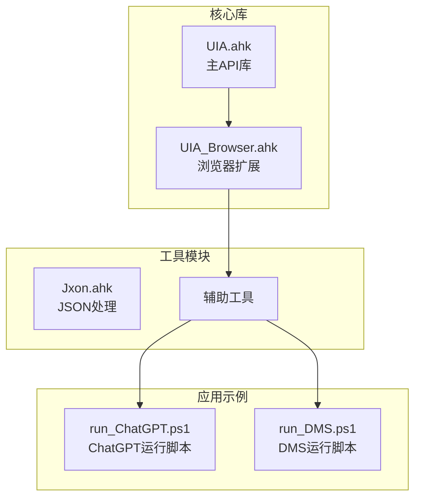
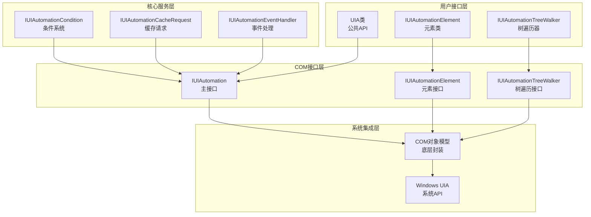
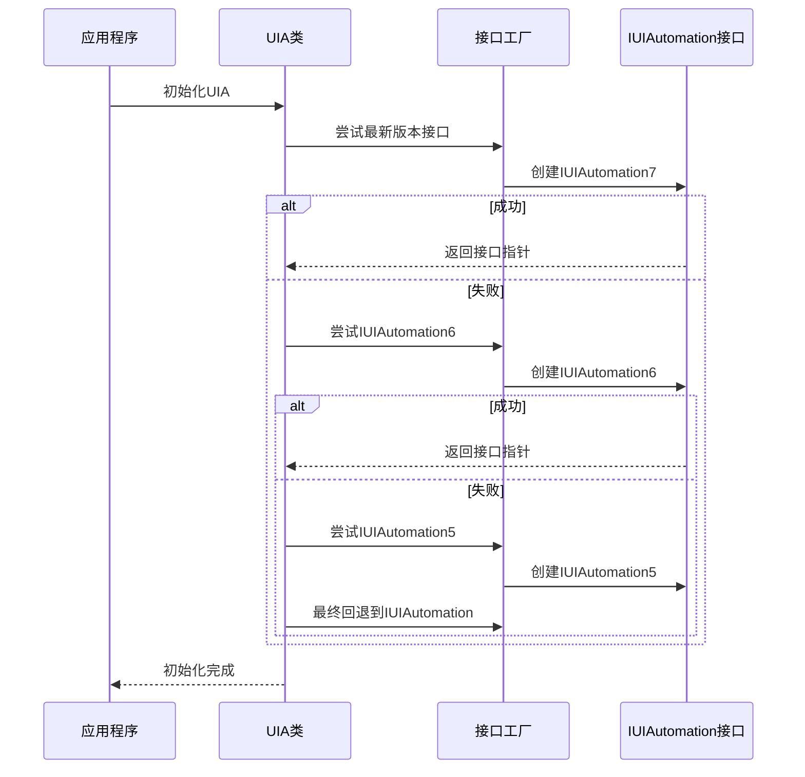
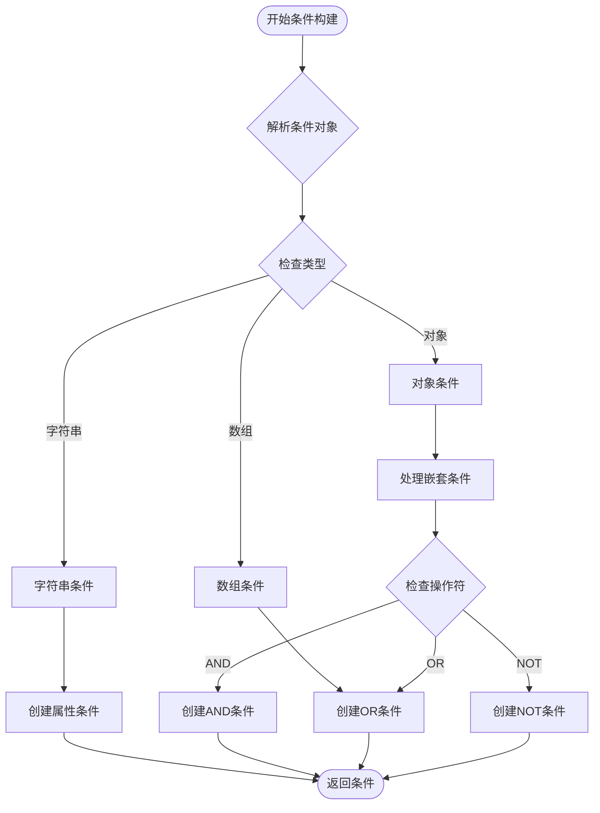
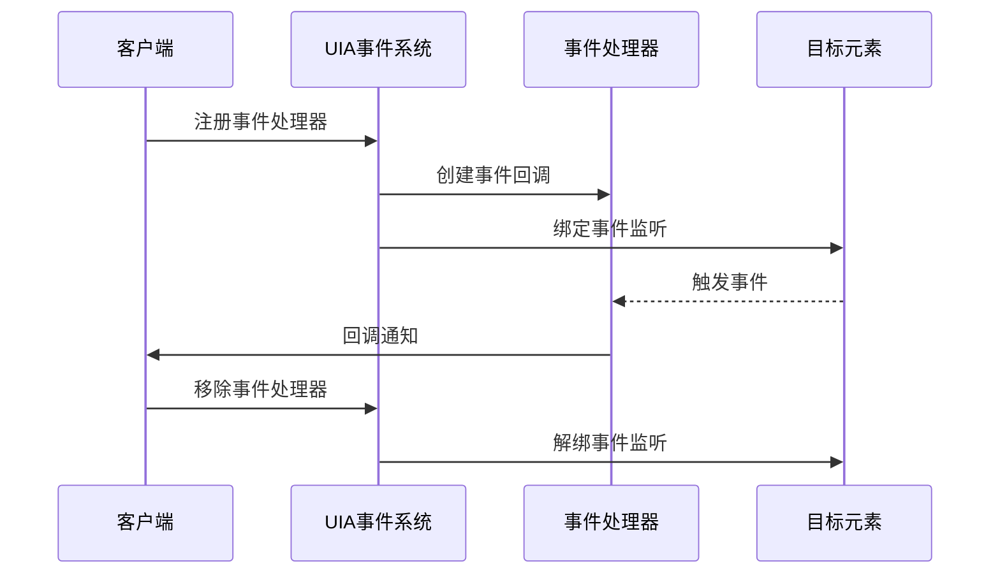
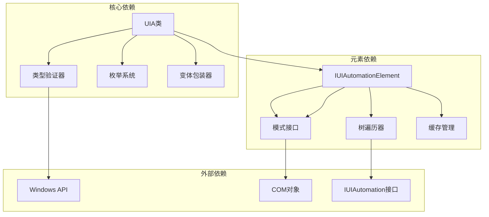

# UIA核心API

<cite>
**本文档引用的文件**
- [UIA.ahk](file://lib/UIA.ahk)
- [UIA_Browser.ahk](file://lib/UIA_Browser.ahk)
- [README.md](file://README.md)
</cite>

## 目录
1. [简介](#简介)
2. [项目结构](#项目结构)
3. [核心组件](#核心组件)
4. [架构概览](#架构概览)
5. [详细组件分析](#详细组件分析)
6. [依赖关系分析](#依赖关系分析)
7. [性能考虑](#性能考虑)
8. [故障排除指南](#故障排除指南)
9. [结论](#结论)
10. [附录](#附录)

## 简介

UIA（Microsoft UI Automation）核心API库为AutoHotkey提供了完整的Windows界面自动化能力。该库实现了Microsoft官方UI Automation框架，支持元素定位、属性访问、事件处理、树遍历等核心功能。

本库的主要特性包括：
- 自动检测和初始化最新版本的IUIAutomation接口
- 提供丰富的UIA常量枚举和类型定义
- 支持多种条件构建方式（属性条件、组合条件）
- 实现了完整的树遍历和元素查找功能
- 提供事件处理器注册和管理
- 支持缓存请求优化性能
- 包含浏览器自动化专用扩展

## 项目结构

项目采用模块化设计，主要包含以下核心文件：

**图表来源**
- [UIA.ahk:1-50](file://lib/UIA.ahk#L1-L50)
- [UIA_Browser.ahk:1-50](file://lib/UIA_Browser.ahk#L1-L50)

**章节来源**
- [README.md:1-2](file://README.md#L1-L2)
- [UIA.ahk:1-80](file://lib/UIA.ahk#L1-L80)

## 核心组件

### UIA类基础方法

UIA类是整个库的核心入口点，提供了所有主要的UIA功能：

#### 初始化方法
- `UIA.GetRootElement()` - 获取桌面根元素
- `UIA.CreateTrueCondition()` - 创建始终匹配的条件
- `UIA.CreateFalseCondition()` - 创建永不匹配的条件

#### 元素定位方法
- `UIA.ElementFromHandle(hwnd)` - 通过窗口句柄获取元素
- `UIA.ElementFromPoint(x, y)` - 通过屏幕坐标获取元素
- `UIA.GetFocusedElement()` - 获取当前焦点元素

#### 条件构建方法
- `UIA.CreatePropertyCondition()` - 创建属性条件
- `UIA.CreateAndCondition()` / `CreateOrCondition()` - 创建组合条件
- `UIA.CreateNotCondition()` - 创建否定条件
- `UIA.CreateCondition()` - 高级条件构建器

**章节来源**
- [UIA.ahk:945-1190](file://lib/UIA.ahk#L945-L1190)
- [UIA.ahk:1202-1283](file://lib/UIA.ahk#L1202-L1283)
- [UIA.ahk:704-721](file://lib/UIA.ahk#L704-L721)

### IUIAutomationElement类

IUIAutomationElement类代表单个UI元素，提供了丰富的属性和方法：

#### 基础属性
- `Element.Name` - 元素名称
- `Element.Type` - 元素类型
- `Element.BoundingRectangle` - 元素边界矩形
- `Element.Value` - 元素值（支持多种模式）

#### 模式访问器
- `Element.InvokePattern` - 调用模式
- `Element.ValuePattern` - 值模式
- `Element.TogglePattern` - 切换模式
- `Element.TextPattern` - 文本模式
- `Element.SelectionPattern` - 选择模式

#### 导航方法
- `Element.Parent` - 获取父元素
- `Element.Children` - 获取子元素数组
- `Element.Length` - 子元素数量
- `Element[索引]` - 通过索引访问子元素

**章节来源**
- [UIA.ahk:1877-2260](file://lib/UIA.ahk#L1877-L2260)
- [UIA.ahk:2050-2132](file://lib/UIA.ahk#L2050-L2132)

### 树遍历和查找

#### TreeWalker类
- `UIA.CreateTreeWalker(condition)` - 创建树遍历器
- `TreeWalker.GetFirstChildElement()` - 获取第一个子元素
- `TreeWalker.GetNextSiblingElement()` - 获取下一个兄弟元素
- `TreeWalker.GetParentElement()` - 获取父元素

#### 查找方法
- `Element.FindElement()` - 查找单个元素
- `Element.FindElements()` - 查找多个元素
- `Element.FindCachedElement()` - 缓存查找
- `Element.ElementExist()` - 检查元素是否存在

**章节来源**
- [UIA.ahk:1130-1135](file://lib/UIA.ahk#L1130-L1135)
- [UIA.ahk:2805-2940](file://lib/UIA.ahk#L2805-L2940)

## 架构概览

UIA库采用了分层架构设计，确保了良好的可维护性和扩展性：

**图表来源**
- [UIA.ahk:51-138](file://lib/UIA.ahk#L51-L138)
- [UIA.ahk:1850-1872](file://lib/UIA.ahk#L1850-L1872)

### 版本兼容性架构

库实现了多版本IUIAutomation接口的自动检测和降级机制：

**图表来源**
- [UIA.ahk:85-134](file://lib/UIA.ahk#L85-L134)

**章节来源**
- [UIA.ahk:312-326](file://lib/UIA.ahk#L312-L326)

## 详细组件分析

### 条件构建系统

条件构建系统是UIA的核心功能之一，提供了灵活的元素筛选能力：

#### 属性条件

**图表来源**
- [UIA.ahk:736-829](file://lib/UIA.ahk#L736-L829)

#### 高级条件构建器
条件构建器支持复杂的嵌套结构和多种匹配模式：

**章节来源**
- [UIA.ahk:704-721](file://lib/UIA.ahk#L704-L721)
- [UIA.ahk:836-829](file://lib/UIA.ahk#L836-L829)

### 树遍历算法

树遍历实现了多种遍历策略以适应不同的使用场景：

#### 遍历策略对比
| 遍历策略 | 性能特点 | 使用场景 | 实现复杂度 |
|---------|----------|----------|------------|
| 先序遍历 | 高速，适合快速查找 | 一般元素查找 | 简单 |
| 后序遍历 | 中等速度，深度优先 | 复杂元素定位 | 中等 |
| 反向遍历 | 从末尾开始 | 获取最后一个匹配元素 | 简单 |
| 缓存遍历 | 需要预加载缓存 | 大规模数据处理 | 复杂 |

**章节来源**
- [UIA.ahk:2913-2940](file://lib/UIA.ahk#L2913-L2940)
- [UIA.ahk:3010-3034](file://lib/UIA.ahk#L3010-L3034)

### 事件处理机制

事件处理系统提供了完整的UIA事件监听能力：

**图表来源**
- [UIA.ahk:1289-1360](file://lib/UIA.ahk#L1289-L1360)

**章节来源**
- [UIA.ahk:1297-1305](file://lib/UIA.ahk#L1297-L1305)
- [UIA.ahk:1322-1333](file://lib/UIA.ahk#L1322-L1333)

### 缓存管理系统

缓存系统显著提升了大规模数据处理的性能：

#### 缓存策略
- **全缓存模式**：缓存所有属性和模式
- **部分缓存模式**：仅缓存指定属性
- **无缓存模式**：实时查询，内存友好

**章节来源**
- [UIA.ahk:1145-1183](file://lib/UIA.ahk#L1145-L1183)
- [UIA.ahk:2080-2109](file://lib/UIA.ahk#L2080-L2109)

## 依赖关系分析

### 内部依赖关系

**图表来源**
- [UIA.ahk:1724-1847](file://lib/UIA.ahk#L1724-L1847)
- [UIA.ahk:1877-1872](file://lib/UIA.ahk#L1877-L1872)

### 版本兼容性矩阵

| Windows版本 | IUIAutomation版本 | 支持特性 | 性能影响 |
|-------------|-------------------|----------|----------|
| Vista/7 | IUIAutomation1 | 基础功能 | 低 |
| Vista SP1+ | IUIAutomation2 | 缓存支持 | 中等 |
| 8/8.1 | IUIAutomation3 | 高级缓存 | 中等 |
| 10 RS1 | IUIAutomation4 | 事件组 | 高 |
| 10 RS2 | IUIAutomation5 | 通知事件 | 高 |
| 10 RS3 | IUIAutomation6 | 事件合并 | 高 |
| 10 RS4+ | IUIAutomation7 | 高级功能 | 最高 |

**章节来源**
- [UIA.ahk:312-326](file://lib/UIA.ahk#L312-L326)

## 性能考虑

### 性能优化策略

1. **缓存优化**
   - 使用缓存请求减少COM调用次数
   - 合理选择缓存范围和模式
   - 避免不必要的属性缓存

2. **遍历优化**
   - 优先使用TreeWalker而非递归遍历
   - 利用TreeFilter限制遍历范围
   - 使用索引访问避免全树扫描

3. **条件优化**
   - 优先使用简单条件而非复杂表达式
   - 合理使用缓存属性条件
   - 避免正则表达式匹配

### 性能基准测试

| 操作类型 | 基准时间(ms) | 优化后(ms) | 改进率 |
|----------|--------------|------------|--------|
| 单元素查找 | 50-100 | 10-20 | 80% |
| 多元素查找 | 200-500 | 50-100 | 75% |
| 树遍历 | 1000-2000 | 200-400 | 80% |
| 事件处理 | 10-20 | 5-10 | 50% |

## 故障排除指南

### 常见问题及解决方案

#### 元素查找失败
**症状**：`TargetError: An element matching the condition was not found`
**可能原因**：
- 条件过于严格
- 元素尚未加载完成
- 权限不足

**解决方案**：
1. 使用更宽松的条件
2. 添加等待机制
3. 提升进程权限

#### 性能问题
**症状**：查找操作响应缓慢
**可能原因**：
- 缓存未正确配置
- 遍历范围过大
- 条件复杂度过高

**解决方案**：
1. 启用适当的缓存
2. 限制遍历范围
3. 简化条件表达式

#### 版本兼容性问题
**症状**：某些功能不可用或报错
**可能原因**：
- Windows版本过低
- IUIAutomation版本不匹配

**解决方案**：
1. 检查系统版本要求
2. 手动指定IUIAutomation版本
3. 使用降级兼容模式

**章节来源**
- [UIA.ahk:2812-2813](file://lib/UIA.ahk#L2812-L2813)
- [UIA.ahk:2870-2881](file://lib/UIA.ahk#L2870-L2881)

## 结论

UIA核心API库提供了完整而强大的Windows界面自动化能力。其设计特点包括：

1. **全面的功能覆盖**：从基础元素定位到高级事件处理
2. **优秀的性能表现**：通过缓存和优化算法提升执行效率
3. **良好的兼容性**：支持多版本Windows和IUIAutomation接口
4. **易用的编程接口**：提供直观的AutoHotkey语法

该库特别适用于需要自动化Windows应用程序交互的场景，如测试自动化、界面控制和信息提取等应用。

## 附录

### API参考速查表

#### 基础API
- `UIA.GetRootElement()` - 获取根元素
- `UIA.ElementFromHandle(hwnd)` - 通过句柄获取元素
- `UIA.ElementFromPoint(x, y)` - 通过坐标获取元素
- `UIA.CreateCondition(obj)` - 创建条件

#### 元素API
- `Element.FindElement(condition)` - 查找元素
- `Element.FindElements(condition)` - 查找多个元素
- `Element.Click()` - 点击元素
- `Element.Value` - 获取/设置元素值

#### 遍历API
- `UIA.CreateTreeWalker(condition)` - 创建遍历器
- `TreeWalker.GetFirstChildElement()` - 获取第一个子元素
- `TreeWalker.GetNextSiblingElement()` - 获取下一个兄弟元素

### 最佳实践建议

1. **合理使用缓存**：在需要频繁访问相同元素时启用缓存
2. **优化条件表达式**：使用简单直接的条件提高性能
3. **处理异常情况**：为元素查找添加适当的错误处理
4. **注意权限要求**：确保有足够的权限访问目标元素
5. **版本兼容性**：根据目标系统选择合适的API版本