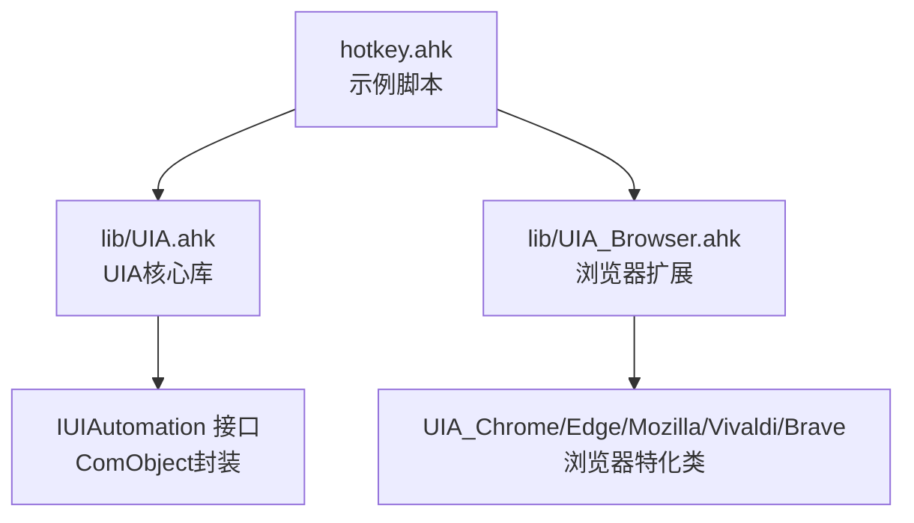
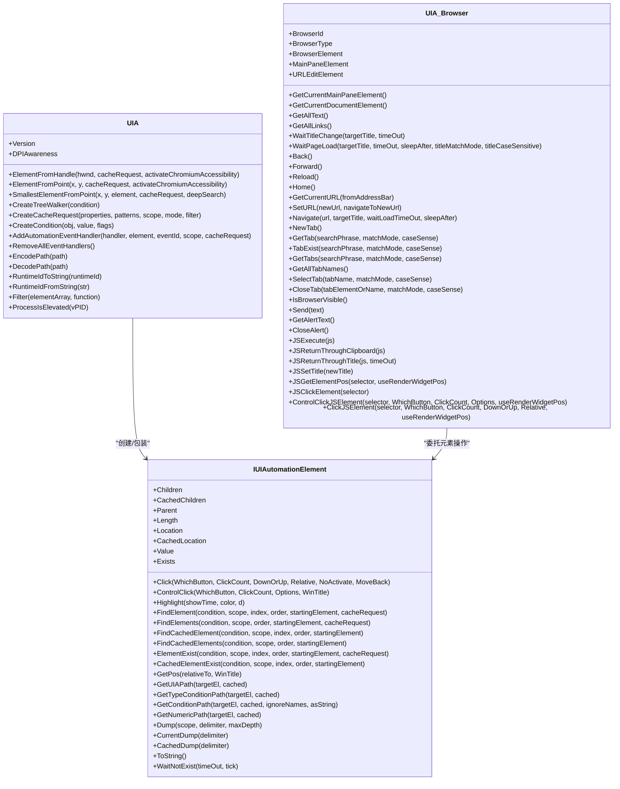
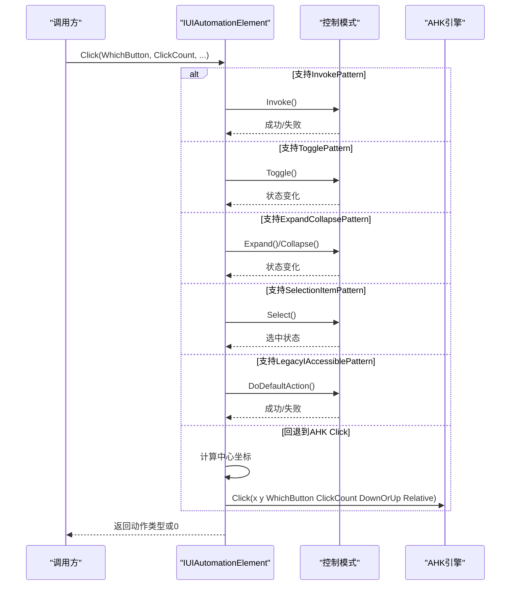
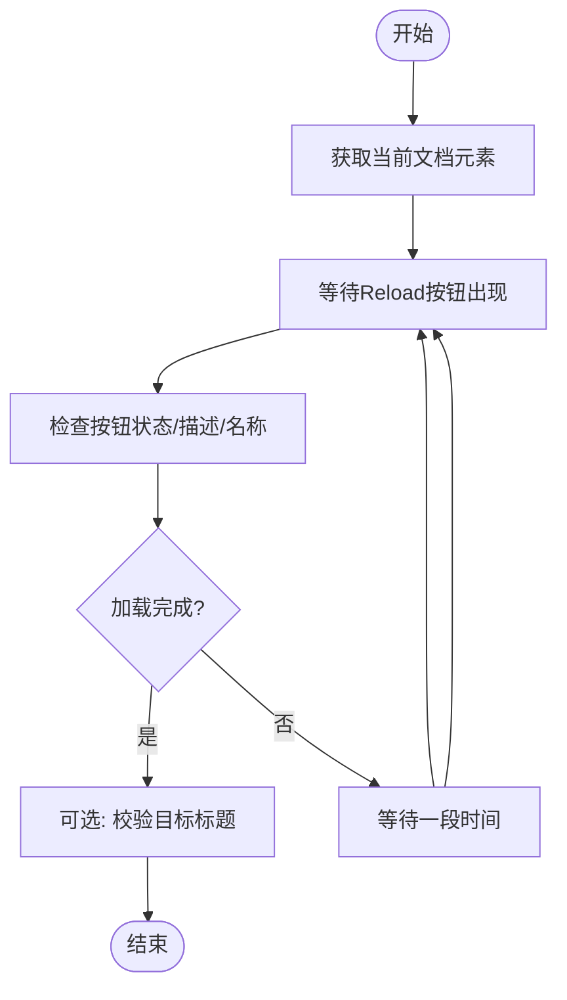
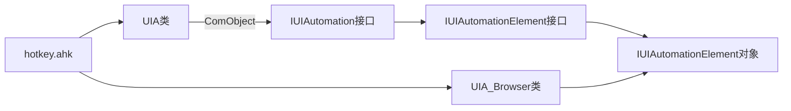

# UI自动化API

<cite>
**本文档引用的文件**
- [UIA.ahk](file://lib/UIA.ahk)
- [UIA_Browser.ahk](file://lib/UIA_Browser.ahk)
- [hotkey.ahk](file://hotkey.ahk)
- [README.md](file://README.md)
</cite>

## 目录
1. [简介](#简介)
2. [项目结构](#项目结构)
3. [核心组件](#核心组件)
4. [架构总览](#架构总览)
5. [详细组件分析](#详细组件分析)
6. [依赖关系分析](#依赖关系分析)
7. [性能考虑](#性能考虑)
8. [故障排除指南](#故障排除指南)
9. [结论](#结论)
10. [附录](#附录)

## 简介
本文件系统性梳理了基于AutoHotkey v2的UI自动化API，重点覆盖Microsoft UIA框架的核心能力与浏览器扩展。内容包括：
- UIA基础API：元素定位（ElementFromHandle、ElementFromPoint、SmallestElementFromPoint、FindElement）、元素属性访问、事件处理机制、缓存与遍历、坐标转换等
- 元素操作方法：Value、Click、ControlClick、Highlight、WaitNotExist、GetPos、GetUIAPath等
- 浏览器UIA扩展：UIA_Browser及其Chrome/Edge/Mozilla/Vivaldi/Brave子类，提供地址栏、标签页、页面加载、JS执行等高级能力
- 参数校验、返回值类型、性能优化与最佳实践
- 高级用法模式：条件构建、缓存请求、事件处理器组、跨版本兼容

本库通过ComObject封装IUIAutomation接口，提供面向对象的语法糖与便捷方法，降低UIA使用的复杂度。

## 项目结构
项目采用模块化组织，核心位于lib目录：
- lib/UIA.ahk：UIA核心库，封装IUIAutomation接口及元素对象
- lib/UIA_Browser.ahk：浏览器自动化扩展，针对Chrome/Edge/Mozilla/Vivaldi/Brave提供特化能力
- hotkey.ahk：示例脚本，演示如何引入UIA与UIA_Browser，并结合UIA定位应用元素
- README.md：项目简述

**图表来源**
- [hotkey.ahk:1-20](file://hotkey.ahk#L1-L20)
- [UIA.ahk:1-120](file://lib/UIA.ahk#L1-L120)
- [UIA_Browser.ahk:1-120](file://lib/UIA_Browser.ahk#L1-L120)

**章节来源**
- [README.md:1-2](file://README.md#L1-L2)
- [hotkey.ahk:1-20](file://hotkey.ahk#L1-L20)

## 核心组件
- UIA类：静态入口，负责初始化IUIAutomation接口、版本协商、常量枚举、条件构造、事件注册、缓存请求、坐标转换等
- IUIAutomationElement类：元素对象，提供属性访问、模式访问、遍历、查找、点击、高亮、路径生成等方法
- UIA_Browser类族：浏览器自动化抽象，按浏览器类型分派具体实现，提供地址栏、标签页、导航、JS执行等能力

关键特性：
- 条件构建：支持AND/OR/NOT、字符串匹配模式（Exact/Substring/StartsWith/RegEx）、大小写敏感、索引参数
- 缓存策略：CreateCacheRequest、BuildUpdatedCache、Cached属性访问，显著提升性能
- 事件系统：AddAutomationEventHandler/AddPropertyChangedEventHandler/AddStructureChangedEventHandler等，支持事件处理器组
- 浏览器扩展：针对Chromium/Electron/Gecko等渲染器的特殊处理（WM_GETOBJECT激活可访问性）

**章节来源**
- [UIA.ahk:51-180](file://lib/UIA.ahk#L51-L180)
- [UIA.ahk:1800-2399](file://lib/UIA.ahk#L1800-L2399)
- [UIA_Browser.ahk:458-520](file://lib/UIA_Browser.ahk#L458-L520)

## 架构总览
UIA核心通过ComObject桥接到Windows UIA COM接口，UIA类负责高层封装，IUIAutomationElement类提供元素级操作。浏览器扩展在UIA之上增加对浏览器UI的特化支持。

**图表来源**
- [UIA.ahk:51-180](file://lib/UIA.ahk#L51-L180)
- [UIA.ahk:1877-2399](file://lib/UIA.ahk#L1877-L2399)
- [UIA_Browser.ahk:458-800](file://lib/UIA_Browser.ahk#L458-L800)

## 详细组件分析

### UIA类（静态入口与工厂）
- 初始化与版本协商：自动选择可用的IUIAutomation版本，支持自定义DLL路径与最大版本限制
- 常量与枚举：Type/Pattern/Event/Property/TextAttribute等，提供名称到ID映射与校验
- 条件构建：CreateCondition支持嵌套对象/数组/Not，支持MatchMode/CaseSense/flags
- 元素定位：ElementFromHandle/ElementFromPoint/SmallestElementFromPoint，支持Chromium可访问性激活
- 缓存与遍历：CreateCacheRequest/BuildUpdatedCache/Cached属性访问，提高性能
- 事件系统：Add/Remove各类事件处理器，支持事件处理器组
- 辅助工具：EncodePath/DecodePath、RuntimeId转换、DPI感知、进程权限检测

参数与返回值要点：
- ElementFromHandle/ElementFromPoint：返回IUIAutomationElement或抛出TargetError
- CreateCondition/CreatePropertyCondition：返回IUIAutomationCondition
- CreateCacheRequest：返回IUIAutomationCacheRequest
- Add*EventHandler：无返回值（void），移除同名方法
- EncodePath/DecodePath：字符串与数组互转UIA路径

性能与可靠性：
- 对Chromium应用优先启用ActivateChromiumAccessibility，避免UIA不可见问题
- 缓存请求应仅包含必要属性，避免过度缓存导致内存压力
- 使用FindCachedElement/FindCachedElements在已缓存树内查找，显著提升速度

**章节来源**
- [UIA.ahk:844-1099](file://lib/UIA.ahk#L844-L1099)
- [UIA.ahk:1130-1599](file://lib/UIA.ahk#L1130-L1599)
- [UIA.ahk:1600-2399](file://lib/UIA.ahk#L1600-L2399)

### IUIAutomationElement类（元素对象）
- 属性访问：Current*与Cached*属性，自动解析Property枚举
- 模式访问：Invoke/Value/RangeValue/Scroll/ExpandCollapse/Grid/Table/Text/Toggle/Transform等
- 遍历与查找：Children/CachedChildren、FindElement/FindElements、FindCachedElement/FindCachedElements
- 操作方法：Click/ControlClick/Highlight/WaitNotExist/GetPos/GetUIAPath等
- 路径生成：GetUIAPath/GetTypeConditionPath/GetConditionPath/GetNumericPath

典型流程（以Click为例）：
- 优先尝试Invoke/Toggle/ExpandCollapse/SelectionItem/LegacyIAccessible等“点击式”模式
- 若未命中，则计算元素中心坐标，调用AHK Click或ControlClick

**图表来源**
- [UIA.ahk:2550-2646](file://lib/UIA.ahk#L2550-L2646)

**章节来源**
- [UIA.ahk:1877-2399](file://lib/UIA.ahk#L1877-L2399)

### 浏览器UIA扩展（UIA_Browser）
- 抽象层：UIA_Browser统一接口，按浏览器类型分派到具体实现
- Chrome/Edge/Mozilla/Vivaldi/Brave：针对不同浏览器UI特征定制元素定位与操作
- 核心能力：地址栏、导航按钮、标签栏、文档区域、页面加载状态监控、JS执行与返回、弹窗处理、元素位置与点击

典型流程（以WaitPageLoad为例）：
- 通过Reload按钮的描述/名称/启用状态判断页面是否加载完成
- 支持目标标题匹配与超时控制

**图表来源**
- [UIA_Browser.ahk:730-760](file://lib/UIA_Browser.ahk#L730-L760)

**章节来源**
- [UIA_Browser.ahk:458-800](file://lib/UIA_Browser.ahk#L458-L800)

### 示例脚本（hotkey.ahk）
- 引入UIA与UIA_Browser
- 使用UIA.ElementFromHandle定位应用窗口元素
- 通过UIA定位输入框并设置Value，模拟回车确认

**章节来源**
- [hotkey.ahk:1-20](file://hotkey.ahk#L1-L20)
- [hotkey.ahk:273-294](file://hotkey.ahk#L273-L294)

## 依赖关系分析
- UIA类依赖Windows UIA COM接口，通过ComObject桥接
- IUIAutomationElement持有IUIAutomationElement指针，封装属性与方法访问
- UIA_Browser依赖UIA类提供的元素定位与条件构建能力
- 示例脚本hotkey.ahk依赖UIA与UIA_Browser实现具体业务

**图表来源**
- [UIA.ahk:51-180](file://lib/UIA.ahk#L51-L180)
- [UIA_Browser.ahk:458-520](file://lib/UIA_Browser.ahk#L458-L520)
- [hotkey.ahk:1-20](file://hotkey.ahk#L1-L20)

**章节来源**
- [UIA.ahk:51-180](file://lib/UIA.ahk#L51-L180)
- [UIA_Browser.ahk:458-520](file://lib/UIA_Browser.ahk#L458-L520)
- [hotkey.ahk:1-20](file://hotkey.ahk#L1-L20)

## 性能考虑
- 优先使用缓存：通过CreateCacheRequest指定所需属性与模式，配合BuildUpdatedCache减少重复查询
- 限定作用域：TreeScope尽量使用Children/Element，避免Descendants/Subtree带来的大规模遍历
- 条件优化：使用CreateCondition而非纯UIA条件，避免RegEx/StartsWith等低效匹配
- 避免过度高亮：Highlight用于调试，生产环境应谨慎使用
- Chromium可访问性：首次激活可能耗时，建议在会话内复用已激活元素
- DPI感知：在多显示器场景下设置合适的DPI感知级别，避免坐标偏移

## 故障排除指南
常见问题与解决思路：
- 元素未找到（TargetError）：检查条件是否过于严格，适当放宽匹配模式或扩大TreeScope；确认元素是否可见或延迟生成
- 事件未触发：确保事件处理器注册在正确元素与范围内；注意事件处理器生命周期与引用计数
- Chromium页面不可见：调用ActivateChromiumAccessibility或ElementFromChromium；必要时激活窗口
- 坐标异常：设置UIA.DPIAwareness或使用GetPos获取相对坐标
- 权限不足：某些进程需管理员权限，可通过ProcessIsElevated检测

**章节来源**
- [UIA.ahk:844-1099](file://lib/UIA.ahk#L844-L1099)
- [UIA.ahk:1285-1360](file://lib/UIA.ahk#L1285-L1360)
- [UIA.ahk:620-635](file://lib/UIA.ahk#L620-L635)

## 结论
本UI自动化API在AutoHotkey v2环境下提供了对Windows UIA的完整封装，既保持了底层接口的灵活性，又通过面向对象的设计降低了使用门槛。结合浏览器扩展，能够高效地完成复杂界面的自动化任务。建议在实际项目中：
- 合理使用缓存与作用域，平衡性能与准确性
- 针对不同浏览器与应用特性定制条件与路径
- 注重事件处理与错误恢复，提升稳定性

## 附录

### API速查表（节选）
- 元素定位
  - ElementFromHandle(hwnd, cacheRequest?, activateChromiumAccessibility?) → IUIAutomationElement
  - ElementFromPoint(x?, y?, cacheRequest?, activateChromiumAccessibility?) → IUIAutomationElement
  - SmallestElementFromPoint(x?, y?, element?, cacheRequest?, deepSearch?) → IUIAutomationElement
  - ElementFromChromium(winTitle?, activateChromiumAccessibility?, cacheRequest?) → IUIAutomationElement
- 条件与查找
  - CreateCondition(obj, value?, flags?) → IUIAutomationCondition
  - CreatePropertyCondition(propertyId, value, variant?) → IUIAutomationPropertyCondition
  - FindElement(condition, scope?, index?, order?, startingElement?, cacheRequest?) → IUIAutomationElement
  - FindElements(condition, scope?, order?, startingElement?, cacheRequest?) → IUIAutomationElement[]
  - FindCachedElement/FindCachedElements：基于缓存树的查找
- 缓存与遍历
  - CreateCacheRequest(properties?, patterns?, scope?, mode?, filter?) → IUIAutomationCacheRequest
  - BuildUpdatedCache(cacheRequest) → IUIAutomationElement
  - CachedChildren/Children/CachedParent/Parent
- 事件处理
  - AddAutomationEventHandler(handler, element, eventId, scope?, cacheRequest?)
  - AddPropertyChangedEventHandler(handler, element, propertyArray, scope?, cacheRequest?)
  - AddStructureChangedEventHandler(handler, element, scope?, cacheRequest?)
  - AddFocusChangedEventHandler(handler, cacheRequest?)
  - AddTextEditTextChangedEventHandler(handler, element, textEditChangeType, scope?, cacheRequest?)
  - AddChangesEventHandler(handler, element, changeTypes, scope?, cacheRequest?)
  - AddNotificationEventHandler(handler, element, scope?, cacheRequest?)
  - AddActiveTextPositionChangedEventHandler(handler, element, scope?, cacheRequest?)
  - Remove*/RemoveAllEventHandlers
- 路径与工具
  - EncodePath(path) → String
  - DecodePath(path) → Array
  - RuntimeIdToString/runtimeIdFromString
  - Filter(elementArray, function) → IUIAutomationElement[]
  - DPIAwareness（属性）
  - ProcessIsElevated(vPID) → Integer

**章节来源**
- [UIA.ahk:844-1599](file://lib/UIA.ahk#L844-L1599)
- [UIA.ahk:1600-2399](file://lib/UIA.ahk#L1600-L2399)