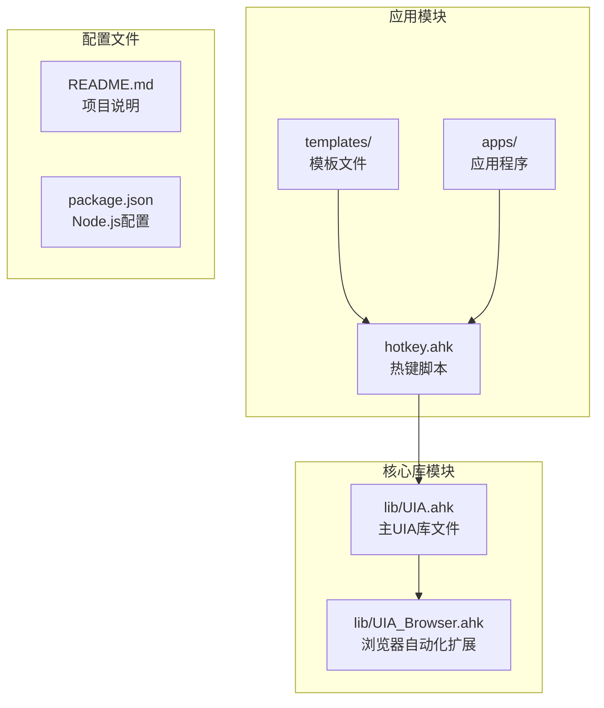
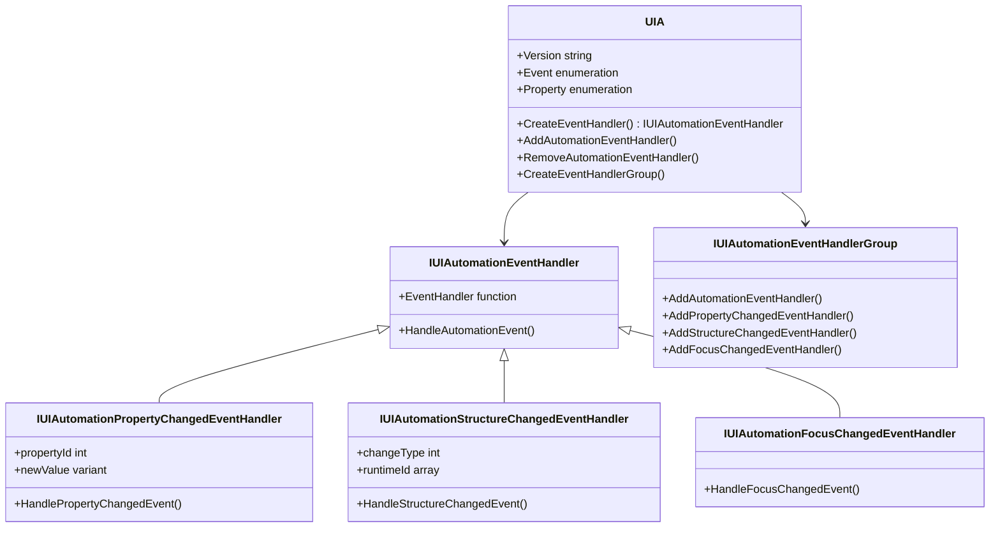
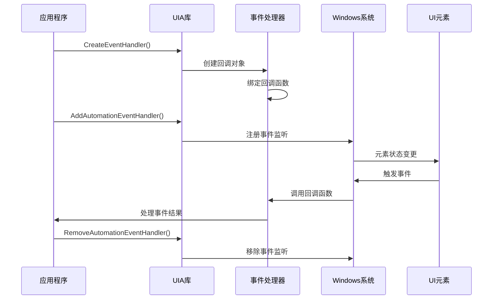
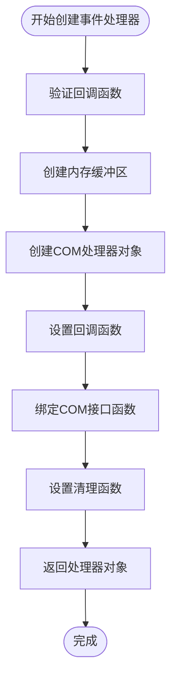
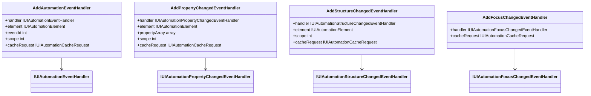
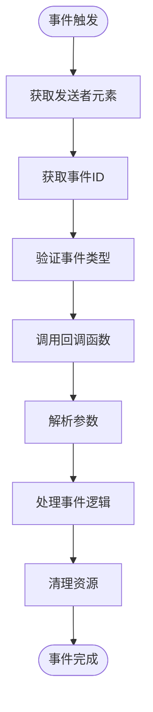
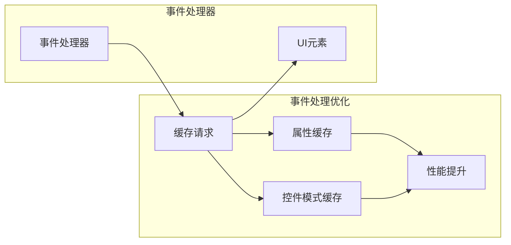
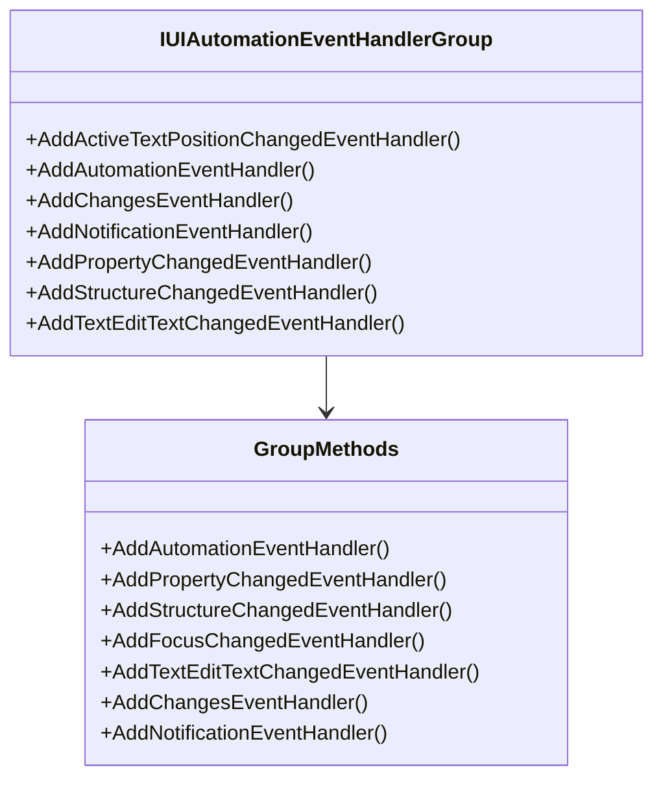
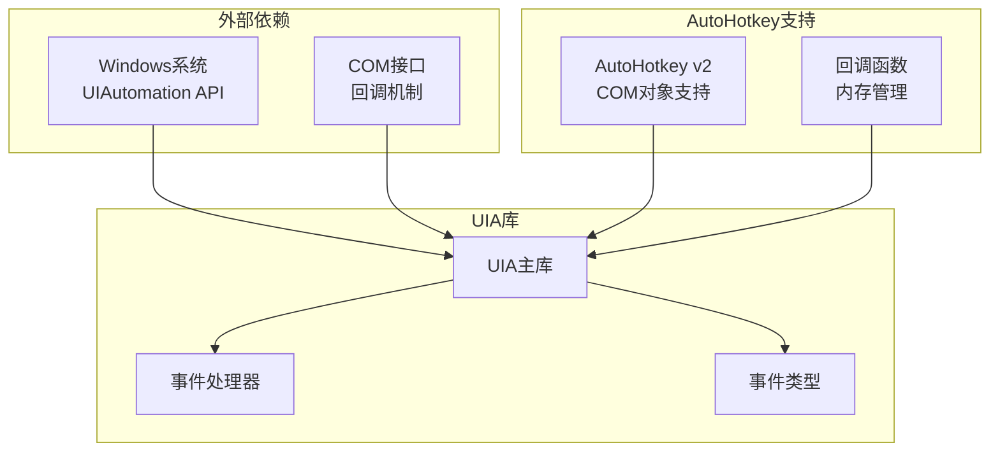

# 事件处理API

<cite>
**本文档引用的文件**
- [UIA.ahk](file://lib/UIA.ahk)
- [UIA_Browser.ahk](file://lib/UIA_Browser.ahk)
- [README.md](file://README.md)
</cite>

## 目录
1. [简介](#简介)
2. [项目结构](#项目结构)
3. [核心组件](#核心组件)
4. [架构概览](#架构概览)
5. [详细组件分析](#详细组件分析)
6. [依赖关系分析](#依赖关系分析)
7. [性能考虑](#性能考虑)
8. [故障排除指南](#故障排除指南)
9. [结论](#结论)

## 简介

UIA事件处理API是AutoHotkey v2项目中用于Microsoft UI Automation框架的核心模块，提供了完整的事件监听和处理机制。该库实现了Windows系统提供的所有UI自动化事件类型，包括属性变更事件、结构变更事件、焦点变更事件等，为自动化测试、屏幕阅读器支持和无障碍技术开发提供了强大的基础。

该库的主要特点包括：
- 支持所有标准UIA事件类型（AutomationPropertyChanged、StructureChanged、MenuOpened等）
- 提供事件处理器创建和管理功能
- 实现事件过滤和性能优化机制
- 支持多种事件监听模式和作用域
- 包含完整的错误处理和资源清理机制

## 项目结构

该项目采用模块化设计，主要包含以下核心文件：



**图表来源**
- [UIA.ahk](file://lib/UIA.ahk)
- [UIA_Browser.ahk](file://lib/UIA_Browser.ahk)
- [README.md](file://README.md)

**章节来源**
- [README.md:1-2](file://README.md#L1-L2)

## 核心组件

UIA事件处理API的核心组件包括事件处理器类、事件类型枚举和事件管理方法。这些组件共同构成了完整的事件处理体系。

### 事件处理器类层次结构



**图表来源**
- [UIA.ahk:5183-5214](file://lib/UIA.ahk#L5183-L5214)
- [UIA.ahk:5216-5297](file://lib/UIA.ahk#L5216-L5297)

### 事件类型枚举

UIA库定义了完整的事件类型枚举，覆盖了所有标准UIA事件：

| 事件类型 | 值 | 描述 |
|---------|----|------|
| ToolTipOpened | 20000 | 工具提示打开事件 |
| ToolTipClosed | 20001 | 工具提示关闭事件 |
| StructureChanged | 20002 | 结构变更事件 |
| MenuOpened | 20003 | 菜单打开事件 |
| AutomationPropertyChanged | 20004 | 属性变更事件 |
| AutomationFocusChanged | 20005 | 焦点变更事件 |
| AsyncContentLoaded | 20006 | 异步内容加载完成事件 |
| MenuClosed | 20007 | 菜单关闭事件 |
| LayoutInvalidated | 20008 | 布局失效事件 |
| Invoke_Invoked | 20009 | 调用事件 |
| SelectionItem_ElementAddedToSelection | 20010 | 选择项添加事件 |
| SelectionItem_ElementRemovedFromSelection | 20011 | 选择项移除事件 |
| SelectionItem_ElementSelected | 20012 | 选择项选中事件 |
| Selection_Invalidated | 20013 | 选择失效事件 |
| Text_TextSelectionChanged | 20014 | 文本选择变更事件 |
| Text_TextChanged | 20015 | 文本变更事件 |
| Window_WindowOpened | 20016 | 窗口打开事件 |
| Window_WindowClosed | 20017 | 窗口关闭事件 |
| MenuModeStart | 20018 | 菜单模式开始事件 |
| MenuModeEnd | 20019 | 菜单模式结束事件 |
| InputReachedTarget | 20020 | 输入到达目标事件 |
| InputReachedOtherElement | 20021 | 输入到达其他元素事件 |
| InputDiscarded | 20022 | 输入丢弃事件 |
| SystemAlert | 20023 | 系统警报事件 |
| LiveRegionChanged | 20024 | 实时区域变更事件 |
| HostedFragmentRootsInvalidated | 20025 | 托管片段根失效事件 |
| Drag_DragStart | 20026 | 拖拽开始事件 |
| Drag_DragCancel | 20027 | 拖拽取消事件 |
| Drag_DragComplete | 20028 | 拖拽完成事件 |
| DropTarget_DragEnter | 20029 | 拖拽进入目标事件 |
| DropTarget_DragLeave | 20030 | 拖拽离开目标事件 |
| DropTarget_Dropped | 20031 | 拖拽放置事件 |
| TextEdit_TextChanged | 20032 | 文本编辑变更事件 |
| TextEdit_ConversionTargetChanged | 20033 | 文本编辑转换目标变更事件 |
| Changes | 20034 | 变更事件 |
| Notification | 20035 | 通知事件 |
| ActiveTextPositionChanged | 20036 | 活动文本位置变更事件 |

**章节来源**
- [UIA.ahk:192-193](file://lib/UIA.ahk#L192-L193)

## 架构概览

UIA事件处理API采用了分层架构设计，从底层的COM接口调用到高层的事件处理器抽象，形成了完整的事件处理链路。



**图表来源**
- [UIA.ahk:5183-5200](file://lib/UIA.ahk#L5183-L5200)
- [UIA.ahk:1297-1305](file://lib/UIA.ahk#L1297-L1305)

### 事件处理流程

事件处理的核心流程包括事件注册、事件触发和事件回调三个阶段：

1. **事件注册阶段**：通过`CreateEventHandler`创建事件处理器，使用相应的`Add*EventHandler`方法注册事件监听
2. **事件触发阶段**：当UI元素状态发生变化时，Windows系统自动触发相应事件
3. **事件回调阶段**：事件处理器调用绑定的回调函数，传递事件相关信息

**章节来源**
- [UIA.ahk:5183-5214](file://lib/UIA.ahk#L5183-L5214)

## 详细组件分析

### 事件处理器创建机制

事件处理器的创建是整个事件处理系统的基础，它负责将AutoHotkey函数包装为COM兼容的事件处理器。

#### CreateEventHandler函数实现



**图表来源**
- [UIA.ahk:5183-5200](file://lib/UIA.ahk#L5183-L5200)

#### 回调函数绑定机制

事件处理器内部实现了完整的COM接口绑定机制：

| COM接口 | 函数名 | 功能描述 |
|---------|--------|----------|
| IUnknown | QueryInterface | 查询接口支持 |
| IUnknown | AddRef | 增加引用计数 |
| IUnknown | Release | 释放引用计数 |
| IUIAutomationEventHandler | HandleAutomationEvent | 处理自动化事件 |
| IUIAutomationPropertyChangedEventHandler | HandlePropertyChangedEvent | 处理属性变更事件 |
| IUIAutomationStructureChangedEventHandler | HandleStructureChangedEvent | 处理结构变更事件 |

**章节来源**
- [UIA.ahk:5201-5206](file://lib/UIA.ahk#L5201-L5206)
- [UIA.ahk:5216-5297](file://lib/UIA.ahk#L5216-L5297)

### 事件注册和注销机制

UIA库提供了多种事件注册方法，每种方法对应不同的事件类型和使用场景。

#### 自动化事件注册



**图表来源**
- [UIA.ahk:1297-1356](file://lib/UIA.ahk#L1297-L1356)

#### 事件注销机制

所有事件注册方法都配套提供了对应的注销方法：

| 事件类型 | 注册方法 | 注销方法 |
|----------|----------|----------|
| Automation事件 | AddAutomationEventHandler | RemoveAutomationEventHandler |
| 属性变更事件 | AddPropertyChangedEventHandler | RemovePropertyChangedEventHandler |
| 结构变更事件 | AddStructureChangedEventHandler | RemoveStructureChangedEventHandler |
| 焦点变更事件 | AddFocusChangedEventHandler | RemoveFocusChangedEventHandler |
| 文本编辑事件 | AddTextEditTextChangedEventHandler | RemoveTextEditTextChangedEventHandler |
| 变更事件 | AddChangesEventHandler | RemoveChangesEventHandler |
| 通知事件 | AddNotificationEventHandler | RemoveNotificationEventHandler |

**章节来源**
- [UIA.ahk:1297-1356](file://lib/UIA.ahk#L1297-L1356)
- [UIA.ahk:1473-1495](file://lib/UIA.ahk#L1473-L1495)

### 事件回调函数参数结构

不同类型的事件回调函数具有不同的参数结构，这取决于具体的事件类型和数据需求。

#### 标准自动化事件回调



**图表来源**
- [UIA.ahk:5219-5221](file://lib/UIA.ahk#L5219-L5221)

#### 属性变更事件回调参数

属性变更事件回调函数接收三个参数：
1. **sender** - 发送事件的UI元素对象
2. **propertyId** - 发生变更的属性ID
3. **newValue** - 新的属性值（经过COM变体转换）

#### 结构变更事件回调参数

结构变更事件回调函数接收三个参数：
1. **sender** - 发送事件的UI元素对象
2. **changeType** - 结构变更类型（如ChildAdded、ChildRemoved等）
3. **runtimeId** - 发生变更的子元素运行时ID数组

**章节来源**
- [UIA.ahk:5239-5256](file://lib/UIA.ahk#L5239-L5256)

### 事件过滤和性能优化

UIA库实现了多种事件过滤和性能优化机制，以提高事件处理的效率和准确性。

#### 事件作用域控制

事件处理器支持多种作用域选项，允许精确控制事件监听的范围：

| 作用域类型 | 值 | 描述 |
|------------|----|------|
| Element | 1 | 仅当前元素 |
| Children | 2 | 子元素 |
| Family | 3 | 当前元素+子元素 |
| Descendants | 4 | 后代元素 |
| Subtree | 7 | 当前元素+后代元素 |
| Parent | 8 | 父元素 |
| Ancestors | 16 | 祖先元素 |

#### 缓存请求优化

为了提高性能，UIA库支持在事件处理器中使用缓存请求：



**图表来源**
- [UIA.ahk:1145-1182](file://lib/UIA.ahk#L1145-L1182)

**章节来源**
- [UIA.ahk:1145-1182](file://lib/UIA.ahk#L1145-L1182)
- [UIA.ahk:1297-1356](file://lib/UIA.ahk#L1297-L1356)

### 事件处理器组管理

UIA库提供了事件处理器组的功能，允许一次性注册多个事件处理器，简化了复杂的事件监听场景。

#### 事件处理器组功能



**图表来源**
- [UIA.ahk:5299-5325](file://lib/UIA.ahk#L5299-L5325)

**章节来源**
- [UIA.ahk:5299-5325](file://lib/UIA.ahk#L5299-L5325)

## 依赖关系分析

UIA事件处理API的依赖关系相对简单，主要依赖于Windows系统的UIAutomation框架和AutoHotkey的COM支持。



**图表来源**
- [UIA.ahk:5183-5200](file://lib/UIA.ahk#L5183-L5200)

### 版本兼容性

UIA库支持多个版本的Windows UIAutomation接口，具有良好的向后兼容性：

| Windows版本 | 支持的UIA版本 | 特性支持 |
|-------------|---------------|----------|
| Windows 7 | IUIAutomation | 基础事件处理 |
| Windows 8 | IUIAutomation2 | 改进的性能 |
| Windows 10 | IUIAutomation3-4 | 高级事件类型 |
| Windows 11 | IUIAutomation5-7 | 最新特性 |

**章节来源**
- [UIA.ahk:312-326](file://lib/UIA.ahk#L312-L326)

## 性能考虑

UIA事件处理API在设计时充分考虑了性能优化，提供了多种机制来确保高效的事件处理。

### 内存管理优化

事件处理器使用智能的内存管理策略：

1. **引用计数管理**：通过COM接口的AddRef/Release机制确保正确的内存管理
2. **回调函数清理**：自动清理回调函数和相关资源
3. **对象生命周期**：确保事件处理器对象在适当的时机被销毁

### 事件过滤优化

通过作用域控制和条件过滤减少不必要的事件处理：

1. **作用域限制**：只监听需要的元素范围
2. **条件过滤**：使用UIA条件对象精确匹配事件源
3. **缓存机制**：预缓存常用属性和控件模式

### 并发安全考虑

UIA库遵循COM线程模型的安全要求：

1. **单线程注册**：不建议在多线程环境中同时注册或注销事件处理器
2. **延迟事件处理**：避免在注销事件处理器后立即销毁处理器对象
3. **资源清理**：确保在脚本退出时正确清理所有事件处理器

**章节来源**
- [UIA.ahk:1285-1287](file://lib/UIA.ahk#L1285-L1287)

## 故障排除指南

### 常见问题和解决方案

#### 事件处理器无法接收事件

**可能原因**：
1. 事件处理器未正确注册
2. 事件作用域设置不当
3. 条件过滤过于严格

**解决方法**：
```autohotkey
; 确保正确注册事件处理器
handler := UIA.CreateEventHandler(Func("OnEvent"))
UIA.AddAutomationEventHandler(handler, element, UIA.Event.AutomationPropertyChanged)

; 检查事件作用域
UIA.AddAutomationEventHandler(handler, element, UIA.Event.AutomationPropertyChanged, UIA.TreeScope.Descendants)

; 验证条件过滤
condition := UIA.CreatePropertyCondition(UIA.Property.Name, "按钮名称")
UIA.AddAutomationEventHandler(handler, element, UIA.Event.AutomationPropertyChanged, UIA.TreeScope.Descendants, condition)
```

#### 事件处理器内存泄漏

**解决方法**：
```autohotkey
; 正确注销事件处理器
UIA.RemoveAutomationEventHandler(handler, element, UIA.Event.AutomationPropertyChanged)

; 确保在脚本退出时清理
Cleanup := UIA.Cleanup()
```

#### 事件回调参数异常

**可能原因**：
1. COM变体类型转换错误
2. 事件数据格式不匹配

**解决方法**：
```autohotkey
; 在回调函数中进行类型检查
OnPropertyChanged(sender, propertyId, newValue) {
    try {
        ; 检查newValue类型
        if (IsObject(newValue)) {
            ; 处理对象类型
        } else {
            ; 处理基本类型
        }
    } catch {
        ; 处理转换错误
    }
}
```

**章节来源**
- [UIA.ahk:148-151](file://lib/UIA.ahk#L148-L151)

### 调试技巧

#### 启用事件调试

```autohotkey
; 创建事件处理器时启用调试信息
handler := UIA.CreateEventHandler(Func("DebugEvent"))
UIA.AddAutomationEventHandler(handler, element, UIA.Event.AutomationPropertyChanged)

DebugEvent(sender, eventId) {
    ; 输出事件信息
    Debug("事件触发: " eventId)
    Debug("元素名称: " sender.Name)
}
```

#### 事件监控工具

使用Windows SDK中的UIAVerify工具监控UIA事件：
1. 下载并安装Windows SDK
2. 运行UIAVerify工具
3. 选择要监控的应用程序
4. 查看事件日志和属性变更

**章节来源**
- [UIA.ahk:148-151](file://lib/UIA.ahk#L148-L151)

## 结论

UIA事件处理API为AutoHotkey提供了强大而灵活的UI自动化事件处理能力。通过精心设计的架构和完善的错误处理机制，该库能够满足从简单的UI监控到复杂的自动化测试等各种应用场景的需求。

### 主要优势

1. **完整性**：支持所有标准UIA事件类型和高级功能
2. **易用性**：提供简洁的API接口和丰富的示例代码
3. **性能**：通过缓存和优化机制确保高效的事件处理
4. **可靠性**：完善的错误处理和资源管理机制
5. **可扩展性**：支持自定义事件处理器和事件过滤

### 最佳实践建议

1. **合理使用作用域**：根据实际需求设置适当的作用域范围
2. **及时清理资源**：确保在不需要时正确注销事件处理器
3. **错误处理**：在回调函数中添加适当的错误处理逻辑
4. **性能优化**：使用缓存请求和条件过滤提高处理效率
5. **线程安全**：遵循COM线程模型的要求，避免并发问题

该库为UI自动化开发提供了坚实的基础，无论是用于辅助技术、自动化测试还是日常脚本开发，都能发挥重要作用。