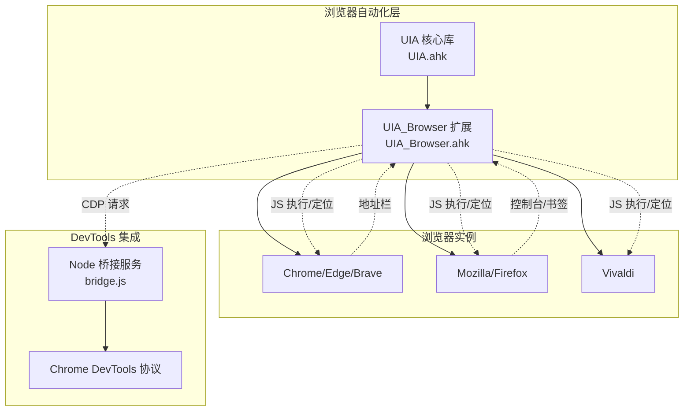
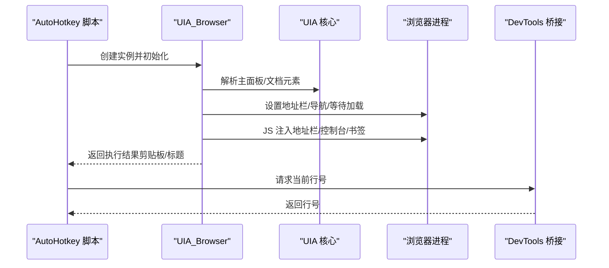
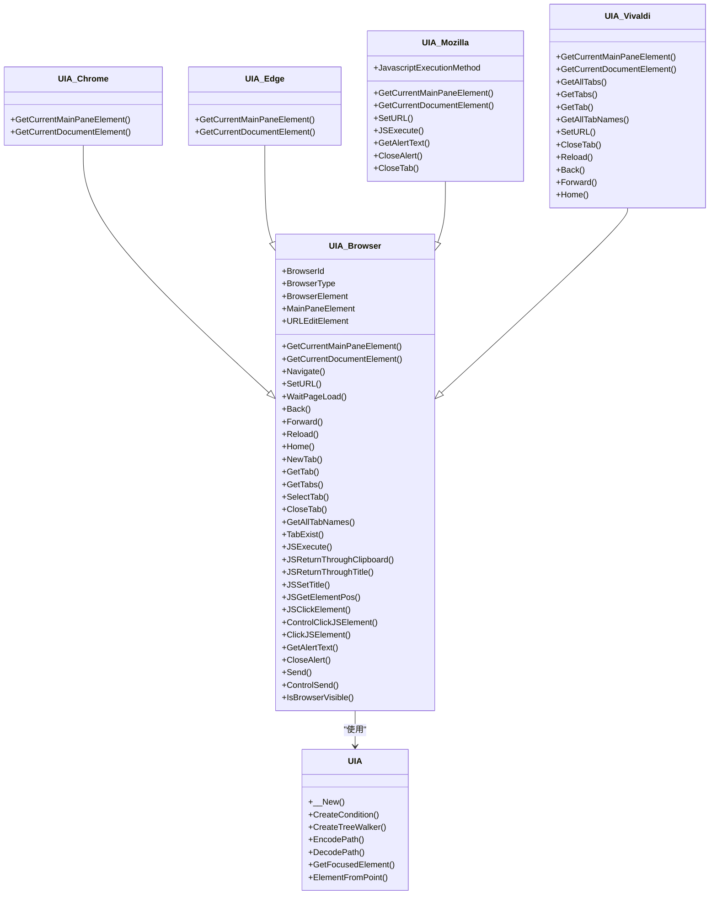
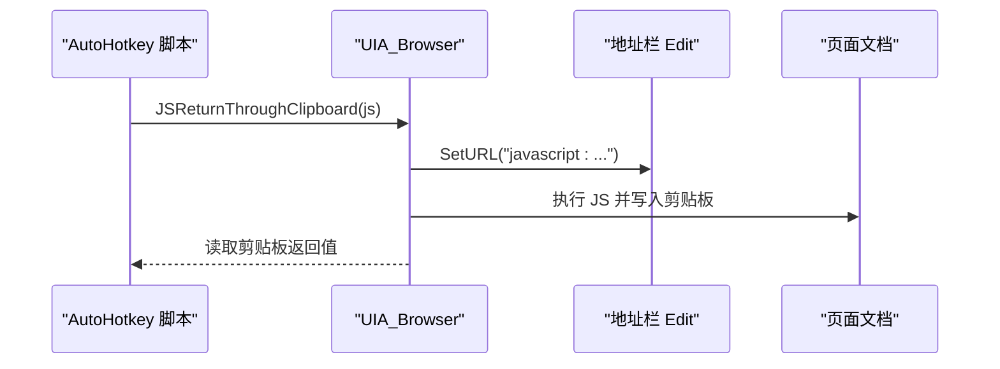
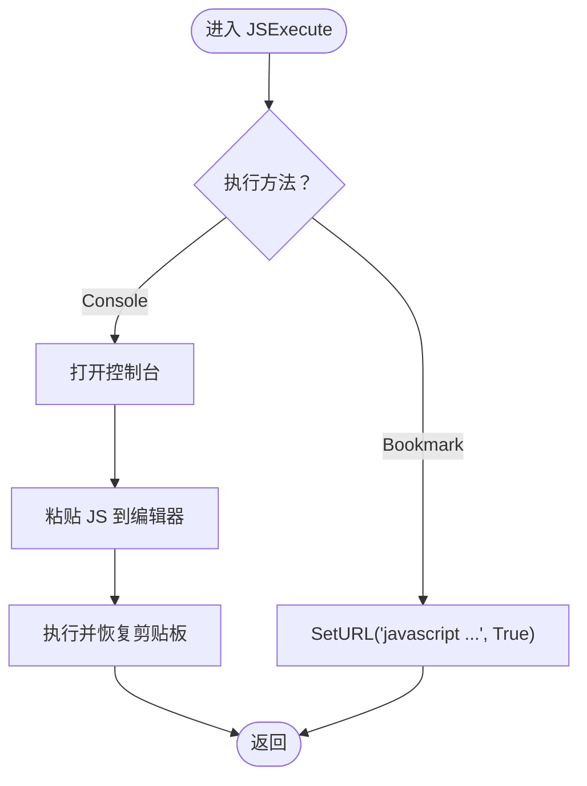
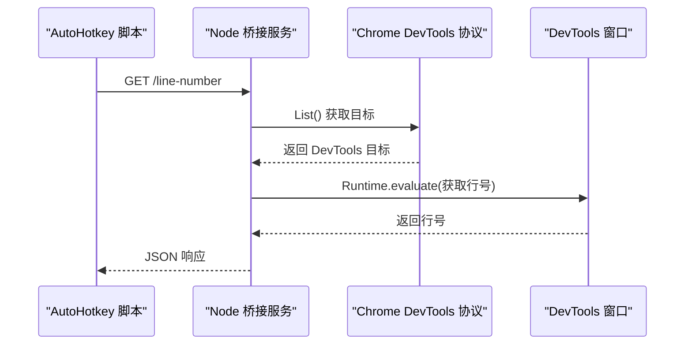
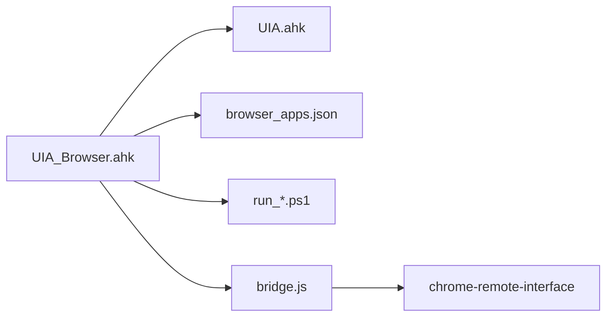

# 浏览器UIA扩展

<cite>
**本文档引用的文件**
- [UIA_Browser.ahk](file://lib/UIA_Browser.ahk)
- [UIA.ahk](file://lib/UIA.ahk)
- [browser_apps.json](file://browser_apps.json)
- [bridge.js](file://get-source-panel-line-number/bridge.js)
- [get_line_number.ahk](file://get-source-panel-line-number/get_line_number.ahk)
- [package.json](file://get-source-panel-line-number/package.json)
- [run_ChatGPT.ps1](file://apps/run_ChatGPT.ps1)
- [run_DMS.ps1](file://apps/run_DMS.ps1)
- [setup-node-pnpm-lite.ps1](file://setup-node-pnpm-lite.ps1)
</cite>

## 目录
1. [简介](#简介)
2. [项目结构](#项目结构)
3. [核心组件](#核心组件)
4. [架构总览](#架构总览)
5. [详细组件分析](#详细组件分析)
6. [依赖关系分析](#依赖关系分析)
7. [性能考虑](#性能考虑)
8. [故障排除指南](#故障排除指南)
9. [结论](#结论)
10. [附录](#附录)

## 简介
本项目提供基于 Microsoft UIAutomation（UIA）框架的浏览器自动化扩展，支持 Chromium 系（Chrome、Edge、Brave）、Firefox（Mozilla）与 Vivaldi 等主流浏览器。通过统一的 API 封装，实现页面元素定位、JavaScript 执行、地址栏导航、标签页管理、弹窗处理、以及与 Chrome DevTools 协议（CDP）的桥接能力，帮助用户在 AutoHotkey v2 环境中完成复杂的浏览器自动化任务。

## 项目结构
- lib/UIA.ahk：UIA 核心库，封装 IUIAutomation 接口、条件构造、树遍历、缓存机制、坐标系统与 DPI 处理等通用能力。
- lib/UIA_Browser.ahk：浏览器自动化扩展，提供浏览器类型识别、主面板/文档元素解析、导航、标签页管理、JavaScript 注入与执行、弹窗处理等。
- get-source-panel-line-number/*：基于 Chrome DevTools Protocol 的桥接模块，用于从 DevTools 中获取当前源码面板的行号。
- browser_apps.json：定义浏览器可执行路径、通用启动参数与常用应用（如 ChatGPT、DMS）的配置。
- apps/*.ps1：生成快捷方式并注入 AUMID 的 PowerShell 脚本，便于任务视图/开始菜单识别与管理。
- setup-node-pnpm-lite.ps1：Node.js、pnpm 环境准备脚本，确保桥接模块运行所需依赖。

图表来源
- [UIA.ahk](file://lib/UIA.ahk)
- [UIA_Browser.ahk](file://lib/UIA_Browser.ahk)
- [bridge.js](file://get-source-panel-line-number/bridge.js)

章节来源
- [UIA_Browser.ahk](file://lib/UIA_Browser.ahk)
- [UIA.ahk](file://lib/UIA.ahk)
- [browser_apps.json](file://browser_apps.json)

## 核心组件
- UIA 核心库（UIA.ahk）
  - 提供 IUIAutomation 初始化、版本协商、条件构造（Property/And/Or/Not）、树遍历（Control/Content/Raw）、缓存请求、路径编码/解码、焦点元素、坐标与 DPI 处理等。
  - 支持多版本 UIA 接口自动降级选择，适配不同 Windows 版本。
- UIA_Browser 扩展（UIA_Browser.ahk）
  - 统一浏览器抽象：自动识别 Chrome、Edge、Mozilla、Vivaldi、Brave，并委派到对应子类。
  - 主要能力：
    - 元素定位：主面板、导航栏、标签栏、地址栏、文档内容元素解析。
    - 导航控制：后退、前进、刷新、首页、地址栏跳转、等待页面加载。
    - 标签页管理：新建、查找、切换、关闭、枚举名称。
    - JavaScript 执行：通过地址栏注入、剪贴板回传、标题回传；Mozilla 支持控制台与书签两种执行路径。
    - 弹窗处理：获取/关闭 alert 文本。
    - 可见性检测：窗口四角可见性判断。
    - 键盘输入：安全释放修饰键后发送文本。
- DevTools 桥接（get-source-panel-line-number）
  - Node 服务通过 CDP 访问 DevTools 内部状态，返回当前源码编辑器的行号。
  - AutoHotkey 脚本通过 HTTP 客户端轮询获取结果。

章节来源
- [UIA.ahk](file://lib/UIA.ahk)
- [UIA_Browser.ahk](file://lib/UIA_Browser.ahk)
- [bridge.js](file://get-source-panel-line-number/bridge.js)
- [get_line_number.ahk](file://get-source-panel-line-number/get_line_number.ahk)

## 架构总览
UIA_Browser 通过 UIA 核心库与各浏览器 UIA 树交互，解析出地址栏、导航按钮、标签栏与文档内容区域；对 Chromium 系使用地址栏注入 JS 并通过剪贴板/标题回传结果；对 Firefox 使用控制台或书签注入；同时提供等待页面加载、弹窗处理、键盘输入等辅助能力。对于 DevTools 需求，通过 Node 桥接服务调用 CDP 获取行号。

图表来源
- [UIA_Browser.ahk](file://lib/UIA_Browser.ahk)
- [UIA.ahk](file://lib/UIA.ahk)
- [bridge.js](file://get-source-panel-line-number/bridge.js)

## 详细组件分析

### UIA_Browser 类族
- 自动识别与继承
  - 依据进程名/类名识别浏览器类型，动态设置基类原型，复用各浏览器特化实现。
- 元素解析
  - 主面板/导航栏/标签栏/地址栏/文档元素的定位与缓存，支持失败重试与激活窗口。
- 导航与等待
  - SetURL/Navigate/WaitPageLoad/Back/Forward/Reload/Home 提供完整的导航链路。
- 标签页管理
  - NewTab/GetTab/GetTabs/SelectTab/CloseTab/GetAllTabNames/TabExist，支持模糊匹配与索引选择。
- JavaScript 执行
  - JSExecute/JSReturnThroughClipboard/JSReturnThroughTitle/JSSetTitle/JSGetElementPos/JSClickElement/ControlClickJSElement/ClickJSElement。
  - 对 Mozilla 提供 Console/Bookmark 两种执行路径，提升稳定性。
- 弹窗处理
  - GetAlertText/CloseAlert，支持 Edge/Mozilla 不同对话框结构。
- 输入与可见性
  - Send/ControlSend（自动释放修饰键）、IsBrowserVisible（四角可见性检测）。

图表来源
- [UIA_Browser.ahk](file://lib/UIA_Browser.ahk)
- [UIA.ahk](file://lib/UIA.ahk)

章节来源
- [UIA_Browser.ahk](file://lib/UIA_Browser.ahk)
- [UIA.ahk](file://lib/UIA.ahk)

### JavaScript 执行流程（Chromium 系）
Chromium 系通过地址栏注入 JS 并等待返回值，优先使用剪贴板回传，标题回传作为备选。

图表来源
- [UIA_Browser.ahk](file://lib/UIA_Browser.ahk)

章节来源
- [UIA_Browser.ahk](file://lib/UIA_Browser.ahk)

### JavaScript 执行流程（Mozilla/Firefox）
Mozilla 支持控制台与书签两种路径。控制台路径通过快捷键打开多行编辑器，粘贴 JS 后执行；书签路径通过自定义书签关键字直接执行。

图表来源
- [UIA_Browser.ahk](file://lib/UIA_Browser.ahk)

章节来源
- [UIA_Browser.ahk](file://lib/UIA_Browser.ahk)

### DevTools 行号获取流程
Node 服务通过 CDP 列表定位 DevTools 目标，连接其内部 Runtime 执行表达式获取当前编辑器行号，HTTP 服务对外暴露接口。

图表来源
- [bridge.js](file://get-source-panel-line-number/bridge.js)
- [get_line_number.ahk](file://get-source-panel-line-number/get_line_number.ahk)

章节来源
- [bridge.js](file://get-source-panel-line-number/bridge.js)
- [get_line_number.ahk](file://get-source-panel-line-number/get_line_number.ahk)

## 依赖关系分析
- UIA_Browser 依赖 UIA 核心库进行元素查找、树遍历、条件构造与缓存。
- DevTools 桥接依赖 Node.js 与 chrome-remote-interface 包，通过 CDP 与浏览器/DevTools 通信。
- 应用配置依赖 browser_apps.json，定义浏览器路径、通用启动参数与应用清单。
- 快捷方式与 AUMID 由 PowerShell 脚本生成，便于任务视图识别。

图表来源
- [UIA_Browser.ahk](file://lib/UIA_Browser.ahk)
- [UIA.ahk](file://lib/UIA.ahk)
- [browser_apps.json](file://browser_apps.json)
- [run_ChatGPT.ps1](file://apps/run_ChatGPT.ps1)
- [run_DMS.ps1](file://apps/run_DMS.ps1)
- [bridge.js](file://get-source-panel-line-number/bridge.js)
- [package.json](file://get-source-panel-line-number/package.json)

章节来源
- [UIA_Browser.ahk](file://lib/UIA_Browser.ahk)
- [UIA.ahk](file://lib/UIA.ahk)
- [browser_apps.json](file://browser_apps.json)
- [run_ChatGPT.ps1](file://apps/run_ChatGPT.ps1)
- [run_DMS.ps1](file://apps/run_DMS.ps1)
- [bridge.js](file://get-source-panel-line-number/bridge.js)
- [package.json](file://get-source-panel-line-number/package.json)

## 性能考虑
- 元素定位与树遍历
  - 优先使用 UIA 条件构造与 TreeWalker，避免全树扫描；对复杂页面建议先缓存必要属性（如 BoundingRectangle、Type）。
- JavaScript 执行
  - Chromium 系优先使用剪贴板回传，减少等待与标题变更开销；Mozilla 控制台路径需等待编辑器切换，建议启用书签路径以减少交互步骤。
- 等待策略
  - WaitPageLoad 结合按钮状态与标题匹配，避免盲目轮询；合理设置超时与 sleepAfter。
- DPI 与坐标
  - 在多显示器/高 DPI 环境下，使用 UIA 的 DPIAwareness 设置与坐标转换，确保点击/定位准确。
- 可见性检测
  - IsBrowserVisible 仅检查窗口四角，避免昂贵的全屏扫描；必要时先激活窗口再检测。

章节来源
- [UIA.ahk](file://lib/UIA.ahk)
- [UIA_Browser.ahk](file://lib/UIA_Browser.ahk)

## 故障排除指南
- 无法找到浏览器窗口
  - 确认 UIA_Browser 初始化参数（标题/进程名）正确；检查浏览器是否可见或最小化。
- 地址栏不可用或值不更新
  - Chromium 系需确保地址栏元素可用且值已同步；必要时先激活窗口再设置。
- JavaScript 执行无返回
  - 检查剪贴板权限与等待时间；Mozilla 控制台路径需确认多行编辑器已打开。
- DevTools 无法获取行号
  - 确认 Node 服务已启动、端口可达；检查 Chrome 是否开启调试端口；确保 DevTools 已打开且处于源码面板。
- 标签页切换失败
  - 使用 TabExist/GetTab 先验证存在性；Vivaldi 的点击方式与其他浏览器不同，注意分支处理。

章节来源
- [UIA_Browser.ahk](file://lib/UIA_Browser.ahk)
- [get_line_number.ahk](file://get-source-panel-line-number/get_line_number.ahk)

## 结论
该浏览器 UIA 扩展在 UIA 核心之上提供了统一、稳定的浏览器自动化能力，覆盖导航、标签页、JS 执行与弹窗处理等常见场景，并通过 DevTools 桥接实现了与 CDP 的深度集成。结合合理的等待策略、缓存与 DPI 处理，可在多浏览器环境下实现高效可靠的自动化。

## 附录

### 实际使用示例（步骤说明）
- 页面导航与等待
  - 初始化 UIA_Browser 实例，调用 Navigate(url, 目标标题, 超时) 完成跳转并等待加载。
- 表单填写
  - 使用 JSGetElementPos/ClickJSElement/ControlClickJSElement 精确定位输入框并点击/输入。
- 元素点击
  - 优先使用 JSClickElement；若不稳定，改用 ClickJSElement 或 ControlClickJSElement。
- 弹窗处理
  - 使用 GetAlertText 获取消息，CloseAlert 关闭确认按钮。
- 标签页管理
  - NewTab/SelectTab/CloseTab/GetAllTabNames/TabExist 组合实现标签页生命周期管理。
- DevTools 行号获取
  - 启动 Node 桥接服务，调用 get_line_number.ahk 的 GetLineNumber 获取当前行号。

章节来源
- [UIA_Browser.ahk](file://lib/UIA_Browser.ahk)
- [get_line_number.ahk](file://get-source-panel-line-number/get_line_number.ahk)