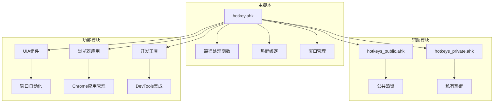
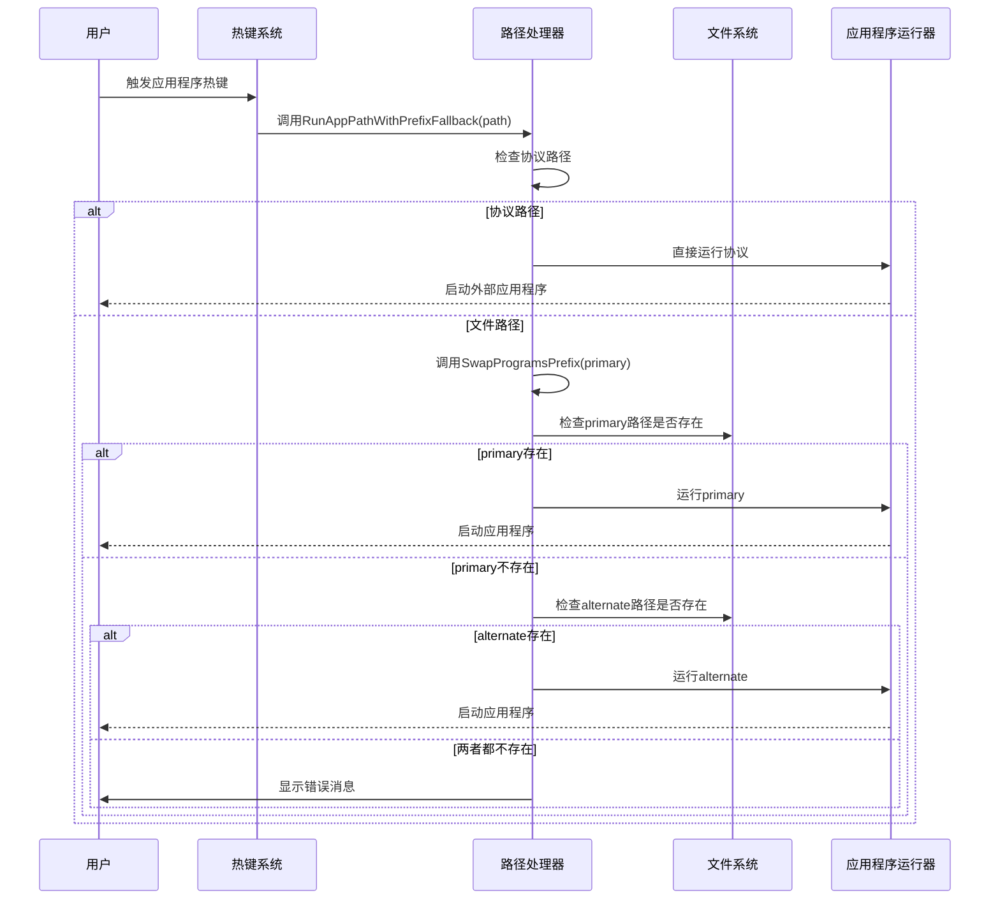
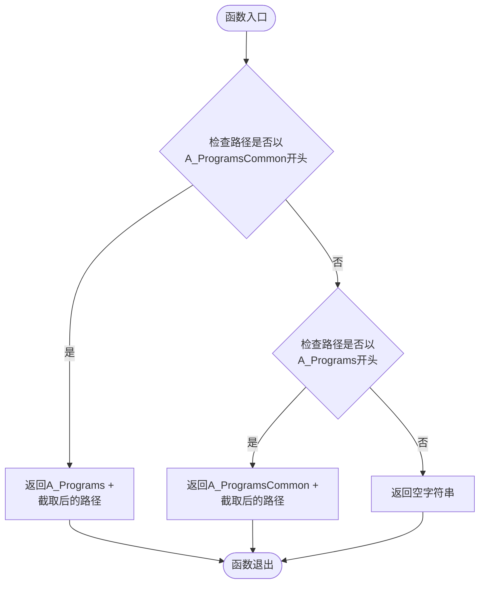
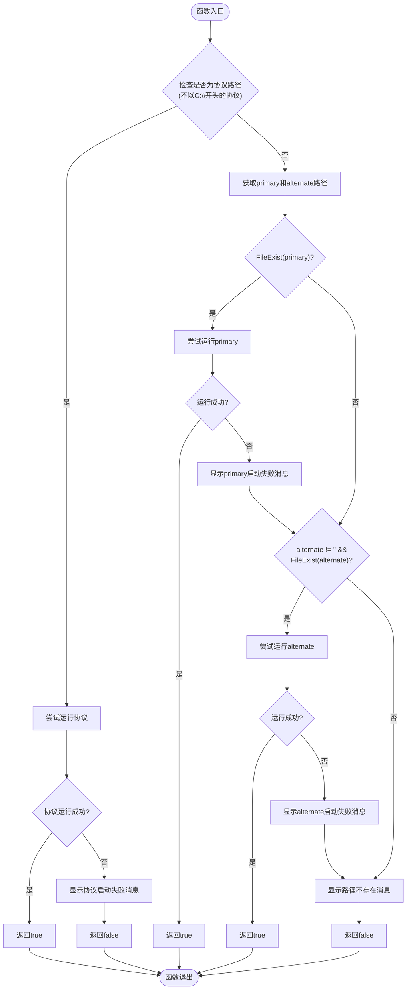
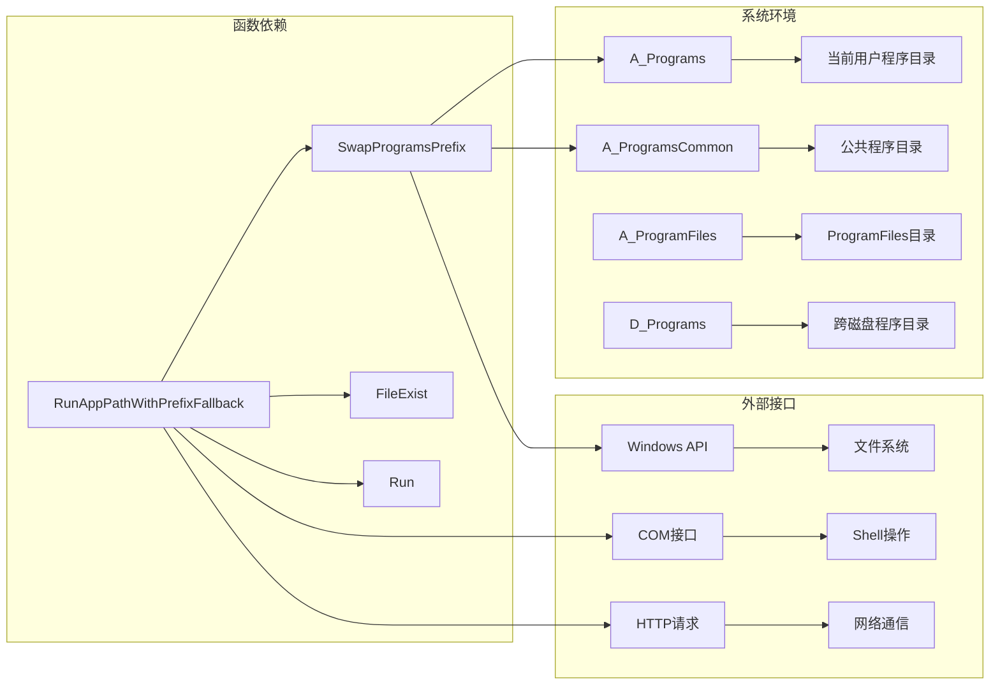
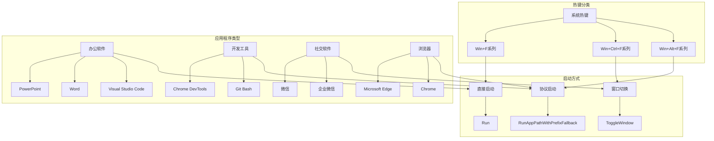

# 应用程序路径处理函数

<cite>
**本文档引用的文件**
- [hotkey.ahk](file://hotkey.ahk)
- [hotkeys_public.ahk](file://hotkeys_public.ahk)
- [hotkeys_private.ahk](file://hotkeys_private.ahk)
</cite>

## 目录
1. [简介](#简介)
2. [项目结构](#项目结构)
3. [核心组件](#核心组件)
4. [架构概览](#架构概览)
5. [详细组件分析](#详细组件分析)
6. [依赖关系分析](#依赖关系分析)
7. [性能考虑](#性能考虑)
8. [故障排除指南](#故障排除指南)
9. [结论](#结论)

## 简介

本文档详细介绍了AutoHotkey脚本中的应用程序路径处理函数，重点分析了`SwapProgramsPrefix`和`RunAppPathWithPrefixFallback`两个核心函数。这些函数提供了智能的应用程序路径切换和启动机制，能够自动处理不同磁盘空间下的程序路径，支持协议路径处理，并具备完善的错误处理和用户反馈机制。

该脚本主要用于Windows环境下的应用程序快速启动和窗口管理，通过热键绑定实现一键启动常用软件，同时具备跨磁盘路径兼容性和协议路径支持能力。

## 项目结构

该项目采用模块化设计，主要包含以下核心文件：



**图表来源**
- [hotkey.ahk:1-50](file://hotkey.ahk#L1-L50)
- [hotkeys_public.ahk:1-57](file://hotkeys_public.ahk#L1-L57)
- [hotkeys_private.ahk:1-18](file://hotkeys_private.ahk#L1-L18)

**章节来源**
- [hotkey.ahk:1-50](file://hotkey.ahk#L1-L50)
- [hotkeys_public.ahk:1-57](file://hotkeys_public.ahk#L1-L57)
- [hotkeys_private.ahk:1-18](file://hotkeys_private.ahk#L1-L18)

## 核心组件

### 路径处理函数

项目的核心功能由两个主要函数构成：

1. **SwapProgramsPrefix**: 路径前缀切换函数
2. **RunAppPathWithPrefixFallback**: 带前缀回退的应用程序启动函数

这两个函数协同工作，实现了智能的跨磁盘应用程序启动机制。

**章节来源**
- [hotkey.ahk:64-74](file://hotkey.ahk#L64-L74)
- [hotkey.ahk:76-118](file://hotkey.ahk#L76-L118)

## 架构概览



**图表来源**
- [hotkey.ahk:76-118](file://hotkey.ahk#L76-L118)
- [hotkey.ahk:64-74](file://hotkey.ahk#L64-L74)

## 详细组件分析

### SwapProgramsPrefix 函数

#### 函数签名
```autohotkey
SwapProgramsPrefix(path)
```

#### 参数说明
- **path** (字符串): 输入的程序路径
  - 支持绝对路径和相对路径
  - 支持包含ProgramFiles和ProgramsCommon两种前缀的路径

#### 返回值
- **字符串**: 返回切换后的路径
  - 如果输入路径属于ProgramsCommon目录，返回A_Programs目录下的对应路径
  - 如果输入路径属于A_Programs目录，返回A_ProgramsCommon目录下的对应路径
  - 如果路径不属于上述任何一种，返回空字符串

#### 实现逻辑



**图表来源**
- [hotkey.ahk:64-74](file://hotkey.ahk#L64-L74)

#### 使用示例

该函数在多个场景中被调用：

1. **VS Code启动流程**:
   ```autohotkey
   primary := appPath
   alternate := SwapProgramsPrefix(primary)
   ```

2. **通用应用程序启动**:
   ```autohotkey
   alternate := SwapProgramsPrefix(APP_PATH)
   ```

**章节来源**
- [hotkey.ahk:64-74](file://hotkey.ahk#L64-L74)
- [hotkey.ahk:1651-1652](file://hotkey.ahk#L1651-L1652)
- [hotkey.ahk:131-133](file://hotkey.ahk#L131-L133)

### RunAppPathWithPrefixFallback 函数

#### 函数签名
```autohotkey
RunAppPathWithPrefixFallback(path)
```

#### 参数说明
- **path** (字符串): 应用程序路径或协议
  - 支持标准文件路径
  - 支持协议路径（如`ms-phone:`、`obsidian://`）

#### 返回值
- **布尔值**: 
  - `true`: 成功启动应用程序
  - `false`: 启动失败

#### 处理流程



**图表来源**
- [hotkey.ahk:76-118](file://hotkey.ahk#L76-L118)

#### 协议路径处理

函数特别处理了协议路径，这类路径具有以下特征：
- 以字母开头的协议标识符（如`ms-phone:`、`obsidian://`）
- 不是以驱动器盘符开头的路径
- 直接通过`Run`函数尝试启动，不进行文件存在性检查

#### 文件存在性检查机制

函数实现了多层次的文件存在性检查：
1. **主路径检查**: 首先检查原始路径是否存在
2. **备用路径检查**: 如果主路径不存在，检查通过`SwapProgramsPrefix`生成的备用路径
3. **错误报告**: 如果两种路径都不存在，提供详细的错误信息

#### 异常处理策略

函数采用了全面的异常处理机制：
- **协议启动异常**: 捕获协议启动失败，显示友好错误消息
- **文件启动异常**: 捕获文件启动失败，显示具体错误信息
- **路径不存在**: 提供清晰的路径不存在提示，包含两种可能的路径

**章节来源**
- [hotkey.ahk:76-118](file://hotkey.ahk#L76-L118)

### ToggleWindow 系列函数

#### 函数签名
```autohotkey
ToggleWindow(ahk_exe, APP_PATH)
ToggleWindowByTitle(ahk_exe, WinTitle, APP_PATH)
ToggleWindow2(ahk_exe, WinTitle, APP_PATH)
ToggleWindow12(ahk_exe, WinTitle, APP_PATH)
```

#### 功能说明
这些函数实现了应用程序窗口的开关控制：
- **窗口存在检查**: 检查目标应用程序窗口是否已启动
- **窗口激活/最小化**: 根据窗口状态执行相应的操作
- **自动启动**: 如果窗口不存在，调用`RunAppPathWithPrefixFallback`启动应用程序

**章节来源**
- [hotkey.ahk:123-163](file://hotkey.ahk#L123-L163)

## 依赖关系分析

### 系统环境依赖



**图表来源**
- [hotkey.ahk:55-74](file://hotkey.ahk#L55-L74)
- [hotkey.ahk:76-118](file://hotkey.ahk#L76-L118)

### 热键绑定依赖

项目通过多种热键绑定实现应用程序启动：



**图表来源**
- [hotkey.ahk:588-751](file://hotkey.ahk#L588-L751)

**章节来源**
- [hotkey.ahk:588-751](file://hotkey.ahk#L588-L751)

## 性能考虑

### 路径处理优化

1. **早期返回优化**: `SwapProgramsPrefix`函数在找到匹配路径后立即返回，避免不必要的字符串操作
2. **条件检查优化**: `RunAppPathWithPrefixFallback`函数采用短路求值，先检查最可能成功的路径
3. **文件系统缓存**: 利用AutoHotkey的内置文件存在性检查，避免重复的文件系统查询

### 内存使用优化

1. **局部变量使用**: 所有函数都使用局部变量，避免全局状态污染
2. **及时释放资源**: 函数执行完毕后自动释放内存
3. **字符串操作优化**: 使用高效的字符串截取和拼接操作

### 并发处理

1. **异步错误处理**: 使用try-catch块处理潜在的异常情况
2. **超时机制**: 在网络相关操作中设置了合理的超时时间
3. **资源清理**: 确保异常情况下也能正确清理资源

## 故障排除指南

### 常见问题及解决方案

#### 1. 应用程序无法启动

**症状**: 点击热键后无响应或出现错误消息

**可能原因**:
- 应用程序路径不存在
- 权限不足
- 应用程序已被卸载

**解决步骤**:
1. 检查应用程序的实际安装路径
2. 验证路径的可访问性
3. 以管理员权限运行脚本
4. 重新安装应用程序

#### 2. 跨磁盘路径问题

**症状**: 在D盘或其他磁盘上安装的应用程序无法启动

**解决方法**:
- 确认`SwapProgramsPrefix`函数正确识别了路径前缀
- 检查`D_Programs`变量的设置
- 验证备用路径是否正确生成

#### 3. 协议路径启动失败

**症状**: 协议路径（如`ms-phone:`）无法启动外部应用程序

**解决方法**:
- 确认系统已注册相应的协议处理器
- 检查协议路径的正确性
- 验证外部应用程序的可用性

#### 4. 热键冲突

**症状**: 热键无法正常工作

**解决方法**:
- 检查热键组合是否与其他应用程序冲突
- 尝试更改热键组合
- 确认脚本已正确加载

### 调试技巧

1. **启用调试输出**: 在关键位置添加`ToolTip`或`OutputDebug`语句
2. **检查环境变量**: 验证`A_Programs`、`A_ProgramsCommon`等环境变量的值
3. **测试路径**: 使用简单的`Run`命令测试路径的有效性
4. **查看错误日志**: 检查系统事件查看器中的相关错误

**章节来源**
- [hotkey.ahk:76-118](file://hotkey.ahk#L76-L118)
- [hotkey.ahk:1651-1678](file://hotkey.ahk#L1651-L1678)

## 结论

本文档详细分析了AutoHotkey脚本中的应用程序路径处理函数，展示了`SwapProgramsPrefix`和`RunAppPathWithPrefixFallback`两个核心函数的设计理念和实现细节。

这些函数通过智能的路径前缀切换机制，有效解决了跨磁盘应用程序启动的问题；通过协议路径处理，实现了对外部应用程序的无缝集成；通过完善的错误处理和用户反馈机制，提供了良好的用户体验。

该实现体现了以下设计原则：
- **健壮性**: 全面的错误处理和异常捕获
- **兼容性**: 支持多种应用程序类型和启动方式
- **可维护性**: 清晰的代码结构和详细的注释
- **可扩展性**: 模块化的函数设计便于功能扩展

对于实际使用场景，建议：
1. 根据实际的安装路径配置正确的环境变量
2. 定期验证应用程序路径的有效性
3. 在新环境中部署时进行充分的测试
4. 建立完善的监控和日志机制