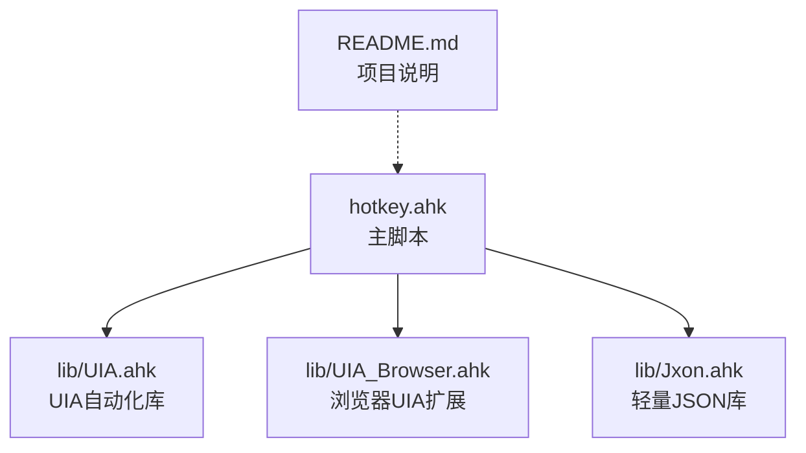
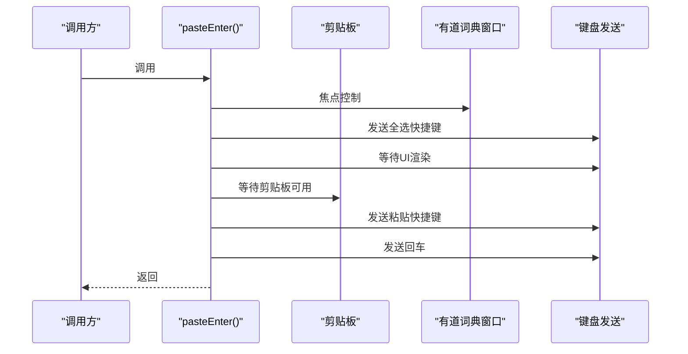
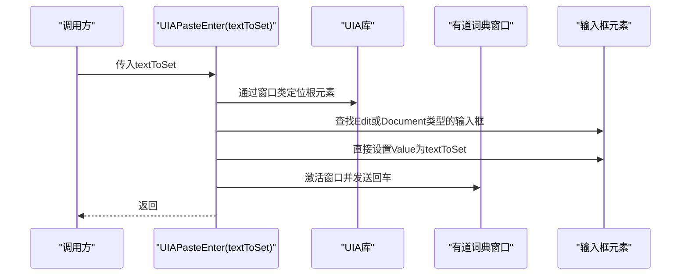
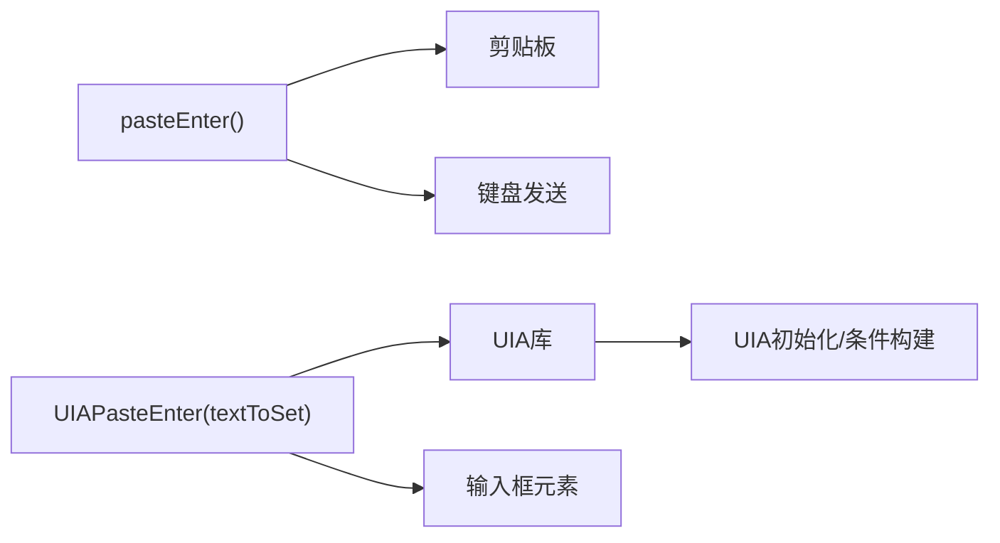

# 有道词典集成函数

<cite>
**本文引用的文件**
- [hotkey.ahk](file://hotkey.ahk)
- [UIA.ahk](file://lib/UIA.ahk)
- [UIA_Browser.ahk](file://lib/UIA_Browser.ahk)
- [Jxon.ahk](file://lib/Jxon.ahk)
- [README.md](file://README.md)
</cite>

## 目录
1. [简介](#简介)
2. [项目结构](#项目结构)
3. [核心组件](#核心组件)
4. [架构总览](#架构总览)
5. [详细组件分析](#详细组件分析)
6. [依赖关系分析](#依赖关系分析)
7. [性能考量](#性能考量)
8. [故障排查指南](#故障排查指南)
9. [结论](#结论)
10. [附录](#附录)

## 简介
本文档面向有道词典集成函数，聚焦于两个核心函数：
- pasteEnter：基于传统Send方式的复制粘贴并触发查询
- UIAPasteEnter：基于UIA自动化方式的直接设置输入框并触发查询

文档将从API签名、参数说明、返回值、使用示例、元素定位策略、输入框识别机制、剪贴板操作、UI渲染等待、错误处理与回退机制等方面进行系统性说明，并对两种实现方式进行适用场景与性能对比分析，帮助读者在实际项目中做出合理选择。

## 项目结构
本仓库为AutoHotkey v2脚本集合，其中与有道词典集成相关的核心位于主脚本文件中，同时引入了UIA自动化库与浏览器扩展库用于UIA能力增强。README简要说明了项目用途。

图表来源
- [hotkey.ahk:1-20](file://hotkey.ahk#L1-L20)
- [UIA.ahk:1-50](file://lib/UIA.ahk#L1-L50)
- [UIA_Browser.ahk:1-50](file://lib/UIA_Browser.ahk#L1-L50)
- [README.md:1-2](file://README.md#L1-L2)

章节来源
- [README.md:1-2](file://README.md#L1-L2)
- [hotkey.ahk:1-20](file://hotkey.ahk#L1-L20)

## 核心组件
- pasteEnter：传统Send方式
  - 功能：全选、粘贴、回车触发查询
  - 依赖：剪贴板、窗口焦点控制、键盘发送
  - 特点：兼容性强，但受UI渲染与焦点影响较大
- UIAPasteEnter：UIA自动化方式
  - 功能：通过UIA定位输入框，直接设置Value，再回车触发
  - 依赖：UIA库、窗口句柄、元素定位
  - 特点：更稳定可靠，避免UI渲染差异，但对元素类型敏感

章节来源
- [hotkey.ahk:253-271](file://hotkey.ahk#L253-L271)
- [hotkey.ahk:273-294](file://hotkey.ahk#L273-L294)

## 架构总览
两种实现方式在调用链上存在差异：
- 传统Send方式：依赖剪贴板内容，通过键盘组合键完成全选、粘贴、回车
- UIA自动化方式：直接通过UIA接口定位目标输入框并设置值，随后模拟回车

图表来源
- [hotkey.ahk:253-271](file://hotkey.ahk#L253-L271)

图表来源
- [hotkey.ahk:273-294](file://hotkey.ahk#L273-L294)
- [UIA.ahk:1-150](file://lib/UIA.ahk#L1-L150)

## 详细组件分析

### 函数API定义与行为

- pasteEnter()
  - 签名：无参数
  - 功能：全选已有内容、粘贴剪贴板内容、回车触发查询
  - 关键步骤：
    - 控制焦点到有道词典主窗口
    - 发送全选快捷键，等待UI渲染高亮完成
    - 等待剪贴板可用，若可用则发送粘贴快捷键
    - 等待短暂时间后发送回车
  - 返回值：无（void）

- UIAPasteEnter(textToSet)
  - 签名：UIAPasteEnter(textToSet)
  - 参数：
    - textToSet：字符串，将被直接设置到输入框
  - 功能：通过UIA定位输入框，直接设置Value，再回车触发
  - 关键步骤：
    - 通过窗口类定位有道词典主窗口元素
    - 查找Edit或Document类型的输入框元素
    - 直接设置元素的Value属性为textToSet
    - 激活窗口并发送回车
  - 返回值：无（void）

章节来源
- [hotkey.ahk:253-271](file://hotkey.ahk#L253-L271)
- [hotkey.ahk:273-294](file://hotkey.ahk#L273-L294)

### 元素定位策略与输入框识别机制

- 传统Send方式
  - 依赖：窗口焦点控制与键盘组合键
  - 优点：无需解析UI树，通用性强
  - 缺点：受UI渲染、焦点状态影响，易出现闪烁或延迟

- UIA自动化方式
  - 依赖：UIA库提供的元素定位能力
  - 策略：
    - 通过窗口类定位根元素
    - 优先查找Type为Edit的输入框；若未找到，回退到Type为Document的容器
    - 直接设置Value属性，避免全选/粘贴流程
  - 优点：稳定、快速、避免UI闪烁
  - 缺点：对元素类型敏感，若UI结构变化需调整定位条件

章节来源
- [hotkey.ahk:273-294](file://hotkey.ahk#L273-L294)
- [UIA.ahk:180-200](file://lib/UIA.ahk#L180-L200)

### 剪贴板操作与UI渲染等待

- 剪贴板等待
  - 传统方式通过ClipWait等待剪贴板内容可用，避免空粘贴
  - UIA方式直接设置Value，不依赖剪贴板

- UI渲染等待
  - 传统方式在全选后Sleep 50毫秒，等待UI渲染高亮完成
  - UIA方式通过直接设置Value，减少等待时间

章节来源
- [hotkey.ahk:253-271](file://hotkey.ahk#L253-L271)
- [hotkey.ahk:273-294](file://hotkey.ahk#L273-L294)

### 错误处理与回退机制

- UIA自动化方式
  - try/catch包裹，定位失败时弹出消息框提示
  - 可视化错误信息，便于问题诊断

- 传统Send方式
  - 未显式try/catch，但通过ClipWait与Sleep降低失败概率
  - 若剪贴板为空或UI未渲染完成，可能导致粘贴失败

章节来源
- [hotkey.ahk:273-294](file://hotkey.ahk#L273-L294)
- [hotkey.ahk:253-271](file://hotkey.ahk#L253-L271)

### 使用示例与调用场景

- 在脚本中调用
  - 传统方式：在需要触发有道词典查询时，先确保有道词典窗口已激活，再调用pasteEnter()
  - UIA方式：直接调用UIAPasteEnter(textToSet)，传入待查询文本

- 热键绑定示例
  - 主脚本中存在对有道词典窗口的激活与pasteEnter()调用逻辑，可作为热键绑定的参考实现

章节来源
- [hotkey.ahk:1085-1109](file://hotkey.ahk#L1085-L1109)

## 依赖关系分析

- UIA自动化依赖
  - UIA.ahk：提供UIA初始化、元素定位、属性访问等能力
  - UIA_Browser.ahk：提供浏览器UIA扩展能力（虽与有道词典无直接关系，但体现UIA生态）
- JSON处理依赖
  - Jxon.ahk：轻量JSON库，用于数据序列化/反序列化（与有道词典集成函数无直接关联）

图表来源
- [hotkey.ahk:253-294](file://hotkey.ahk#L253-L294)
- [UIA.ahk:445-525](file://lib/UIA.ahk#L445-L525)

章节来源
- [UIA.ahk:1-150](file://lib/UIA.ahk#L1-L150)
- [UIA_Browser.ahk:1-120](file://lib/UIA_Browser.ahk#L1-L120)
- [Jxon.ahk:1-50](file://lib/Jxon.ahk#L1-L50)

## 性能考量
- 传统Send方式
  - 优点：实现简单，兼容性好
  - 缺点：涉及键盘发送与UI渲染等待，整体耗时较长，易受系统与应用UI影响
- UIA自动化方式
  - 优点：直接设置Value，避免键盘发送与UI闪烁，速度更快、更稳定
  - 缺点：对元素类型依赖较强，若UI结构调整需同步更新定位策略

[本节为通用性能讨论，不直接分析具体文件]

## 故障排查指南
- UIA定位失败
  - 现象：UIA方式调用后弹出“UIA定位失败”的消息框
  - 排查要点：
    - 确认有道词典主窗口类是否仍为YodaoMainWndClass
    - 检查输入框元素是否为Edit或Document类型
    - 观察UIA库版本与系统兼容性
- 剪贴板为空导致粘贴失败
  - 现象：传统方式粘贴无效
  - 排查要点：
    - 确认剪贴板内容是否已设置
    - 检查ClipWait等待超时设置
- UI渲染等待不足
  - 现象：全选后UI未及时高亮，导致后续粘贴异常
  - 排查要点：
    - 适当增加Sleep等待时间
    - 确保窗口处于激活状态

章节来源
- [hotkey.ahk:273-294](file://hotkey.ahk#L273-L294)
- [hotkey.ahk:253-271](file://hotkey.ahk#L253-L271)

## 结论
- 若追求稳定性与性能，推荐使用UIAPasteEnter(textToSet)，直接设置输入框内容并触发查询
- 若需要快速适配或应用UI结构复杂、难以定位输入框，可采用pasteEnter()的传统方式
- 在实际部署中，建议结合业务场景与目标应用的UI稳定性，选择合适的实现方式，并在必要时提供回退策略

[本节为总结性内容，不直接分析具体文件]

## 附录

### API速查表

- pasteEnter()
  - 签名：pasteEnter()
  - 参数：无
  - 返回值：无
  - 适用场景：通用、兼容性强
  - 注意事项：依赖剪贴板与UI渲染等待

- UIAPasteEnter(textToSet)
  - 签名：UIAPasteEnter(textToSet)
  - 参数：textToSet（字符串）
  - 返回值：无
  - 适用场景：稳定、高性能
  - 注意事项：需确保输入框元素类型为Edit或Document

章节来源
- [hotkey.ahk:253-271](file://hotkey.ahk#L253-L271)
- [hotkey.ahk:273-294](file://hotkey.ahk#L273-L294)