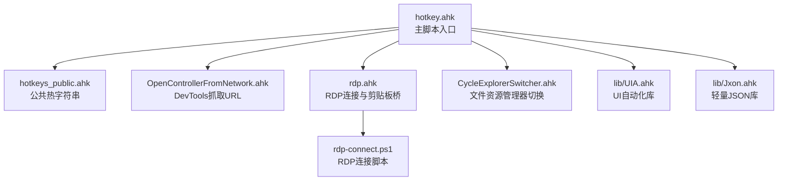
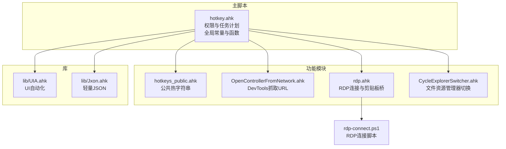
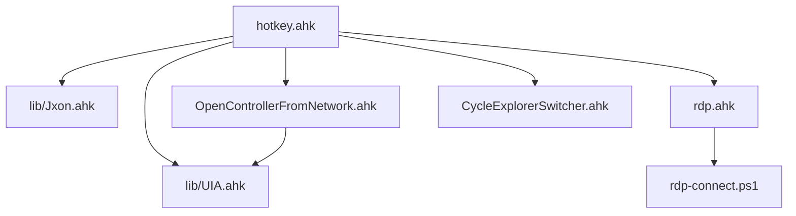

# 核心函数API

<cite>
**本文档引用的文件**
- [hotkey.ahk](file://hotkey.ahk)
- [hotkeys_public.ahk](file://hotkeys_public.ahk)
- [rdp.ahk](file://rdp.ahk)
- [CycleExplorerSwitcher.ahk](file://CycleExplorerSwitcher.ahk)
- [OpenControllerFromNetwork.ahk](file://OpenControllerFromNetwork.ahk)
- [UIA.ahk](file://lib/UIA.ahk)
- [Jxon.ahk](file://lib/Jxon.ahk)
- [rdp-connect.ps1](file://rdp-connect.ps1)
</cite>

## 目录
1. [简介](#简介)
2. [项目结构](#项目结构)
3. [核心组件](#核心组件)
4. [架构总览](#架构总览)
5. [详细组件分析](#详细组件分析)
6. [依赖关系分析](#依赖关系分析)
7. [性能考量](#性能考量)
8. [故障排查指南](#故障排查指南)
9. [结论](#结论)

## 简介
本文件面向hotkey项目的使用者与维护者，系统性梳理项目中的核心函数API，涵盖窗口控制、应用程序路径处理、进程管理、有道词典集成等模块。文档提供每个函数的签名、参数、返回值、使用示例、参数校验规则、错误处理机制以及版本兼容性与注意事项，帮助读者快速理解与正确使用这些API。

## 项目结构
hotkey项目采用模块化组织，核心逻辑集中在主脚本与若干功能模块中，同时引入UIA与JSON处理库以增强自动化能力。项目结构如下图所示：

图表来源
- [hotkey.ahk:1-200](file://hotkey.ahk#L1-L200)
- [hotkeys_public.ahk:1-57](file://hotkeys_public.ahk#L1-L57)
- [OpenControllerFromNetwork.ahk:1-120](file://OpenControllerFromNetwork.ahk#L1-L120)
- [rdp.ahk:1-150](file://rdp.ahk#L1-L150)
- [CycleExplorerSwitcher.ahk:1-60](file://CycleExplorerSwitcher.ahk#L1-L60)
- [UIA.ahk:1-120](file://lib/UIA.ahk#L1-L120)
- [Jxon.ahk:1-60](file://lib/Jxon.ahk#L1-L60)
- [rdp-connect.ps1:1-60](file://rdp-connect.ps1#L1-L60)

章节来源
- [hotkey.ahk:1-200](file://hotkey.ahk#L1-L200)
- [hotkeys_public.ahk:1-57](file://hotkeys_public.ahk#L1-L57)
- [OpenControllerFromNetwork.ahk:1-120](file://OpenControllerFromNetwork.ahk#L1-L120)
- [rdp.ahk:1-150](file://rdp.ahk#L1-L150)
- [CycleExplorerSwitcher.ahk:1-60](file://CycleExplorerSwitcher.ahk#L1-L60)
- [UIA.ahk:1-120](file://lib/UIA.ahk#L1-L120)
- [Jxon.ahk:1-60](file://lib/Jxon.ahk#L1-L60)
- [rdp-connect.ps1:1-60](file://rdp-connect.ps1#L1-L60)

## 核心组件
本节对hotkey项目的核心函数进行分类与概览，便于快速定位与查阅。

- 窗口控制函数
  - ToggleWindow(ahk_exe, APP_PATH)
  - ToggleWindowByTitle(ahk_exe, WinTitle, APP_PATH)
  - ToggleWindow2(ahk_exe, WinTitle, APP_PATH)
  - ToggleWindow12(ahk_exe, WinTitle, APP_PATH)
  - ToggleWindow22(ahk_exe, WinTitle, APP_PATH)
  - RDPManager.ToggleWindow(ahk_exe, APP_PATH)
  - GetMainWindowByExe(ahk_exe, winTitle)
  - CycleExplorerSwitcher系列函数（窗口枚举、切换、高亮）

- 应用程序路径处理函数
  - SwapProgramsPrefix(path)
  - RunAppPathWithPrefixFallback(path)

- 进程管理函数
  - GetProcessName(pid)

- 有道词典集成函数
  - pasteEnter()
  - UIAPasteEnter(textToSet)

- RDP相关函数
  - RDPManager.connect(name)
  - ConnectMappedRDP(mode)
  - ConnectRDPFast(targetHost)
  - ConnectRDPByProbe(targetHost)
  - RequestLocalMstscMinimize()
  - MinimizeCurrentRDPDesktop()
  - MinimizeMstscRootWindow(hwnd)
  - IsRDPEnvironment(hwnd)
  - IsWindowsRemoteSession()
  - IsRDPWindow(hwnd)
  - GetRootWindow(hwnd)

- DevTools抓取URL函数
  - OpenControllerFromNetwork()
  - CopyDevToolsSelectedRequestURL()
  - DevTools_GetSelectedURL()
  - DevTools_GetSelectedURLFromClipboard()
  - DevTools_CopyURLViaContextMenu()
  - DevTools_TryCopyURLFromOpenedMenu(...)
  - DevTools_WaitAndInvokeMenuItem(...)
  - DevTools_InvokeBestMenuItem(...)
  - DevTools_FindBestMenuItemInElement(...)
  - DevTools_ScoreMenuItemName(...)
  - DevTools_ClickOrInvoke(...)

章节来源
- [hotkey.ahk:120-295](file://hotkey.ahk#L120-L295)
- [rdp.ahk:70-146](file://rdp.ahk#L70-L146)
- [OpenControllerFromNetwork.ahk:34-96](file://OpenControllerFromNetwork.ahk#L34-L96)
- [OpenControllerFromNetwork.ahk:102-195](file://OpenControllerFromNetwork.ahk#L102-L195)
- [OpenControllerFromNetwork.ahk:471-581](file://OpenControllerFromNetwork.ahk#L471-L581)
- [OpenControllerFromNetwork.ahk:583-775](file://OpenControllerFromNetwork.ahk#L583-L775)
- [OpenControllerFromNetwork.ahk:777-800](file://OpenControllerFromNetwork.ahk#L777-L800)

## 架构总览
hotkey项目采用“主脚本+模块化功能”的架构设计，主脚本负责权限自提升、任务计划注册、全局常量与通用函数定义，各功能模块独立封装职责，通过Include方式整合。UIA与Jxon库提供底层自动化与数据处理能力。

图表来源
- [hotkey.ahk:1-120](file://hotkey.ahk#L1-L120)
- [hotkeys_public.ahk:1-57](file://hotkeys_public.ahk#L1-L57)
- [OpenControllerFromNetwork.ahk:1-60](file://OpenControllerFromNetwork.ahk#L1-L60)
- [rdp.ahk:1-120](file://rdp.ahk#L1-L120)
- [CycleExplorerSwitcher.ahk:1-60](file://CycleExplorerSwitcher.ahk#L1-L60)
- [UIA.ahk:1-120](file://lib/UIA.ahk#L1-L120)
- [Jxon.ahk:1-60](file://lib/Jxon.ahk#L1-L60)
- [rdp-connect.ps1:1-60](file://rdp-connect.ps1#L1-L60)

## 详细组件分析

### 窗口控制函数

#### ToggleWindow(ahk_exe, APP_PATH)
- 功能：根据窗口是否存在与激活状态，执行最小化或激活；否则尝试运行指定路径的应用。
- 参数
  - ahk_exe: 窗口进程名（用于WinExist/WinActive匹配）
  - APP_PATH: 应用程序路径（用于Run）
- 返回值：无
- 错误处理：内部调用Run时捕获异常并弹窗提示；若路径不存在，弹窗提示路径不存在。
- 版本兼容性：依赖AutoHotkey v2窗口API。
- 使用示例：见主脚本中的热键绑定示例。

章节来源
- [hotkey.ahk:123-134](file://hotkey.ahk#L123-L134)

#### ToggleWindowByTitle(ahk_exe, WinTitle, APP_PATH)
- 功能：基于窗口标题进行开关控制，其余行为与ToggleWindow一致。
- 参数
  - WinTitle: 窗口标题（用于WinExist/WinActive匹配）
- 返回值：无
- 错误处理：同上。
- 使用示例：见主脚本中的热键绑定示例。

章节来源
- [hotkey.ahk:135-146](file://hotkey.ahk#L135-L146)

#### ToggleWindow2(ahk_exe, WinTitle, APP_PATH)
- 功能：带额外过滤条件的窗口开关控制。
- 参数：同上。
- 返回值：无
- 错误处理：同上。
- 使用示例：见主脚本中的热键绑定示例。

章节来源
- [hotkey.ahk:152-163](file://hotkey.ahk#L152-L163)

#### ToggleWindow12 / ToggleWindow22
- 功能：列举并遍历匹配窗口，交互式展示窗口信息，便于调试与选择。
- 参数：同上。
- 返回值：无
- 错误处理：内部使用消息框提示，支持中断继续。
- 使用示例：见主脚本中的热键绑定示例。

章节来源
- [hotkey.ahk:180-221](file://hotkey.ahk#L180-L221)

#### RDPManager.ToggleWindow(ahk_exe, APP_PATH)
- 功能：RDP专用窗口开关控制，逻辑与通用ToggleWindow类似。
- 参数：同上。
- 返回值：无
- 错误处理：同上。
- 使用示例：见RDP模块中的热键绑定示例。

章节来源
- [rdp.ahk:118-129](file://rdp.ahk#L118-L129)

#### GetMainWindowByExe(ahk_exe, winTitle)
- 功能：在多个窗口中筛选出可见且标题匹配的主窗口。
- 参数
  - ahk_exe: 进程名
  - winTitle: 窗口标题
- 返回值：匹配到的窗口句柄（整数），未找到返回0。
- 错误处理：无显式异常处理，返回0表示未找到。
- 使用示例：见主脚本中的热键绑定示例。

章节来源
- [hotkey.ahk:239-250](file://hotkey.ahk#L239-L250)

#### CycleExplorerSwitcher系列函数
- 功能：对文件资源管理器窗口进行轮询切换、高亮与激活。
- 关键函数
  - CycleExplorerSwitcher(): 切换逻辑与GUI高亮
  - StartExplorerSwitcher(windows): 初始化GUI与列表
  - HighlightExplorerSwitcherSelection(): 高亮当前选中项
  - CommitExplorerSwitcher(forceIndex): 确认并激活目标窗口
  - CloseExplorerSwitcher(showTip): 关闭GUI并清理状态
  - GetExplorerWindows(): 获取所有CabinetWClass窗口
  - ActivateExplorerWindow(hwnd): 激活窗口并处理最小化状态
- 参数与返回值：详见源码行号。
- 错误处理：GUI销毁时try保护；激活失败时重试与Alt键辅助。
- 使用示例：见CycleExplorerSwitcher.ahk中的热键绑定与调用。

章节来源
- [CycleExplorerSwitcher.ahk:68-96](file://CycleExplorerSwitcher.ahk#L68-L96)
- [CycleExplorerSwitcher.ahk:98-153](file://CycleExplorerSwitcher.ahk#L98-L153)
- [CycleExplorerSwitcher.ahk:338-364](file://CycleExplorerSwitcher.ahk#L338-L364)
- [CycleExplorerSwitcher.ahk:383-404](file://CycleExplorerSwitcher.ahk#L383-L404)
- [CycleExplorerSwitcher.ahk:406-425](file://CycleExplorerSwitcher.ahk#L406-L425)
- [CycleExplorerSwitcher.ahk:427-430](file://CycleExplorerSwitcher.ahk#L427-L430)
- [CycleExplorerSwitcher.ahk:431-453](file://CycleExplorerSwitcher.ahk#L431-L453)

### 应用程序路径处理函数

#### SwapProgramsPrefix(path)
- 功能：在Program Files与ProgramData之间切换路径前缀。
- 参数
  - path: 原始路径
- 返回值：切换后的路径字符串，若不匹配则返回空字符串。
- 错误处理：无显式异常处理。
- 使用示例：见RunAppPathWithPrefixFallback内部调用。

章节来源
- [hotkey.ahk:64-74](file://hotkey.ahk#L64-L74)

#### RunAppPathWithPrefixFallback(path)
- 功能：优先尝试协议路径（如obsidian://）直接运行；否则在主路径与备用路径间回退尝试。
- 参数
  - path: 应用路径或协议
- 返回值：布尔值，成功返回true，失败返回false。
- 错误处理：捕获运行异常并弹窗提示；路径不存在时弹窗提示两种路径。
- 使用示例：见ToggleWindow/ToggleWindowByTitle内部调用。

章节来源
- [hotkey.ahk:76-118](file://hotkey.ahk#L76-L118)

### 进程管理函数

#### GetProcessName(pid)
- 功能：通过进程ID获取进程可执行文件路径。
- 参数
  - pid: 进程ID（句柄或数值）
- 返回值：进程可执行文件路径字符串。
- 错误处理：无显式异常处理。
- 注意事项：依赖psapi.dll的GetModuleFileNameExW函数。
- 使用示例：见主脚本中的进程名称获取逻辑。

章节来源
- [hotkey.ahk:223-237](file://hotkey.ahk#L223-L237)

### 有道词典集成函数

#### pasteEnter()
- 功能：将剪贴板内容全选后粘贴，并发送回车键触发查询。
- 参数：无
- 返回值：无
- 错误处理：依赖ClipWait等待剪贴板可用；失败时跳过粘贴。
- 使用示例：见主脚本中的热键绑定示例。

章节来源
- [hotkey.ahk:254-271](file://hotkey.ahk#L254-L271)

#### UIAPasteEnter(textToSet)
- 功能：通过UIA定位输入框，直接设置值并发送回车。
- 参数
  - textToSet: 要设置的文本
- 返回值：无
- 错误处理：捕获UIA定位失败并弹窗提示。
- 使用示例：见主脚本中的热键绑定示例。

章节来源
- [hotkey.ahk:273-294](file://hotkey.ahk#L273-L294)

### RDP相关函数

#### RDPManager.connect(name)
- 功能：根据配置文件启动mstsc并切换窗口。
- 参数
  - name: RDP配置键名
- 返回值：无
- 错误处理：捕获mstsc不存在、配置缺失、文件不存在等异常并弹窗提示。
- 使用示例：见RDP模块中的热键绑定示例。

章节来源
- [rdp.ahk:72-110](file://rdp.ahk#L72-L110)

#### ConnectMappedRDP(mode)
- 功能：根据主机映射表解析目标主机并连接。
- 参数
  - mode: 连接模式（fast/safe）
- 返回值：无
- 错误处理：未找到映射时弹窗提示。
- 使用示例：见RDP模块中的热键绑定示例。

章节来源
- [rdp.ahk:351-362](file://rdp.ahk#L351-L362)

#### ConnectRDPFast(targetHost) / ConnectRDPByProbe(targetHost)
- 功能：快速直连或安全探测后连接。
- 参数
  - targetHost: 目标主机短名或IP
- 返回值：无
- 错误处理：捕获脚本文件不存在、启动失败等异常并弹窗提示。
- 使用示例：见RDP模块中的热键绑定示例。

章节来源
- [rdp.ahk:364-382](file://rdp.ahk#L364-L382)
- [rdp.ahk:384-402](file://rdp.ahk#L384-L402)

#### RequestLocalMstscMinimize()
- 功能：在远程会话中向本地发送最小化信号并通过剪贴板桥回滚。
- 参数：无
- 返回值：无
- 错误处理：捕获信号发送失败并弹窗提示。
- 使用示例：见RDP模块中的热键绑定示例。

章节来源
- [rdp.ahk:189-207](file://rdp.ahk#L189-L207)

#### MinimizeCurrentRDPDesktop() / MinimizeMstscRootWindow(hwnd)
- 功能：最小化当前活动窗口或mstsc根窗口。
- 参数
  - hwnd: 可选窗口句柄
- 返回值：布尔值，成功返回true，失败返回false。
- 错误处理：未找到窗口时弹窗提示或返回false。
- 使用示例：见RDP模块中的热键绑定示例。

章节来源
- [rdp.ahk:223-242](file://rdp.ahk#L223-L242)
- [rdp.ahk:244-270](file://rdp.ahk#L244-L270)

#### IsRDPEnvironment(hwnd) / IsWindowsRemoteSession() / IsRDPWindow(hwnd)
- 功能：判断当前环境是否为RDP、是否处于远程会话、是否为RDP窗口。
- 参数
  - hwnd: 可选窗口句柄
- 返回值：布尔值。
- 错误处理：无显式异常处理。
- 使用示例：见RDP模块中的环境检测逻辑。

章节来源
- [rdp.ahk:299-324](file://rdp.ahk#L299-L324)
- [rdp.ahk:306-309](file://rdp.ahk#L306-L309)
- [rdp.ahk:311-324](file://rdp.ahk#L311-L324)

#### GetRootWindow(hwnd)
- 功能：获取窗口的根窗口句柄。
- 参数
  - hwnd: 窗口句柄
- 返回值：根窗口句柄。
- 错误处理：无显式异常处理。
- 使用示例：见RDP模块中的窗口最小化逻辑。

章节来源
- [rdp.ahk:326-330](file://rdp.ahk#L326-L330)

### DevTools抓取URL函数

#### OpenControllerFromNetwork()
- 功能：从DevTools网络面板获取选中请求的URL，解析为API路径并写入剪贴板。
- 参数：无
- 返回值：无
- 错误处理：捕获URL为空或解析失败并弹窗提示。
- 使用示例：见OpenControllerFromNetwork.ahk中的热键绑定示例。

章节来源
- [OpenControllerFromNetwork.ahk:34-55](file://OpenControllerFromNetwork.ahk#L34-L55)

#### CopyDevToolsSelectedRequestURL()
- 功能：优先通过右键菜单复制URL，失败时回退到其他方式。
- 参数：无
- 返回值：无
- 错误处理：捕获异常并弹窗提示。
- 使用示例：见OpenControllerFromNetwork.ahk中的热键绑定示例。

章节来源
- [OpenControllerFromNetwork.ahk:57-96](file://OpenControllerFromNetwork.ahk#L57-L96)

#### DevTools_GetSelectedURL() / DevTools_GetSelectedURLFromClipboard()
- 功能：从DevTools元素或剪贴板获取URL。
- 参数：无
- 返回值：URL字符串。
- 错误处理：返回空字符串表示未获取到。
- 使用示例：见OpenControllerFromNetwork.ahk中的内部调用。

章节来源
- [OpenControllerFromNetwork.ahk:102-137](file://OpenControllerFromNetwork.ahk#L102-L137)

#### DevTools_CopyURLViaContextMenu()
- 功能：通过右键菜单复制URL，包含多种回退路径。
- 参数：无
- 返回值：URL字符串。
- 错误处理：捕获异常并弹窗提示。
- 使用示例：见OpenControllerFromNetwork.ahk中的内部调用。

章节来源
- [OpenControllerFromNetwork.ahk:139-195](file://OpenControllerFromNetwork.ahk#L139-L195)

#### DevTools_TryCopyURLFromOpenedMenu(...) / DevTools_WaitAndInvokeMenuItem(...)
- 功能：在菜单打开后尝试复制URL，支持快速与可靠模式。
- 参数：详见源码行号。
- 返回值：URL字符串。
- 错误处理：捕获异常并弹窗提示。
- 使用示例：见OpenControllerFromNetwork.ahk中的内部调用。

章节来源
- [OpenControllerFromNetwork.ahk:197-299](file://OpenControllerFromNetwork.ahk#L197-L299)
- [OpenControllerFromNetwork.ahk:471-496](file://OpenControllerFromNetwork.ahk#L471-L496)

#### DevTools_InvokeBestMenuItem(...) / DevTools_FindBestMenuItemInElement(...)
- 功能：通过UIA定位最佳菜单项并点击或调用。
- 参数：详见源码行号。
- 返回值：布尔值，成功返回true。
- 错误处理：捕获异常并弹窗提示。
- 使用示例：见OpenControllerFromNetwork.ahk中的内部调用。

章节来源
- [OpenControllerFromNetwork.ahk:498-581](file://OpenControllerFromNetwork.ahk#L498-L581)
- [OpenControllerFromNetwork.ahk:703-745](file://OpenControllerFromNetwork.ahk#L703-L745)

#### DevTools_ScoreMenuItemName(...) / DevTools_ClickOrInvoke(...)
- 功能：评分菜单项名称并执行点击或调用。
- 参数：详见源码行号。
- 返回值：布尔值，成功返回true。
- 错误处理：捕获异常并弹窗提示。
- 使用示例：见OpenControllerFromNetwork.ahk中的内部调用。

章节来源
- [OpenControllerFromNetwork.ahk:747-775](file://OpenControllerFromNetwork.ahk#L747-L775)
- [OpenControllerFromNetwork.ahk:777-800](file://OpenControllerFromNetwork.ahk#L777-L800)

## 依赖关系分析

图表来源
- [hotkey.ahk:1-20](file://hotkey.ahk#L1-L20)
- [UIA.ahk:1-120](file://lib/UIA.ahk#L1-L120)
- [Jxon.ahk:1-60](file://lib/Jxon.ahk#L1-L60)
- [OpenControllerFromNetwork.ahk:1-60](file://OpenControllerFromNetwork.ahk#L1-L60)
- [rdp.ahk:1-60](file://rdp.ahk#L1-L60)
- [CycleExplorerSwitcher.ahk:1-60](file://CycleExplorerSwitcher.ahk#L1-L60)
- [rdp-connect.ps1:1-60](file://rdp-connect.ps1#L1-L60)

章节来源
- [hotkey.ahk:1-20](file://hotkey.ahk#L1-L20)
- [UIA.ahk:1-120](file://lib/UIA.ahk#L1-L120)
- [Jxon.ahk:1-60](file://lib/Jxon.ahk#L1-L60)
- [OpenControllerFromNetwork.ahk:1-60](file://OpenControllerFromNetwork.ahk#L1-L60)
- [rdp.ahk:1-60](file://rdp.ahk#L1-L60)
- [CycleExplorerSwitcher.ahk:1-60](file://CycleExplorerSwitcher.ahk#L1-L60)
- [rdp-connect.ps1:1-60](file://rdp-connect.ps1#L1-L60)

## 性能考量
- UIA操作与窗口枚举可能带来延迟，建议在必要时启用缓存与快速路径（如双Enter）。
- RDP连接前的端口探测与主机解析应避免阻塞主线程，可考虑异步或超时控制。
- 文件路径切换与运行失败时的回退逻辑应尽量减少不必要的IO与对话框弹出。
- DevTools菜单定位采用锚点缓存与局部扫描，减少全桌面扫描次数。

## 故障排查指南
- 权限问题：主脚本要求管理员权限运行，否则会弹窗提示并退出。
- 路径不存在：RunAppPathWithPrefixFallback会在两种路径均不存在时弹窗提示。
- UIA定位失败：UIAPasteEnter捕获异常并弹窗提示，检查目标应用是否支持UIA。
- RDP连接失败：RDPManager.connect与ConnectRDPByProbe捕获异常并弹窗提示，检查mstsc路径与配置文件。
- DevTools菜单不可用：DevTools_CopyURLViaContextMenu提供多级回退，若仍失败，检查DevTools界面状态与元素可见性。

章节来源
- [hotkey.ahk:25-33](file://hotkey.ahk#L25-L33)
- [hotkey.ahk:111-118](file://hotkey.ahk#L111-L118)
- [hotkey.ahk:291-294](file://hotkey.ahk#L291-L294)
- [rdp.ahk:106-110](file://rdp.ahk#L106-L110)
- [OpenControllerFromNetwork.ahk:190-195](file://OpenControllerFromNetwork.ahk#L190-L195)

## 结论
hotkey项目通过模块化设计与丰富的API实现了窗口控制、应用路径处理、进程管理、有道词典集成、RDP连接与DevTools抓取URL等功能。文档提供了详细的函数签名、参数、返回值、错误处理与使用示例，帮助用户在不同场景下正确使用这些API。建议在生产环境中结合日志与异常处理，确保稳定性与可维护性。