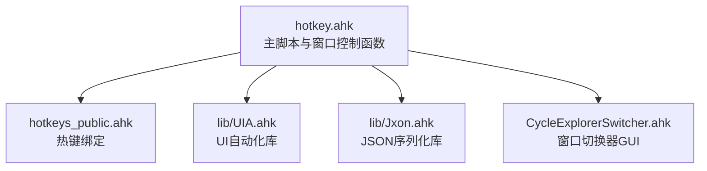
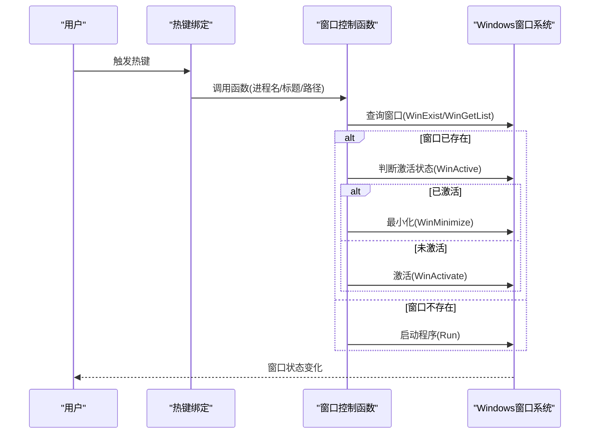
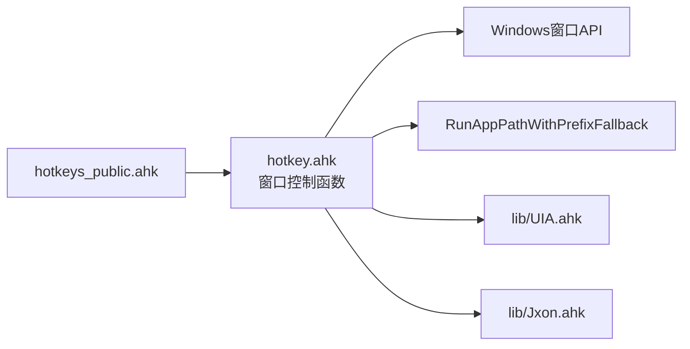

# 窗口控制函数

<cite>
**本文引用的文件**
- [hotkey.ahk](file://hotkey.ahk)
- [hotkeys_public.ahk](file://hotkeys_public.ahk)
- [CycleExplorerSwitcher.ahk](file://CycleExplorerSwitcher.ahk)
- [UIA.ahk](file://lib/UIA.ahk)
- [Jxon.ahk](file://lib/Jxon.ahk)
</cite>

## 目录
1. [简介](#简介)
2. [项目结构](#项目结构)
3. [核心组件](#核心组件)
4. [架构总览](#架构总览)
5. [详细组件分析](#详细组件分析)
6. [依赖关系分析](#依赖关系分析)
7. [性能考量](#性能考量)
8. [故障排查指南](#故障排查指南)
9. [结论](#结论)
10. [附录](#附录)

## 简介
本文件聚焦于仓库中的窗口控制函数，系统性梳理 ToggleWindow、ToggleWindowByTitle、ToggleWindow2、ToggleWindow12、ToggleWindow22 等函数的完整签名、参数说明、返回值、调用流程与行为特征，覆盖窗口匹配机制、激活/最小化逻辑、多实例应用程序处理策略、参数校验与错误处理、性能与稳定性建议，以及最佳实践与常见问题解决方案。文档同时给出与现有热键绑定的使用示例路径，便于快速集成与落地。

## 项目结构
仓库采用模块化组织，窗口控制函数集中于主脚本文件，配套 UIA 与 JSON 工具库用于复杂场景的窗口识别与数据处理。热键绑定位于公共热键文件中，部分热键直接调用窗口控制函数。

图表来源
- [hotkey.ahk:1-2000](file://hotkey.ahk#L1-L2000)
- [hotkeys_public.ahk:1-57](file://hotkeys_public.ahk#L1-L57)
- [lib/UIA.ahk:1-800](file://lib/UIA.ahk#L1-L800)
- [lib/Jxon.ahk:1-301](file://lib/Jxon.ahk#L1-L301)

章节来源
- [hotkey.ahk:1-2000](file://hotkey.ahk#L1-L2000)
- [hotkeys_public.ahk:1-57](file://hotkeys_public.ahk#L1-L57)

## 核心组件
- ToggleWindow(ahk_exe, APP_PATH)
  - 功能：根据进程名匹配窗口，若已激活则最小化，否则激活；若不存在则尝试运行程序路径。
  - 参数
    - ahk_exe: 程序进程名（如 "notepad++.exe"），用于 WinExist/WinActive 匹配。
    - APP_PATH: 程序路径（含 .lnk 或可执行路径），用于启动失败回退与路径修正。
  - 返回值：无（内部执行窗口操作或启动程序）。
  - 调用示例路径：[hotkey.ahk:1566-1573](file://hotkey.ahk#L1566-L1573)、[hotkey.ahk:1580-1585](file://hotkey.ahk#L1580-L1585)、[hotkeys_public.ahk:1-57](file://hotkeys_public.ahk#L1-L57)。

- ToggleWindowByTitle(ahk_exe, WinTitle, APP_PATH)
  - 功能：根据窗口标题匹配窗口，若已激活则最小化，否则激活；若不存在则尝试运行程序路径。
  - 参数
    - ahk_exe: 程序进程名（用于 WinExist/WinActive 匹配）。
    - WinTitle: 窗口标题（用于 WinExist/WINACTIVATE 匹配）。
    - APP_PATH: 程序路径（用于启动失败回退与路径修正）。
  - 返回值：无。
  - 调用示例路径：[hotkey.ahk:618-636](file://hotkey.ahk#L618-L636)。

- ToggleWindow2(ahk_exe, WinTitle, APP_PATH)
  - 功能：基于进程名与标题匹配窗口，附加过滤条件（第三个参数），若已激活则最小化，否则激活；若不存在则尝试运行程序路径。
  - 参数
    - ahk_exe: 程序进程名。
    - WinTitle: 窗口标题。
    - APP_PATH: 程序路径。
  - 返回值：无。
  - 调用示例路径：[hotkey.ahk:151-163](file://hotkey.ahk#L151-L163)。

- ToggleWindow12(ahk_exe, WinTitle, APP_PATH)
  - 功能：列出匹配窗口集合，遍历并激活，用于调试/演示多实例窗口处理。
  - 参数
    - ahk_exe: 程序进程名。
    - WinTitle: 窗口标题。
    - APP_PATH: 程序路径。
  - 返回值：无（内部循环激活并弹出确认对话框）。
  - 调用示例路径：[hotkey.ahk:168-200](file://hotkey.ahk#L168-L200)。

- ToggleWindow22(ahk_exe, WinTitle, APP_PATH)
  - 功能：列出匹配窗口集合，遍历并激活，用于调试/演示多实例窗口处理。
  - 参数
    - ahk_exe: 程序进程名。
    - WinTitle: 窗口标题。
    - APP_PATH: 程序路径。
  - 返回值：无（内部循环激活并弹出确认对话框）。
  - 调用示例路径：[hotkey.ahk:201-221](file://hotkey.ahk#L201-L221)。

章节来源
- [hotkey.ahk:120-221](file://hotkey.ahk#L120-L221)
- [hotkey.ahk:1566-1585](file://hotkey.ahk#L1566-L1585)
- [hotkey.ahk:618-636](file://hotkey.ahk#L618-L636)

## 架构总览
窗口控制函数围绕 AutoHotkey 的窗口 API（WinExist、WinActive、WinActivate、WinMinimize、WinShow 等）构建，结合路径解析与启动辅助函数，形成“存在即切换、不存在即启动”的统一模式。多实例处理策略通过 WinGetList 获取句柄集合，逐个激活或最小化，从而覆盖多个窗口实例。

图表来源
- [hotkey.ahk:120-221](file://hotkey.ahk#L120-L221)

## 详细组件分析

### ToggleWindow
- 函数签名与参数
  - 签名：ToggleWindow(ahk_exe, APP_PATH)
  - 参数
    - ahk_exe: 进程名（字符串）
    - APP_PATH: 程序路径（字符串）
- 匹配机制
  - WinExist("ahk_exe " ahk_exe)：按进程名匹配窗口是否存在。
  - WinActive("ahk_exe " ahk_exe)：判断当前是否处于激活状态。
- 激活/最小化逻辑
  - 若已激活：WinMinimize
  - 若未激活：WinActivate
- 多实例策略
  - 仅按进程名匹配，不区分实例；若存在多个实例，行为取决于 WinActive 的判定与系统窗口管理。
- 错误处理
  - 不存在时调用 RunAppPathWithPrefixFallback(APP_PATH)，内部包含路径存在性检查与启动异常捕获。
- 性能与稳定性
  - WinExist/WinActive/WinActivate/WinMinimize 为轻量调用；多实例场景建议配合标题或类名细化匹配。
- 使用示例
  - [hotkey.ahk:1566-1573](file://hotkey.ahk#L1566-L1573)
  - [hotkey.ahk:1580-1585](file://hotkey.ahk#L1580-L1585)

章节来源
- [hotkey.ahk:120-134](file://hotkey.ahk#L120-L134)
- [hotkey.ahk:76-118](file://hotkey.ahk#L76-L118)

### ToggleWindowByTitle
- 函数签名与参数
  - 签名：ToggleWindowByTitle(ahk_exe, WinTitle, APP_PATH)
  - 参数
    - ahk_exe: 进程名（字符串）
    - WinTitle: 窗口标题（字符串）
    - APP_PATH: 程序路径（字符串）
- 匹配机制
  - WinExist(WinTitle)：按标题匹配窗口是否存在。
  - WinActive(WinTitle)：判断当前是否处于激活状态。
- 激活/最小化逻辑
  - 若已激活：WinMinimize
  - 若未激活：WinActivate
- 多实例策略
  - 仅按标题匹配，可能命中多个实例；建议配合更精确的标题或使用 WinGetList 进一步筛选。
- 错误处理
  - 不存在时调用 RunAppPathWithPrefixFallback(APP_PATH)。
- 使用示例
  - [hotkey.ahk:618-636](file://hotkey.ahk#L618-L636)

章节来源
- [hotkey.ahk:135-146](file://hotkey.ahk#L135-L146)
- [hotkey.ahk:76-118](file://hotkey.ahk#L76-L118)

### ToggleWindow2
- 函数签名与参数
  - 签名：ToggleWindow2(ahk_exe, WinTitle, APP_PATH)
  - 参数
    - ahk_exe: 进程名（字符串）
    - WinTitle: 窗口标题（字符串）
    - APP_PATH: 程序路径（字符串）
- 匹配机制
  - WinExist("ahk_exe " ahk_exe, WinTitle, "Photos and Videos")：按进程名与标题匹配，并附加过滤条件（第三个参数）。
  - WinActive(...)：判断当前是否处于激活状态。
- 激活/最小化逻辑
  - 若已激活：WinMinimize
  - 若未激活：WinActivate
- 多实例策略
  - 通过 WinGetList 获取匹配集合，但函数体未显式遍历；建议在需要多实例处理时改用 ToggleWindow12/ToggleWindow22。
- 错误处理
  - 不存在时调用 RunAppPathWithPrefixFallback(APP_PATH)。
- 使用示例
  - [hotkey.ahk:151-163](file://hotkey.ahk#L151-L163)

章节来源
- [hotkey.ahk:151-163](file://hotkey.ahk#L151-L163)
- [hotkey.ahk:76-118](file://hotkey.ahk#L76-L118)

### ToggleWindow12
- 函数签名与参数
  - 签名：ToggleWindow12(ahk_exe, WinTitle, APP_PATH)
  - 参数
    - ahk_exe: 进程名（字符串）
    - WinTitle: 窗口标题（字符串）
    - APP_PATH: 程序路径（字符串）
- 匹配机制
  - ids := WinGetList("ahk_exe " ahk_exe, WinTitle, "Photos and Videos")：获取匹配窗口句柄集合。
- 多实例策略
  - 遍历集合，逐一 WinActivate 并弹出确认对话框，适合调试与演示多实例窗口切换。
- 激活/最小化逻辑
  - 该函数主要用于演示，不直接执行最小化/激活；实际切换逻辑可参考其他函数。
- 错误处理
  - 不存在时调用 RunAppPathWithPrefixFallback(APP_PATH)。
- 使用示例
  - [hotkey.ahk:168-200](file://hotkey.ahk#L168-L200)

章节来源
- [hotkey.ahk:168-200](file://hotkey.ahk#L168-L200)
- [hotkey.ahk:76-118](file://hotkey.ahk#L76-L118)

### ToggleWindow22
- 函数签名与参数
  - 签名：ToggleWindow22(ahk_exe, WinTitle, APP_PATH)
  - 参数
    - ahk_exe: 进程名（字符串）
    - WinTitle: 窗口标题（字符串）
    - APP_PATH: 程序路径（字符串）
- 匹配机制
  - ids := WinGetList("ahk_exe " ahk_exe, WinTitle, "Program Manager")：获取匹配窗口句柄集合。
- 多实例策略
  - 遍历集合，逐一 WinActivate 并弹出确认对话框，适合调试与演示多实例窗口切换。
- 激活/最小化逻辑
  - 该函数主要用于演示，不直接执行最小化/激活；实际切换逻辑可参考其他函数。
- 错误处理
  - 不存在时调用 RunAppPathWithPrefixFallback(APP_PATH)。
- 使用示例
  - [hotkey.ahk:201-221](file://hotkey.ahk#L201-L221)

章节来源
- [hotkey.ahk:201-221](file://hotkey.ahk#L201-L221)
- [hotkey.ahk:76-118](file://hotkey.ahk#L76-L118)

### 参数验证与错误处理
- 参数验证规则
  - ahk_exe：字符串，作为进程名参与 WinExist/WinActive 匹配。
  - WinTitle：字符串，作为标题参与 WinExist/WINACTIVATE 匹配。
  - APP_PATH：字符串，作为启动路径参与 RunAppPathWithPrefixFallback。
- 错误处理机制
  - RunAppPathWithPrefixFallback：若路径不存在或启动失败，弹出错误消息框；若协议路径（如 ms-phone:）不走文件存在判断，直接尝试运行并捕获异常。
  - WinGetList：在多实例演示函数中使用，若无匹配窗口则集合为空，遍历时不会执行任何操作。
- 性能考虑
  - WinGetList 会枚举匹配窗口，多实例较多时会有一定开销；建议在必要时缩小匹配范围（进程名+标题+过滤条件）。

章节来源
- [hotkey.ahk:76-118](file://hotkey.ahk#L76-L118)
- [hotkey.ahk:168-221](file://hotkey.ahk#L168-L221)

### 窗口匹配机制与激活/最小化逻辑
- 匹配机制
  - 进程名匹配：WinExist("ahk_exe " ahk_exe)、WinActive("ahk_exe " ahk_exe)。
  - 标题匹配：WinExist(WinTitle)、WinActive(WinTitle)。
  - 多实例匹配：WinGetList("ahk_exe " ahk_exe, WinTitle, Filter)。
- 激活/最小化逻辑
  - 已激活：WinMinimize
  - 未激活：WinActivate
  - 特殊场景：WinShow("ahk_id " hwnd) 用于显示隐藏窗口后再激活（见 openVSCode）。
- 多实例应用程序处理策略
  - 使用 WinGetList 获取句柄集合，逐个激活或最小化，适用于多实例场景。
  - 对于特定应用（如 VS Code），可通过 WinExist/WinActive/WinMinimize/WinShow 组合实现更精细的控制。

章节来源
- [hotkey.ahk:120-221](file://hotkey.ahk#L120-L221)
- [hotkey.ahk:1628-1646](file://hotkey.ahk#L1628-L1646)

### 与 UIA/JSON 的集成
- UIA 集成
  - 通过 UIA.ElementFromHandle 等接口定位窗口元素，用于复杂交互（如微信公众号标签页抓取）。
  - UIA 库提供丰富的属性与模式支持，适合需要稳定交互的场景。
- JSON 集成
  - 使用 Jxon 库加载/保存配置（如浏览器应用配置），为窗口控制提供动态配置能力。

章节来源
- [hotkey.ahk:2249-2295](file://hotkey.ahk#L2249-L2295)
- [lib/UIA.ahk:1-800](file://lib/UIA.ahk#L1-L800)
- [lib/Jxon.ahk:1-301](file://lib/Jxon.ahk#L1-L301)

## 依赖关系分析
- 热键绑定依赖窗口控制函数
  - 热键文件 hotkeys_public.ahk 中的热键直接调用 ToggleWindow/ToggleWindowByTitle 等函数。
- 窗口控制函数依赖系统窗口 API
  - WinExist/WinActive/WinActivate/WinMinimize/WinShow/WinGetList 等。
- 路径解析与启动辅助
  - RunAppPathWithPrefixFallback：支持协议路径与双盘符路径互换，增强跨盘符兼容性。
- UIA/JSON 工具库
  - UIA 用于复杂窗口元素交互；Jxon 用于配置读取与保存。

图表来源
- [hotkeys_public.ahk:1-57](file://hotkeys_public.ahk#L1-L57)
- [hotkey.ahk:120-221](file://hotkey.ahk#L120-L221)
- [hotkey.ahk:76-118](file://hotkey.ahk#L76-L118)
- [lib/UIA.ahk:1-800](file://lib/UIA.ahk#L1-L800)
- [lib/Jxon.ahk:1-301](file://lib/Jxon.ahk#L1-L301)

章节来源
- [hotkeys_public.ahk:1-57](file://hotkeys_public.ahk#L1-L57)
- [hotkey.ahk:76-118](file://hotkey.ahk#L76-L118)

## 性能考量
- WinExist/WinActive/WinActivate/WinMinimize 为轻量调用，适合高频热键触发。
- WinGetList 会枚举匹配窗口，多实例较多时建议：
  - 缩小匹配范围（进程名+标题+过滤条件）。
  - 仅在需要时调用，避免不必要的遍历。
- 启动程序时的路径解析与异常捕获会带来额外开销，建议：
  - 预先校验路径存在性。
  - 使用协议路径时避免文件存在性判断，直接尝试运行。

## 故障排查指南
- 症状：热键触发无响应
  - 排查：确认热键绑定是否正确，函数是否被调用。
  - 参考：[hotkeys_public.ahk:1-57](file://hotkeys_public.ahk#L1-L57)
- 症状：窗口未切换或切换异常
  - 排查：检查进程名/标题是否准确；确认 WinExist/WinActive 判定逻辑。
  - 参考：[hotkey.ahk:120-163](file://hotkey.ahk#L120-L163)
- 症状：多实例应用切换混乱
  - 排查：使用 WinGetList 获取句柄集合，逐个激活或最小化；必要时结合标题进一步筛选。
  - 参考：[hotkey.ahk:168-221](file://hotkey.ahk#L168-L221)
- 症状：启动失败或路径错误
  - 排查：RunAppPathWithPrefixFallback 是否能正确解析路径；协议路径是否有效。
  - 参考：[hotkey.ahk:76-118](file://hotkey.ahk#L76-L118)

章节来源
- [hotkey.ahk:76-118](file://hotkey.ahk#L76-L118)
- [hotkey.ahk:120-221](file://hotkey.ahk#L120-L221)
- [hotkeys_public.ahk:1-57](file://hotkeys_public.ahk#L1-L57)

## 结论
窗口控制函数提供了统一的“存在即切换、不存在即启动”的窗口管理能力，结合 WinGetList 的多实例处理策略，能够满足大多数日常应用的窗口切换需求。对于复杂交互场景，可借助 UIA 与 JSON 工具库进一步增强稳定性与可维护性。建议在实际使用中：
- 明确进程名/标题匹配范围，避免误判。
- 在多实例场景下使用 WinGetList 进行精细化控制。
- 对启动失败进行容错处理，提供用户反馈。
- 高频热键场景下关注 WinGetList 的性能影响，必要时优化匹配条件。

## 附录
- 最佳实践
  - 优先使用进程名+标题的双条件匹配，提高准确性。
  - 对多实例应用，使用 WinGetList 获取句柄集合，逐个处理。
  - 启动失败时提供明确的错误提示，便于用户修复路径。
  - 在热键绑定中保持函数签名一致，便于维护与扩展。
- 常见问题
  - 标题随内容变化导致匹配失败：建议使用更稳定的进程名或类名。
  - 多实例切换顺序不确定：在调用前记录当前活动窗口，切换后恢复焦点。
  - 跨盘符路径问题：使用 RunAppPathWithPrefixFallback 自动切换路径前缀。