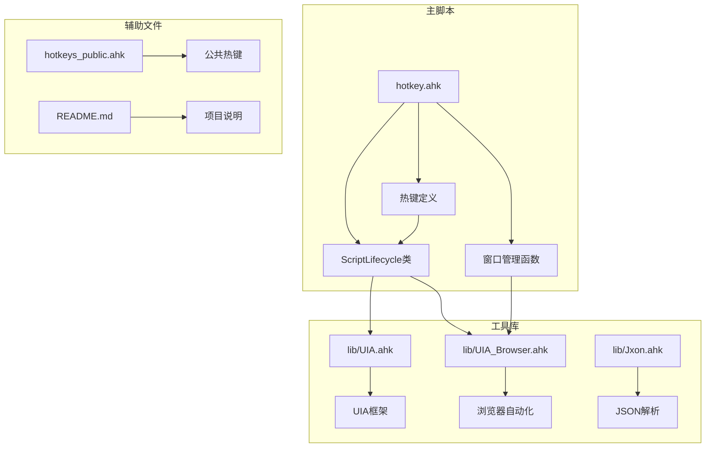
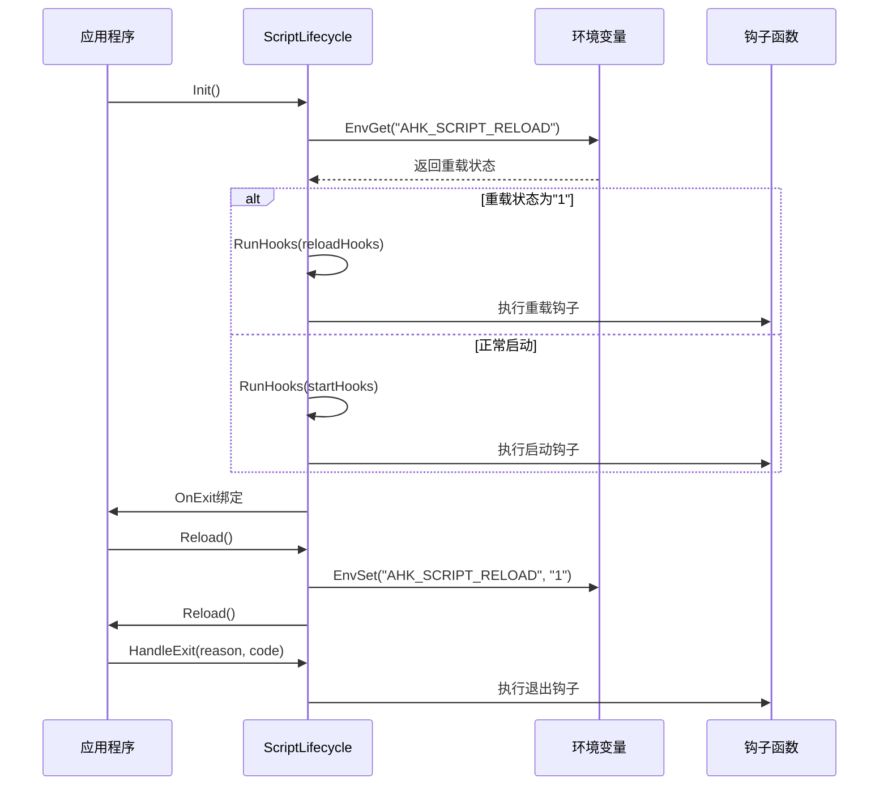
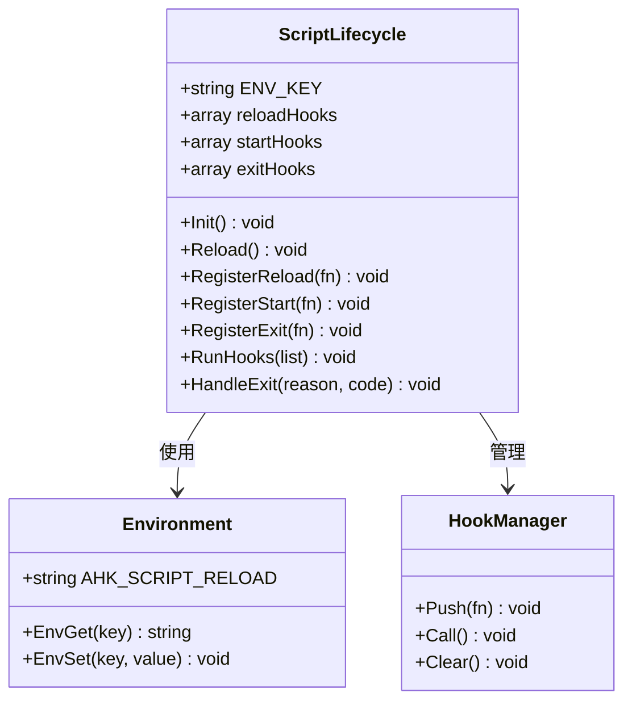
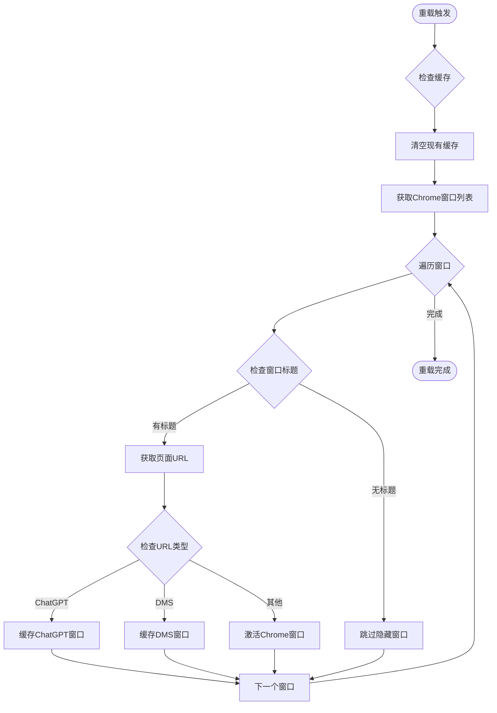
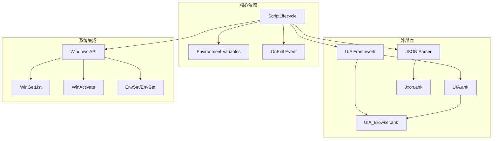

# 脚本生命周期管理函数

<cite>
**本文档引用的文件**
- [hotkey.ahk](file://hotkey.ahk)
- [hotkeys_public.ahk](file://hotkeys_public.ahk)
- [lib/UIA.ahk](file://lib/UIA.ahk)
- [lib/UIA_Browser.ahk](file://lib/UIA_Browser.ahk)
- [lib/Jxon.ahk](file://lib/Jxon.ahk)
- [README.md](file://README.md)
</cite>

## 目录
1. [简介](#简介)
2. [项目结构](#项目结构)
3. [核心组件](#核心组件)
4. [架构概览](#架构概览)
5. [详细组件分析](#详细组件分析)
6. [依赖关系分析](#依赖关系分析)
7. [性能考虑](#性能考虑)
8. [故障排除指南](#故障排除指南)
9. [结论](#结论)

## 简介

本文档详细介绍了Autohotkey v2项目中的脚本生命周期管理函数，重点分析了`ScriptLifecycle`类的完整接口设计。该类提供了事件驱动的脚本生命周期管理能力，包括初始化、重载、钩子注册和退出处理等功能。

该项目是一个基于Autohotkey v2的热键脚本集合，用于自动化各种应用程序的启动和窗口管理。脚本生命周期管理是整个系统的核心基础设施，确保脚本能够正确地初始化、响应重载请求、执行清理操作并在退出时进行适当的资源回收。

## 项目结构

项目采用模块化组织结构，主要包含以下核心组件：



**图表来源**
- [hotkey.ahk:752-809](file://hotkey.ahk#L752-L809)
- [lib/UIA.ahk:1-800](file://lib/UIA.ahk#L1-L800)
- [lib/UIA_Browser.ahk:1-200](file://lib/UIA_Browser.ahk#L1-L200)

**章节来源**
- [hotkey.ahk:1-200](file://hotkey.ahk#L1-L200)
- [README.md:1-2](file://README.md#L1-L2)

## 核心组件

### ScriptLifecycle类概述

`ScriptLifecycle`类是整个脚本生命周期管理的核心，采用了静态方法设计模式，提供了一个统一的事件驱动架构。该类通过环境变量机制实现脚本重载功能，并支持多种类型的钩子函数注册。

#### 主要特性

1. **环境变量驱动的重载机制**：使用`AHK_SCRIPT_RELOAD`环境变量标记脚本重载状态
2. **事件驱动架构**：支持启动、重载和退出三种生命周期事件
3. **钩子函数注册系统**：提供灵活的回调函数注册机制
4. **自动资源管理**：集成OnExit事件处理程序

**章节来源**
- [hotkey.ahk:752-809](file://hotkey.ahk#L752-L809)

## 架构概览



**图表来源**
- [hotkey.ahk:760-775](file://hotkey.ahk#L760-L775)
- [hotkey.ahk:777-781](file://hotkey.ahk#L777-L781)
- [hotkey.ahk:804-808](file://hotkey.ahk#L804-L808)

## 详细组件分析

### ScriptLifecycle类详细分析

#### 类结构设计



**图表来源**
- [hotkey.ahk:752-809](file://hotkey.ahk#L752-L809)

#### 环境变量机制

脚本使用`AHK_SCRIPT_RELOAD`环境变量作为重载状态的标记机制：

- **初始状态**：环境变量为空字符串
- **重载标记**：设置为"1"表示脚本正在重载
- **状态清除**：在重载过程中自动清除标记

这种设计避免了使用全局变量，提供了更可靠的跨脚本通信机制。

**章节来源**
- [hotkey.ahk:754](file://hotkey.ahk#L754)
- [hotkey.ahk:762](file://hotkey.ahk#L762)
- [hotkey.ahk:766](file://hotkey.ahk#L766)

#### 钩子函数注册系统

系统支持三种类型的钩子函数注册：

1. **启动钩子** (`RegisterStart`)：脚本启动时执行
2. **重载钩子** (`RegisterReload`)：脚本重载时执行  
3. **退出钩子** (`RegisterExit`)：脚本退出时执行

每种钩子类型都有独立的注册表，确保生命周期事件的精确控制。

**章节来源**
- [hotkey.ahk:783](file://hotkey.ahk#L783)
- [hotkey.ahk:788](file://hotkey.ahk#L788)
- [hotkey.ahk:793](file://hotkey.ahk#L793)

### API详细规范

#### Init() 方法

**签名**：`static Init()`

**功能**：初始化脚本生命周期管理器

**处理流程**：
1. 检查`AHK_SCRIPT_RELOAD`环境变量状态
2. 根据状态执行相应的钩子函数列表
3. 注册退出处理程序

**返回值**：无（void）

**使用示例**：
```autohotkey
ScriptLifecycle.Init()
```

**章节来源**
- [hotkey.ahk:760](file://hotkey.ahk#L760)

#### Reload() 方法

**签名**：`static Reload()`

**功能**：触发脚本重载机制

**处理流程**：
1. 设置`AHK_SCRIPT_RELOAD`环境变量为"1"
2. 调用Autohotkey内置的`Reload()`函数

**返回值**：无（void）

**使用示例**：
```autohotkey
ScriptLifecycle.Reload()
```

**章节来源**
- [hotkey.ahk:777](file://hotkey.ahk#L777)

#### RegisterReload(fn) 方法

**签名**：`static RegisterReload(fn)`

**参数**：
- `fn`：回调函数对象

**功能**：注册重载钩子函数

**返回值**：无（void）

**使用示例**：
```autohotkey
ScriptLifecycle.RegisterReload(BuildBrowserCache)
```

**章节来源**
- [hotkey.ahk:783](file://hotkey.ahk#L783)

#### RegisterStart(fn) 方法

**签名**：`static RegisterStart(fn)`

**参数**：
- `fn`：回调函数对象

**功能**：注册启动钩子函数

**返回值**：无（void）

**使用示例**：
```autohotkey
ScriptLifecycle.RegisterStart(InitializeSettings)
```

**章节来源**
- [hotkey.ahk:788](file://hotkey.ahk#L788)

#### RegisterExit(fn) 方法

**签名**：`static RegisterExit(fn)`

**参数**：
- `fn`：回调函数对象

**功能**：注册退出钩子函数

**返回值**：无（void）

**使用示例**：
```autohotkey
ScriptLifecycle.RegisterExit(CleanupResources)
```

**章节来源**
- [hotkey.ahk:793](file://hotkey.ahk#L793)

#### RunHooks(list) 方法

**签名**：`static RunHooks(list)`

**参数**：
- `list`：函数数组

**功能**：执行指定的钩子函数列表

**处理流程**：
1. 遍历函数数组
2. 调用每个函数的`Call()`方法

**返回值**：无（void）

**章节来源**
- [hotkey.ahk:798](file://hotkey.ahk#L798)

#### HandleExit(reason, code) 方法

**签名**：`static HandleExit(reason, code)`

**参数**：
- `reason`：退出原因
- `code`：退出代码

**功能**：处理脚本退出事件

**处理流程**：
1. 遍历退出钩子函数列表
2. 调用每个函数并传递参数

**返回值**：无（void）

**章节来源**
- [hotkey.ahk:804](file://hotkey.ahk#L804)

### 实际应用场景

#### 浏览器缓存构建

项目中使用`BuildBrowserCache`函数作为重载钩子的典型示例：



**图表来源**
- [hotkey.ahk:2163-2209](file://hotkey.ahk#L2163-L2209)

**章节来源**
- [hotkey.ahk:811](file://hotkey.ahk#L811)
- [hotkey.ahk:2163](file://hotkey.ahk#L2163)

## 依赖关系分析



**图表来源**
- [hotkey.ahk:752-809](file://hotkey.ahk#L752-L809)
- [lib/UIA.ahk:1-800](file://lib/UIA.ahk#L1-L800)
- [lib/Jxon.ahk:1-301](file://lib/Jxon.ahk#L1-L301)

### 关键依赖关系

1. **环境变量依赖**：脚本重载机制完全依赖于Autohotkey的环境变量系统
2. **UIA框架集成**：浏览器自动化功能依赖于UIA框架
3. **Windows窗口管理**：大量使用Windows窗口API进行应用程序控制
4. **事件驱动架构**：基于Autohotkey的事件系统实现异步处理

**章节来源**
- [hotkey.ahk:762](file://hotkey.ahk#L762)
- [hotkey.ahk:2168](file://hotkey.ahk#L2168)

## 性能考虑

### 生命周期优化策略

1. **延迟初始化**：钩子函数在需要时才执行，避免不必要的初始化开销
2. **缓存机制**：使用`hwndCache`全局变量缓存浏览器窗口句柄，减少重复查询
3. **条件过滤**：在重载过程中跳过无意义的隐藏窗口，提高处理效率

### 内存管理

- **自动垃圾回收**：利用Autohotkey的自动内存管理机制
- **COM对象清理**：在浏览器自动化完成后及时释放UIA对象引用
- **资源清理**：退出钩子确保所有资源得到正确释放

## 故障排除指南

### 常见问题及解决方案

#### 脚本重载失败

**症状**：调用`Reload()`后脚本没有重启

**可能原因**：
1. 环境变量设置失败
2. 重载钩子函数抛出异常
3. 系统权限不足

**解决方法**：
```autohotkey
try {
    ScriptLifecycle.Reload()
} catch e {
    MsgBox "重载失败: " e.Message
}
```

#### 钩子函数执行异常

**症状**：脚本启动或重载时出现错误

**解决方法**：
```autohotkey
ScriptLifecycle.RegisterStart(funcWithTryCatch)
ScriptLifecycle.RegisterReload(funcWithTryCatch)
ScriptLifecycle.RegisterExit(funcWithTryCatch)

funcWithTryCatch() {
    try {
        // 你的代码
    } catch e {
        MsgBox "钩子函数错误: " e.Message
    }
}
```

#### 窗口查找失败

**症状**：无法找到目标应用程序窗口

**解决方法**：
```autohotkey
; 使用更宽松的匹配条件
ids := WinGetList("ahk_exe chrome.exe")

; 检查窗口状态
for hwnd in ids {
    if WinExist("ahk_id " hwnd) {
        ; 处理窗口
    }
}
```

**章节来源**
- [hotkey.ahk:2204](file://hotkey.ahk#L2204)

## 结论

`ScriptLifecycle`类为Autohotkey v2项目提供了强大而灵活的脚本生命周期管理能力。通过环境变量驱动的重载机制、事件驱动的钩子系统和自动化的资源管理，该类确保了脚本能够在各种运行状态下保持稳定和可靠。

### 设计优势

1. **模块化设计**：清晰的职责分离，便于维护和扩展
2. **事件驱动架构**：支持异步处理和回调机制
3. **环境变量机制**：提供可靠的跨脚本通信方式
4. **钩子函数系统**：灵活的扩展点设计

### 最佳实践建议

1. **错误处理**：始终在钩子函数中包含适当的错误处理逻辑
2. **资源管理**：确保在退出钩子中清理所有占用的资源
3. **性能优化**：合理使用缓存机制，避免重复的系统调用
4. **测试验证**：在开发环境中充分测试重载和退出流程

该生命周期管理系统为Autohotkey脚本的长期运行和维护奠定了坚实的基础，是现代自动化脚本开发的重要基础设施。