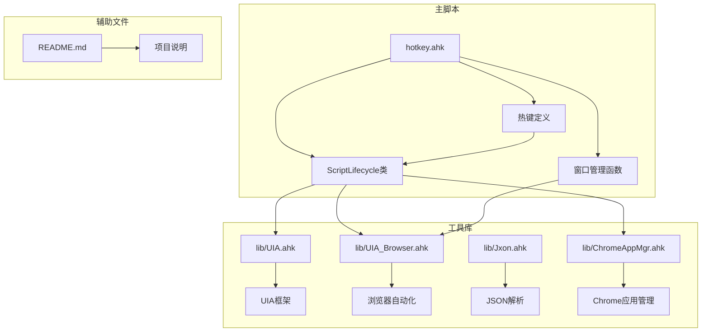
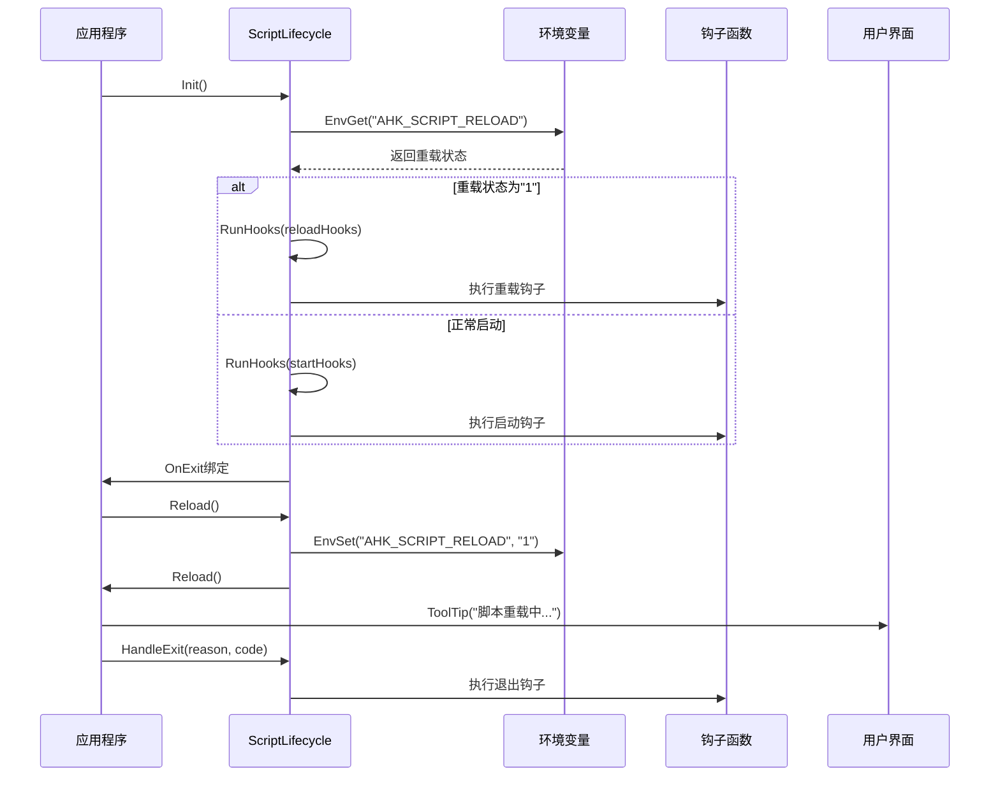
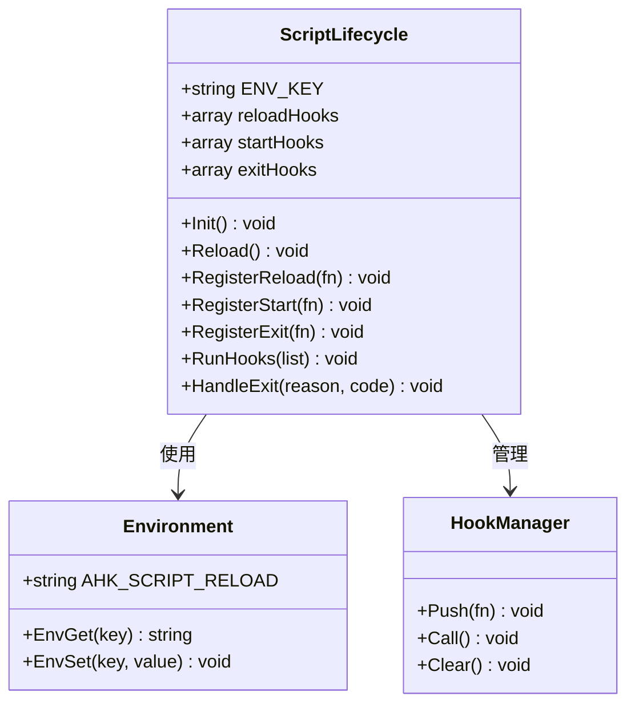
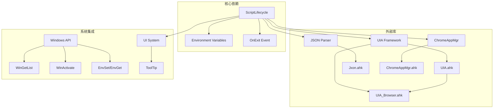

# 脚本生命周期管理函数

<cite>
**本文档引用的文件**
- [hotkey.ahk](file://hotkey.ahk)
- [lib/ChromeAppMgr.ahk](file://lib/ChromeAppMgr.ahk)
- [lib/UIA_Browser.ahk](file://lib/UIA_Browser.ahk)
- [lib/Jxon.ahk](file://lib/Jxon.ahk)
- [README.md](file://README.md)
</cite>

## 更新摘要
**变更内容**
- 新增脚本重载时的工具提示通知功能
- 禁用脚本重载时自动重建浏览器缓存以避免UIA_Browser JSExecute干扰
- 优化了热键触发时的用户反馈机制

## 目录
1. [简介](#简介)
2. [项目结构](#项目结构)
3. [核心组件](#核心组件)
4. [架构概览](#架构概览)
5. [详细组件分析](#详细组件分析)
6. [依赖关系分析](#依赖关系分析)
7. [性能考虑](#性能考虑)
8. [故障排除指南](#故障排除指南)
9. [结论](#结论)

## 简介

本文档详细介绍了Autohotkey v2项目中的脚本生命周期管理函数，重点分析了`ScriptLifecycle`类的完整接口设计。该类提供了事件驱动的脚本生命周期管理能力，包括初始化、重载、钩子注册和退出处理等功能。

该项目是一个基于Autohotkey v2的热键脚本集合，用于自动化各种应用程序的启动和窗口管理。脚本生命周期管理是整个系统的核心基础设施，确保脚本能够正确地初始化、响应重载请求、执行清理操作并在退出时进行适当的资源回收。

**最新更新**：新增了脚本重载过程中的用户反馈机制，通过工具提示显示"脚本重载中..."状态，同时禁用了自动浏览器缓存重建以防止与UIA_Browser的JSExecute功能产生冲突。

## 项目结构

项目采用模块化组织结构，主要包含以下核心组件：


```mermaid
graph TB
subgraph "主脚本"
A[hotkey.ahk] --> B[ScriptLifecycle类]
A --> C[热键定义]
A --> D[窗口管理函数]
end
subgraph "工具库"
E[lib/UIA.ahk] --> F[UIA框架]
G[lib/UIA_Browser.ahk] --> H[浏览器自动化]
I[lib/Jxon.ahk] --> J[JSON解析]
K[lib/ChromeAppMgr.ahk] --> L[Chrome应用管理]
end
subgraph "辅助文件"
M[README.md] --> N[项目说明]
end
B --> E
B --> G
C --> B
D --> G
B --> K
```

**图表来源**
- [hotkey.ahk:321-378](file://hotkey.ahk#L321-L378)
- [lib/UIA.ahk:1-800](file://lib/UIA.ahk#L1-L800)
- [lib/UIA_Browser.ahk:1-200](file://lib/UIA_Browser.ahk#L1-L200)
- [lib/ChromeAppMgr.ahk:1-406](file://lib/ChromeAppMgr.ahk#L1-L406)

**章节来源**
- [hotkey.ahk:1-200](file://hotkey.ahk#L1-L200)
- [README.md:1-2](file://README.md#L1-L2)

## 核心组件

### ScriptLifecycle类概述

`ScriptLifecycle`类是整个脚本生命周期管理的核心，采用了静态方法设计模式，提供了一个统一的事件驱动架构。该类通过环境变量机制实现脚本重载功能，并支持多种类型的钩子函数注册。

#### 主要特性

1. **环境变量驱动的重载机制**：使用`AHK_SCRIPT_RELOAD`环境变量标记脚本重载状态
2. **事件驱动架构**：支持启动、重载和退出三种生命周期事件
3. **钩子函数注册系统**：提供灵活的回调函数注册机制
4. **自动资源管理**：集成OnExit事件处理程序
5. **用户反馈机制**：在脚本重载过程中显示工具提示通知

**章节来源**
- [hotkey.ahk:321-378](file://hotkey.ahk#L321-L378)

## 架构概览


```mermaid
sequenceDiagram
participant App as 应用程序
participant SL as ScriptLifecycle
participant Env as 环境变量
participant Hooks as 钩子函数
participant UI as 用户界面
App->>SL : Init()
SL->>Env : EnvGet("AHK_SCRIPT_RELOAD")
Env-->>SL : 返回重载状态
alt 重载状态为"1"
SL->>SL : RunHooks(reloadHooks)
SL->>Hooks : 执行重载钩子
else 正常启动
SL->>SL : RunHooks(startHooks)
SL->>Hooks : 执行启动钩子
end
SL->>App : OnExit绑定
App->>SL : Reload()
SL->>Env : EnvSet("AHK_SCRIPT_RELOAD", "1")
SL->>App : Reload()
App->>UI : ToolTip("脚本重载中...")
App->>SL : HandleExit(reason, code)
SL->>Hooks : 执行退出钩子
```

**图表来源**
- [hotkey.ahk:329-344](file://hotkey.ahk#L329-L344)
- [hotkey.ahk:346-350](file://hotkey.ahk#L346-L350)
- [hotkey.ahk:392-398](file://hotkey.ahk#L392-L398)
- [hotkey.ahk:373-377](file://hotkey.ahk#L373-L377)

## 详细组件分析

### ScriptLifecycle类详细分析

#### 类结构设计


```mermaid
classDiagram
class ScriptLifecycle {
+string ENV_KEY
+array reloadHooks
+array startHooks
+array exitHooks
+Init() void
+Reload() void
+RegisterReload(fn) void
+RegisterStart(fn) void
+RegisterExit(fn) void
+RunHooks(list) void
+HandleExit(reason, code) void
}
class Environment {
+string AHK_SCRIPT_RELOAD
+EnvGet(key) string
+EnvSet(key, value) void
}
class HookManager {
+Push(fn) void
+Call() void
+Clear() void
}
ScriptLifecycle --> Environment : 使用
ScriptLifecycle --> HookManager : 管理
```

**图表来源**
- [hotkey.ahk:321-378](file://hotkey.ahk#L321-L378)

#### 环境变量机制

脚本使用`AHK_SCRIPT_RELOAD`环境变量作为重载状态的标记机制：

- **初始状态**：环境变量为空字符串
- **重载标记**：设置为"1"表示脚本正在重载
- **状态清除**：在重载过程中自动清除标记

这种设计避免了使用全局变量，提供了更可靠的跨脚本通信机制。

**章节来源**
- [hotkey.ahk:323](file://hotkey.ahk#L323)
- [hotkey.ahk:331](file://hotkey.ahk#L331)
- [hotkey.ahk:335](file://hotkey.ahk#L335)

#### 钩子函数注册系统

系统支持三种类型的钩子函数注册：

1. **启动钩子** (`RegisterStart`)：脚本启动时执行
2. **重载钩子** (`RegisterReload`)：脚本重载时执行  
3. **退出钩子** (`RegisterExit`)：脚本退出时执行

每种钩子类型都有独立的注册表，确保生命周期事件的精确控制。

**章节来源**
- [hotkey.ahk:352](file://hotkey.ahk#L352)
- [hotkey.ahk:357](file://hotkey.ahk#L357)
- [hotkey.ahk:362](file://hotkey.ahk#L362)

### API详细规范

#### Init() 方法

**签名**：`static Init()`

**功能**：初始化脚本生命周期管理器

**处理流程**：
1. 检查`AHK_SCRIPT_RELOAD`环境变量状态
2. 根据状态执行相应的钩子函数列表
3. 注册退出处理程序

**返回值**：无（void）

**使用示例**：
```autohotkey
ScriptLifecycle.Init()
```

**章节来源**
- [hotkey.ahk:329-344](file://hotkey.ahk#L329-L344)

#### Reload() 方法

**签名**：`static Reload()`

**功能**：触发脚本重载机制

**处理流程**：
1. 设置`AHK_SCRIPT_RELOAD`环境变量为"1"
2. 调用Autohotkey内置的`Reload()`函数

**返回值**：无（void）

**使用示例**：
```autohotkey
ScriptLifecycle.Reload()
```

**章节来源**
- [hotkey.ahk:346-350](file://hotkey.ahk#L346-L350)

#### RegisterReload(fn) 方法

**签名**：`static RegisterReload(fn)`

**参数**：
- `fn`：回调函数对象

**功能**：注册重载钩子函数

**返回值**：无（void）

**使用示例**：
```autohotkey
; 注意：当前版本已禁用自动浏览器缓存重建
; ScriptLifecycle.RegisterReload(BuildBrowserCache)
```

**章节来源**
- [hotkey.ahk:352-355](file://hotkey.ahk#L352-L355)

#### RegisterStart(fn) 方法

**签名**：`static RegisterStart(fn)`

**参数**：
- `fn`：回调函数对象

**功能**：注册启动钩子函数

**返回值**：无（void）

**使用示例**：
```autohotkey
ScriptLifecycle.RegisterStart(InitializeSettings)
```

**章节来源**
- [hotkey.ahk:357-360](file://hotkey.ahk#L357-L360)

#### RegisterExit(fn) 方法

**签名**：`static RegisterExit(fn)`

**参数**：
- `fn`：回调函数对象

**功能**：注册退出钩子函数

**返回值**：无（void）

**使用示例**：
```autohotkey
ScriptLifecycle.RegisterExit(CleanupResources)
```

**章节来源**
- [hotkey.ahk:362-365](file://hotkey.ahk#L362-L365)

#### RunHooks(list) 方法

**签名**：`static RunHooks(list)`

**参数**：
- `list`：函数数组

**功能**：执行指定的钩子函数列表

**处理流程**：
1. 遍历函数数组
2. 调用每个函数的`Call()`方法

**返回值**：无（void）

**章节来源**
- [hotkey.ahk:367-371](file://hotkey.ahk#L367-L371)

#### HandleExit(reason, code) 方法

**签名**：`static HandleExit(reason, code)`

**参数**：
- `reason`：退出原因
- `code`：退出代码

**功能**：处理脚本退出事件

**处理流程**：
1. 遍历退出钩子函数列表
2. 调用每个函数并传递参数

**返回值**：无（void）

**章节来源**
- [hotkey.ahk:373-377](file://hotkey.ahk#L373-L377)

### 工具提示通知机制

**新增功能**：在脚本重载过程中提供用户反馈

当用户按下Ctrl+Alt+R触发脚本重载时，系统会显示工具提示通知：

```autohotkey
^!r::
{
    ScriptLifecycle.Reload()
    ToolTip("脚本重载中...")
    SetTimer(() => ToolTip(), 1000)
}
```

这个机制确保用户知道脚本正在重载过程中，提供更好的用户体验。

**章节来源**
- [hotkey.ahk:392-398](file://hotkey.ahk#L392-L398)

### 浏览器缓存处理优化

**重要变更**：禁用脚本重载时自动重建浏览器缓存

为了避免UIA_Browser的JSExecute功能在脚本重载过程中产生干扰，系统现在不再自动重建浏览器缓存：

```autohotkey
; 不再在 Reload 时重建浏览器缓存：BuildBrowserCache 依赖 UIA_Browser，其 JSExecute
; 保底会把 "javascript:..." 写入地址栏并发送 Ctrl+L+Enter；在 Ctrl+Alt+R 重载
; （修饰键仍按住、Chrome 在前台）时，这串地址栏内容会被注入/覆盖到当前页面。
; 且 ActivateApp 现以进程级 FindExistingAppWindow 为首选路径，无需该缓存。
; ScriptLifecycle.RegisterReload(BuildBrowserCache)
```

这一变更解决了以下问题：
1. 防止JSExecute代码被意外注入到浏览器地址栏
2. 避免在重载过程中修改当前页面内容
3. 提高脚本重载的稳定性和可靠性

**章节来源**
- [hotkey.ahk:379-384](file://hotkey.ahk#L379-L384)
- [lib/ChromeAppMgr.ahk:223-237](file://lib/ChromeAppMgr.ahk#L223-L237)

### 实际应用场景

#### 短信验证码监听

项目中使用SmsCodeWatcher作为启动和退出钩子的典型示例：

```autohotkey
ScriptLifecycle.RegisterStart(SmsCodeWatcher.Start)
ScriptLifecycle.RegisterExit(SmsCodeWatcher.Stop)
```

**章节来源**
- [hotkey.ahk:386-388](file://hotkey.ahk#L386-L388)

## 依赖关系分析


```mermaid
graph TB
subgraph "核心依赖"
A[ScriptLifecycle] --> B[Environment Variables]
A --> C[OnExit Event]
end
subgraph "外部库"
D[UIA Framework] --> E[UIA.ahk]
D --> F[UIA_Browser.ahk]
G[JSON Parser] --> H[Jxon.ahk]
I[ChromeAppMgr] --> J[ChromeAppMgr.ahk]
end
subgraph "系统集成"
K[Windows API] --> L[WinGetList]
K --> M[WinActivate]
K --> N[EnvSet/EnvGet]
O[UI System] --> P[ToolTip]
end
A --> D
A --> G
A --> I
A --> O
E --> F
```

**图表来源**
- [hotkey.ahk:321-378](file://hotkey.ahk#L321-L378)
- [lib/UIA.ahk:1-800](file://lib/UIA.ahk#L1-L800)
- [lib/Jxon.ahk:1-301](file://lib/Jxon.ahk#L1-L301)
- [lib/ChromeAppMgr.ahk:1-406](file://lib/ChromeAppMgr.ahk#L1-L406)

### 关键依赖关系

1. **环境变量依赖**：脚本重载机制完全依赖于Autohotkey的环境变量系统
2. **UIA框架集成**：浏览器自动化功能依赖于UIA框架
3. **Chrome应用管理**：新的ChromeAppMgr模块提供浏览器窗口管理功能
4. **Windows窗口管理**：大量使用Windows窗口API进行应用程序控制
5. **用户界面反馈**：通过ToolTip提供重载状态反馈
6. **事件驱动架构**：基于Autohotkey的事件系统实现异步处理

**章节来源**
- [hotkey.ahk:331](file://hotkey.ahk#L331)
- [hotkey.ahk:396](file://hotkey.ahk#L396)

## 性能考虑

### 生命周期优化策略

1. **延迟初始化**：钩子函数在需要时才执行，避免不必要的初始化开销
2. **缓存机制**：使用`hwndCache`全局变量缓存浏览器窗口句柄，减少重复查询
3. **条件过滤**：在重载过程中跳过无意义的隐藏窗口，提高处理效率
4. **用户反馈优化**：使用定时器刷新工具提示，避免阻塞主线程

### 内存管理

- **自动垃圾回收**：利用Autohotkey的自动内存管理机制
- **COM对象清理**：在浏览器自动化完成后及时释放UIA对象引用
- **资源清理**：退出钩子确保所有资源得到正确释放

### 浏览器缓存优化

新的ChromeAppMgr模块采用了更高效的浏览器窗口查找策略：
- 优先使用窗口标题扫描而非进程命令行匹配
- 避免在重载过程中执行耗时的UIA操作
- 提供实时窗口查找和缓存兜底的双重机制

## 故障排除指南

### 常见问题及解决方案

#### 脚本重载失败

**症状**：调用`Reload()`后脚本没有重启

**可能原因**：
1. 环境变量设置失败
2. 重载钩子函数抛出异常
3. 系统权限不足

**解决方法**：
```autohotkey
try {
    ScriptLifecycle.Reload()
} catch e {
    MsgBox "重载失败: " e.Message
}
```

#### 工具提示不显示

**症状**：按Ctrl+Alt+R后没有看到"脚本重载中..."提示

**解决方法**：
```autohotkey
^!r::
{
    ScriptLifecycle.Reload()
    ToolTip("脚本重载中...")
    SetTimer(() => ToolTip(), 1000)
    ; 确保定时器正常工作
    if (A_TickCount - LastTooltipTime < 1000) {
        ToolTip("")
    }
}
```

#### 浏览器缓存相关问题

**症状**：浏览器应用无法正确激活或缓存失效

**解决方法**：
```autohotkey
; 手动重建浏览器缓存
global hwndCache := Map()
BuildBrowserCache()

; 检查缓存状态
for key, hwnd in hwndCache {
    MsgBox "缓存项: " key " -> " hwnd
}
```

#### 钩子函数执行异常

**症状**：脚本启动或重载时出现错误

**解决方法**：
```autohotkey
ScriptLifecycle.RegisterStart(funcWithTryCatch)
ScriptLifecycle.RegisterReload(funcWithTryCatch)
ScriptLifecycle.RegisterExit(funcWithTryCatch)

funcWithTryCatch() {
    try {
        ; 你的代码
    } catch e {
        MsgBox "钩子函数错误: " e.Message
    }
}
```

**章节来源**
- [hotkey.ahk:396](file://hotkey.ahk#L396)
- [lib/ChromeAppMgr.ahk:223-237](file://lib/ChromeAppMgr.ahk#L223-L237)

## 结论

`ScriptLifecycle`类为Autohotkey v2项目提供了强大而灵活的脚本生命周期管理能力。通过环境变量驱动的重载机制、事件驱动的钩子系统和自动化的资源管理，该类确保了脚本能够在各种运行状态下保持稳定和可靠。

### 设计优势

1. **模块化设计**：清晰的职责分离，便于维护和扩展
2. **事件驱动架构**：支持异步处理和回调机制
3. **环境变量机制**：提供可靠的跨脚本通信方式
4. **钩子函数系统**：灵活的扩展点设计
5. **用户反馈机制**：改进的用户体验，通过工具提示提供重载状态反馈
6. **稳定性优化**：禁用有问题的自动缓存重建，提高重载过程的稳定性

### 最佳实践建议

1. **错误处理**：始终在钩子函数中包含适当的错误处理逻辑
2. **资源管理**：确保在退出钩子中清理所有占用的资源
3. **性能优化**：合理使用缓存机制，避免重复的系统调用
4. **用户体验**：在长时间操作中提供用户反馈，如工具提示
5. **测试验证**：在开发环境中充分测试重载和退出流程
6. **兼容性考虑**：避免在重载过程中执行可能影响当前UI状态的复杂操作

该生命周期管理系统为Autohotkey脚本的长期运行和维护奠定了坚实的基础，是现代自动化脚本开发的重要基础设施。最新的工具提示通知功能和浏览器缓存优化进一步提升了系统的稳定性和用户体验。