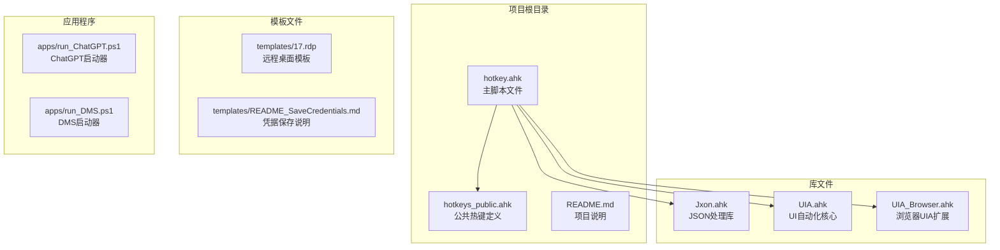
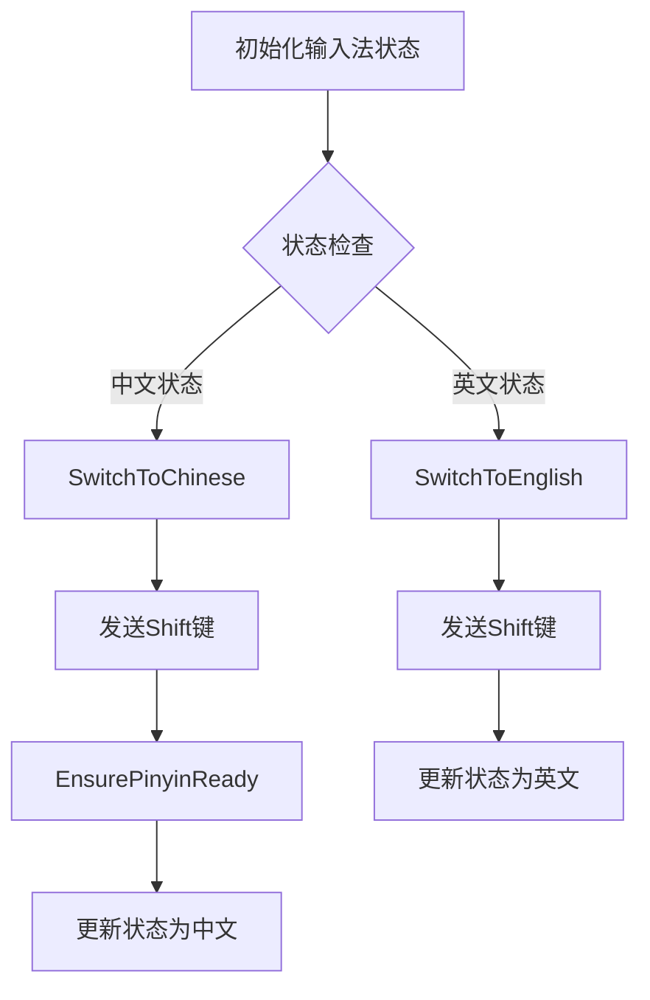
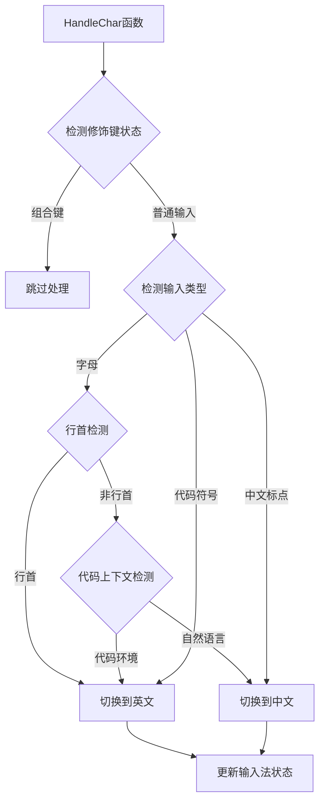
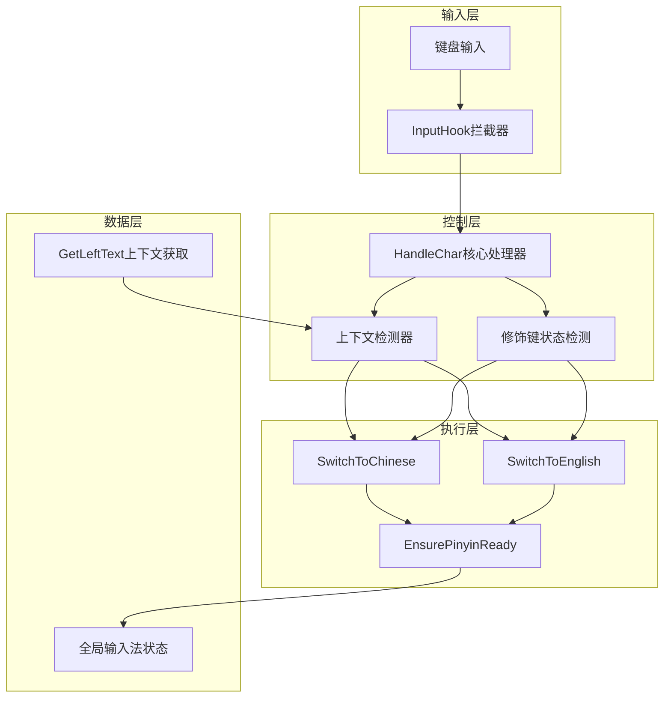
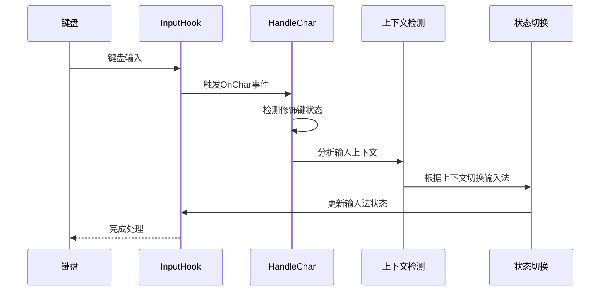
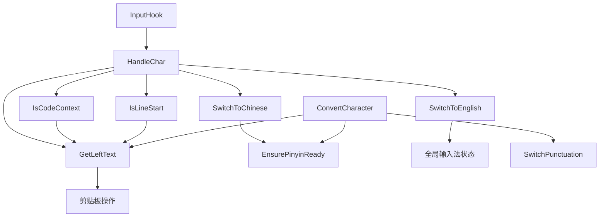

# 输入法智能切换函数

<cite>
**本文档引用的文件**
- [hotkey.ahk](file://hotkey.ahk)
- [hotkeys_public.ahk](file://hotkeys_public.ahk)
- [README.md](file://README.md)
</cite>

## 目录
1. [简介](#简介)
2. [项目结构](#项目结构)
3. [核心组件](#核心组件)
4. [架构概览](#架构概览)
5. [详细组件分析](#详细组件分析)
6. [依赖关系分析](#依赖关系分析)
7. [性能考虑](#性能考虑)
8. [故障排除指南](#故障排除指南)
9. [结论](#结论)

## 简介

这是一个基于AutoHotkey v2的智能输入法切换系统，能够根据输入内容自动在中文和英文输入法之间切换。该系统通过InputHook拦截键盘输入，结合上下文检测算法和修饰键状态检测，实现了智能化的输入法管理。

主要功能包括：
- 自动识别自然语言输入并切换到中文输入法
- 自动识别代码符号输入并切换到英文输入法  
- 智能检测行首输入环境（函数名、变量名等）
- 支持标点符号转换和拼音输入处理
- 提供完整的输入拦截机制和修饰键状态检测

## 项目结构

该项目采用模块化设计，主要包含以下核心文件：

**图表来源**
- [hotkey.ahk:1-20](file://hotkey.ahk#L1-L20)
- [hotkeys_public.ahk:1-57](file://hotkeys_public.ahk#L1-L57)

**章节来源**
- [hotkey.ahk:1-20](file://hotkey.ahk#L1-L20)
- [README.md:1-2](file://README.md#L1-L2)

## 核心组件

### 输入法状态管理

系统维护一个全局输入法状态变量，用于跟踪当前的输入法模式：

**图表来源**
- [hotkey.ahk:308-326](file://hotkey.ahk#L308-L326)

### 上下文检测系统

系统通过多种策略检测当前输入环境：

**图表来源**
- [hotkey.ahk:367-404](file://hotkey.ahk#L367-L404)

**章节来源**
- [hotkey.ahk:308-404](file://hotkey.ahk#L308-L404)

## 架构概览

### 整体架构设计

**图表来源**
- [hotkey.ahk:296-404](file://hotkey.ahk#L296-L404)

### 输入拦截机制

系统使用AutoHotkey的InputHook功能来拦截键盘输入：

**图表来源**
- [hotkey.ahk:357-362](file://hotkey.ahk#L357-L362)
- [hotkey.ahk:367-404](file://hotkey.ahk#L367-L404)

## 详细组件分析

### SwitchToChinese 函数

**函数签名**: `SwitchToChinese()`

**功能描述**: 将输入法从当前状态切换到中文输入模式。

**参数**: 无

**返回值**: 无

**实现细节**:
- 检查当前输入法状态是否为中文
- 如果不是中文，发送Shift键切换输入法
- 调用EnsurePinyinReady确保输入法进入拼音组合态
- 更新全局输入法状态为中文

**使用示例**: 在HandleChar函数中根据上下文自动调用

**章节来源**
- [hotkey.ahk:310-318](file://hotkey.ahk#L310-L318)

### SwitchToEnglish 函数

**函数签名**: `SwitchToEnglish()`

**功能描述**: 将输入法从当前状态切换到英文输入模式。

**参数**: 无

**返回值**: 无

**实现细节**:
- 检查当前输入法状态是否为英文
- 如果不是英文，发送Shift键切换输入法
- 更新全局输入法状态为英文

**使用示例**: 在HandleChar函数中根据上下文自动调用

**章节来源**
- [hotkey.ahk:320-326](file://hotkey.ahk#L320-L326)

### HandleChar 函数

**函数签名**: `HandleChar(char)`

**功能描述**: 核心的输入处理函数，负责根据输入内容和上下文自动切换输入法。

**参数**:
- `char`: 输入的字符

**返回值**: 无

**处理流程**:
1. **修饰键检测**: 检测Ctrl、Alt、Win组合键，如果是组合键则跳过处理
2. **字母输入处理**: 
   - 行首输入字母 → 切换到英文（认为是代码输入）
   - 代码上下文 → 切换到英文
   - 其他情况 → 切换到中文
3. **代码符号处理**: 输入括号、花括号、方括号等 → 切换到英文
4. **标点符号处理**: 中文标点或空格 → 切换到中文

**使用示例**: 由InputHook自动调用

**章节来源**
- [hotkey.ahk:367-404](file://hotkey.ahk#L367-L404)

### GetLeftText 函数

**函数签名**: `GetLeftText(switchType)`

**功能描述**: 获取光标前的文本内容，用于上下文检测。

**参数**:
- `switchType`: 切换类型
  - `"punctuation"`: 标点符号模式
  - `"pinyin"`: 拼音模式
  - 默认: 通用模式

**返回值**: 光标前的文本内容

**实现细节**:
- 临时备份剪贴板内容
- 根据switchType发送不同的键盘组合键
- 复制光标前的内容到剪贴板
- 等待剪贴板内容就绪
- 恢复原始剪贴板内容
- 返回获取的文本

**使用示例**: 在IsCodeContext和IsLineStart函数中调用

**章节来源**
- [hotkey.ahk:409-440](file://hotkey.ahk#L409-L440)

### EnsurePinyinReady 函数

**函数签名**: `EnsurePinyinReady()`

**功能描述**: 确保输入法处于拼音组合态。

**参数**: 无

**返回值**: 无

**实现细节**:
- 通过发送'a'键和Backspace键的组合来触发拼音输入法
- 重复两次以确保状态稳定
- 每次操作间有适当的延时

**使用示例**: 在SwitchToChinese中自动调用

**章节来源**
- [hotkey.ahk:443-450](file://hotkey.ahk#L443-L450)

### ConvertCharacter 函数

**函数签名**: `ConvertCharacter()`

**功能描述**: 将光标前的英文单词转换为中文标点或中文拼音。

**参数**: 无

**返回值**: 无

**处理流程**:
1. **标点符号转换**:
   - 获取光标前的字符
   - 检查是否为中文标点符号
   - 如果是，调用SwitchPunctuation进行转换
2. **拼音转换**:
   - 获取光标前的文本
   - 使用正则表达式提取末尾的英文单词
   - 强制输入法进入拼音组合态
   - 逐个发送拼音字符
   - 发送空格键完成输入

**使用示例**: 通过热键LWin & z调用

**章节来源**
- [hotkey.ahk:453-518](file://hotkey.ahk#L453-L518)

### SwitchPunctuation 函数

**函数签名**: `SwitchPunctuation(cnToEng, char)`

**功能描述**: 在中文标点和英文标点之间进行转换。

**参数**:
- `cnToEng`: 布尔值，true表示中文转英文，false表示英文转中文
- `char`: 要转换的标点符号

**返回值**: 无

**实现细节**:
- 使用静态映射表存储中文标点和英文标点的对应关系
- 根据cnToEng参数决定转换方向
- 使用SendText直接插入Unicode文本，不经过键盘事件

**支持的标点符号转换**:
- 中文逗号 ↔ 英文逗号
- 中文句号 ↔ 英文句号
- 中文分号 ↔ 英文分号
- 中文冒号 ↔ 英文冒号
- 中文问号 ↔ 英文问号
- 中文感叹号 ↔ 英文感叹号
- 中文括号 ↔ 英文括号
- 中文方括号 ↔ 英文方括号
- 中文书名号 ↔ 英文尖括号
- 中文引号 ↔ 英文双引号
- 中文单引号 ↔ 英文单引号
- 中文破折号 ↔ 英文破折号
- 中文人民币符号 ↔ 英文美元符号

**使用示例**: 在ConvertCharacter中调用

**章节来源**
- [hotkey.ahk:521-563](file://hotkey.ahk#L521-L563)

### 上下文检测函数

#### IsCodeContext 函数

**函数签名**: `IsCodeContext()`

**功能描述**: 检测当前是否处于代码环境。

**参数**: 无

**返回值**: 布尔值，true表示代码环境，false表示非代码环境

**实现细节**: 调用GetLeftText获取光标前内容，检查末尾是否为字母、数字或下划线。

**章节来源**
- [hotkey.ahk:331-334](file://hotkey.ahk#L331-L334)

#### IsNaturalContext 函数

**函数签名**: `IsNaturalContext()`

**功能描述**: 检测当前是否处于自然语言环境。

**参数**: 无

**返回值**: 布尔值，true表示自然语言环境，false表示非自然语言环境

**实现细节**: 直接返回IsCodeContext的否定值。

**章节来源**
- [hotkey.ahk:337-339](file://hotkey.ahk#L337-L339)

#### IsLineStart 函数

**函数签名**: `IsLineStart()`

**功能描述**: 检测当前是否处于行首位置。

**参数**: 无

**返回值**: 布尔值，true表示行首，false表示非行首

**实现细节**:
- 临时备份剪贴板
- 发送Shift+Left移动到行首
- 根据是否为Shell环境选择不同的复制方式
- 检查复制的内容是否为空或为换行符

**章节来源**
- [hotkey.ahk:342-355](file://hotkey.ahk#L342-L355)

## 依赖关系分析

### 组件依赖关系

**图表来源**
- [hotkey.ahk:308-518](file://hotkey.ahk#L308-L518)

### 外部依赖

系统依赖以下外部组件：

1. **AutoHotkey v2**: 主要运行时环境
2. **UIA库**: Windows UI自动化支持
3. **系统输入法**: Windows内置输入法服务
4. **剪贴板服务**: Windows剪贴板API

**章节来源**
- [hotkey.ahk:1-10](file://hotkey.ahk#L1-L10)

## 性能考虑

### 优化策略

1. **异步处理**: 使用Sleep和定时器避免阻塞主线程
2. **条件判断**: 优先检查修饰键状态，快速跳过组合键
3. **缓存机制**: 使用全局变量缓存输入法状态
4. **延迟处理**: 合理使用Sleep确保系统有足够时间处理输入法切换

### 性能特征

- **响应时间**: 处理单个字符的平均延迟约为几十毫秒
- **内存占用**: 主要消耗在全局变量和静态映射表上
- **CPU使用率**: 非常低，主要在键盘输入时触发

## 故障排除指南

### 常见问题及解决方案

#### 输入法切换失效

**症状**: 按键后输入法没有切换

**可能原因**:
1. 系统权限不足
2. 输入法服务异常
3. 热键冲突

**解决方法**:
1. 以管理员权限运行脚本
2. 重启输入法服务
3. 检查热键设置

#### 上下文检测错误

**症状**: 输入法切换不符合预期

**可能原因**:
1. GetLeftText函数获取的文本不准确
2. 正则表达式匹配错误
3. 剪贴板访问失败

**解决方法**:
1. 检查剪贴板权限
2. 调整正则表达式
3. 增加重试机制

#### InputHook不工作

**症状**: HandleChar函数不被调用

**可能原因**:
1. InputHook初始化失败
2. 钩子被其他程序占用
3. 系统兼容性问题

**解决方法**:
1. 检查#UseHook指令
2. 关闭冲突的程序
3. 更新AutoHotkey版本

**章节来源**
- [hotkey.ahk:357-362](file://hotkey.ahk#L357-L362)

## 结论

这个输入法智能切换系统通过巧妙的算法设计和合理的架构组织，实现了高度智能化的输入法管理。其核心优势包括：

1. **智能上下文感知**: 能够准确识别代码环境和自然语言环境
2. **实时响应**: 通过InputHook实现几乎无延迟的输入拦截
3. **灵活配置**: 支持自定义热键和行为
4. **稳定性强**: 通过多重检查和错误处理确保系统稳定

该系统为开发者提供了高效的输入体验，特别是在混合编程环境中，能够显著提高编码效率和准确性。建议在实际使用中根据个人习惯调整相关参数，并定期更新以获得最佳效果。