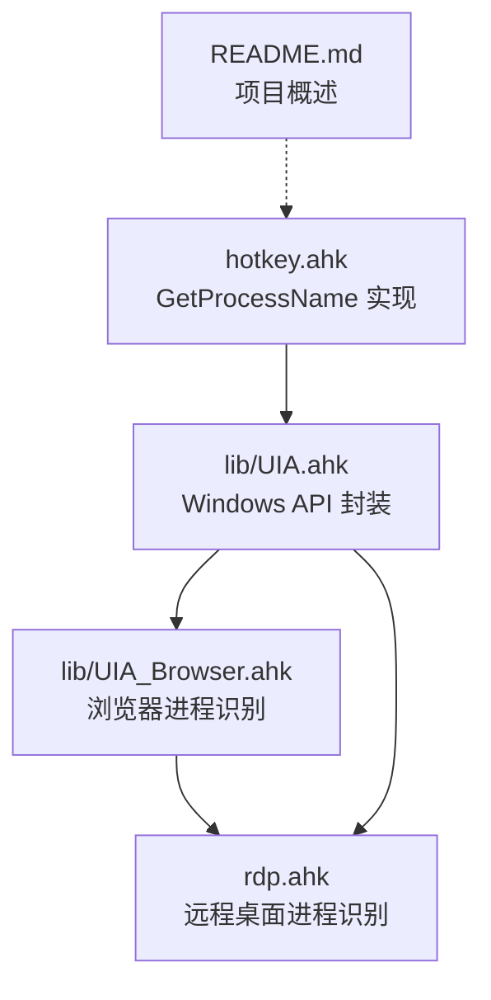
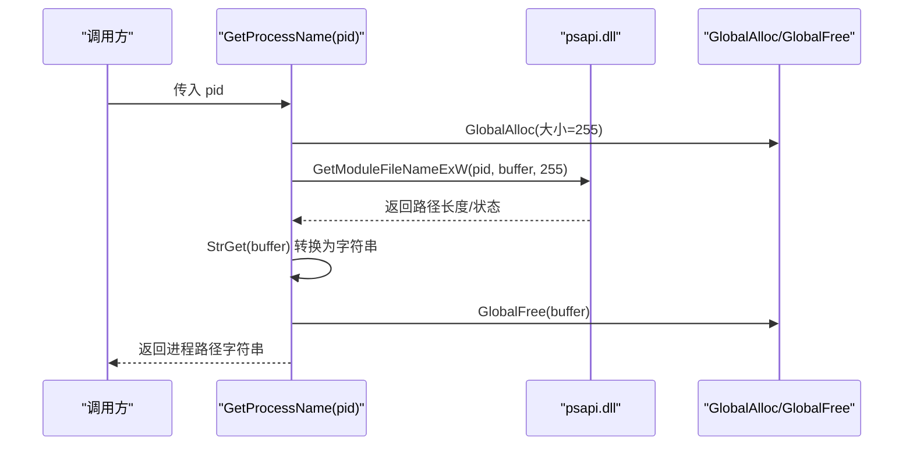
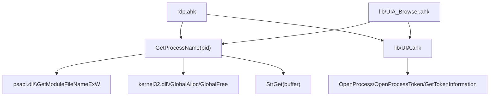

# 进程管理函数

<cite>
**本文引用的文件**
- [hotkey.ahk](file://hotkey.ahk)
- [UIA.ahk](file://lib/UIA.ahk)
- [UIA_Browser.ahk](file://lib/UIA_Browser.ahk)
- [rdp.ahk](file://rdp.ahk)
- [README.md](file://README.md)
</cite>

## 目录
1. [简介](#简介)
2. [项目结构](#项目结构)
3. [核心组件](#核心组件)
4. [架构总览](#架构总览)
5. [详细组件分析](#详细组件分析)
6. [依赖关系分析](#依赖关系分析)
7. [性能考量](#性能考量)
8. [故障排查指南](#故障排查指南)
9. [结论](#结论)
10. [附录](#附录)

## 简介
本文件聚焦于进程管理函数的详细API文档，重点覆盖 GetProcessName 函数的完整签名、参数说明、返回值与使用示例，并深入解释其内部实现机制：从进程ID到进程名称的转换流程、Windows API调用、内存管理策略（全局堆分配与释放）、DllCall的使用方式、缓冲区分配与释放、错误处理与性能优化建议。同时提供实际应用场景与调试技巧，帮助读者在AutoHotkey v2环境下高效、稳定地进行进程信息获取与窗口关联操作。

## 项目结构
本仓库为基于 AutoHotkey v2 的脚本集合，包含热键定义、窗口自动化、UI自动化、远程桌面工具等模块。与进程管理直接相关的核心实现位于以下文件：
- hotkey.ahk：包含自定义进程名称获取函数 GetProcessName
- lib/UIA.ahk：提供系统级Windows API封装，如进程打开、令牌查询、DPI感知等
- lib/UIA_Browser.ahk：浏览器自动化中使用 WinGetProcessName 获取浏览器进程类型
- rdp.ahk：远程桌面工具中使用 WinGetProcessName 识别根窗口所属进程
- README.md：项目简述

图表来源
- [hotkey.ahk:222-237](file://hotkey.ahk#L222-L237)
- [UIA.ahk:620-635](file://lib/UIA.ahk#L620-L635)
- [UIA_Browser.ahk:479](file://lib/UIA_Browser.ahk#L479)
- [rdp.ahk:251-283](file://rdp.ahk#L251-L283)

章节来源
- [README.md:1-2](file://README.md#L1-L2)

## 核心组件
- GetProcessName(pid)
  - 功能：根据进程ID获取可执行文件的完整路径字符串
  - 参数：pid（整数，进程ID）
  - 返回：字符串（进程可执行文件路径）
  - 内部机制：通过 DllCall 分配全局堆缓冲区，调用 psapi.dll 的 GetModuleFileNameExW 获取路径，再将缓冲区内容转换为AHK字符串，最后释放缓冲区

章节来源
- [hotkey.ahk:222-237](file://hotkey.ahk#L222-L237)

## 架构总览
GetProcessName 的调用链路如下：
- 调用方传入 pid
- 分配全局堆缓冲区（GlobalAlloc）
- 调用 psapi.dll 的 GetModuleFileNameExW 获取进程路径
- 将缓冲区内容转换为字符串（StrGet）
- 释放缓冲区（GlobalFree）
- 返回字符串结果

图表来源
- [hotkey.ahk:222-237](file://hotkey.ahk#L222-L237)

## 详细组件分析

### GetProcessName(pid) API详解
- 函数签名
  - 名称：GetProcessName
  - 形参：pid（整数，进程ID）
  - 返回：字符串（进程可执行文件的完整路径）

- 参数说明
  - pid：目标进程的标识符。应确保调用方具备访问该进程的权限，否则可能导致获取失败或返回空路径。

- 返回值
  - 成功：返回进程可执行文件的完整路径字符串
  - 失败：返回空字符串或不完整路径（取决于底层API行为与缓冲区大小）

- 内部实现要点
  - 缓冲区分配：使用 DllCall("GlobalAlloc", ...) 在全局堆上分配固定大小缓冲区（大小为255字节），用于接收GetModuleFileNameExW返回的宽字符路径
  - API调用：通过 DllCall("psapi.dll\GetModuleFileNameExW", ...) 获取进程路径
  - 字符串转换：使用 StrGet(buffer) 将缓冲区内容转换为AHK字符串
  - 内存释放：使用 DllCall("GlobalFree", ...) 释放之前分配的全局堆缓冲区

- 错误处理与健壮性
  - 缓冲区大小：当前实现固定为255字节，可能不足以容纳较长路径。建议在生产环境中根据需要调整大小或采用动态扩展策略
  - 权限问题：若无足够权限访问目标进程，GetModuleFileNameExW 可能失败，导致返回空字符串
  - 字符集：GetModuleFileNameExW 返回宽字符路径，StrGet 默认按UTF-16处理，符合预期

- 性能与资源
  - 每次调用都会进行一次全局堆分配与释放，频繁调用会产生额外开销
  - 建议在必要时缓存结果，避免重复查询同一进程ID

- 使用示例（路径引用）
  - 获取当前活动窗口所属进程的可执行路径：参考 rdp.ahk 中对 WinGetProcessName 的使用
  - 浏览器进程类型识别：参考 UIA_Browser.ahk 中对 WinGetProcessName 的使用

章节来源
- [hotkey.ahk:222-237](file://hotkey.ahk#L222-L237)
- [rdp.ahk:251-283](file://rdp.ahk#L251-L283)
- [UIA_Browser.ahk:479](file://lib/UIA_Browser.ahk#L479)

### Windows API与内存管理策略
- psapi.dll\GetModuleFileNameExW
  - 作用：获取指定进程的模块（通常是可执行文件）路径
  - 注意：需要目标进程句柄或有效权限；路径长度受缓冲区限制

- 全局堆分配与释放
  - 分配：GlobalAlloc(0x40, 255) 在全局堆上分配缓冲区
  - 释放：GlobalFree(buffer) 释放之前分配的缓冲区，防止内存泄漏

- 字符串转换
  - StrGet(buffer) 将缓冲区内容按UTF-16转换为AHK字符串，确保宽字符路径正确显示

- 权限与句柄
  - 若需更广泛的进程信息（如令牌、权限），可参考 UIA.ahk 中的 ProcessIsElevated 示例，展示如何使用 OpenProcess、OpenProcessToken、GetTokenInformation 等API

章节来源
- [hotkey.ahk:222-237](file://hotkey.ahk#L222-L237)
- [UIA.ahk:620-635](file://lib/UIA.ahk#L620-L635)

### DllCall使用方法与缓冲区策略
- DllCall("GlobalAlloc", ...)
  - 参数：分配标志（0x40表示全局堆）、大小（255）
  - 返回：指向缓冲区的指针

- DllCall("psapi.dll\GetModuleFileNameExW", ...)
  - 参数：进程句柄（此处传入pid）、缓冲区指针、缓冲区大小
  - 返回：路径长度（字符数）

- DllCall("GlobalFree", ...)
  - 参数：缓冲区指针
  - 效果：释放全局堆缓冲区

- 缓冲区大小建议
  - 当前固定为255字节，可能无法满足长路径需求。建议：
    - 使用更大固定值（例如1024或更高）
    - 或者先调用一次API以获取所需长度，再按需分配缓冲区

- 错误处理建议
  - 检查 API 返回值与缓冲区内容
  - 对于权限不足或进程不存在的情况，返回空字符串或抛出异常

章节来源
- [hotkey.ahk:222-237](file://hotkey.ahk#L222-L237)

### 实际应用场景
- 远程桌面窗口识别
  - 通过 WinGetProcessName 获取根窗口所属进程，判断是否为 mstsc.exe，从而识别RDP会话窗口
  - 参考：rdp.ahk 中对 WinGetProcessName 的使用

- 浏览器自动化
  - 通过 WinGetProcessName 识别浏览器类型（chrome.exe/msedge.exe/vivaldi.exe/brave.exe），选择对应的UIA适配策略
  - 参考：UIA_Browser.ahk 中对 WinGetProcessName 的使用

- 权限与进程信息
  - 结合 UIA.ahk 的 ProcessIsElevated，判断目标进程是否以管理员权限运行，辅助后续操作的权限决策
  - 参考：UIA.ahk 中对 OpenProcess/OpenProcessToken/GetTokenInformation 的使用

章节来源
- [rdp.ahk:251-283](file://rdp.ahk#L251-L283)
- [UIA_Browser.ahk:479](file://lib/UIA_Browser.ahk#L479)
- [UIA.ahk:620-635](file://lib/UIA.ahk#L620-L635)

### 调试技巧
- 路径过短导致截断
  - 症状：返回路径被截断或为空
  - 解决：增大缓冲区大小或改为动态获取长度后分配缓冲区

- 权限不足
  - 症状：返回空字符串或API调用失败
  - 解决：以管理员权限运行脚本，或检查目标进程的访问权限

- 字符集问题
  - 症状：路径显示乱码
  - 解决：确认StrGet按UTF-16处理，确保GetModuleFileNameExW返回的是宽字符路径

- 性能瓶颈
  - 症状：频繁调用导致CPU占用上升
  - 解决：缓存进程路径结果，避免重复查询同一进程ID

- 调试输出
  - 在关键节点输出中间结果（如缓冲区指针、API返回值、字符串长度），便于定位问题

章节来源
- [hotkey.ahk:222-237](file://hotkey.ahk#L222-L237)
- [UIA.ahk:620-635](file://lib/UIA.ahk#L620-L635)

## 依赖关系分析
- GetProcessName 依赖
  - psapi.dll：用于获取进程模块路径
  - kernel32.dll：GlobalAlloc/GlobalFree（用于缓冲区管理）
  - 用户态字符串转换：StrGet（将缓冲区内容转换为AHK字符串）

- 与其他模块的关系
  - rdp.ahk：使用 WinGetProcessName 获取根窗口所属进程，辅助RDP会话识别
  - UIA_Browser.ahk：使用 WinGetProcessName 识别浏览器类型，选择对应UIA策略
  - UIA.ahk：提供进程句柄打开、令牌查询等高级能力，作为进程信息获取的补充

图表来源
- [hotkey.ahk:222-237](file://hotkey.ahk#L222-L237)
- [rdp.ahk:251-283](file://rdp.ahk#L251-L283)
- [UIA_Browser.ahk:479](file://lib/UIA_Browser.ahk#L479)
- [UIA.ahk:620-635](file://lib/UIA.ahk#L620-L635)

## 性能考量
- 缓冲区大小
  - 固定255字节可能不足以容纳长路径，建议根据实际需求调整大小或动态获取长度后再分配
- 全局堆分配
  - 每次调用都进行分配与释放，频繁调用会产生额外开销。建议缓存结果
- API调用频率
  - 避免在循环中对同一进程ID重复查询，可通过哈希表缓存进程路径
- 字符串转换
  - StrGet 是轻量操作，但仍建议避免不必要的重复转换

## 故障排查指南
- 返回空字符串
  - 检查进程ID是否有效
  - 确认脚本运行权限是否足够访问目标进程
  - 检查缓冲区大小是否过小
- 路径被截断
  - 增大缓冲区大小或改为动态分配
- 权限错误
  - 以管理员权限运行脚本
  - 使用 UIA.ahk 的 ProcessIsElevated 辅助判断目标进程权限级别
- 调试建议
  - 输出中间结果（缓冲区指针、API返回值、字符串长度）
  - 使用日志记录关键步骤，便于定位问题

章节来源
- [hotkey.ahk:222-237](file://hotkey.ahk#L222-L237)
- [UIA.ahk:620-635](file://lib/UIA.ahk#L620-L635)

## 结论
GetProcessName 提供了从进程ID到进程路径的便捷映射，其核心依赖 psapi.dll 与内核全局堆API。通过合理的缓冲区管理与权限控制，可在大多数场景下稳定获取进程路径。结合 rdp.ahk 与 UIA_Browser.ahk 的实践，可以看到该函数在窗口识别与浏览器自动化中的重要作用。建议在生产环境中进一步完善错误处理、权限检查与性能优化，以提升稳定性与效率。

## 附录
- 相关API参考
  - psapi.dll\GetModuleFileNameExW：获取进程模块路径
  - kernel32.dll\GlobalAlloc/GlobalFree：全局堆缓冲区管理
  - user32\GetAncestor：获取窗口祖先句柄（用于RDP场景）
  - advapi32\OpenProcess/OpenProcessToken/GetTokenInformation：进程与令牌信息查询（用于权限判断）

章节来源
- [hotkey.ahk:222-237](file://hotkey.ahk#L222-L237)
- [UIA.ahk:620-635](file://lib/UIA.ahk#L620-L635)
- [rdp.ahk:326-330](file://rdp.ahk#L326-L330)