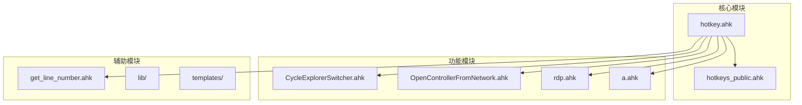
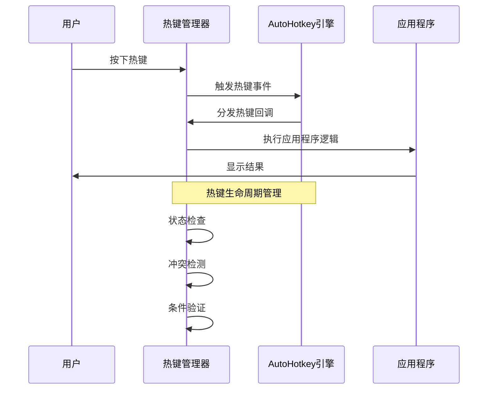
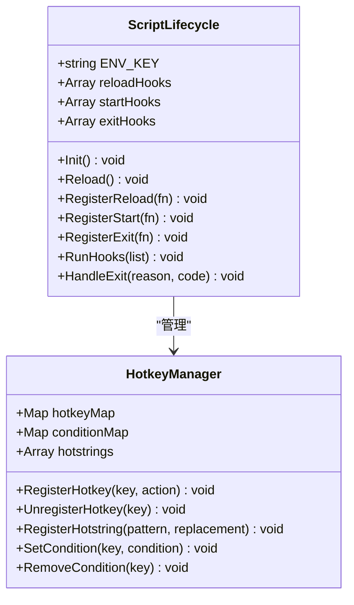
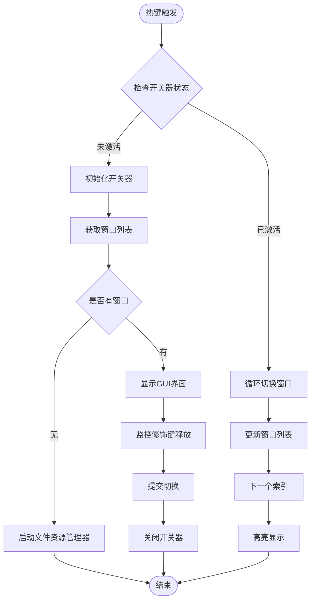
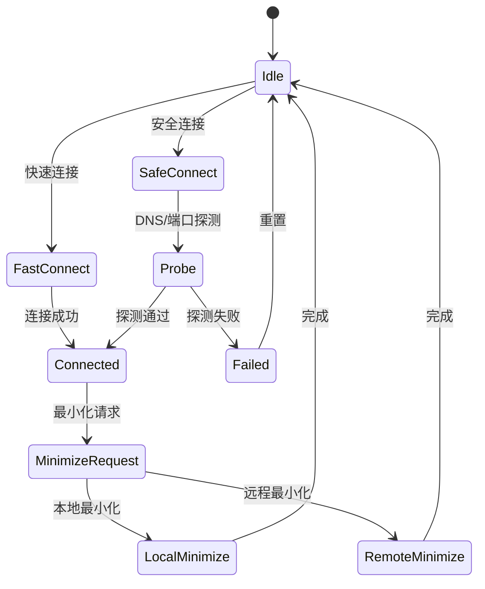
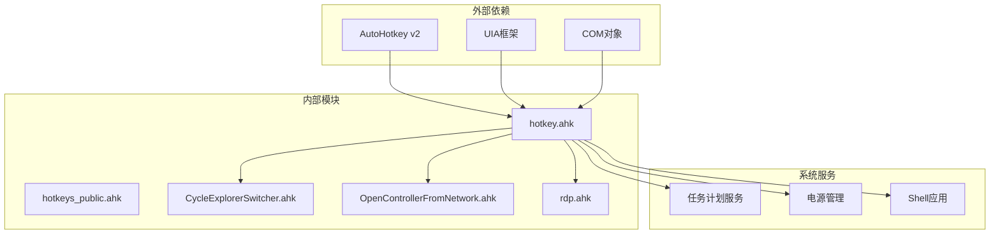

# 热键管理API

<cite>
**本文档引用的文件**
- [hotkey.ahk](file://hotkey.ahk)
- [hotkeys_public.ahk](file://hotkeys_public.ahk)
- [CycleExplorerSwitcher.ahk](file://CycleExplorerSwitcher.ahk)
- [OpenControllerFromNetwork.ahk](file://OpenControllerFromNetwork.ahk)
- [rdp.ahk](file://rdp.ahk)
- [a.ahk](file://a.ahk)
- [get_line_number.ahk](file://get-source-panel-line-number/get_line_number.ahk)
- [README.md](file://README.md)
</cite>

## 目录
1. [简介](#简介)
2. [项目结构](#项目结构)
3. [核心组件](#核心组件)
4. [架构概览](#架构概览)
5. [详细组件分析](#详细组件分析)
6. [依赖关系分析](#依赖关系分析)
7. [性能考虑](#性能考虑)
8. [故障排除指南](#故障排除指南)
9. [结论](#结论)

## 简介

这是一个基于AutoHotkey v2的热键管理API系统，提供了完整的热键定义、监听、冲突检测和生命周期管理功能。该系统支持多种热键类型，包括标准热键、条件热键、热字符串和动态热键注册。

## 项目结构



**图表来源**
- [hotkey.ahk:1-50](file://hotkey.ahk#L1-L50)
- [hotkeys_public.ahk:1-57](file://hotkeys_public.ahk#L1-L57)
- [CycleExplorerSwitcher.ahk:1-50](file://CycleExplorerSwitcher.ahk#L1-L50)

**章节来源**
- [hotkey.ahk:1-800](file://hotkey.ahk#L1-L800)
- [README.md:1-2](file://README.md#L1-L2)

## 核心组件

### 热键定义语法

系统支持多种热键定义语法：

1. **基础热键语法**
   ```
   #Hotkey::Action
   #^Hotkey::Action
   ```

2. **修饰键语法**
   - `#` - Windows键
   - `^` - Ctrl键  
   - `+` - Shift键
   - `!` - Alt键
   - `*` - 盲目修饰键
   - `~` - 无修饰键

3. **条件热键语法**
   ```
   #HotIf Condition
   Hotkey::Action
   #HotIf
   ```

**章节来源**
- [hotkey.ahk:565-625](file://hotkey.ahk#L565-L625)
- [CycleExplorerSwitcher.ahk:35-38](file://CycleExplorerSwitcher.ahk#L35-L38)

### 热键事件监听机制

系统采用多层次的事件监听机制：

1. **全局热键监听**
   - 使用`Hotkey`函数动态注册热键
   - 支持热键状态管理和生命周期控制

2. **条件热键监听**
   - 使用`#HotIf`指令创建条件热键
   - 支持动态条件评估

3. **热字符串监听**
   - 使用`:o:`和`:*:`前缀定义热字符串
   - 支持即时替换和延迟替换

**章节来源**
- [hotkey.ahk:2148-2151](file://hotkey.ahk#L2148-L2151)
- [hotkeys_public.ahk:1-57](file://hotkeys_public.ahk#L1-L57)

## 架构概览



**图表来源**
- [hotkey.ahk:751-812](file://hotkey.ahk#L751-L812)
- [CycleExplorerSwitcher.ahk:68-96](file://CycleExplorerSwitcher.ahk#L68-L96)

## 详细组件分析

### 热键管理器 (ScriptLifecycle)



**图表来源**
- [hotkey.ahk:751-812](file://hotkey.ahk#L751-L812)

**章节来源**
- [hotkey.ahk:751-812](file://hotkey.ahk#L751-L812)

### 窗口切换器 (CycleExplorerSwitcher)



**图表来源**
- [CycleExplorerSwitcher.ahk:68-167](file://CycleExplorerSwitcher.ahk#L68-L167)

**章节来源**
- [CycleExplorerSwitcher.ahk:68-167](file://CycleExplorerSwitcher.ahk#L68-L167)

### RDP热键管理



**图表来源**
- [rdp.ahk:165-207](file://rdp.ahk#L165-L207)

**章节来源**
- [rdp.ahk:165-207](file://rdp.ahk#L165-L207)

### 热字符串管理

系统支持复杂的热字符串功能：

1. **即时热字符串** (`:*:`)
   - 立即替换输入的文本
   - 适用于快捷代码片段

2. **延迟热字符串** (`:o:`)
   - 在空格或特殊字符触发时替换
   - 适用于命令别名

3. **智能热字符串**
   - 支持条件替换
   - 动态内容生成

**章节来源**
- [hotkeys_public.ahk:1-57](file://hotkeys_public.ahk#L1-L57)

## 依赖关系分析



**图表来源**
- [hotkey.ahk:24-52](file://hotkey.ahk#L24-L52)
- [hotkey.ahk:751-812](file://hotkey.ahk#L751-L812)

**章节来源**
- [hotkey.ahk:24-52](file://hotkey.ahk#L24-L52)
- [hotkey.ahk:751-812](file://hotkey.ahk#L751-L812)

## 性能考虑

### 热键响应优化

1. **异步处理**
   - 使用`SetTimer`实现非阻塞操作
   - 避免长时间阻塞热键线程

2. **条件热键优化**
   - 使用`#HotIf`减少不必要的热键检查
   - 动态条件评估避免频繁计算

3. **内存管理**
   - 及时清理GUI资源
   - 合理使用全局变量

### 系统集成优化

1. **任务计划服务集成**
   - 自动注册开机启动任务
   - 管理任务权限提升

2. **剪贴板优化**
   - 使用`ClipboardAll()`保护剪贴板内容
   - 及时恢复原始剪贴板状态

## 故障排除指南

### 权限问题

**问题**: 脚本需要管理员权限运行
**解决方案**: 
- 自动提权运行
- 任务计划服务权限配置

**章节来源**
- [hotkey.ahk:25-33](file://hotkey.ahk#L25-L33)

### 热键冲突

**问题**: 多个热键绑定到同一组合键
**解决方案**:
- 使用条件热键避免冲突
- 实施热键优先级管理
- 提供热键冲突检测机制

### 窗口管理问题

**问题**: 窗口切换器无法正确识别目标窗口
**解决方案**:
- 检查窗口类名匹配
- 验证窗口状态检测逻辑
- 实现窗口缓存机制

**章节来源**
- [CycleExplorerSwitcher.ahk:427-453](file://CycleExplorerSwitcher.ahk#L427-L453)

### RDP连接问题

**问题**: 远程桌面连接不稳定
**解决方案**:
- 实现连接状态检测
- 提供重连机制
- 优化剪贴板同步

**章节来源**
- [rdp.ahk:384-402](file://rdp.ahk#L384-L402)

## 结论

该热键管理API系统提供了完整的热键生命周期管理功能，包括热键定义、事件监听、冲突检测和状态管理。系统采用模块化设计，支持动态热键注册和注销，具备良好的扩展性和维护性。

主要特性：
- 多层次热键监听机制
- 条件热键支持
- 热字符串管理
- 窗口切换功能
- RDP集成
- 任务计划服务集成
- 完整的错误处理和恢复机制

该系统为用户提供了一个强大而灵活的热键管理解决方案，适用于各种自动化场景和快捷操作需求。