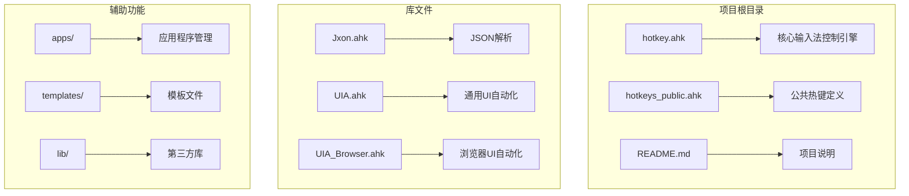
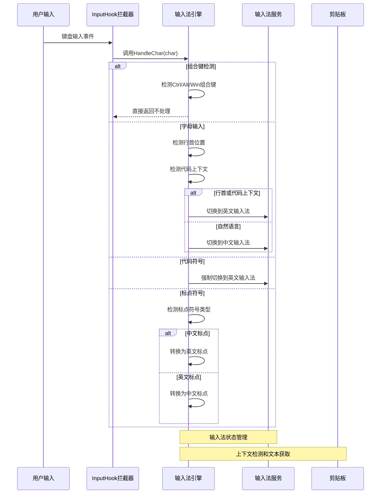
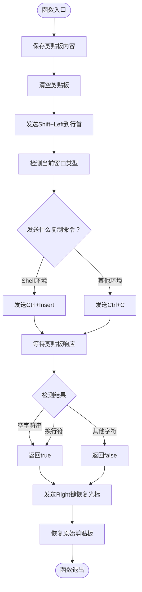
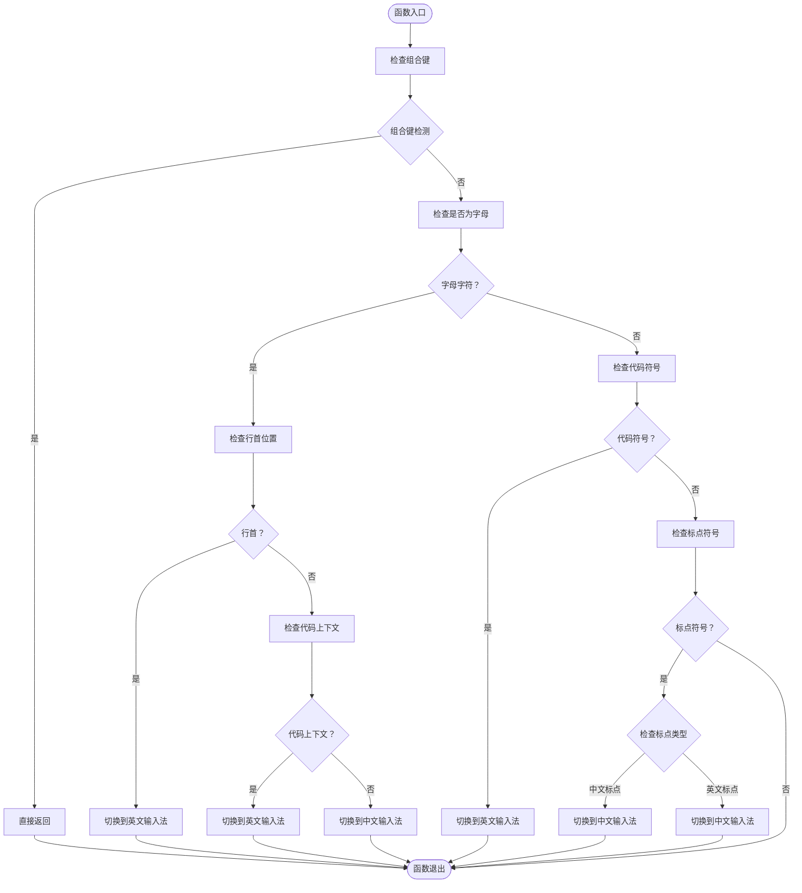
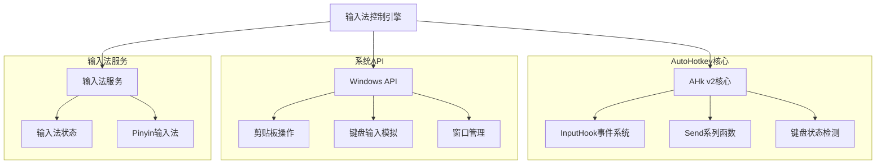
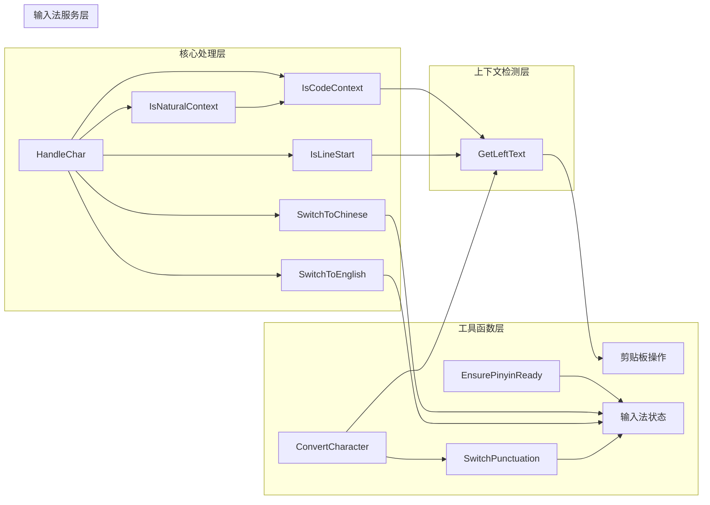

# 输入法控制API

<cite>
**本文档引用的文件**
- [hotkey.ahk](file://hotkey.ahk)
- [hotkeys_public.ahk](file://hotkeys_public.ahk)
- [README.md](file://README.md)
</cite>

## 目录
1. [简介](#简介)
2. [项目结构](#项目结构)
3. [核心组件](#核心组件)
4. [架构概览](#架构概览)
5. [详细组件分析](#详细组件分析)
6. [依赖关系分析](#依赖关系分析)
7. [性能考虑](#性能考虑)
8. [故障排除指南](#故障排除指南)
9. [结论](#结论)

## 简介
本文档详细记录了智能中英文输入法切换引擎的完整API规范。该引擎基于AutoHotkey v2开发，提供了自动化的中英文输入法切换功能，能够智能识别代码环境和自然语言环境，实现无缝的输入法切换体验。

## 项目结构
该项目采用模块化设计，主要包含以下核心文件：

**图表来源**
- [hotkey.ahk:1-50](file://hotkey.ahk#L1-L50)
- [hotkeys_public.ahk:1-57](file://hotkeys_public.ahk#L1-L57)

**章节来源**
- [hotkey.ahk:1-50](file://hotkey.ahk#L1-L50)
- [README.md:1-2](file://README.md#L1-L2)

## 核心组件
智能输入法控制引擎包含以下核心组件：

### 输入法状态管理
- **全局状态变量**: `g_IME` - 当前输入法状态（"zh"或"en"）
- **默认状态**: 初始化为中文状态
- **状态切换**: 通过`SwitchToChinese()`和`SwitchToEnglish()`函数管理

### 上下文检测系统
- **代码环境检测**: `IsCodeContext()` - 检测光标前是否为代码上下文
- **自然语言检测**: `IsNaturalContext()` - 检测是否为自然语言环境
- **行首检测**: `IsLineStart()` - 检测是否处于行首位置

### 字符处理引擎
- **核心处理函数**: `HandleChar()` - 主要的字符处理逻辑
- **上下文文本获取**: `GetLeftText()` - 获取光标前的文本内容
- **拼音状态确保**: `EnsurePinyinReady()` - 确保拼音输入法处于就绪状态

### 标点符号转换系统
- **标点符号转换**: `SwitchPunctuation()` - 中英文标点符号互转
- **字符转换**: `ConvertCharacter()` - 智能字符转换功能

**章节来源**
- [hotkey.ahk:308-563](file://hotkey.ahk#L308-L563)

## 架构概览
输入法控制引擎采用事件驱动架构，通过InputHook拦截键盘输入事件：

**图表来源**
- [hotkey.ahk:367-404](file://hotkey.ahk#L367-L404)
- [hotkey.ahk:341-355](file://hotkey.ahk#L341-L355)

## 详细组件分析

### 输入法切换函数

#### SwitchToChinese()
**功能**: 切换到中文输入法状态
**参数**: 无
**返回值**: 无
**实现细节**:
- 检查当前输入法状态是否为中文
- 如果不是中文，发送Shift键触发输入法切换
- 调用`EnsurePinyinReady()`确保拼音输入法就绪
- 更新全局状态变量`g_IME`为"zh"

**章节来源**
- [hotkey.ahk:310-318](file://hotkey.ahk#L310-L318)

#### SwitchToEnglish()
**功能**: 切换到英文输入法状态
**参数**: 无
**返回值**: 无
**实现细节**:
- 检查当前输入法状态是否为英文
- 如果不是英文，发送Shift键触发输入法切换
- 更新全局状态变量`g_IME`为"en"

**章节来源**
- [hotkey.ahk:320-326](file://hotkey.ahk#L320-L326)

### 上下文检测函数

#### IsCodeContext()
**功能**: 检测当前是否处于代码上下文
**参数**: 无
**返回值**: 布尔值（true/false）
**实现原理**:
- 调用`GetLeftText("")`获取光标前文本
- 使用正则表达式`[A-Za-z0-9_]$`检测末尾字符是否为字母、数字或下划线
- 返回检测结果

**章节来源**
- [hotkey.ahk:331-334](file://hotkey.ahk#L331-L334)

#### IsNaturalContext()
**功能**: 检测当前是否处于自然语言环境
**参数**: 无
**返回值**: 布尔值（true/false）
**实现原理**:
- 直接返回`!IsCodeContext()`的结果
- 作为`IsCodeContext()`的否定逻辑

**章节来源**
- [hotkey.ahk:337-339](file://hotkey.ahk#L337-L339)

#### IsLineStart()
**功能**: 检测当前光标是否处于行首位置
**参数**: 无
**返回值**: 布尔值（true/false）
**实现流程**:
1. 保存当前剪贴板内容
2. 清空剪贴板
3. 发送Shift+Left键移动到行首
4. 根据当前窗口类型发送Ctrl+C或Ctrl+Insert复制
5. 等待剪贴板响应（ClipWait）
6. 恢复原始剪贴板内容
7. 发送Right键恢复光标位置
8. 返回检测结果（空字符串或换行符）

**图表来源**
- [hotkey.ahk:342-355](file://hotkey.ahk#L342-L355)

**章节来源**
- [hotkey.ahk:342-355](file://hotkey.ahk#L342-L355)

### 字符处理函数

#### HandleChar(char)
**功能**: 核心字符处理逻辑
**参数**: 
- `char`: 输入的字符
**返回值**: 无
**处理流程**:
1. **组合键检测**: 检测Ctrl、Alt、Win组合键，如果存在则直接返回
2. **字母输入处理**: 
   - 如果处于行首，切换到英文输入法
   - 如果光标前是代码上下文，切换到英文输入法
   - 否则切换到中文输入法
3. **代码符号处理**: 对括号、花括号、方括号、小于号、大于号、等号、加减号、乘除号、点号、冒号等符号强制切换到英文
4. **标点符号处理**: 对中文标点或空格切换到中文

**图表来源**
- [hotkey.ahk:367-404](file://hotkey.ahk#L367-L404)

**章节来源**
- [hotkey.ahk:367-404](file://hotkey.ahk#L367-L404)

#### GetLeftText(switchType)
**功能**: 获取光标前的文本内容
**参数**:
- `switchType`: 切换类型（"punctuation"、"pinyin"或默认）
**返回值**: 字符串（光标前的文本内容）
**实现细节**:
- 保存并清空剪贴板
- 根据switchType发送不同的键盘组合：
  - "punctuation": Shift+Left（复制单个标点符号）
  - "pinyin": Ctrl+Shift+Left（复制整个拼音）
  - 默认：Ctrl+Shift+Left
- 根据当前窗口类型发送Ctrl+C或Ctrl+Insert
- 等待剪贴板响应（ClipWait）
- 恢复剪贴板内容和光标位置
- 返回获取的文本

**章节来源**
- [hotkey.ahk:409-440](file://hotkey.ahk#L409-L440)

#### EnsurePinyinReady()
**功能**: 确保拼音输入法处于就绪状态
**参数**: 无
**返回值**: 无
**实现原理**:
- 通过发送"a"键和Backspace键的组合，确保拼音输入法进入组合态
- 执行两次以确保状态稳定

**章节来源**
- [hotkey.ahk:443-450](file://hotkey.ahk#L443-L450)

### 标点符号转换函数

#### ConvertCharacter()
**功能**: 智能字符转换功能
**参数**: 无
**返回值**: 无
**实现流程**:
1. **标点符号转换**:
   - 获取光标前的最后一个字符
   - 检测是否为中文标点符号
   - 如果是中文标点，调用`SwitchPunctuation(true, char)`转换为英文标点
2. **英文标点检测**:
   - 检测是否为英文标点符号
   - 如果是英文标点，调用`SwitchPunctuation(false, char)`转换为中文标点
3. **拼音转换**:
   - 获取光标前的文本
   - 使用正则表达式提取末尾的连续英文字母
   - 强制输入法进入拼音状态
   - 逐个发送拼音字符
   - 发送空格键完成转换

**章节来源**
- [hotkey.ahk:453-518](file://hotkey.ahk#L453-L518)

#### SwitchPunctuation(cnToEng, char)
**功能**: 中英文标点符号互转
**参数**:
- `cnToEng`: 布尔值，true表示中文转英文，false表示英文转中文
- `char`: 要转换的标点符号字符
**返回值**: 无
**实现原理**:
- 使用静态映射表存储中英文标点符号对应关系
- 遍历映射表查找目标字符
- 根据cnToEng参数选择对应的转换结果
- 使用`SendText()`直接插入Unicode文本

**标点符号映射表**:
- 中文逗号 ↔ 英文逗号
- 中文句号 ↔ 英文句号  
- 中文分号 ↔ 英文分号
- 中文冒号 ↔ 英文冒号
- 中文问号 ↔ 英文问号
- 中文感叹号 ↔ 英文感叹号
- 中文括号 ↔ 英文括号
- 中文方括号 ↔ 英文方括号
- 中文书名号 ↔ 英文尖括号
- 中文顿号 → 代码注释符号（//）
- 中文引号 ↔ 英文引号
- 中文单引号 ↔ 英文单引号
- 中文破折号 → 下划线
- 中文货币符号 → 美元符号

**章节来源**
- [hotkey.ahk:521-563](file://hotkey.ahk#L521-L563)

## 依赖关系分析

### 外部依赖
输入法控制引擎依赖以下外部组件：

**图表来源**
- [hotkey.ahk:1-10](file://hotkey.ahk#L1-L10)

### 内部依赖关系
引擎内部各组件之间的依赖关系：

**图表来源**
- [hotkey.ahk:308-563](file://hotkey.ahk#L308-L563)

**章节来源**
- [hotkey.ahk:308-563](file://hotkey.ahk#L308-L563)

## 性能考虑
输入法控制引擎在设计时充分考虑了性能优化：

### 1. 异步处理
- 使用InputHook异步拦截键盘事件
- 避免阻塞主线程执行

### 2. 剪贴板操作优化
- 仅在必要时清空和恢复剪贴板
- 使用ClipWait进行超时控制
- 最小化剪贴板操作次数

### 3. 状态缓存
- 全局变量`g_IME`避免重复的状态查询
- 静态映射表减少重复计算

### 4. 条件执行
- 早期返回机制避免不必要的处理
- 组合键检测优先执行

## 故障排除指南

### 常见问题及解决方案

#### 1. 输入法切换失效
**症状**: 按键后输入法状态不改变
**可能原因**:
- 输入法服务未正确安装
- 权限不足
- 系统兼容性问题

**解决方法**:
- 确认系统已安装中文输入法
- 以管理员权限运行脚本
- 检查系统版本兼容性

#### 2. 上下文检测不准确
**症状**: 代码环境识别错误
**可能原因**:
- GetLeftText函数执行异常
- 剪贴板操作失败
- 窗口类型检测错误

**解决方法**:
- 检查剪贴板权限设置
- 验证窗口类型组配置
- 调整ClipWait等待时间

#### 3. 标点符号转换错误
**症状**: 中英文标点符号转换不正确
**可能原因**:
- 标点符号映射表配置错误
- 字符编码问题
- 输入法兼容性问题

**解决方法**:
- 检查标点符号映射表
- 验证字符编码设置
- 测试不同输入法的兼容性

**章节来源**
- [hotkey.ahk:342-355](file://hotkey.ahk#L342-L355)
- [hotkey.ahk:409-440](file://hotkey.ahk#L409-L440)

## 结论
智能中英文输入法切换引擎提供了完整的输入法自动化解决方案。通过精确的上下文检测、智能的字符处理逻辑和高效的标点符号转换机制，实现了无缝的中英文输入体验。

### 主要优势
1. **智能化**: 能够准确识别代码环境和自然语言环境
2. **高效性**: 采用异步处理和状态缓存机制
3. **兼容性**: 支持多种输入法和应用程序
4. **可扩展性**: 模块化设计便于功能扩展

### 应用场景
- 程序员日常编程
- 技术文档编写
- 多语言内容创作
- 开发环境优化

该引擎为AutoHotkey用户提供了一个强大而灵活的输入法控制工具，显著提升了文本输入效率和用户体验。