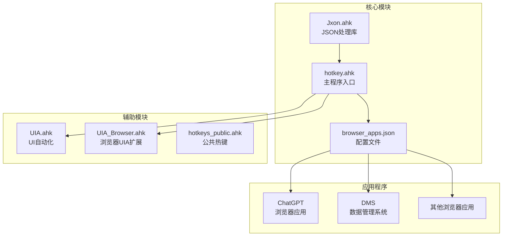
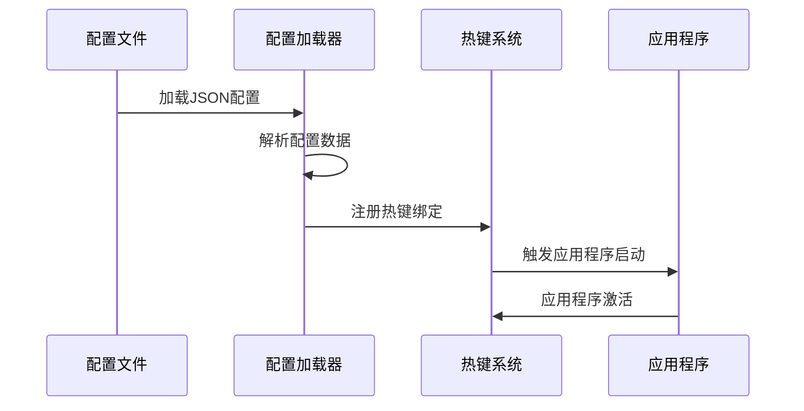
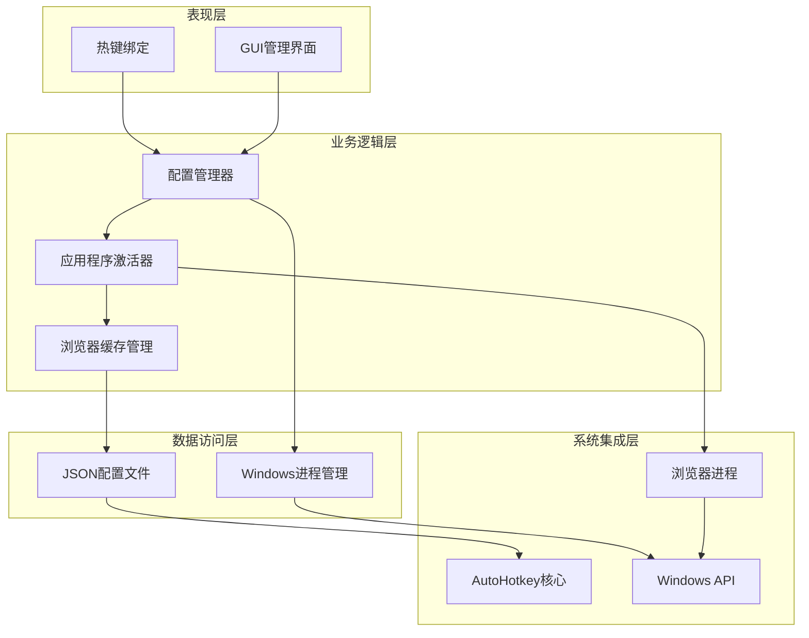
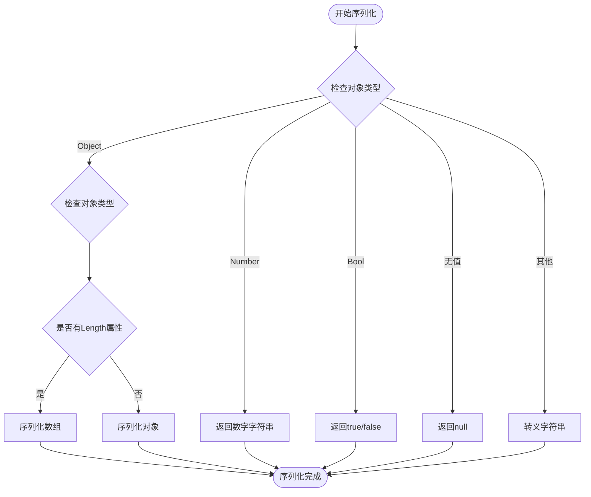
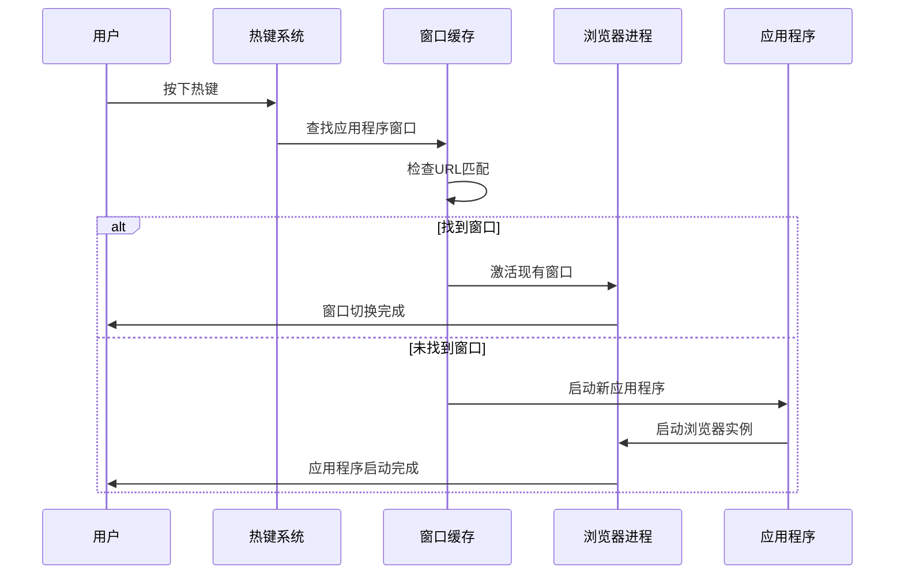
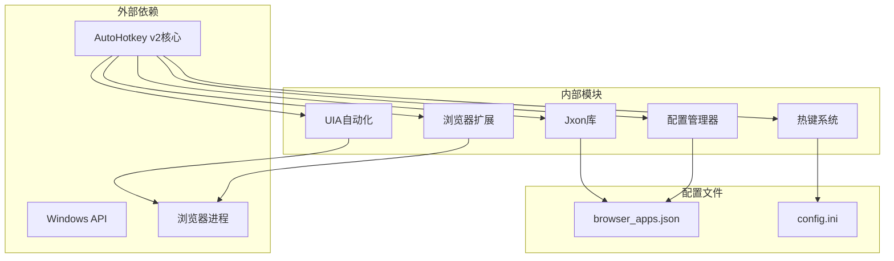
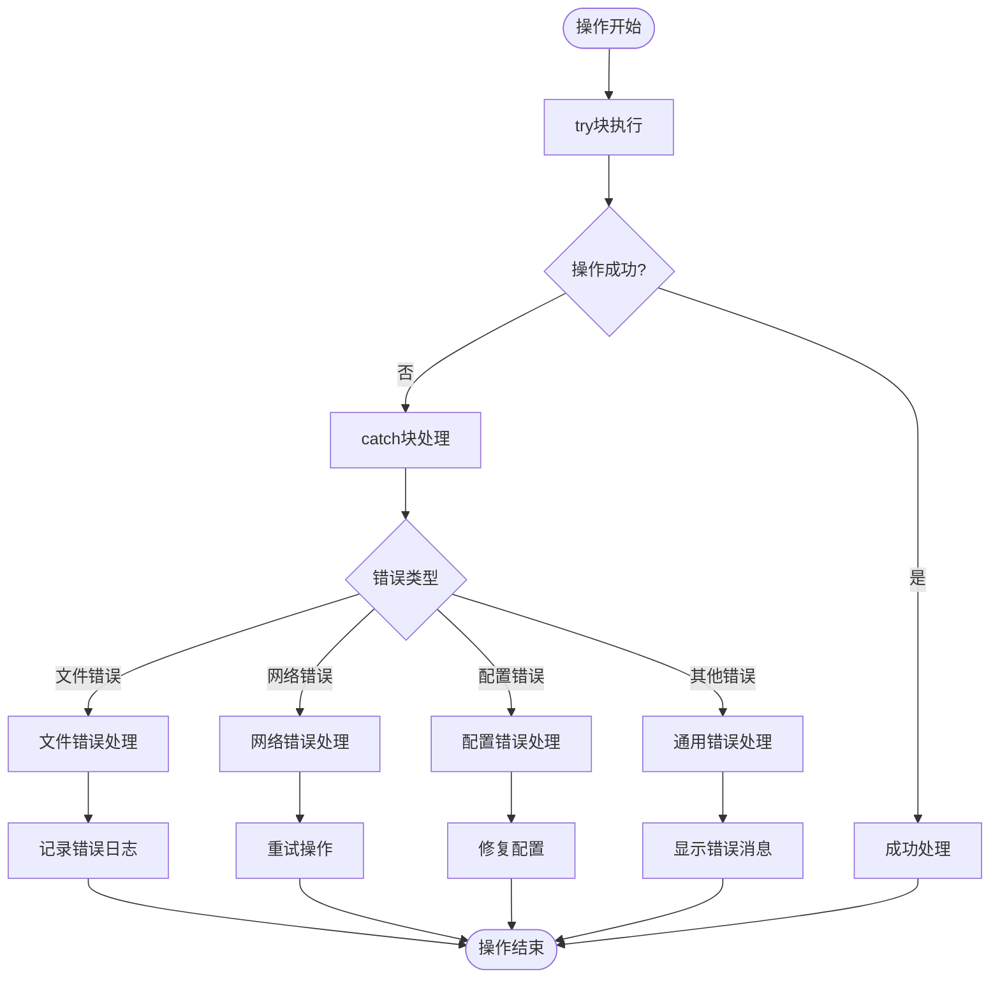

# 配置管理API

<cite>
**本文档引用的文件**
- [Jxon.ahk](file://lib/Jxon.ahk)
- [browser_apps.json](file://browser_apps.json)
- [hotkey.ahk](file://hotkey.ahk)
- [README.md](file://README.md)
</cite>

## 目录
1. [简介](#简介)
2. [项目结构](#项目结构)
3. [核心组件](#核心组件)
4. [架构概览](#架构概览)
5. [详细组件分析](#详细组件分析)
6. [依赖关系分析](#依赖关系分析)
7. [性能考虑](#性能考虑)
8. [故障排除指南](#故障排除指南)
9. [结论](#结论)

## 简介

本项目是一个基于AutoHotkey v2的热键管理系统，主要功能是通过配置文件管理浏览器应用程序的快捷启动。项目的核心是Jxon库提供的轻量级JSON处理能力，以及browser_apps.json配置文件的动态加载和管理。

该系统提供了完整的配置管理API，包括JSON解析和序列化、应用程序配置管理、系统配置验证和错误处理机制。用户可以通过简单的JSON配置文件定义浏览器应用程序、热键绑定、浏览器参数等，系统会自动解析配置并提供相应的快捷启动功能。

## 项目结构

项目采用模块化设计，主要包含以下核心组件：



**图表来源**
- [hotkey.ahk:1-20](file://hotkey.ahk#L1-L20)
- [lib/Jxon.ahk:1-10](file://lib/Jxon.ahk#L1-L10)
- [browser_apps.json:1-10](file://browser_apps.json#L1-L10)

**章节来源**
- [hotkey.ahk:1-20](file://hotkey.ahk#L1-L20)
- [README.md:1-2](file://README.md#L1-L2)

## 核心组件

### Jxon库 - JSON处理引擎

Jxon库是本项目的核心JSON处理组件，提供了完整的JSON解析和序列化功能。该库专为AutoHotkey v2设计，支持Map和Array类型的双向转换。

#### 主要特性
- **轻量级设计**：仅301行代码，专注于核心JSON处理功能
- **类型安全**：正确处理字符串、数字、布尔值、null、数组和对象
- **错误处理**：提供详细的解析错误信息，便于调试
- **兼容性**：完全兼容标准JSON格式规范

#### 核心API
- `Jxon_Load(jsonText)` - 将JSON字符串解析为AutoHotkey对象
- `Jxon_Save(obj)` - 将AutoHotkey对象序列化为JSON字符串

**章节来源**
- [lib/Jxon.ahk:10-48](file://lib/Jxon.ahk#L10-L48)

### 浏览器应用配置系统

系统通过browser_apps.json文件管理所有浏览器应用程序的配置，包括浏览器路径、启动参数、应用程序列表等。

#### 配置文件结构
配置文件采用标准JSON格式，包含以下主要部分：

1. **browsers** - 浏览器配置
2. **commonArgs** - 公共启动参数
3. **apps** - 应用程序列表

**章节来源**
- [browser_apps.json:1-48](file://browser_apps.json#L1-L48)

### 热键管理系统

系统实现了完整的热键绑定机制，允许用户通过配置文件定义应用程序的快捷启动方式。

#### 热键绑定流程


**图表来源**
- [hotkey.ahk:2146-2149](file://hotkey.ahk#L2146-L2149)

**章节来源**
- [hotkey.ahk:1950-2153](file://hotkey.ahk#L1950-L2153)

## 架构概览

系统采用分层架构设计，各层职责明确，耦合度低，便于维护和扩展。



**图表来源**
- [hotkey.ahk:751-800](file://hotkey.ahk#L751-L800)
- [hotkey.ahk:1950-2245](file://hotkey.ahk#L1950-L2245)

## 详细组件分析

### Jxon库详细分析

#### JSON解析流程
Jxon库实现了完整的JSON解析器，支持以下数据类型：

```mermaid
flowchart TD
Start([开始解析]) --> SkipWS[跳过空白字符]
SkipWS --> CheckType{检查下一个字符}
CheckType --> |"\""| ParseString[解析字符串]
CheckType --> |"数字"| ParseNumber[解析数字]
CheckType --> |"true"| ReturnTrue[返回true]
CheckType --> |"false"| ReturnFalse[返回false]
CheckType --> |"null"| ReturnNull[返回空字符串]
CheckType --> |"{"| ParseObject[解析对象]
CheckType --> |"["| ParseArray[解析数组]
CheckType --> |其他| ThrowError[抛出错误]
ParseString --> End([解析完成])
ParseNumber --> End
ReturnTrue --> End
ReturnFalse --> End
ReturnNull --> End
ParseObject --> End
ParseArray --> End
ThrowError --> End
```

**图表来源**
- [lib/Jxon.ahk:67-101](file://lib/Jxon.ahk#L67-L101)

#### JSON序列化流程
Jxon库的序列化功能支持多种数据类型的转换：



**图表来源**
- [lib/Jxon.ahk:19-48](file://lib/Jxon.ahk#L19-L48)

**章节来源**
- [lib/Jxon.ahk:10-301](file://lib/Jxon.ahk#L10-L301)

### 配置文件格式规范

#### browser_apps.json配置格式
配置文件遵循标准JSON格式，包含以下必需字段：

| 字段名 | 类型 | 必需 | 描述 |
|--------|------|------|------|
| browsers | 对象 | 是 | 浏览器配置集合 |
| browsers.chrome | 对象 | 否 | Chrome浏览器配置 |
| browsers.chrome.path | 字符串 | 否 | Chrome可执行文件路径 |
| browsers.chrome.profile | 字符串 | 否 | Chrome用户配置文件 |
| browsers.edge | 对象 | 否 | Edge浏览器配置 |
| browsers.edge.path | 字符串 | 否 | Edge可执行文件路径 |
| browsers.edge.profile | 字符串 | 否 | Edge用户配置文件 |
| commonArgs | 数组 | 是 | 公共启动参数列表 |
| apps | 数组 | 是 | 应用程序列表 |

**章节来源**
- [browser_apps.json:1-48](file://browser_apps.json#L1-L48)

#### 应用程序配置项说明

每个应用程序配置包含以下字段：

| 字段名 | 类型 | 必需 | 描述 | 示例 |
|--------|------|------|------|------|
| name | 字符串 | 是 | 应用程序名称 | "ChatGPT" |
| title | 字符串 | 否 | 窗口标题匹配 | "ChatGPT" |
| url | 字符串 | 是 | 应用程序URL | "https://chatgpt.com" |
| browser | 字符串 | 是 | 浏览器类型 | "chrome" |
| memory | 整数 | 否 | 星标数量 | 1 |
| hotkey | 字符串 | 是 | 热键绑定 | "#g" |
| aumid | 字符串 | 否 | 应用程序用户模型ID | "ChatGPT" |

**章节来源**
- [browser_apps.json:25-46](file://browser_apps.json#L25-L46)

### 应用程序激活机制

系统实现了智能的应用程序激活机制，支持以下功能：

#### 窗口激活流程


**图表来源**
- [hotkey.ahk:2221-2245](file://hotkey.ahk#L2221-L2245)

**章节来源**
- [hotkey.ahk:2221-2245](file://hotkey.ahk#L2221-L2245)

### GUI应用程序管理器

系统提供了图形化的应用程序管理界面，允许用户动态管理浏览器应用程序。

#### 管理器功能
- **应用程序列表显示**：显示所有配置的应用程序
- **星标显示**：根据memory字段显示星标数量
- **热键显示**：显示应用程序绑定的热键
- **浏览器显示**：显示应用程序使用的浏览器类型
- **生成按钮**：为选中的应用程序生成启动脚本
- **删除按钮**：删除选中的应用程序

**章节来源**
- [hotkey.ahk:1960-2031](file://hotkey.ahk#L1960-L2031)

## 依赖关系分析

系统采用松耦合的设计，主要依赖关系如下：



**图表来源**
- [hotkey.ahk:3-6](file://hotkey.ahk#L3-L6)
- [hotkey.ahk:37-52](file://hotkey.ahk#L37-L52)

### 模块间依赖关系

| 模块 | 依赖模块 | 依赖类型 | 说明 |
|------|----------|----------|------|
| Jxon库 | AutoHotkey核心 | 直接依赖 | 使用内置字符串处理函数 |
| 配置管理器 | Jxon库 | 直接依赖 | 依赖JSON解析功能 |
| 配置管理器 | 配置文件 | 直接依赖 | 读取JSON配置 |
| 热键系统 | 配置管理器 | 直接依赖 | 从配置中获取热键绑定 |
| UIA自动化 | Windows API | 直接依赖 | 使用COM接口 |
| 浏览器扩展 | UIA自动化 | 直接依赖 | 继承UIA功能 |

**章节来源**
- [hotkey.ahk:3-6](file://hotkey.ahk#L3-L6)

## 性能考虑

### JSON处理性能优化

Jxon库采用了多项性能优化措施：

1. **内存效率**：使用引用传递避免不必要的数据复制
2. **字符串处理**：优化字符串转义和连接操作
3. **递归深度**：合理控制解析递归深度防止栈溢出
4. **类型检查**：快速类型判断减少分支开销

### 应用程序启动性能

系统通过以下机制优化应用程序启动性能：

1. **窗口缓存**：缓存已知应用程序的窗口句柄
2. **URL匹配**：使用高效的字符串匹配算法
3. **进程管理**：智能判断应用程序状态避免重复启动
4. **异步处理**：非阻塞的窗口查找和激活操作

## 故障排除指南

### 常见配置错误

#### JSON语法错误
**问题**：配置文件解析失败
**原因**：JSON格式不正确
**解决方案**：
1. 使用在线JSON验证工具检查格式
2. 确保所有字符串都使用双引号
3. 检查数组和对象的逗号分隔符
4. 验证嵌套结构的括号匹配

#### 浏览器路径错误
**问题**：应用程序无法启动
**原因**：浏览器路径配置不正确
**解决方案**：
1. 验证浏览器可执行文件路径存在
2. 检查路径中的特殊字符转义
3. 确认浏览器安装位置正确
4. 使用绝对路径而非相对路径

#### 热键冲突
**问题**：热键绑定无效
**原因**：热键与其他应用程序冲突
**解决方案**：
1. 更改应用程序的热键绑定
2. 检查系统热键设置
3. 避免使用系统保留热键
4. 测试热键在不同应用程序中的可用性

### 错误处理机制

系统实现了多层次的错误处理机制：



**图表来源**
- [hotkey.ahk:2113-2126](file://hotkey.ahk#L2113-L2126)

**章节来源**
- [hotkey.ahk:2113-2126](file://hotkey.ahk#L2113-L2126)

### 调试技巧

1. **启用详细日志**：在开发环境中添加调试输出
2. **逐步验证**：逐个验证配置项的有效性
3. **单元测试**：为关键功能编写测试用例
4. **性能监控**：监控应用程序启动时间和资源使用

## 结论

本项目成功实现了基于AutoHotkey v2的配置管理API，提供了完整的JSON处理、应用程序配置管理和热键绑定功能。系统具有以下特点：

### 技术优势
- **模块化设计**：清晰的模块分离和职责划分
- **类型安全**：完善的类型检查和错误处理
- **性能优化**：针对AutoHotkey环境的性能优化
- **易于扩展**：灵活的架构支持功能扩展

### 功能完整性
- **JSON处理**：完整的JSON解析和序列化能力
- **配置管理**：动态配置加载和验证机制
- **热键系统**：智能的热键绑定和应用程序激活
- **GUI管理**：直观的图形化配置管理界面

### 应用价值
该系统为用户提供了高效的应用程序启动解决方案，通过简单的JSON配置即可实现复杂的热键绑定和应用程序管理功能。系统的模块化设计也为进一步的功能扩展奠定了良好的基础。

未来可以考虑的功能增强包括：配置文件的热重载、更丰富的配置验证规则、多用户配置支持等。