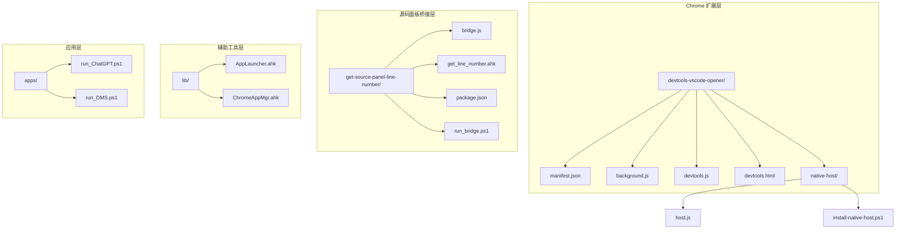
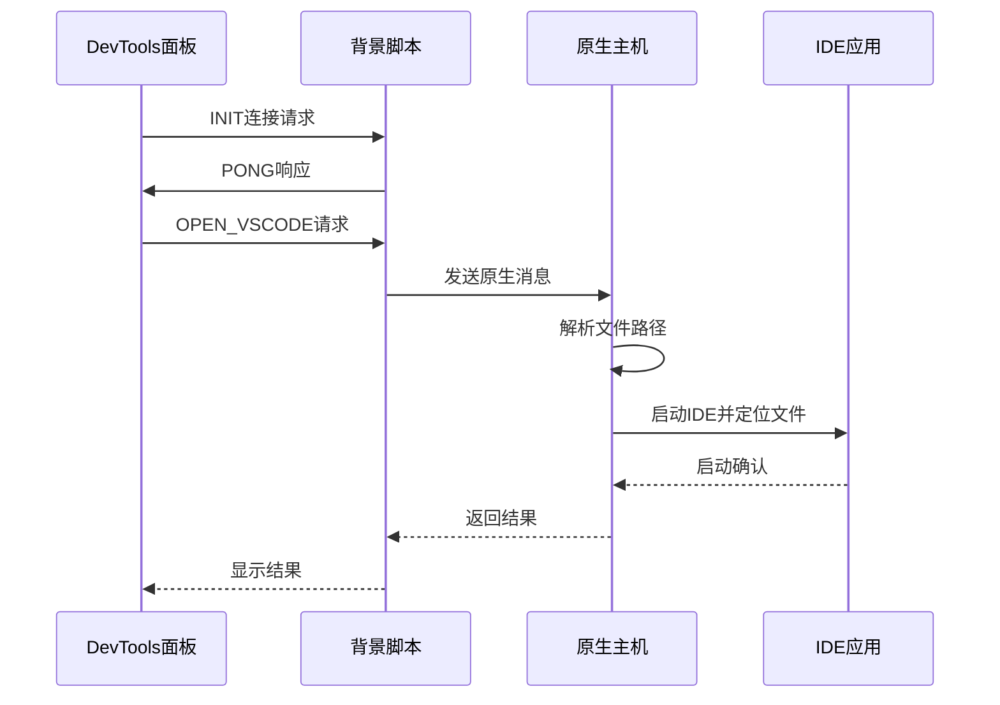
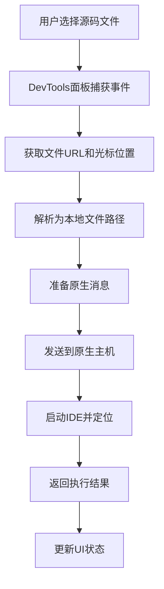
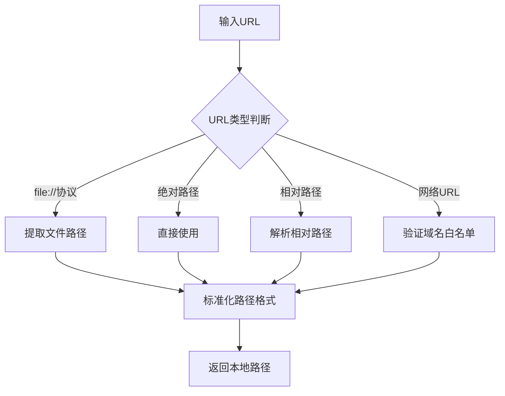
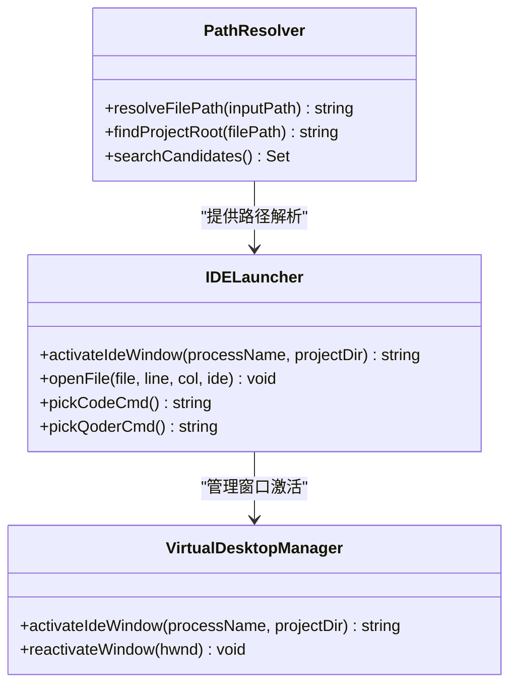
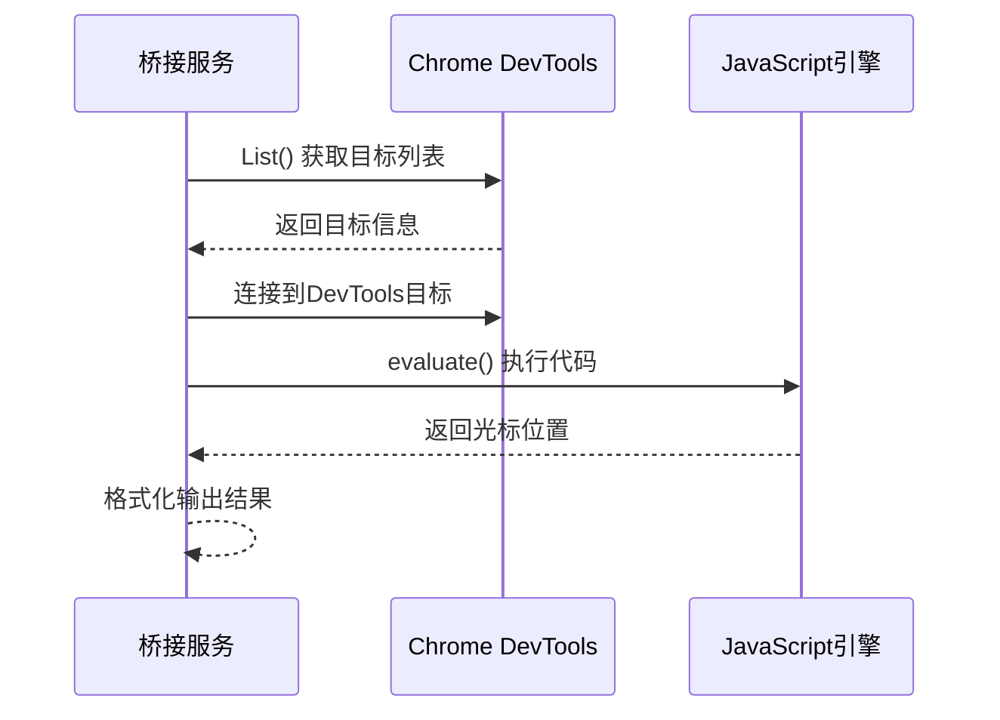
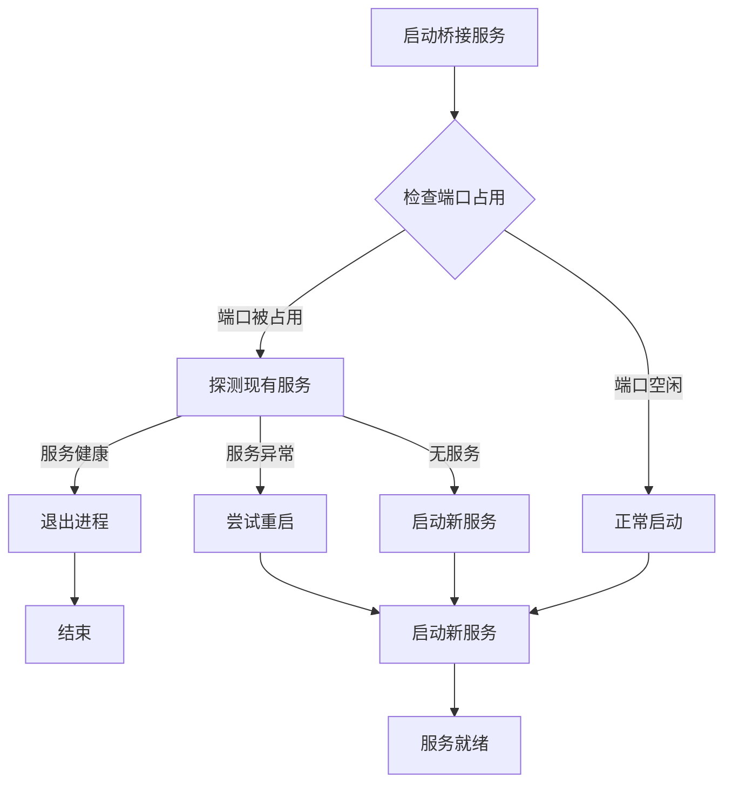
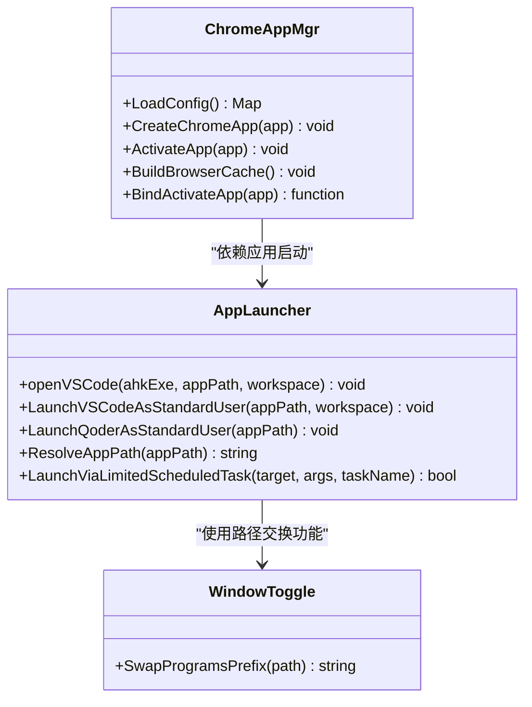
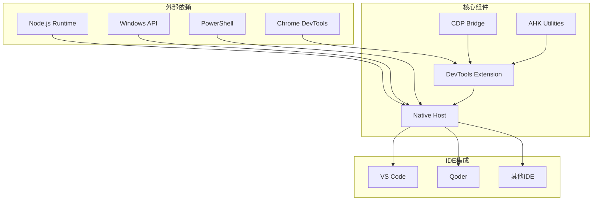
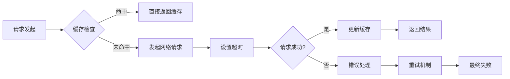

# DevTools VS Code 开发者工具集成系统

<cite>
**本文档引用的文件**
- [manifest.json](file://devtools-vscode-opener/manifest.json)
- [background.js](file://devtools-vscode-opener/background.js)
- [devtools.js](file://devtools-vscode-opener/devtools.js)
- [devtools.html](file://devtools-vscode-opener/devtools.html)
- [host.js](file://devtools-vscode-opener/native-host/host.js)
- [install-native-host.ps1](file://devtools-vscode-opener/native-host/install-native-host.ps1)
- [bridge.js](file://get-source-panel-line-number/bridge.js)
- [get_line_number.ahk](file://get-source-panel-line-number/get_line_number.ahk)
- [package.json](file://get-source-panel-line-number/package.json)
- [run_bridge.ps1](file://run_bridge.ps1)
- [AppLauncher.ahk](file://lib/AppLauncher.ahk)
- [ChromeAppMgr.ahk](file://lib/ChromeAppMgr.ahk)
- [README.md](file://README.md)
</cite>

## 目录
1. [简介](#简介)
2. [项目结构](#项目结构)
3. [核心组件](#核心组件)
4. [架构概览](#架构概览)
5. [详细组件分析](#详细组件分析)
6. [依赖关系分析](#依赖关系分析)
7. [性能考虑](#性能考虑)
8. [故障排除指南](#故障排除指南)
9. [结论](#结论)

## 简介

DevTools VS Code 开发者工具集成系统是一个基于 Chrome 扩展和 AutoHotkey 的智能开发工具集，旨在提供无缝的开发者体验。该系统的核心功能包括：

- **智能文件定位**：通过 Chrome DevTools 获取当前选中的源码文件和光标位置
- **IDE 自动跳转**：一键将当前编辑位置自动打开到 VS Code 或 Qoder
- **多平台支持**：支持 Windows、macOS 和 Linux 系统
- **虚拟桌面集成**：智能激活目标 IDE 窗口，支持 Windows 虚拟桌面环境
- **路径解析优化**：智能解析相对路径，支持多种项目结构

该系统通过三个主要组件协同工作：Chrome DevTools 扩展、Node.js 原生主机和 AutoHotkey 辅助工具。

## 项目结构

项目采用模块化设计，主要包含以下核心目录：

**图表来源**
- [manifest.json:1-32](file://devtools-vscode-opener/manifest.json#L1-L32)
- [bridge.js:1-141](file://get-source-panel-line-number/bridge.js#L1-L141)
- [host.js:1-250](file://devtools-vscode-opener/native-host/host.js#L1-L250)

**章节来源**
- [README.md:1-2](file://README.md#L1-L2)
- [manifest.json:1-32](file://devtools-vscode-opener/manifest.json#L1-L32)

## 核心组件

### Chrome DevTools 扩展组件

系统的核心扩展组件提供了与 Chrome DevTools 的深度集成，包括：

- **DevTools 面板**：嵌入式 JavaScript 面板，负责与背景脚本通信
- **背景服务**：处理原生消息传递和 IDE 启动逻辑
- **原生主机**：Node.js 应用，负责实际的文件操作和 IDE 启动

### 源码面板桥接组件

通过 Chrome Remote Debugging Protocol (CDP) 实现 DevTools 内部状态的实时获取：

- **HTTP 服务器**：提供 /line-number 接口获取当前光标位置
- **CDP 客户端**：连接到 Chrome DevTools 实例
- **状态监控**：实时跟踪源码面板的文件和光标位置

### 路径解析和 IDE 启动组件

智能路径解析和跨平台 IDE 启动机制：

- **路径解析算法**：支持相对路径、绝对路径和项目根目录查找
- **IDE 启动策略**：支持 VS Code、Qoder 等多种 IDE
- **窗口管理**：智能激活目标 IDE 窗口，支持虚拟桌面

**章节来源**
- [background.js:1-82](file://devtools-vscode-opener/background.js#L1-L82)
- [devtools.js:1-152](file://devtools-vscode-opener/devtools.js#L1-L152)
- [host.js:1-250](file://devtools-vscode-opener/native-host/host.js#L1-L250)

## 架构概览

系统采用分层架构设计，实现了松耦合的组件间通信：

**图表来源**
- [background.js:37-66](file://devtools-vscode-opener/background.js#L37-L66)
- [devtools.js:116-128](file://devtools-vscode-opener/devtools.js#L116-L128)

### 数据流架构

**图表来源**
- [devtools.js:116-128](file://devtools-vscode-opener/devtools.js#L116-L128)
- [host.js:190-214](file://devtools-vscode-opener/native-host/host.js#L190-L214)

## 详细组件分析

### DevTools 扩展核心组件

#### 路径解析算法

系统实现了智能的路径解析机制，支持多种文件格式和路径类型：

**图表来源**
- [devtools.js:40-59](file://devtools-vscode-opener/devtools.js#L40-L59)

#### 光标位置获取机制

系统通过两种方式获取精确的光标位置：

1. **CDP 直接获取**：通过 Chrome Remote Debugging Protocol 获取 DevTools 内部状态
2. **状态回退**：使用 DevTools 面板的最后已知状态作为备用方案

**章节来源**
- [devtools.js:61-112](file://devtools-vscode-opener/devtools.js#L61-L112)

### 原生主机组件

#### 路径解析优化算法

原生主机实现了高效的路径解析算法，支持以下特性：

- **项目根目录检测**：自动识别 package.json、.git 等项目标识
- **多盘符支持**：支持 C:/D: 盘符互换
- **智能候选搜索**：在用户主目录和常见开发目录中搜索

**图表来源**
- [host.js:9-57](file://devtools-vscode-opener/native-host/host.js#L9-L57)
- [host.js:190-214](file://devtools-vscode-opener/native-host/host.js#L190-L214)

**章节来源**
- [host.js:1-250](file://devtools-vscode-opener/native-host/host.js#L1-L250)

### 源码面板桥接组件

#### CDP 连接管理

桥接组件通过 Chrome Remote Debugging Protocol 实现与 DevTools 的深度集成：

**图表来源**
- [bridge.js:11-84](file://get-source-panel-line-number/bridge.js#L11-L84)

#### 端口冲突处理

系统实现了智能的端口冲突检测和处理机制：

**图表来源**
- [bridge.js:86-100](file://get-source-panel-line-number/bridge.js#L86-L100)
- [bridge.js:123-137](file://get-source-panel-line-number/bridge.js#L123-L137)

**章节来源**
- [bridge.js:1-141](file://get-source-panel-line-number/bridge.js#L1-L141)
- [get_line_number.ahk:1-159](file://get-source-panel-line-number/get_line_number.ahk#L1-L159)

### AutoHotkey 辅助组件

#### 应用启动框架

系统提供了完整的应用启动和管理框架：

**图表来源**
- [AppLauncher.ahk:22-72](file://lib/AppLauncher.ahk#L22-L72)
- [ChromeAppMgr.ahk:24-32](file://lib/ChromeAppMgr.ahk#L24-L32)

**章节来源**
- [AppLauncher.ahk:1-146](file://lib/AppLauncher.ahk#L1-L146)
- [ChromeAppMgr.ahk:1-321](file://lib/ChromeAppMgr.ahk#L1-L321)

## 依赖关系分析

系统采用了清晰的依赖层次结构，确保各组件间的松耦合：

**图表来源**
- [manifest.json:25-31](file://devtools-vscode-opener/manifest.json#L25-L31)
- [package.json:2-4](file://get-source-panel-line-number/package.json#L2-L4)

### 组件耦合度分析

系统设计遵循了低耦合高内聚的原则：

- **扩展与原生主机**：通过标准的 Chrome Native Messaging 协议通信
- **DevTools 与桥接**：通过 HTTP API 和 CDP 协议实现松耦合
- **路径解析与 IDE 启动**：通过统一的接口抽象实现解耦

**章节来源**
- [background.js:1-82](file://devtools-vscode-opener/background.js#L1-L82)
- [host.js:216-249](file://devtools-vscode-opener/native-host/host.js#L216-L249)

## 性能考虑

### 内存管理优化

系统在多个层面实现了内存优化：

- **连接池管理**：DevTools 端口连接采用 Map 结构进行高效管理
- **超时控制**：所有异步操作设置合理的超时时间（默认 10 秒）
- **资源清理**：及时断开不再使用的连接和进程

### 网络通信优化

**图表来源**
- [devtools.js:65-94](file://devtools-vscode-opener/devtools.js#L65-L94)

### 跨平台兼容性

系统通过以下机制确保跨平台兼容性：

- **路径分隔符转换**：统一使用 '/' 作为路径分隔符
- **命令行参数适配**：根据操作系统选择合适的启动命令
- **权限管理**：通过任务计划程序实现普通权限启动

## 故障排除指南

### 常见问题诊断

#### DevTools 扩展问题

1. **扩展未加载**
   - 检查 Chrome 扩展管理页面
   - 验证 manifest.json 配置正确性
   - 确认具有必要的权限声明

2. **原生主机连接失败**
   - 验证原生主机已正确安装
   - 检查 Chrome 扩展 ID 配置
   - 确认 Node.js 环境可用

#### 源码面板桥接问题

1. **CDP 连接失败**
   - 确认 Chrome 以调试模式启动
   - 检查远程调试端口 (9222) 可用性
   - 验证 DevTools 实例存在

2. **端口冲突**
   - 使用 run_bridge.ps1 检查服务状态
   - 手动终止占用端口的进程
   - 修改默认端口号配置

#### IDE 启动问题

1. **IDE 路径解析失败**
   - 检查 IDE 安装路径配置
   - 验证环境变量设置
   - 确认路径存在且可访问

2. **窗口激活失败**
   - 检查 Windows 虚拟桌面设置
   - 验证 IDE 窗口可见性
   - 确认具有必要的系统权限

**章节来源**
- [install-native-host.ps1:1-58](file://devtools-vscode-opener/native-host/install-native-host.ps1#L1-L58)
- [get_line_number.ahk:115-159](file://get-source-panel-line-number/get_line_number.ahk#L115-L159)

### 调试工具和日志

系统提供了完善的调试支持：

- **控制台日志**：详细的执行过程记录
- **状态报告**：系统健康检查和诊断信息
- **错误追踪**：完整的错误堆栈信息

**章节来源**
- [devtools.js:126-127](file://devtools-vscode-opener/devtools.js#L126-L127)
- [host.js:149-160](file://devtools-vscode-opener/native-host/host.js#L149-L160)

## 结论

DevTools VS Code 开发者工具集成系统是一个设计精良、功能完备的开发工具集。其主要优势包括：

### 技术优势

- **架构设计**：采用分层架构，组件职责明确，易于维护和扩展
- **跨平台支持**：通过原生主机实现跨平台兼容性
- **智能路径解析**：高效的路径解析算法支持多种开发场景
- **性能优化**：合理的超时控制和资源管理机制

### 用户价值

- **提升开发效率**：一键跳转到 IDE，减少手动操作
- **改善开发体验**：智能激活窗口，支持虚拟桌面环境
- **降低学习成本**：直观的界面和简单的配置流程
- **增强开发灵活性**：支持多种 IDE 和开发环境

### 扩展性考虑

系统为未来的功能扩展预留了良好的基础：

- **插件架构**：支持新的 IDE 和开发工具集成
- **配置管理**：灵活的配置选项满足不同需求
- **API 接口**：标准化的接口便于第三方集成
- **监控机制**：完善的日志和诊断功能

该系统代表了现代开发者工具的发展方向，通过智能化和自动化技术显著提升了开发效率和体验质量。