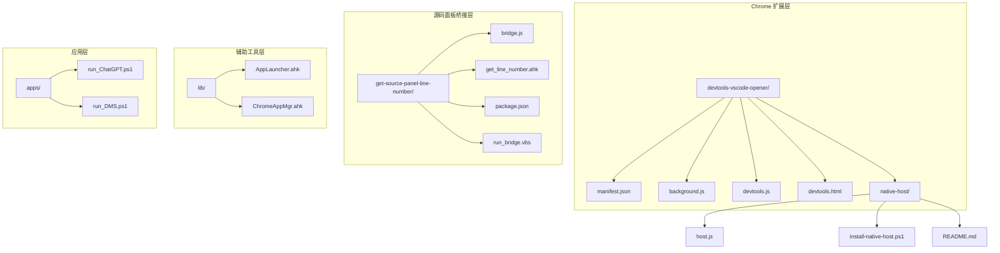
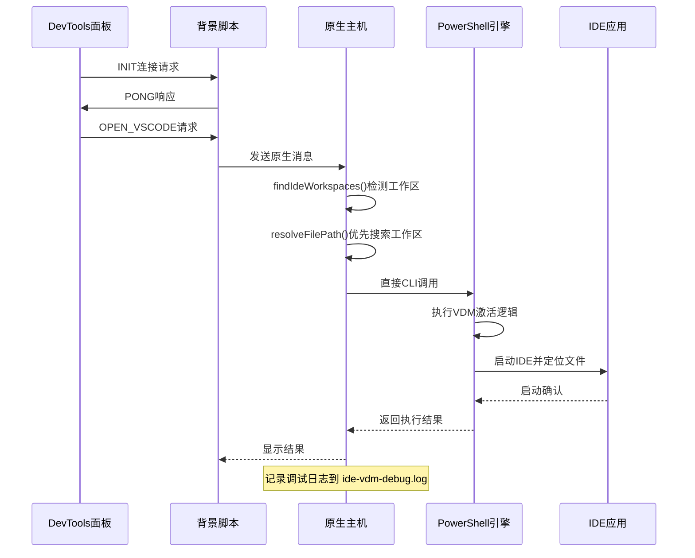
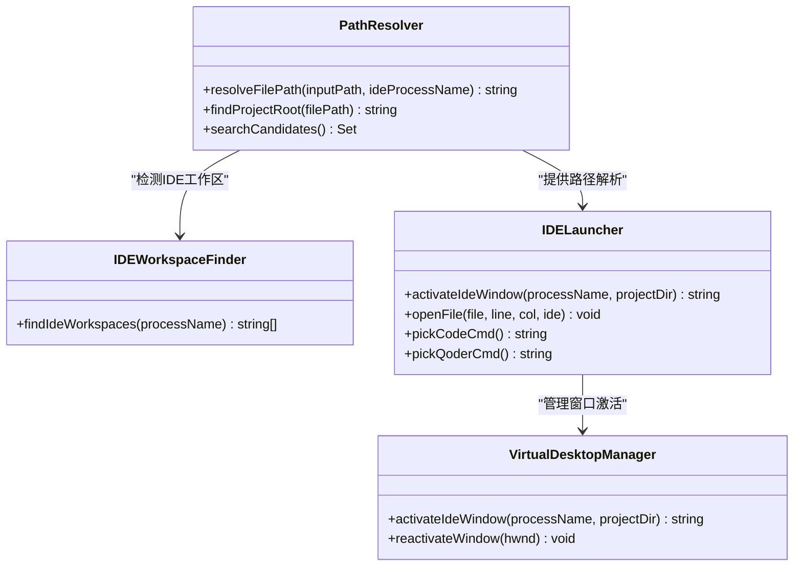
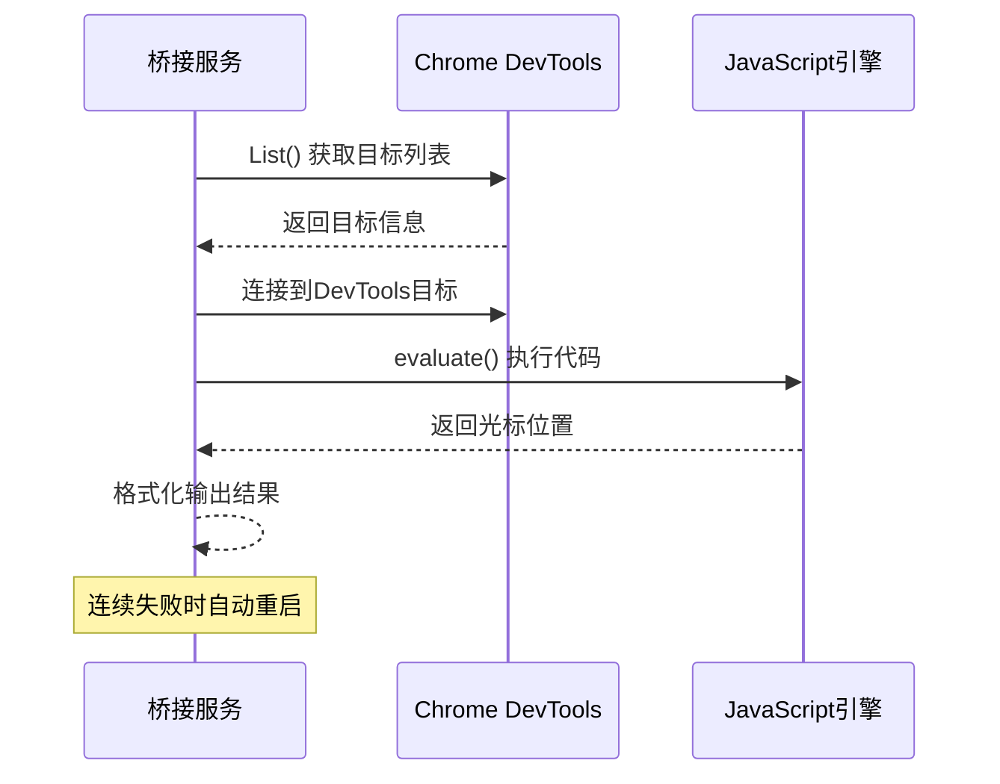
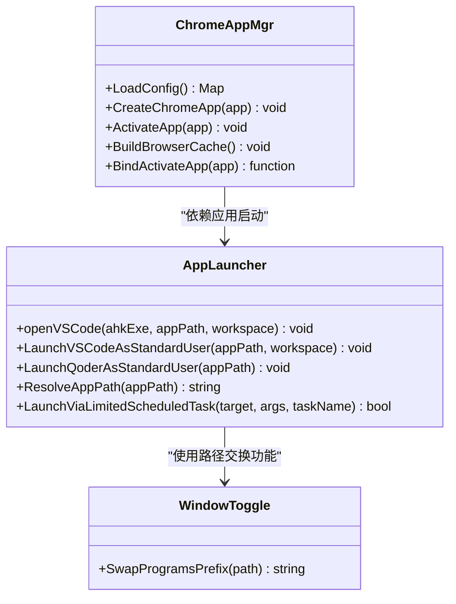
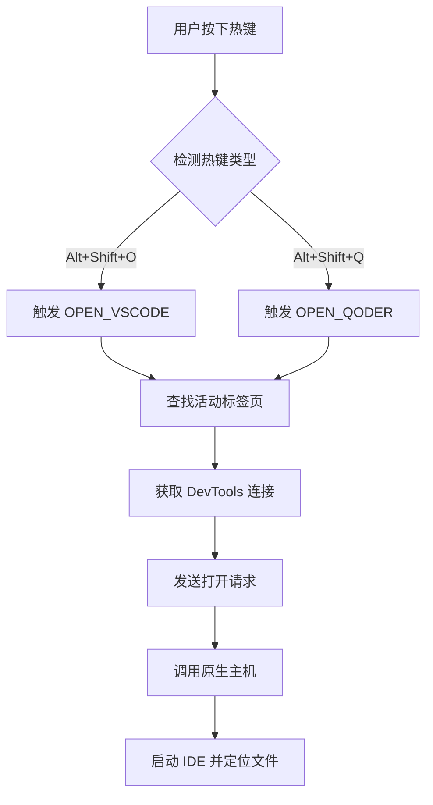
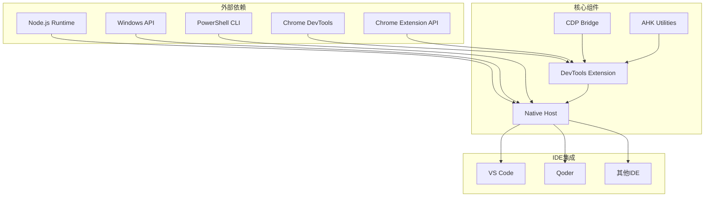

# DevTools VS Code 开发者工具集成系统

<cite>
**本文档引用的文件**
- [manifest.json](file://devtools-vscode-opener/manifest.json)
- [background.js](file://devtools-vscode-opener/background.js)
- [devtools.js](file://devtools-vscode-opener/devtools.js)
- [devtools.html](file://devtools-vscode-opener/devtools.html)
- [host.js](file://devtools-vscode-opener/native-host/host.js)
- [install-native-host.ps1](file://devtools-vscode-opener/native-host/install-native-host.ps1)
- [bridge.js](file://get-source-panel-line-number/bridge.js)
- [get_line_number.ahk](file://get-source-panel-line-number/get_line_number.ahk)
- [package.json](file://get-source-panel-line-number/package.json)
- [run_bridge.vbs](file://get-source-panel-line-number/run_bridge.vbs)
- [AppLauncher.ahk](file://lib/AppLauncher.ahk)
- [ChromeAppMgr.ahk](file://lib/ChromeAppMgr.ahk)
- [README.md](file://README.md)
- [native-host/README.md](file://devtools-vscode-opener/native-host/README.md)
</cite>

## 更新摘要
**所做更改**
- 新增IDE工作区发现功能章节，详细说明智能工作区检测机制
- 增强路径解析算法说明，反映IDE工作区优先级搜索
- 更新调试日志功能，新增虚拟桌面管理调试支持
- 完善故障排除指南，增加IDE工作区发现相关问题诊断
- 优化架构概览图，展示新的工作区发现流程

## 目录
1. [简介](#简介)
2. [项目结构](#项目结构)
3. [核心组件](#核心组件)
4. [架构概览](#架构概览)
5. [详细组件分析](#详细组件分析)
6. [IDE工作区发现功能](#ide工作区发现功能)
7. [热键命令支持](#热键命令支持)
8. [依赖关系分析](#依赖关系分析)
9. [性能考虑](#性能考虑)
10. [故障排除指南](#故障排除指南)
11. [结论](#结论)

## 简介

DevTools VS Code 开发者工具集成系统是一个基于 Chrome 扩展和 AutoHotkey 的智能开发工具集，旨在提供无缝的开发者体验。该系统的核心功能包括：

- **智能文件定位**：通过 Chrome DevTools 获取当前选中的源码文件和光标位置
- **IDE 自动跳转**：一键将当前编辑位置自动打开到 VS Code 或 Qoder
- **多平台支持**：支持 Windows、macOS 和 Linux 系统
- **虚拟桌面集成**：智能激活目标 IDE 窗口，支持 Windows 虚拟桌面环境
- **路径解析优化**：智能解析相对路径，支持多种项目结构
- **IDE工作区发现**：自动检测已打开的IDE工作区，优先在当前工作区中搜索文件
- **热键命令支持**：提供键盘快捷键快速访问功能
- **增强调试能力**：新增虚拟桌面管理和窗口激活的详细调试日志

该系统通过三个主要组件协同工作：Chrome DevTools 扩展、Node.js 原生主机和 AutoHotkey 辅助工具。

**更新** 系统现已实现IDE工作区发现功能，能够智能检测当前桌面上已打开的IDE工作区，并在这些工作区中优先搜索文件，显著提升了文件定位的准确性和速度。同时增强了调试能力，新增了虚拟桌面管理的详细日志记录功能。

## 项目结构

项目采用模块化设计，主要包含以下核心目录：



**图表来源**
- [manifest.json:1-32](file://devtools-vscode-opener/manifest.json#L1-L32)
- [bridge.js:1-142](file://get-source-panel-line-number/bridge.js#L1-L142)
- [host.js:1-255](file://devtools-vscode-opener/native-host/host.js#L1-L255)

**章节来源**
- [README.md:1-2](file://README.md#L1-L2)
- [manifest.json:1-32](file://devtools-vscode-opener/manifest.json#L1-L32)

## 核心组件

### Chrome DevTools 扩展组件

系统的核心扩展组件提供了与 Chrome DevTools 的深度集成，包括：

- **DevTools 面板**：嵌入式 JavaScript 面板，负责与背景脚本通信
- **背景服务**：处理原生消息传递和 IDE 启动逻辑
- **原生主机**：Node.js 应用，负责实际的文件操作和 IDE 启动
- **热键命令**：支持 Alt+Shift+O（VS Code）和 Alt+Shift+Q（Qoder）快捷键

### 源码面板桥接组件

通过 Chrome Remote Debugging Protocol (CDP) 实现 DevTools 内部状态的实时获取：

- **HTTP 服务器**：提供 /line-number 接口获取当前光标位置
- **CDP 客户端**：连接到 Chrome DevTools 实例
- **状态监控**：实时跟踪源码面板的文件和光标位置
- **自动重启机制**：连续失败后自动重启以恢复功能

### 路径解析和 IDE 启动组件

智能路径解析和跨平台 IDE 启动机制：

- **IDE工作区发现**：自动检测当前桌面上已打开的IDE工作区，优先在这些工作区中搜索文件
- **改进的路径解析算法**：支持IDE工作区优先级搜索、相对路径、绝对路径和项目根目录查找
- **IDE 启动策略**：支持 VS Code、Qoder 等多种 IDE
- **窗口管理**：智能激活目标 IDE 窗口，支持虚拟桌面
- **调试日志**：新增 ide-vdm-debug.log 文件记录虚拟桌面操作

**章节来源**
- [background.js:1-95](file://devtools-vscode-opener/background.js#L1-L95)
- [devtools.js:1-151](file://devtools-vscode-opener/devtools.js#L1-L151)
- [host.js:1-255](file://devtools-vscode-opener/native-host/host.js#L1-L255)

## 架构概览

系统采用分层架构设计，实现了松耦合的组件间通信。经过增强后，新增了IDE工作区发现功能：



**图表来源**
- [background.js:6-38](file://devtools-vscode-opener/background.js#L6-L38)
- [devtools.js:115-126](file://devtools-vscode-opener/devtools.js#L115-L126)
- [host.js:13-49](file://devtools-vscode-opener/native-host/host.js#L13-L49)

### 数据流架构

```mermaid
flowchart TD
A[用户选择源码文件] --> B[DevTools面板捕获事件]
B --> C[获取文件URL和光标位置]
C --> D[解析为本地文件路径]
D --> E[findIdeWorkspaces()检测IDE工作区]
E --> F[resolveFilePath()优先搜索工作区]
F --> G[准备原生消息]
G --> H[发送到原生主机]
H --> I[直接CLI调用PowerShell]
I --> J[执行VDM激活和文件定位]
J --> K[生成调试日志]
K --> L[返回执行结果]
L --> M[更新UI状态]
```

**图表来源**
- [devtools.js:115-126](file://devtools-vscode-opener/devtools.js#L115-L126)
- [host.js:139-151](file://devtools-vscode-opener/native-host/host.js#L139-L151)
- [host.js:53-112](file://devtools-vscode-opener/native-host/host.js#L53-L112)

## 详细组件分析

### DevTools 扩展核心组件

#### 路径解析算法

系统实现了智能的路径解析机制，支持多种文件格式和路径类型：

```mermaid
flowchart TD
A[输入URL] --> B{URL类型判断}
B --> |file://协议| C[提取文件路径]
B --> |绝对路径| D[直接使用]
B --> |相对路径| E[解析相对路径]
B --> |网络URL| F[验证域名白名单]
C --> G[标准化路径格式]
D --> G
E --> G
F --> G
G --> H[findIdeWorkspaces()检测工作区]
H --> I[resolveFilePath()优先搜索工作区]
I --> J[返回本地路径]
```

**图表来源**
- [devtools.js:33-51](file://devtools-vscode-opener/devtools.js#L33-L51)
- [host.js:13-49](file://devtools-vscode-opener/native-host/host.js#L13-L49)
- [host.js:53-112](file://devtools-vscode-opener/native-host/host.js#L53-L112)

#### 光标位置获取机制

系统通过两种方式获取精确的光标位置：

1. **CDP 直接获取**：通过 Chrome Remote Debugging Protocol 获取 DevTools 内部状态
2. **状态回退**：使用 DevTools 面板的最后已知状态作为备用方案
3. **自动重启**：当 CDP 返回 0 时自动重启以恢复功能

**章节来源**
- [devtools.js:85-111](file://devtools-vscode-opener/devtools.js#L85-L111)

### 原生主机组件

**更新** 原生主机实现已增强，新增了IDE工作区发现功能：

#### IDE工作区发现功能

系统实现了智能的IDE工作区检测机制，能够自动发现当前桌面上已打开的IDE工作区：

```mermaid
flowchart TD
A[findIdeWorkspaces()调用] --> B{检查平台类型}
B --> |Windows| C[执行PowerShell命令]
B --> |其他平台| D[返回空数组]
C --> E[获取IDE进程列表]
E --> F[提取命令行参数]
F --> G[解析工作区路径]
G --> H[验证路径有效性]
H --> I[返回唯一工作区列表]
```

**图表来源**
- [host.js:13-49](file://devtools-vscode-opener/native-host/host.js#L13-L49)

#### 改进后的路径解析优化算法

原生主机实现了高效的路径解析算法，支持以下特性：

- **IDE工作区优先级**：自动识别当前桌面上已打开的IDE工作区，优先在这些工作区中搜索文件
- **项目根目录检测**：自动识别 package.json、.git 等项目标识
- **多盘符支持**：支持 C:/D: 盘符互换
- **智能候选搜索**：在用户主目录和常见开发目录中搜索



**图表来源**
- [host.js:53-112](file://devtools-vscode-opener/native-host/host.js#L53-L112)
- [host.js:139-151](file://devtools-vscode-opener/native-host/host.js#L139-L151)

#### 直接 CLI 调用实现

**更新** 系统现在使用直接的 PowerShell CLI 调用方式替代复杂的内联脚本：

- **简化调用**：通过 `pwsh -NoProfile -NonInteractive -ExecutionPolicy Bypass -File` 直接执行生成的 PowerShell 脚本
- **临时文件管理**：创建临时 .ps1 文件并在执行后清理
- **超时控制**：设置 10 秒超时防止挂起
- **错误处理**：完善的 try-catch 和 finally 块确保资源清理
- **调试日志**：新增 ide-vdm-debug.log 文件记录虚拟桌面操作详情

**章节来源**
- [host.js:1-255](file://devtools-vscode-opener/native-host/host.js#L1-L255)

### 源码面板桥接组件

#### CDP 连接管理

桥接组件通过 Chrome Remote Debugging Protocol 实现与 DevTools 的深度集成：



**图表来源**
- [bridge.js:14-65](file://get-source-panel-line-number/bridge.js#L14-L65)

#### 端口冲突处理

系统实现了智能的端口冲突检测和处理机制：


**图表来源**
- [bridge.js:118-137](file://get-source-panel-line-number/bridge.js#L118-L137)
- [bridge.js:139-142](file://get-source-panel-line-number/bridge.js#L139-L142)

**章节来源**
- [bridge.js:1-142](file://get-source-panel-line-number/bridge.js#L1-L142)
- [get_line_number.ahk:1-159](file://get-source-panel-line-number/get_line_number.ahk#L1-L159)

### AutoHotkey 辅助组件

#### 应用启动框架

系统提供了完整的应用启动和管理框架：



**图表来源**
- [AppLauncher.ahk:22-72](file://lib/AppLauncher.ahk#L22-L72)
- [ChromeAppMgr.ahk:24-32](file://lib/ChromeAppMgr.ahk#L24-L32)

**章节来源**
- [AppLauncher.ahk:1-146](file://lib/AppLauncher.ahk#L1-L146)
- [ChromeAppMgr.ahk:1-321](file://lib/ChromeAppMgr.ahk#L1-L321)

## IDE工作区发现功能

**新增** 系统现在提供智能的IDE工作区发现功能，能够自动检测当前桌面上已打开的IDE工作区：

### 工作区发现机制

```mermaid
flowchart TD
A[findIdeWorkspaces()调用] --> B{检查平台类型}
B --> |Windows| C[执行PowerShell命令]
B --> |其他平台| D[返回空数组]
C --> E[Get-Process获取IDE进程]
E --> F[遍历进程命令行参数]
F --> G[正则表达式提取工作区路径]
G --> H[验证路径存在性和有效性]
H --> I[去重并返回工作区列表]
```

**图表来源**
- [host.js:13-49](file://devtools-vscode-opener/native-host/host.js#L13-L49)

### 工作区优先级搜索

系统在路径解析过程中优先搜索IDE工作区中的文件：

```mermaid
flowchart TD
A[resolveFilePath()调用] --> B[检测IDE工作区]
B --> C[在工作区中搜索文件]
C --> |找到文件| D[返回工作区文件路径]
C --> |未找到文件| E[搜索候选目录]
E --> F[在候选目录中搜索文件]
F --> |找到文件| G[返回候选目录文件路径]
F --> |未找到文件| H[返回空字符串]
```

**图表来源**
- [host.js:53-112](file://devtools-vscode-opener/native-host/host.js#L53-L112)

### 工作区发现算法

系统实现了高效的IDE工作区检测算法：

- **进程扫描**：使用 Get-Process 命令扫描指定进程名的IDE进程
- **命令行解析**：从进程命令行参数中提取工作区路径
- **路径验证**：验证提取的路径存在且为目录
- **去重处理**：确保返回唯一的工作区列表
- **错误处理**：优雅处理PowerShell执行异常

**章节来源**
- [host.js:13-49](file://devtools-vscode-opener/native-host/host.js#L13-L49)
- [host.js:53-112](file://devtools-vscode-opener/native-host/host.js#L53-L112)

## 热键命令支持

**新增** 系统现在提供完整的热键命令支持，用户可以通过键盘快捷键快速访问功能：

### 支持的热键命令

- **打开到 VS Code**：Alt+Shift+O
- **打开到 Qoder**：Alt+Shift+Q

### 热键工作机制



**图表来源**
- [manifest.json:9-24](file://devtools-vscode-opener/manifest.json#L9-L24)
- [background.js:75-94](file://devtools-vscode-opener/background.js#L75-L94)

### 热键回退机制

当找不到特定标签页的 DevTools 连接时，系统提供智能回退：

1. **首选连接**：使用当前活动标签页的 DevTools 连接
2. **回退连接**：如果只有一个 DevTools 面板存在，使用该连接
3. **连接管理**：自动清理断开的连接，避免资源泄漏

**章节来源**
- [manifest.json:9-24](file://devtools-vscode-opener/manifest.json#L9-L24)
- [background.js:75-94](file://devtools-vscode-opener/background.js#L75-L94)

## 依赖关系分析

系统采用了清晰的依赖层次结构，确保各组件间的松耦合：



**图表来源**
- [manifest.json:25-31](file://devtools-vscode-opener/manifest.json#L25-L31)
- [package.json:2-4](file://get-source-panel-line-number/package.json#L2-L4)

### 组件耦合度分析

系统设计遵循了低耦合高内聚的原则：

- **扩展与原生主机**：通过标准的 Chrome Native Messaging 协议通信
- **DevTools 与桥接**：通过 HTTP API 和 CDP 协议实现松耦合
- **路径解析与 IDE 启动**：通过统一的接口抽象实现解耦
- **热键与扩展**：通过 Chrome commands API 实现独立的功能模块
- **工作区发现与路径解析**：通过模块化设计实现功能分离

**章节来源**
- [background.js:1-95](file://devtools-vscode-opener/background.js#L1-L95)
- [host.js:176-188](file://devtools-vscode-opener/native-host/host.js#L176-L188)

## 性能考虑

### 内存管理优化

系统在多个层面实现了内存优化：

- **连接池管理**：DevTools 端口连接采用 Map 结构进行高效管理
- **超时控制**：所有异步操作设置合理的超时时间（默认 10 秒）
- **资源清理**：及时断开不再使用的连接和进程
- **自动重启**：CDP 桥接服务在连续失败后自动重启

### 网络通信优化


**图表来源**
- [devtools.js:64-83](file://devtools-vscode-opener/devtools.js#L64-L83)

### 跨平台兼容性

系统通过以下机制确保跨平台兼容性：

- **路径分隔符转换**：统一使用 '/' 作为路径分隔符
- **命令行参数适配**：根据操作系统选择合适的启动命令
- **权限管理**：通过任务计划程序实现普通权限启动
- **PowerShell 兼容性**：支持不同版本的 PowerShell 执行策略
- **工作区发现平台限制**：仅在Windows平台上启用IDE工作区发现功能

**更新** 增强后的实现减少了PowerShell复杂性，提升了跨平台稳定性。

## 故障排除指南

### 常见问题诊断

#### DevTools 扩展问题

1. **扩展未加载**
   - 检查 Chrome 扩展管理页面
   - 验证 manifest.json 配置正确性
   - 确认具有必要的权限声明

2. **原生主机连接失败**
   - 验证原生主机已正确安装
   - 检查 Chrome 扩展 ID 配置
   - 确认 Node.js 环境可用

3. **热键命令无效**
   - 检查 Chrome 命令配置
   - 验证快捷键未被其他应用占用
   - 确认 DevTools 面板处于活动状态

#### 源码面板桥接问题

1. **CDP 连接失败**
   - 确认 Chrome 以调试模式启动
   - 检查远程调试端口 (9222) 可用性
   - 验证 DevTools 实例存在

2. **端口冲突**
   - 使用 run_bridge.vbs 检查服务状态
   - 手动终止占用端口的进程
   - 修改默认端口号配置

3. **自动重启循环**
   - 检查 MAX_FAILURES 配置值
   - 验证 CDP 表达式语法
   - 确认 DevTools 版本兼容性

#### IDE 启动问题

1. **IDE 路径解析失败**
   - 检查 IDE 安装路径配置
   - 验证环境变量设置
   - 确认路径存在且可访问

2. **窗口激活失败**
   - 检查 Windows 虚拟桌面设置
   - 验证 IDE 窗口可见性
   - 确认具有必要的系统权限

**更新** PowerShell 相关问题现在更加直接：

3. **PowerShell 执行失败**
   - 确认 PowerShell CLI 可用性
   - 检查执行策略设置
   - 验证临时文件写入权限
   - 查看 ide-vdm-debug.log 日志文件

4. **虚拟桌面调试日志**
   - 检查 ide-vdm-debug.log 文件是否存在
   - 验证日志文件写入权限
   - 分析 VDM 操作记录和错误信息

#### IDE工作区发现问题

**新增** 由于实现了IDE工作区发现功能：

5. **工作区检测失败**
   - 检查PowerShell执行权限
   - 验证IDE进程名称匹配
   - 确认工作区路径有效
   - 分析PowerShell命令执行结果

6. **工作区搜索不准确**
   - 检查工作区路径解析正则表达式
   - 验证命令行参数格式
   - 确认工作区目录存在且可访问
   - 分析工作区去重逻辑

7. **路径解析性能问题**
   - 检查工作区数量是否过多
   - 验证候选目录搜索范围
   - 确认文件系统访问权限
   - 分析BFS搜索算法效率

#### 原生主机简化问题

**更新** 由于实现了更直接的 CLI 调用方式：

8. **CLI 调用超时**
   - 检查 PowerShell 执行策略
   - 验证临时目录权限
   - 确认没有防病毒软件拦截
   - 查看 10 秒超时限制

9. **临时文件清理失败**
   - 检查文件锁定情况
   - 验证磁盘空间充足
   - 确认没有权限问题

10. **VDM 激活失败**
    - 检查 Windows 虚拟桌面功能
    - 验证 IDE 进程名称匹配
    - 分析 ide-vdm-debug.log 中的 VDM 错误

**章节来源**
- [install-native-host.ps1:1-58](file://devtools-vscode-opener/native-host/install-native-host.ps1#L1-L58)
- [get_line_number.ahk:115-159](file://get-source-panel-line-number/get_line_number.ahk#L115-L159)

### 调试工具和日志

系统提供了完善的调试支持：

- **控制台日志**：详细的执行过程记录
- **状态报告**：系统健康检查和诊断信息
- **错误追踪**：完整的错误堆栈信息
- **PowerShell 日志**：新增的 ide-vdm-debug.log 文件用于 VDM 激活调试
- **CDP 调试**：桥接服务的健康检查和错误信息
- **工作区发现日志**：PowerShell命令执行结果和工作区路径解析详情

**更新** 新增了IDE工作区发现和虚拟桌面管理的详细日志功能，便于问题排查。

**章节来源**
- [devtools.js:125-126](file://devtools-vscode-opener/devtools.js#L125-L126)
- [host.js:139](file://devtools-vscode-opener/native-host/host.js#L139)

## 结论

DevTools VS Code 开发者工具集成系统是一个设计精良、功能完备的开发工具集。经过全面增强后，系统的主要优势进一步提升：

### 技术优势

- **架构设计**：采用分层架构，组件职责明确，易于维护和扩展
- **跨平台支持**：通过原生主机实现跨平台兼容性
- **智能路径解析**：高效的路径解析算法支持多种开发场景
- **IDE工作区发现**：智能检测当前桌面上已打开的IDE工作区，优先在这些工作区中搜索文件
- **性能优化**：合理的超时控制和资源管理机制
- **简化实现**：移除复杂 PowerShell 逻辑，提升系统可靠性
- **热键支持**：完整的键盘快捷键功能
- **增强调试**：新增虚拟桌面调试日志功能
- **工作区优先搜索**：显著提升文件定位的准确性和速度

### 用户价值

- **提升开发效率**：一键跳转到 IDE，减少手动操作
- **改善开发体验**：智能激活窗口，支持虚拟桌面环境
- **降低学习成本**：直观的界面和简单的配置流程
- **增强开发灵活性**：支持多种 IDE 和开发环境
- **提高系统稳定性**：简化的实现减少了潜在故障点
- **快捷键访问**：通过热键快速访问核心功能
- **智能工作区检测**：自动识别已打开的工作区，提升文件搜索准确性

### 扩展性考虑

系统为未来的功能扩展预留了良好的基础：

- **插件架构**：支持新的 IDE 和开发工具集成
- **配置管理**：灵活的配置选项满足不同需求
- **API 接口**：标准化的接口便于第三方集成
- **监控机制**：完善的日志和诊断功能
- **PowerShell 调试**：新增的日志文件便于问题排查
- **热键扩展**：可扩展的快捷键系统支持更多功能
- **工作区发现扩展**：可扩展的工作区检测机制支持更多IDE

**更新** 增强后的实现显著提升了系统的可靠性和可维护性，同时保持了原有的强大功能。新的IDE工作区发现功能通过智能检测当前桌面上已打开的IDE工作区，显著提升了文件定位的准确性和速度。新增的调试日志功能进一步优化了用户体验，便于用户理解和故障排除。

该系统代表了现代开发者工具的发展方向，通过智能化和自动化技术显著提升了开发效率和体验质量。简化的实现不仅提高了系统稳定性，也为未来的功能扩展奠定了更好的基础。新增的IDE工作区发现功能体现了系统对开发者工作流程的深入理解和优化，真正做到了以用户为中心的设计理念。