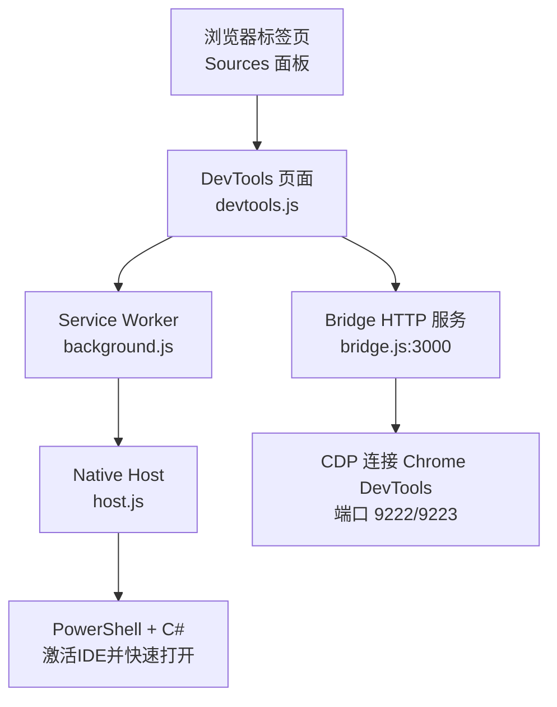
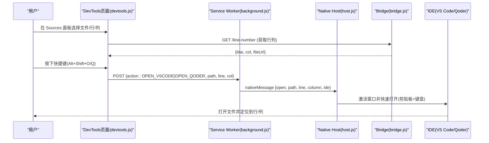
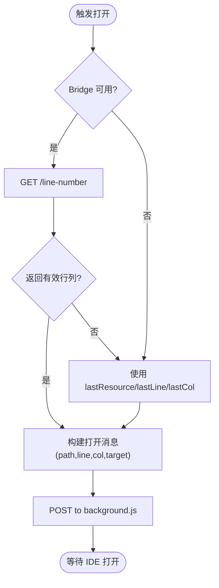
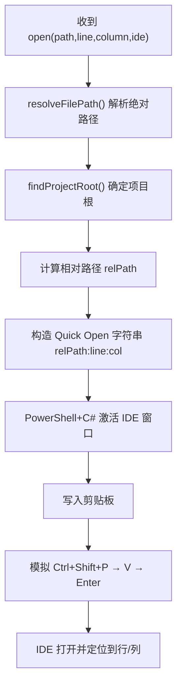
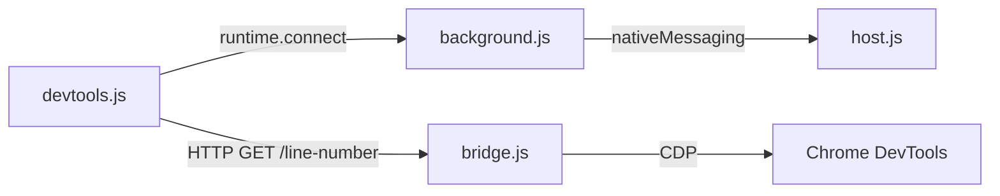

# DevTools面板切换功能

<cite>
**本文引用的文件**
- [manifest.json](file://devtools-vscode-opener/manifest.json)
- [devtools.html](file://devtools-vscode-opener/devtools.html)
- [devtools.js](file://devtools-vscode-opener/devtools.js)
- [background.js](file://devtools-vscode-opener/background.js)
- [host.js](file://devtools-vscode-opener/native-host/host.js)
- [bridge.js](file://get-source-panel-line-number/bridge.js)
- [get_line_number.ahk](file://get-source-panel-line-number/get_line_number.ahk)
</cite>

## 目录
1. [简介](#简介)
2. [项目结构](#项目结构)
3. [核心组件](#核心组件)
4. [架构总览](#架构总览)
5. [详细组件分析](#详细组件分析)
6. [依赖关系分析](#依赖关系分析)
7. [性能与可靠性](#性能与可靠性)
8. [故障排查指南](#故障排查指南)
9. [结论](#结论)
10. [附录：快捷键与配置](#附录快捷键与配置)

## 简介
本仓库实现了一个“DevTools 面板切换并打开到 IDE”的端到端能力：在 Chrome DevTools 的 Sources 面板中，通过快捷键或自动触发，将当前选中的源文件、行号、列号定位并打开到 VS Code 或 Qoder。该能力由三部分协作完成：
- Chrome 扩展（DevTools 页面 + Service Worker）负责捕获用户操作、获取当前资源位置并与后台通信。
- Node Bridge 服务通过 CDP 从 DevTools 内部读取当前编辑器光标位置（行/列/URL）。
- Native Host（Node + PowerShell + C#）负责解析路径、激活目标 IDE 窗口并通过剪贴板+键盘模拟执行“快速打开”。

## 项目结构
- devtools-vscode-opener：Chrome 扩展，包含 Manifest、DevTools 页面、Service Worker、原生宿主脚本。
- get-source-panel-line-number：Node Bridge 服务与 AutoHotkey 辅助工具，用于从 DevTools 获取当前源码行号与列号。
- 其他脚本：主热键脚本与系统级自动化脚本，与本功能无直接耦合。

图表来源
- [devtools.js:14-27](file://devtools-vscode-opener/devtools.js#L14-L27)
- [background.js:42-71](file://devtools-vscode-opener/background.js#L42-L71)
- [host.js:127-221](file://devtools-vscode-opener/native-host/host.js#L127-L221)
- [bridge.js:14-65](file://get-source-panel-line-number/bridge.js#L14-L65)

章节来源
- [manifest.json:1-32](file://devtools-vscode-opener/manifest.json#L1-L32)
- [devtools.html:1-1](file://devtools-vscode-opener/devtools.html#L1-L1)

## 核心组件
- DevTools 页面（devtools.js）：监听 Sources 选择变化，维护最近资源状态；通过 runtime.connect 与 Service Worker 建立长连接；必要时启动/轮询 Bridge 服务以获取精确行列；向后台发送打开指令。
- Service Worker（background.js）：管理 DevTools 端口映射；接收打开请求后调用原生宿主；定义全局快捷键命令。
- Native Host（host.js）：解析文件路径（优先使用已打开工作区），计算相对路径与行列，通过 PowerShell+C# 激活对应 IDE 窗口并使用“快速打开”语法打开指定文件与行/列。
- Bridge（bridge.js）：通过 CDP 查询 DevTools 内部 UI，返回当前光标所在文件的 URL、行号、列号；提供健康检查与缓存重启机制。
- AHK 辅助（get_line_number.ahk）：确保 Chrome 调试端口可用并启动 Bridge 服务，提供诊断热键。

章节来源
- [devtools.js:1-151](file://devtools-vscode-opener/devtools.js#L1-L151)
- [background.js:1-95](file://devtools-vscode-opener/background.js#L1-L95)
- [host.js:1-258](file://devtools-vscode-opener/native-host/host.js#L1-L258)
- [bridge.js:1-142](file://get-source-panel-line-number/bridge.js#L1-L142)
- [get_line_number.ahk:1-159](file://get-source-panel-line-number/get_line_number.ahk#L1-L159)

## 架构总览
整体数据流如下：
- 用户在 DevTools Sources 面板中选择文件/行/列。
- devtools.js 记录最后选中资源，并在需要时通过本地 HTTP 访问 bridge.js 获取精确行列。
- 当触发打开动作（快捷键或自动），devtools.js 将路径、行列、目标 IDE 发送给 background.js。
- background.js 通过 nativeMessaging 调用 host.js。
- host.js 解析路径、找到目标 IDE 窗口，使用剪贴板+键盘模拟执行“快速打开”，从而在 IDE 中定位到具体文件与行/列。

图表来源
- [devtools.js:57-126](file://devtools-vscode-opener/devtools.js#L57-L126)
- [background.js:42-95](file://devtools-vscode-opener/background.js#L42-L95)
- [host.js:127-221](file://devtools-vscode-opener/native-host/host.js#L127-L221)
- [bridge.js:69-114](file://get-source-panel-line-number/bridge.js#L69-L114)

## 详细组件分析

### DevTools 页面（devtools.js）
- 职责
  - 维护 lastResource、lastLine、lastCol 作为后备状态。
  - 通过 runtime.connect 与 background.js 建立通道，处理 INIT、KEEPALIVE、TRIGGER_OPEN 等消息。
  - 通过本地 HTTP 访问 bridge.js 获取精确行列，若不可用则回退到上次状态。
  - 将打开请求转发给 background.js，携带目标 IDE（vscode/qoder）。
- 关键流程
  - 连接管理：断线重连、初始化 tabId。
  - URL→路径转换：支持 file://、协议前缀、Vite @fs 等常见形式。
  - Bridge 可用性检测：带超时重试，必要时尝试启动桥服务。
  - 打开逻辑：优先使用 bridge 返回的行列与文件路径，否则回退到 lastState。

图表来源
- [devtools.js:57-126](file://devtools-vscode-opener/devtools.js#L57-L126)

章节来源
- [devtools.js:1-151](file://devtools-vscode-opener/devtools.js#L1-L151)

### Service Worker（background.js）
- 职责
  - 管理多个 DevTools 页面的端口映射（按 tabId）。
  - 接收来自 DevTools 的打开请求，调用 native host 打开 IDE。
  - 注册全局快捷键命令，将快捷键事件转发给对应 DevTools 页面。
- 关键点
  - 超时保护：native host 响应超时 10s。
  - 多标签容错：若活动标签无端口，尝试单例 DevTools 面板。

章节来源
- [background.js:1-95](file://devtools-vscode-opener/background.js#L1-L95)

### Native Host（host.js）
- 职责
  - 路径解析：优先在当前桌面已打开的 IDE 工作区中查找文件；其次在常用项目目录中搜索；最终返回绝对路径。
  - 项目根查找：向上查找 package.json/.git 确定工作区根。
  - 打开策略：将相对路径与行列拼接为 Quick Open 格式，复制到剪贴板，激活 IDE 窗口，模拟 Ctrl+Shift+P → V → Enter 执行快速打开。
- 关键点
  - 进程名区分：VS Code 使用 code，Qoder 使用 Qoder。
  - 虚拟桌面感知：仅在当前虚拟桌面寻找可见窗口。
  - 日志输出：临时文件记录调试信息。

图表来源
- [host.js:53-123](file://devtools-vscode-opener/native-host/host.js#L53-L123)
- [host.js:127-221](file://devtools-vscode-opener/native-host/host.js#L127-L221)

章节来源
- [host.js:1-258](file://devtools-vscode-opener/native-host/host.js#L1-L258)

### Bridge（bridge.js）
- 职责
  - 通过 CDP 连接 DevTools，读取 Sources 面板当前编辑器的光标位置（行、列、文件 URL）。
  - 暴露 HTTP 接口 /line-number 供扩展调用；/health 健康检查。
  - 失败缓存与自动重启：连续失败达到阈值时返回缓存结果并退出进程，便于外部管理器重启。
- 关键点
  - 兼容不同版本的 Sources 内部 API 访问方式。
  - 端口冲突检测：若 3000 端口被占用且已有健康实例，则直接退出避免重复启动。

章节来源
- [bridge.js:1-142](file://get-source-panel-line-number/bridge.js#L1-L142)

### AHK 辅助（get_line_number.ahk）
- 职责
  - 确保 Chrome 以调试模式运行（必要时以独立用户数据目录启动）。
  - 启动 Node Bridge 服务。
  - 提供热键用于获取行号、强制重启环境、全链路诊断。
- 关键点
  - 诊断热键可检查 Chrome 调试端口与 Bridge 服务状态。

章节来源
- [get_line_number.ahk:1-159](file://get-source-panel-line-number/get_line_number.ahk#L1-L159)

## 依赖关系分析
- 运行时依赖
  - Chrome 扩展（Manifest V3）：devtools_page、service_worker、commands、permissions。
  - Node.js：bridge.js 依赖 chrome-remote-interface；host.js 依赖 PowerShell 与 C# 动态编译执行。
  - Windows 平台：host.js 使用 PowerShell、C# 与 Win32 API 进行窗口与输入模拟。
- 组件耦合
  - devtools.js ↔ background.js：通过 runtime.connect 长连接。
  - background.js ↔ host.js：通过 nativeMessaging 协议。
  - devtools.js ↔ bridge.js：通过 HTTP 短连接获取行列。
  - bridge.js ↔ Chrome DevTools：通过 CDP 端口。

图表来源
- [devtools.js:14-27](file://devtools-vscode-opener/devtools.js#L14-L27)
- [background.js:42-71](file://devtools-vscode-opener/background.js#L42-L71)
- [bridge.js:14-65](file://get-source-panel-line-number/bridge.js#L14-L65)

章节来源
- [manifest.json:1-32](file://devtools-vscode-opener/manifest.json#L1-L32)
- [devtools.js:1-151](file://devtools-vscode-opener/devtools.js#L1-L151)
- [background.js:1-95](file://devtools-vscode-opener/background.js#L1-L95)
- [host.js:1-258](file://devtools-vscode-opener/native-host/host.js#L1-L258)
- [bridge.js:1-142](file://get-source-panel-line-number/bridge.js#L1-L142)

## 性能与可靠性
- 网络与超时
  - Bridge 请求带超时控制，避免阻塞；多次重试确保服务就绪。
  - Native Host 响应设置 10s 超时，防止长时间挂起。
- 容错与回退
  - 若 Bridge 不可用，使用 lastResource/lastLine/lastCol 作为回退。
  - Bridge 连续失败时返回缓存结果并自动重启，提升稳定性。
- 路径解析优化
  - 优先在工作区与已知项目目录中查找，减少全盘扫描开销。
  - 跳过 node_modules、dist 等无关目录，提高匹配效率。
- 用户体验
  - 快捷键一键打开，无需手动复制粘贴。
  - 支持 VS Code 与 Qoder 双目标。

[本节为通用性能讨论，不直接分析具体文件]

## 故障排查指南
- 无法获取行列
  - 确认 Chrome 已启用远程调试端口（默认 9222/9223）。
  - 确认 Bridge 服务在 3000 端口运行并可访问 /health。
  - 使用 AHK 的诊断热键查看各组件状态。
- 快捷键无效
  - 检查扩展是否安装并启用；确认快捷键未与其他应用冲突。
  - 确认当前标签页存在 DevTools 面板并已连接。
- 无法打开 IDE
  - 确认目标 IDE（VS Code 或 Qoder）已在当前虚拟桌面运行。
  - 检查 host.js 是否能解析到文件路径（查看临时日志）。
  - 若路径为空或不正确，检查 URL 转换逻辑与项目根识别。

章节来源
- [get_line_number.ahk:115-159](file://get-source-panel-line-number/get_line_number.ahk#L115-L159)
- [bridge.js:118-142](file://get-source-panel-line-number/bridge.js#L118-L142)
- [background.js:75-95](file://devtools-vscode-opener/background.js#L75-L95)
- [host.js:127-221](file://devtools-vscode-opener/native-host/host.js#L127-L221)

## 结论
该方案通过 Chrome 扩展、Node Bridge 与 Native Host 的协同，实现了从 DevTools 面板到 IDE 的无缝跳转与精准定位。其优势在于：
- 高精度：借助 CDP 获取真实行列，而非仅凭 URL。
- 高鲁棒：多层回退与自动重启机制保障可用性。
- 易用性：快捷键驱动，跨 IDE 支持。

建议在生产环境中：
- 固定 Chrome 调试端口并监控 Bridge 健康。
- 统一项目目录结构以提升路径解析成功率。
- 根据团队习惯配置快捷键与目标 IDE。

[本节为总结性内容，不直接分析具体文件]

## 附录：快捷键与配置
- 扩展快捷键
  - Alt+Shift+O：打开到 VS Code。
  - Alt+Shift+Q：打开到 Qoder。
- 环境变量与端口
  - Bridge 服务：http://localhost:3000
  - Chrome 调试端口：9222/9223
- 相关配置项
  - 超时时间：Bridge 请求超时（毫秒）。
  - 目标 IDE：vscode 或 qoder。
  - 工作区优先级：当前桌面已打开的 IDE 项目优先。

章节来源
- [manifest.json:9-23](file://devtools-vscode-opener/manifest.json#L9-L23)
- [devtools.js:2-6](file://devtools-vscode-opener/devtools.js#L2-L6)
- [get_line_number.ahk:7-10](file://get-source-panel-line-number/get_line_number.ahk#L7-L10)