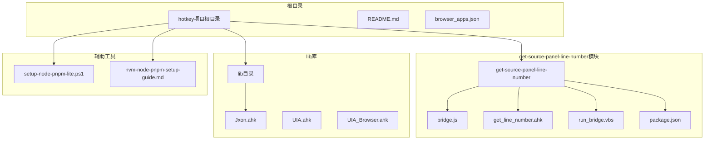
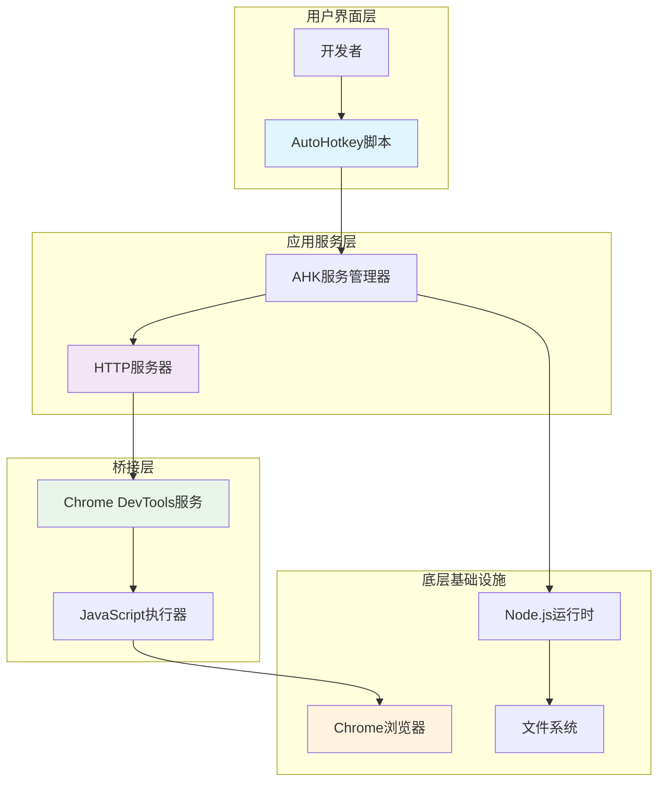
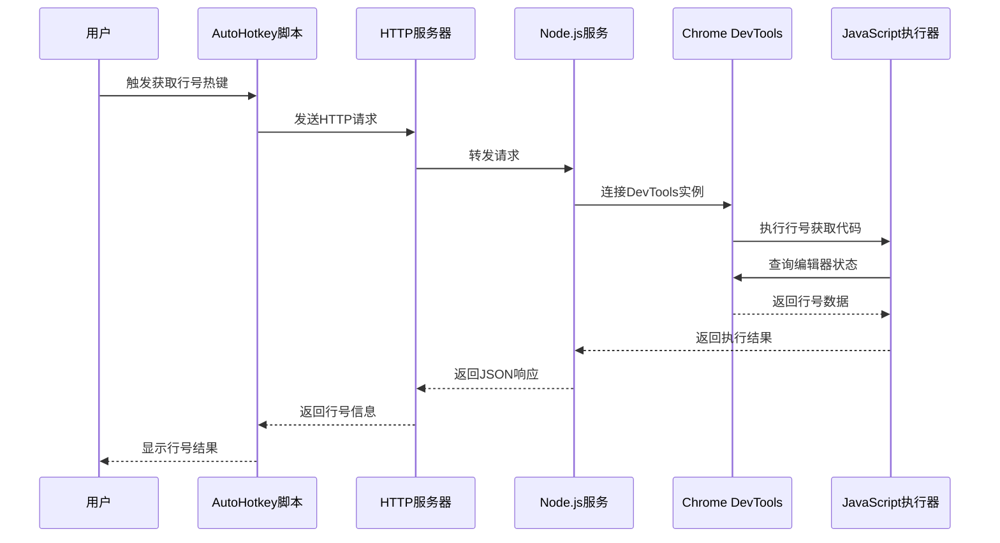
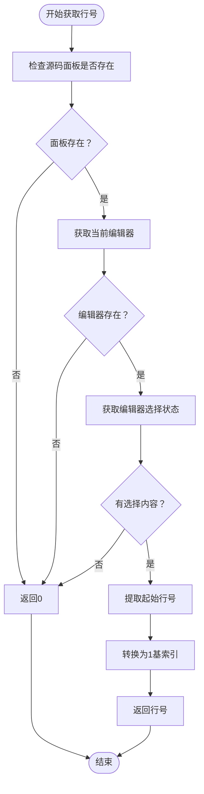
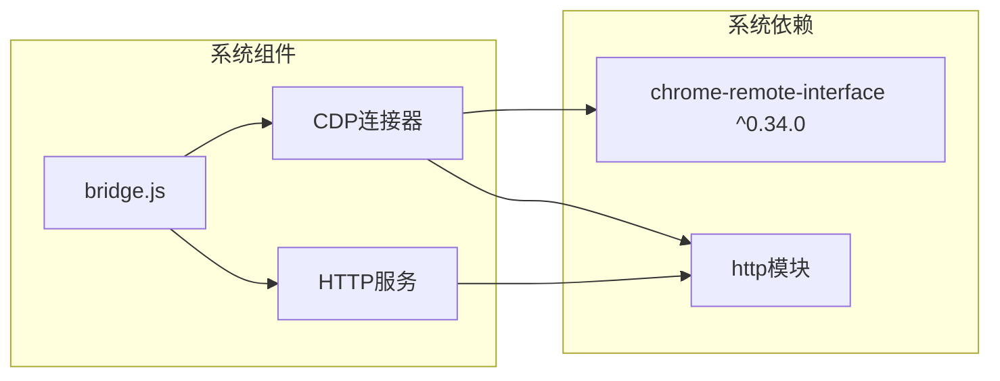
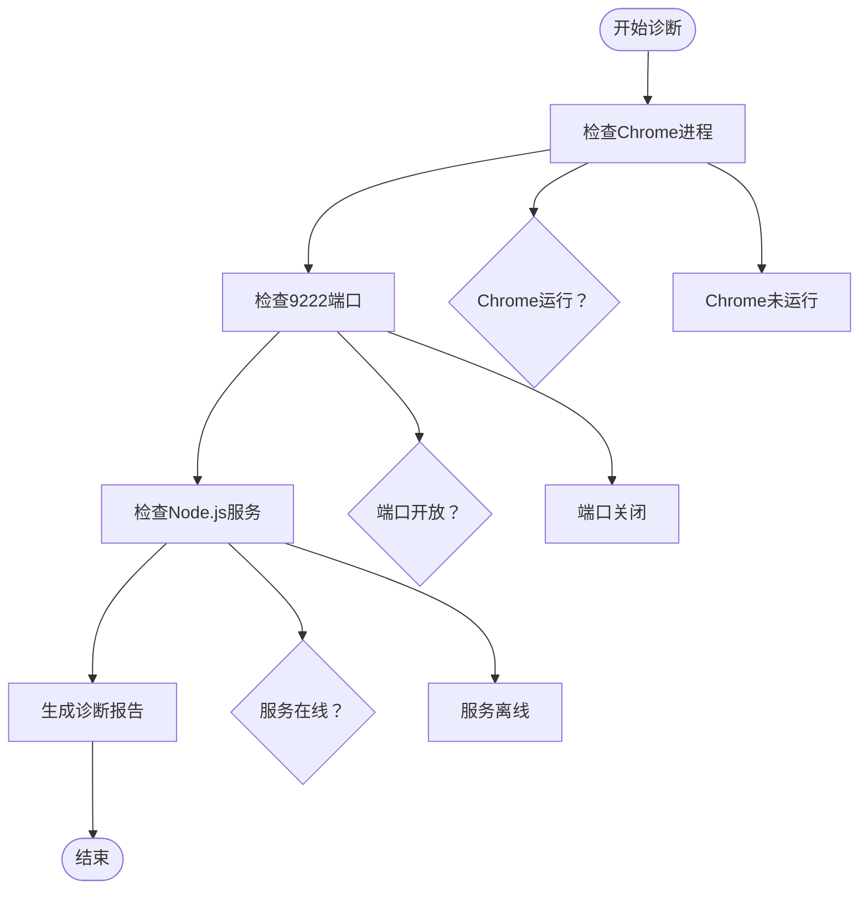

# Node.js桥接工具

<cite>
**本文档引用的文件**
- [bridge.js](file://get-source-panel-line-number/bridge.js)
- [get_line_number.ahk](file://get-source-panel-line-number/get_line_number.ahk)
- [run_bridge.vbs](file://get-source-panel-line-number/run_bridge.vbs)
- [package.json](file://get-source-panel-line-number/package.json)
- [nvm-node-pnpm-setup-guide.md](file://nvm-node-pnpm-setup-guide.md)
- [setup-node-pnpm-lite.ps1](file://setup-node-pnpm-lite.ps1)
- [Jxon.ahk](file://lib/Jxon.ahk)
- [browser_apps.json](file://browser_apps.json)
- [README.md](file://README.md)
</cite>

## 目录
1. [简介](#简介)
2. [项目结构](#项目结构)
3. [核心组件](#核心组件)
4. [架构概览](#架构概览)
5. [详细组件分析](#详细组件分析)
6. [依赖分析](#依赖分析)
7. [性能考虑](#性能考虑)
8. [故障排除指南](#故障排除指南)
9. [结论](#结论)
10. [附录](#附录)

## 简介

Node.js桥接工具是一个基于AutoHotkey v2和Node.js的跨平台开发辅助工具，专门用于从Chrome DevTools源码面板获取当前编辑器的行号信息。该工具通过Chrome远程接口(chrome-remote-interface)实现与Chrome DevTools的深度集成，为开发者提供了一个便捷的方式来获取源码面板中的当前行号。

该系统的核心价值在于：
- **无缝集成**：通过HTTP API提供统一的接口，支持多种编程语言调用
- **实时同步**：直接从DevTools内部上下文获取最新行号信息
- **自动化支持**：可作为AutoHotkey热键绑定的一部分，实现一键获取行号
- **跨平台兼容**：支持Windows平台下的各种浏览器和开发环境

## 项目结构

该项目采用模块化设计，主要包含以下核心目录和文件：



**图表来源**
- [bridge.js:1-51](file://get-source-panel-line-number/bridge.js#L1-L51)
- [get_line_number.ahk:1-148](file://get-source-panel-line-number/get_line_number.ahk#L1-L148)
- [package.json:1-6](file://get-source-panel-line-number/package.json#L1-L6)

**章节来源**
- [README.md:1-2](file://README.md#L1-L2)
- [browser_apps.json:1-48](file://browser_apps.json#L1-L48)

## 核心组件

### Node.js桥接服务 (bridge.js)

Node.js桥接服务是整个系统的核心组件，负责与Chrome DevTools进行直接通信。该服务的主要职责包括：

1. **Chrome目标发现**：自动扫描系统中所有Chrome相关的调试目标
2. **DevTools连接管理**：建立与DevTools实例的安全连接
3. **JavaScript执行**：在DevTools内部上下文中执行特定的JavaScript代码
4. **HTTP服务暴露**：提供RESTful API接口供外部调用

### AutoHotkey控制脚本 (get_line_number.ahk)

AutoHotkey脚本提供了用户友好的交互界面和自动化功能：

1. **环境初始化**：自动检测和启动Chrome调试模式
2. **服务管理**：监控和管理Node.js桥接服务的状态
3. **热键绑定**：提供快捷键操作，支持一键获取行号
4. **诊断工具**：内置完整的系统健康检查功能

### VBS启动器 (run_bridge.vbs)

轻量级的VBS启动器用于简化Node.js服务的启动过程，提供无窗口启动能力。

**章节来源**
- [bridge.js:1-51](file://get-source-panel-line-number/bridge.js#L1-L51)
- [get_line_number.ahk:1-148](file://get-source-panel-line-number/get_line_number.ahk#L1-L148)
- [run_bridge.vbs:1-2](file://get-source-panel-line-number/run_bridge.vbs#L1-L2)

## 架构概览

该系统采用分层架构设计，实现了清晰的职责分离和松耦合的组件关系：



**图表来源**
- [bridge.js:8-40](file://get-source-panel-line-number/bridge.js#L8-L40)
- [get_line_number.ahk:15-66](file://get-source-panel-line-number/get_line_number.ahk#L15-L66)

## 详细组件分析

### Chrome远程接口集成

系统使用chrome-remote-interface库实现与Chrome DevTools的深度集成。该库提供了以下关键功能：

#### 目标发现机制
系统通过`CDP.List()`方法获取所有可用的调试目标，然后筛选出类型为'devtools'的目标。这种机制确保了即使Chrome实例有多个标签页或窗口，也能正确识别DevTools实例。

#### 连接管理
建立与DevTools实例的连接需要处理以下复杂情况：
- 异步连接建立过程
- 连接超时和错误处理
- 连接资源的正确释放

#### JavaScript执行框架
系统在DevTools内部上下文中执行特定的JavaScript代码来获取行号信息。这涉及到：
- DevTools内部API的调用
- DOM元素状态的查询
- 数据结果的提取和转换

### JavaScript桥接机制

JavaScript桥接机制是整个系统的技术核心，其实现细节如下：



**图表来源**
- [bridge.js:8-40](file://get-source-panel-line-number/bridge.js#L8-L40)
- [get_line_number.ahk:71-86](file://get-source-panel-line-number/get_line_number.ahk#L71-L86)

### 数据交换格式

系统采用标准化的JSON格式进行数据交换，确保了跨平台的兼容性和易用性：

#### 请求格式
HTTP GET请求到`/line-number`端点，无需额外的请求头或参数。

#### 响应格式
标准的JSON响应包含以下字段：
- `lineNumber`: 当前源码面板的行号（数字类型）
- `error`: 错误信息（字符串类型，仅在发生错误时存在）

#### 错误处理策略
系统实现了多层次的错误处理机制：
- DevTools未找到：返回明确的错误信息
- JavaScript执行失败：捕获并返回异常详情
- 网络连接问题：提供超时和连接失败的反馈

### AutoHotkey与Node.js通信协议

AutoHotkey与Node.js之间的通信基于标准的HTTP协议，具有以下特点：

#### 协议规范
- **传输层**：HTTP/1.1
- **编码格式**：UTF-8
- **内容类型**：application/json
- **端口约定**：默认使用3000端口

#### 消息传递机制
1. **请求阶段**：AutoHotkey发起HTTP GET请求
2. **处理阶段**：Node.js服务接收并处理请求
3. **响应阶段**：Node.js返回JSON格式的响应
4. **解析阶段**：AutoHotkey解析响应并提取行号信息

#### 超时和重试机制
系统实现了智能的超时处理：
- 请求超时时间：1秒
- 自动重试机制：在某些情况下提供重试机会
- 错误恢复：网络问题时提供清晰的错误提示

### 源码面板行号获取功能实现

源码面板行号获取功能是该工具的核心特性，其实现原理如下：

#### DevTools内部API利用
系统通过DevTools暴露的内部API获取当前编辑器的状态信息。具体实现包括：
- 访问`UI.panels.sources`对象
- 获取当前活动的源码视图
- 查询编辑器的选择状态
- 提取起始行号并转换为1基索引

#### 行号计算逻辑


**图表来源**
- [bridge.js:22-31](file://get-source-panel-line-number/bridge.js#L22-L31)

#### 热键绑定和用户体验
系统提供了完善的热键绑定机制：
- 主要热键：Ctrl+Alt+L
- 环境初始化：F10
- 强制重启：Shift+F10
- 系统诊断：Ctrl+F12

### VBS脚本执行流程

VBS脚本虽然简单，但在系统启动过程中发挥着重要作用：

#### 启动流程
1. **进程启动**：通过WScript Shell启动Node.js进程
2. **无窗口模式**：设置窗口显示模式为隐藏
3. **异步执行**：不等待进程结束，允许后台运行

#### 配置选项
- **工作目录**：使用脚本所在目录
- **窗口模式**：0表示隐藏窗口
- **等待标志**：False表示非阻塞启动

**章节来源**
- [bridge.js:1-51](file://get-source-panel-line-number/bridge.js#L1-L51)
- [get_line_number.ahk:1-148](file://get-source-panel-line-number/get_line_number.ahk#L1-L148)
- [run_bridge.vbs:1-2](file://get-source-panel-line-number/run_bridge.vbs#L1-L2)

## 依赖分析

### Node.js依赖关系

系统对Node.js生态系统的依赖相对简洁，主要依赖于chrome-remote-interface库：



**图表来源**
- [package.json:1-6](file://get-source-panel-line-number/package.json#L1-L6)
- [bridge.js:1-3](file://get-source-panel-line-number/bridge.js#L1-L3)

### AutoHotkey依赖关系

AutoHotkey脚本依赖于系统提供的COM组件和标准功能：

#### COM组件依赖
- **WinHttp.WinHttpRequest.5.1**：用于HTTP通信
- **WScript.Shell**：用于进程管理和VBS脚本执行

#### 系统功能依赖
- **Process类**：用于进程状态检查
- **File类**：用于文件操作
- **RegEx**：用于正则表达式匹配

### 环境配置依赖

系统对运行环境有以下要求：

#### Node.js环境
- **版本要求**：Node.js 14.x及以上版本
- **包管理器**：npm或pnpm
- **权限要求**：需要访问Chrome调试端口

#### Windows环境
- **操作系统**：Windows 7/8/10/11
- **浏览器支持**：Chrome 62+或同等版本的浏览器
- **网络权限**：需要本地网络访问权限

**章节来源**
- [package.json:1-6](file://get-source-panel-line-number/package.json#L1-L6)
- [get_line_number.ahk:15-66](file://get-source-panel-line-number/get_line_number.ahk#L15-L66)

## 性能考虑

### 内存使用优化

系统在内存使用方面采用了多项优化策略：

#### 连接池管理
- 及时关闭CDP连接，避免资源泄漏
- 使用finally块确保连接正确释放
- 最小化内存占用，避免长时间持有大对象

#### 响应时间优化
- HTTP服务器采用异步处理模型
- JavaScript执行在DevTools内部完成，减少数据传输
- 缓存机制避免重复的DevTools连接建立

### 并发处理能力

系统支持多客户端并发访问，具备良好的扩展性：

#### 并发模型
- Node.js单线程事件循环模型
- 异步I/O操作避免阻塞
- 非阻塞的HTTP请求处理

#### 资源竞争处理
- Chrome DevTools API的线程安全保证
- 内存中的状态隔离
- 文件系统访问的串行化

### 网络性能优化

#### 连接复用
- HTTP连接的合理复用
- 减少TCP连接建立开销
- 优化HTTP头部信息

#### 数据传输优化
- JSON响应的最小化
- 二进制数据的避免
- 压缩传输的考虑

## 故障排除指南

### 常见问题及解决方案

#### Chrome调试端口问题

**症状**：系统无法连接到Chrome调试端口
**原因分析**：
- Chrome未以调试模式启动
- 调试端口已被占用
- 权限不足访问端口

**解决步骤**：
1. 检查Chrome进程是否以`--remote-debugging-port`参数启动
2. 验证端口9222的可用性
3. 以管理员权限运行脚本
4. 关闭可能占用端口的其他程序

#### Node.js服务启动失败

**症状**：Node.js桥接服务无法启动
**原因分析**：
- Node.js环境未正确安装
- 依赖包安装失败
- 权限问题

**解决步骤**：
1. 验证Node.js版本兼容性
2. 检查package.json依赖安装
3. 确认文件路径的正确性
4. 查看详细的错误日志

#### DevTools连接失败

**症状**：无法连接到DevTools实例
**原因分析**：
- DevTools窗口未正确打开
- CDP协议版本不兼容
- 浏览器版本过旧

**解决步骤**：
1. 确保Chrome DevTools已打开
2. 检查Chrome版本兼容性
3. 更新chrome-remote-interface库
4. 重启Chrome实例

### 诊断工具使用

系统内置了完整的诊断工具，帮助用户快速定位问题：

#### 系统状态检查


**图表来源**
- [get_line_number.ahk:121-148](file://get-source-panel-line-number/get_line_number.ahk#L121-L148)

#### 环境配置验证

系统提供了完整的环境配置验证流程：

1. **Node.js环境验证**：检查版本和依赖
2. **Chrome环境验证**：检查调试端口和权限
3. **网络环境验证**：检查本地网络连通性
4. **文件系统验证**：检查脚本文件的可访问性

### 日志记录和监控

系统实现了多层次的日志记录机制：

#### 错误日志
- 详细的错误堆栈信息
- 时间戳记录
- 操作上下文信息

#### 性能日志
- 响应时间统计
- 资源使用情况
- 并发访问监控

#### 用户操作日志
- 热键触发记录
- 功能使用统计
- 错误发生频率

**章节来源**
- [get_line_number.ahk:121-148](file://get-source-panel-line-number/get_line_number.ahk#L121-L148)
- [nvm-node-pnpm-setup-guide.md:1-160](file://nvm-node-pnpm-setup-guide.md#L1-L160)

## 结论

Node.js桥接工具是一个精心设计的跨平台开发辅助系统，成功地解决了从Chrome DevTools获取源码面板行号这一复杂的技术挑战。该系统的主要优势包括：

### 技术创新性
- **深度集成**：直接利用DevTools内部API，避免了传统方法的局限性
- **实时性**：提供毫秒级的行号获取能力
- **可靠性**：完善的错误处理和恢复机制

### 用户体验优化
- **简单易用**：通过热键绑定提供一键式操作
- **可视化反馈**：实时显示获取结果
- **智能诊断**：内置完整的故障排除工具

### 扩展性设计
- **模块化架构**：清晰的职责分离便于维护和扩展
- **标准化接口**：HTTP API便于第三方集成
- **跨平台兼容**：基于Web技术栈的天然跨平台特性

该工具不仅解决了具体的开发需求，更重要的是展示了一种将现代Web技术与传统桌面应用相结合的有效模式，为类似的技术集成项目提供了宝贵的参考经验。

## 附录

### 安装和配置指南

#### 环境准备
1. **Node.js安装**：确保系统已安装Node.js 14.x或更高版本
2. **Chrome配置**：确保Chrome浏览器已正确安装
3. **权限设置**：确保脚本有足够的系统权限

#### 依赖安装
```bash
# 进入项目目录
cd get-source-panel-line-number

# 安装依赖
npm install

# 验证安装
npm list chrome-remote-interface
```

#### 环境变量配置
系统支持以下环境变量：
- `CHROME_PATH`：Chrome可执行文件路径
- `REMOTE_PORT`：Chrome调试端口号
- `BRIDGE_URL`：Node.js服务URL
- `NODE_SCRIPT`：Node.js脚本路径

### 使用示例

#### 基本使用流程
1. **启动Chrome**：确保Chrome以调试模式运行
2. **启动服务**：运行AutoHotkey脚本
3. **打开DevTools**：在Chrome中打开源码面板
4. **获取行号**：按下Ctrl+Alt+L热键

#### 高级使用场景
- **批量操作**：结合其他AutoHotkey功能实现批量代码导航
- **集成开发**：与其他IDE或编辑器集成
- **自动化测试**：在自动化测试中获取代码位置信息

### 维护和更新

#### 版本兼容性
- **Chrome版本**：支持Chrome 62及以上版本
- **Node.js版本**：支持Node.js 14.x及以上版本
- **AutoHotkey版本**：支持AutoHotkey v2.0及以上版本

#### 安全考虑
- **权限控制**：限制对系统资源的访问
- **输入验证**：对所有外部输入进行验证
- **错误隔离**：防止单点故障影响整体系统