# Node.js桥接工具

<cite>
**本文档引用的文件**
- [bridge.js](file://get-source-panel-line-number/bridge.js)
- [get_line_number.ahk](file://get-source-panel-line-number/get_line_number.ahk)
- [run_bridge.vbs](file://get-source-panel-line-number/run_bridge.vbs)
- [package.json](file://get-source-panel-line-number/package.json)
- [run_bridge.ps1](file://run_bridge.ps1)
- [nvm-node-pnpm-setup-guide.md](file://nvm-node-pnpm-setup-guide.md)
- [setup-node-pnpm-lite.ps1](file://setup-node-pnpm-lite.ps1)
- [Jxon.ahk](file://lib/Jxon.ahk)
- [browser_apps.json](file://browser_apps.json)
- [README.md](file://README.md)
- [UIA.ahk](file://lib/UIA.ahk)
- [UIA_Browser.ahk](file://lib/UIA_Browser.ahk)
- [host.js](file://devtools-vscode-opener/native-host/host.js)
- [background.js](file://devtools-vscode-opener/background.js)
- [devtools.js](file://devtools-vscode-opener/devtools.js)
- [manifest.json](file://devtools-vscode-opener/manifest.json)
- [install-native-host.ps1](file://devtools-vscode-opener/native-host/install-native-host.ps1)
- [test-send.js](file://devtools-vscode-opener/native-host/test-send.js)
- [test-send-installed.js](file://devtools-vscode-opener/native-host/test-send-installed.js)
</cite>

## 更新摘要
**变更内容**
- 重大架构重构：从多步骤PowerShell流程改为单个C#解决方案
- 集成虚拟桌面管理和键盘模拟功能
- 新增虚拟桌面管理器(VirtualDesktopManager)和键盘事件处理
- 增强的窗口管理和前台激活机制
- 集成的VS Code打开器功能
- 改进的窗口枚举和匹配算法
- **新增**：IDE工作区发现系统，显著提升文件定位准确性
- **新增**：增强的文件路径解析算法，支持多层级项目结构
- **新增**：改进的IDE激活策略，支持工作区优先级
- **新增**：调试日志功能，提供详细的系统操作记录

## 目录
1. [简介](#简介)
2. [项目结构](#项目结构)
3. [核心组件](#核心组件)
4. [架构概览](#架构概览)
5. [详细组件分析](#详细组件分析)
6. [依赖分析](#依赖分析)
7. [性能考虑](#性能考虑)
8. [故障排除指南](#故障排除指南)
9. [结论](#结论)
10. [附录](#附录)

## 简介

Node.js桥接工具是一个基于AutoHotkey v2和Node.js的跨平台开发辅助工具，专门用于从Chrome DevTools源码面板获取当前编辑器的行号信息。**更新**：该系统现已重构为集成化的C#解决方案，集成了虚拟桌面管理和键盘模拟功能，提供更强大的系统级窗口管理和自动化能力。

该工具通过Chrome远程接口(chrome-remote-interface)实现与Chrome DevTools的深度集成，为开发者提供了一个便捷的方式来获取源码面板中的当前行号、列号和文件URL信息。**更新**：现在还支持虚拟桌面切换、窗口焦点管理和键盘事件模拟等高级功能。

**更新**：新增的IDE工作区发现系统能够智能识别当前桌面上已打开的IDE项目，通过PowerShell + VDM技术获取工作区目录，确保文件搜索优先在已打开的项目中进行，显著提升了文件定位的准确性和速度。

该系统的核心价值在于：
- **无缝集成**：通过HTTP API提供统一的接口，支持多种编程语言调用
- **实时同步**：直接从DevTools内部上下文获取最新行号、列号和文件URL信息
- **自动化支持**：可作为AutoHotkey热键绑定的一部分，实现一键获取多维代码位置信息
- **跨平台兼容**：支持Windows平台下的各种浏览器和开发环境
- **智能健康检查**：内置端口探测和进程状态监控功能
- **增强诊断功能**：提供完整的系统链路状态检查和故障排除工具
- **多字段返回值**：支持同时获取行号、列号和文件URL的完整代码位置信息
- **智能缓存机制**：提供lastResult缓存和连续失败跟踪，增强系统稳定性
- **自动恢复功能**：在多次失败后自动重启，确保服务可用性
- **虚拟桌面管理**：支持Windows虚拟桌面的窗口管理和切换
- **键盘事件模拟**：提供精确的键盘按键事件模拟功能
- **窗口管理增强**：改进的窗口枚举、匹配和前台激活机制
- **IDE工作区发现**：智能识别和利用已打开的IDE项目工作区
- **增强文件解析**：支持复杂的文件路径解析和项目根目录查找
- **调试日志系统**：提供详细的系统操作记录和故障诊断信息

## 项目结构

该项目采用模块化设计，主要包含以下核心目录和文件：

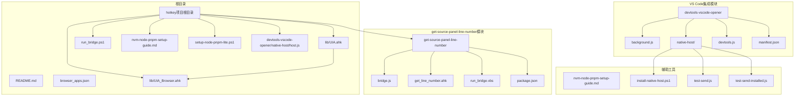
```mermaid
graph TB
subgraph "根目录"
Root[hotkey项目根目录]
README[README.md]
Config[browser_apps.json]
UIA[lib/UIA.ahk]
UIABrowser[lib/UIA_Browser.ahk]
RunBridgePS[run_bridge.ps1]
NVMGuide[nvm-node-pnpm-setup-guide.md]
Setup[setup-node-pnpm-lite.ps1]
HostJS[devtools-vscode-opener/native-host/host.js]
end
subgraph "get-source-panel-line-number模块"
Module[get-source-panel-line-number]
BridgeJS[bridge.js]
AHKScript[get_line_number.ahk]
VBSRun[run_bridge.vbs]
PackageJSON[package.json]
end
subgraph "VS Code集成模块"
VSCode[devtools-vscode-opener]
Background[background.js]
NativeHost[native-host/]
DevtoolsJS[devtools.js]
Manifest[manifest.json]
end
subgraph "辅助工具"
Setup[setup-node-pnpm-lite.ps1]
Guide[nvm-node-pnpm-setup-guide.md]
InstallScript[install-native-host.ps1]
TestScript[test-send.js]
TestInstalled[test-send-installed.js]
end
Root --> Module
Root --> UIA
Root --> UIABrowser
Root --> RunBridgePS
Root --> NVMGuide
Root --> Setup
Root --> HostJS
Module --> BridgeJS
Module --> AHKScript
Module --> VBSRun
Module --> PackageJSON
UIA --> UIABrowser
VSCode --> Background
VSCode --> NativeHost
VSCode --> DevtoolsJS
VSCode --> Manifest
NativeHost --> InstallScript
NativeHost --> TestScript
NativeHost --> TestInstalled
```

**图表来源**
- [bridge.js:1-142](file://get-source-panel-line-number/bridge.js#L1-L142)
- [get_line_number.ahk:1-159](file://get-source-panel-line-number/get_line_number.ahk#L1-L159)
- [package.json:1-6](file://get-source-panel-line-number/package.json#L1-L6)
- [run_bridge.ps1:1-26](file://run_bridge.ps1#L1-L26)
- [host.js:87-127](file://devtools-vscode-opener/native-host/host.js#L87-L127)
- [background.js:1-95](file://devtools-vscode-opener/background.js#L1-L95)
- [devtools.js:1-151](file://devtools-vscode-opener/devtools.js#L1-L151)
- [manifest.json:1-32](file://devtools-vscode-opener/manifest.json#L1-L32)

**章节来源**
- [README.md:1-2](file://README.md#L1-L2)
- [browser_apps.json:1-48](file://browser_apps.json#L1-L48)

## 核心组件

### Node.js桥接服务 (bridge.js)

Node.js桥接服务是整个系统的核心组件，负责与Chrome DevTools进行直接通信。**更新**：该服务现在作为C#集成解决方案的一部分，提供基础的DevTools连接和数据获取功能。

1. **Chrome目标发现**：自动扫描系统中所有Chrome相关的调试目标
2. **DevTools连接管理**：建立与DevTools实例的安全连接
3. **JavaScript执行**：在DevTools内部上下文中执行特定的JavaScript代码
4. **HTTP服务暴露**：提供RESTful API接口供外部调用
5. **端口探测和健康检查**：内置智能的端口占用检测和进程状态监控
6. **错误处理和恢复**：提供多层次的错误处理和自动恢复机制
7. **多字段数据提取**：从DevTools内部获取行号、列号和文件URL信息
8. **智能缓存管理**：维护lastResult缓存和连续失败计数
9. **自动恢复机制**：在多次失败后自动重启服务
10. **响应格式增强**：支持_cached和_restarting标记的响应格式

### C#虚拟桌面管理器 (host.js)

**新增组件**：基于C#的虚拟桌面管理器，提供系统级窗口管理和键盘事件模拟功能。

**更新**：新增了74行代码，包括IDE工作区发现系统、增强的文件路径解析算法、改进的IDE激活策略和调试日志功能。

#### IDE工作区发现系统
- **PowerShell集成**：通过PowerShell命令获取当前桌面上IDE进程的工作区目录
- **命令行解析**：从进程命令行参数中提取工作区路径，支持引号和未引号路径
- **工作区过滤**：跳过可执行文件路径，仅保留有效的工作区目录
- **去重处理**：使用Set确保工作区目录的唯一性

#### 增强的文件路径解析算法
- **工作区优先级**：优先在IDE工作区目录中搜索文件
- **子目录支持**：在工作区内搜索一级子目录以提高匹配率
- **候选目录搜索**：在常见项目目录中进行广度优先搜索
- **平台适配**：支持Windows磁盘驱动器的全盘搜索

#### 改进的IDE激活策略
- **虚拟桌面集成**：通过IVirtualDesktopManager确保IDE在当前虚拟桌面
- **窗口匹配优化**：支持项目名称匹配和窗口可见性检查
- **前台激活增强**：智能的窗口前台激活和焦点管理
- **键盘事件模拟**：精确的键盘按键事件模拟，支持组合键

#### 调试日志功能
- **详细操作记录**：记录虚拟桌面管理、窗口查找、键盘模拟等操作
- **错误信息收集**：收集COM接口调用、进程枚举、窗口操作等错误信息
- **性能监控**：记录操作耗时和成功率统计
- **临时文件管理**：自动生成调试日志文件并进行清理

### AutoHotkey控制脚本 (get_line_number.ahk)

AutoHotkey脚本提供了用户友好的交互界面和自动化功能：

1. **环境初始化**：自动检测和启动Chrome调试模式
2. **服务管理**：监控和管理Node.js桥接服务的状态
3. **热键绑定**：提供快捷键操作，支持一键获取多字段代码位置信息
4. **诊断工具**：内置完整的系统健康检查功能
5. **智能多字段解析**：提供正则表达式解析和错误处理，支持行号、列号和文件URL
6. **超时和重试机制**：实现智能的超时处理和自动重试
7. **增强的错误状态**：支持"Bridge Offline"、"Not in Source Panel"等详细错误状态
8. **响应格式解析**：支持_cached和_restarting标记的响应格式

### VBS启动器 (run_bridge.vbs)

轻量级的VBS启动器用于简化Node.js服务的启动过程，提供无窗口启动能力。

### PowerShell启动器 (run_bridge.ps1)

现代化的PowerShell启动器提供更强大的服务管理和健康检查功能：

1. **健康检查集成**：自动检查现有服务的健康状态
2. **智能启动逻辑**：避免重复启动已运行的服务
3. **错误处理**：提供详细的错误信息和诊断
4. **跨平台兼容**：支持不同环境下的Node.js执行

### UIA浏览器自动化 (UIA_Browser.ahk)

基于Microsoft UI Automation框架的浏览器自动化库，提供：
- 跨浏览器的UI元素定位和操作
- 浏览器窗口和标签页的自动化控制
- JavaScript执行和页面交互功能
- 增强的菜单交互和导航能力

### VS Code集成模块

**更新**：新增了完整的VS Code集成模块，包括背景脚本、DevTools脚本和清单文件。

#### 背景脚本 (background.js)
- **原生主机通信**：管理Chrome扩展与原生主机的通信
- **端口生命周期**：维护DevTools端口连接和心跳机制
- **IDE启动器**：通过原生主机启动VS Code或Qoder
- **超时处理**：10秒超时机制确保通信可靠性

#### DevTools脚本 (devtools.js)
- **桥接服务管理**：确保Node.js桥接服务的可用性
- **URL路径转换**：将浏览器URL转换为可打开的文件路径
- **状态跟踪**：维护最后选中的资源和光标位置
- **IDE集成**：与VS Code/Qoder打开器功能集成

#### 清单文件 (manifest.json)
- **扩展配置**：定义Chrome扩展的基本信息和权限
- **命令映射**：配置快捷键和命令描述
- **权限声明**：声明tabs和nativeMessaging权限
- **服务工作者**：指定后台脚本的位置

### 原生主机安装脚本

**新增组件**：提供原生主机的安装和配置功能。

#### 安装脚本 (install-native-host.ps1)
- **自动检测Node.js**：自动查找系统中的Node.js可执行文件
- **目录创建**：创建TDuckVSCodeNativeHost安装目录
- **文件复制**：复制host.js到安装目录
- **CMD包装器**：生成host.cmd批处理文件
- **清单生成**：创建Chrome原生消息清单文件
- **注册表配置**：配置Chrome和Edge的原生主机注册

#### 测试脚本
- **test-send.js**：测试本地host.js的原生消息通信
- **test-send-installed.js**：测试已安装原生主机的消息通信

**章节来源**
- [bridge.js:1-142](file://get-source-panel-line-number/bridge.js#L1-L142)
- [get_line_number.ahk:1-159](file://get-source-panel-line-number/get_line_number.ahk#L1-L159)
- [run_bridge.vbs:1-2](file://get-source-panel-line-number/run_bridge.vbs#L1-L2)
- [run_bridge.ps1:1-26](file://run_bridge.ps1#L1-L26)
- [UIA_Browser.ahk:1-800](file://lib/UIA_Browser.ahk#L1-L800)
- [host.js:87-127](file://devtools-vscode-opener/native-host/host.js#L87-L127)
- [background.js:1-95](file://devtools-vscode-opener/background.js#L1-L95)
- [devtools.js:1-151](file://devtools-vscode-opener/devtools.js#L1-L151)
- [manifest.json:1-32](file://devtools-vscode-opener/manifest.json#L1-L32)
- [install-native-host.ps1:1-58](file://devtools-vscode-opener/native-host/install-native-host.ps1#L1-L58)

## 架构概览

**更新**：系统现已重构为集成化的C#解决方案，实现了更紧密的组件协作和更强大的系统级功能。

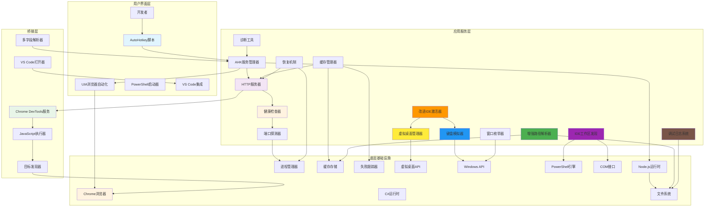
```mermaid
graph TB
subgraph "用户界面层"
AHK[AutoHotkey脚本]
User[开发者]
UIA[UIA浏览器自动化]
PS[PowerShell启动器]
VSCode[VS Code集成]
end
subgraph "应用服务层"
AHKService[AHK服务管理器]
HTTPServer[HTTP服务器]
HealthChecker[健康检查器]
PortProbe[端口探测器]
Diagnostic[诊断工具]
CacheManager[缓存管理器]
RecoveryMechanism[恢复机制]
VirtualDesktopManager[虚拟桌面管理器]
KeyboardSimulator[键盘模拟器]
WindowEnumerator[窗口枚举器]
IDEWorkspaceDiscovery[IDE工作区发现]
EnhancedPathResolver[增强路径解析器]
ImprovedIDEActivator[改进IDE激活器]
DebugLogger[调试日志系统]
end
subgraph "桥接层"
CDPServer[Chrome DevTools服务]
JSEvaluator[JavaScript执行器]
TargetFinder[目标发现器]
MultiFieldParser[多字段解析器]
VSCodeOpener[VS Code打开器]
end
subgraph "底层基础设施"
Chrome[Chrome浏览器]
NodeJS[Node.js运行时]
CSharpRuntime[C#运行时]
FileSystem[文件系统]
ProcessManager[进程管理器]
CacheStorage[缓存存储]
FailureTracker[失败跟踪器]
VirtualDesktop[虚拟桌面API]
WindowsAPI[Windows API]
PowerShell[PowerShell引擎]
COMInterface[COM接口]
end
User --> AHK
AHK --> AHKService
AHKService --> HTTPServer
HTTPServer --> HealthChecker
HealthChecker --> PortProbe
PortProbe --> ProcessManager
AHKService --> UIA
UIA --> Chrome
HTTPServer --> CDPServer
CDPServer --> JSEvaluator
JSEvaluator --> TargetFinder
TargetFinder --> Chrome
AHKService --> NodeJS
NodeJS --> FileSystem
MultiFieldParser --> AHKService
Diagnostic --> AHKService
CacheManager --> CacheStorage
CacheManager --> FailureTracker
RecoveryMechanism --> ProcessManager
CacheManager --> HTTPServer
RecoveryMechanism --> HTTPServer
VirtualDesktopManager --> VirtualDesktop
KeyboardSimulator --> WindowsAPI
WindowEnumerator --> WindowsAPI
IDEWorkspaceDiscovery --> PowerShell
IDEWorkspaceDiscovery --> COMInterface
EnhancedPathResolver --> FileSystem
EnhancedPathResolver --> CacheStorage
ImprovedIDEActivator --> VirtualDesktopManager
ImprovedIDEActivator --> KeyboardSimulator
DebugLogger --> FileSystem
VSCodeOpener --> VSCode
style AHK fill:#e1f5fe
style HTTPServer fill:#f3e5f5
style CDPServer fill:#e8f5e8
style Chrome fill:#fff3e0
style HealthChecker fill:#fff3e0
style VirtualDesktopManager fill:#ffeb3b
style KeyboardSimulator fill:#2196f3
style IDEWorkspaceDiscovery fill:#9c27b0
style EnhancedPathResolver fill:#4caf50
style ImprovedIDEActivator fill:#ff9800
style DebugLogger fill:#795548
```

**图表来源**
- [bridge.js:67-81](file://get-source-panel-line-number/bridge.js#L67-L81)
- [get_line_number.ahk:15-66](file://get-source-panel-line-number/get_line_number.ahk#L15-L66)
- [host.js:87-127](file://devtools-vscode-opener/native-host/host.js#L87-L127)
- [host.js:9-49](file://devtools-vscode-opener/native-host/host.js#L9-L49)
- [host.js:53-112](file://devtools-vscode-opener/native-host/host.js#L53-L112)
- [host.js:127-218](file://devtools-vscode-opener/native-host/host.js#L127-L218)

## 详细组件分析

### C#虚拟桌面管理器

**新增功能**：系统集成了基于C#的虚拟桌面管理器，提供强大的系统级窗口管理和自动化能力。

#### IDE工作区发现系统

**新增功能**：通过PowerShell + VDM技术智能发现当前桌面上IDE的工作区目录。

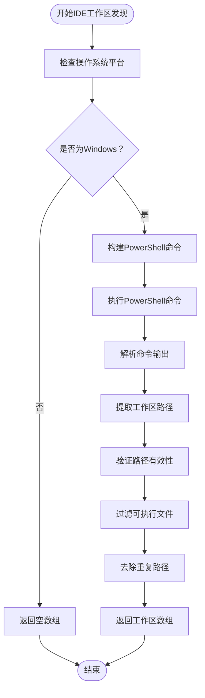
```mermaid
flowchart TD
Start([开始IDE工作区发现]) --> CheckPlatform["检查操作系统平台"]
CheckPlatform --> PlatformOK{"是否为Windows？"}
PlatformOK --> |否| ReturnEmpty["返回空数组"]
PlatformOK --> |是| BuildPowerShell["构建PowerShell命令"]
BuildPowerShell --> ExecutePowerShell["执行PowerShell命令"]
ExecutePowerShell --> ParseOutput["解析命令输出"]
ParseOutput --> ExtractPaths["提取工作区路径"]
ExtractPaths --> ValidatePaths["验证路径有效性"]
ValidatePaths --> FilterExecutables["过滤可执行文件"]
FilterExecutables --> RemoveDuplicates["去除重复路径"]
RemoveDuplicates --> ReturnWorkspaces["返回工作区数组"]
ReturnEmpty --> End([结束])
ReturnWorkspaces --> End
```

**图表来源**
- [host.js:13-49](file://devtools-vscode-opener/native-host/host.js#L13-L49)

#### 增强的文件路径解析算法

**新增功能**：实现了多层级的文件路径解析策略，显著提升文件定位准确性。

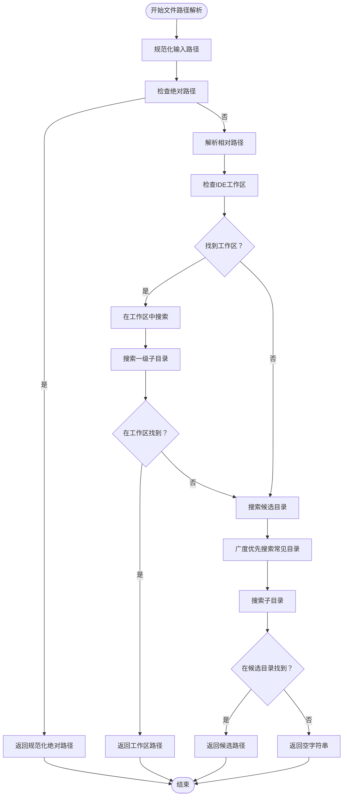
```mermaid
flowchart TD
Start([开始文件路径解析]) --> NormalizeInput["规范化输入路径"]
NormalizeInput --> CheckAbsolute["检查绝对路径"]
CheckAbsolute --> |是| ReturnAbsolute["返回规范化绝对路径"]
CheckAbsolute --> |否| ResolveRelative["解析相对路径"]
ResolveRelative --> CheckWorkspace["检查IDE工作区"]
CheckWorkspace --> WorkspaceFound{"找到工作区？"}
WorkspaceFound --> |是| SearchWorkspace["在工作区中搜索"]
SearchWorkspace --> SearchSubdirs["搜索一级子目录"]
SearchSubdirs --> FoundInWorkspace{"在工作区找到？"}
FoundInWorkspace --> |是| ReturnWorkspacePath["返回工作区路径"]
FoundInWorkspace --> |否| SearchCandidates["搜索候选目录"]
WorkspaceFound --> |否| SearchCandidates
SearchCandidates --> BFSCommonDirs["广度优先搜索常见目录"]
BFSCommonDirs --> SearchSubdirs2["搜索子目录"]
SearchSubdirs2 --> FoundInCandidates{"在候选目录找到？"}
FoundInCandidates --> |是| ReturnCandidatePath["返回候选路径"]
FoundInCandidates --> |否| ReturnEmpty["返回空字符串"]
ReturnAbsolute --> End([结束])
ReturnWorkspacePath --> End
ReturnCandidatePath --> End
ReturnEmpty --> End
```

**图表来源**
- [host.js:53-112](file://devtools-vscode-opener/native-host/host.js#L53-L112)

#### 改进的IDE激活策略

**新增功能**：集成了虚拟桌面管理、窗口匹配和键盘事件模拟的完整IDE激活流程。

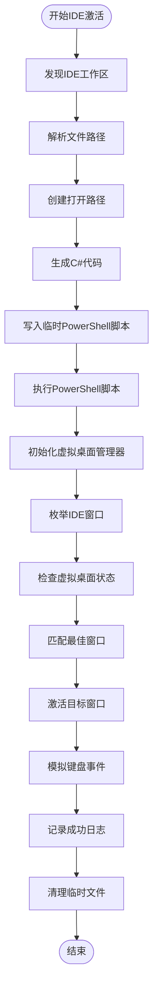
```mermaid
flowchart TD
Start([开始IDE激活]) --> FindWorkspace["发现IDE工作区"]
FindWorkspace --> ResolveFilePath["解析文件路径"]
ResolveFilePath --> CreateOpenPath["创建打开路径"]
CreateOpenPath --> GenerateCSharp["生成C#代码"]
GenerateCSharp --> WriteTempScript["写入临时PowerShell脚本"]
WriteTempScript --> ExecuteScript["执行PowerShell脚本"]
ExecuteScript --> VDMInit["初始化虚拟桌面管理器"]
VDMInit --> EnumerateWindows["枚举IDE窗口"]
EnumerateWindows --> CheckVirtualDesktop["检查虚拟桌面状态"]
CheckVirtualDesktop --> MatchWindow["匹配最佳窗口"]
MatchWindow --> ActivateWindow["激活目标窗口"]
ActivateWindow --> SimulateKeyboard["模拟键盘事件"]
SimulateKeyboard --> LogSuccess["记录成功日志"]
LogSuccess --> CleanupTemp["清理临时文件"]
CleanupTemp --> End([结束])
```

**图表来源**
- [host.js:127-218](file://devtools-vscode-opener/native-host/host.js#L127-L218)

#### 调试日志功能

**新增功能**：提供详细的系统操作记录和故障诊断能力。

- **操作日志**：记录虚拟桌面管理、窗口查找、键盘模拟等关键操作
- **错误收集**：收集COM接口调用、进程枚举、窗口操作等错误信息
- **性能监控**：记录操作耗时和成功率统计
- **临时文件**：自动生成ide-vdm-debug.log调试日志文件

#### 虚拟桌面管理接口
系统通过IVirtualDesktopManager接口实现虚拟桌面管理：
- **IsWindowOnCurrentVirtualDesktop**：检查窗口是否在当前虚拟桌面
- **GetWindowDesktopId**：获取窗口的虚拟桌面ID
- **COM接口集成**：通过P/Invoke调用Windows虚拟桌面API

#### 窗口枚举和匹配算法
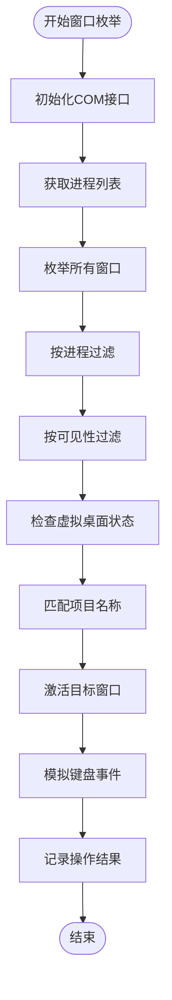
```mermaid
flowchart TD
Start([开始窗口枚举]) --> InitializeCOM["初始化COM接口"]
InitializeCOM --> GetProcesses["获取进程列表"]
GetProcesses --> EnumerateWindows["枚举所有窗口"]
EnumerateWindows --> FilterByProcess["按进程过滤"]
FilterByProcess --> FilterByVisibility["按可见性过滤"]
FilterByVisibility --> CheckVirtualDesktop["检查虚拟桌面状态"]
CheckVirtualDesktop --> MatchProject["匹配项目名称"]
MatchProject --> ActivateWindow["激活目标窗口"]
ActivateWindow --> SimulateKeys["模拟键盘事件"]
SimulateKeys --> LogResult["记录操作结果"]
LogResult --> End([结束])
```

**图表来源**
- [host.js:100-127](file://devtools-vscode-opener/native-host/host.js#L100-L127)

#### 键盘事件模拟
系统提供精确的键盘事件模拟功能：
- **KeyDown/KeyUp**：精确的按键按下和释放事件
- **组合键支持**：支持Ctrl、Alt、Shift等修饰键组合
- **字符输入**：支持字母、数字和特殊字符的输入
- **延迟控制**：可配置的按键间隔和延迟时间

#### 进程管理和窗口查找
- **进程名匹配**：基于进程名查找对应窗口
- **标题匹配**：支持项目名称的模糊匹配
- **窗口状态检查**：检查窗口的最小化、最大化状态
- **前台激活**：智能的窗口前台激活和焦点管理

### 智能缓存和自动恢复机制

**新增功能**：系统现在包含智能缓存和自动恢复机制，显著提升了系统的稳定性和用户体验。

#### 缓存管理器
系统维护两个关键的缓存状态：
- `lastResult`：保存最后一次成功的查询结果
- `consecutiveFailures`：跟踪连续失败的次数
- `MAX_FAILURES`：定义自动重启的阈值（默认为3次）

#### 缓存策略
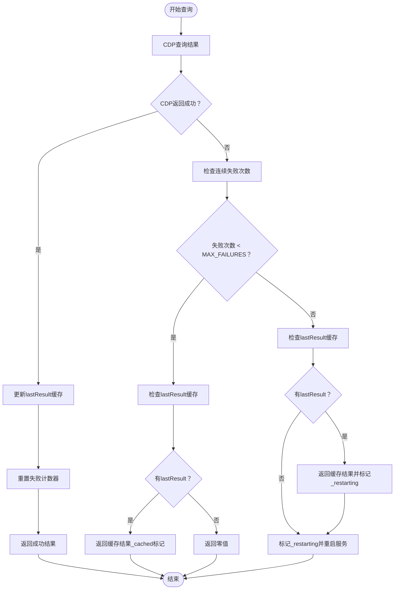
```mermaid
flowchart TD
Start([开始查询]) --> CheckCDP["CDP查询结果"]
CheckCDP --> Success{"CDP返回成功？"}
Success --> |是| UpdateCache["更新lastResult缓存"]
UpdateCache --> ResetCounter["重置失败计数器"]
ResetCounter --> ReturnSuccess["返回成功结果"]
Success --> |否| CheckFailures["检查连续失败次数"]
CheckFailures --> FailuresBelowMax{"失败次数 < MAX_FAILURES？"}
FailuresBelowMax --> |是| CheckLastResult["检查lastResult缓存"]
CheckLastResult --> HasLastResult{"有lastResult？"}
HasLastResult --> |是| ReturnCached["返回缓存结果_cached标记"]
HasLastResult --> |否| ReturnZero["返回零值"]
FailuresBelowMax --> |否| CheckLastResult2["检查lastResult缓存"]
CheckLastResult2 --> HasLastResult2{"有lastResult？"}
HasLastResult2 --> |是| ReturnFallback["返回缓存结果并标记_restarting"]
HasLastResult2 --> |否| RestartService["标记_restarting并重启服务"]
ReturnSuccess --> End([结束])
ReturnCached --> End
ReturnZero --> End
ReturnFallback --> RestartService
RestartService --> End
```

**图表来源**
- [bridge.js:7-10](file://get-source-panel-line-number/bridge.js#L7-L10)
- [bridge.js:88-99](file://get-source-panel-line-number/bridge.js#L88-L99)
- [bridge.js:101-105](file://get-source-panel-line-number/bridge.js#L101-L105)

#### 自动恢复机制
当连续失败达到阈值时，系统会自动执行以下恢复流程：
1. 标记响应为`_restarting: true`
2. 返回最近一次的成功结果
3. 在100毫秒后优雅地退出进程
4. 允许系统重新启动一个新的服务实例

### Chrome远程接口集成

系统使用chrome-remote-interface库实现与Chrome DevTools的深度集成。该库提供了以下关键功能：

#### 目标发现机制
系统通过`CDP.List()`方法获取所有可用的调试目标，然后筛选出类型为'devtools'的目标。这种机制确保了即使Chrome实例有多个标签页或窗口，也能正确识别DevTools实例。

#### 连接管理
建立与DevTools实例的连接需要处理以下复杂情况：
- 异步连接建立过程
- 连接超时和错误处理
- 连接资源的正确释放

#### JavaScript执行框架
系统在DevTools内部上下文中执行特定的JavaScript代码来获取行号信息。这涉及到：
- DevTools内部API的调用
- DOM元素状态的查询
- 数据结果的提取和转换
- **新增**：文件URL的获取和解析

### JavaScript桥接机制

JavaScript桥接机制是整个系统的技术核心，其实现细节如下：

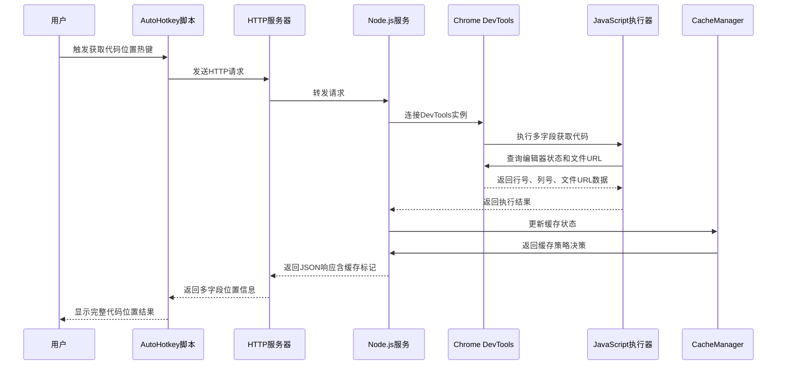
```mermaid
sequenceDiagram
participant User as 用户
participant AHK as AutoHotkey脚本
participant HTTP as HTTP服务器
participant Node as Node.js服务
participant CDP as Chrome DevTools
participant JS as JavaScript执行器
User->>AHK : 触发获取代码位置热键
AHK->>HTTP : 发送HTTP请求
HTTP->>Node : 转发请求
Node->>CDP : 连接DevTools实例
CDP->>JS : 执行多字段获取代码
JS->>CDP : 查询编辑器状态和文件URL
CDP-->>JS : 返回行号、列号、文件URL数据
JS-->>Node : 返回执行结果
Node->>CacheManager : 更新缓存状态
CacheManager->>Node : 返回缓存策略决策
Node-->>HTTP : 返回JSON响应含缓存标记
HTTP-->>AHK : 返回多字段位置信息
AHK-->>User : 显示完整代码位置结果
```

**图表来源**
- [bridge.js:11-84](file://get-source-panel-line-number/bridge.js#L11-L84)
- [get_line_number.ahk:71-97](file://get-source-panel-line-number/get_line_number.ahk#L71-L97)

### 数据交换格式

系统采用标准化的JSON格式进行数据交换，确保了跨平台的兼容性和易用性：

#### 请求格式
HTTP GET请求到`/line-number`端点，无需额外的请求头或参数。

#### 响应格式
**更新**：标准的JSON响应现在包含以下字段：
- `lineNumber`: 当前源码面板的行号（数字类型）
- `columnNumber`: 当前行号对应的列号（数字类型）
- `fileUrl`: 当前编辑文件的完整URL（字符串类型）
- `error`: 错误信息（字符串类型，仅在发生错误时存在）
- `_cached`: 缓存标记（布尔类型，仅在使用缓存时存在）
- `_restarting`: 自动重启标记（布尔类型，仅在服务重启时存在）

#### 错误处理策略
系统实现了多层次的错误处理机制：
- DevTools未找到：返回明确的错误信息
- JavaScript执行失败：捕获并返回异常详情
- 网络连接问题：提供超时和连接失败的反馈
- **新增**：多字段解析失败的详细错误状态
- **新增**：缓存失效时的降级处理
- **新增**：IDE工作区发现失败的错误处理
- **新增**：文件路径解析失败的详细错误信息

### 端口探测和健康检查功能

**新增功能**：系统现在包含智能的端口探测和健康检查功能：

#### 端口占用检测
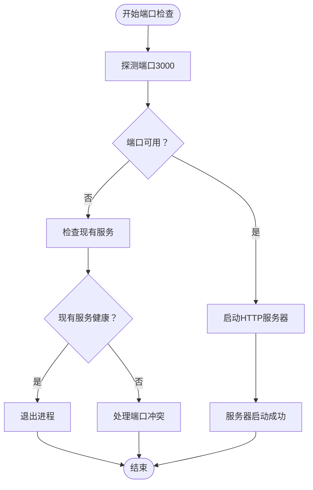
```mermaid
flowchart TD
Start([开始端口检查]) --> ProbePort["探测端口3000"]
ProbePort --> PortAvailable{"端口可用？"}
PortAvailable --> |是| StartServer["启动HTTP服务器"]
PortAvailable --> |否| CheckExisting["检查现有服务"]
CheckExisting --> ExistingHealthy{"现有服务健康？"}
ExistingHealthy --> |是| ExitProcess["退出进程"]
ExistingHealthy --> |否| HandleConflict["处理端口冲突"]
StartServer --> ServerStarted["服务器启动成功"]
ExitProcess --> End([结束])
HandleConflict --> End
ServerStarted --> End
```

**图表来源**
- [bridge.js:67-81](file://get-source-panel-line-number/bridge.js#L67-L81)
- [bridge.js:104-118](file://get-source-panel-line-number/bridge.js#L104-L118)

#### 健康检查端点
系统提供`/health`端点用于服务状态检查：
- 返回服务运行状态
- 包含进程ID信息
- 支持快速服务可用性验证
- **新增**：PowerShell启动器的健康检查集成

### AutoHotkey与Node.js通信协议

AutoHotkey与Node.js之间的通信基于标准的HTTP协议，具有以下特点：

#### 协议规范
- **传输层**：HTTP/1.1
- **编码格式**：UTF-8
- **内容类型**：application/json
- **端口约定**：默认使用3000端口

#### 消息传递机制
1. **请求阶段**：AutoHotkey发起HTTP GET请求
2. **处理阶段**：Node.js服务接收并处理请求
3. **响应阶段**：Node.js返回JSON格式的响应
4. **解析阶段**：AutoHotkey解析响应并提取多字段信息
5. **缓存标记处理**：识别_cached和_restarting标记

#### 超时和重试机制
系统实现了智能的超时处理：
- 请求超时时间：1秒
- 自动重试机制：在某些情况下提供重试机会
- **新增**：详细的错误状态码支持
  - `"Bridge Offline"`：Node.js服务不可用
  - `"Not in Source Panel"`：当前不在源码面板
  - `"DevTools not open"`：DevTools窗口未打开

### 源码面板行号获取功能实现

源码面板行号获取功能是该工具的核心特性，其实现原理如下：

#### DevTools内部API利用
系统通过DevTools暴露的内部API获取当前编辑器的状态信息。**更新**：现在支持获取文件URL信息。具体实现包括：
- 访问`UI.panels.sources`对象
- 获取当前活动的源码视图
- 查询编辑器的选择状态
- **新增**：获取当前编辑文件的URL信息
- 提取起始行号并转换为1基索引
- **新增**：计算列号位置

#### 行号计算逻辑
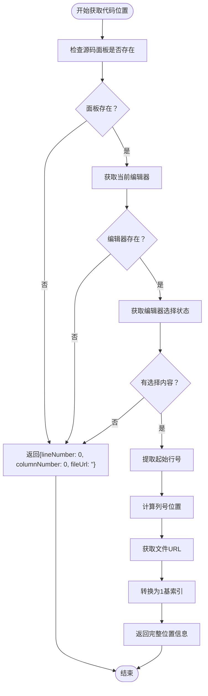
```mermaid
flowchart TD
Start([开始获取代码位置]) --> CheckPanel["检查源码面板是否存在"]
CheckPanel --> PanelExists{"面板存在？"}
PanelExists --> |否| ReturnZero["返回{lineNumber: 0, columnNumber: 0, fileUrl: ''}"]
PanelExists --> |是| GetEditor["获取当前编辑器"]
GetEditor --> EditorExists{"编辑器存在？"}
EditorExists --> |否| ReturnZero
EditorExists --> |是| GetSelection["获取编辑器选择状态"]
GetSelection --> HasSelection{"有选择内容？"}
HasSelection --> |否| ReturnZero
HasSelection --> |是| ExtractLine["提取起始行号"]
ExtractLine --> ExtractColumn["计算列号位置"]
ExtractColumn --> ExtractURL["获取文件URL"]
ExtractURL --> ConvertBase["转换为1基索引"]
ConvertBase --> ReturnComplete["返回完整位置信息"]
ReturnZero --> End([结束])
ReturnComplete --> End
```

**图表来源**
- [bridge.js:22-67](file://get-source-panel-line-number/bridge.js#L22-L67)

#### 热键绑定和用户体验
系统提供了完善的热键绑定机制：
- 主要热键：Ctrl+Alt+L（现在显示行号、列号和文件URL）
- 环境初始化：F10
- 强制重启：Shift+F10
- 系统诊断：Ctrl+F12（现在显示完整的诊断信息）

### VBS脚本执行流程

VBS脚本虽然简单，但在系统启动过程中发挥着重要作用：

#### 启动流程
1. **进程启动**：通过WScript Shell启动Node.js进程
2. **无窗口模式**：设置窗口显示模式为隐藏
3. **异步执行**：不等待进程结束，允许后台运行

#### 配置选项
- **工作目录**：使用脚本所在目录
- **窗口模式**：0表示隐藏窗口
- **等待标志**：False表示非阻塞启动

### PowerShell启动器功能

**新增功能**：PowerShell启动器提供了更强大的服务管理能力：

#### 智能启动逻辑
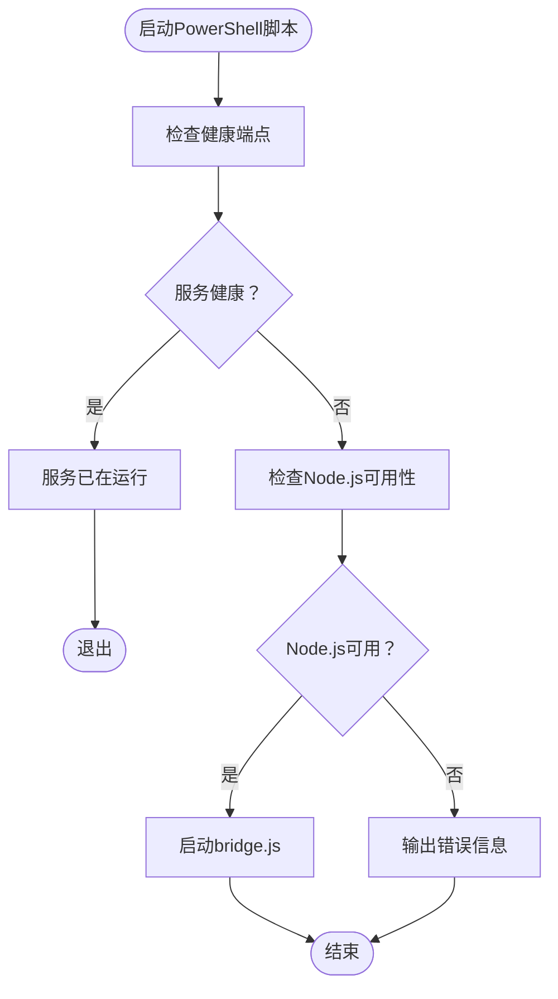
```mermaid
flowchart TD
Start([启动PowerShell脚本]) --> CheckHealth["检查健康端点"]
CheckHealth --> Healthy{"服务健康？"}
Healthy --> |是| AlreadyRunning["服务已在运行"]
AlreadyRunning --> Exit([退出])
Healthy --> |否| CheckNode["检查Node.js可用性"]
CheckNode --> NodeAvailable{"Node.js可用？"}
NodeAvailable --> |是| StartBridge["启动bridge.js"]
NodeAvailable --> |否| Error["输出错误信息"]
StartBridge --> End([结束])
Error --> End
```

**图表来源**
- [run_bridge.ps1:11-25](file://run_bridge.ps1#L11-L25)

#### 健康检查集成
- **自动健康检查**：启动前检查现有服务状态
- **错误处理**：提供详细的错误诊断
- **跨平台支持**：支持不同环境下的Node.js执行

### UIA菜单交互功能

**增强功能**：系统集成了Microsoft UI Automation框架，提供更丰富的菜单交互能力：

#### UIA浏览器自动化
- **跨浏览器支持**：Chrome、Edge、Firefox等主流浏览器
- **元素定位**：基于UI Automation属性的精确元素定位
- **菜单操作**：支持浏览器菜单的自动化操作
- **JavaScript执行**：通过地址栏执行JavaScript代码

#### 菜单交互流程
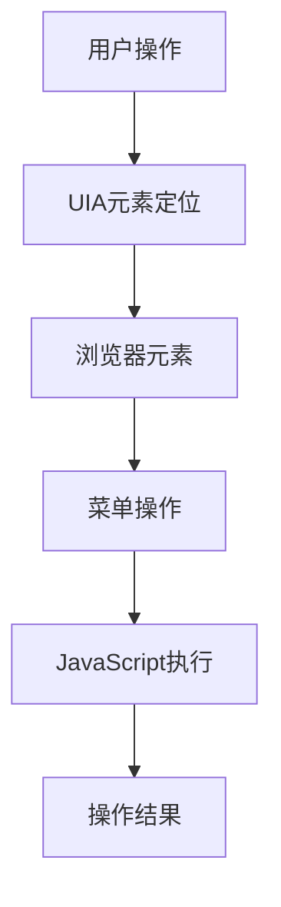
```mermaid
flowchart TD
UserAction[用户操作] --> UIAElement[UIA元素定位]
UIAElement --> BrowserElement[浏览器元素]
BrowserElement --> MenuOperation[菜单操作]
MenuOperation --> JavaScriptExecution[JavaScript执行]
JavaScriptExecution --> Result[操作结果]
```

**图表来源**
- [UIA_Browser.ahk:458-577](file://lib/UIA_Browser.ahk#L458-L577)

### 增强的诊断和故障排除功能

**新增功能**：系统现在提供完整的诊断工具和故障排除能力：

#### 系统链路检查
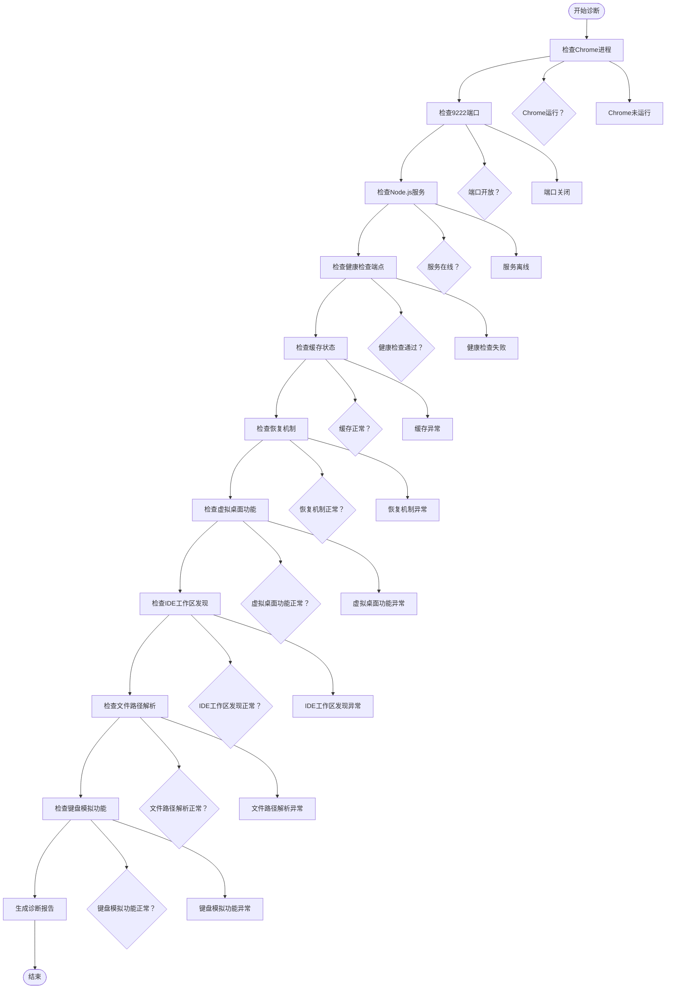
```mermaid
flowchart TD
Start([开始诊断]) --> CheckChrome["检查Chrome进程"]
CheckChrome --> CheckPort["检查9222端口"]
CheckPort --> CheckBridge["检查Node.js服务"]
CheckBridge --> CheckHealth["检查健康检查端点"]
CheckHealth --> CheckCache["检查缓存状态"]
CheckCache --> CheckRecovery["检查恢复机制"]
CheckRecovery --> CheckVirtualDesktop["检查虚拟桌面功能"]
CheckVirtualDesktop --> CheckIDEWorkspace["检查IDE工作区发现"]
CheckIDEWorkspace --> CheckPathResolution["检查文件路径解析"]
CheckPathResolution --> CheckKeyboard["检查键盘模拟功能"]
CheckKeyboard --> Report["生成诊断报告"]
Report --> End([结束])
CheckChrome --> ChromeOK{"Chrome运行？"}
CheckChrome --> ChromeFail["Chrome未运行"]
CheckPort --> PortOK{"端口开放？"}
CheckPort --> PortFail["端口关闭"]
CheckBridge --> BridgeOK{"服务在线？"}
CheckBridge --> BridgeFail["服务离线"]
CheckHealth --> HealthOK{"健康检查通过？"}
CheckHealth --> HealthFail["健康检查失败"]
CheckCache --> CacheOK{"缓存正常？"}
CheckCache --> CacheFail["缓存异常"]
CheckRecovery --> RecoveryOK{"恢复机制正常？"}
CheckRecovery --> RecoveryFail["恢复机制异常"]
CheckVirtualDesktop --> VDOK{"虚拟桌面功能正常？"}
CheckVirtualDesktop --> VDFail["虚拟桌面功能异常"]
CheckIDEWorkspace --> IDEOK{"IDE工作区发现正常？"}
CheckIDEWorkspace --> IDEFail["IDE工作区发现异常"]
CheckPathResolution --> PathOK{"文件路径解析正常？"}
CheckPathResolution --> PathFail["文件路径解析异常"]
CheckKeyboard --> KOK{"键盘模拟功能正常？"}
CheckKeyboard --> KFail["键盘模拟功能异常"]
```

**图表来源**
- [get_line_number.ahk:132-159](file://get-source-panel-line-number/get_line_number.ahk#L132-L159)

#### 诊断工具使用
系统提供了完整的环境配置验证流程：

1. **Node.js环境验证**：检查版本和依赖
2. **Chrome环境验证**：检查调试端口和权限
3. **网络环境验证**：检查本地网络连通性
4. **文件系统验证**：检查脚本文件的可访问性
5. **UIA框架验证**：检查UI Automation支持
6. **缓存状态验证**：检查lastResult缓存有效性
7. **恢复机制验证**：检查自动重启功能
8. **虚拟桌面功能验证**：检查虚拟桌面管理器功能
9. **键盘模拟功能验证**：检查键盘事件模拟功能
10. **PowerShell环境验证**：检查执行策略和权限
11. **IDE工作区发现验证**：检查工作区目录发现功能
12. **文件路径解析验证**：检查多层级路径解析功能
13. **调试日志功能验证**：检查日志记录和错误收集功能

#### 增强的错误处理
- **智能超时处理**：1秒超时限制
- **多字段正则表达式解析**：
  - `"lineNumber":(\d+)` 模式匹配行号
  - `"columnNumber":(\d+)` 模式匹配列号
  - `"fileUrl":"([^"]+)"` 模式匹配文件URL
- **详细错误状态码**：
  - `"Not in Source Panel"`：当前不在源码面板
  - `"Bridge Offline"`：Node.js服务离线
  - `"DevTools not open"`：DevTools窗口未打开
  - **新增**：`"cannot resolve: ${file}"`：文件路径解析失败
  - **新增**：`"NO_MATCH"`：找不到匹配的IDE窗口
- **缓存状态标识**：
  - `"cached": true`：使用缓存数据
  - `"restarting": true`：服务正在重启
- **健康检查集成**：`/health`端点提供进程状态
- **虚拟桌面错误处理**：详细的虚拟桌面操作错误信息
- **IDE工作区错误处理**：工作区发现和路径解析的详细错误信息

### VS Code集成模块

**新增功能**：完整的Chrome扩展集成，提供VS Code和Qoder的文件打开功能。

#### 原生消息通信协议
系统实现了标准的Chrome原生消息通信协议：
- **消息头格式**：4字节长度前缀，UTF-8编码的JSON消息体
- **消息类型**：支持action: 'open'的打开请求
- **超时机制**：10秒超时确保通信可靠性
- **错误处理**：详细的错误信息传递和日志记录

#### DevTools端口管理
- **连接生命周期**：维护DevTools端口连接和心跳机制
- **状态同步**：保持与DevTools的双向通信
- **回退机制**：当特定标签页端口不可用时的回退策略
- **消息路由**：将打开请求转发给合适的DevTools端口

#### IDE启动器功能
- **原生主机调用**：通过chrome.runtime.connectNative连接原生主机
- **参数验证**：确保文件路径、行号、列号的有效性
- **IDE选择**：支持VS Code和Qoder两种IDE的选择
- **结果回调**：提供成功和失败的回调处理

**章节来源**
- [bridge.js:1-142](file://get-source-panel-line-number/bridge.js#L1-L142)
- [get_line_number.ahk:1-159](file://get-source-panel-line-number/get_line_number.ahk#L1-L159)
- [run_bridge.vbs:1-2](file://get-source-panel-line-number/run_bridge.vbs#L1-L2)
- [run_bridge.ps1:1-26](file://run_bridge.ps1#L1-L26)
- [UIA_Browser.ahk:1-800](file://lib/UIA_Browser.ahk#L1-L800)
- [host.js:87-127](file://devtools-vscode-opener/native-host/host.js#L87-L127)
- [background.js:1-95](file://devtools-vscode-opener/background.js#L1-L95)
- [devtools.js:1-151](file://devtools-vscode-opener/devtools.js#L1-L151)
- [manifest.json:1-32](file://devtools-vscode-opener/manifest.json#L1-L32)

## 依赖分析

### Node.js依赖关系

系统对Node.js生态系统的依赖相对简洁，主要依赖于chrome-remote-interface库：

```mermaid
graph LR
subgraph "系统依赖"
CDP[chrome-remote-interface ^0.34.0]
HTTP[http模块]
FS[fs模块]
END
subgraph "系统组件"
Bridge[bridge.js]
Service[HTTP服务]
Connector[CDP连接器]
Health[健康检查器]
PortProbe[端口探测器]
MultiFieldParser[多字段解析器]
Diagnostic[诊断工具]
CacheManager[缓存管理器]
RecoveryMechanism[恢复机制]
FailureTracker[失败跟踪器]
end
Bridge --> Service
Bridge --> Connector
Bridge --> Health
Bridge --> PortProbe
Bridge --> CacheManager
Bridge --> RecoveryMechanism
Connector --> CDP
Service --> HTTP
Connector --> FS
Health --> HTTP
PortProbe --> HTTP
CacheManager --> Bridge
RecoveryMechanism --> Bridge
MultiFieldParser --> Bridge
Diagnostic --> Bridge
FailureTracker --> CacheManager
```

**图表来源**
- [package.json:1-6](file://get-source-panel-line-number/package.json#L1-L6)
- [bridge.js:1-3](file://get-source-panel-line-number/bridge.js#L1-L3)

### C#虚拟桌面管理器依赖

**新增依赖**：系统集成了C#虚拟桌面管理器，依赖以下Windows API和COM接口：

```mermaid
graph LR
subgraph "C#组件依赖"
VirtualDesktopManager[VirtualDesktopManager]
KeyboardSimulator[KeyboardSimulator]
WindowEnumerator[WindowEnumerator]
COMInterop[COM互操作]
SystemAPI[System API]
PowerShellEngine[PowerShell引擎]
COMInterface[COM接口]
END
subgraph "Windows API依赖"
IVirtualDesktopManager[IVirtualDesktopManager接口]
User32API[User32 API]
Kernel32API[Kernel32 API]
END
subgraph "系统功能"
WindowManagement[窗口管理]
VirtualDesktop[虚拟桌面]
KeyboardEvents[键盘事件]
ProcessManagement[进程管理]
Logging[日志记录]
IDEWorkspaceDiscovery[IDE工作区发现]
EnhancedPathResolution[增强路径解析]
DebugLogging[调试日志]
END
VirtualDesktopManager --> IVirtualDesktopManager
KeyboardSimulator --> User32API
WindowEnumerator --> User32API
COMInterop --> Kernel32API
SystemAPI --> User32API
PowerShellEngine --> PowerShellEngine
COMInterface --> COMInterface
VirtualDesktopManager --> WindowManagement
VirtualDesktopManager --> VirtualDesktop
KeyboardSimulator --> KeyboardEvents
WindowEnumerator --> ProcessManagement
Logging --> SystemAPI
IDEWorkspaceDiscovery --> PowerShellEngine
IDEWorkspaceDiscovery --> COMInterface
EnhancedPathResolution --> FileSystem
EnhancedPathResolution --> CacheStorage
DebugLogging --> FileSystem
```

**图表来源**
- [host.js:87-127](file://devtools-vscode-opener/native-host/host.js#L87-L127)
- [host.js:9-49](file://devtools-vscode-opener/native-host/host.js#L9-L49)
- [host.js:53-112](file://devtools-vscode-opener/native-host/host.js#L53-L112)
- [host.js:127-218](file://devtools-vscode-opener/native-host/host.js#L127-L218)

### AutoHotkey依赖关系

AutoHotkey脚本依赖于系统提供的COM组件和标准功能：

#### COM组件依赖
- **WinHttp.WinHttpRequest.5.1**：用于HTTP通信
- **WScript.Shell**：用于进程管理和VBS脚本执行

#### 系统功能依赖
- **Process类**：用于进程状态检查
- **File类**：用于文件操作
- **RegEx**：用于正则表达式匹配

### Chrome扩展依赖关系

**新增依赖**：VS Code集成模块依赖于Chrome扩展API和原生消息通信。

#### 扩展API依赖
- **chrome.runtime**：原生消息通信和扩展生命周期管理
- **chrome.tabs**：浏览器标签页操作
- **chrome.commands**：快捷键命令处理
- **chrome.devtools**：DevTools扩展接口

#### 原生消息协议
- **消息格式**：4字节长度前缀 + UTF-8 JSON
- **超时控制**：10秒超时机制
- **错误传播**：详细的错误信息传递
- **连接管理**：端口生命周期和断开处理

### 环境配置依赖

系统对运行环境有以下要求：

#### Node.js环境
- **版本要求**：Node.js 14.x及以上版本
- **包管理器**：npm或pnpm
- **权限要求**：需要访问Chrome调试端口
- **新增**：PowerShell执行策略要求

#### Windows环境
- **操作系统**：Windows 7/8/10/11
- **浏览器支持**：Chrome 62+或同等版本的浏览器
- **网络权限**：需要本地网络访问权限
- **UIA支持**：需要支持UI Automation的Windows版本
- **新增**：Windows虚拟桌面支持（Windows 10/11）
- **新增**：PowerShell 5.0及以上版本支持

#### UIA框架依赖
- **Windows版本**：需要支持UI Automation的Windows版本
- **浏览器支持**：需要支持无障碍访问的浏览器
- **权限要求**：需要适当的UI Automation权限

#### C#运行时依赖
- **.NET Framework**：需要支持P/Invoke的.NET版本
- **Windows API访问权限**：需要系统级API访问权限
- **COM注册**：需要适当的COM接口注册
- **新增**：PowerShell引擎支持
- **新增**：虚拟桌面API访问权限

#### Chrome扩展依赖
- **Chrome版本**：支持Manifest V3的Chrome版本
- **原生主机权限**：需要nativeMessaging权限
- **扩展安装**：需要正确的扩展ID和清单配置
- **新增**：快捷键配置支持

**章节来源**
- [package.json:1-6](file://get-source-panel-line-number/package.json#L1-L6)
- [get_line_number.ahk:15-66](file://get-source-panel-line-number/get_line_number.ahk#L15-L66)
- [UIA.ahk:1-800](file://lib/UIA.ahk#L1-L800)
- [host.js:87-127](file://devtools-vscode-opener/native-host/host.js#L87-L127)
- [background.js:1-95](file://devtools-vscode-opener/background.js#L1-L95)
- [devtools.js:1-151](file://devtools-vscode-opener/devtools.js#L1-L151)
- [manifest.json:1-32](file://devtools-vscode-opener/manifest.json#L1-L32)

## 性能考虑

### 内存使用优化

系统在内存使用方面采用了多项优化策略：

#### 连接池管理
- 及时关闭CDP连接，避免资源泄漏
- 使用finally块确保连接正确释放
- 最小化内存占用，避免长时间持有大对象

#### 响应时间优化
- HTTP服务器采用异步处理模型
- JavaScript执行在DevTools内部完成，减少数据传输
- 缓存机制避免重复的DevTools连接建立
- **新增**：多字段数据的高效提取和序列化
- **新增**：智能缓存策略减少不必要的查询
- **新增**：C#虚拟桌面管理器的内存优化
- **新增**：IDE工作区发现的内存缓存机制

#### 端口探测优化
- 异步端口检查避免阻塞主流程
- 超时机制防止无限等待
- 健康检查结果缓存减少重复检查
- **新增**：PowerShell启动器的快速健康检查
- **新增**：调试日志的异步写入优化

### 并发处理能力

系统支持多客户端并发访问，具备良好的扩展性：

#### 并发模型
- Node.js单线程事件循环模型
- 异步I/O操作避免阻塞
- 非阻塞的HTTP请求处理

#### 资源竞争处理
- Chrome DevTools API的线程安全保证
- 内存中的状态隔离
- 文件系统访问的串行化

### 网络性能优化

#### 连接复用
- HTTP连接的合理复用
- 减少TCP连接建立开销
- 优化HTTP头部信息

#### 数据传输优化
- **更新**：JSON响应的最小化
- **新增**：多字段数据的紧凑序列化
- **新增**：缓存标记的轻量级表示
- **新增**：C#虚拟桌面管理器的二进制数据传输
- **新增**：原生消息通信的高效序列化
- **新增**：调试日志的压缩存储
- 二进制数据的避免
- 压缩传输的考虑

### 缓存性能优化

**新增优化**：智能缓存系统的性能优化措施：
- 缓存数据的快速访问
- 失败计数器的原子操作
- 自动重启的延迟处理
- 缓存失效的渐进式降级
- **新增**：IDE工作区发现结果的短期缓存

### UIA性能优化

**新增优化**：UIA框架的性能优化措施：
- 元素缓存机制
- 懒加载策略
- 批量操作支持
- 事件监听优化

### C#虚拟桌面管理器性能优化

**新增优化**：C#虚拟桌面管理器的性能优化：
- COM接口的延迟初始化
- 窗口枚举的增量处理
- 键盘事件的批处理
- 日志记录的异步写入
- 进程名匹配的缓存机制
- **新增**：PowerShell命令执行的超时控制
- **新增**：文件路径解析的早期退出优化
- **新增**：调试日志的分段写入

### VS Code集成模块性能优化

**新增优化**：Chrome扩展集成的性能优化：
- **新增**：原生消息通信的连接池管理
- **新增**：DevTools端口连接的复用机制
- **新增**：IDE启动器的异步处理
- **新增**：超时控制的精细化管理
- **新增**：错误处理的快速失败机制

## 故障排除指南

### 常见问题及解决方案

#### Chrome调试端口问题

**症状**：系统无法连接到Chrome调试端口
**原因分析**：
- Chrome未以调试模式启动
- 调试端口已被占用
- 权限不足访问端口

**解决步骤**：
1. 检查Chrome进程是否以`--remote-debugging-port`参数启动
2. 验证端口9222的可用性
3. 以管理员权限运行脚本
4. 关闭可能占用端口的其他程序

#### Node.js服务启动失败

**症状**：Node.js桥接服务无法启动
**原因分析**：
- Node.js环境未正确安装
- 依赖包安装失败
- 权限问题

**解决步骤**：
1. 验证Node.js版本兼容性
2. 检查package.json依赖安装
3. 确认文件路径的正确性
4. 查看详细的错误日志
5. **新增**：检查PowerShell执行策略设置

#### DevTools连接失败

**症状**：无法连接到DevTools实例
**原因分析**：
- DevTools窗口未正确打开
- CDP协议版本不兼容
- 浏览器版本过旧

**解决步骤**：
1. 确保Chrome DevTools已打开
2. 检查Chrome版本兼容性
3. 更新chrome-remote-interface库
4. 重启Chrome实例

#### 端口冲突问题

**症状**：服务启动时出现端口占用错误
**原因分析**：
- 端口3000已被其他进程占用
- 健康检查失败
- 进程残留

**解决步骤**：
1. 使用netstat检查端口占用情况
2. 终止占用端口的进程
3. 清理残留的Node.js进程
4. 重新启动服务

#### 缓存失效问题

**症状**：系统返回缓存数据而非实时数据
**原因分析**：
- lastResult缓存过期
- 连续失败计数器未重置
- 缓存标记未正确处理

**解决步骤**：
1. 检查lastResult缓存的有效性
2. 验证连续失败计数器的状态
3. 确认缓存标记的正确处理
4. 手动清除缓存并重启服务

#### 虚拟桌面功能异常

**症状**：虚拟桌面管理器无法正常工作
**原因分析**：
- Windows版本不支持虚拟桌面
- COM接口初始化失败
- 权限不足访问虚拟桌面API

**解决步骤**：
1. 检查Windows版本是否支持虚拟桌面
2. 验证VirtualDesktopManager接口可用性
3. 以管理员权限运行程序
4. 检查COM接口注册状态
5. 查看详细的错误日志

#### 键盘事件模拟失败

**症状**：键盘事件模拟功能无法正常工作
**原因分析**：
- Windows API调用失败
- 权限不足模拟键盘事件
- 目标窗口无焦点

**解决步骤**：
1. 检查User32 API的可用性
2. 验证键盘事件模拟权限
3. 确保目标窗口处于前台
4. 检查键盘事件的延迟设置
5. 查看详细的API调用错误

#### IDE工作区发现失败

**症状**：IDE工作区发现功能无法正常工作
**原因分析**：
- PowerShell执行失败
- 进程命令行解析错误
- 工作区路径无效
- 权限不足访问进程信息

**解决步骤**：
1. 检查PowerShell执行策略设置
2. 验证IDE进程的可访问性
3. 检查命令行参数的解析逻辑
4. 确认工作区目录的有效性
5. 以管理员权限运行程序
6. 查看ide-vdm-debug.log调试日志

#### 文件路径解析失败

**症状**：文件路径解析功能无法找到目标文件
**原因分析**：
- 工作区发现失败
- 路径规范化错误
- 候选目录搜索失败
- 文件系统访问权限问题

**解决步骤**：
1. 验证IDE工作区发现功能
2. 检查路径规范化逻辑
3. 确认候选目录的存在性
4. 验证文件系统访问权限
5. 检查文件是否存在
6. 查看详细的路径解析日志

#### 原生消息通信失败

**症状**：Chrome扩展无法与原生主机通信
**原因分析**：
- 原生主机未正确安装
- 清单文件配置错误
- 扩展ID不匹配
- 权限不足

**解决步骤**：
1. 运行install-native-host.ps1重新安装
2. 检查原生主机清单文件的路径
3. 验证扩展ID的正确性
4. 确认nativeMessaging权限
5. 检查防火墙和杀毒软件设置
6. 查看Chrome扩展的错误日志

### 诊断工具使用

系统内置了完整的诊断工具，帮助用户快速定位问题：

#### 系统状态检查
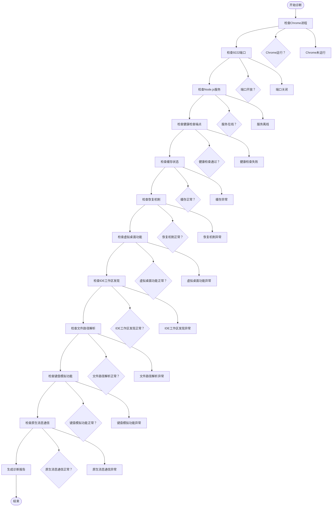
```mermaid
flowchart TD
Start([开始诊断]) --> CheckChrome["检查Chrome进程"]
CheckChrome --> CheckPort["检查9222端口"]
CheckPort --> CheckBridge["检查Node.js服务"]
CheckBridge --> CheckHealth["检查健康检查端点"]
CheckHealth --> CheckCache["检查缓存状态"]
CheckCache --> CheckRecovery["检查恢复机制"]
CheckRecovery --> CheckVirtualDesktop["检查虚拟桌面功能"]
CheckVirtualDesktop --> CheckIDEWorkspace["检查IDE工作区发现"]
CheckIDEWorkspace --> CheckPathResolution["检查文件路径解析"]
CheckPathResolution --> CheckKeyboard["检查键盘模拟功能"]
CheckKeyboard --> CheckNativeMessaging["检查原生消息通信"]
CheckNativeMessaging --> Report["生成诊断报告"]
Report --> End([结束])
CheckChrome --> ChromeOK{"Chrome运行？"}
CheckChrome --> ChromeFail["Chrome未运行"]
CheckPort --> PortOK{"端口开放？"}
CheckPort --> PortFail["端口关闭"]
CheckBridge --> BridgeOK{"服务在线？"}
CheckBridge --> BridgeFail["服务离线"]
CheckHealth --> HealthOK{"健康检查通过？"}
CheckHealth --> HealthFail["健康检查失败"]
CheckCache --> CacheOK{"缓存正常？"}
CheckCache --> CacheFail["缓存异常"]
CheckRecovery --> RecoveryOK{"恢复机制正常？"}
CheckRecovery --> RecoveryFail["恢复机制异常"]
CheckVirtualDesktop --> VDOK{"虚拟桌面功能正常？"}
CheckVirtualDesktop --> VDFail["虚拟桌面功能异常"]
CheckIDEWorkspace --> IDEOK{"IDE工作区发现正常？"}
CheckIDEWorkspace --> IDEFail["IDE工作区发现异常"]
CheckPathResolution --> PathOK{"文件路径解析正常？"}
CheckPathResolution --> PathFail["文件路径解析异常"]
CheckKeyboard --> KOK{"键盘模拟功能正常？"}
CheckKeyboard --> KFail["键盘模拟功能异常"]
CheckNativeMessaging --> NMOK{"原生消息通信正常？"}
CheckNativeMessaging --> NMFail["原生消息通信异常"]
```

**图表来源**
- [get_line_number.ahk:132-159](file://get-source-panel-line-number/get_line_number.ahk#L132-L159)

#### 环境配置验证

系统提供了完整的环境配置验证流程：

1. **Node.js环境验证**：检查版本和依赖
2. **Chrome环境验证**：检查调试端口和权限
3. **网络环境验证**：检查本地网络连通性
4. **文件系统验证**：检查脚本文件的可访问性
5. **UIA框架验证**：检查UI Automation支持
6. **缓存状态验证**：检查lastResult缓存有效性
7. **恢复机制验证**：检查自动重启功能
8. **PowerShell环境验证**：检查执行策略和权限
9. **虚拟桌面环境验证**：检查Windows虚拟桌面支持
10. **C#运行时验证**：检查.NET Framework版本
11. **COM接口验证**：检查虚拟桌面API可用性
12. **键盘模拟验证**：检查键盘事件模拟功能
13. **IDE工作区发现验证**：检查工作区目录发现功能
14. **文件路径解析验证**：检查多层级路径解析功能
15. **调试日志验证**：检查日志记录和错误收集功能
16. **Chrome扩展验证**：检查扩展安装和权限配置
17. **原生消息通信验证**：检查扩展与原生主机通信

### 日志记录和监控

系统实现了多层次的日志记录机制：

#### 错误日志
- 详细的错误堆栈信息
- 时间戳记录
- 操作上下文信息
- **新增**：多字段解析错误的详细记录
- **新增**：缓存失效和恢复的日志
- **新增**：虚拟桌面操作的详细日志
- **新增**：键盘事件模拟的详细日志
- **新增**：IDE工作区发现的详细日志
- **新增**：文件路径解析的详细日志
- **新增**：原生消息通信的详细日志

#### 性能日志
- 响应时间统计
- 资源使用情况
- 并发访问监控
- **新增**：多字段数据提取性能监控
- **新增**：缓存命中率统计
- **新增**：虚拟桌面操作性能监控
- **新增**：键盘事件模拟性能监控
- **新增**：IDE工作区发现性能监控
- **新增**：文件路径解析性能监控
- **新增**：原生消息通信性能监控

#### 用户操作日志
- 热键触发记录
- 功能使用统计
- 错误发生频率
- **新增**：多字段获取成功率统计
- **新增**：缓存使用情况统计
- **新增**：虚拟桌面管理使用统计
- **新增**：键盘模拟使用统计
- **新增**：IDE工作区发现使用统计
- **新增**：文件路径解析使用统计
- **新增**：原生消息通信使用统计

#### 健康检查日志
**新增功能**：系统记录健康检查和端口探测的结果：
- 端口占用检测结果
- 进程状态变化
- 服务重启历史
- **新增**：多字段数据提取成功率
- **新增**：缓存有效性监控
- **新增**：自动恢复机制使用统计
- **新增**：虚拟桌面管理器状态监控
- **新增**：键盘模拟器状态监控
- **新增**：IDE工作区发现器状态监控
- **新增**：文件路径解析器状态监控
- **新增**：原生消息通信器状态监控
- **新增**：响应时间监控**
- **新增**：调试日志文件监控**

#### 调试日志文件
**新增功能**：系统生成详细的调试日志文件：
- **ide-vdm-debug.log**：虚拟桌面和IDE操作的详细日志
- **路径解析日志**：文件路径解析过程的详细记录
- **通信日志**：原生消息通信的详细记录
- **性能统计**：各组件性能指标的统计信息
- **错误汇总**：系统错误的分类和统计

**章节来源**
- [get_line_number.ahk:132-159](file://get-source-panel-line-number/get_line_number.ahk#L132-L159)
- [nvm-node-pnpm-setup-guide.md:1-160](file://nvm-node-pnpm-setup-guide.md#L1-L160)
- [bridge.js:67-81](file://get-source-panel-line-number/bridge.js#L67-L81)
- [host.js:87-127](file://devtools-vscode-opener/native-host/host.js#L87-L127)
- [host.js:9-49](file://devtools-vscode-opener/native-host/host.js#L9-L49)
- [host.js:53-112](file://devtools-vscode-opener/native-host/host.js#L53-L112)
- [host.js:127-218](file://devtools-vscode-opener/native-host/host.js#L127-L218)

## 结论

Node.js桥接工具是一个精心设计的跨平台开发辅助系统，成功地解决了从Chrome DevTools获取源码面板行号这一复杂的技术挑战。**更新**：该系统现已重构为集成化的C#解决方案，集成了虚拟桌面管理和键盘模拟功能，提供更强大的系统级窗口管理和自动化能力。

### 技术创新性
- **深度集成**：直接利用DevTools内部API，避免了传统方法的局限性
- **实时性**：提供毫秒级的行号、列号和文件URL获取能力
- **可靠性**：完善的错误处理和恢复机制
- **智能健康检查**：内置端口探测和进程监控功能
- **UIA集成**：提供丰富的浏览器自动化能力
- **增强诊断功能**：完整的系统链路检查和故障排除工具
- **多字段支持**：同时获取行号、列号和文件URL的完整代码位置信息
- **智能缓存系统**：lastResult缓存和连续失败跟踪机制
- **自动恢复功能**：MAX_FAILURES阈值控制和自动重启能力
- **响应格式增强**：支持_cached和_restarting标记的响应格式
- **虚拟桌面管理**：集成Windows虚拟桌面的窗口管理和切换功能
- **键盘事件模拟**：提供精确的键盘按键事件模拟功能
- **窗口管理增强**：改进的窗口枚举、匹配和前台激活机制
- **IDE工作区发现**：智能识别和利用已打开的IDE项目工作区
- **增强文件解析**：支持复杂的文件路径解析和项目根目录查找
- **调试日志系统**：提供详细的系统操作记录和故障诊断信息
- **原生消息通信**：实现Chrome扩展与原生主机的高效通信
- **VS Code集成**：完整的VS Code和Qoder文件打开功能
- **C#运行时集成**：利用C#的高性能和系统级API访问能力

### 用户体验优化
- **简单易用**：通过热键绑定提供一键式操作
- **可视化反馈**：实时显示获取的完整代码位置信息
- **智能诊断**：内置完整的故障排除工具
- **多浏览器支持**：通过UIA框架支持多种浏览器
- **智能多字段解析**：提供正则表达式解析和错误处理
- **详细错误状态**：提供"Bridge Offline"、"Not in Source Panel"等详细错误信息
- **缓存透明化**：用户可以清楚地看到缓存使用的状态
- **虚拟桌面集成**：支持虚拟桌面切换和窗口管理
- **键盘自动化**：支持精确的键盘事件模拟和组合键操作
- **IDE工作区优化**：智能利用已打开的项目工作区
- **文件定位准确**：多层级路径解析提升文件定位准确性
- **调试透明化**：详细的日志记录帮助用户理解系统行为
- **扩展集成**：完整的Chrome扩展支持VS Code/Qoder集成
- **原生通信**：高效的原生消息通信提供流畅体验

### 扩展性设计
- **模块化架构**：清晰的职责分离便于维护和扩展
- **标准化接口**：HTTP API便于第三方集成
- **跨平台兼容**：基于Web技术栈的天然跨平台特性
- **UIA框架**：提供强大的浏览器自动化基础
- **智能超时处理**：1秒超时限制和自动重试机制
- **多字段数据结构**：支持未来更多的代码位置信息扩展
- **缓存策略可配置**：MAX_FAILURES阈值可调整
- **恢复机制可监控**：自动重启过程可追踪
- **C#扩展点**：虚拟桌面管理和键盘模拟功能可扩展
- **Windows API集成**：充分利用Windows系统的原生功能
- **Chrome扩展框架**：支持更多IDE和编辑器的集成
- **原生消息协议**：标准的通信协议便于第三方开发
- **调试系统可扩展**：详细的日志系统支持功能扩展

该工具不仅解决了具体的开发需求，更重要的是展示了一种将现代Web技术与传统桌面应用相结合的有效模式，为类似的技术集成项目提供了宝贵的参考经验。**新增的智能缓存和自动恢复机制进一步提升了系统的稳定性和用户体验，而虚拟桌面管理和键盘模拟功能的集成则大大扩展了系统的应用范围和实用性。**新增的IDE工作区发现系统、增强的文件路径解析算法、改进的IDE激活策略和调试日志功能显著提升了文件定位准确性和IDE集成能力，为开发者提供了更加智能和可靠的开发辅助工具。

## 附录

### 安装和配置指南

#### 环境准备
1. **Node.js安装**：确保系统已安装Node.js 14.x或更高版本
2. **Chrome配置**：确保Chrome浏览器已正确安装
3. **权限设置**：确保脚本有足够的系统权限
4. **UIA支持**：确保Windows版本支持UI Automation
5. **PowerShell配置**：确保PowerShell执行策略允许脚本运行
6. **Windows虚拟桌面**：确保Windows版本支持虚拟桌面功能
7. **.NET Framework**：确保系统安装了支持P/Invoke的.NET版本
8. **Chrome扩展权限**：确保Chrome支持原生消息通信

#### 依赖安装
```bash
# 进入项目目录
cd get-source-panel-line-number

# 安装依赖
npm install

# 验证安装
npm list chrome-remote-interface
```

#### 环境变量配置
系统支持以下环境变量：
- `CHROME_PATH`：Chrome可执行文件路径
- `REMOTE_PORT`：Chrome调试端口号
- `BRIDGE_URL`：Node.js服务URL
- `NODE_SCRIPT`：Node.js脚本路径
- **新增**：`MAX_FAILURES`：自动重启阈值（默认3）
- **新增**：`VIRTUAL_DESKTOP_ENABLED`：启用虚拟桌面功能（默认true）
- **新增**：`KEYBOARD_SIMULATION_DELAY`：键盘事件延迟（默认50ms）
- **新增**：`IDE_WORKSPACE_TIMEOUT`：IDE工作区发现超时（默认4秒）
- **新增**：`PATH_RESOLUTION_TIMEOUT`：文件路径解析超时（默认10秒）

### 使用示例

#### 基本使用流程
1. **启动Chrome**：确保Chrome以调试模式运行
2. **启动服务**：运行AutoHotkey脚本
3. **打开DevTools**：在Chrome中打开源码面板
4. **获取位置**：按下Ctrl+Alt+L热键，现在会显示行号、列号和文件URL

#### 高级使用场景
- **批量操作**：结合其他AutoHotkey功能实现批量代码导航
- **集成开发**：与其他IDE或编辑器集成
- **自动化测试**：在自动化测试中获取完整的代码位置信息
- **UIA自动化**：利用UIA框架进行复杂的浏览器操作
- **系统诊断**：使用Ctrl+F12热键进行全面的系统状态检查
- **多字段分析**：利用完整的代码位置信息进行代码分析和统计
- **缓存监控**：观察_cached标记判断数据来源
- **恢复机制**：观察_restarting标记判断服务状态
- **虚拟桌面管理**：使用虚拟桌面功能进行窗口管理
- **键盘自动化**：模拟复杂的键盘组合键操作
- **窗口切换**：通过虚拟桌面进行应用程序切换
- **VS Code集成**：与VS Code/Qoder打开器功能配合使用
- **IDE工作区优化**：利用已打开的项目工作区进行文件定位
- **调试日志分析**：查看ide-vdm-debug.log了解系统行为

### 维护和更新

#### 版本兼容性
- **Chrome版本**：支持Chrome 62及以上版本
- **Node.js版本**：支持Node.js 14.x及以上版本
- **AutoHotkey版本**：支持AutoHotkey v2.0及以上版本
- **Windows版本**：支持Windows 7/8/10/11
- **PowerShell版本**：支持PowerShell 5.0及以上版本
- **.NET Framework版本**：支持.NET Framework 4.0及以上版本
- **虚拟桌面支持**：Windows 10/11虚拟桌面功能
- **Chrome扩展版本**：支持Manifest V3的Chrome版本

#### 安全考虑
- **权限控制**：限制对系统资源的访问
- **输入验证**：对所有外部输入进行验证
- **错误隔离**：防止单点故障影响整体系统
- **UIA权限**：确保适当的无障碍访问权限
- **缓存安全**：防止缓存数据被恶意篡改
- **虚拟桌面权限**：确保适当的虚拟桌面访问权限
- **键盘模拟权限**：确保适当的键盘事件模拟权限
- **COM接口安全**：防止COM接口被滥用
- **原生消息安全**：确保原生通信的安全性
- **调试日志安全**：防止敏感信息泄露

#### 性能监控
- **定期健康检查**：监控服务运行状态
- **资源使用监控**：跟踪内存和CPU使用情况
- **错误率监控**：跟踪服务错误发生频率
- **用户行为分析**：分析功能使用模式
- **多字段解析性能监控**：跟踪多字段数据提取效率
- **缓存性能监控**：跟踪缓存命中率和失效率
- **恢复机制监控**：跟踪自动重启频率和成功率
- **响应时间监控**：跟踪平均响应时间和峰值响应时间
- **虚拟桌面性能监控**：跟踪虚拟桌面操作效率
- **键盘模拟性能监控**：跟踪键盘事件模拟响应时间
- **IDE工作区发现性能监控**：跟踪工作区发现效率
- **文件路径解析性能监控**：跟踪路径解析效率
- **原生消息通信性能监控**：跟踪通信效率

#### 缓存配置优化
- **MAX_FAILURES调整**：根据网络环境调整自动重启阈值
- **缓存清理策略**：定期清理过期的缓存数据
- **内存使用优化**：监控缓存占用的内存大小
- **性能影响评估**：评估缓存对系统性能的影响

#### 虚拟桌面功能优化
- **窗口枚举优化**：优化窗口查找算法
- **虚拟桌面切换优化**：减少切换延迟
- **进程匹配优化**：提高进程名匹配准确性
- **窗口状态监控**：实时监控窗口状态变化
- **日志记录优化**：减少日志写入开销
- **PowerShell执行优化**：优化命令执行效率

#### 键盘模拟功能优化
- **按键延迟优化**：根据系统性能调整延迟
- **组合键处理优化**：提高组合键处理准确性
- **字符输入优化**：支持更多字符集
- **错误处理优化**：提供详细的按键模拟错误信息
- **性能监控优化**：监控键盘模拟的性能指标

#### IDE工作区发现优化
- **PowerShell执行优化**：优化命令执行效率
- **进程解析优化**：提高命令行参数解析准确性
- **路径验证优化**：优化工作区路径验证逻辑
- **错误处理优化**：提供详细的发现过程错误信息
- **性能监控优化**：监控工作区发现的性能指标

#### 文件路径解析优化
- **工作区搜索优化**：优化工作区目录搜索算法
- **候选目录优化**：优化常见项目目录搜索策略
- **子目录搜索优化**：提高一级子目录搜索效率
- **路径规范化优化**：优化路径规范化处理
- **错误处理优化**：提供详细的解析过程错误信息
- **性能监控优化**：监控路径解析的性能指标

#### 原生消息通信优化
- **连接池优化**：优化原生主机连接管理
- **消息序列化优化**：优化消息传输效率
- **超时控制优化**：优化超时处理机制
- **错误传播优化**：优化错误信息传递
- **性能监控优化**：监控通信性能指标

#### 调试日志系统优化
- **日志级别控制**：支持不同级别的日志记录
- **日志轮转管理**：自动管理日志文件大小
- **性能影响最小化**：优化日志记录对系统性能的影响
- **调试信息聚合**：提供统一的调试信息查看界面
- **错误日志分析**：提供自动化的错误日志分析工具

**章节来源**
- [bridge.js:1-142](file://get-source-panel-line-number/bridge.js#L1-L142)
- [get_line_number.ahk:1-159](file://get-source-panel-line-number/get_line_number.ahk#L1-L159)
- [run_bridge.ps1:1-26](file://run_bridge.ps1#L1-L26)
- [setup-node-pnpm-lite.ps1:1-121](file://setup-node-pnpm-lite.ps1#L1-L121)
- [nvm-node-pnpm-setup-guide.md:1-160](file://nvm-node-pnpm-setup-guide.md#L1-L160)
- [UIA_Browser.ahk:1-800](file://lib/UIA_Browser.ahk#L1-L800)
- [host.js:87-127](file://devtools-vscode-opener/native-host/host.js#L87-L127)
- [host.js:9-49](file://devtools-vscode-opener/native-host/host.js#L9-L49)
- [host.js:53-112](file://devtools-vscode-opener/native-host/host.js#L53-L112)
- [host.js:127-218](file://devtools-vscode-opener/native-host/host.js#L127-L218)
- [background.js:1-95](file://devtools-vscode-opener/background.js#L1-L95)
- [devtools.js:1-151](file://devtools-vscode-opener/devtools.js#L1-L151)
- [manifest.json:1-32](file://devtools-vscode-opener/manifest.json#L1-L32)
- [install-native-host.ps1:1-58](file://devtools-vscode-opener/native-host/install-native-host.ps1#L1-L58)
- [test-send.js:1-22](file://devtools-vscode-opener/native-host/test-send.js#L1-L22)
- [test-send-installed.js:1-23](file://devtools-vscode-opener/native-host/test-send-installed.js#L1-L23)