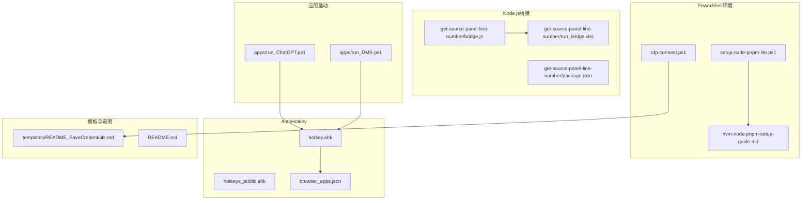
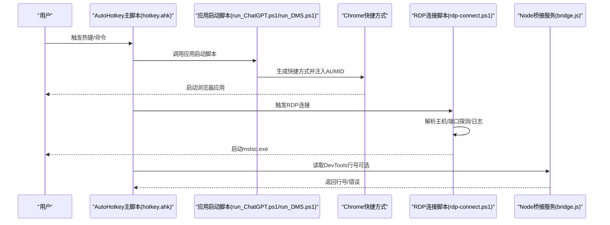
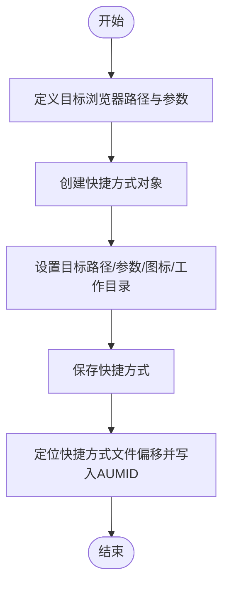
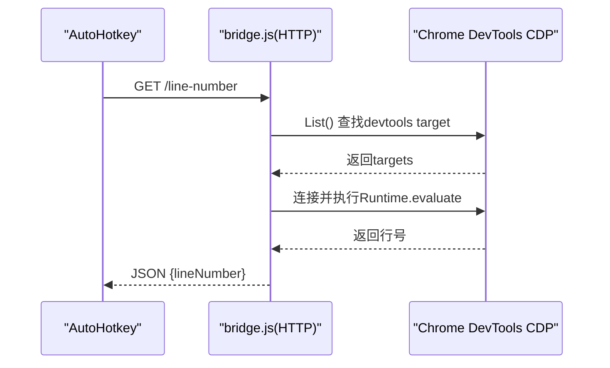
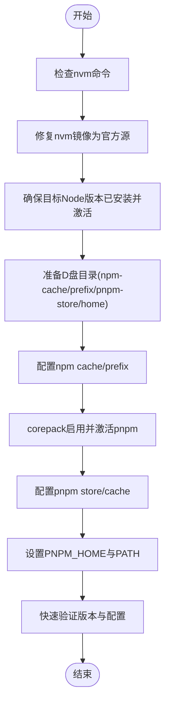
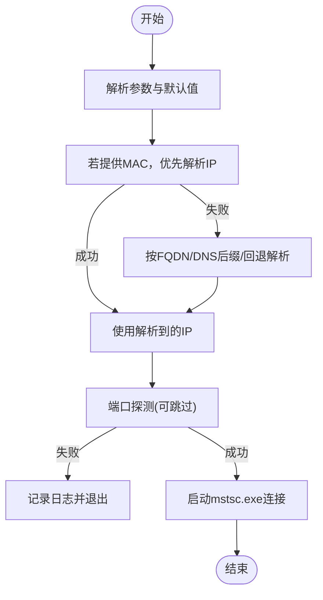
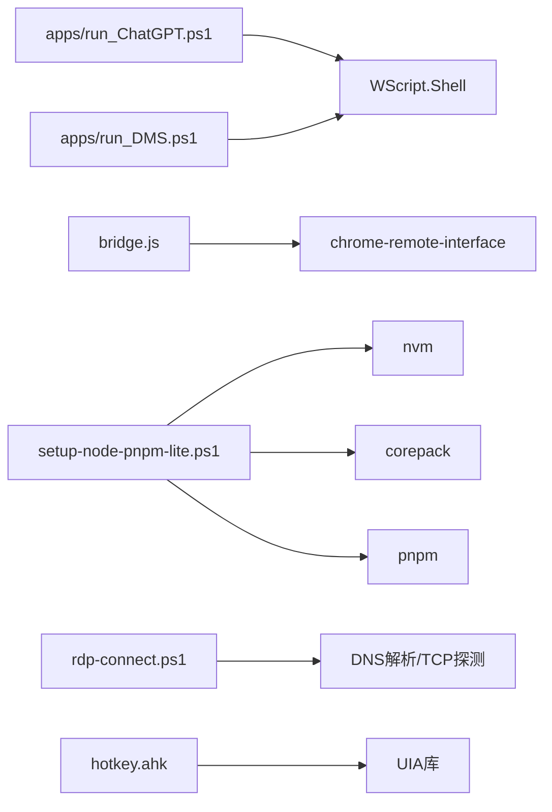

# PowerShell集成

<cite>
**本文引用的文件**
- [apps/run_ChatGPT.ps1](file://apps/run_ChatGPT.ps1)
- [apps/run_DMS.ps1](file://apps/run_DMS.ps1)
- [setup-node-pnpm-lite.ps1](file://setup-node-pnpm-lite.ps1)
- [nvm-node-pnpm-setup-guide.md](file://nvm-node-pnpm-setup-guide.md)
- [rdp-connect.ps1](file://rdp-connect.ps1)
- [get-source-panel-line-number/bridge.js](file://get-source-panel-line-number/bridge.js)
- [get-source-panel-line-number/package.json](file://get-source-panel-line-number/package.json)
- [get-source-panel-line-number/run_bridge.vbs](file://get-source-panel-line-number/run_bridge.vbs)
- [browser_apps.json](file://browser_apps.json)
- [hotkey.ahk](file://hotkey.ahk)
- [hotkeys_public.ahk](file://hotkeys_public.ahk)
- [templates/README_SaveCredentials.md](file://templates/README_SaveCredentials.md)
- [README.md](file://README.md)
</cite>

## 目录
1. [简介](#简介)
2. [项目结构](#项目结构)
3. [核心组件](#核心组件)
4. [架构总览](#架构总览)
5. [详细组件分析](#详细组件分析)
6. [依赖关系分析](#依赖关系分析)
7. [性能考虑](#性能考虑)
8. [故障排查指南](#故障排查指南)
9. [结论](#结论)
10. [附录](#附录)

## 简介
本文件面向需要在Windows环境中集成PowerShell脚本以启动浏览器应用（如ChatGPT、DMS）、管理Node.js与pnpm环境、以及通过RDP快速连接服务器的用户。文档覆盖以下主题：
- 应用启动脚本的编写与配置方法（PowerShell）
- ChatGPT与DMS应用的PowerShell脚本实现与参数传递
- 错误处理与日志记录机制
- Node.js环境设置与pnpm包管理器使用
- 脚本执行权限与安全配置
- 常见问题排查与性能优化建议

## 项目结构
该项目采用“功能模块化 + 工具链脚本”的组织方式：
- apps：应用启动脚本（生成快捷方式并注入AUMID）
- get-source-panel-line-number：基于Chrome DevTools Remote Debugging桥接服务（Node.js + Chrome-Remote-Interface）
- lib：AutoHotkey辅助库（JSON解析、UI自动化等）
- templates：RDP模板与凭据保存说明
- 根目录：PowerShell环境初始化脚本、RDP连接脚本、AutoHotkey主脚本及公共热键定义

图表来源
- [apps/run_ChatGPT.ps1:1-18](file://apps/run_ChatGPT.ps1#L1-L18)
- [apps/run_DMS.ps1:1-18](file://apps/run_DMS.ps1#L1-L18)
- [setup-node-pnpm-lite.ps1:1-121](file://setup-node-pnpm-lite.ps1#L1-L121)
- [nvm-node-pnpm-setup-guide.md:1-160](file://nvm-node-pnpm-setup-guide.md#L1-L160)
- [rdp-connect.ps1:1-242](file://rdp-connect.ps1#L1-L242)
- [get-source-panel-line-number/bridge.js:1-51](file://get-source-panel-line-number/bridge.js#L1-L51)
- [get-source-panel-line-number/package.json:1-6](file://get-source-panel-line-number/package.json#L1-L6)
- [get-source-panel-line-number/run_bridge.vbs:1-2](file://get-source-panel-line-number/run_bridge.vbs#L1-L2)
- [browser_apps.json:1-48](file://browser_apps.json#L1-L48)
- [hotkey.ahk:1-200](file://hotkey.ahk#L1-L200)
- [hotkeys_public.ahk:1-57](file://hotkeys_public.ahk#L1-L57)
- [templates/README_SaveCredentials.md:1-27](file://templates/README_SaveCredentials.md#L1-L27)
- [README.md:1-2](file://README.md#L1-L2)

章节来源
- [README.md:1-2](file://README.md#L1-L2)
- [hotkey.ahk:1-200](file://hotkey.ahk#L1-L200)

## 核心组件
- 应用启动脚本（PowerShell）：生成Chrome快捷方式并注入AUMID，便于任务视图与系统托盘识别
- Node.js桥接服务：通过Chrome DevTools Remote Debugging接口读取DevTools源码面板当前行号
- Node.js/pnpm环境初始化：统一Node版本、配置npm/pnpm缓存与全局目录、激活pnpm via corepack
- RDP连接脚本：支持短主机名解析、MAC优先解析、端口探测与日志记录
- AutoHotkey主脚本：权限自提升、任务计划注册、应用切换与窗口控制、公共热键

章节来源
- [apps/run_ChatGPT.ps1:1-18](file://apps/run_ChatGPT.ps1#L1-L18)
- [apps/run_DMS.ps1:1-18](file://apps/run_DMS.ps1#L1-L18)
- [get-source-panel-line-number/bridge.js:1-51](file://get-source-panel-line-number/bridge.js#L1-L51)
- [setup-node-pnpm-lite.ps1:1-121](file://setup-node-pnpm-lite.ps1#L1-L121)
- [rdp-connect.ps1:1-242](file://rdp-connect.ps1#L1-L242)
- [hotkey.ahk:1-200](file://hotkey.ahk#L1-L200)

## 架构总览
下图展示了从用户触发到最终应用启动/连接的端到端流程，涵盖PowerShell脚本、Node.js桥接、RDP连接与AutoHotkey集成。

图表来源
- [hotkey.ahk:1-200](file://hotkey.ahk#L1-L200)
- [apps/run_ChatGPT.ps1:1-18](file://apps/run_ChatGPT.ps1#L1-L18)
- [apps/run_DMS.ps1:1-18](file://apps/run_DMS.ps1#L1-L18)
- [rdp-connect.ps1:1-242](file://rdp-connect.ps1#L1-L242)
- [get-source-panel-line-number/bridge.js:1-51](file://get-source-panel-line-number/bridge.js#L1-L51)

## 详细组件分析

### 应用启动脚本（PowerShell）
- 目标：为ChatGPT与DMS生成Chrome快捷方式，并注入AUMID以便系统识别
- 关键点：
  - 指定浏览器可执行文件路径与启动参数（禁用扩展、同步、后台网络等）
  - 生成快捷方式并设置图标、工作目录
  - 通过二进制写入方式在快捷方式文件中注入AUMID（用于任务视图/系统托盘识别）

图表来源
- [apps/run_ChatGPT.ps1:1-18](file://apps/run_ChatGPT.ps1#L1-L18)
- [apps/run_DMS.ps1:1-18](file://apps/run_DMS.ps1#L1-L18)

章节来源
- [apps/run_ChatGPT.ps1:1-18](file://apps/run_ChatGPT.ps1#L1-L18)
- [apps/run_DMS.ps1:1-18](file://apps/run_DMS.ps1#L1-L18)

### Node.js桥接服务（DevTools行号读取）
- 目标：通过Chrome DevTools Remote Debugging接口读取当前源码面板的行号
- 关键点：
  - 使用chrome-remote-interface列出targets，筛选类型为devtools的页面
  - 连接到DevTools自身调试实例，执行JS表达式读取UI.panels.sources当前编辑器的起始行
  - 暴露HTTP服务监听3000端口，返回行号或错误信息
  - 通过VBS脚本启动Node服务

图表来源
- [get-source-panel-line-number/bridge.js:1-51](file://get-source-panel-line-number/bridge.js#L1-L51)
- [get-source-panel-line-number/run_bridge.vbs:1-2](file://get-source-panel-line-number/run_bridge.vbs#L1-L2)
- [get-source-panel-line-number/package.json:1-6](file://get-source-panel-line-number/package.json#L1-L6)

章节来源
- [get-source-panel-line-number/bridge.js:1-51](file://get-source-panel-line-number/bridge.js#L1-L51)
- [get-source-panel-line-number/run_bridge.vbs:1-2](file://get-source-panel-line-number/run_bridge.vbs#L1-L2)
- [get-source-panel-line-number/package.json:1-6](file://get-source-panel-line-number/package.json#L1-L6)

### Node.js与pnpm环境初始化（PowerShell）
- 目标：统一Node版本、配置npm/pnpm缓存与全局目录、激活pnpm via corepack
- 关键点：
  - 检查nvm命令是否存在，修复nvm镜像为官方源
  - 安装并切换到指定Node版本（如24.14.1）
  - 在D盘创建npm-cache、npm-global、pnpm-store、pnpm-home目录
  - 配置npm cache/prefix与pnpm store/cache
  - 通过corepack启用并激活pnpm，设置PNPM_HOME与PATH
  - 提供快速验证输出各工具版本与配置

图表来源
- [setup-node-pnpm-lite.ps1:1-121](file://setup-node-pnpm-lite.ps1#L1-L121)
- [nvm-node-pnpm-setup-guide.md:1-160](file://nvm-node-pnpm-setup-guide.md#L1-L160)

章节来源
- [setup-node-pnpm-lite.ps1:1-121](file://setup-node-pnpm-lite.ps1#L1-L121)
- [nvm-node-pnpm-setup-guide.md:1-160](file://nvm-node-pnpm-setup-guide.md#L1-L160)

### RDP连接脚本（PowerShell）
- 目标：支持短主机名解析、MAC优先解析、端口探测与日志记录
- 关键点：
  - 参数：TargetHost（默认17）、Mode（fast/safe）、SkipProbe、Mac
  - 日志：统一写入脚本根目录下的rdp.log
  - 解析策略：优先MAC（邻居表/ARP），其次DNS后缀解析，再回退ping
  - 端口探测：快速TCP探测3389端口
  - 启动：调用mstsc.exe全屏连接

图表来源
- [rdp-connect.ps1:1-242](file://rdp-connect.ps1#L1-L242)

章节来源
- [rdp-connect.ps1:1-242](file://rdp-connect.ps1#L1-L242)
- [templates/README_SaveCredentials.md:1-27](file://templates/README_SaveCredentials.md#L1-L27)

### AutoHotkey主脚本与公共热键
- 权限自提升与任务计划注册：以管理员权限运行并注册开机自启任务
- 应用切换与窗口控制：根据进程名/标题切换窗口显示/最小化/激活
- 公共热键：提供常用文本片段与SQL事务模板等

章节来源
- [hotkey.ahk:1-200](file://hotkey.ahk#L1-L200)
- [hotkeys_public.ahk:1-57](file://hotkeys_public.ahk#L1-L57)

## 依赖关系分析
- 应用启动脚本依赖WScript.Shell COM对象与文件二进制写入能力
- Node桥接服务依赖chrome-remote-interface与Node运行时
- 环境初始化脚本依赖nvm、corepack、npm、pnpm命令
- RDP脚本依赖.NET DNS解析、TCP客户端、ARP/邻居表查询
- AutoHotkey主脚本依赖UIA库与系统任务计划

图表来源
- [apps/run_ChatGPT.ps1:1-18](file://apps/run_ChatGPT.ps1#L1-L18)
- [apps/run_DMS.ps1:1-18](file://apps/run_DMS.ps1#L1-L18)
- [get-source-panel-line-number/bridge.js:1-51](file://get-source-panel-line-number/bridge.js#L1-L51)
- [setup-node-pnpm-lite.ps1:1-121](file://setup-node-pnpm-lite.ps1#L1-L121)
- [rdp-connect.ps1:1-242](file://rdp-connect.ps1#L1-L242)
- [hotkey.ahk:1-200](file://hotkey.ahk#L1-L200)

## 性能考虑
- 浏览器启动参数优化：禁用扩展、同步、后台网络、默认应用、组件更新、特定功能与挂起监控，减少启动开销与资源占用
- Node环境：将npm/pnpm缓存与全局目录迁移到D盘，避免C盘碎片化与IO瓶颈
- RDP解析：短主机名解析优先使用邻居表/ARP，减少DNS往返；快速模式跳过端口探测以加速
- AutoHotkey：窗口查找与切换尽量使用进程名/标题精确匹配，减少遍历成本

章节来源
- [apps/run_ChatGPT.ps1:1-18](file://apps/run_ChatGPT.ps1#L1-L18)
- [apps/run_DMS.ps1:1-18](file://apps/run_DMS.ps1#L1-L18)
- [setup-node-pnpm-lite.ps1:1-121](file://setup-node-pnpm-lite.ps1#L1-L121)
- [rdp-connect.ps1:1-242](file://rdp-connect.ps1#L1-L242)
- [hotkey.ahk:1-200](file://hotkey.ahk#L1-L200)

## 故障排查指南
- 应用启动脚本
  - 快捷方式未生成：检查目标路径与权限；确认WScript.Shell可用
  - AUMID未生效：确认快捷方式文件偏移写入成功；检查目标浏览器路径
- Node/pnpm环境
  - nvm未找到：确认nvm-windows已安装且在PATH中；修正镜像为官方源
  - Node版本不生效：检查nvm use后的当前版本；核对settings.txt中的path
  - pnpm不可用：确认corepack enable/prepare成功；检查PNPM_HOME与PATH
- RDP连接
  - 主机名无法解析：检查DNS后缀、本地IP段；必要时回退ping
  - 端口3389关闭：确认防火墙/ACL；使用快速模式跳过探测
  - 日志：查看脚本根目录rdp.log定位失败原因
- AutoHotkey
  - 无管理员权限：脚本会尝试自提升；若失败请手动以管理员运行
  - 任务计划未注册：检查schtasks命令执行结果与config.ini标记

章节来源
- [apps/run_ChatGPT.ps1:1-18](file://apps/run_ChatGPT.ps1#L1-L18)
- [apps/run_DMS.ps1:1-18](file://apps/run_DMS.ps1#L1-L18)
- [setup-node-pnpm-lite.ps1:1-121](file://setup-node-pnpm-lite.ps1#L1-L121)
- [nvm-node-pnpm-setup-guide.md:1-160](file://nvm-node-pnpm-setup-guide.md#L1-L160)
- [rdp-connect.ps1:1-242](file://rdp-connect.ps1#L1-L242)
- [hotkey.ahk:1-200](file://hotkey.ahk#L1-L200)

## 结论
本项目通过PowerShell脚本实现了浏览器应用的快速启动与系统识别、Node.js与pnpm环境的标准化配置、RDP连接的智能解析与日志记录，并结合AutoHotkey提供了高效的窗口控制与公共热键。整体方案具备良好的可维护性与扩展性，适合在Windows工作站中构建统一的开发与运维工具链。

## 附录
- 执行权限与安全配置
  - PowerShell执行策略：根据需要设置为RemoteSigned或Bypass（临时），建议遵循最小权限原则
  - 脚本签名与代码完整性：生产环境建议对关键脚本进行签名
  - 环境变量与PATH：变更后需重启终端或VS Code以生效
  - RDP凭据：参考模板说明，谨慎使用明文凭据，优先通过系统凭据管理器保存
- 常用命令与验证
  - Node/pnpm版本与配置：使用脚本提供的快速验证输出
  - DevTools桥接：启动run_bridge.vbs后访问http://localhost:3000/line-number
  - RDP连接：使用脚本参数TargetHost/Mode/Mac/SkipProbe进行测试

章节来源
- [nvm-node-pnpm-setup-guide.md:1-160](file://nvm-node-pnpm-setup-guide.md#L1-L160)
- [templates/README_SaveCredentials.md:1-27](file://templates/README_SaveCredentials.md#L1-L27)
- [get-source-panel-line-number/run_bridge.vbs:1-2](file://get-source-panel-line-number/run_bridge.vbs#L1-L2)
- [rdp-connect.ps1:1-242](file://rdp-connect.ps1#L1-L242)