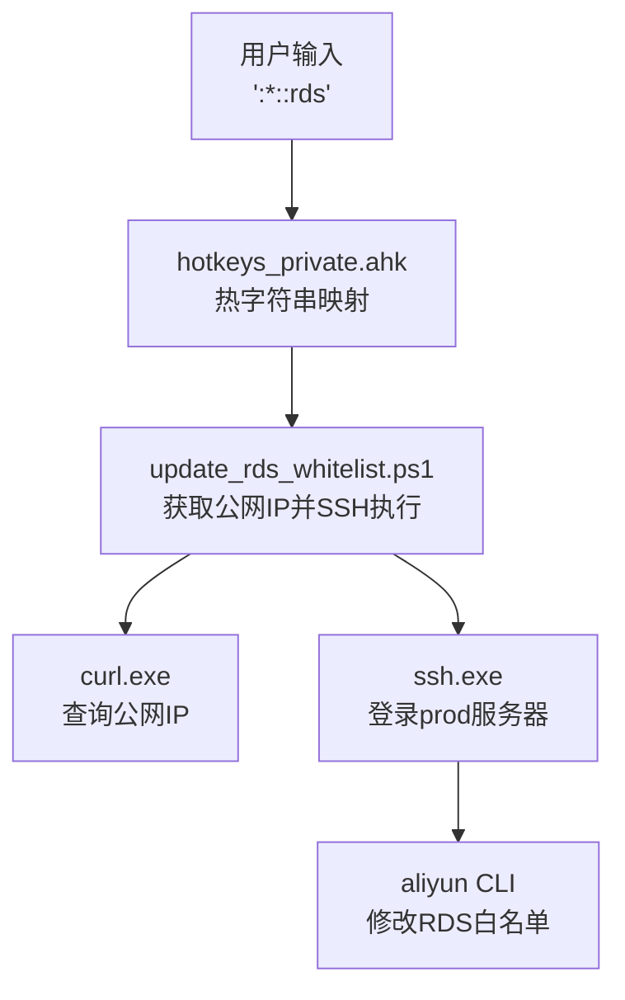
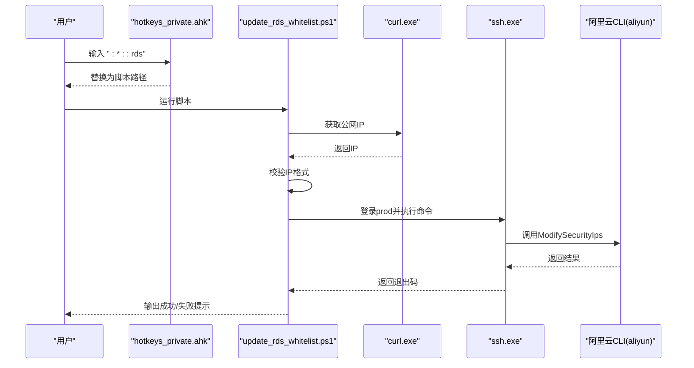
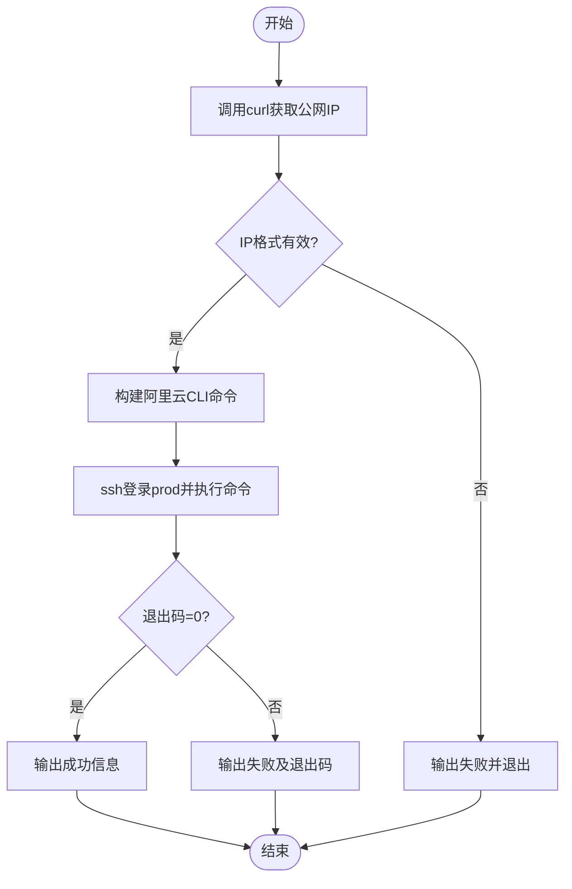
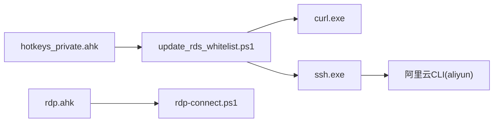

# RDS白名单管理工具

<cite>
**本文引用的文件**   
- [update_rds_whitelist.ps1](file://update_rds_whitelist.ps1)
- [hotkeys_private.ahk](file://hotkeys_private.ahk)
- [rdp-connect.ps1](file://rdp-connect.ps1)
- [rdp.ahk](file://rdp.ahk)
- [hotkey.ahk](file://hotkey.ahk)
- [browser_apps.json](file://browser_apps.json)
- [apps/run_ChatGPT.ps1](file://apps/run_ChatGPT.ps1)
- [apps/run_DMS.ps1](file://apps/run_DMS.ps1)
- [templates/README_SaveCredentials.md](file://templates/README_SaveCredentials.md)
</cite>

## 目录
1. [简介](#简介)
2. [项目结构](#项目结构)
3. [核心组件](#核心组件)
4. [架构总览](#架构总览)
5. [详细组件分析](#详细组件分析)
6. [依赖关系分析](#依赖关系分析)
7. [性能与可靠性](#性能与可靠性)
8. [故障排查指南](#故障排查指南)
9. [结论](#结论)
10. [附录](#附录)

## 简介
本仓库包含一个“RDS白名单管理工具”，其核心能力是通过本地脚本自动获取当前公网IP，并通过SSH登录目标服务器执行阿里云RDS安全组（白名单）更新命令。该工具以PowerShell脚本为主，配合AutoHotkey热字符串触发，形成一键式运维操作流。同时，仓库还包含远程桌面连接、应用快捷启动等辅助功能，便于在开发/运维场景中快速联动。

## 项目结构
- 顶层脚本
  - update_rds_whitelist.ps1：RDS白名单更新主流程
  - rdp-connect.ps1：RDP连接解析与探测（与本工具协同使用）
  - hotkeys_private.ahk：提供热字符串触发RDS白名单更新
- 辅助配置与说明
  - browser_apps.json：浏览器应用快捷方式配置（与本工具无直接耦合）
  - apps/run_ChatGPT.ps1 / apps/run_DMS.ps1：生成独立Chrome应用快捷方式（与本工具无直接耦合）
  - templates/README_SaveCredentials.md：RDP凭据保存说明（与本工具无直接耦合）
- 主程序入口
  - hotkey.ahk：全局热键与系统自动化框架（本工具通过热字符串间接触发）

图表来源
- [hotkeys_private.ahk:33](file://hotkeys_private.ahk#L33)
- [update_rds_whitelist.ps1:1-34](file://update_rds_whitelist.ps1#L1-L34)

章节来源
- [hotkeys_private.ahk:33](file://hotkeys_private.ahk#L33)
- [update_rds_whitelist.ps1:1-34](file://update_rds_whitelist.ps1#L1-L34)

## 核心组件
- 白名单更新脚本（update_rds_whitelist.ps1）
  - 功能：获取公网IP，构建阿里云CLI命令，通过SSH在prod服务器上执行，完成RDS白名单追加。
  - 关键步骤：
    - 调用外部工具curl获取公网IP
    - 校验IP格式
    - 拼接阿里云CLI命令（RegionId、DBInstanceId、SecurityIps、ModifyMode）
    - 通过ssh登录prod并执行命令
    - 根据退出码输出成功或失败信息
- 热字符串触发器（hotkeys_private.ahk）
  - 功能：定义热字符串“rds”映射到白名单更新脚本路径，用户在任意文本框输入“rds”后自动替换为脚本路径并可执行。
- 远程桌面辅助（rdp-connect.ps1、rdp.ahk）
  - 功能：主机名解析、端口探测、mstsc启动；与RDS白名单更新场景可联动（先更新白名单再连RDS）。

章节来源
- [update_rds_whitelist.ps1:1-34](file://update_rds_whitelist.ps1#L1-L34)
- [hotkeys_private.ahk:33](file://hotkeys_private.ahk#L33)
- [rdp-connect.ps1:1-242](file://rdp-connect.ps1#L1-L242)
- [rdp.ahk:1-417](file://rdp.ahk#L1-L417)

## 架构总览
整体流程由“用户输入 → 热字符串替换 → 脚本执行 → 外部工具调用 → 云API变更”构成。

图表来源
- [hotkeys_private.ahk:33](file://hotkeys_private.ahk#L33)
- [update_rds_whitelist.ps1:1-34](file://update_rds_whitelist.ps1#L1-L34)

## 详细组件分析

### 白名单更新脚本（update_rds_whitelist.ps1）
- 职责
  - 获取公网IP并校验
  - 构建阿里云RDS白名单更新命令
  - 通过SSH在prod服务器执行命令
  - 输出执行结果
- 关键逻辑
  - 使用curl请求公网IP服务
  - 正则校验IPv4格式
  - 拼接阿里云CLI参数（区域、实例ID、IP列表、追加模式）
  - 通过ssh -t -p 22 prod执行命令
  - 依据退出码判断成功/失败
- 错误处理
  - IP获取失败时立即退出
  - 命令执行失败时输出退出码
- 扩展点
  - 支持多环境（如dev/prod）通过不同别名或参数切换
  - 支持批量IP或网段（需调整命令参数）

图表来源
- [update_rds_whitelist.ps1:1-34](file://update_rds_whitelist.ps1#L1-L34)

章节来源
- [update_rds_whitelist.ps1:1-34](file://update_rds_whitelist.ps1#L1-L34)

### 热字符串触发器（hotkeys_private.ahk）
- 职责
  - 将“rds”热字符串映射到白名单更新脚本路径，方便在任何编辑器中快速触发
- 关键点
  - 使用AutoHotkey的`:*:`语法进行即时替换
  - 替换结果为脚本绝对路径，可直接执行
- 注意事项
  - 若需要更安全的执行方式，可在替换后附加执行参数或包装为批处理

章节来源
- [hotkeys_private.ahk:33](file://hotkeys_private.ahk#L33)

### 远程桌面辅助（rdp-connect.ps1、rdp.ahk）
- 职责
  - 主机名解析（支持短主机名、DNS后缀、局域网子网探测）
  - TCP端口探测（3389）
  - 启动mstsc建立RDP连接
  - 剪贴板信号机制用于最小化本地mstsc窗口
- 与本工具的协作
  - 先执行白名单更新，再使用RDP连接目标服务器，提升连通性成功率

章节来源
- [rdp-connect.ps1:1-242](file://rdp-connect.ps1#L1-L242)
- [rdp.ahk:1-417](file://rdp.ahk#L1-L417)

### 其他辅助模块（非核心但相关）
- 浏览器应用快捷方式（browser_apps.json、apps/run_ChatGPT.ps1、apps/run_DMS.ps1）
  - 用于生成独立Chrome应用快捷方式，便于快速打开特定Web应用
- RDP凭据保存说明（templates/README_SaveCredentials.md）
  - 指导如何保存RDP凭据，避免每次输入密码

章节来源
- [browser_apps.json:1-48](file://browser_apps.json#L1-L48)
- [apps/run_ChatGPT.ps1:1-18](file://apps/run_ChatGPT.ps1#L1-L18)
- [apps/run_DMS.ps1:1-18](file://apps/run_DMS.ps1#L1-L18)
- [templates/README_SaveCredentials.md:1-27](file://templates/README_SaveCredentials.md#L1-L27)

## 依赖关系分析
- 外部依赖
  - curl.exe：获取公网IP
  - ssh.exe：登录prod服务器
  - aliyun CLI：修改RDS白名单
- 内部依赖
  - hotkeys_private.ahk 触发 update_rds_whitelist.ps1
  - rdp.ahk 与 rdp-connect.ps1 提供RDP连接能力（可选）

图表来源
- [hotkeys_private.ahk:33](file://hotkeys_private.ahk#L33)
- [update_rds_whitelist.ps1:1-34](file://update_rds_whitelist.ps1#L1-L34)
- [rdp.ahk:1-417](file://rdp.ahk#L1-L417)
- [rdp-connect.ps1:1-242](file://rdp-connect.ps1#L1-L242)

章节来源
- [hotkeys_private.ahk:33](file://hotkeys_private.ahk#L33)
- [update_rds_whitelist.ps1:1-34](file://update_rds_whitelist.ps1#L1-L34)
- [rdp.ahk:1-417](file://rdp.ahk#L1-L417)
- [rdp-connect.ps1:1-242](file://rdp-connect.ps1#L1-L242)

## 性能与可靠性
- 网络依赖
  - 公网IP查询依赖外部HTTP服务，建议增加重试与超时控制
  - SSH连接依赖prod服务器的可达性与认证配置
- 幂等性
  - 白名单更新采用追加模式，重复执行不会覆盖已有规则
- 日志与可观测性
  - 建议在脚本中增加结构化日志（时间戳、IP、退出码、错误堆栈）
- 安全性
  - 避免在脚本中硬编码敏感信息（如私钥），建议使用SSH密钥或凭据管理器
  - 对公网IP输入进行严格校验，防止注入

[本节为通用建议，不直接分析具体文件]

## 故障排查指南
- 无法获取公网IP
  - 检查curl.exe是否可用、网络是否通畅
  - 查看脚本输出的失败信息与退出码
- SSH登录失败
  - 确认prod别名已正确配置（~/.ssh/config或等效配置）
  - 检查端口、用户名、密钥权限
- 阿里云CLI执行失败
  - 确认已安装并配置aliyun CLI
  - 核对RegionId、DBInstanceId、SecurityIps参数
- 热字符串未生效
  - 确认AutoHotkey正在运行且热字符串未被禁用
  - 检查hotkeys_private.ahk中的映射是否正确

章节来源
- [update_rds_whitelist.ps1:1-34](file://update_rds_whitelist.ps1#L1-L34)
- [hotkeys_private.ahk:33](file://hotkeys_private.ahk#L33)

## 结论
本工具以简洁的PowerShell脚本为核心，结合AutoHotkey的热字符串触发，实现了“一键更新RDS白名单”的自动化流程。通过外部工具链（curl、ssh、aliyun CLI）完成从公网IP获取到云资源变更的闭环。配合RDP连接辅助脚本，可进一步提升运维效率与稳定性。建议后续增强日志记录、错误重试与安全加固，以满足生产环境的更高要求。

[本节为总结性内容，不直接分析具体文件]

## 附录
- 相关参考
  - RDP凭据保存说明：[templates/README_SaveCredentials.md](file://templates/README_SaveCredentials.md)
  - 浏览器应用快捷方式配置：[browser_apps.json](file://browser_apps.json)
  - Chrome应用快捷方式生成脚本：[apps/run_ChatGPT.ps1](file://apps/run_ChatGPT.ps1)、[apps/run_DMS.ps1](file://apps/run_DMS.ps1)

章节来源
- [templates/README_SaveCredentials.md:1-27](file://templates/README_SaveCredentials.md#L1-L27)
- [browser_apps.json:1-48](file://browser_apps.json#L1-L48)
- [apps/run_ChatGPT.ps1:1-18](file://apps/run_ChatGPT.ps1#L1-L18)
- [apps/run_DMS.ps1:1-18](file://apps/run_DMS.ps1#L1-L18)