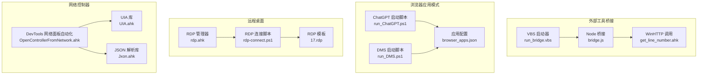
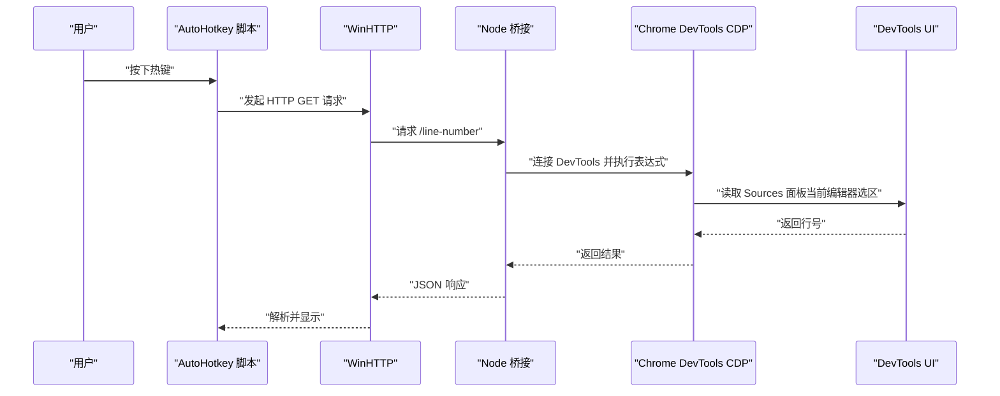
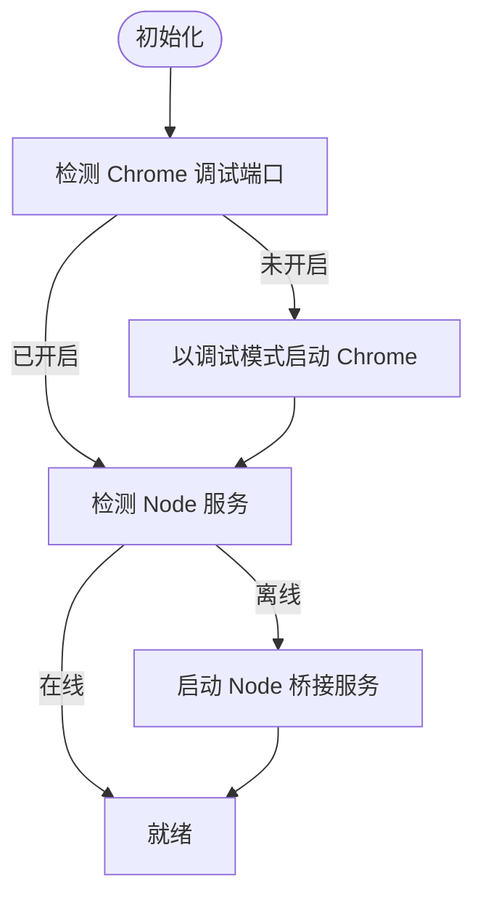
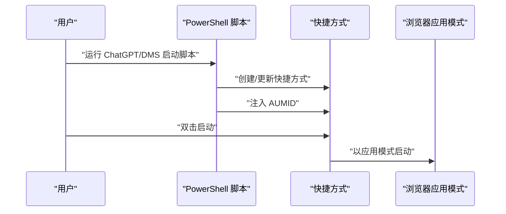
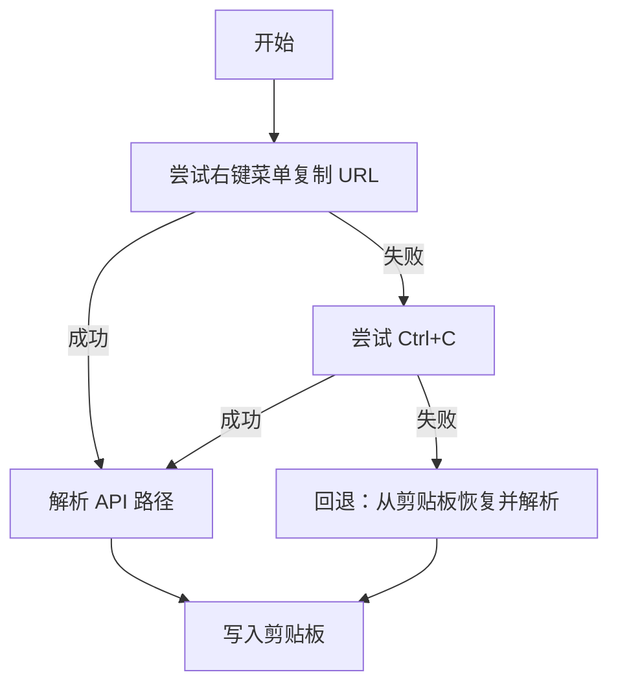
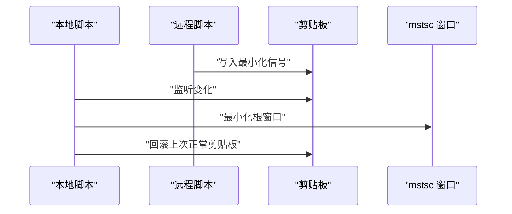
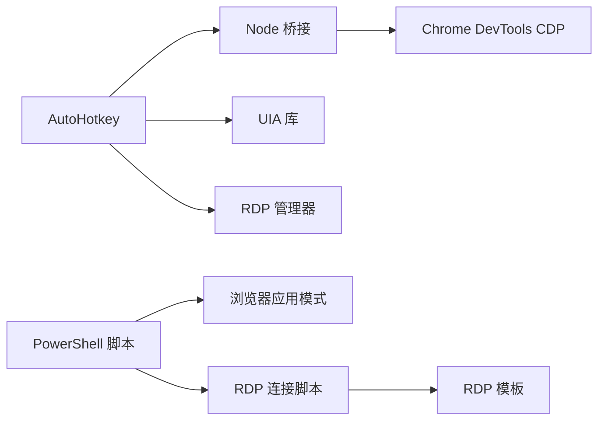

# 外部工具集成

<cite>
**本文引用的文件**
- [README.md](file://README.md)
- [bridge.js](file://get-source-panel-line-number/bridge.js)
- [package.json](file://get-source-panel-line-number/package.json)
- [get_line_number.ahk](file://get-source-panel-line-number/get_line_number.ahk)
- [run_bridge.vbs](file://get-source-panel-line-number/run_bridge.vbs)
- [run_ChatGPT.ps1](file://apps/run_ChatGPT.ps1)
- [run_DMS.ps1](file://apps/run_DMS.ps1)
- [browser_apps.json](file://browser_apps.json)
- [OpenControllerFromNetwork.ahk](file://OpenControllerFromNetwork.ahk)
- [UIA.ahk](file://lib/UIA.ahk)
- [Jxon.ahk](file://lib/Jxon.ahk)
- [rdp.ahk](file://rdp.ahk)
- [rdp-connect.ps1](file://rdp-connect.ps1)
- [17.rdp](file://templates/17.rdp)
- [setup-node-pnpm-lite.ps1](file://setup-node-pnpm-lite.ps1)
- [nvm-node-pnpm-setup-guide.md](file://nvm-node-pnpm-setup-guide.md)
</cite>

## 目录
1. [简介](#简介)
2. [项目结构](#项目结构)
3. [核心组件](#核心组件)
4. [架构总览](#架构总览)
5. [详细组件分析](#详细组件分析)
6. [依赖关系分析](#依赖关系分析)
7. [性能考量](#性能考量)
8. [故障排除指南](#故障排除指南)
9. [结论](#结论)
10. [附录](#附录)

## 简介
本文件面向“hotkey”项目的外部工具集成，围绕以下主题展开：
- Node.js 桥接工具的使用与配置：如何启动、调用与诊断。
- PowerShell 脚本集成机制：浏览器应用模式、RDP 连接与探测。
- 网络控制器（DevTools 网络面板）的自动化能力与稳定性策略。
- 远程桌面支持：本地最小化信号、剪贴板桥接、RDP 模板与连接脚本。
- 工具间通信机制与数据交换格式：HTTP/JSON、WinHTTP、UIA、剪贴板。
- 最佳实践、故障排除与性能优化建议。

## 项目结构
该项目采用“功能模块化 + 工具脚本”的组织方式：
- get-source-panel-line-number：Node.js 桥接，用于从 DevTools 获取当前源码面板行号。
- apps：浏览器应用模式启动脚本（ChatGPT/DMS）。
- lib：UIA 与轻量 JSON 解析库。
- templates：RDP 模板文件。
- rdp.ahk / rdp-connect.ps1：远程桌面自动化与连接脚本。
- OpenControllerFromNetwork.ahk：DevTools 网络面板 URL 复制与解析。
- setup-node-pnpm-lite.ps1 与 nvm-node-pnpm-setup-guide.md：Node/pnpm 环境准备与配置。

图示来源
- [bridge.js](file://get-source-panel-line-number/bridge.js)
- [get_line_number.ahk](file://get-source-panel-line-number/get_line_number.ahk)
- [run_bridge.vbs](file://get-source-panel-line-number/run_bridge.vbs)
- [run_ChatGPT.ps1](file://apps/run_ChatGPT.ps1)
- [run_DMS.ps1](file://apps/run_DMS.ps1)
- [browser_apps.json](file://browser_apps.json)
- [rdp.ahk](file://rdp.ahk)
- [rdp-connect.ps1](file://rdp-connect.ps1)
- [17.rdp](file://templates/17.rdp)
- [OpenControllerFromNetwork.ahk](file://OpenControllerFromNetwork.ahk)
- [UIA.ahk](file://lib/UIA.ahk)
- [Jxon.ahk](file://lib/Jxon.ahk)

章节来源
- [README.md](file://README.md)
- [bridge.js](file://get-source-panel-line-number/bridge.js)
- [get_line_number.ahk](file://get-source-panel-line-number/get_line_number.ahk)
- [run_bridge.vbs](file://get-source-panel-line-number/run_bridge.vbs)
- [run_ChatGPT.ps1](file://apps/run_ChatGPT.ps1)
- [run_DMS.ps1](file://apps/run_DMS.ps1)
- [browser_apps.json](file://browser_apps.json)
- [rdp.ahk](file://rdp.ahk)
- [rdp-connect.ps1](file://rdp-connect.ps1)
- [17.rdp](file://templates/17.rdp)
- [OpenControllerFromNetwork.ahk](file://OpenControllerFromNetwork.ahk)
- [UIA.ahk](file://lib/UIA.ahk)
- [Jxon.ahk](file://lib/Jxon.ahk)

## 核心组件
- Node.js 桥接（DevTools 行号获取）
  - 通过 chrome-remote-interface 连接 Chrome DevTools，定位 Sources 面板当前编辑器的选区起始行，暴露 HTTP 接口返回 JSON。
  - AutoHotkey 通过 WinHTTP 发起 GET 请求，解析响应并显示提示。
- 浏览器应用模式（ChatGPT/DMS）
  - PowerShell 脚本生成快捷方式并注入 AUMID，以支持任务视图/开始菜单识别。
  - browser_apps.json 统一描述浏览器路径、公共参数与应用清单。
- 网络控制器（DevTools 网络面板）
  - 基于 UIA 定位网络请求行，优先右键菜单复制 URL，其次回退 Ctrl+C，最后解析 API 路径。
  - 支持性能日志与自适应重试策略。
- 远程桌面（RDP）
  - AutoHotkey 监听剪贴板变化，接收“最小化信号”后在本地最小化 mstsc 窗口。
  - PowerShell 脚本进行主机名解析、MAC/IP 映射、端口探测与 mstsc 启动。
  - RDP 模板集中管理连接参数。

章节来源
- [bridge.js](file://get-source-panel-line-number/bridge.js)
- [get_line_number.ahk](file://get-source-panel-line-number/get_line_number.ahk)
- [run_ChatGPT.ps1](file://apps/run_ChatGPT.ps1)
- [run_DMS.ps1](file://apps/run_DMS.ps1)
- [browser_apps.json](file://browser_apps.json)
- [OpenControllerFromNetwork.ahk](file://OpenControllerFromNetwork.ahk)
- [UIA.ahk](file://lib/UIA.ahk)
- [Jxon.ahk](file://lib/Jxon.ahk)
- [rdp.ahk](file://rdp.ahk)
- [rdp-connect.ps1](file://rdp-connect.ps1)
- [17.rdp](file://templates/17.rdp)

## 架构总览
外部工具通过多层桥接实现协同：
- AutoHotkey 热键触发 → WinHTTP/WinAPI → Node.js 桥接 → Chrome DevTools CDP → 返回 JSON。
- AutoHotkey 热键触发 → PowerShell 脚本 → 浏览器应用模式 → 快捷方式/AUMID。
- AutoHotkey 热键触发 → UIA 定位 → DevTools 网络面板 → 剪贴板 → 解析路径。
- AutoHotkey 热键触发 → 剪贴板信号 → RDP 管理器 → mstsc 最小化。

图示来源
- [get_line_number.ahk](file://get-source-panel-line-number/get_line_number.ahk)
- [bridge.js](file://get-source-panel-line-number/bridge.js)

## 详细组件分析

### Node.js 桥接工具（DevTools 行号）
- 功能要点
  - 自动发现 DevTools 目标并建立 CDP 连接。
  - 在 DevTools 内部上下文执行表达式，读取当前源码面板编辑器的选区起始行。
  - 暴露 HTTP 服务，返回 JSON 结构。
- 配置与启动
  - 默认监听端口与路径：localhost:3000/line-number。
  - 可通过 VBS 或命令行启动 Node 脚本。
  - AutoHotkey 启动前会检测 Chrome 调试端口与 Node 服务状态。
- 数据交换格式
  - 请求：HTTP GET /line-number
  - 响应：JSON 对象，包含行号或错误信息。
- 热键绑定
  - F10 初始化环境（启动 Chrome 与 Node 服务）。
  - Ctrl+Alt+L 获取行号并提示。
  - Shift+F10 强制重启 Chrome 调试实例。
  - Ctrl+F12 进行全链路诊断（进程、端口、服务）。

图示来源
- [get_line_number.ahk](file://get-source-panel-line-number/get_line_number.ahk)
- [run_bridge.vbs](file://get-source-panel-line-number/run_bridge.vbs)
- [bridge.js](file://get-source-panel-line-number/bridge.js)

章节来源
- [bridge.js](file://get-source-panel-line-number/bridge.js)
- [package.json](file://get-source-panel-line-number/package.json)
- [get_line_number.ahk](file://get-source-panel-line-number/get_line_number.ahk)
- [run_bridge.vbs](file://get-source-panel-line-number/run_bridge.vbs)

### 浏览器应用模式（ChatGPT/DMS）
- 功能要点
  - 通过 PowerShell 生成快捷方式，设置目标、参数、工作目录与图标。
  - 注入 AUMID，便于任务视图/开始菜单识别与管理。
  - browser_apps.json 统一维护浏览器路径、公共参数与应用清单。
- 使用建议
  - 优先使用统一配置文件，减少硬编码。
  - 为每个应用设置唯一 AUMID，避免冲突。
  - 使用“应用模式”参数启动，减少干扰标签页。

图示来源
- [run_ChatGPT.ps1](file://apps/run_ChatGPT.ps1)
- [run_DMS.ps1](file://apps/run_DMS.ps1)
- [browser_apps.json](file://browser_apps.json)

章节来源
- [run_ChatGPT.ps1](file://apps/run_ChatGPT.ps1)
- [run_DMS.ps1](file://apps/run_DMS.ps1)
- [browser_apps.json](file://browser_apps.json)

### 网络控制器（DevTools 网络面板）
- 功能要点
  - 优先通过右键菜单复制 URL，其次回退 Ctrl+C，最后解析 API 路径。
  - 基于 UIA 定位网络请求行，支持缓存锚点、自适应重试与全屏/嵌套窗口兼容。
  - 性能日志记录，便于问题定位。
- 关键流程
  - 获取选中请求 URL → 解析 API 路径 → 写入剪贴板供后续使用。
- 参数与行为
  - 多种重试策略与等待时间，适配不同机器性能与菜单渲染速度。
  - 支持“三连 C”快速复制兜底，失败后自动切换为菜单项定位。

图示来源
- [OpenControllerFromNetwork.ahk](file://OpenControllerFromNetwork.ahk)
- [UIA.ahk](file://lib/UIA.ahk)
- [Jxon.ahk](file://lib/Jxon.ahk)

章节来源
- [OpenControllerFromNetwork.ahk](file://OpenControllerFromNetwork.ahk)
- [UIA.ahk](file://lib/UIA.ahk)
- [Jxon.ahk](file://lib/Jxon.ahk)

### 远程桌面支持（RDP）
- 功能要点
  - 剪贴板桥接：本地收到“最小化信号”后最小化 mstsc 窗口并回滚剪贴板。
  - 主机映射：根据当前主机名映射到目标主机短名。
  - 连接脚本：解析主机名/短名、MAC 映射、端口探测、启动 mstsc。
  - RDP 模板：集中管理连接参数（分辨率、音频、驱动器重定向等）。
- 热键与交互
  - Win+\：快速直连（跳过探测）。
  - Ctrl+Win+\：安全探测（DNS + 3389 检测）。
  - Win+]：若当前是远程桌面窗口，最小化该窗口。
  - Ctrl+Alt+Shift+M：调试当前窗口/根窗口信息。

图示来源
- [rdp.ahk](file://rdp.ahk)

章节来源
- [rdp.ahk](file://rdp.ahk)
- [rdp-connect.ps1](file://rdp-connect.ps1)
- [17.rdp](file://templates/17.rdp)

## 依赖关系分析
- Node.js 桥接
  - 依赖 chrome-remote-interface 与 Node 内置 HTTP 模块。
  - AutoHotkey 依赖 WinHttp.WinHttpRequest COM 组件。
- 浏览器应用模式
  - 依赖 WScript.Shell COM 与文件系统写入。
  - 依赖浏览器应用模式参数与 AUMID。
- 网络控制器
  - 依赖 UIA 库进行元素定位与事件处理。
  - 依赖 JSON 解析库进行配置加载。
- 远程桌面
  - 依赖剪贴板事件回调与窗口句柄操作。
  - 依赖 PowerShell 的 TCP 探测与 DNS 解析。

图示来源
- [bridge.js](file://get-source-panel-line-number/bridge.js)
- [get_line_number.ahk](file://get-source-panel-line-number/get_line_number.ahk)
- [UIA.ahk](file://lib/UIA.ahk)
- [Jxon.ahk](file://lib/Jxon.ahk)
- [rdp.ahk](file://rdp.ahk)
- [rdp-connect.ps1](file://rdp-connect.ps1)
- [17.rdp](file://templates/17.rdp)

章节来源
- [package.json](file://get-source-panel-line-number/package.json)
- [browser_apps.json](file://browser_apps.json)
- [UIA.ahk](file://lib/UIA.ahk)
- [Jxon.ahk](file://lib/Jxon.ahk)
- [rdp.ahk](file://rdp.ahk)
- [rdp-connect.ps1](file://rdp-connect.ps1)
- [17.rdp](file://templates/17.rdp)

## 性能考量
- DevTools 网络面板自动化
  - 局部锚点缓存与宽范围扫描结合，减少全屏扫描概率。
  - 自适应重试与等待时间，平衡成功率与延迟。
  - 性能日志输出，便于定位瓶颈。
- Node.js 桥接
  - 服务启动后复用，避免频繁重启。
  - 超时控制与异常捕获，防止阻塞。
- RDP 连接
  - TCP 快速探测与 DNS/ARP 回退，缩短解析时间。
  - 全屏模式参数减少窗口切换开销。

[本节为通用指导，无需列出具体文件来源]

## 故障排除指南
- Node.js 桥接
  - 症状：Bridge Offline
    - 检查 Node 服务是否启动、端口是否被占用。
    - 使用 Ctrl+F12 进行链路诊断。
  - 症状：Chrome 正在运行但未开启调试端口
    - 使用 Shift+F10 强制重启调试实例。
- 浏览器应用模式
  - 症状：应用未出现在任务视图/开始菜单
    - 检查 AUMID 是否正确注入。
    - 确认快捷方式保存路径与图标设置。
- 网络控制器
  - 症状：无法复制 URL
    - 优先右键菜单失败时，检查菜单项名称评分与缓存有效性。
    - 回退到 Ctrl+C 与剪贴板恢复流程。
- RDP
  - 症状：远程最小化无效
    - 确认本地会话与远程会话区分，确保信号正确写入剪贴板。
  - 症状：连接失败
    - 使用安全模式进行 DNS + 3389 探测，确认网络可达性。

章节来源
- [get_line_number.ahk](file://get-source-panel-line-number/get_line_number.ahk)
- [run_ChatGPT.ps1](file://apps/run_ChatGPT.ps1)
- [run_DMS.ps1](file://apps/run_DMS.ps1)
- [OpenControllerFromNetwork.ahk](file://OpenControllerFromNetwork.ahk)
- [rdp.ahk](file://rdp.ahk)
- [rdp-connect.ps1](file://rdp-connect.ps1)

## 结论
本项目通过 AutoHotkey 与多种外部工具的协同，实现了：
- DevTools 行号获取的自动化桥接；
- 浏览器应用模式的一致化启动；
- DevTools 网络面板的高鲁棒性自动化；
- 远程桌面的本地最小化与连接自动化。
建议在生产环境中：
- 统一配置管理（如 browser_apps.json、RDP 模板）；
- 为关键流程添加性能日志；
- 对外设/网络波动做好重试与降级策略。

[本节为总结性内容，无需列出具体文件来源]

## 附录

### Node.js 环境准备与配置
- 使用 PowerShell 脚本一键完成：
  - nvm 镜像修复、Node 版本安装与启用。
  - npm/pnpm 缓存与全局目录迁移至 D 盘。
  - corepack 启用 pnpm，设置 store/cache。
  - PNPM_HOME 环境变量与 PATH 更新。
- 参考文档：nvm-node-pnpm-setup-guide.md

章节来源
- [setup-node-pnpm-lite.ps1](file://setup-node-pnpm-lite.ps1)
- [nvm-node-pnpm-setup-guide.md](file://nvm-node-pnpm-setup-guide.md)