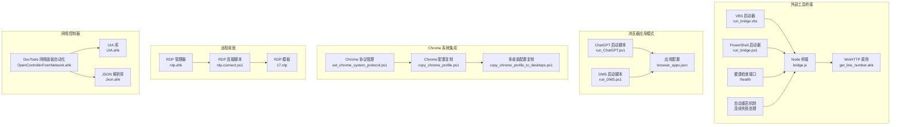
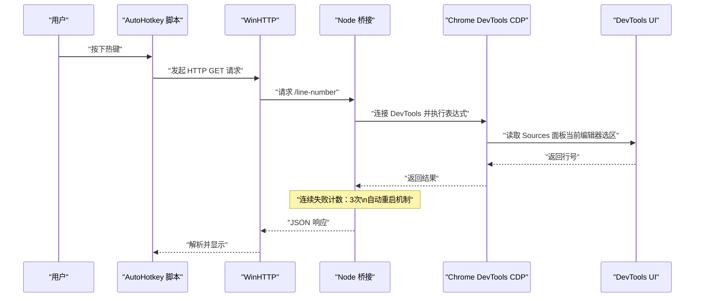
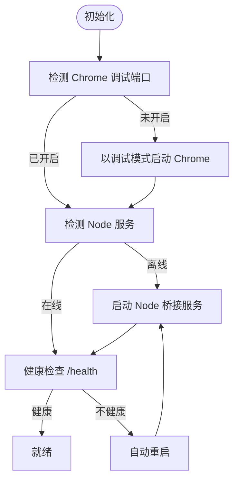
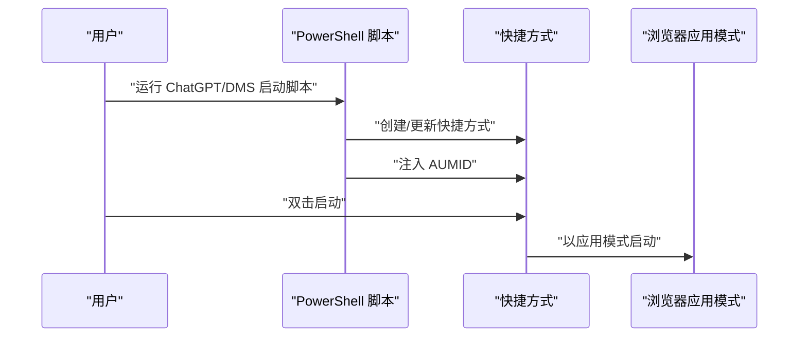
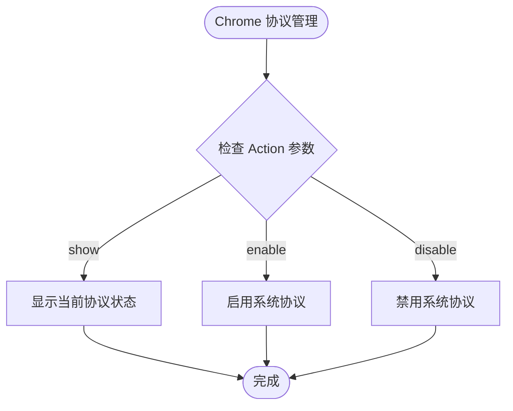
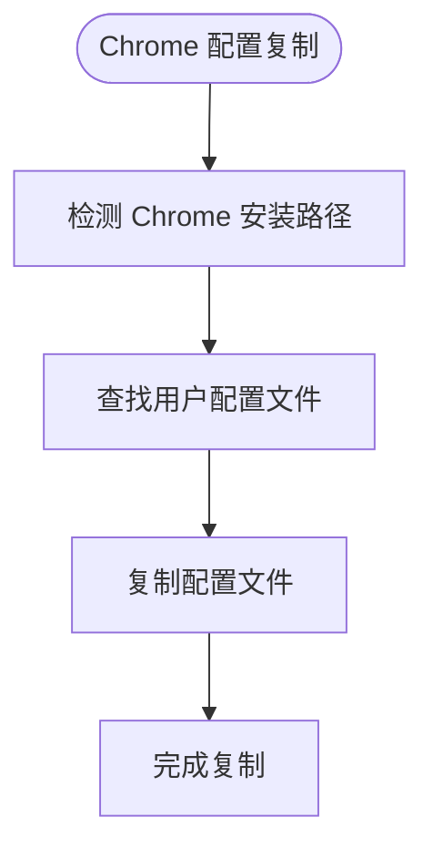
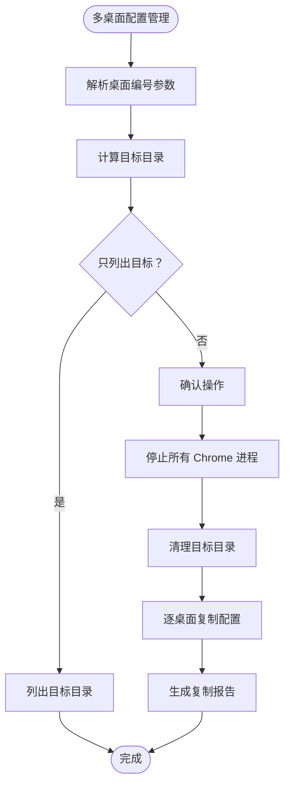
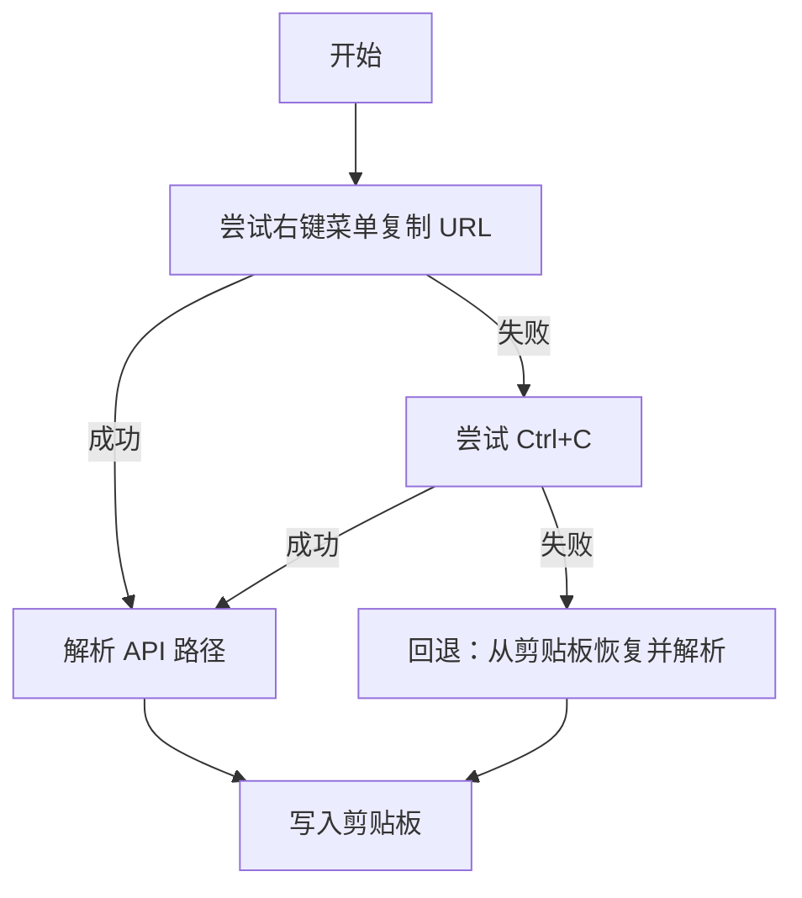
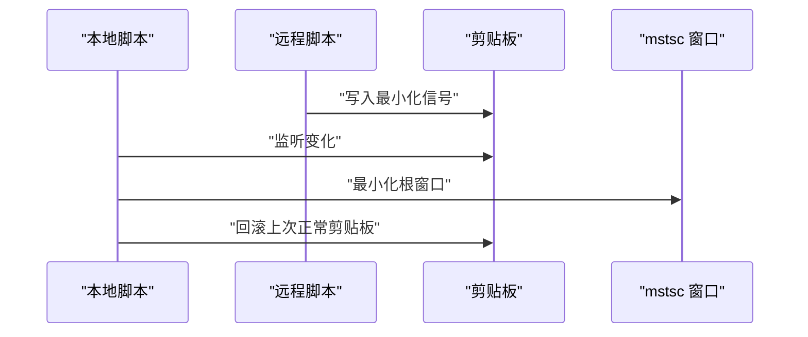
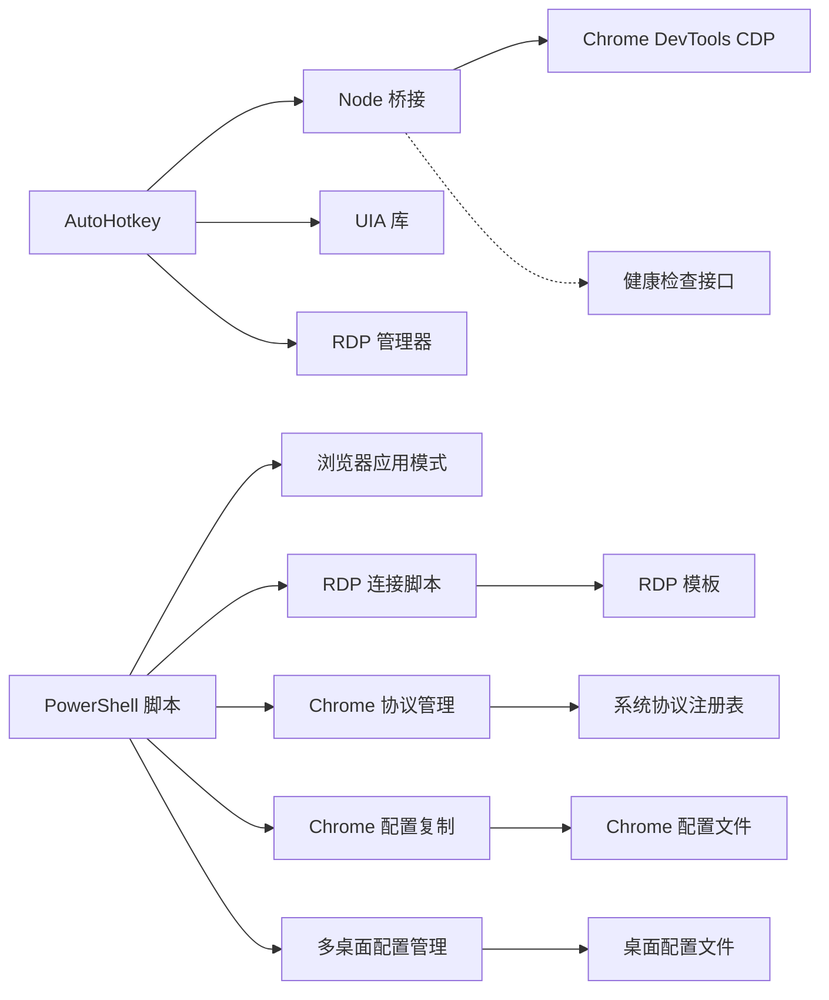

# 外部工具集成

<cite>
**本文档引用的文件**
- [README.md](file://README.md)
- [bridge.js](file://get-source-panel-line-number/bridge.js)
- [package.json](file://get-source-panel-line-number/package.json)
- [get_line_number.ahk](file://get-source-panel-line-number/get_line_number.ahk)
- [run_bridge.vbs](file://get-source-panel-line-number/run_bridge.vbs)
- [run_bridge.ps1](file://run_bridge.ps1)
- [run_ChatGPT.ps1](file://apps/run_ChatGPT.ps1)
- [run_DMS.ps1](file://apps/run_DMS.ps1)
- [browser_apps.json](file://browser_apps.json)
- [OpenControllerFromNetwork.ahk](file://OpenControllerFromNetwork.ahk)
- [UIA.ahk](file://lib/UIA.ahk)
- [Jxon.ahk](file://lib/Jxon.ahk)
- [rdp.ahk](file://rdp.ahk)
- [rdp-connect.ps1](file://rdp-connect.ps1)
- [17.rdp](file://templates/17.rdp)
- [setup-node-pnpm-lite.ps1](file://setup-node-pnpm-lite.ps1)
- [nvm-node-pnpm-setup-guide.md](file://nvm-node-pnpm-setup-guide.md)
- [set_chrome_system_protocol.ps1](file://set_chrome_system_protocol.ps1)
- [copy_chrome_profile.ps1](file://copy_chrome_profile.ps1)
- [copy_chrome_profile_to_desktops.ps1](file://copy_chrome_profile_to_desktops.ps1)
</cite>

## 更新摘要
**变更内容**
- 优化源面板行号获取桥接的稳定性：新增连续失败自动重启机制和缓存回退策略
- 增强HTTP服务器健壮性：改进端口占用检测和健康检查机制
- 完善自动重启机制：通过健康检查接口实现服务自愈能力
- 更新Node.js桥接工具的错误处理和超时控制

## 目录
1. [简介](#简介)
2. [项目结构](#项目结构)
3. [核心组件](#核心组件)
4. [架构总览](#架构总览)
5. [详细组件分析](#详细组件分析)
6. [依赖关系分析](#依赖关系分析)
7. [性能考量](#性能考量)
8. [故障排除指南](#故障排除指南)
9. [结论](#结论)
10. [附录](#附录)

## 简介
本文件面向"hotkey"项目的外部工具集成，围绕以下主题展开：
- Node.js 桥接工具的使用与配置：如何启动、调用与诊断。
- PowerShell 脚本集成机制：浏览器应用模式、RDP 连接与探测、Chrome 系统协议管理、Chrome 配置文件复制。
- 网络控制器（DevTools 网络面板）的自动化能力与稳定性策略。
- 远程桌面支持：本地最小化信号、剪贴板桥接、RDP 模板与连接脚本。
- 工具间通信机制与数据交换格式：HTTP/JSON、WinHTTP、UIA、剪贴板。
- 最佳实践、故障排除与性能优化建议。

## 项目结构
该项目采用"功能模块化 + 工具脚本"的组织方式：
- get-source-panel-line-number：Node.js 桥接，用于从 DevTools 获取当前源码面板行号。
- apps：浏览器应用模式启动脚本（ChatGPT/DMS）。
- lib：UIA 与轻量 JSON 解析库。
- templates：RDP 模板文件。
- rdp.ahk / rdp-connect.ps1：远程桌面自动化与连接脚本。
- OpenControllerFromNetwork.ahk：DevTools 网络面板 URL 复制与解析。
- setup-node-pnpm-lite.ps1 与 nvm-node-pnpm-setup-guide.md：Node/pnpm 环境准备与配置。
- **新增**：PowerShell 脚本集成功能，包括 Chrome 系统协议管理与 Chrome 配置文件复制。
- **新增**：多桌面Chrome配置文件管理，支持按虚拟桌面隔离的调试环境。

```mermaid
graph TB
subgraph "外部工具桥接"
A["Node 桥接<br/>bridge.js"]
B["WinHTTP 调用<br/>get_line_number.ahk"]
C["VBS 启动器<br/>run_bridge.vbs"]
D["PowerShell 启动器<br/>run_bridge.ps1"]
E["健康检查接口<br/>/health"]
F["自动重启机制<br/>连续失败处理"]
end
subgraph "浏览器应用模式"
G["ChatGPT 启动脚本<br/>run_ChatGPT.ps1"]
H["DMS 启动脚本<br/>run_DMS.ps1"]
I["应用配置<br/>browser_apps.json"]
end
subgraph "Chrome 系统集成"
J["Chrome 协议管理<br/>set_chrome_system_protocol.ps1"]
K["Chrome 配置复制<br/>copy_chrome_profile.ps1"]
L["多桌面配置复制<br/>copy_chrome_profile_to_desktops.ps1"]
end
subgraph "远程桌面"
M["RDP 管理器<br/>rdp.ahk"]
N["RDP 连接脚本<br/>rdp-connect.ps1"]
O["RDP 模板<br/>17.rdp"]
end
subgraph "网络控制器"
P["DevTools 网络面板自动化<br/>OpenControllerFromNetwork.ahk"]
Q["UIA 库<br/>UIA.ahk"]
R["JSON 解析库<br/>Jxon.ahk"]
end
A --> B
C --> A
D --> A
E --> A
F --> A
G --> I
H --> I
J --> K
K --> L
M --> N
N --> O
P --> Q
P --> R
```

**图示来源**
- [bridge.js](file://get-source-panel-line-number/bridge.js)
- [get_line_number.ahk](file://get-source-panel-line-number/get_line_number.ahk)
- [run_bridge.vbs](file://get-source-panel-line-number/run_bridge.vbs)
- [run_bridge.ps1](file://run_bridge.ps1)
- [run_ChatGPT.ps1](file://apps/run_ChatGPT.ps1)
- [run_DMS.ps1](file://apps/run_DMS.ps1)
- [browser_apps.json](file://browser_apps.json)
- [set_chrome_system_protocol.ps1](file://set_chrome_system_protocol.ps1)
- [copy_chrome_profile.ps1](file://copy_chrome_profile.ps1)
- [copy_chrome_profile_to_desktops.ps1](file://copy_chrome_profile_to_desktops.ps1)
- [rdp.ahk](file://rdp.ahk)
- [rdp-connect.ps1](file://rdp-connect.ps1)
- [17.rdp](file://templates/17.rdp)
- [OpenControllerFromNetwork.ahk](file://OpenControllerFromNetwork.ahk)
- [UIA.ahk](file://lib/UIA.ahk)
- [Jxon.ahk](file://lib/Jxon.ahk)

**章节来源**
- [README.md](file://README.md)
- [bridge.js](file://get-source-panel-line-number/bridge.js)
- [get_line_number.ahk](file://get-source-panel-line-number/get_line_number.ahk)
- [run_bridge.vbs](file://get-source-panel-line-number/run_bridge.vbs)
- [run_bridge.ps1](file://run_bridge.ps1)
- [run_ChatGPT.ps1](file://apps/run_ChatGPT.ps1)
- [run_DMS.ps1](file://apps/run_DMS.ps1)
- [browser_apps.json](file://browser_apps.json)
- [set_chrome_system_protocol.ps1](file://set_chrome_system_protocol.ps1)
- [copy_chrome_profile.ps1](file://copy_chrome_profile.ps1)
- [copy_chrome_profile_to_desktops.ps1](file://copy_chrome_profile_to_desktops.ps1)
- [rdp.ahk](file://rdp.ahk)
- [rdp-connect.ps1](file://rdp-connect.ps1)
- [17.rdp](file://templates/17.rdp)
- [OpenControllerFromNetwork.ahk](file://OpenControllerFromNetwork.ahk)
- [UIA.ahk](file://lib/UIA.ahk)
- [Jxon.ahk](file://lib/Jxon.ahk)

## 核心组件
- Node.js 桥接（DevTools 行号获取）
  - 通过 chrome-remote-interface 连接 Chrome DevTools，定位 Sources 面板当前编辑器的选区起始行，暴露 HTTP 接口返回 JSON。
  - AutoHotkey 通过 WinHTTP 发起 GET 请求，解析响应并显示提示。
  - **新增**：支持 PowerShell 启动器，提供更灵活的启动方式。
  - **新增**：增强稳定性机制，包括连续失败自动重启和缓存回退策略。
- 浏览器应用模式（ChatGPT/DMS）
  - PowerShell 脚本生成快捷方式并注入 AUMID，以支持任务视图/开始菜单识别。
  - browser_apps.json 统一描述浏览器路径、公共参数与应用清单。
- **新增**：Chrome 系统协议管理
  - PowerShell 脚本用于管理系统级 Chrome 协议注册，支持查询、启用、禁用三种操作模式。
  - 自动检测系统协议状态，提供安全的协议管理能力。
- **新增**：Chrome 配置文件复制
  - PowerShell 脚本用于复制 Chrome 用户配置文件，支持无执行策略限制的批量操作。
  - 提供配置文件备份与恢复的便捷方案。
- **新增**：多桌面Chrome配置文件管理
  - 支持按虚拟桌面编号复制配置文件到独立的调试目录。
  - 自动处理端口映射和桌面隔离的调试环境。
- 网络控制器（DevTools 网络面板）
  - 基于 UIA 定位网络请求行，优先右键菜单复制 URL，其次回退 Ctrl+C，最后解析 API 路径。
  - 支持性能日志与自适应重试策略。
- 远程桌面（RDP）
  - AutoHotkey 监听剪贴板变化，接收"最小化信号"后在本地最小化 mstsc 窗口。
  - PowerShell 脚本进行主机名解析、MAC/IP 映射、端口探测与 mstsc 启动。
  - RDP 模板集中管理连接参数。

**章节来源**
- [bridge.js](file://get-source-panel-line-number/bridge.js)
- [get_line_number.ahk](file://get-source-panel-line-number/get_line_number.ahk)
- [run_bridge.ps1](file://run_bridge.ps1)
- [run_ChatGPT.ps1](file://apps/run_ChatGPT.ps1)
- [run_DMS.ps1](file://apps/run_DMS.ps1)
- [browser_apps.json](file://browser_apps.json)
- [set_chrome_system_protocol.ps1](file://set_chrome_system_protocol.ps1)
- [copy_chrome_profile.ps1](file://copy_chrome_profile.ps1)
- [copy_chrome_profile_to_desktops.ps1](file://copy_chrome_profile_to_desktops.ps1)
- [OpenControllerFromNetwork.ahk](file://OpenControllerFromNetwork.ahk)
- [UIA.ahk](file://lib/UIA.ahk)
- [Jxon.ahk](file://lib/Jxon.ahk)
- [rdp.ahk](file://rdp.ahk)
- [rdp-connect.ps1](file://rdp-connect.ps1)
- [17.rdp](file://templates/17.rdp)

## 架构总览
外部工具通过多层桥接实现协同：
- AutoHotkey 热键触发 → WinHTTP/WinAPI → Node.js 桥接 → Chrome DevTools CDP → 返回 JSON。
- AutoHotkey 热键触发 → PowerShell 脚本 → 浏览器应用模式 → 快捷方式/AUMID。
- **新增**：AutoHotkey 热键触发 → PowerShell 脚本 → Chrome 系统协议管理 → 协议状态控制。
- **新增**：AutoHotkey 热键触发 → PowerShell 脚本 → Chrome 配置文件复制 → 用户数据管理。
- **新增**：AutoHotkey 热键触发 → PowerShell 脚本 → 多桌面配置管理 → 桌面隔离调试。
- AutoHotkey 热键触发 → UIA 定位 → DevTools 网络面板 → 剪贴板 → 解析路径。
- AutoHotkey 热键触发 → 剪贴板信号 → RDP 管理器 → mstsc 最小化。

```mermaid
sequenceDiagram
participant User as "用户"
participant AHK as "AutoHotkey 脚本"
participant HTTP as "WinHTTP"
participant Node as "Node 桥接"
participant CDP as "Chrome DevTools CDP"
participant UI as "DevTools UI"
User->>AHK : "按下热键"
AHK->>HTTP : "发起 HTTP GET 请求"
HTTP->>Node : "请求 /line-number"
Node->>CDP : "连接 DevTools 并执行表达式"
CDP->>UI : "读取 Sources 面板当前编辑器选区"
UI-->>CDP : "返回行号"
CDP-->>Node : "返回结果"
Note over Node : "连续失败计数：3次\n自动重启机制"
Node-->>HTTP : "JSON 响应"
HTTP-->>AHK : "解析并显示"
```

**图示来源**
- [get_line_number.ahk](file://get-source-panel-line-number/get_line_number.ahk)
- [bridge.js](file://get-source-panel-line-number/bridge.js)

## 详细组件分析

### Node.js 桥接工具（DevTools 行号）
- 功能要点
  - 自动发现 DevTools 目标并建立 CDP 连接。
  - 在 DevTools 内部上下文执行表达式，读取当前源码面板编辑器的选区起始行。
  - 暴露 HTTP 服务，返回 JSON 结构。
  - **新增**：实现连续失败自动重启机制，提升系统稳定性。
  - **新增**：提供健康检查接口，支持服务状态监控。
- 配置与启动
  - 默认监听端口与路径：localhost:3000/line-number。
  - 可通过 VBS 或命令行启动 Node 脚本。
  - **新增**：支持 PowerShell 启动器，提供更灵活的启动方式。
  - AutoHotkey 启动前会检测 Chrome 调试端口与 Node 服务状态。
  - **新增**：健康检查接口 /health 用于服务状态验证。
- 数据交换格式
  - 请求：HTTP GET /line-number
  - 响应：JSON 对象，包含行号或错误信息。
  - **新增**：健康检查：HTTP GET /health 返回 {ok: true, pid: process.pid}
- 热键绑定
  - F10 初始化环境（启动 Chrome 与 Node 服务）。
  - Ctrl+Alt+L 获取行号并提示。
  - Shift+F10 强制重启 Chrome 调试实例。
  - Ctrl+F12 进行全链路诊断（进程、端口、服务）。

```mermaid
flowchart TD
Start(["初始化"]) --> CheckChrome["检测 Chrome 调试端口"]
CheckChrome --> |未开启| LaunchChrome["以调试模式启动 Chrome"]
CheckChrome --> |已开启| CheckNode["检测 Node 服务"]
LaunchChrome --> CheckNode
CheckNode --> |离线| StartNode["启动 Node 桥接服务"]
CheckNode --> |在线| HealthCheck["健康检查 /health"]
StartNode --> HealthCheck
HealthCheck --> |健康| Ready["就绪"]
HealthCheck --> |不健康| Restart["自动重启"]
Restart --> StartNode
```

**图示来源**
- [get_line_number.ahk](file://get-source-panel-line-number/get_line_number.ahk)
- [run_bridge.vbs](file://get-source-panel-line-number/run_bridge.vbs)
- [run_bridge.ps1](file://run_bridge.ps1)
- [bridge.js](file://get-source-panel-line-number/bridge.js)

**章节来源**
- [bridge.js](file://get-source-panel-line-number/bridge.js)
- [package.json](file://get-source-panel-line-number/package.json)
- [get_line_number.ahk](file://get-source-panel-line-number/get_line_number.ahk)
- [run_bridge.vbs](file://get-source-panel-line-number/run_bridge.vbs)
- [run_bridge.ps1](file://run_bridge.ps1)

### 自动重启机制与稳定性优化
- 连续失败检测
  - 系统维护连续失败计数器，当 CDP 返回 0 时增加计数。
  - 当失败次数达到阈值（默认3次）时触发自动重启。
  - **新增**：重启前返回缓存结果，标记 `_restarting: true`。
- 缓存回退策略
  - 成功获取结果时缓存到最后一次成功结果。
  - 当 CDP 失败但存在缓存时，返回缓存结果并标记 `_cached: true`。
  - **新增**：缓存结果包含原始数据和状态标记。
- 健康检查接口
  - 新增 `/health` 接口提供服务状态检查。
  - 返回包含进程ID的健康状态对象。
  - **新增**：支持端口占用检测和现有服务识别。
- 错误处理与超时控制
  - 改进 HTTP 服务器错误处理，特别是端口占用情况。
  - **新增**：健康检查超时控制（800ms），防止阻塞。
  - **新增**：CDP 连接异常捕获和资源清理。

**章节来源**
- [bridge.js](file://get-source-panel-line-number/bridge.js)

### 浏览器应用模式（ChatGPT/DMS）
- 功能要点
  - 通过 PowerShell 生成快捷方式，设置目标、参数、工作目录与图标。
  - 注入 AUMID，便于任务视图/开始菜单识别与管理。
  - browser_apps.json 统一维护浏览器路径、公共参数与应用清单。
- 使用建议
  - 优先使用统一配置文件，减少硬编码。
  - 为每个应用设置唯一 AUMID，避免冲突。
  - 使用"应用模式"参数启动，减少干扰标签页。

```mermaid
sequenceDiagram
participant User as "用户"
participant PS as "PowerShell 脚本"
participant Shortcut as "快捷方式"
participant Browser as "浏览器应用模式"
User->>PS : "运行 ChatGPT/DMS 启动脚本"
PS->>Shortcut : "创建/更新快捷方式"
PS->>Shortcut : "注入 AUMID"
User->>Shortcut : "双击启动"
Shortcut->>Browser : "以应用模式启动"
```

**图示来源**
- [run_ChatGPT.ps1](file://apps/run_ChatGPT.ps1)
- [run_DMS.ps1](file://apps/run_DMS.ps1)
- [browser_apps.json](file://browser_apps.json)

**章节来源**
- [run_ChatGPT.ps1](file://apps/run_ChatGPT.ps1)
- [run_DMS.ps1](file://apps/run_DMS.ps1)
- [browser_apps.json](file://browser_apps.json)

### **新增**：Chrome 系统协议管理
- 功能要点
  - 管理系统级 Chrome 协议注册状态，支持查询、启用、禁用三种操作模式。
  - 自动检测系统协议状态，提供安全的协议管理能力。
  - 通过 PowerShell 脚本实现跨平台兼容的协议管理。
- 配置与启动
  - 命令行参数：-Action <show|enable|disable>
  - show：显示当前协议状态
  - enable：启用系统协议注册
  - disable：禁用系统协议注册
- 使用场景
  - 开发调试：启用系统协议以便外部工具调用 Chrome
  - 安全考虑：禁用系统协议以减少安全风险
  - 状态监控：查询当前协议注册状态

```mermaid
flowchart TD
Start(["Chrome 协议管理"]) --> CheckAction{"检查 Action 参数"}
CheckAction --> |show| ShowStatus["显示当前协议状态"]
CheckAction --> |enable| EnableProtocol["启用系统协议"]
CheckAction --> |disable| DisableProtocol["禁用系统协议"]
ShowStatus --> End(["完成"])
EnableProtocol --> End
DisableProtocol --> End
```

**图示来源**
- [set_chrome_system_protocol.ps1](file://set_chrome_system_protocol.ps1)

**章节来源**
- [set_chrome_system_protocol.ps1](file://set_chrome_system_protocol.ps1)

### **新增**：Chrome 配置文件复制
- 功能要点
  - 复制 Chrome 用户配置文件，支持无执行策略限制的批量操作。
  - 提供配置文件备份与恢复的便捷方案。
  - 通过 PowerShell 脚本实现安全的文件操作。
- 配置与启动
  - 执行策略：-ExecutionPolicy Bypass
  - 自动检测 Chrome 用户配置文件位置
  - 支持批量复制多个配置文件
- 使用场景
  - 开发环境配置：复制标准配置文件到测试环境
  - 用户迁移：备份和恢复 Chrome 用户数据
  - 环境隔离：为不同用户创建独立的配置文件副本

```mermaid
flowchart TD
Start(["Chrome 配置复制"]) --> DetectChrome["检测 Chrome 安装路径"]
DetectChrome --> FindProfile["查找用户配置文件"]
FindProfile --> CopyProfiles["复制配置文件"]
CopyProfiles --> Complete["完成复制"]
```

**图示来源**
- [copy_chrome_profile.ps1](file://copy_chrome_profile.ps1)

**章节来源**
- [copy_chrome_profile.ps1](file://copy_chrome_profile.ps1)

### **新增**：多桌面Chrome配置文件管理
- 功能要点
  - 支持按虚拟桌面编号复制配置文件到独立的调试目录。
  - 自动处理端口映射（桌面1:9223, 桌面2:9224, ...）。
  - 支持批量桌面配置复制和管理。
- 配置与启动
  - 参数：-Desktops 1,2,3,4 或 -Desktops "1,2,3,4"
  - 源目录：默认使用主配置文件目录
  - 目标目录：默认使用E:\chrome_profiles
  - 支持只列出目标目录而不执行复制
- 使用场景
  - 多桌面开发：每个虚拟桌面拥有独立的调试环境
  - 端口隔离：避免调试端口冲突
  - 环境隔离：为不同项目或客户创建独立配置

```mermaid
flowchart TD
Start(["多桌面配置管理"]) --> ParseDesktops["解析桌面编号参数"]
ParseDesktops --> CalcTargets["计算目标目录"]
CalcTargets --> ListOnly{"只列出目标？"}
ListOnly --> |是| ListDirs["列出目标目录"]
ListOnly --> |否| Confirm["确认操作"]
Confirm --> StopChrome["停止所有 Chrome 进程"]
StopChrome --> CleanDirs["清理目标目录"]
CleanDirs --> CopyToDesktops["逐桌面复制配置"]
CopyToDesktops --> Report["生成复制报告"]
ListDirs --> End(["完成"])
Report --> End
```

**图示来源**
- [copy_chrome_profile_to_desktops.ps1](file://copy_chrome_profile_to_desktops.ps1)

**章节来源**
- [copy_chrome_profile_to_desktops.ps1](file://copy_chrome_profile_to_desktops.ps1)

### 网络控制器（DevTools 网络面板）
- 功能要点
  - 优先通过右键菜单复制 URL，其次回退 Ctrl+C，最后解析 API 路径。
  - 基于 UIA 定位网络请求行，支持缓存锚点、自适应重试与全屏/嵌套窗口兼容。
  - 性能日志记录，便于问题定位。
- 关键流程
  - 获取选中请求 URL → 解析 API 路径 → 写入剪贴板供后续使用。
- 参数与行为
  - 多种重试策略与等待时间，适配不同机器性能与菜单渲染速度。
  - 支持"三连 C"快速复制兜底，失败后自动切换为菜单项定位。

```mermaid
flowchart TD
A["开始"] --> B["尝试右键菜单复制 URL"]
B --> |成功| C["解析 API 路径"]
B --> |失败| D["尝试 Ctrl+C"]
D --> |成功| C
D --> |失败| E["回退：从剪贴板恢复并解析"]
C --> F["写入剪贴板"]
E --> F
```

**图示来源**
- [OpenControllerFromNetwork.ahk](file://OpenControllerFromNetwork.ahk)
- [UIA.ahk](file://lib/UIA.ahk)
- [Jxon.ahk](file://lib/Jxon.ahk)

**章节来源**
- [OpenControllerFromNetwork.ahk](file://OpenControllerFromNetwork.ahk)
- [UIA.ahk](file://lib/UIA.ahk)
- [Jxon.ahk](file://lib/Jxon.ahk)

### 远程桌面支持（RDP）
- 功能要点
  - 剪贴板桥接：本地收到"最小化信号"后最小化 mstsc 窗口并回滚剪贴板。
  - 主机映射：根据当前主机名映射到目标主机短名。
  - 连接脚本：解析主机名/短名、MAC 映射、端口探测、启动 mstsc。
  - RDP 模板：集中管理连接参数（分辨率、音频、驱动器重定向等）。
- 热键与交互
  - Win+\：快速直连（跳过探测）。
  - Ctrl+Win+\：安全探测（DNS + 3389 检测）。
  - Win+]：若当前是远程桌面窗口，最小化该窗口。
  - Ctrl+Alt+Shift+M：调试当前窗口/根窗口信息。

```mermaid
sequenceDiagram
participant Local as "本地脚本"
participant Remote as "远程脚本"
participant Clipboard as "剪贴板"
participant MSTSC as "mstsc 窗口"
Remote->>Clipboard : "写入最小化信号"
Local->>Clipboard : "监听变化"
Local->>MSTSC : "最小化根窗口"
Local->>Clipboard : "回滚上次正常剪贴板"
```

**图示来源**
- [rdp.ahk](file://rdp.ahk)

**章节来源**
- [rdp.ahk](file://rdp.ahk)
- [rdp-connect.ps1](file://rdp-connect.ps1)
- [17.rdp](file://templates/17.rdp)

## 依赖关系分析
- Node.js 桥接
  - 依赖 chrome-remote-interface 与 Node 内置 HTTP 模块。
  - AutoHotkey 依赖 WinHttp.WinHttpRequest COM 组件。
  - **新增**：PowerShell 启动器提供额外的启动方式选择。
  - **新增**：健康检查接口依赖 HTTP 服务器的 /health 路由。
- 浏览器应用模式
  - 依赖 WScript.Shell COM 与文件系统写入。
  - 依赖浏览器应用模式参数与 AUMID。
- **新增**：Chrome 系统协议管理
  - 依赖 PowerShell 运行时环境。
  - 依赖系统协议注册表操作权限。
- **新增**：Chrome 配置文件复制
  - 依赖 PowerShell 文件系统操作。
  - 依赖 Chrome 用户配置文件路径检测。
- **新增**：多桌面Chrome配置文件管理
  - 依赖 PowerShell 文件系统操作。
  - 依赖虚拟桌面和端口映射配置。
- 网络控制器
  - 依赖 UIA 库进行元素定位与事件处理。
  - 依赖 JSON 解析库进行配置加载。
- 远程桌面
  - 依赖剪贴板事件回调与窗口句柄操作。
  - 依赖 PowerShell 的 TCP 探测与 DNS 解析。

```mermaid
graph LR
Node["Node 桥接"] --> CDP["Chrome DevTools CDP"]
AHK["AutoHotkey"] --> Node
AHK --> UIA["UIA 库"]
AHK --> RDP["RDP 管理器"]
PS["PowerShell 脚本"] --> Browser["浏览器应用模式"]
PS --> RDPConn["RDP 连接脚本"]
PS --> ChromeProto["Chrome 协议管理"]
PS --> ChromeCopy["Chrome 配置复制"]
PS --> MultiDesktop["多桌面配置管理"]
RDPConn --> RDPFile["RDP 模板"]
ChromeProto --> SystemReg["系统协议注册表"]
ChromeCopy --> ChromeProfiles["Chrome 配置文件"]
MultiDesktop --> DesktopProfiles["桌面配置文件"]
Node -.-> Health["健康检查接口"]
```

**图示来源**
- [bridge.js](file://get-source-panel-line-number/bridge.js)
- [get_line_number.ahk](file://get-source-panel-line-number/get_line_number.ahk)
- [UIA.ahk](file://lib/UIA.ahk)
- [Jxon.ahk](file://lib/Jxon.ahk)
- [rdp.ahk](file://rdp.ahk)
- [rdp-connect.ps1](file://rdp-connect.ps1)
- [17.rdp](file://templates/17.rdp)
- [set_chrome_system_protocol.ps1](file://set_chrome_system_protocol.ps1)
- [copy_chrome_profile.ps1](file://copy_chrome_profile.ps1)
- [copy_chrome_profile_to_desktops.ps1](file://copy_chrome_profile_to_desktops.ps1)

**章节来源**
- [package.json](file://get-source-panel-line-number/package.json)
- [browser_apps.json](file://browser_apps.json)
- [UIA.ahk](file://lib/UIA.ahk)
- [Jxon.ahk](file://lib/Jxon.ahk)
- [rdp.ahk](file://rdp.ahk)
- [rdp-connect.ps1](file://rdp-connect.ps1)
- [17.rdp](file://templates/17.rdp)
- [set_chrome_system_protocol.ps1](file://set_chrome_system_protocol.ps1)
- [copy_chrome_profile.ps1](file://copy_chrome_profile.ps1)
- [copy_chrome_profile_to_desktops.ps1](file://copy_chrome_profile_to_desktops.ps1)

## 性能考量
- DevTools 网络面板自动化
  - 局部锚点缓存与宽范围扫描结合，减少全屏扫描概率。
  - 自适应重试与等待时间，平衡成功率与延迟。
  - 性能日志输出，便于定位瓶颈。
- Node.js 桥接
  - 服务启动后复用，避免频繁重启。
  - 超时控制与异常捕获，防止阻塞。
  - **新增**：PowerShell 启动器提供更高效的启动方式。
  - **新增**：健康检查接口支持快速服务状态验证。
  - **新增**：自动重启机制减少人工干预需求。
- **新增**：Chrome 系统协议管理
  - 异步协议状态检测，避免阻塞主流程。
  - 批量操作优化，减少重复系统调用。
- **新增**：Chrome 配置文件复制
  - 并行复制多个配置文件，提高效率。
  - 智能路径检测，减少不必要的文件扫描。
- **新增**：多桌面Chrome配置文件管理
  - 批量桌面处理优化，减少重复操作。
  - 端口映射自动计算，避免冲突。
- RDP 连接
  - TCP 快速探测与 DNS/ARP 回退，缩短解析时间。
  - 全屏模式参数减少窗口切换开销。

## 故障排除指南
- Node.js 桥接
  - 症状：Bridge Offline
    - 检查 Node 服务是否启动、端口是否被占用。
    - 使用 Ctrl+F12 进行链路诊断。
    - **新增**：检查 PowerShell 启动器权限与执行策略。
    - **新增**：使用健康检查接口验证服务状态：curl http://localhost:3000/health
  - 症状：Chrome 正在运行但未开启调试端口
    - 使用 Shift+F10 强制重启调试实例。
  - **新增**：症状：服务频繁重启
    - 检查 DevTools 状态和 CDP 连接稳定性。
    - 验证连续失败阈值设置（默认3次）。
    - 查看重启前的缓存回退机制是否正常工作。
- 浏览器应用模式
  - 症状：应用未出现在任务视图/开始菜单
    - 检查 AUMID 是否正确注入。
    - 确认快捷方式保存路径与图标设置。
- **新增**：Chrome 系统协议管理
  - 症状：协议状态查询失败
    - 检查 PowerShell 执行策略设置。
    - 确认管理员权限是否足够。
  - 症状：协议启用/禁用失败
    - 验证系统协议注册表访问权限。
    - 检查防火墙设置是否阻止相关操作。
- **新增**：Chrome 配置文件复制
  - 症状：配置文件复制失败
    - 检查 Chrome 是否正常关闭。
    - 验证目标路径的写入权限。
  - 症状：配置文件损坏
    - 确认复制过程中的文件完整性。
    - 检查磁盘空间是否充足。
- **新增**：多桌面Chrome配置文件管理
  - 症状：桌面编号解析失败
    - 检查参数格式是否正确（支持逗号分隔、空格分隔等多种格式）。
    - 确认桌面编号范围在1-99之间。
  - 症状：端口映射错误
    - 验证桌面编号与端口号的对应关系（桌面N使用端口9222+N）。
    - 检查目标目录是否存在且可写。
- 网络控制器
  - 症状：无法复制 URL
    - 优先右键菜单失败时，检查菜单项名称评分与缓存有效性。
    - 回退到 Ctrl+C 与剪贴板恢复流程。
- RDP
  - 症状：远程最小化无效
    - 确认本地会话与远程会话区分，确保信号正确写入剪贴板。
  - 症状：连接失败
    - 使用安全模式进行 DNS + 3389 探测，确认网络可达性。

**章节来源**
- [get_line_number.ahk](file://get-source-panel-line-number/get_line_number.ahk)
- [run_ChatGPT.ps1](file://apps/run_ChatGPT.ps1)
- [run_DMS.ps1](file://apps/run_DMS.ps1)
- [run_bridge.ps1](file://run_bridge.ps1)
- [set_chrome_system_protocol.ps1](file://set_chrome_system_protocol.ps1)
- [copy_chrome_profile.ps1](file://copy_chrome_profile.ps1)
- [copy_chrome_profile_to_desktops.ps1](file://copy_chrome_profile_to_desktops.ps1)
- [OpenControllerFromNetwork.ahk](file://OpenControllerFromNetwork.ahk)
- [rdp.ahk](file://rdp.ahk)
- [rdp-connect.ps1](file://rdp-connect.ps1)

## 结论
本项目通过 AutoHotkey 与多种外部工具的协同，实现了：
- DevTools 行号获取的自动化桥接；
- 浏览器应用模式的一致化启动；
- DevTools 网络面板的高鲁棒性自动化；
- 远程桌面的本地最小化与连接自动化。
- **新增**：Chrome 系统协议的自动化管理；
- **新增**：Chrome 配置文件的安全复制与管理；
- **新增**：多桌面Chrome配置文件的智能管理。
- **新增**：Node.js 桥接的稳定性优化，包括自动重启机制和健康检查。

建议在生产环境中：
- 统一配置管理（如 browser_apps.json、RDP 模板）；
- 为关键流程添加性能日志；
- 对外设/网络波动做好重试与降级策略；
- **新增**：合理使用 Chrome 系统协议管理功能，平衡开发便利性与安全性；
- **新增**：定期备份 Chrome 配置文件，确保数据安全；
- **新增**：利用多桌面配置管理功能，实现更好的开发环境隔离；
- **新增**：监控 Node.js 桥接服务的健康状态，及时发现和处理异常。

## 附录

### Node.js 环境准备与配置
- 使用 PowerShell 脚本一键完成：
  - nvm 镜像修复、Node 版本安装与启用。
  - npm/pnpm 缓存与全局目录迁移至 D 盘。
  - corepack 启用 pnpm，设置 store/cache。
  - PNPM_HOME 环境变量与 PATH 更新。
- 参考文档：nvm-node-pnpm-setup-guide.md

**章节来源**
- [setup-node-pnpm-lite.ps1](file://setup-node-pnpm-lite.ps1)
- [nvm-node-pnpm-setup-guide.md](file://nvm-node-pnpm-setup-guide.md)

### **新增**：PowerShell 脚本使用指南
- Chrome 系统协议管理
  - 查询状态：pwsh -File set_chrome_system_protocol.ps1 -Action show
  - 启用协议：pwsh -File set_chrome_system_protocol.ps1 -Action enable
  - 禁用协议：pwsh -File set_chrome_system_protocol.ps1 -Action disable
- Chrome 配置文件复制
  - 复制配置：pwsh -ExecutionPolicy Bypass -File copy_chrome_profile.ps1
- 多桌面配置管理
  - 复制到桌面1：pwsh -File copy_chrome_profile_to_desktops.ps1
  - 复制到桌面1-4：pwsh -File copy_chrome_profile_to_desktops.ps1 -Desktops 1,2,3,4
  - 只列出目标目录：pwsh -File copy_chrome_profile_to_desktops.ps1 -ListOnly
- Node.js 桥接启动
  - 启动桥接：pwsh -File run_bridge.ps1
  - 健康检查：curl http://localhost:3000/health
- 环境配置
  - 设置Node/pnpm环境：pwsh -File setup-node-pnpm-lite.ps1

**章节来源**
- [set_chrome_system_protocol.ps1](file://set_chrome_system_protocol.ps1)
- [copy_chrome_profile.ps1](file://copy_chrome_profile.ps1)
- [copy_chrome_profile_to_desktops.ps1](file://copy_chrome_profile_to_desktops.ps1)
- [run_bridge.ps1](file://run_bridge.ps1)
- [setup-node-pnpm-lite.ps1](file://setup-node-pnpm-lite.ps1)

### **新增**：Node.js 桥接稳定性机制详解
- 连续失败检测机制
  - 阈值设置：MAX_FAILURES = 3
  - 计数逻辑：CDP 返回 0 时增加失败计数
  - 触发条件：失败次数达到阈值时自动重启
- 缓存回退策略
  - 缓存存储：lastResult 存储最后一次成功结果
  - 回退逻辑：失败时返回缓存结果并标记 `_cached: true`
  - 状态标识：`_restarting: true` 标识重启过程
- 健康检查接口
  - 路径：/health
  - 响应：{ok: true, pid: process.pid}
  - 超时：800ms
  - 用途：服务状态验证和端口占用检测

**章节来源**
- [bridge.js](file://get-source-panel-line-number/bridge.js)

### **新增**：浏览器应用配置详解
- 配置文件结构
  - browsers：定义浏览器路径和默认配置
  - commonArgs：通用启动参数（禁用扩展、同步等功能）
  - apps：应用清单，包含名称、URL、热键、AUMID等
- 应用配置示例
  - ChatGPT：https://chatgpt.com，热键#g，AUMID ChatGPT
  - DMS：https://dms.aliyun.com，热键#d，AUMID DMS
- 使用建议
  - 为每个应用设置唯一的AUMID
  - 使用公共参数减少重复配置
  - 热键绑定遵循系统快捷键规范

**章节来源**
- [browser_apps.json](file://browser_apps.json)