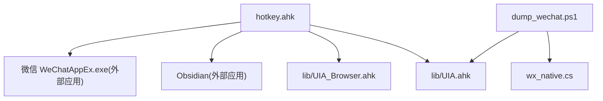
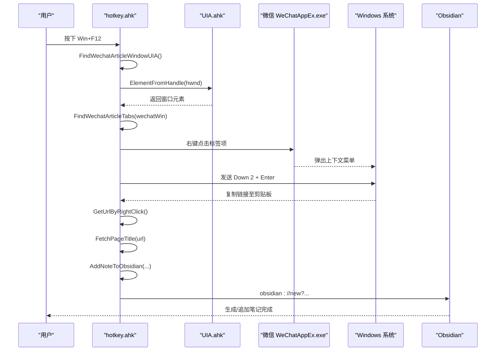
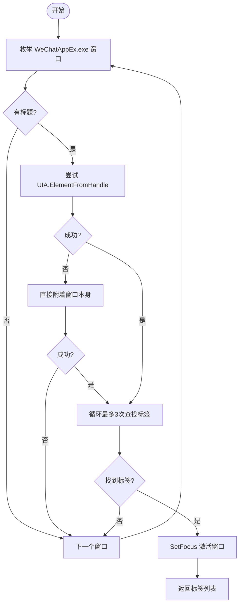
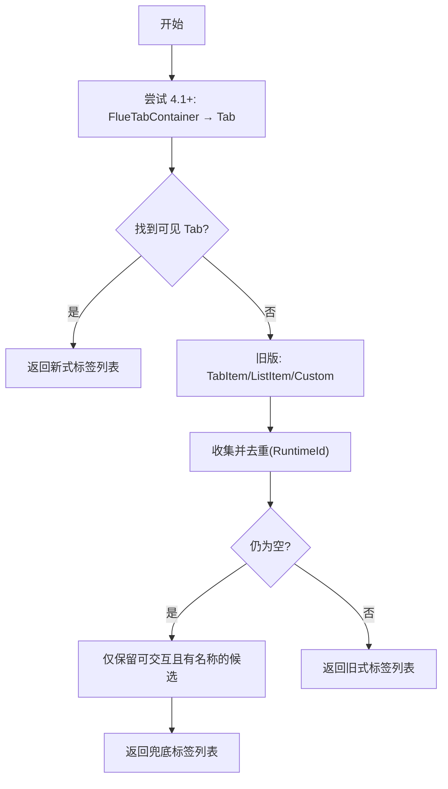
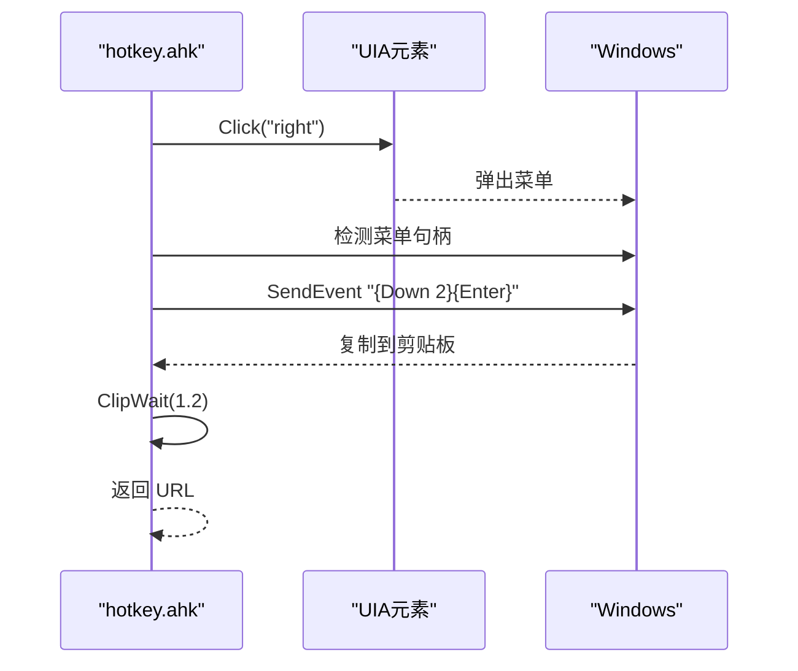
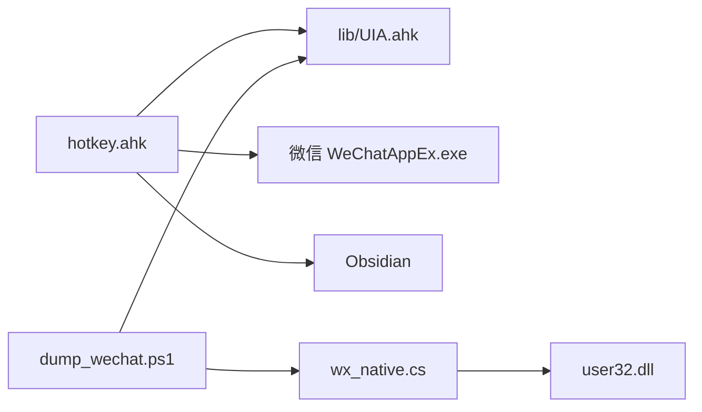

# 微信文章处理系统

<cite>
**本文引用的文件**
- [hotkey.ahk](file://hotkey.ahk)
- [dump_wechat.ps1](file://dump_wechat.ps1)
- [wx_native.cs](file://wx_native.cs)
- [UIA.ahk](file://lib/UIA.ahk)
- [UIA_Browser.ahk](file://lib/UIA_Browser.ahk)
</cite>

## 目录
1. [简介](#简介)
2. [项目结构](#项目结构)
3. [核心组件](#核心组件)
4. [架构总览](#架构总览)
5. [详细组件分析](#详细组件分析)
6. [依赖关系分析](#依赖关系分析)
7. [性能考虑](#性能考虑)
8. [故障排查指南](#故障排查指南)
9. [结论](#结论)
10. [附录](#附录)

## 简介
本仓库实现了一个“微信文章处理系统”，通过 AutoHotkey v2 脚本与 UI Automation（UIA）技术，自动定位微信（WeChatAppEx.exe）中已打开的公众号文章标签页，提取标题与链接，并以 Markdown 格式追加到 Obsidian 笔记库中。同时提供 PowerShell + C# 辅助工具用于转储微信 UIA 树，便于调试和适配不同微信版本。

该系统支持：
- 多版本微信 UIA 结构兼容（3.9、4.1+）
- 自动发现并激活含文章选项卡的窗口
- 右键菜单复制链接、抓取页面 <title> 作为标题
- 一键将结果写入 Obsidian 指定仓库与路径

## 项目结构
- 主脚本 hotkey.ahk：定义热键、UIA 定位、链接抓取、Obsidian 集成等核心逻辑
- dump_wechat.ps1：使用 UIAutomationClient/Types 与 wx_native.cs 枚举微信进程、子窗口类名、发送 WM_GETOBJECT，并输出 UIA 树到 wechat_uia_dump.txt
- wx_native.cs：封装 user32.dll 调用，枚举子窗口、获取类名/标题、发送 WM_GETOBJECT
- lib/UIA.ahk：UI Automation 框架封装，提供元素查找、属性访问、事件等能力
- lib/UIA_Browser.ahk：浏览器自动化扩展（本系统主要使用其基础 UIA 能力）

图表来源
- [hotkey.ahk:1186-1488](file://hotkey.ahk#L1186-L1488)
- [dump_wechat.ps1:1-89](file://dump_wechat.ps1#L1-L89)
- [wx_native.cs:1-25](file://wx_native.cs#L1-L25)
- [UIA.ahk:51-198](file://lib/UIA.ahk#L51-L198)

章节来源
- [hotkey.ahk:1186-1488](file://hotkey.ahk#L1186-L1488)
- [dump_wechat.ps1:1-89](file://dump_wechat.ps1#L1-L89)
- [wx_native.cs:1-25](file://wx_native.cs#L1-L25)
- [UIA.ahk:51-198](file://lib/UIA.ahk#L51-L198)

## 核心组件
- 微信文章窗口定位：FindWechatArticleWindowUIA
- 文章标签页识别：FindWechatArticleTabs
- 链接抓取：GetUrlByRightClick
- 标题抓取：FetchPageTitle / DecodeHtmlEntities
- Obsidian 集成：AddNoteToObsidian / EncodeURL
- 调试工具：dump_wechat.ps1 + wx_native.cs

章节来源
- [hotkey.ahk:1242-1363](file://hotkey.ahk#L1242-L1363)
- [hotkey.ahk:1280-1307](file://hotkey.ahk#L1280-L1307)
- [hotkey.ahk:1461-1488](file://hotkey.ahk#L1461-L1488)
- [hotkey.ahk:1369-1456](file://hotkey.ahk#L1369-L1456)
- [dump_wechat.ps1:1-89](file://dump_wechat.ps1#L1-L89)
- [wx_native.cs:1-25](file://wx_native.cs#L1-L25)

## 架构总览
系统由“触发层（热键）— 定位层（UIA）— 交互层（模拟右键/剪贴板）— 存储层（Obsidian URI）”组成。PowerShell 工具独立于主流程，用于诊断微信 UIA 树结构与渲染控件。

图表来源
- [hotkey.ahk:1186-1488](file://hotkey.ahk#L1186-L1488)
- [UIA.ahk:51-198](file://lib/UIA.ahk#L51-L198)

## 详细组件分析

### 微信文章窗口定位（FindWechatArticleWindowUIA）
- 遍历 WeChatAppEx.exe 的所有带标题窗口，跳过无标题渲染/工具窗口
- 优先以 Chromium 辅助功能方式附着窗口元素；若失败则直接附着窗口本身以触发按需 UIA 树构建
- 对微信 4.x 的按需 UIA 树进行短重试（最多 3 次，间隔 200ms），确保可找到标签项
- 成功后激活窗口以便后续右键操作有效

图表来源
- [hotkey.ahk:1242-1278](file://hotkey.ahk#L1242-L1278)

章节来源
- [hotkey.ahk:1242-1278](file://hotkey.ahk#L1242-L1278)

### 文章标签页识别（FindWechatArticleTabs）
- 新版（4.1+）：在 FlueTabContainer 下查找 ClassName="Tab" 的元素，并通过边界矩形过滤可见标签
- 旧版（3.9 等）：按 TabItem / Tab 容器内的 ListItem/Custom 收集候选
- 兜底策略：当连 Tab 容器也变为 Custom 时，仅保留可交互且有名称的候选
- 去重：基于 RuntimeId 避免重复添加

图表来源
- [hotkey.ahk:1309-1363](file://hotkey.ahk#L1309-L1363)

章节来源
- [hotkey.ahk:1309-1363](file://hotkey.ahk#L1309-L1363)

### 链接抓取（GetUrlByRightClick）
- 对目标 UIA 元素执行右键点击
- 等待上下文菜单出现（类 #32768），必要时短暂休眠
- 发送键盘导航（向下两次 + 回车）选择“复制链接”
- 等待剪贴板更新并返回 URL

图表来源
- [hotkey.ahk:1461-1488](file://hotkey.ahk#L1461-L1488)

章节来源
- [hotkey.ahk:1461-1488](file://hotkey.ahk#L1461-L1488)

### 标题抓取（FetchPageTitle / DecodeHtmlEntities）
- 使用 WinHttpRequest 获取网页 HTML，超时控制合理
- 正则匹配 <title> 内容，去除多余空白并解码 HTML 实体
- 若失败返回空字符串，由上层回退到 UIA Name 或序号

章节来源
- [hotkey.ahk:1280-1307](file://hotkey.ahk#L1280-L1307)

### Obsidian 集成（AddNoteToObsidian / EncodeURL）
- 自动解析 Obsidian 快捷方式，定位数据目录 data
- 单仓库直接写入；多仓库弹出 GUI 选择
- 构造 obsidian://new URI，包含 vault、file、content、append=true
- 使用 encodeURIComponent 编码路径与内容，确保中文与换行符正确传递

章节来源
- [hotkey.ahk:1369-1456](file://hotkey.ahk#L1369-L1456)

### 调试工具（dump_wechat.ps1 + wx_native.cs）
- 枚举微信进程，收集顶层窗口
- 列出每个窗口的子窗口类名与标题，针对 Chrome_RenderWidgetHostHWND 发送 WM_GETOBJECT
- 重新遍历 ControlView 树，输出到 wechat_uia_dump.txt，便于定位 UIA 节点变化

章节来源
- [dump_wechat.ps1:1-89](file://dump_wechat.ps1#L1-L89)
- [wx_native.cs:1-25](file://wx_native.cs#L1-L25)

## 依赖关系分析
- hotkey.ahk 依赖 lib/UIA.ahk 提供的 UIA 能力（元素查找、属性访问、事件等）
- 通过 Windows API（user32）间接与微信进程交互（右键、菜单、剪贴板）
- 通过 Obsidian URI 协议与 Obsidian 应用集成
- dump_wechat.ps1 依赖 UIAutomationClient/Types 与 wx_native.cs（C# 封装 user32）

图表来源
- [hotkey.ahk:1186-1488](file://hotkey.ahk#L1186-L1488)
- [dump_wechat.ps1:1-89](file://dump_wechat.ps1#L1-L89)
- [wx_native.cs:1-25](file://wx_native.cs#L1-L25)
- [UIA.ahk:51-198](file://lib/UIA.ahk#L51-L198)

章节来源
- [hotkey.ahk:1186-1488](file://hotkey.ahk#L1186-L1488)
- [dump_wechat.ps1:1-89](file://dump_wechat.ps1#L1-L89)
- [wx_native.cs:1-25](file://wx_native.cs#L1-L25)
- [UIA.ahk:51-198](file://lib/UIA.ahk#L51-L198)

## 性能考虑
- 窗口枚举与 UIA 附着：仅针对 WeChatAppEx.exe 且跳过无标题窗口，减少无效遍历
- 按需 UIA 树构建：对微信 4.x 采用短重试（≤600ms），避免长时间阻塞
- 可见性过滤：通过边界矩形判断标签是否可见，减少不可用项的处理开销
- 网络请求超时：FetchPageTitle 设置合理超时，防止卡死
- 剪贴板等待：ClipWait 限制最大等待时间，提升响应速度

[本节为通用性能建议，不直接分析具体文件]

## 故障排查指南
- 未找到文章选项卡
  - 确认已在微信中打开至少一篇公众号文章
  - 检查 WeChatAppEx.exe 是否运行，且存在带标题的窗口
  - 使用 dump_wechat.ps1 输出 wechat_uia_dump.txt，核对 UIA 树结构是否与预期一致
- 链接抓取失败
  - 检查上下文菜单是否弹出（类 #32768）
  - 确认“复制链接”菜单项顺序与键盘导航一致
  - 验证剪贴板是否在限定时间内更新
- 标题为空
  - 检查网页是否能正常访问（WinHttpRequest 状态码）
  - 确认 <title> 是否存在并可被正则匹配
- Obsidian 写入失败
  - 确认 Obsidian 快捷方式存在且可解析
  - 多仓库场景需选择正确的 vault
  - 检查 obsidian://new URI 编码是否正确

章节来源
- [hotkey.ahk:1186-1488](file://hotkey.ahk#L1186-L1488)
- [dump_wechat.ps1:1-89](file://dump_wechat.ps1#L1-L89)

## 结论
该微信文章处理系统通过稳健的 UIA 定位与多版本兼容策略，实现了从微信文章标签页到 Obsidian 笔记的一键化采集与归档。配合 PowerShell/C# 调试工具，可有效应对微信版本升级带来的 UIA 结构变化。整体方案具备高可用性、易维护性与良好的用户体验。

[本节为总结性内容，不直接分析具体文件]

## 附录
- 热键说明：Win+F12 触发微信文章采集；Alt+` 可将剪贴板内容追加到 Obsidian 笔记
- 输出位置：Obsidian 仓库下的“微信公众号文章/YYYY-MM-DD”文件
- 调试输出：wechat_uia_dump.txt（位于脚本目录）

[本节为补充信息，不直接分析具体文件]