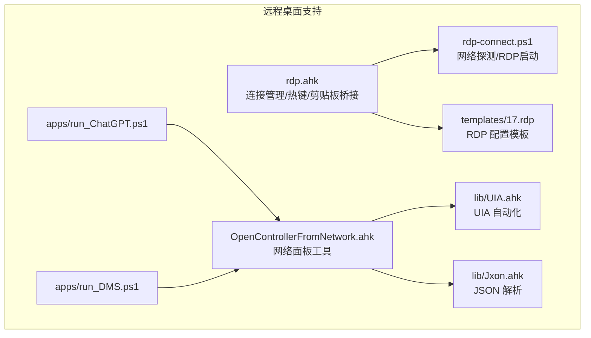
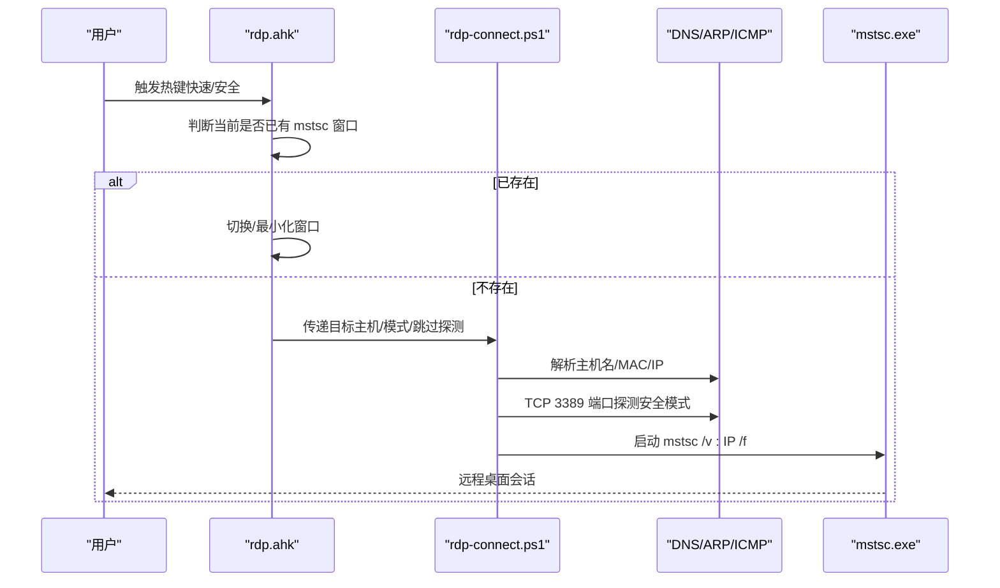
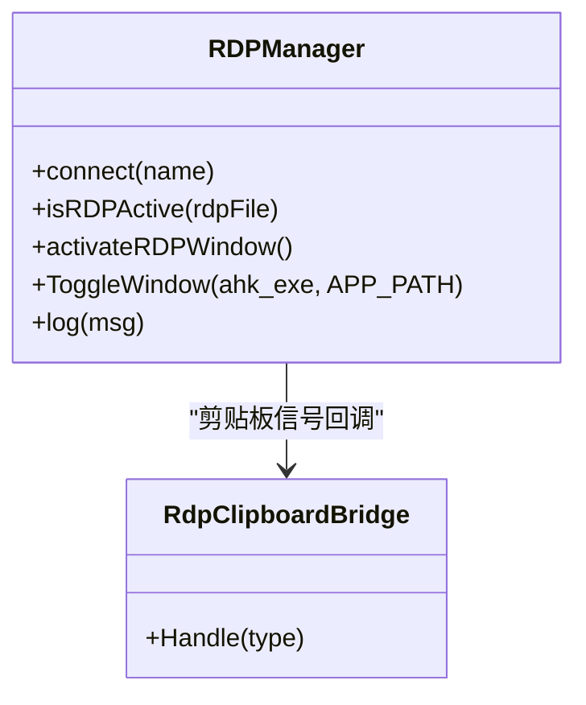
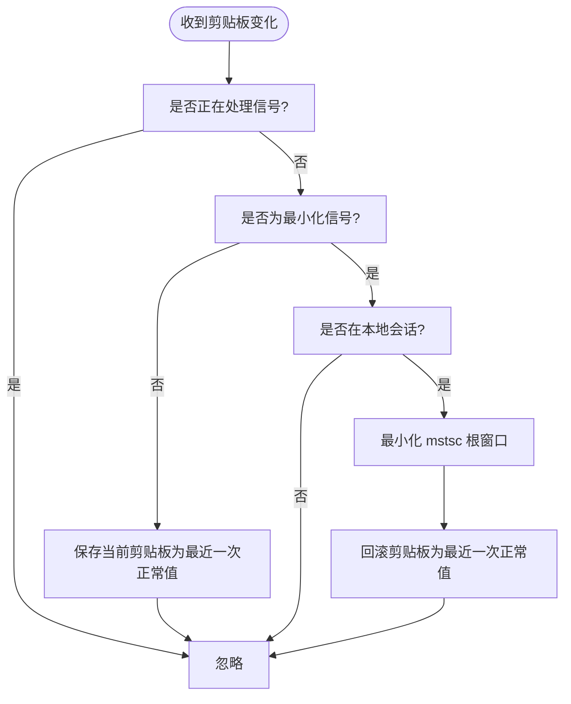
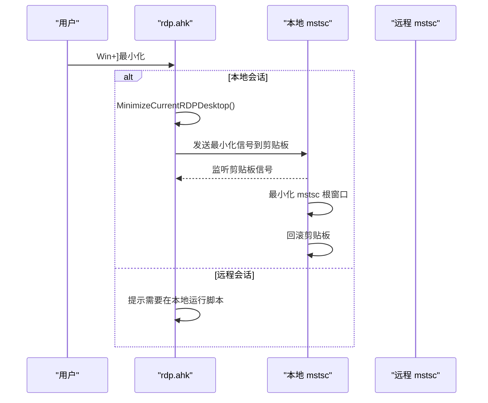
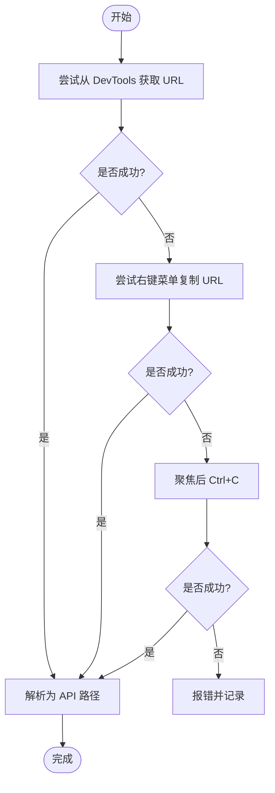
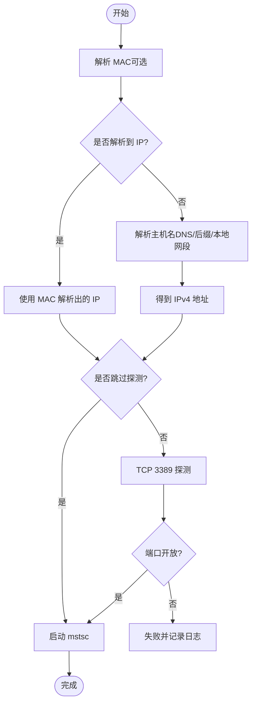
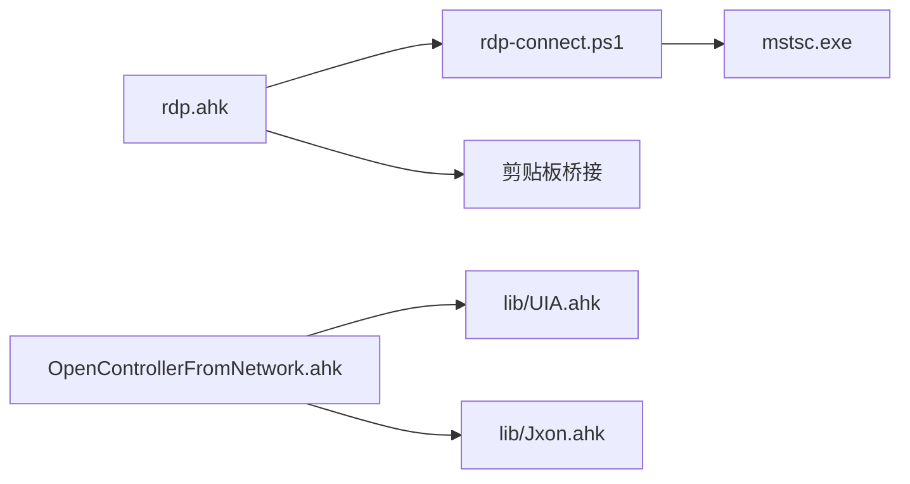

# 远程桌面支持

<cite>
**本文引用的文件**
- [rdp.ahk](file://rdp.ahk)
- [rdp-connect.ps1](file://rdp-connect.ps1)
- [OpenControllerFromNetwork.ahk](file://OpenControllerFromNetwork.ahk)
- [templates/17.rdp](file://templates/17.rdp)
- [templates/README_SaveCredentials.md](file://templates/README_SaveCredentials.md)
- [lib/UIA.ahk](file://lib/UIA.ahk)
- [lib/Jxon.ahk](file://lib/Jxon.ahk)
- [apps/run_ChatGPT.ps1](file://apps/run_ChatGPT.ps1)
- [apps/run_DMS.ps1](file://apps/run_DMS.ps1)
- [README.md](file://README.md)
</cite>

## 目录
1. [简介](#简介)
2. [项目结构](#项目结构)
3. [核心组件](#核心组件)
4. [架构总览](#架构总览)
5. [详细组件分析](#详细组件分析)
6. [依赖关系分析](#依赖关系分析)
7. [性能考量](#性能考量)
8. [故障排除指南](#故障排除指南)
9. [结论](#结论)
10. [附录](#附录)

## 简介
本文件面向远程桌面支持功能，围绕以下目标展开：
- 解释 RDP 连接管理与网络控制器的工作原理
- 详述远程桌面会话的建立与维护机制
- 说明网络控制器的配置选项与使用方法
- 提供 RDP 连接脚本的实现细节与参数配置
- 说明远程桌面环境下的应用程序控制与热键管理
- 总结网络安全注意事项与故障排除建议

本项目基于 AutoHotkey v2 与 PowerShell，结合 Windows 原生 RDP 客户端（mstsc.exe）与 UIA（通用 UI 自动化）框架，提供一键直连、安全探测、最小化控制、剪贴板桥接、以及浏览器应用快捷启动等能力。

## 项目结构
项目采用“脚本 + 模板 + 工具库”的组织方式：
- rdp.ahk：远程桌面连接管理与热键绑定的核心脚本
- rdp-connect.ps1：网络探测与 RDP 启动的 PowerShell 辅助脚本
- OpenControllerFromNetwork.ahk：网络面板工具（DevTools）的远程桌面环境下的 URL 抓取与路径解析
- templates/17.rdp：RDP 配置模板，包含分辨率、多显示器、音频、剪贴板、凭据等设置
- templates/README_SaveCredentials.md：凭据保存与策略说明
- lib/UIA.ahk：UIA 自动化框架封装，供网络控制器使用
- lib/Jxon.ahk：轻量 JSON 解析库
- apps/run_ChatGPT.ps1、apps/run_DMS.ps1：浏览器应用快捷启动脚本（可配合远程桌面使用）

图表来源
- [rdp.ahk:1-417](file://rdp.ahk#L1-L417)
- [rdp-connect.ps1:1-242](file://rdp-connect.ps1#L1-L242)
- [OpenControllerFromNetwork.ahk:1-877](file://OpenControllerFromNetwork.ahk#L1-L877)
- [lib/UIA.ahk:1-800](file://lib/UIA.ahk#L1-L800)
- [lib/Jxon.ahk:1-301](file://lib/Jxon.ahk#L1-L301)
- [apps/run_ChatGPT.ps1:1-18](file://apps/run_ChatGPT.ps1#L1-L18)
- [apps/run_DMS.ps1:1-18](file://apps/run_DMS.ps1#L1-L18)

章节来源
- [README.md:1-2](file://README.md#L1-L2)
- [rdp.ahk:1-417](file://rdp.ahk#L1-L417)
- [rdp-connect.ps1:1-242](file://rdp-connect.ps1#L1-L242)
- [OpenControllerFromNetwork.ahk:1-877](file://OpenControllerFromNetwork.ahk#L1-L877)
- [lib/UIA.ahk:1-800](file://lib/UIA.ahk#L1-L800)
- [lib/Jxon.ahk:1-301](file://lib/Jxon.ahk#L1-L301)
- [apps/run_ChatGPT.ps1:1-18](file://apps/run_ChatGPT.ps1#L1-L18)
- [apps/run_DMS.ps1:1-18](file://apps/run_DMS.ps1#L1-L18)

## 核心组件
- RDP 管理器（RDPManager）：负责连接、切换窗口、日志记录、防重复启动等
- RDP 剪贴板桥接（RdpClipboardBridge）：在本地与远程之间通过剪贴板信号进行最小化控制
- 热键绑定：提供快速直连、安全探测、最小化、调试信息等热键
- 网络控制器（OpenControllerFromNetwork）：在 DevTools 网络面板中抓取选中请求的 URL 并解析为 API 路径，支持多种 UIA 菜单定位策略
- RDP 配置模板：提供分辨率、多显示器、音频、剪贴板、凭据等默认设置
- PowerShell 探测脚本：解析主机名、MAC、端口探测、启动 mstsc

章节来源
- [rdp.ahk:47-146](file://rdp.ahk#L47-L146)
- [rdp.ahk:16-45](file://rdp.ahk#L16-L45)
- [rdp.ahk:165-221](file://rdp.ahk#L165-L221)
- [OpenControllerFromNetwork.ahk:34-96](file://OpenControllerFromNetwork.ahk#L34-L96)
- [templates/17.rdp:1-25](file://templates/17.rdp#L1-L25)
- [rdp-connect.ps1:190-242](file://rdp-connect.ps1#L190-L242)

## 架构总览
整体工作流分为两条主线：
- 连接主线：AHK 热键触发 → RDPManager 判断窗口 → PowerShell 探测与启动 → mstsc.exe
- 控制主线：远程桌面环境下，通过剪贴板信号与窗口根句柄识别，实现本地最小化；同时在网络面板工具中，利用 UIA 自动化抓取 URL 并解析路径

图表来源
- [rdp.ahk:332-402](file://rdp.ahk#L332-L402)
- [rdp-connect.ps1:190-242](file://rdp-connect.ps1#L190-L242)

## 详细组件分析

### RDP 连接管理器（RDPManager）
- 功能要点
  - 连接：校验 mstsc.exe、读取 RDP 配置、防重复启动、调用 ToggleWindow
  - 窗口切换：ToggleWindow 统一封装“存在即切换/不存在即启动”
  - 日志：统一写入 rdp.log，便于排障
- 关键行为
  - isRDPActive：通过进程名判断是否存在 RDP 窗口
  - activateRDPWindow：激活已有窗口
  - log：时间戳 + 文本追加到日志文件

图表来源
- [rdp.ahk:70-146](file://rdp.ahk#L70-L146)
- [rdp.ahk:16-45](file://rdp.ahk#L16-L45)

章节来源
- [rdp.ahk:70-146](file://rdp.ahk#L70-L146)

### 剪贴板桥接（RdpClipboardBridge）
- 作用：在远程会话中，通过剪贴板发送“最小化信号”，本地监听后最小化 mstsc 根窗口，并回滚剪贴板
- 机制
  - 本地检测到特定信号类型时，最小化 mstsc 根窗口
  - 记录最近一次“正常剪贴板”，在信号覆盖时回滚
  - 防抖：g_RdpClipboardSignalBusy 避免递归触发

图表来源
- [rdp.ahk:16-45](file://rdp.ahk#L16-L45)

章节来源
- [rdp.ahk:16-45](file://rdp.ahk#L16-L45)

### 热键绑定与最小化控制
- 快速直连：Win+\ 直接启动 PowerShell 脚本，跳过探测
- 安全探测：Ctrl+Win+\ 先进行 DNS/ARP/ICMP + TCP 3389 探测再连接
- 最小化：Win+] 若当前在远程桌面窗口，向本地发送最小化信号；否则尝试最小化当前活动窗口的 mstsc 根窗口
- 调试：Ctrl+Alt+Shift+M 显示当前窗口/根窗口信息与 RDP 环境判定

图表来源
- [rdp.ahk:177-242](file://rdp.ahk#L177-L242)
- [rdp.ahk:189-221](file://rdp.ahk#L189-L221)

章节来源
- [rdp.ahk:165-221](file://rdp.ahk#L165-L221)
- [rdp.ahk:223-270](file://rdp.ahk#L223-L270)

### 网络控制器（OpenControllerFromNetwork）
- 目标：在 DevTools 网络面板中，抓取当前选中请求的 URL，并解析为 API 路径，复制到剪贴板
- 核心流程
  - 优先通过右键菜单复制 URL（含三连 C 快速路径与 UIA 定位）
  - 失败时回退到聚焦请求行后 Ctrl+C
  - 最终解析路径并写入剪贴板
- UIA 与 JSON
  - 使用 UIA.ElementFromHandle/FindAll/TreeWalker 等定位菜单项
  - 使用 Jxon 解析 JSON（如浏览器扩展数据）

图表来源
- [OpenControllerFromNetwork.ahk:34-96](file://OpenControllerFromNetwork.ahk#L34-L96)
- [OpenControllerFromNetwork.ahk:139-195](file://OpenControllerFromNetwork.ahk#L139-L195)
- [OpenControllerFromNetwork.ahk:471-581](file://OpenControllerFromNetwork.ahk#L471-L581)
- [lib/UIA.ahk:1-800](file://lib/UIA.ahk#L1-L800)
- [lib/Jxon.ahk:1-301](file://lib/Jxon.ahk#L1-L301)

章节来源
- [OpenControllerFromNetwork.ahk:34-96](file://OpenControllerFromNetwork.ahk#L34-L96)
- [OpenControllerFromNetwork.ahk:139-195](file://OpenControllerFromNetwork.ahk#L139-L195)
- [OpenControllerFromNetwork.ahk:471-581](file://OpenControllerFromNetwork.ahk#L471-L581)
- [lib/UIA.ahk:1-800](file://lib/UIA.ahk#L1-L800)
- [lib/Jxon.ahk:1-301](file://lib/Jxon.ahk#L1-L301)

### RDP 配置模板与凭据保存
- 模板字段：全屏地址、用户名、分辨率、多显示器、音频/键盘钩、网络/带宽自适应、显示连接栏、凭据 SSO、认证级别、打印机/智能卡/剪贴板重定向、自动重连、驱动器重定向等
- 凭据保存：通过 MSTSC UI 勾选“允许我保存凭据”，或使用 cmdkey 手动保存；策略限制时需联系管理员

章节来源
- [templates/17.rdp:1-25](file://templates/17.rdp#L1-L25)
- [templates/README_SaveCredentials.md:1-27](file://templates/README_SaveCredentials.md#L1-L27)

### PowerShell 连接脚本（rdp-connect.ps1）
- 参数
  - TargetHost：目标主机（支持短主机名，内部解析为 IPv4）
  - Mode：fast/safe（fast 跳过端口探测）
  - SkipProbe：跳过端口探测（由 fast 模式传入）
  - Mac：可选 MAC 地址，优先通过邻居表/ARP 解析 IP
- 主要流程
  - 解析主机名：优先 DNS/后缀解析，其次本地私有网段探测，最后回退常见前缀
  - MAC 解析：Get-NetNeighbor/arp -a
  - 端口探测：Test-TcpFast（默认 500ms 超时）
  - 启动 mstsc：Start-Process mstsc.exe /v:IP /f

图表来源
- [rdp-connect.ps1:190-242](file://rdp-connect.ps1#L190-L242)
- [rdp-connect.ps1:45-156](file://rdp-connect.ps1#L45-L156)
- [rdp-connect.ps1:158-188](file://rdp-connect.ps1#L158-L188)
- [rdp-connect.ps1:20-43](file://rdp-connect.ps1#L20-L43)

章节来源
- [rdp-connect.ps1:190-242](file://rdp-connect.ps1#L190-L242)
- [rdp-connect.ps1:45-156](file://rdp-connect.ps1#L45-L156)
- [rdp-connect.ps1:158-188](file://rdp-connect.ps1#L158-L188)
- [rdp-connect.ps1:20-43](file://rdp-connect.ps1#L20-L43)

### 应用程序控制与热键管理（浏览器应用）
- ChatGPT/DMS 快捷启动：生成 Chrome 应用快捷方式，注入 AUMID，便于任务视图识别
- 与网络控制器配合：在远程桌面中打开浏览器应用，结合网络控制器抓取 API 路径

章节来源
- [apps/run_ChatGPT.ps1:1-18](file://apps/run_ChatGPT.ps1#L1-L18)
- [apps/run_DMS.ps1:1-18](file://apps/run_DMS.ps1#L1-L18)

## 依赖关系分析
- rdp.ahk 依赖
  - Windows API：GetSystemMetrics、GetAncestor、窗口句柄操作
  - PowerShell：调用 rdp-connect.ps1
  - 剪贴板：OnClipboardChange 回调
- rdp-connect.ps1 依赖
  - .NET System.Net.Sockets.TcpClient
  - PowerShell DNS/ARP/邻居表
  - mstsc.exe
- OpenControllerFromNetwork.ahk 依赖
  - UIA 框架：UIA.ElementFromHandle/FindAll/TreeWalker
  - Jxon：JSON 解析
  - 浏览器 DevTools：右键菜单、复制 URL

图表来源
- [rdp.ahk:1-417](file://rdp.ahk#L1-L417)
- [rdp-connect.ps1:1-242](file://rdp-connect.ps1#L1-L242)
- [OpenControllerFromNetwork.ahk:1-877](file://OpenControllerFromNetwork.ahk#L1-L877)
- [lib/UIA.ahk:1-800](file://lib/UIA.ahk#L1-L800)
- [lib/Jxon.ahk:1-301](file://lib/Jxon.ahk#L1-L301)

章节来源
- [rdp.ahk:1-417](file://rdp.ahk#L1-L417)
- [rdp-connect.ps1:1-242](file://rdp-connect.ps1#L1-L242)
- [OpenControllerFromNetwork.ahk:1-877](file://OpenControllerFromNetwork.ahk#L1-L877)
- [lib/UIA.ahk:1-800](file://lib/UIA.ahk#L1-L800)
- [lib/Jxon.ahk:1-301](file://lib/Jxon.ahk#L1-L301)

## 性能考量
- 端口探测超时：默认 500ms，兼顾速度与稳定性
- UIA 菜单定位：优先局部锚点与缓存，避免全桌面扫描；失败时再进行宽范围扫描与全扫描
- 剪贴板桥接：仅在信号触发时最小化，避免频繁操作
- 日志：统一 UTF-8 追加，避免阻塞主线程

[本节为通用指导，无需具体文件分析]

## 故障排除指南
- 无法连接 RDP
  - 检查 mstsc.exe 是否存在
  - 确认 .rdp 文件路径与名称正确
  - 安全模式下确认 TCP 3389 开放
- 剪贴板最小化无效
  - 确认本地会话中运行脚本
  - 检查剪贴板信号是否被其他程序覆盖
  - 查看 rdp.log 中的错误信息
- DevTools 抓取 URL 失败
  - 确保请求行处于焦点或被选中
  - 检查 UIA 是否可用（某些程序需要启用辅助功能）
  - 查看 ahk_devtools_perf.log 中的性能日志
- 凭据保存失败
  - 检查本地策略或域策略是否禁止保存网络凭据
  - 使用 cmdkey 手动保存（注意明文风险）

章节来源
- [rdp.ahk:106-110](file://rdp.ahk#L106-L110)
- [rdp.ahk:404-408](file://rdp.ahk#L404-L408)
- [OpenControllerFromNetwork.ahk:301-311](file://OpenControllerFromNetwork.ahk#L301-L311)
- [templates/README_SaveCredentials.md:20-27](file://templates/README_SaveCredentials.md#L20-L27)

## 结论
本项目通过 AHK 与 PowerShell 的协同，实现了远程桌面连接的快速与安全两种模式，结合剪贴板桥接与窗口根句柄识别，提供了可靠的本地最小化控制。网络控制器利用 UIA 与 JSON 解析，提升了在 DevTools 环境下的操作效率。配合 RDP 模板与凭据保存策略，可在企业环境中安全落地。

[本节为总结性内容，无需具体文件分析]

## 附录
- 热键清单
  - Win+\：快速直连（跳过探测）
  - Ctrl+Win+\：安全探测（DNS + 3389 检测）
  - Win+]：远程桌面内最小化本地 mstsc
  - Ctrl+Alt+Shift+M：调试当前窗口/根窗口信息
- PowerShell 参数
  - -TargetHost：目标主机（短主机名支持）
  - -Mode：fast/safe
  - -SkipProbe：跳过端口探测
  - -Mac：可选 MAC 地址

章节来源
- [rdp.ahk:165-187](file://rdp.ahk#L165-L187)
- [rdp-connect.ps1:1-10](file://rdp-connect.ps1#L1-L10)
- [rdp-connect.ps1:190-242](file://rdp-connect.ps1#L190-L242)