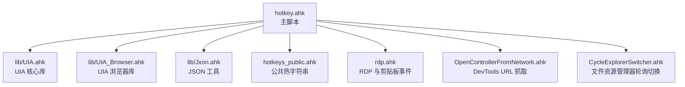
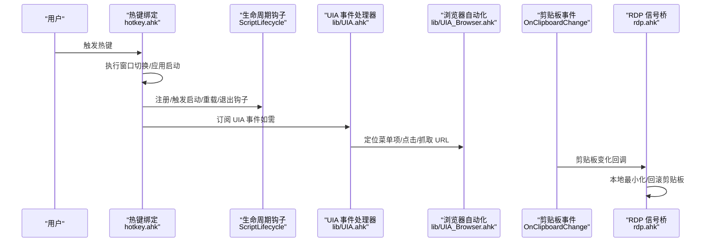
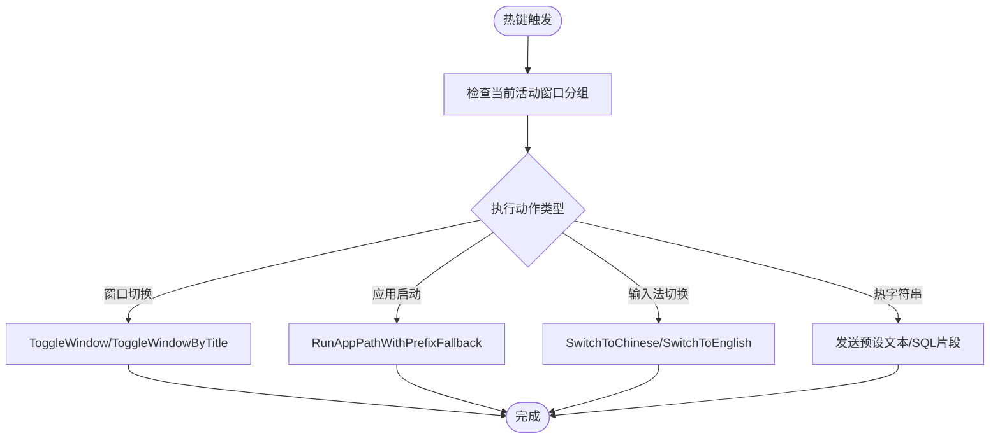
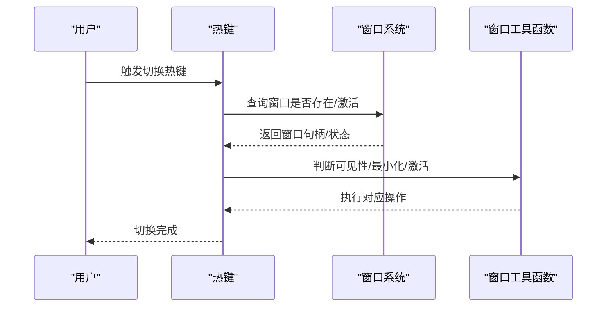
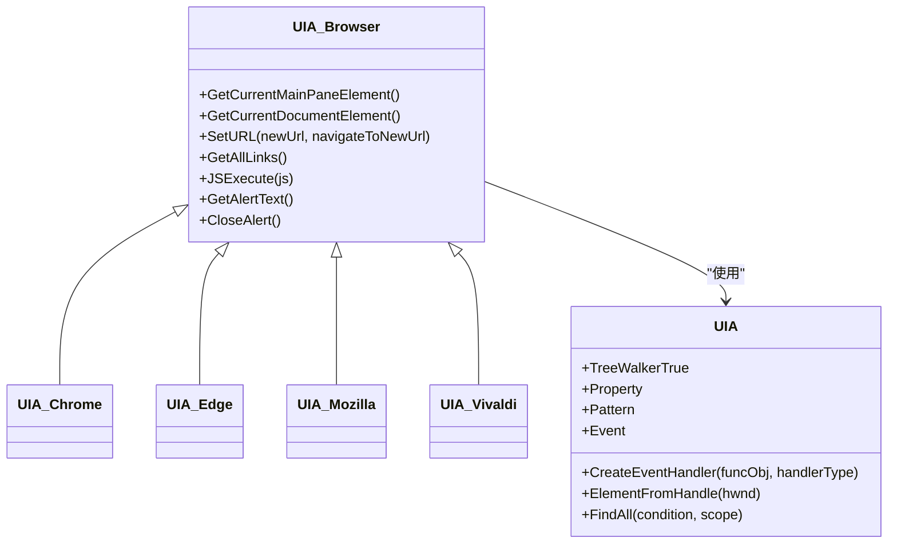
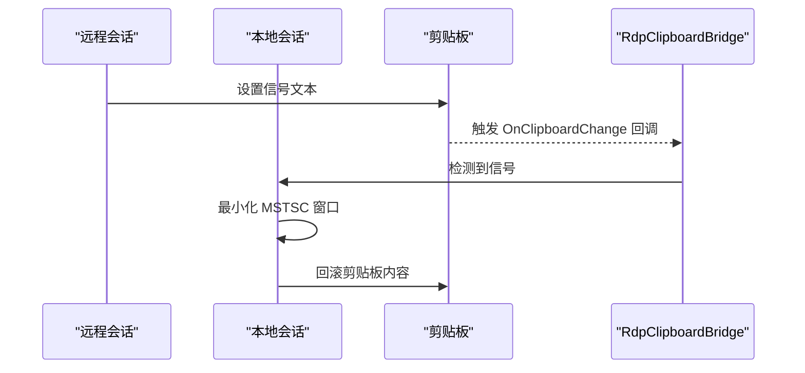
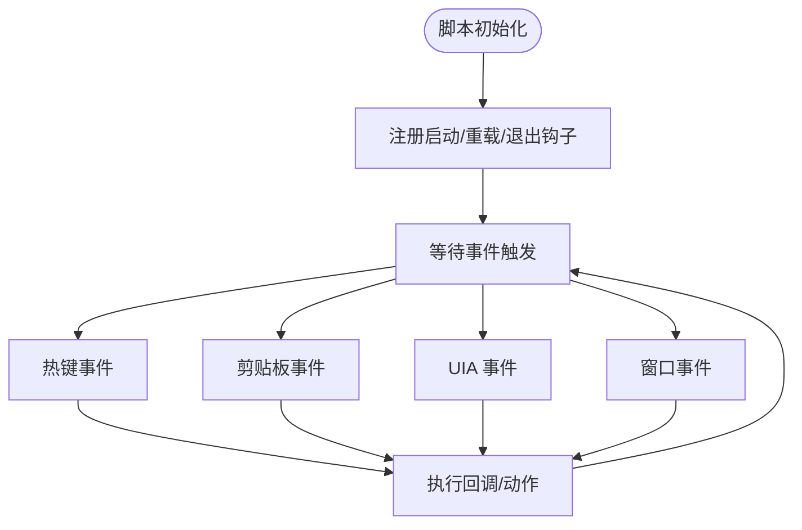
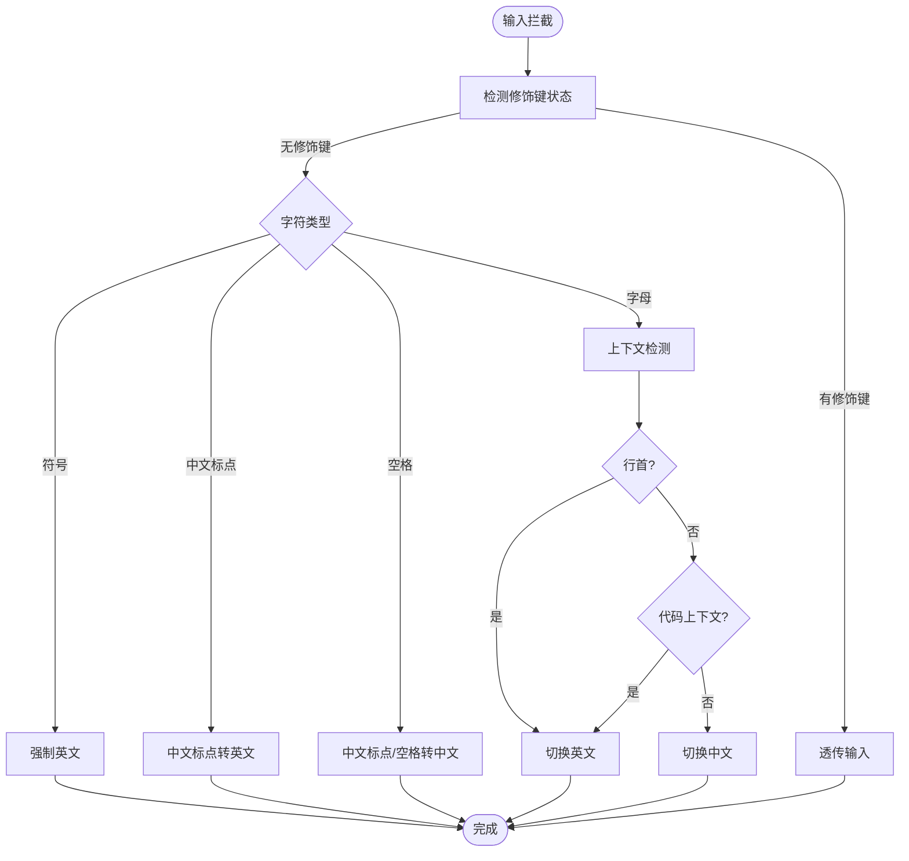
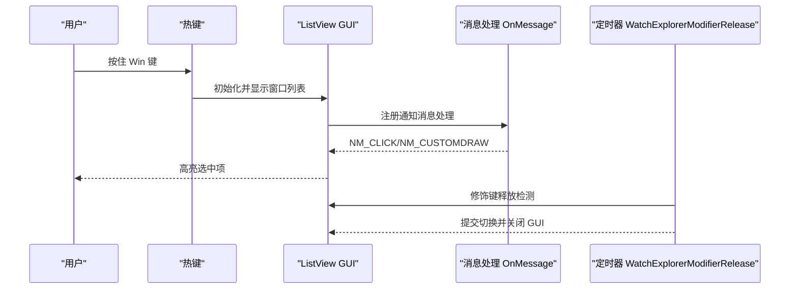
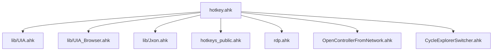

# 事件驱动架构

<cite>
**本文引用的文件**
- [hotkey.ahk](file://hotkey.ahk)
- [hotkeys_public.ahk](file://hotkeys_public.ahk)
- [lib/UIA.ahk](file://lib/UIA.ahk)
- [lib/UIA_Browser.ahk](file://lib/UIA_Browser.ahk)
- [lib/Jxon.ahk](file://lib/Jxon.ahk)
- [rdp.ahk](file://rdp.ahk)
- [OpenControllerFromNetwork.ahk](file://OpenControllerFromNetwork.ahk)
- [CycleExplorerSwitcher.ahk](file://CycleExplorerSwitcher.ahk)
- [README.md](file://README.md)
</cite>

## 目录
1. [简介](#简介)
2. [项目结构](#项目结构)
3. [核心组件](#核心组件)
4. [架构总览](#架构总览)
5. [详细组件分析](#详细组件分析)
6. [依赖关系分析](#依赖关系分析)
7. [性能考量](#性能考量)
8. [故障排查指南](#故障排查指南)
9. [结论](#结论)
10. [附录](#附录)

## 简介
本项目基于 AutoHotkey v2 实现事件驱动的热键与自动化脚本，涵盖以下事件与响应机制：
- 热键事件：通过热键绑定触发程序行为（如窗口切换、应用启动、快捷操作）。
- 窗口事件：通过窗口枚举、焦点变化、窗口状态变更等实现响应式窗口管理。
- UIA 事件：通过 UIA 事件处理器订阅 UI 变化，实现自动化交互（如浏览器菜单、开发者工具、剪贴板变化）。
- 生命周期事件：通过生命周期钩子实现脚本重载、退出回调等。

项目采用模块化组织，核心逻辑集中在主脚本与若干功能模块，UIA 与浏览器自动化封装在独立库中，便于复用与维护。

## 项目结构
项目采用“主脚本 + 功能模块 + UIA 库”的组织方式：
- 主脚本负责全局初始化、权限提升、任务计划注册、热键绑定、窗口切换、输入法与 IME 切换、生命周期管理等。
- 功能模块分别处理 RDP 连接与剪贴板信号、开发者工具 URL 抓取、文件资源管理器轮询切换等。
- UIA 库提供 UI 自动化能力，UIA 浏览器库针对浏览器场景进行封装。

图表来源
- [hotkey.ahk](file://hotkey.ahk)
- [lib/UIA.ahk](file://lib/UIA.ahk)
- [lib/UIA_Browser.ahk](file://lib/UIA_Browser.ahk)
- [lib/Jxon.ahk](file://lib/Jxon.ahk)
- [hotkeys_public.ahk](file://hotkeys_public.ahk)
- [rdp.ahk](file://rdp.ahk)
- [OpenControllerFromNetwork.ahk](file://OpenControllerFromNetwork.ahk)
- [CycleExplorerSwitcher.ahk](file://CycleExplorerSwitcher.ahk)

章节来源
- [README.md](file://README.md)
- [hotkey.ahk](file://hotkey.ahk)

## 核心组件
- 热键与窗口管理：主脚本集中定义大量热键，结合窗口枚举与切换逻辑，实现一键启动/切换应用与窗口。
- 输入法与 IME 切换：通过 InputHook 与上下文检测，实现智能中英文输入法切换与标点转换。
- UIA 事件与浏览器自动化：通过 UIA 事件处理器与浏览器封装类，实现菜单项定位、点击、URL 抓取等。
- 生命周期与事件钩子：通过生命周期类注册启动/重载/退出钩子，实现脚本自管理与优雅退出。
- RDP 与剪贴板事件：通过 OnClipboardChange 订阅剪贴板变化，实现本地与远程会话间的最小化信号传递。

章节来源
- [hotkey.ahk](file://hotkey.ahk)
- [lib/UIA.ahk](file://lib/UIA.ahk)
- [lib/UIA_Browser.ahk](file://lib/UIA_Browser.ahk)
- [rdp.ahk](file://rdp.ahk)

## 架构总览
事件驱动架构围绕“事件源（热键、窗口、UIA、剪贴板）→ 事件处理器（回调/钩子）→ 响应动作（窗口切换、应用启动、UI 自动化）”展开。主脚本作为中枢，协调各模块事件与响应。

图表来源
- [hotkey.ahk](file://hotkey.ahk)
- [lib/UIA.ahk](file://lib/UIA.ahk)
- [lib/UIA_Browser.ahk](file://lib/UIA_Browser.ahk)
- [rdp.ahk](file://rdp.ahk)

## 详细组件分析

### 热键事件处理机制
- 热键绑定：主脚本集中定义多组热键，覆盖应用启动、窗口切换、快捷操作等。
- 热键动作：热键回调中调用窗口切换函数、应用启动函数、输入法切换函数等。
- 热字符串：公共热字符串模块提供常用快捷输入，减少重复输入。

图表来源
- [hotkey.ahk](file://hotkey.ahk)
- [hotkeys_public.ahk](file://hotkeys_public.ahk)

章节来源
- [hotkey.ahk](file://hotkey.ahk)
- [hotkeys_public.ahk](file://hotkeys_public.ahk)

### 窗口事件监听与响应
- 窗口枚举：通过 WinGetList 获取指定类名/标题的窗口列表。
- 窗口状态判断：通过 WinActive、WinExist、WinGetMinMax 等判断窗口状态并执行最小化/激活/还原。
- 窗口焦点与可见性：通过样式位判断可见性，结合窗口标题与类名进行精确匹配。

图表来源
- [hotkey.ahk](file://hotkey.ahk)

章节来源
- [hotkey.ahk](file://hotkey.ahk)

### UIA 事件响应与浏览器自动化
- UIA 事件处理器：通过 CreateEventHandler 创建事件处理器，支持多种事件类型（自动化事件、焦点变化、属性变化、结构变化、文本变化、通知、变更等）。
- 浏览器自动化：UIA_Browser 封装浏览器窗口元素、地址栏、标签页、导航按钮等，提供导航、标签页管理、JS 执行、弹窗处理等能力。
- 菜单项定位与点击：通过 UIA 定位菜单项，结合评分算法选择最佳候选，支持缓存与降级扫描策略。

图表来源
- [lib/UIA.ahk](file://lib/UIA.ahk)
- [lib/UIA_Browser.ahk](file://lib/UIA_Browser.ahk)

章节来源
- [lib/UIA.ahk](file://lib/UIA.ahk)
- [lib/UIA_Browser.ahk](file://lib/UIA_Browser.ahk)

### 剪贴板事件与 RDP 信号桥
- 剪贴板事件：通过 OnClipboardChange 注册回调，监听剪贴板变化。
- 信号桥：在远程会话中，通过特定信号触发本地最小化，并在本地回滚剪贴板，保证用户体验一致。

图表来源
- [rdp.ahk](file://rdp.ahk)

章节来源
- [rdp.ahk](file://rdp.ahk)

### 生命周期事件与事件循环
- 生命周期钩子：通过 ScriptLifecycle 类注册启动、重载、退出钩子，实现脚本自管理。
- 事件循环：AutoHotkey v2 的事件循环由热键、窗口消息、UIA 事件、剪贴板事件等驱动，回调在事件发生时被调用。

图表来源
- [hotkey.ahk](file://hotkey.ahk)

章节来源
- [hotkey.ahk](file://hotkey.ahk)

### 输入法与 IME 切换（事件驱动的输入拦截）
- InputHook：通过 InputHook 捕获字符输入，结合上下文检测（行首、代码上下文、自然语言）决定输入法状态。
- 标点转换：根据上下文将中文标点转换为英文标点，或将英文标点转换为中文标点。
- 智能切换：在输入字母、符号、空格等场景下自动切换中英文输入法，提升输入效率。

图表来源
- [hotkey.ahk](file://hotkey.ahk)

章节来源
- [hotkey.ahk](file://hotkey.ahk)

### 文件资源管理器轮询切换（GUI + 消息事件）
- GUI 列表：使用 ListView 展示多个文件资源管理器窗口，支持自定义绘制与高亮。
- 消息事件：通过 OnMessage 捕获 ListView 的通知消息，实现点击、自绘等交互。
- 键盘轮询：通过定时器轮询修饰键释放，实现“按住 Win 键轮询切换，松开即确认”。

图表来源
- [CycleExplorerSwitcher.ahk](file://CycleExplorerSwitcher.ahk)

章节来源
- [CycleExplorerSwitcher.ahk](file://CycleExplorerSwitcher.ahk)

## 依赖关系分析
- 主脚本依赖 UIA 核心库与浏览器库，用于 UI 自动化与浏览器交互。
- RDP 模块依赖剪贴板事件与窗口管理能力，实现跨会话最小化控制。
- 开发者工具模块依赖 UIA 与浏览器库，实现菜单项定位与 URL 抓取。
- 生命周期模块为全局事件钩子提供统一入口。

图表来源
- [hotkey.ahk](file://hotkey.ahk)
- [lib/UIA.ahk](file://lib/UIA.ahk)
- [lib/UIA_Browser.ahk](file://lib/UIA_Browser.ahk)
- [lib/Jxon.ahk](file://lib/Jxon.ahk)
- [hotkeys_public.ahk](file://hotkeys_public.ahk)
- [rdp.ahk](file://rdp.ahk)
- [OpenControllerFromNetwork.ahk](file://OpenControllerFromNetwork.ahk)
- [CycleExplorerSwitcher.ahk](file://CycleExplorerSwitcher.ahk)

章节来源
- [hotkey.ahk](file://hotkey.ahk)

## 性能考量
- UIA 定位策略：优先使用局部扫描与锚点缓存，避免全桌面扫描；在失败时启用降级扫描，平衡速度与稳定性。
- 剪贴板事件：在远程会话中通过信号桥最小化本地窗口，避免频繁窗口操作带来的性能损耗。
- 热键与窗口切换：通过窗口存在性与激活状态判断减少不必要的窗口操作，降低系统调用开销。
- 定时器与轮询：在 GUI 与热键处理中使用定时器进行状态轮询，注意控制轮询频率，避免占用 CPU。

## 故障排查指南
- 热键无效：检查热键绑定是否正确、修饰键状态是否冲突、窗口分组是否匹配。
- 窗口切换失败：确认窗口类名/标题匹配规则、可见性判断、最小化/激活顺序。
- UIA 定位失败：检查 UIA 版本与条件匹配、元素缓存与可见性、TreeWalker 范围。
- 剪贴板信号异常：确认信号文本一致性、本地会话判断、剪贴板回滚时机。
- 生命周期钩子：检查钩子注册顺序、环境变量传递、退出回调参数。

章节来源
- [hotkey.ahk](file://hotkey.ahk)
- [lib/UIA.ahk](file://lib/UIA.ahk)
- [rdp.ahk](file://rdp.ahk)

## 结论
本项目通过 AutoHotkey v2 的事件驱动模型，将热键、窗口、UIA、剪贴板等事件统一纳入事件循环，配合模块化设计与 UIA 自动化能力，实现了高效、稳定的自动化脚本体系。生命周期钩子与事件处理器的组合，使得脚本具备良好的可维护性与可扩展性。

## 附录
- 最佳实践
  - 使用局部扫描与缓存策略减少 UIA 扫描成本。
  - 在远程会话中谨慎使用窗口操作，优先采用信号桥与剪贴板事件。
  - 合理使用定时器与轮询，避免阻塞事件循环。
  - 为复杂事件序列编写清晰的回调与错误处理逻辑。
- 性能优化建议
  - 缓存常用 UIA 条件与元素，避免重复构建。
  - 控制剪贴板事件回调中的同步操作，必要时使用异步或延迟处理。
  - 在热键回调中尽量减少系统调用次数，合并窗口操作。
  - 对 UIA 事件处理器进行去重与节流，避免重复触发。