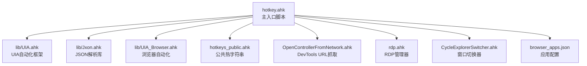
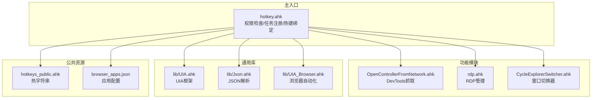
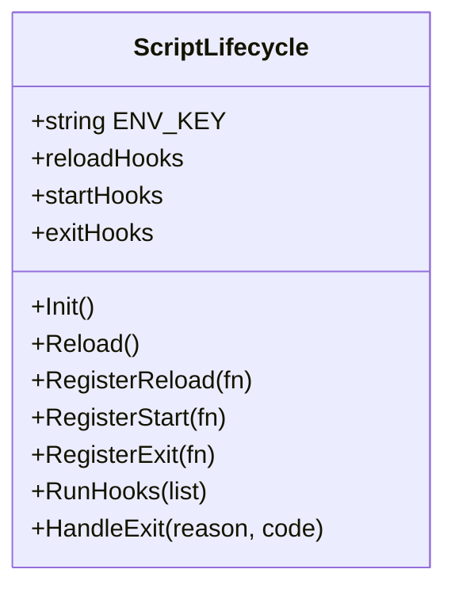
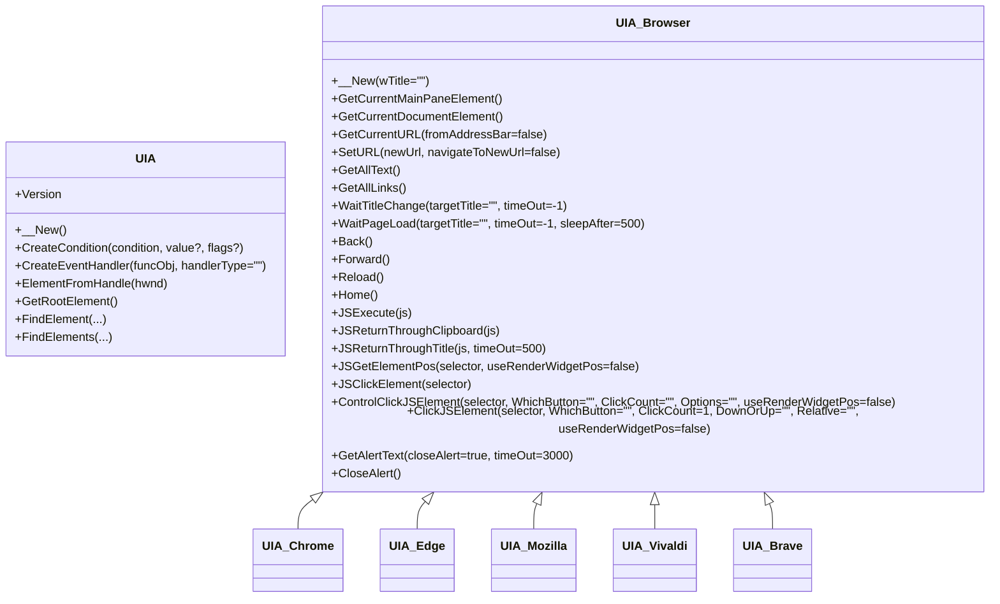
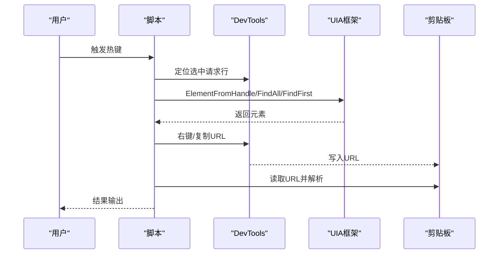
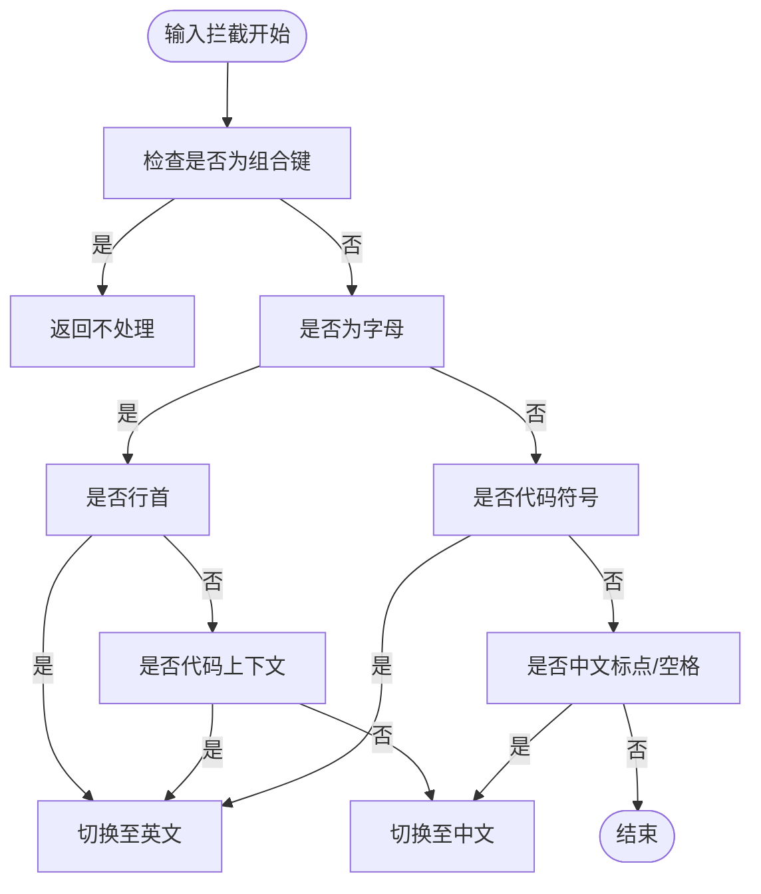
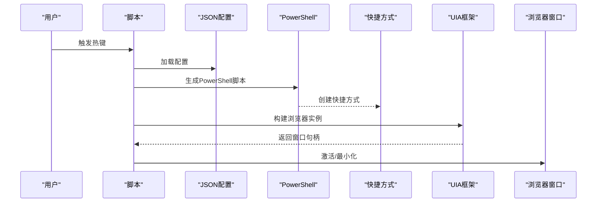
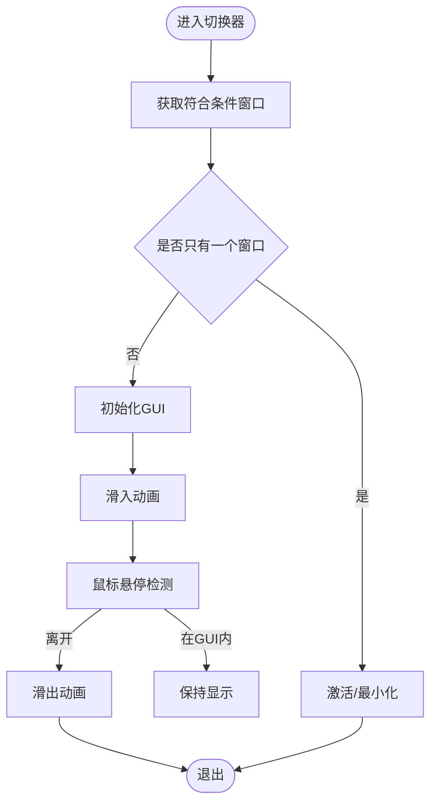
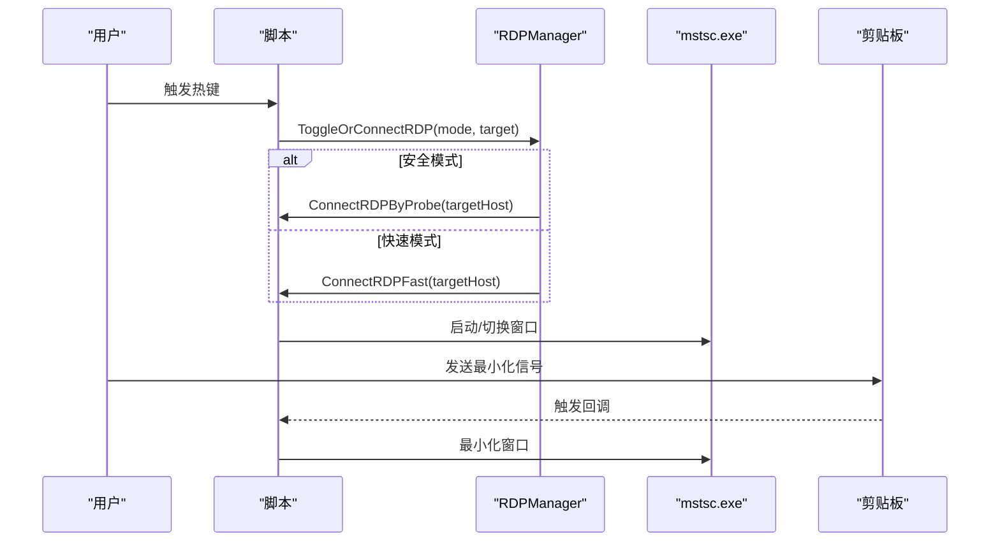
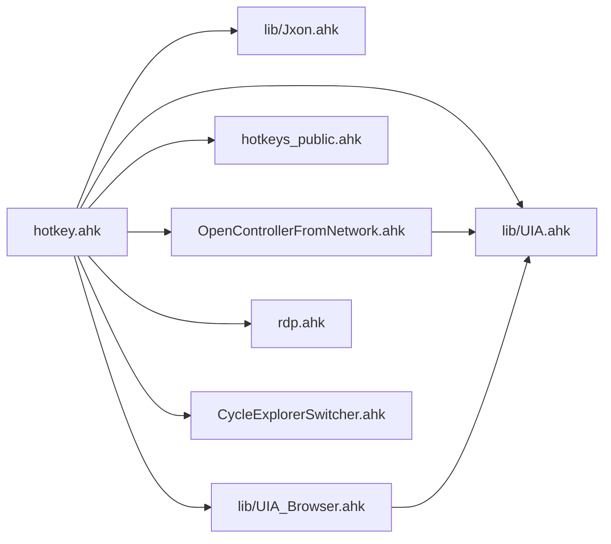

# 代码结构分析

<cite>
**本文档引用的文件**
- [hotkey.ahk](file://hotkey.ahk)
- [README.md](file://README.md)
- [lib/UIA.ahk](file://lib/UIA.ahk)
- [lib/Jxon.ahk](file://lib/Jxon.ahk)
- [lib/UIA_Browser.ahk](file://lib/UIA_Browser.ahk)
- [hotkeys_public.ahk](file://hotkeys_public.ahk)
- [OpenControllerFromNetwork.ahk](file://OpenControllerFromNetwork.ahk)
- [rdp.ahk](file://rdp.ahk)
- [CycleExplorerSwitcher.ahk](file://CycleExplorerSwitcher.ahk)
</cite>

## 目录
1. [简介](#简介)
2. [项目结构](#项目结构)
3. [核心组件](#核心组件)
4. [架构总览](#架构总览)
5. [详细组件分析](#详细组件分析)
6. [依赖关系分析](#依赖关系分析)
7. [性能考虑](#性能考虑)
8. [故障排除指南](#故障排除指南)
9. [结论](#结论)
10. [附录](#附录)

## 简介
本项目是一个基于 AutoHotkey v2 的热键脚本集合，旨在提供统一的热键入口、窗口控制、输入法智能切换、UIA 自动化以及浏览器应用管理等功能。项目采用模块化设计，通过主入口脚本 hotkey.ahk 组织多个功能模块，包括窗口切换器、RDP 管理器、DevTools URL 抓取、浏览器应用管理、JSON 配置加载与热键绑定等。

## 项目结构
项目采用“主入口 + 功能模块 + 库文件”的组织方式：
- 主入口：hotkey.ahk，负责权限自提升、任务计划注册、全局热键定义、窗口控制函数、输入法引擎、生命周期管理等。
- 功能模块：OpenControllerFromNetwork.ahk、rdp.ahk、CycleExplorerSwitcher.ahk 等，分别提供 DevTools URL 抓取、RDP 管理、文件资源管理器轮询切换等能力。
- 库文件：lib/UIA.ahk、lib/Jxon.ahk、lib/UIA_Browser.ahk，提供 UIA 自动化框架、轻量 JSON 解析、浏览器自动化等通用能力。
- 公共热键：hotkeys_public.ahk，提供常用热字符串与快捷片段。
- 其他：README.md、browser_apps.json、模板与辅助脚本等。

**图表来源**
- [hotkey.ahk:1-20](file://hotkey.ahk#L1-L20)
- [lib/UIA.ahk:1-50](file://lib/UIA.ahk#L1-L50)
- [lib/Jxon.ahk:1-30](file://lib/Jxon.ahk#L1-L30)
- [lib/UIA_Browser.ahk:1-50](file://lib/UIA_Browser.ahk#L1-L50)
- [hotkeys_public.ahk:1-20](file://hotkeys_public.ahk#L1-L20)
- [OpenControllerFromNetwork.ahk:1-30](file://OpenControllerFromNetwork.ahk#L1-L30)
- [rdp.ahk:1-30](file://rdp.ahk#L1-L30)
- [CycleExplorerSwitcher.ahk:1-30](file://CycleExplorerSwitcher.ahk#L1-L30)

**章节来源**
- [hotkey.ahk:1-20](file://hotkey.ahk#L1-L20)
- [README.md:1-2](file://README.md#L1-L2)

## 核心组件
- 主入口与生命周期管理：通过 ScriptLifecycle 类实现脚本启动、重载、退出钩子注册与执行，支持通过环境变量触发重载。
- 窗口控制与切换：提供 ToggleWindow 系列函数，支持按进程名、窗口标题、路径启动与切换；结合 UIA 实现精确窗口定位与操作。
- 输入法智能切换引擎：基于 InputHook 的输入拦截与策略模式，根据上下文（行首、代码环境、标点）自动切换中英文输入法。
- UIA 自动化框架：提供 UIA 基类、条件构建、事件处理器、元素遍历、树遍历等能力，支撑浏览器自动化与复杂 UI 操作。
- 浏览器应用管理：通过 JSON 配置动态生成 Chrome/PWA 应用快捷方式，利用 UIA 识别已打开的应用窗口并进行激活或最小化。
- DevTools URL 抓取：通过 UIA 定位 DevTools 请求行，模拟右键菜单并复制 URL，支持多种容错路径与性能日志。
- RDP 管理器：提供 RDP 连接、最小化、剪贴板信号桥接、主机映射与安全探测连接等能力。
- 窗口切换器：提供类似 Alt+Tab 的窗口列表切换，支持自定义绘制、动画滑入滑出与鼠标悬停控制。

**章节来源**
- [hotkey.ahk:751-808](file://hotkey.ahk#L751-L808)
- [hotkey.ahk:120-164](file://hotkey.ahk#L120-L164)
- [hotkey.ahk:296-451](file://hotkey.ahk#L296-L451)
- [lib/UIA.ahk:51-152](file://lib/UIA.ahk#L51-L152)
- [hotkey.ahk:2146-2245](file://hotkey.ahk#L2146-L2245)
- [OpenControllerFromNetwork.ahk:34-96](file://OpenControllerFromNetwork.ahk#L34-L96)
- [rdp.ahk:47-146](file://rdp.ahk#L47-L146)
- [CycleExplorerSwitcher.ahk:68-153](file://CycleExplorerSwitcher.ahk#L68-L153)

## 架构总览
项目采用“主入口集中加载 + 模块化功能拆分 + 通用库复用”的架构。主入口负责全局初始化、权限检查、任务计划注册、热键绑定与生命周期管理；各功能模块通过 #Include 机制按需引入，形成松耦合的模块体系。

**图表来源**
- [hotkey.ahk:1-22](file://hotkey.ahk#L1-L22)
- [OpenControllerFromNetwork.ahk:1-30](file://OpenControllerFromNetwork.ahk#L1-L30)
- [rdp.ahk:1-20](file://rdp.ahk#L1-L20)
- [CycleExplorerSwitcher.ahk:1-20](file://CycleExplorerSwitcher.ahk#L1-L20)
- [lib/UIA.ahk:1-30](file://lib/UIA.ahk#L1-L30)
- [lib/Jxon.ahk:1-20](file://lib/Jxon.ahk#L1-L20)
- [lib/UIA_Browser.ahk:1-30](file://lib/UIA_Browser.ahk#L1-L30)
- [hotkeys_public.ahk:1-20](file://hotkeys_public.ahk#L1-L20)

## 详细组件分析

### 主入口脚本 hotkey.ahk
- 权限与任务计划：检查管理员权限，必要时尝试注册登录启动任务；通过配置文件标记避免重复注册。
- 全局路径与前缀交换：提供程序路径前缀互换函数，适配不同磁盘前缀的安装路径。
- 窗口控制：提供多种 ToggleWindow 函数，支持按进程名、窗口标题、协议路径启动与切换。
- 输入法引擎：基于 InputHook 的策略模式，根据上下文自动切换中英文输入法；提供标点转换、拼音转中文等辅助函数。
- 生命周期管理：ScriptLifecycle 类提供启动/重载/退出钩子，支持通过环境变量触发重载。
- 热键绑定：集中定义大量热键，涵盖窗口切换、应用启动、代理开关、悬浮窗口管理、浏览器应用管理、Obsidian 笔记集成等。
- 浏览器应用管理：读取 JSON 配置，动态生成 Chrome/PWA 应用快捷方式，利用 UIA 识别已打开的应用窗口并进行激活或最小化。
- DevTools URL 抓取：通过 UIA 定位 DevTools 请求行，模拟右键菜单并复制 URL，支持多种容错路径与性能日志。
- RDP 管理：提供 RDP 连接、最小化、剪贴板信号桥接、主机映射与安全探测连接等能力。
- 窗口切换器：提供类似 Alt+Tab 的窗口列表切换，支持自定义绘制、动画滑入滑出与鼠标悬停控制。

**图表来源**
- [hotkey.ahk:751-808](file://hotkey.ahk#L751-L808)

**章节来源**
- [hotkey.ahk:24-52](file://hotkey.ahk#L24-L52)
- [hotkey.ahk:64-118](file://hotkey.ahk#L64-L118)
- [hotkey.ahk:120-164](file://hotkey.ahk#L120-L164)
- [hotkey.ahk:296-451](file://hotkey.ahk#L296-L451)
- [hotkey.ahk:751-808](file://hotkey.ahk#L751-L808)
- [hotkey.ahk:2146-2245](file://hotkey.ahk#L2146-L2245)

### UIA 自动化框架
- UIA 基类：提供 UIA 初始化、条件构建、元素查找、树遍历、事件处理器等核心能力。
- 条件与枚举：提供属性、模式、事件、文本属性等枚举，支持复杂条件组合与匹配。
- 事件处理：支持自动化事件、焦点变化、属性变化、结构变化、文本变化、通知等事件的注册与回调。
- 浏览器自动化：UIA_Browser 及其子类（Chrome、Edge、Mozilla、Vivaldi、Brave）提供浏览器特有的导航、标签页管理、地址栏操作等能力。

**图表来源**
- [lib/UIA.ahk:51-152](file://lib/UIA.ahk#L51-L152)
- [lib/UIA_Browser.ahk:458-528](file://lib/UIA_Browser.ahk#L458-L528)
- [lib/UIA_Browser.ahk:217-261](file://lib/UIA_Browser.ahk#L217-L261)
- [lib/UIA_Browser.ahk:266-325](file://lib/UIA_Browser.ahk#L266-L325)
- [lib/UIA_Browser.ahk:327-456](file://lib/UIA_Browser.ahk#L327-L456)
- [lib/UIA_Browser.ahk:113-215](file://lib/UIA_Browser.ahk#L113-L215)
- [lib/UIA_Browser.ahk:263-264](file://lib/UIA_Browser.ahk#L263-L264)

**章节来源**
- [lib/UIA.ahk:51-152](file://lib/UIA.ahk#L51-L152)
- [lib/UIA_Browser.ahk:458-528](file://lib/UIA_Browser.ahk#L458-L528)

### DevTools URL 抓取流程
该流程通过 UIA 定位 DevTools 请求行，模拟右键菜单并复制 URL，支持多种容错路径与性能日志。

**图表来源**
- [OpenControllerFromNetwork.ahk:34-96](file://OpenControllerFromNetwork.ahk#L34-L96)
- [OpenControllerFromNetwork.ahk:313-366](file://OpenControllerFromNetwork.ahk#L313-L366)
- [OpenControllerFromNetwork.ahk:471-581](file://OpenControllerFromNetwork.ahk#L471-L581)

**章节来源**
- [OpenControllerFromNetwork.ahk:34-96](file://OpenControllerFromNetwork.ahk#L34-L96)
- [OpenControllerFromNetwork.ahk:313-366](file://OpenControllerFromNetwork.ahk#L313-L366)
- [OpenControllerFromNetwork.ahk:471-581](file://OpenControllerFromNetwork.ahk#L471-L581)

### 输入法引擎策略模式
输入法引擎采用策略模式，通过 InputHook 拦截输入字符，根据上下文策略自动切换中英文输入法，并提供标点转换、拼音转中文等辅助能力。

**图表来源**
- [hotkey.ahk:367-404](file://hotkey.ahk#L367-L404)
- [hotkey.ahk:409-440](file://hotkey.ahk#L409-L440)
- [hotkey.ahk:452-518](file://hotkey.ahk#L452-L518)

**章节来源**
- [hotkey.ahk:367-404](file://hotkey.ahk#L367-L404)
- [hotkey.ahk:409-440](file://hotkey.ahk#L409-L440)
- [hotkey.ahk:452-518](file://hotkey.ahk#L452-L518)

### 浏览器应用管理
通过 JSON 配置动态生成 Chrome/PWA 应用快捷方式，利用 UIA 识别已打开的应用窗口并进行激活或最小化。

**图表来源**
- [hotkey.ahk:2132-2139](file://hotkey.ahk#L2132-L2139)
- [hotkey.ahk:2074-2111](file://hotkey.ahk#L2074-L2111)
- [hotkey.ahk:2160-2206](file://hotkey.ahk#L2160-L2206)
- [hotkey.ahk:2221-2245](file://hotkey.ahk#L2221-L2245)

**章节来源**
- [hotkey.ahk:2132-2139](file://hotkey.ahk#L2132-L2139)
- [hotkey.ahk:2074-2111](file://hotkey.ahk#L2074-L2111)
- [hotkey.ahk:2160-2206](file://hotkey.ahk#L2160-L2206)
- [hotkey.ahk:2221-2245](file://hotkey.ahk#L2221-L2245)

### 窗口切换器
提供类似 Alt+Tab 的窗口列表切换，支持自定义绘制、动画滑入滑出与鼠标悬停控制。

**图表来源**
- [CycleExplorerSwitcher.ahk:68-96](file://CycleExplorerSwitcher.ahk#L68-L96)
- [CycleExplorerSwitcher.ahk:98-153](file://CycleExplorerSwitcher.ahk#L98-L153)
- [CycleExplorerSwitcher.ahk:1373-1432](file://CycleExplorerSwitcher.ahk#L1373-L1432)

**章节来源**
- [CycleExplorerSwitcher.ahk:68-96](file://CycleExplorerSwitcher.ahk#L68-L96)
- [CycleExplorerSwitcher.ahk:98-153](file://CycleExplorerSwitcher.ahk#L98-L153)
- [CycleExplorerSwitcher.ahk:1373-1432](file://CycleExplorerSwitcher.ahk#L1373-L1432)

### RDP 管理器
提供 RDP 连接、最小化、剪贴板信号桥接、主机映射与安全探测连接等能力。

**图表来源**
- [rdp.ahk:332-362](file://rdp.ahk#L332-L362)
- [rdp.ahk:364-402](file://rdp.ahk#L364-L402)
- [rdp.ahk:189-221](file://rdp.ahk#L189-L221)
- [rdp.ahk:244-270](file://rdp.ahk#L244-L270)

**章节来源**
- [rdp.ahk:332-362](file://rdp.ahk#L332-L362)
- [rdp.ahk:364-402](file://rdp.ahk#L364-L402)
- [rdp.ahk:189-221](file://rdp.ahk#L189-L221)
- [rdp.ahk:244-270](file://rdp.ahk#L244-L270)

## 依赖关系分析
- 主入口 hotkey.ahk 依赖 lib/UIA.ahk、lib/Jxon.ahk、lib/UIA_Browser.ahk、hotkeys_public.ahk、OpenControllerFromNetwork.ahk、rdp.ahk、CycleExplorerSwitcher.ahk。
- OpenControllerFromNetwork.ahk 依赖 lib/UIA.ahk。
- rdp.ahk 依赖 UIA 基础能力与系统 API。
- CycleExplorerSwitcher.ahk 依赖 UIA 基础能力与 GUI 绘制。
- lib/UIA_Browser.ahk 依赖 lib/UIA.ahk。
- lib/Jxon.ahk 为独立 JSON 解析库，被主入口与浏览器应用管理模块使用。

**图表来源**
- [hotkey.ahk:1-22](file://hotkey.ahk#L1-L22)
- [OpenControllerFromNetwork.ahk:1-30](file://OpenControllerFromNetwork.ahk#L1-L30)
- [rdp.ahk:1-20](file://rdp.ahk#L1-L20)
- [CycleExplorerSwitcher.ahk:1-20](file://CycleExplorerSwitcher.ahk#L1-L20)
- [lib/UIA.ahk:1-30](file://lib/UIA.ahk#L1-L30)
- [lib/Jxon.ahk:1-20](file://lib/Jxon.ahk#L1-L20)
- [lib/UIA_Browser.ahk:1-30](file://lib/UIA_Browser.ahk#L1-L30)

**章节来源**
- [hotkey.ahk:1-22](file://hotkey.ahk#L1-L22)

## 性能考虑
- UIA 操作：UIA 操作涉及 COM 调用与元素遍历，建议在必要时才进行全树扫描，优先使用局部查找与缓存策略（如菜单锚点缓存）。
- 剪贴板等待：使用 ClipWait 控制等待时间，避免长时间阻塞；在失败时及时回滚剪贴板状态。
- 热键响应：合理设置热键的 #HotIf 条件，避免不必要的全局监听；在 RDP 环境下禁用可能导致误触的热键。
- 动画与绘制：GUI 动画与自定义绘制会消耗 CPU/GPU 资源，建议在不使用时关闭相关功能或降低刷新频率。
- 任务计划：通过任务计划启动应用时，注意权限与执行策略，避免频繁创建/删除任务造成性能损耗。

## 故障排除指南
- 权限问题：确保脚本以管理员权限运行，必要时检查任务计划注册是否成功。
- UIA 初始化失败：检查系统版本与 UIA 版本兼容性，适当调整 IUIAutomationMaxVersion。
- DevTools 抓取失败：确认 DevTools 窗口处于活动状态，检查菜单项名称匹配与缓存有效性。
- RDP 最小化失败：确认当前会话与目标会话，检查剪贴板信号是否正确传递。
- 窗口切换器异常：检查 GUI 初始化与消息循环，确保 OnMessage 钩子正确注册。
- 输入法切换异常：检查 InputHook 状态与组合键检测，确保策略逻辑正确执行。

**章节来源**
- [hotkey.ahk:24-52](file://hotkey.ahk#L24-L52)
- [lib/UIA.ahk:122-134](file://lib/UIA.ahk#L122-L134)
- [OpenControllerFromNetwork.ahk:50-55](file://OpenControllerFromNetwork.ahk#L50-L55)
- [rdp.ahk:233-242](file://rdp.ahk#L233-L242)
- [CycleExplorerSwitcher.ahk:225-289](file://CycleExplorerSwitcher.ahk#L225-L289)
- [hotkey.ahk:369-371](file://hotkey.ahk#L369-L371)

## 结论
本项目通过模块化设计与通用库复用，实现了热键入口、窗口控制、输入法智能切换、UIA 自动化、浏览器应用管理、DevTools URL 抓取、RDP 管理与窗口切换器等丰富功能。主入口脚本集中管理生命周期与热键绑定，功能模块通过 #Include 机制按需引入，形成松耦合的架构。建议在实际使用中关注权限、UIA 兼容性、剪贴板等待与热键条件等关键点，以获得更稳定的体验。

## 附录
- 设计原则与最佳实践
  - 单点进入：业务逻辑封装在函数内，避免隐式全局变量依赖。
  - 条件热键：使用 #HotIf 限制热键生效范围，避免误触。
  - 错误处理：对关键操作进行 try/catch，提供用户友好的错误提示。
  - 资源释放：及时释放 COM 对象与 GUI 资源，避免内存泄漏。
  - 配置分离：将配置与代码分离，便于维护与扩展。