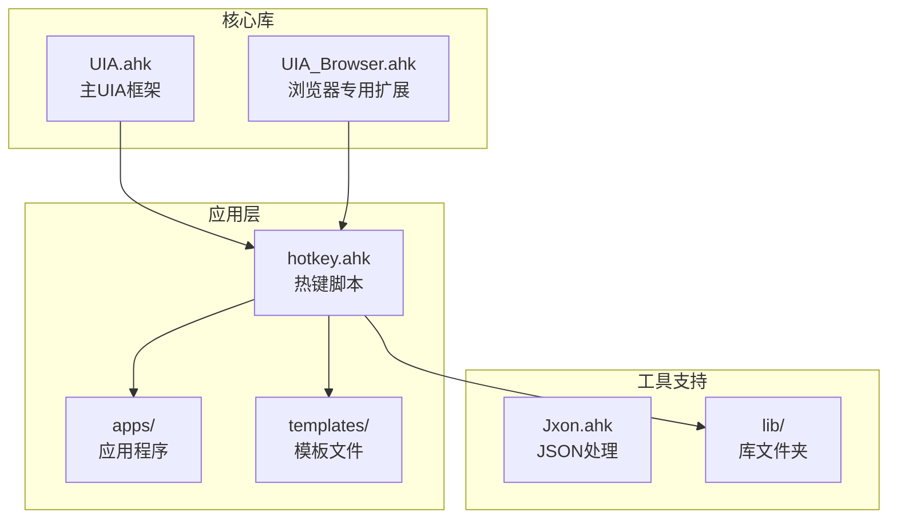
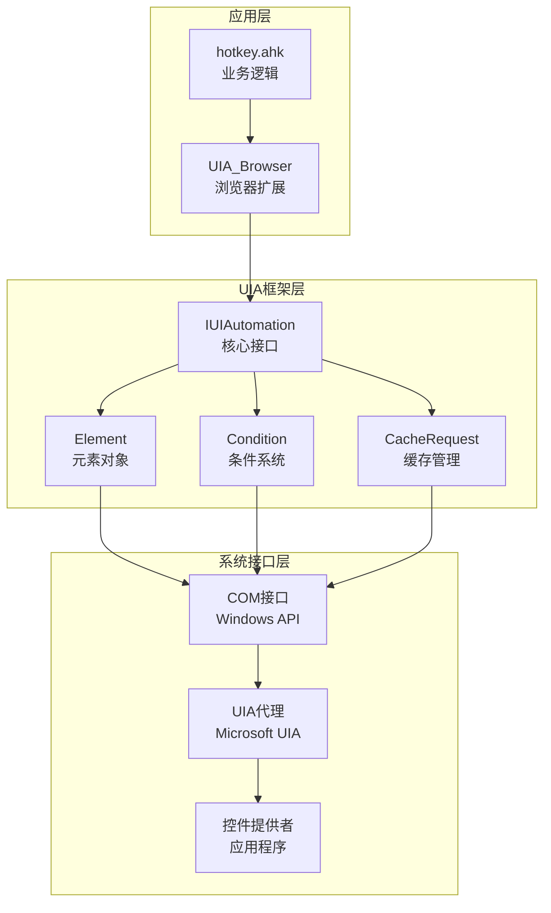
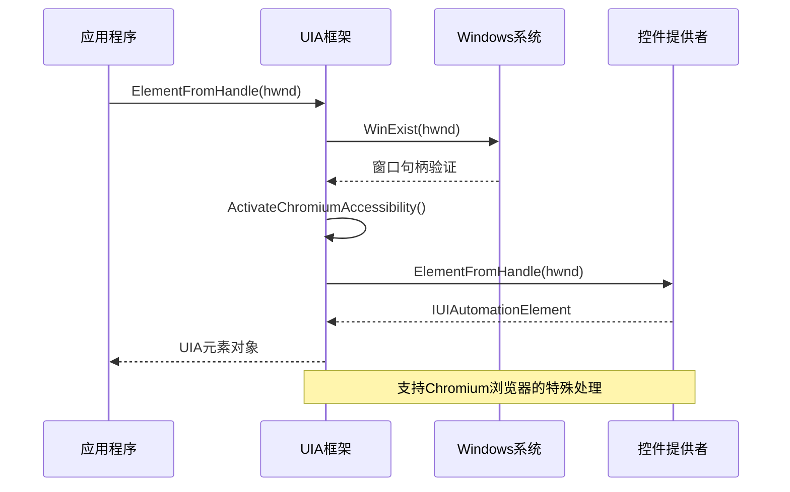
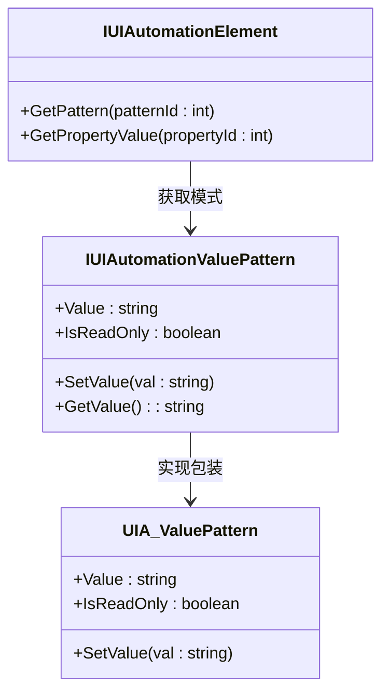
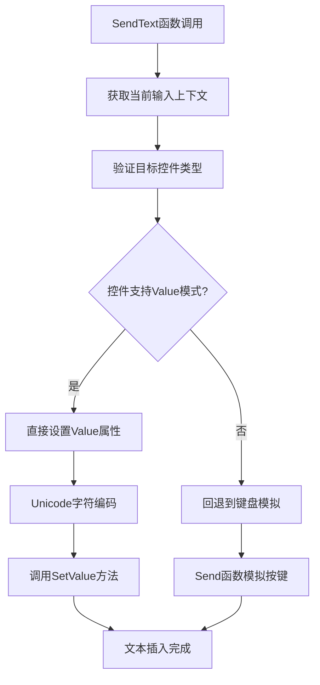
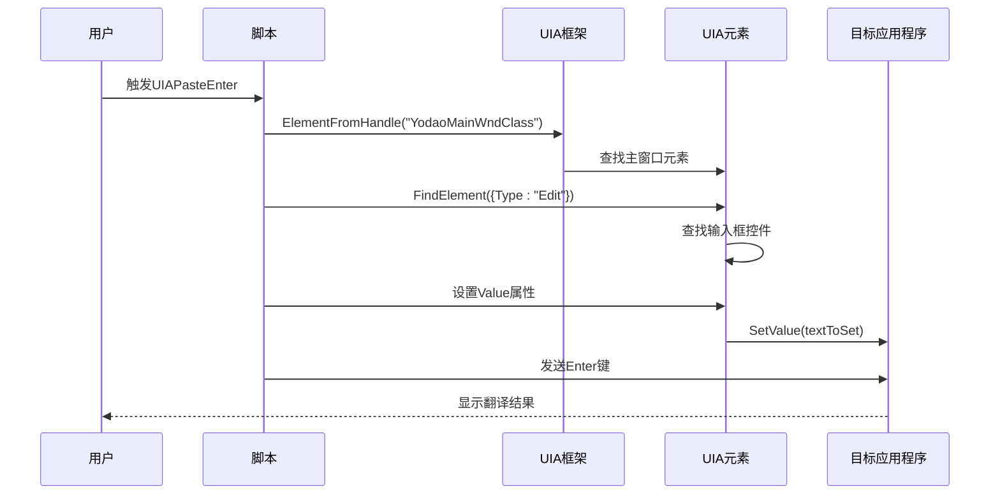
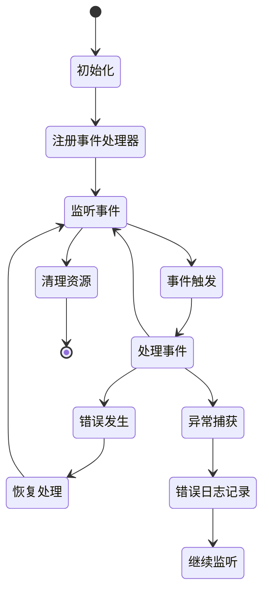
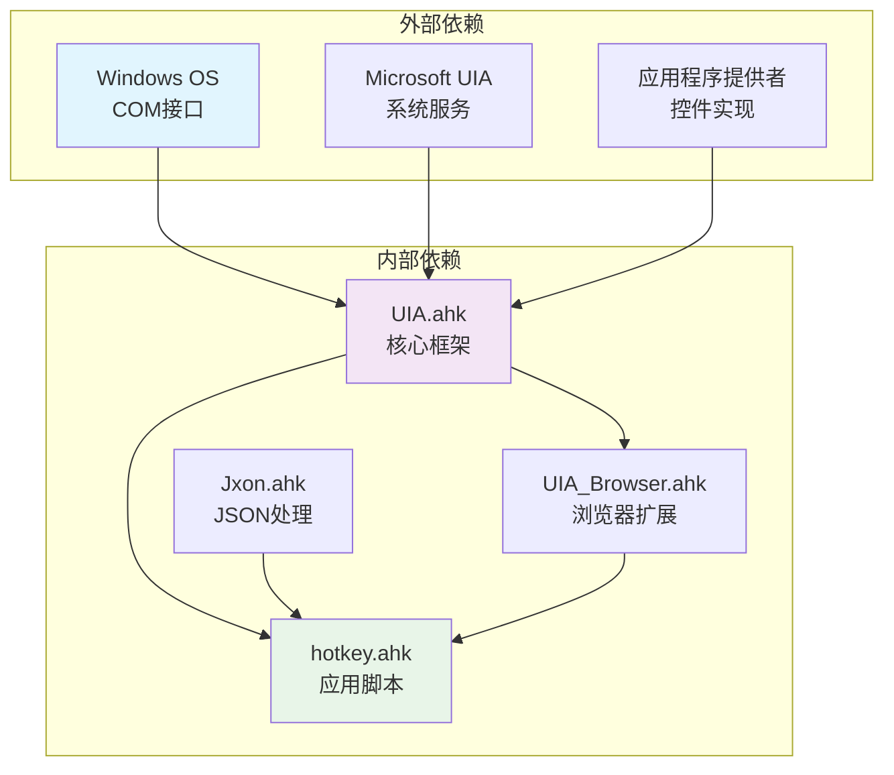

# UIA自动化函数

<cite>
**本文档引用的文件**
- [UIA.ahk](file://lib/UIA.ahk)
- [UIA_Browser.ahk](file://lib/UIA_Browser.ahk)
- [hotkey.ahk](file://hotkey.ahk)
- [README.md](file://README.md)
</cite>

## 目录
1. [简介](#简介)
2. [项目结构](#项目结构)
3. [核心组件](#核心组件)
4. [架构概览](#架构概览)
5. [详细组件分析](#详细组件分析)
6. [依赖关系分析](#依赖关系分析)
7. [性能考虑](#性能考虑)
8. [故障排除指南](#故障排除指南)
9. [结论](#结论)

## 简介

本文档深入分析了AutoHotkey项目中的UIA（通用界面自动化）自动化函数，重点涵盖以下核心功能：

- **ElementFromHandle函数的元素定位机制**：包括窗口句柄获取、UIA元素树遍历、控件类型识别的实现原理
- **Value属性设置机制**：UIA Value模式的属性访问和设置
- **SendText函数的Unicode文本插入机制**：通过UIA框架实现Unicode文本的直接插入
- **事件处理和错误恢复策略**：UIA事件监听、异常处理和容错机制
- **UIAPasteEnter函数的完整工作流程**：元素查找、属性设置、键盘模拟的协调配合

该项目基于Microsoft UI Automation框架，提供了强大的Windows应用程序自动化能力，特别适用于需要精确控件定位和复杂交互场景的自动化需求。

## 项目结构

项目采用模块化设计，主要包含以下核心组件：

**图表来源**
- [UIA.ahk](file://lib/UIA.ahk)
- [UIA_Browser.ahk](file://lib/UIA_Browser.ahk)
- [hotkey.ahk](file://hotkey.ahk)

**章节来源**
- [README.md:1-2](file://README.md#L1-L2)

## 核心组件

### UIA主框架组件

UIA框架提供了完整的UI Automation接口封装，包括：

- **元素定位服务**：ElementFromHandle、ElementFromPoint、ElementFromChromium等
- **条件查询系统**：CreateCondition、FindElement、FindElements等
- **属性访问接口**：GetPropertyValue、GetCachedPropertyValue等
- **事件处理机制**：AddAutomationEventHandler、RemoveAutomationEventHandler等
- **缓存管理**：CreateCacheRequest、BuildUpdatedCache等

### 浏览器自动化扩展

UIA_Browser模块专门针对浏览器自动化场景，提供了：

- **多浏览器支持**：Chrome、Edge、Firefox、Vivaldi等
- **页面导航控制**：前进、后退、刷新、新标签页等
- **JavaScript执行**：通过地址栏执行JavaScript代码
- **元素定位优化**：针对浏览器特殊控件的定位策略

### 热键脚本集成

hotkey.ahk作为应用入口，集成了多种实用功能：

- **程序启动管理**：ToggleWindow系列函数
- **文本处理工具**：SendText、SwitchPunctuation等
- **浏览器自动化**：UIAPasteEnter等专用函数
- **系统集成**：任务计划、权限管理等功能

**章节来源**
- [UIA.ahk:51-153](file://lib/UIA.ahk#L51-L153)
- [UIA_Browser.ahk:1-112](file://lib/UIA_Browser.ahk#L1-L112)
- [hotkey.ahk:1-800](file://hotkey.ahk#L1-L800)

## 架构概览

UIA自动化系统采用分层架构设计，确保了功能的模块化和可扩展性：

**图表来源**
- [UIA.ahk:964-1009](file://lib/UIA.ahk#L964-L1009)
- [UIA_Browser.ahk:458-518](file://lib/UIA_Browser.ahk#L458-L518)

该架构确保了：

1. **抽象层次清晰**：应用层专注于业务逻辑，UIA层处理技术细节
2. **接口标准化**：统一的COM接口保证了跨应用程序的一致性
3. **扩展性强**：模块化设计便于添加新的浏览器支持和功能扩展
4. **性能优化**：缓存机制和批量操作减少了系统调用开销

## 详细组件分析

### ElementFromHandle函数分析

ElementFromHandle是UIA框架的核心元素定位函数，实现了从窗口句柄到UIA元素的精确映射：

**图表来源**
- [UIA.ahk:964-979](file://lib/UIA.ahk#L964-L979)

**实现特点**：

1. **句柄验证**：首先验证传入的窗口句柄有效性
2. **Chromium支持**：自动检测Chromium浏览器并启用辅助功能
3. **元素封装**：返回标准的IUIAutomationElement接口
4. **错误处理**：完善的异常捕获和错误信息反馈

**章节来源**
- [UIA.ahk:964-979](file://lib/UIA.ahk#L964-L979)

### Value属性设置机制

Value属性提供了对可编辑控件内容的直接访问和修改能力：

**图表来源**
- [UIA.ahk:7082-7122](file://lib/UIA.ahk#L7082-L7122)

**工作机制**：

1. **模式获取**：通过GetPattern方法获取Value模式接口
2. **属性访问**：Value属性提供读写访问权限
3. **只读检查**：自动检查IsReadOnly属性防止非法操作
4. **Unicode支持**：使用宽字符字符串确保国际化兼容性

**章节来源**
- [UIA.ahk:7082-7122](file://lib/UIA.ahk#L7082-L7122)

### SendText函数的Unicode文本插入机制

SendText函数实现了高效的Unicode文本直接插入，绕过了传统的键盘模拟：

**图表来源**
- [hotkey.ahk:553-563](file://hotkey.ahk#L553-L563)

**实现优势**：

1. **性能优化**：直接属性设置避免了键盘事件处理开销
2. **可靠性增强**：减少因键盘布局、输入法等因素导致的失败
3. **Unicode支持**：原生支持多字节字符和特殊符号
4. **兼容性**：智能检测控件类型选择最优插入方式

**章节来源**
- [hotkey.ahk:553-563](file://hotkey.ahk#L553-L563)

### UIAPasteEnter函数完整工作流程

UIAPasteEnter函数展示了UIA自动化的核心工作流程，从元素定位到最终执行：

**图表来源**
- [hotkey.ahk:273-294](file://hotkey.ahk#L273-L294)

**关键步骤**：

1. **窗口定位**：使用ElementFromHandle精确定位目标窗口
2. **控件发现**：通过条件查询找到合适的输入控件
3. **属性设置**：直接设置Value属性实现快速文本输入
4. **交互完成**：模拟回车键触发应用程序的处理逻辑

**章节来源**
- [hotkey.ahk:273-294](file://hotkey.ahk#L273-L294)

### 事件处理和错误恢复策略

UIA框架提供了完善的事件处理和错误恢复机制：

**实现特性**：

1. **事件注册**：支持多种UIA事件类型的注册和注销
2. **回调机制**：提供灵活的事件回调函数绑定
3. **异常处理**：完善的try-catch机制确保系统稳定性
4. **资源管理**：自动清理事件处理器和COM对象引用

**章节来源**
- [UIA.ahk:1285-1360](file://lib/UIA.ahk#L1285-L1360)

## 依赖关系分析

UIA自动化系统的依赖关系体现了清晰的分层设计：

**图表来源**
- [UIA.ahk:1-800](file://lib/UIA.ahk#L1-L800)
- [UIA_Browser.ahk:1-800](file://lib/UIA_Browser.ahk#L1-L800)
- [hotkey.ahk:1-800](file://hotkey.ahk#L1-L800)

**依赖特点**：

1. **系统级依赖**：完全依赖Windows操作系统提供的COM接口
2. **框架内聚**：UIA框架内部高度内聚，功能模块化
3. **应用解耦**：应用层通过标准接口与UIA框架交互
4. **扩展友好**：新增浏览器支持不影响现有功能

**章节来源**
- [UIA.ahk:1-800](file://lib/UIA.ahk#L1-L800)
- [UIA_Browser.ahk:1-800](file://lib/UIA_Browser.ahk#L1-L800)
- [hotkey.ahk:1-800](file://hotkey.ahk#L1-L800)

## 性能考虑

UIA自动化系统在性能方面采用了多项优化策略：

### 缓存机制优化

- **延迟加载**：仅在需要时才获取元素的完整属性信息
- **批量操作**：支持一次性获取多个属性减少系统调用次数
- **智能更新**：根据元素变化自动更新缓存内容

### 内存管理优化

- **对象池**：复用COM对象减少内存分配开销
- **及时释放**：确保不再使用的对象及时释放引用计数
- **垃圾回收**：利用AutoHotkey的自动垃圾回收机制

### 线程安全考虑

- **同步访问**：UIA事件处理器遵循COM线程模型要求
- **异常隔离**：事件处理中的异常不影响主线程运行
- **资源保护**：使用RAII模式确保资源正确释放

## 故障排除指南

### 常见问题及解决方案

**问题1：元素定位失败**
- **症状**：ElementFromHandle抛出TargetError异常
- **原因**：窗口句柄无效或应用程序未启用UIA支持
- **解决**：检查窗口是否存在，确认应用程序支持UIA

**问题2：Value属性设置失败**
- **症状**：SetValue调用返回错误或文本未更新
- **原因**：控件处于只读状态或不支持Value模式
- **解决**：检查IsReadOnly属性，考虑使用键盘模拟替代

**问题3：事件处理异常**
- **症状**：事件处理器被意外销毁或事件丢失
- **原因**：违反了COM线程模型或过早释放对象
- **解决**：遵循UIA框架的事件处理规范

**问题4：Chromium浏览器支持问题**
- **症状**：ElementFromHandle无法获取内容元素
- **原因**：浏览器未启用UIA辅助功能
- **解决**：使用ActivateChromiumAccessibility手动启用

**章节来源**
- [UIA.ahk:844-899](file://lib/UIA.ahk#L844-L899)
- [UIA.ahk:964-979](file://lib/UIA.ahk#L964-L979)

## 结论

UIA自动化函数提供了强大而灵活的Windows应用程序自动化能力。通过深入分析ElementFromHandle、Value属性设置、SendText函数和UIAPasteEnter等核心功能，我们可以看到：

1. **架构设计优秀**：分层架构确保了功能的模块化和可扩展性
2. **实现技术先进**：充分利用了Windows UIA框架的强大功能
3. **用户体验良好**：提供了直观易用的API接口和完善的错误处理
4. **性能表现优异**：通过缓存机制和优化策略确保了高效运行

这些特性使得该UIA自动化框架成为Windows应用程序自动化领域的优秀解决方案，特别适用于需要精确控件定位和复杂交互场景的自动化需求。随着技术的不断发展，该框架仍有很大的扩展空间，可以进一步支持更多的应用程序类型和交互模式。