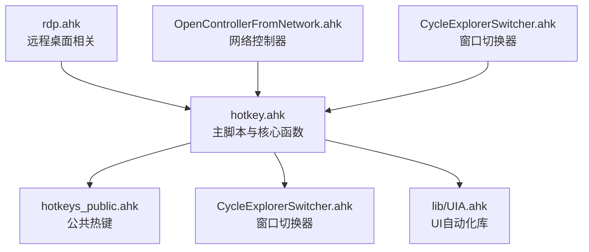
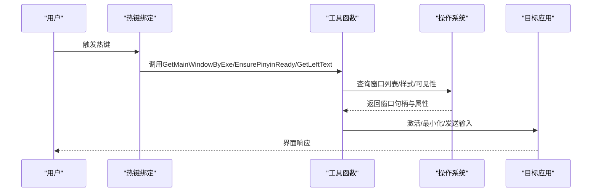
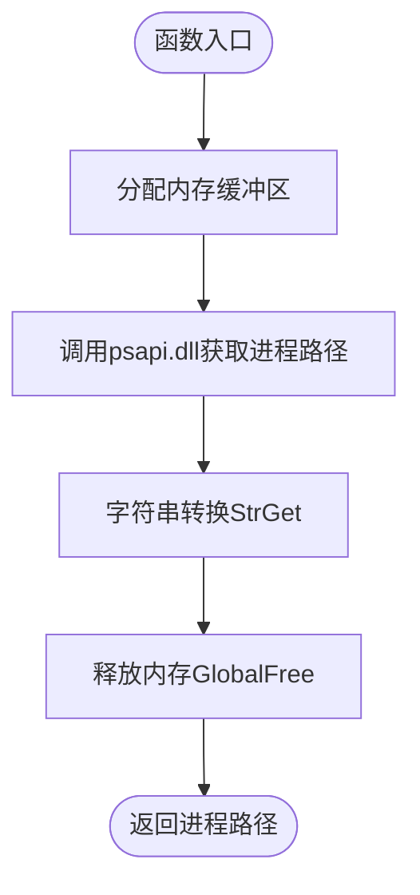
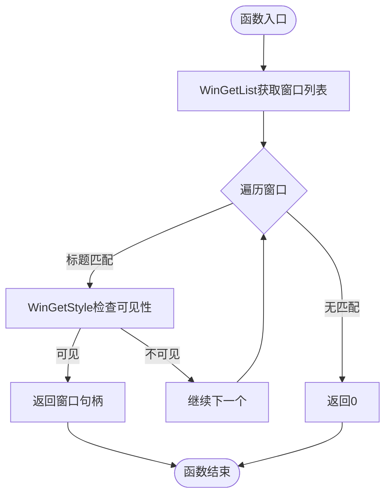
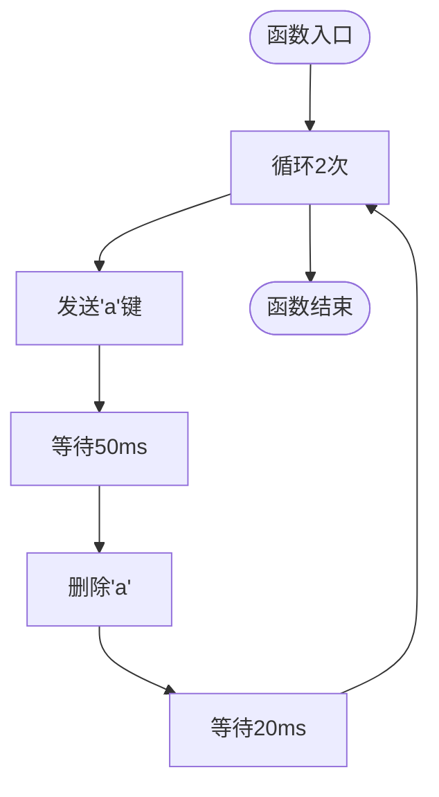
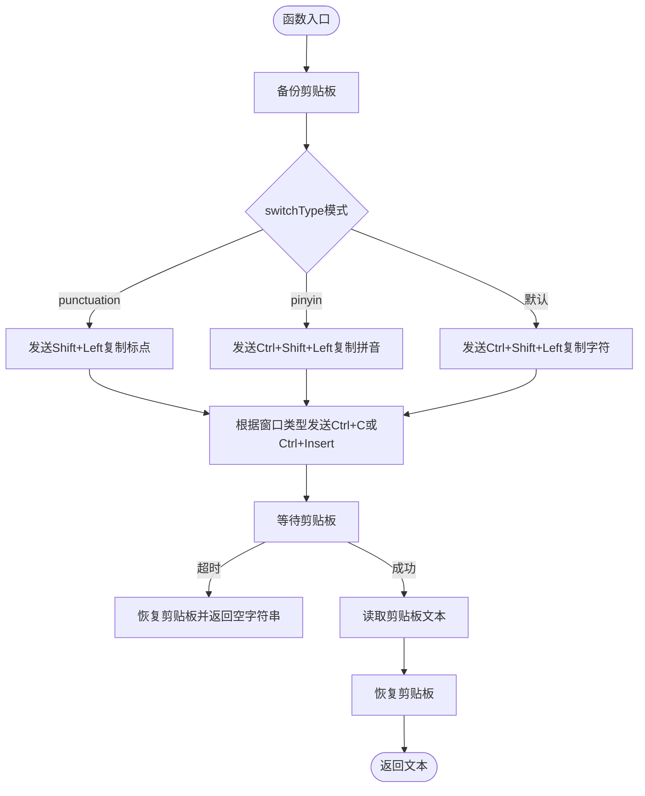
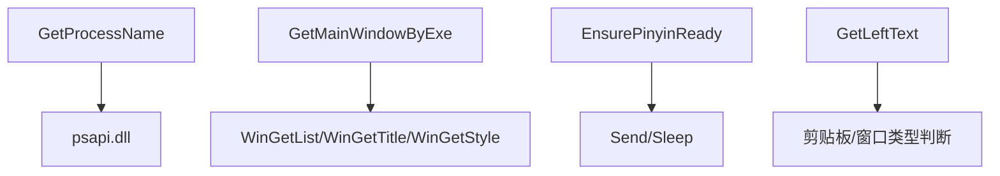

# 工具辅助函数

<cite>
**本文档引用的文件**
- [hotkey.ahk](file://hotkey.ahk)
- [hotkeys_public.ahk](file://hotkeys_public.ahk)
- [CycleExplorerSwitcher.ahk](file://CycleExplorerSwitcher.ahk)
- [UIA.ahk](file://lib/UIA.ahk)
</cite>

## 目录
1. [简介](#简介)
2. [项目结构](#项目结构)
3. [核心组件](#核心组件)
4. [架构概览](#架构概览)
5. [详细组件分析](#详细组件分析)
6. [依赖关系分析](#依赖关系分析)
7. [性能考量](#性能考量)
8. [故障排除指南](#故障排除指南)
9. [结论](#结论)

## 简介
本文档聚焦于AutoHotkey脚本中的工具辅助函数，深入分析以下关键函数的实现机制与使用场景：
- GetProcessName：进程信息获取机制（DLL调用、内存分配、进程路径提取）
- GetMainWindowByExe：主窗口识别算法（窗口列表获取、样式属性检查、可见性验证）
- EnsurePinyinReady：拼音输入法准备逻辑
- GetLeftText：文本上下文获取策略

同时提供这些函数的使用场景、性能考虑与扩展建议，帮助读者在实际开发中高效、稳定地运用这些工具函数。

## 项目结构
该项目采用模块化组织，核心逻辑集中在主脚本文件中，公共热键与工具函数分布在独立文件中，便于维护与复用。

图表来源
- [hotkey.ahk:1-50](file://hotkey.ahk#L1-L50)
- [hotkeys_public.ahk:1-57](file://hotkeys_public.ahk#L1-L57)
- [CycleExplorerSwitcher.ahk:1-50](file://CycleExplorerSwitcher.ahk#L1-L50)
- [UIA.ahk:1-50](file://lib/UIA.ahk#L1-L50)

章节来源
- [hotkey.ahk:1-50](file://hotkey.ahk#L1-L50)
- [hotkeys_public.ahk:1-57](file://hotkeys_public.ahk#L1-L57)
- [CycleExplorerSwitcher.ahk:1-50](file://CycleExplorerSwitcher.ahk#L1-L50)
- [UIA.ahk:1-50](file://lib/UIA.ahk#L1-L50)

## 核心组件
本节概述本次分析涉及的核心函数及其职责：
- GetProcessName(pid)：通过系统DLL获取指定进程的可执行路径
- GetMainWindowByExe(ahk_exe, winTitle)：基于进程与标题筛选主窗口，结合窗口样式判断可见性
- EnsurePinyinReady()：确保输入法处于拼音组合态，为中文输入做准备
- GetLeftText(switchType)：获取光标前文本上下文，支持标点与拼音两种模式

章节来源
- [hotkey.ahk:222-250](file://hotkey.ahk#L222-L250)
- [hotkey.ahk:443-450](file://hotkey.ahk#L443-L450)
- [hotkey.ahk:409-440](file://hotkey.ahk#L409-L440)

## 架构概览
这些工具函数在脚本中的协作关系如下：
- 热键触发器调用窗口切换与应用控制逻辑
- GetMainWindowByExe用于精确识别目标应用主窗口
- EnsurePinyinReady与GetLeftText配合输入法引擎，实现智能中英文切换
- GetProcessName可用于进程级诊断与路径解析

图表来源
- [hotkey.ahk:590-617](file://hotkey.ahk#L590-L617)
- [hotkey.ahk:409-440](file://hotkey.ahk#L409-L440)
- [hotkey.ahk:443-450](file://hotkey.ahk#L443-L450)

## 详细组件分析

### GetProcessName 函数分析
该函数通过系统DLL直接获取进程的可执行路径，实现步骤如下：
- 分配内存缓冲区：使用GlobalAlloc申请足够空间存储路径
- DLL调用：通过psapi.dll的GetModuleFileNameExW获取路径
- 字符串转换：使用StrGet将缓冲区内容转换为AutoHotkey字符串
- 内存释放：调用GlobalFree释放之前分配的内存

图表来源
- [hotkey.ahk:222-237](file://hotkey.ahk#L222-L237)

章节来源
- [hotkey.ahk:222-237](file://hotkey.ahk#L222-L237)

### GetMainWindowByExe 函数分析
该函数用于从同一进程的多个窗口中识别主窗口，核心逻辑包括：
- 获取窗口列表：基于进程标识（ahk_exe）收集所有匹配窗口
- 标题匹配：筛选与目标标题一致的窗口
- 样式检查：通过WinGetStyle获取窗口样式，检查WS_VISIBLE位确保可见性
- 返回主窗口句柄：若找到满足条件的窗口则返回其句柄，否则返回0

图表来源
- [hotkey.ahk:239-250](file://hotkey.ahk#L239-L250)

章节来源
- [hotkey.ahk:239-250](file://hotkey.ahk#L239-L250)

### EnsurePinyinReady 函数分析
该函数确保输入法处于拼音组合态，以便后续中文输入顺畅：
- 循环两次发送'a'键触发拼音组合
- 等待短暂时间后删除，形成“触发-回退”的节奏
- 通过Sleep控制输入法状态切换的时间窗口

图表来源
- [hotkey.ahk:443-450](file://hotkey.ahk#L443-L450)

章节来源
- [hotkey.ahk:443-450](file://hotkey.ahk#L443-L450)

### GetLeftText 函数分析
该函数用于获取光标前的文本上下文，支持不同模式：
- 参数switchType控制复制策略：
  - "punctuation"：复制光标前一位标点符号
  - "pinyin"：复制光标前完整拼音字母
  - 默认：复制光标前一个字符
- 复制策略：根据当前活动窗口类型选择Ctrl+C或Ctrl+Insert
- 剪贴板等待：使用ClipWait确保复制完成
- 恢复状态：在函数退出前恢复剪贴板内容

图表来源
- [hotkey.ahk:409-440](file://hotkey.ahk#L409-L440)

章节来源
- [hotkey.ahk:409-440](file://hotkey.ahk#L409-L440)

## 依赖关系分析
这些工具函数在脚本中的依赖关系如下：
- GetMainWindowByExe依赖WinGetList、WinGetTitle、WinGetStyle等窗口API
- EnsurePinyinReady依赖Send与Sleep进行输入法状态控制
- GetLeftText依赖剪贴板操作与窗口类型判断
- GetProcessName依赖psapi.dll与内存管理API

图表来源
- [hotkey.ahk:222-250](file://hotkey.ahk#L222-L250)
- [hotkey.ahk:409-450](file://hotkey.ahk#L409-L450)

章节来源
- [hotkey.ahk:222-250](file://hotkey.ahk#L222-L250)
- [hotkey.ahk:409-450](file://hotkey.ahk#L409-L450)

## 性能考量
- 内存管理：GetProcessName使用GlobalAlloc/GlobalFree，需确保及时释放，避免内存泄漏
- 窗口枚举：GetMainWindowByExe对窗口列表进行线性扫描，窗口数量较多时可能影响性能
- 输入法状态：EnsurePinyinReady通过多次发送键与Sleep控制状态，建议根据系统响应适当调整等待时间
- 剪贴板操作：GetLeftText频繁使用ClipWait与剪贴板，建议在批量操作时合并处理以减少IO开销

## 故障排除指南
- GetProcessName返回空路径：检查进程ID有效性与权限，确认psapi.dll可用
- GetMainWindowByExe未找到主窗口：确认ahk_exe与winTitle参数正确，检查窗口样式中WS_VISIBLE位
- EnsurePinyinReady无效：检查输入法状态与系统语言设置，适当增加Sleep时间
- GetLeftText返回空：确认当前活动窗口支持复制操作，检查ClipWait等待时间

## 结论
本文档对GetProcessName、GetMainWindowByExe、EnsurePinyinReady与GetLeftText四个工具函数进行了深入分析，涵盖了实现机制、数据流、错误处理与性能考量。这些函数在窗口管理、输入法控制与文本上下文获取方面发挥重要作用，建议在实际使用中结合具体场景进行参数优化与异常处理，以获得更稳定、高效的用户体验。