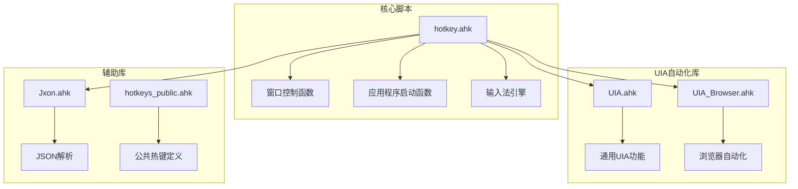
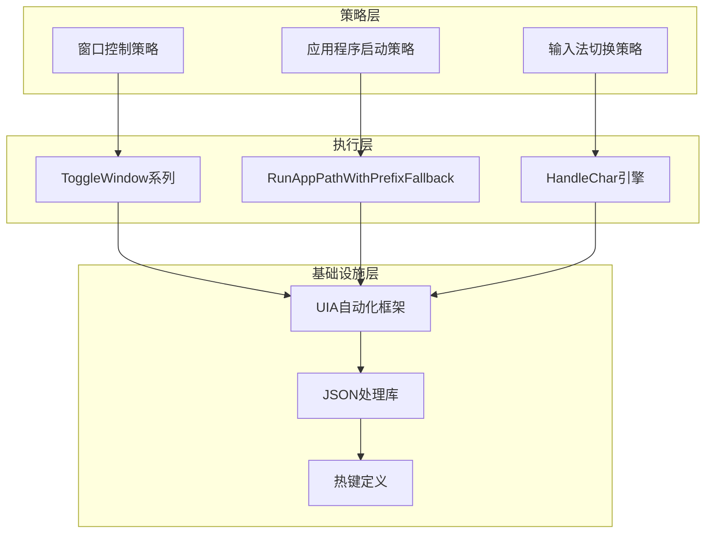
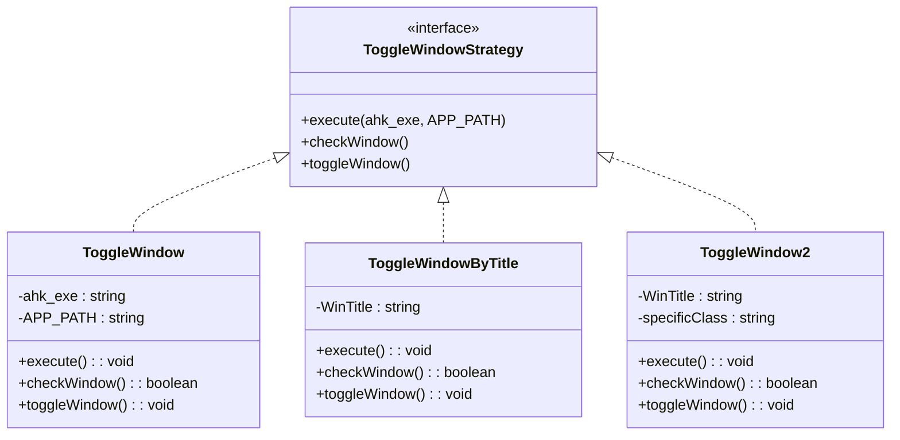
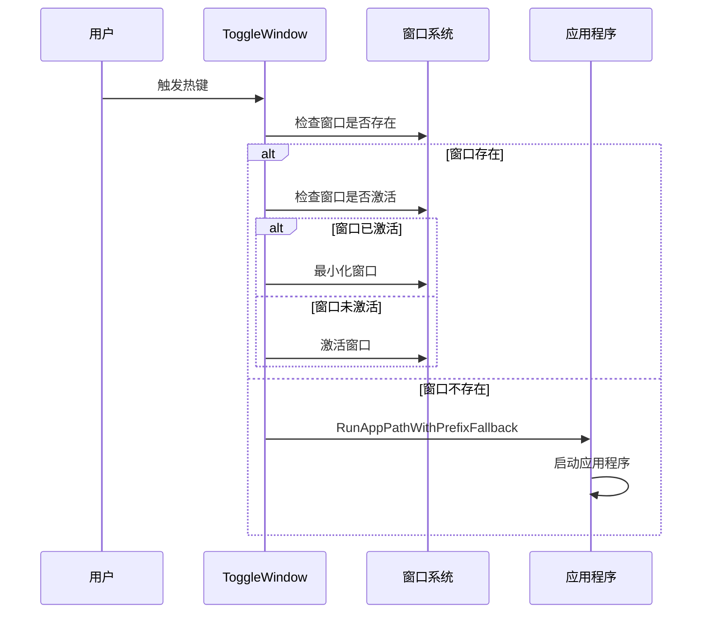
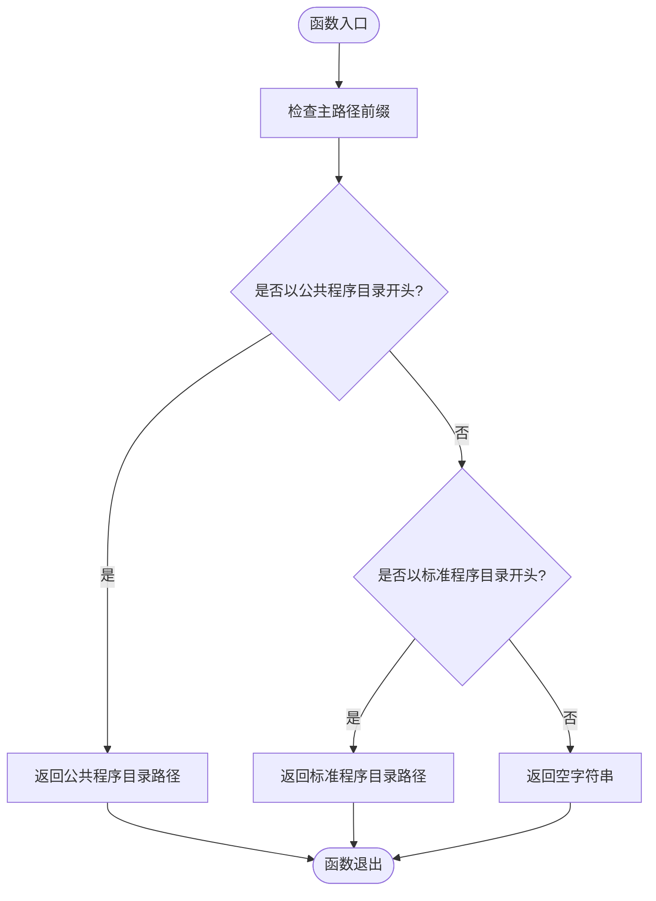
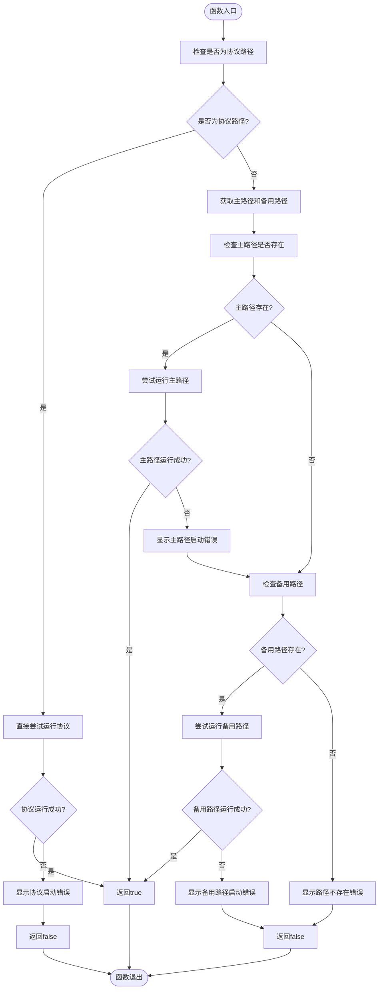
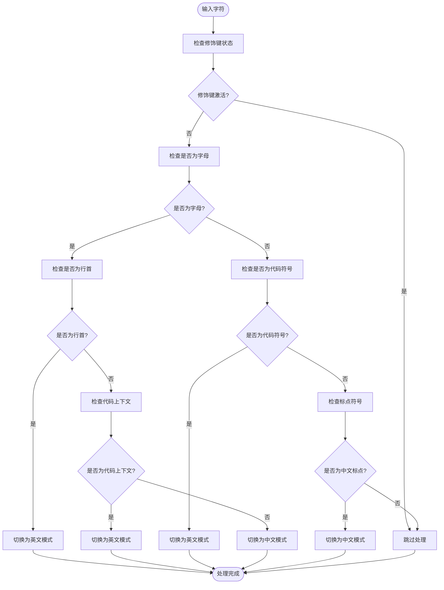
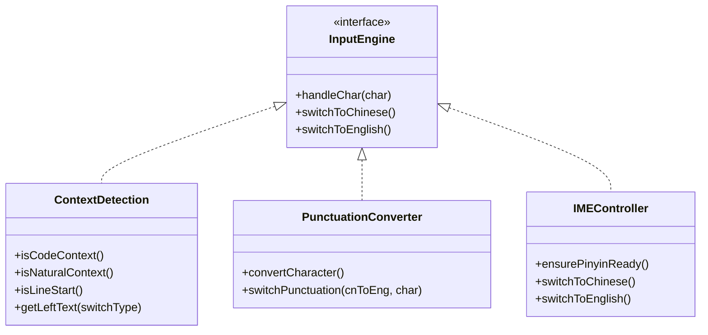
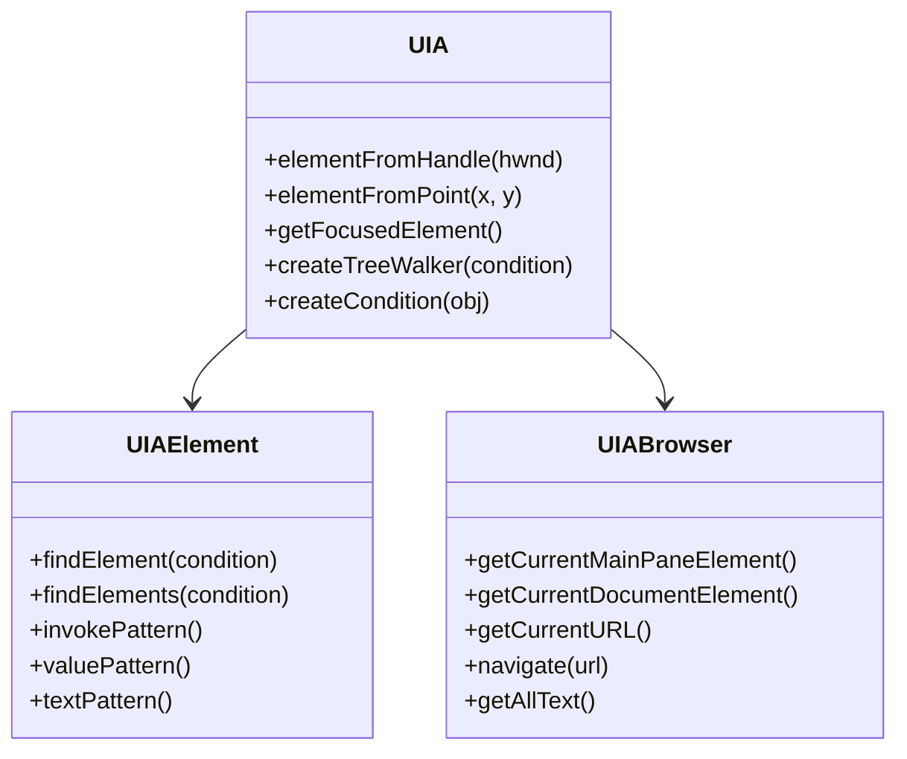
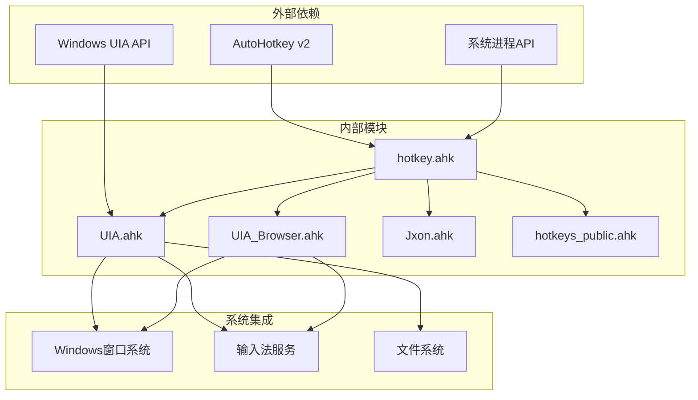

# 核心函数分析

<cite>
**本文档引用的文件**
- [hotkey.ahk](file://hotkey.ahk)
- [UIA.ahk](file://lib/UIA.ahk)
- [UIA_Browser.ahk](file://lib/UIA_Browser.ahk)
- [Jxon.ahk](file://lib/Jxon.ahk)
- [hotkeys_public.ahk](file://hotkeys_public.ahk)
- [README.md](file://README.md)
</cite>

## 目录
1. [简介](#简介)
2. [项目结构](#项目结构)
3. [核心组件](#核心组件)
4. [架构概览](#架构概览)
5. [详细组件分析](#详细组件分析)
6. [依赖分析](#依赖分析)
7. [性能考虑](#性能考虑)
8. [故障排除指南](#故障排除指南)
9. [结论](#结论)

## 简介

hotkey项目是一个基于AutoHotkey v2的脚本系统，旨在提供智能的窗口控制、应用程序启动和输入法引擎功能。该项目通过策略模式实现了灵活的窗口控制机制，通过容错机制确保应用程序启动的可靠性，并通过智能输入法引擎实现了自然语言与代码输入的无缝切换。

## 项目结构

项目采用模块化设计，主要包含以下核心组件：

**图表来源**
- [hotkey.ahk:1-20](file://hotkey.ahk#L1-L20)
- [UIA.ahk:1-50](file://lib/UIA.ahk#L1-L50)
- [UIA_Browser.ahk:1-50](file://lib/UIA_Browser.ahk#L1-L50)

**章节来源**
- [hotkey.ahk:1-20](file://hotkey.ahk#L1-L20)
- [README.md:1-2](file://README.md#L1-L2)

## 核心组件

### 窗口控制函数群组

项目实现了多种窗口控制策略，通过策略模式实现灵活的窗口管理：

- **ToggleWindow系列**: 提供基础的窗口开关控制
- **ToggleWindowByTitle**: 基于窗口标题的精确控制
- **ToggleWindow2/22**: 高级窗口管理，支持多实例处理
- **窗口选择器**: 提供可视化的窗口切换界面

### 应用程序启动系统

通过RunAppPathWithPrefixFallback实现智能的应用程序启动，具备以下特性：

- 路径前缀自动切换
- 协议路径直接启动
- 多层错误处理和回退机制

### 输入法智能引擎

实现了复杂的输入法自动切换逻辑，支持：

- 自然语言与代码环境的智能识别
- 行首输入的特殊处理
- 标点符号的自动转换
- IME状态的精确控制

**章节来源**
- [hotkey.ahk:120-163](file://hotkey.ahk#L120-L163)
- [hotkey.ahk:76-118](file://hotkey.ahk#L76-L118)
- [hotkey.ahk:297-563](file://hotkey.ahk#L297-L563)

## 架构概览

项目采用分层架构设计，通过策略模式和工厂模式实现高度模块化的功能组织：

**图表来源**
- [hotkey.ahk:120-163](file://hotkey.ahk#L120-L163)
- [hotkey.ahk:76-118](file://hotkey.ahk#L76-L118)
- [hotkey.ahk:297-563](file://hotkey.ahk#L297-L563)

## 详细组件分析

### ToggleWindow系列函数分析

ToggleWindow系列函数实现了窗口控制的策略模式，通过不同的匹配条件实现灵活的窗口管理。

#### 核心策略设计

**图表来源**
- [hotkey.ahk:123-163](file://hotkey.ahk#L123-L163)

#### 函数调用流程

**图表来源**
- [hotkey.ahk:123-134](file://hotkey.ahk#L123-L134)
- [hotkey.ahk:135-145](file://hotkey.ahk#L135-L145)

**章节来源**
- [hotkey.ahk:120-163](file://hotkey.ahk#L120-L163)

### SwapProgramsPrefix路径前缀切换函数

该函数实现了智能的路径前缀切换逻辑，支持C盘和D盘程序目录之间的自动转换。

#### 核心算法设计

**图表来源**
- [hotkey.ahk:64-74](file://hotkey.ahk#L64-L74)

#### 参数说明

| 参数 | 类型 | 描述 | 示例 |
|------|------|------|------|
| path | string | 输入的程序路径 | "C:\Program Files\App.exe" |
| 返回值 | string | 转换后的程序路径或空字符串 | "D:\Program Files\App.exe" |

**章节来源**
- [hotkey.ahk:64-74](file://hotkey.ahk#L64-L74)

### RunAppPathWithPrefixFallback容错启动机制

该函数实现了多层容错的应用程序启动机制，确保应用程序能够可靠地启动。

#### 容错策略设计

**图表来源**
- [hotkey.ahk:76-118](file://hotkey.ahk#L76-L118)

#### 错误处理机制

函数实现了多层次的错误处理：

1. **协议路径错误处理**: 直接捕获协议启动异常
2. **文件存在性检查**: 在运行前验证文件路径
3. **运行时异常捕获**: 捕获应用程序启动过程中的异常
4. **用户反馈机制**: 通过消息框提供详细的错误信息

**章节来源**
- [hotkey.ahk:76-118](file://hotkey.ahk#L76-L118)

### 输入法引擎核心算法

输入法引擎实现了复杂的智能切换逻辑，通过多种策略实现自然语言与代码输入的无缝切换。

#### 上下文检测算法

**图表来源**
- [hotkey.ahk:367-404](file://hotkey.ahk#L367-L404)

#### 核心策略实现

**图表来源**
- [hotkey.ahk:308-450](file://hotkey.ahk#L308-L450)

**章节来源**
- [hotkey.ahk:297-563](file://hotkey.ahk#L297-L563)

### UIA自动化函数实现

UIA自动化框架提供了强大的Windows UI自动化能力，支持复杂的用户界面交互。

#### UIA核心功能

**图表来源**
- [UIA.ahk:1000-1100](file://lib/UIA.ahk#L1000-L1100)
- [UIA_Browser.ahk:458-582](file://lib/UIA_Browser.ahk#L458-L582)

#### 浏览器自动化扩展

UIA_Browser类提供了专门的浏览器自动化功能：

- **多浏览器支持**: Chrome、Firefox、Edge等主流浏览器
- **标签页管理**: 新建、切换、关闭标签页
- **页面导航**: 导航到指定URL，等待页面加载
- **JavaScript执行**: 通过地址栏执行JavaScript代码
- **元素定位**: 基于CSS选择器的元素定位

**章节来源**
- [UIA.ahk:1000-1500](file://lib/UIA.ahk#L1000-L1500)
- [UIA_Browser.ahk:1-945](file://lib/UIA_Browser.ahk#L1-L945)

## 依赖分析

项目采用了清晰的依赖层次结构，通过模块化设计实现了高内聚低耦合的架构。

**图表来源**
- [hotkey.ahk:1-20](file://hotkey.ahk#L1-L20)
- [UIA.ahk:1-50](file://lib/UIA.ahk#L1-L50)

**章节来源**
- [hotkey.ahk:1-20](file://hotkey.ahk#L1-L20)
- [UIA.ahk:1-50](file://lib/UIA.ahk#L1-L50)

## 性能考虑

### 策略模式的性能优化

ToggleWindow系列函数通过策略模式实现了高效的窗口控制，避免了重复的窗口状态检查。

### 缓存机制

输入法引擎通过全局变量缓存IME状态，减少了频繁的状态切换开销。

### 异步处理

UIA自动化框架支持异步操作，避免阻塞主线程。

## 故障排除指南

### 常见问题及解决方案

1. **窗口无法激活**: 检查窗口是否处于最小化状态
2. **应用程序启动失败**: 验证路径前缀是否正确
3. **输入法切换异常**: 确认IME服务是否正常运行
4. **UIA自动化失败**: 检查Windows版本兼容性

### 调试技巧

- 使用日志记录关键操作步骤
- 分模块测试核心功能
- 监控系统资源使用情况

**章节来源**
- [hotkey.ahk:76-118](file://hotkey.ahk#L76-L118)
- [hotkey.ahk:367-404](file://hotkey.ahk#L367-L404)

## 结论

hotkey项目通过精心设计的策略模式、容错机制和智能算法，实现了高效可靠的窗口控制和应用程序管理功能。项目架构清晰，模块化程度高，为后续的功能扩展和维护奠定了良好的基础。输入法引擎的智能切换算法体现了对用户体验的深度思考，而UIA自动化框架的集成则展现了项目的技术深度和实用性。