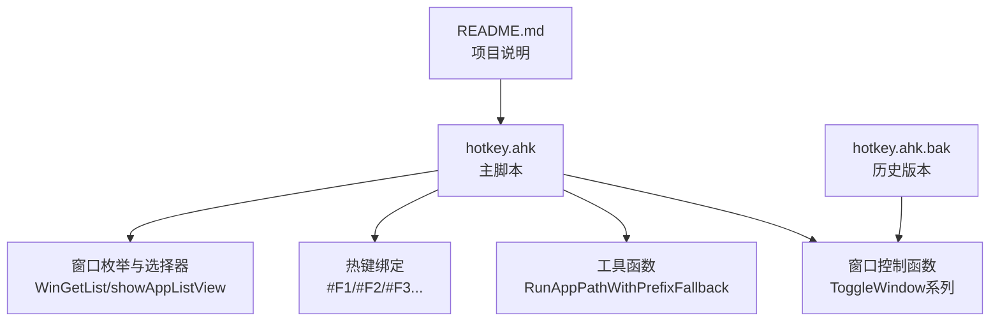
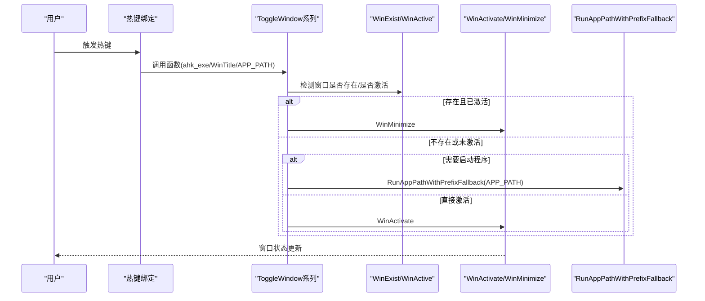
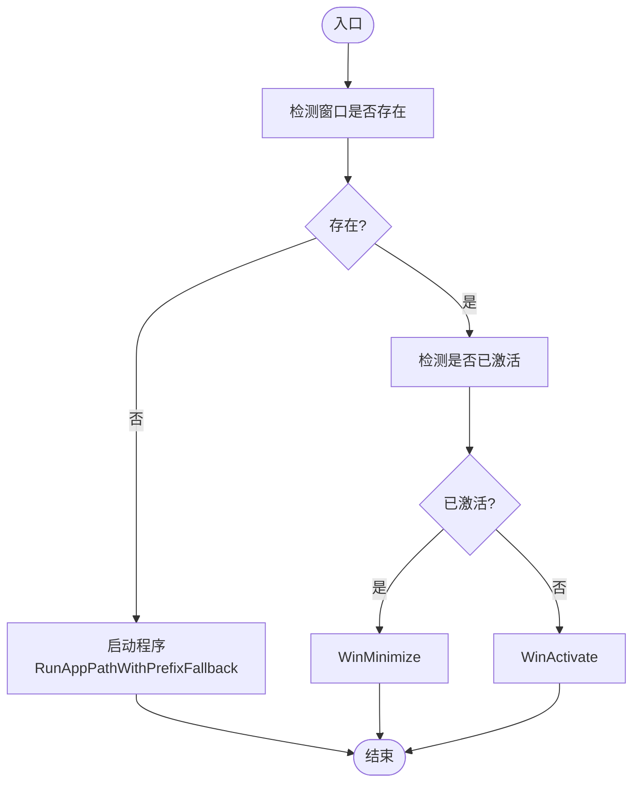
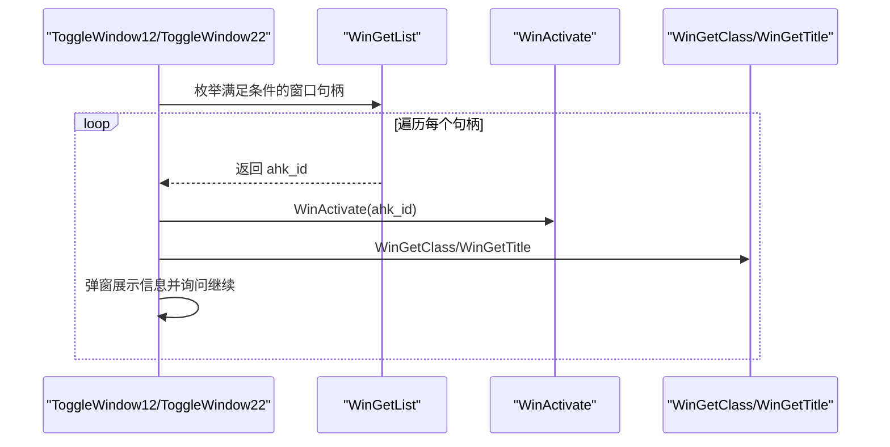
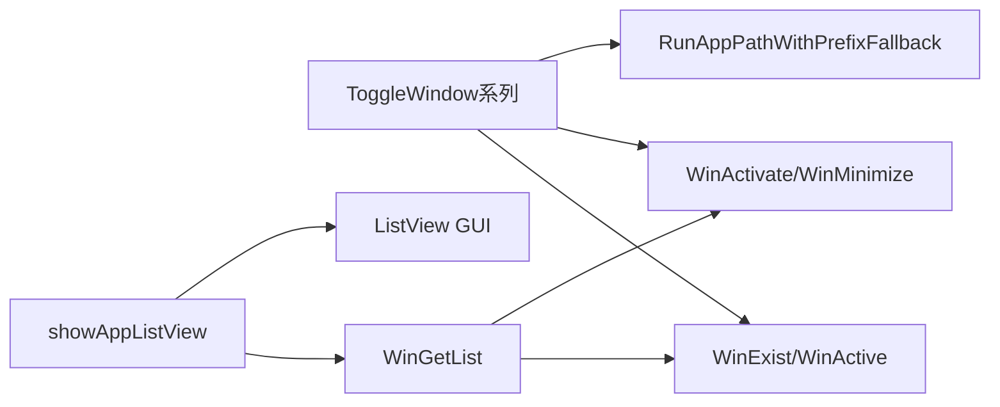

# 窗口控制函数

<cite>
**本文档引用的文件**
- [hotkey.ahk](file://hotkey.ahk)
- [hotkey.ahk.bak](file://hotkey.ahk.bak)
- [README.md](file://README.md)
</cite>

## 目录
1. [简介](#简介)
2. [项目结构](#项目结构)
3. [核心组件](#核心组件)
4. [架构总览](#架构总览)
5. [详细组件分析](#详细组件分析)
6. [依赖关系分析](#依赖关系分析)
7. [性能考量](#性能考量)
8. [故障排查指南](#故障排查指南)
9. [结论](#结论)
10. [附录](#附录)

## 简介
本文件聚焦于窗口控制函数的实现与使用，重点分析以下函数族：
- ToggleWindow 系列：基于进程名的开关控制
- ToggleWindowByTitle 系列：基于标题的开关控制
- ToggleWindow2/ToggleWindow12/ToggleWindow22：多条件筛选与多实例枚举
- WinGetList：多实例窗口枚举与条件匹配

文档将从策略模式设计、标题匹配机制、多条件筛选逻辑、窗口存在性检测、激活状态判断、最小化/激活操作、WinGetList 的多实例处理与优先级规则等方面进行深入剖析，并提供调用示例与参数说明，帮助读者快速掌握这些函数的使用场景与最佳实践。

## 项目结构
该项目为基于 AutoHotkey v2 的热键脚本，窗口控制函数集中于主脚本文件中，配合若干工具函数与热键绑定，形成统一的窗口切换与管理能力。

图表来源
- [hotkey.ahk:120-163](file://hotkey.ahk#L120-L163)
- [hotkey.ahk:1477-1564](file://hotkey.ahk#L1477-L1564)
- [hotkey.ahk.bak:71-105](file://hotkey.ahk.bak#L71-L105)

章节来源
- [hotkey.ahk:1-20](file://hotkey.ahk#L1-L20)
- [README.md:1-2](file://README.md#L1-L2)

## 核心组件
- ToggleWindow(ahk_exe, APP_PATH)
  - 基于进程名（ahk_exe）进行存在性检测与激活状态判断，实现最小化/激活切换。
- ToggleWindowByTitle(ahk_exe, WinTitle, APP_PATH)
  - 基于标题（WinTitle）进行存在性检测与激活状态判断，实现最小化/激活切换。
- ToggleWindow2(ahk_exe, WinTitle, APP_PATH)
  - 在 WinExist/WinActive 中加入第三个参数（排除类名），用于过滤特定类型窗口。
- ToggleWindow12/ToggleWindow22
  - 使用 WinGetList 枚举满足条件的所有窗口句柄，逐个激活并展示信息，便于调试与多实例处理。
- WinGetList
  - 支持按进程名、标题、排除类名三段式条件进行窗口枚举，返回句柄集合。
- RunAppPathWithPrefixFallback
  - 路径前缀切换与协议路径处理，增强跨盘符/路径差异的兼容性。

章节来源
- [hotkey.ahk:120-163](file://hotkey.ahk#L120-L163)
- [hotkey.ahk:180-221](file://hotkey.ahk#L180-L221)
- [hotkey.ahk:76-118](file://hotkey.ahk#L76-L118)

## 架构总览
窗口控制函数围绕“存在性检测 -> 激活状态判断 -> 最小化/激活”的通用流程展开，同时通过 WinGetList 实现多实例窗口的枚举与选择。策略模式体现在：
- ToggleWindow：以进程名为唯一筛选条件
- ToggleWindowByTitle：以标题为筛选条件
- ToggleWindow2：在进程名基础上增加排除类名的过滤
- ToggleWindow12/ToggleWindow22：通过 WinGetList 枚举并逐一处理，实现更精细的多实例控制

图表来源
- [hotkey.ahk:120-163](file://hotkey.ahk#L120-L163)
- [hotkey.ahk:76-118](file://hotkey.ahk#L76-L118)

## 详细组件分析

### ToggleWindow 系列函数
- 设计要点
  - 策略模式：通过不同的筛选条件（进程名 vs 标题）选择不同的匹配策略。
  - 状态机：存在性检测与激活状态判断构成二元状态，驱动最小化/激活动作。
  - 启动兜底：当窗口不存在时，使用 RunAppPathWithPrefixFallback 进行路径兼容性处理。
- 函数签名与参数
  - ToggleWindow(ahk_exe, APP_PATH)
    - ahk_exe：进程名（如 notepad++.exe）
    - APP_PATH：程序路径（支持协议路径与跨盘符路径）
  - ToggleWindowByTitle(ahk_exe, WinTitle, APP_PATH)
    - WinTitle：窗口标题（支持正则/模糊匹配）
  - ToggleWindow2(ahk_exe, WinTitle, APP_PATH)
    - 第三个参数用于排除特定类名（如 Photos and Videos），避免误触
- 调用示例
  - #F2::ToggleWindow("wemeetapp.exe", A_ProgramsCommon "\腾讯会议.lnk")
  - #F3::ToggleWindow("clash-verge.exe", A_ProgramsCommon "\Clash Verge.lnk")

图表来源
- [hotkey.ahk:120-163](file://hotkey.ahk#L120-L163)
- [hotkey.ahk:76-118](file://hotkey.ahk#L76-L118)

章节来源
- [hotkey.ahk:120-163](file://hotkey.ahk#L120-L163)
- [hotkey.ahk:589-617](file://hotkey.ahk#L589-L617)
- [hotkey.ahk:618-636](file://hotkey.ahk#L618-L636)

### ToggleWindowByTitle 标题匹配机制
- 标题匹配策略
  - 直接基于 WinTitle 进行 WinExist/WinActive 检测，适合标题稳定的应用。
  - 与 ahk_exe 配合可提高匹配精度，避免同标题的多个实例冲突。
- 使用场景
  - 微信读书、小红书等应用，标题相对固定，适合使用该函数族。
- 注意事项
  - 标题可能随语言/版本变化，需结合 ahk_exe 或使用更稳定的匹配策略。

章节来源
- [hotkey.ahk:135-146](file://hotkey.ahk#L135-L146)
- [hotkey.ahk:618-636](file://hotkey.ahk#L618-L636)

### ToggleWindow2 多条件筛选逻辑
- 筛选条件
  - WinExist("ahk_exe " ahk_exe, WinTitle, "排除类名")
  - WinActive("ahk_exe " ahk_exe, WinTitle, "排除类名")
- 排除类名的作用
  - 通过第三个参数排除特定类名（如 Photos and Videos），避免误触媒体类窗口。
- 适用场景
  - 需要精确控制窗口类型的场景，避免与系统媒体窗口混淆。

章节来源
- [hotkey.ahk:152-163](file://hotkey.ahk#L152-L163)
- [hotkey.ahk:180-198](file://hotkey.ahk#L180-L198)

### WinGetList 多实例窗口处理
- 枚举能力
  - WinGetList("ahk_exe " ahk_exe, WinTitle, "排除类名")
  - 返回满足条件的窗口句柄集合，支持遍历与逐一处理。
- 调试与可视化
  - ToggleWindow12/ToggleWindow22 通过 WinGetList 枚举并逐一激活，展示类名与标题，便于调试多实例问题。
- 与 showAppListView 的关系
  - showAppListView 通过 WinGetList 获取同一类名的多个窗口，若仅有一个则直接激活/最小化，否则弹出列表供选择。

图表来源
- [hotkey.ahk:180-198](file://hotkey.ahk#L180-L198)
- [hotkey.ahk:201-221](file://hotkey.ahk#L201-L221)
- [hotkey.ahk:1477-1564](file://hotkey.ahk#L1477-L1564)

章节来源
- [hotkey.ahk:180-221](file://hotkey.ahk#L180-L221)
- [hotkey.ahk:1477-1564](file://hotkey.ahk#L1477-L1564)

### 窗口存在性检测、激活状态判断与最小化/激活操作
- 存在性检测
  - WinExist("ahk_exe " ahk_exe[, WinTitle[, ExcludeClass]])
  - WinExist(WinTitle)
- 激活状态判断
  - WinActive("ahk_exe " ahk_exe[, WinTitle[, ExcludeClass]])
  - WinActive(WinTitle)
- 最小化/激活操作
  - WinMinimize
  - WinActivate
- RunAppPathWithPrefixFallback
  - 路径前缀切换（C:/D:）、协议路径处理、错误提示与回退逻辑。

章节来源
- [hotkey.ahk:120-163](file://hotkey.ahk#L120-L163)
- [hotkey.ahk:76-118](file://hotkey.ahk#L76-L118)

### 参数说明与使用场景
- ahk_exe（进程名）
  - 作用：以进程名作为窗口筛选条件，适合进程名稳定的程序。
  - 使用场景：Notepad++、微信、Edge、VS Code 等。
- WinTitle（窗口标题）
  - 作用：以标题作为筛选条件，适合标题稳定的程序。
  - 使用场景：微信读书、小红书等。
- APP_PATH（程序路径）
  - 作用：当窗口不存在时启动程序；支持协议路径与跨盘符路径。
  - 使用场景：启动本地程序或通过协议启动应用。
- ExcludeClass（排除类名）
  - 作用：在 WinExist/WinActive 中作为第三个参数，排除特定类名窗口。
  - 使用场景：避免与媒体类窗口（如 Photos and Videos）混淆。

章节来源
- [hotkey.ahk:120-163](file://hotkey.ahk#L120-L163)
- [hotkey.ahk:589-617](file://hotkey.ahk#L589-L617)
- [hotkey.ahk:618-636](file://hotkey.ahk#L618-L636)

## 依赖关系分析
- ToggleWindow 系列函数依赖于：
  - WinExist/WinActive：窗口存在性与激活状态判断
  - WinActivate/WinMinimize：窗口状态切换
  - RunAppPathWithPrefixFallback：启动程序与路径兼容
- WinGetList 依赖于：
  - AutoHotkey v2 的窗口枚举能力
  - 可选的排除类名参数，用于过滤特定类型窗口
- showAppListView 依赖于：
  - WinGetList 枚举窗口
  - GUI 控件（ListView）进行多实例选择

图表来源
- [hotkey.ahk:120-163](file://hotkey.ahk#L120-L163)
- [hotkey.ahk:1477-1564](file://hotkey.ahk#L1477-L1564)
- [hotkey.ahk:76-118](file://hotkey.ahk#L76-L118)

章节来源
- [hotkey.ahk:120-163](file://hotkey.ahk#L120-L163)
- [hotkey.ahk:1477-1564](file://hotkey.ahk#L1477-L1564)
- [hotkey.ahk:76-118](file://hotkey.ahk#L76-L118)

## 性能考量
- WinGetList 枚举成本
  - 多实例枚举会带来一定性能开销，建议仅在需要时使用（如调试或多实例场景）。
- WinExist/WinActive 的开销
  - 单次检测成本较低，但在高频热键触发场景下仍需注意避免重复调用。
- 启动程序的延迟
  - RunAppPathWithPrefixFallback 包含路径检查与启动等待，建议在热键绑定中合理安排等待时间。
- 建议
  - 对于单一实例应用，优先使用 ToggleWindow/ToggleWindowByTitle。
  - 对于多实例应用，使用 WinGetList 进行枚举与选择。
  - 在热键绑定中避免过于频繁的窗口枚举。

[本节为通用指导，无需特定文件来源]

## 故障排查指南
- 窗口未切换
  - 检查 WinTitle 是否正确，必要时结合 ahk_exe。
  - 检查排除类名参数是否导致误过滤。
- 多实例冲突
  - 使用 WinGetList 枚举并逐一激活，确认目标实例。
  - 使用 showAppListView 弹出列表进行选择。
- 启动失败
  - 检查 APP_PATH 是否存在，必要时使用 RunAppPathWithPrefixFallback 的回退逻辑。
  - 检查协议路径是否有效。
- 权限问题
  - 确认脚本以管理员权限运行，避免部分系统窗口无法激活。

章节来源
- [hotkey.ahk:76-118](file://hotkey.ahk#L76-L118)
- [hotkey.ahk:180-221](file://hotkey.ahk#L180-L221)
- [hotkey.ahk:1477-1564](file://hotkey.ahk#L1477-L1564)

## 结论
ToggleWindow 系列函数通过策略模式实现了灵活的窗口控制：以进程名为条件的 ToggleWindow、以标题为条件的 ToggleWindowByTitle、以及通过 WinGetList 实现的多实例枚举与选择。配合 WinExist/WinActive 的存在性与激活状态判断，以及 WinActivate/WinMinimize 的状态切换，形成了完整而高效的窗口切换体系。在实际使用中，应根据应用特性选择合适的策略，并在多实例场景下借助 WinGetList 与 showAppListView 提升用户体验。

[本节为总结，无需特定文件来源]

## 附录
- 热键绑定示例
  - #F2::ToggleWindow("wemeetapp.exe", A_ProgramsCommon "\腾讯会议.lnk")
  - #F3::ToggleWindow("clash-verge.exe", A_ProgramsCommon "\Clash Verge.lnk")
  - #F4::ToggleWindowByTitle("Androws.exe", "小红书", A_ProgramsCommon "\小红书.lnk")
  - #F5::ToggleWindowByTitle("Androws.exe", "微信读书", A_ProgramsCommon "\微信读书.lnk")
- 调试与多实例处理
  - ToggleWindow12/ToggleWindow22：通过 WinGetList 枚举并逐一激活，展示类名与标题。
  - showAppListView：按类名枚举窗口，单实例直接切换，多实例弹出列表选择。

章节来源
- [hotkey.ahk:589-636](file://hotkey.ahk#L589-L636)
- [hotkey.ahk:180-221](file://hotkey.ahk#L180-L221)
- [hotkey.ahk:1477-1564](file://hotkey.ahk#L1477-L1564)