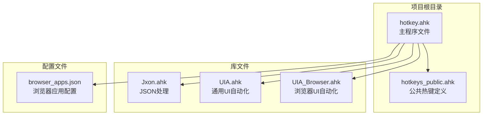
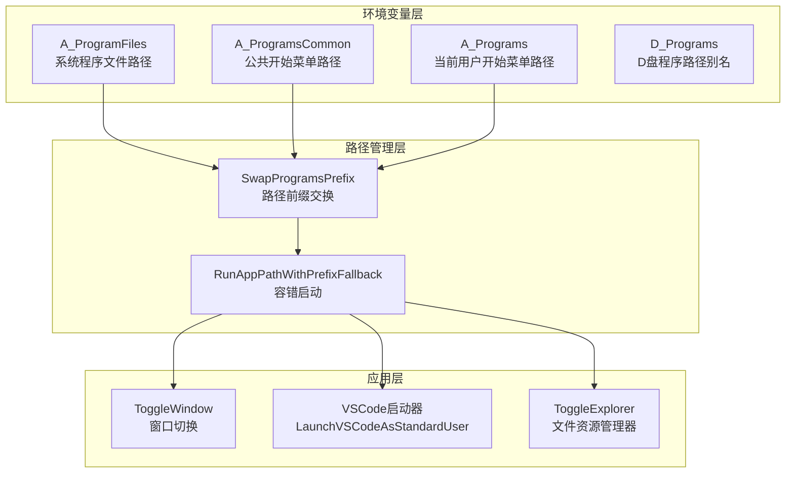
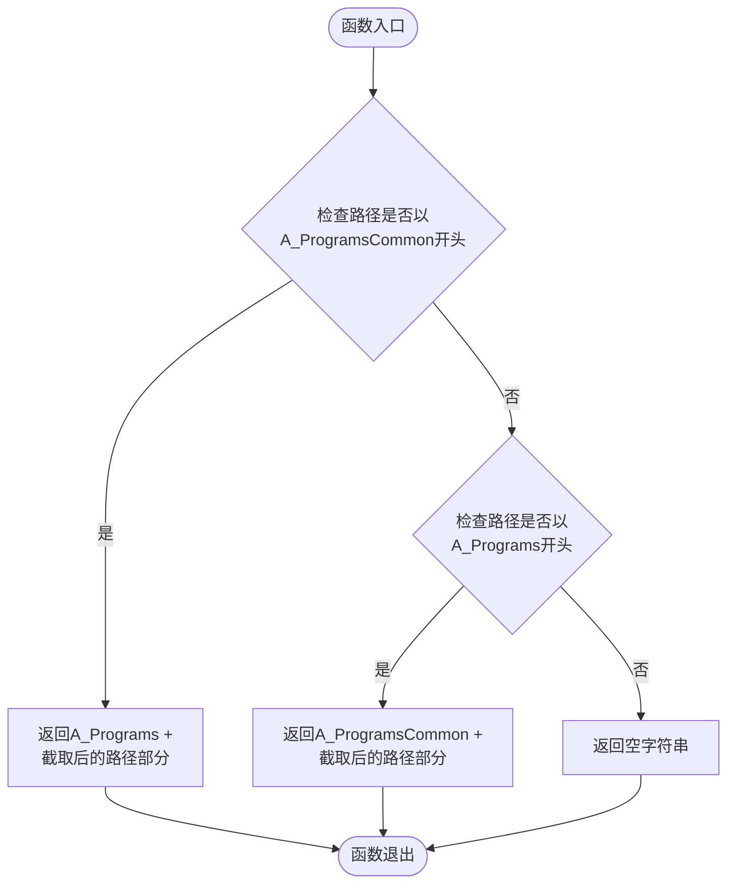
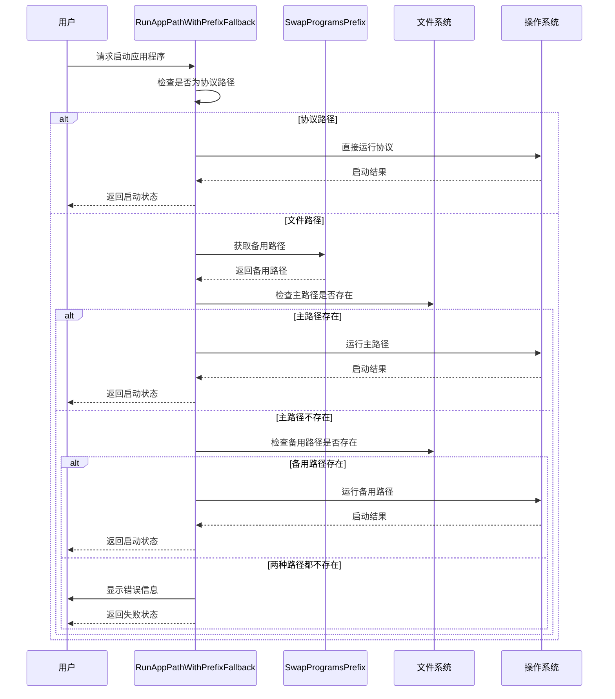
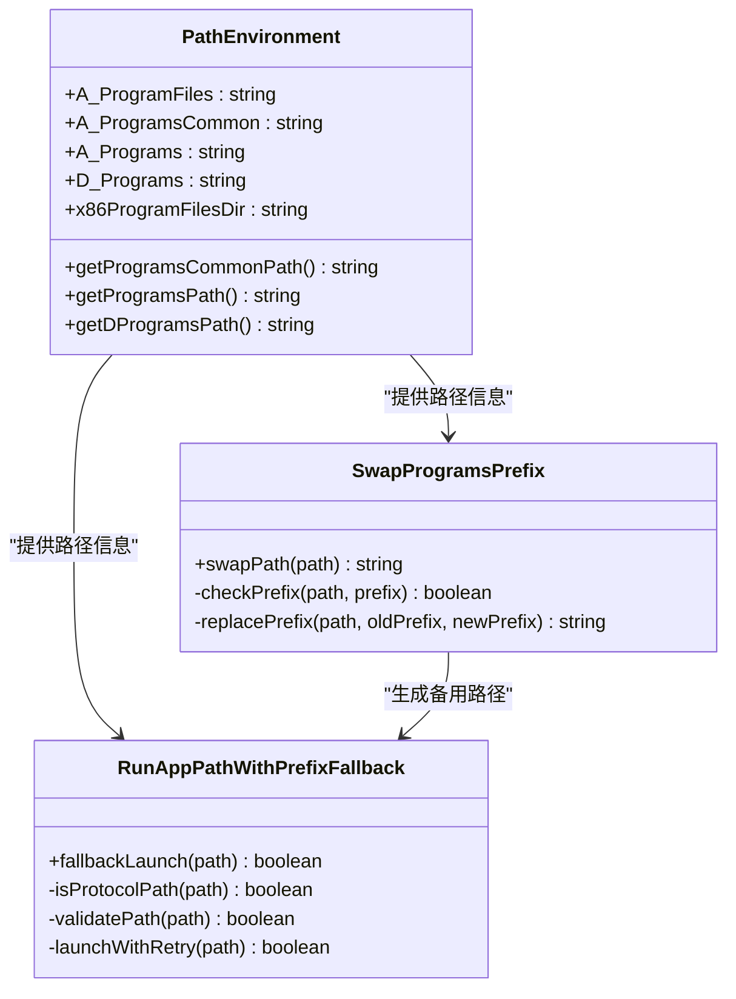
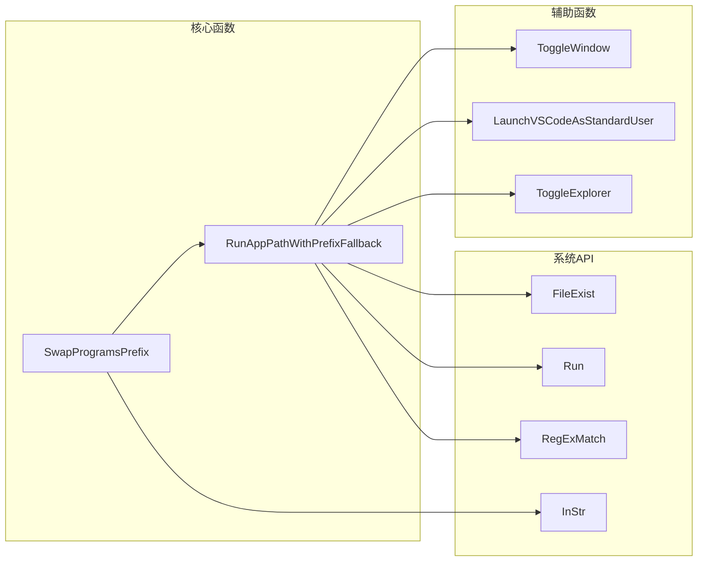

# 路径管理函数

<cite>
**本文档引用的文件**
- [hotkey.ahk](file://hotkey.ahk)
- [hotkeys_public.ahk](file://hotkeys_public.ahk)
</cite>

## 目录
1. [简介](#简介)
2. [项目结构](#项目结构)
3. [核心组件](#核心组件)
4. [架构概览](#架构概览)
5. [详细组件分析](#详细组件分析)
6. [依赖关系分析](#依赖关系分析)
7. [性能考虑](#性能考虑)
8. [故障排除指南](#故障排除指南)
9. [结论](#结论)
10. [附录](#附录)

## 简介
本文档深入分析Autohotkey项目中的路径管理函数，重点研究SwapProgramsPrefix和RunAppPathWithPrefixFallback两个核心函数。这两个函数负责处理程序路径的前缀交换和容错启动机制，确保应用程序能够在不同磁盘分区和用户配置环境下正确启动。

## 项目结构
该项目采用模块化设计，主要包含以下关键文件：
- hotkey.ahk：主程序文件，包含路径管理函数和热键绑定
- hotkeys_public.ahk：公共热键字符串定义
- lib/：第三方库文件（Jxon.ahk、UIA.ahk、UIA_Browser.ahk）

**图表来源**
- [hotkey.ahk:1-20](file://hotkey.ahk#L1-L20)
- [hotkeys_public.ahk:1-57](file://hotkeys_public.ahk#L1-L57)

**章节来源**
- [hotkey.ahk:1-20](file://hotkey.ahk#L1-L20)
- [hotkeys_public.ahk:1-57](file://hotkeys_public.ahk#L1-L57)

## 核心组件
本项目的核心路径管理功能由两个主要函数组成：

### SwapProgramsPrefix函数
负责在程序路径的前缀之间进行智能切换，支持从公共开始菜单路径切换到当前用户开始菜单路径，反之亦然。

### RunAppPathWithPrefixFallback函数
提供容错启动机制，能够处理协议路径、文件存在性验证和备用路径切换。

**章节来源**
- [hotkey.ahk:64-118](file://hotkey.ahk#L64-L118)

## 架构概览
路径管理系统采用分层架构设计，通过环境变量和正则表达式实现灵活的路径管理：

**图表来源**
- [hotkey.ahk:55-74](file://hotkey.ahk#L55-L74)
- [hotkey.ahk:64-118](file://hotkey.ahk#L64-L118)

## 详细组件分析

### SwapProgramsPrefix函数分析

#### 函数实现原理
SwapProgramsPrefix函数实现了智能的路径前缀交换机制：

**图表来源**
- [hotkey.ahk:64-74](file://hotkey.ahk#L64-L74)

#### 关键实现细节
1. **路径识别机制**：使用InStr函数进行精确的路径前缀匹配
2. **大小写不敏感比较**：通过第三个参数实现跨平台兼容性
3. **字符串截取操作**：使用SubStr函数提取路径的相对部分
4. **边界条件处理**：当无法识别路径类型时返回空字符串

#### 数据结构复杂度
- 时间复杂度：O(n)，其中n是路径字符串长度
- 空间复杂度：O(n)，用于返回新的字符串

**章节来源**
- [hotkey.ahk:64-74](file://hotkey.ahk#L64-L74)

### RunAppPathWithPrefixFallback函数分析

#### 容错启动机制
该函数提供了多层次的启动容错策略：

**图表来源**
- [hotkey.ahk:76-118](file://hotkey.ahk#L76-L118)

#### 协议路径检测算法
函数使用正则表达式实现精确的协议路径识别：

**图表来源**
- [hotkey.ahk:77-86](file://hotkey.ahk#L77-L86)

#### 错误处理策略
函数实现了完善的错误处理机制：

1. **异常捕获**：使用try-catch块捕获运行时错误
2. **用户反馈**：通过MsgBox提供详细的错误信息
3. **状态返回**：明确返回成功或失败状态
4. **降级策略**：在多种路径都失败时提供最终的错误提示

**章节来源**
- [hotkey.ahk:76-118](file://hotkey.ahk#L76-L118)

### 环境变量配置分析

#### 路径环境变量定义
项目使用多个环境变量来管理程序路径：

**图表来源**
- [hotkey.ahk:55-74](file://hotkey.ahk#L55-L74)
- [hotkey.ahk:64-118](file://hotkey.ahk#L64-L118)

#### 路径配置最佳实践
1. **统一路径管理**：使用环境变量集中管理路径配置
2. **前缀交换机制**：实现跨用户配置的路径兼容性
3. **容错启动策略**：提供多级路径验证和降级处理
4. **协议路径支持**：支持URI协议的直接启动

**章节来源**
- [hotkey.ahk:55-74](file://hotkey.ahk#L55-L74)

## 依赖关系分析

### 函数间依赖关系

**图表来源**
- [hotkey.ahk:64-118](file://hotkey.ahk#L64-L118)
- [hotkey.ahk:123-145](file://hotkey.ahk#L123-L145)

### 外部依赖分析
项目依赖以下外部组件：
- AutoHotkey v2.0：核心脚本引擎
- Windows系统API：文件系统和进程管理
- COM对象：Shell.Application和WScript.Shell
- 正则表达式引擎：字符串匹配和验证

**章节来源**
- [hotkey.ahk:1-10](file://hotkey.ahk#L1-L10)

## 性能考虑

### 时间复杂度分析
1. **SwapProgramsPrefix**：O(n) - 字符串前缀匹配和截取操作
2. **RunAppPathWithPrefixFallback**：O(n) - 最坏情况下需要检查两个路径
3. **文件存在性检查**：O(1) - 使用FileExist系统调用

### 内存使用优化
- 字符串操作采用就地修改，避免不必要的内存分配
- 正则表达式编译后重复使用
- 环境变量缓存避免重复查询

### 并发安全性
- 函数设计为纯函数，无共享状态
- 文件系统操作具有原子性
- 错误处理不影响全局状态

## 故障排除指南

### 常见问题及解决方案

#### 路径不存在问题
**症状**：启动失败并显示"路径不存在"消息
**原因**：主路径和备用路径都不存在
**解决方案**：
1. 检查程序是否已安装
2. 验证路径配置的正确性
3. 手动测试路径的有效性

#### 权限不足问题
**症状**：启动过程中出现权限相关错误
**原因**：程序需要管理员权限运行
**解决方案**：
1. 以管理员身份重新启动脚本
2. 检查程序的执行权限
3. 验证用户账户控制设置

#### 协议路径启动失败
**症状**：协议启动（如ms-phone:）失败
**原因**：系统缺少相应的协议处理器
**解决方案**：
1. 安装相应的应用程序
2. 注册协议处理器
3. 使用备用启动方式

**章节来源**
- [hotkey.ahk:95-115](file://hotkey.ahk#L95-L115)

### 调试技巧
1. **启用详细日志**：在关键步骤添加调试输出
2. **路径验证**：使用FileExist验证路径有效性
3. **环境检查**：验证环境变量的正确性
4. **权限测试**：手动测试程序的启动权限

## 结论
路径管理函数展现了优秀的软件工程实践，通过以下特点实现了可靠的路径管理：

1. **智能路径识别**：基于环境变量的动态路径解析
2. **容错启动机制**：多级路径验证和降级处理
3. **协议路径支持**：完整的URI协议处理能力
4. **错误处理完善**：全面的异常捕获和用户反馈

这些设计使得应用程序能够在复杂的Windows环境中稳定运行，为用户提供一致的启动体验。

## 附录

### 最佳实践建议

#### 路径配置最佳实践
1. **使用环境变量**：避免硬编码路径，提高可移植性
2. **实现前缀交换**：支持不同用户配置的路径兼容
3. **提供备用路径**：确保在路径变化时仍能正常启动
4. **验证路径有效性**：启动前检查路径的存在性

#### 错误处理最佳实践
1. **明确的错误分类**：区分路径错误、权限错误、协议错误
2. **用户友好的错误信息**：提供具体的解决方案建议
3. **降级策略**：在失败时提供替代方案
4. **日志记录**：记录错误详情便于调试

#### 性能优化建议
1. **缓存环境变量**：避免重复查询系统环境
2. **异步文件检查**：对于大量路径检查使用异步方式
3. **路径预验证**：在启动前进行路径预检查
4. **资源清理**：及时释放不再使用的资源