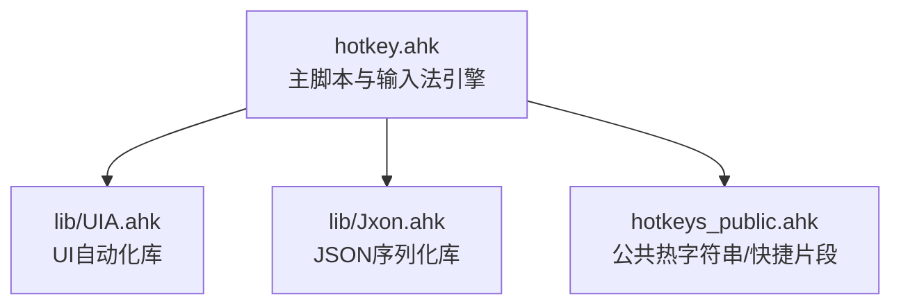
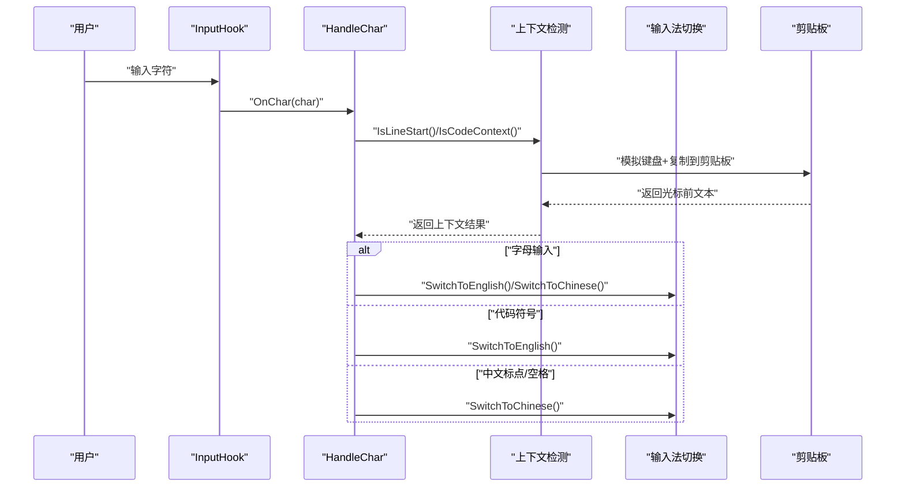
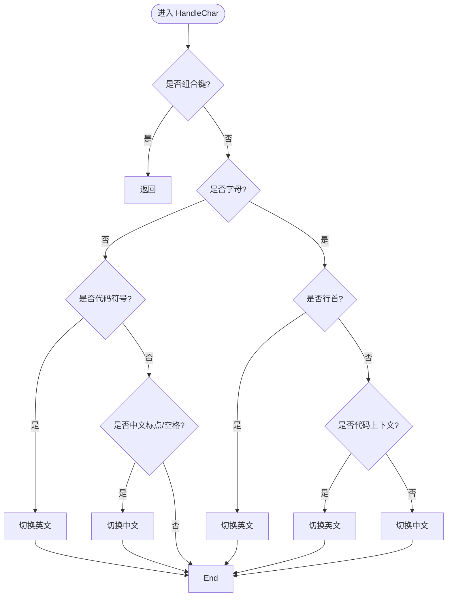
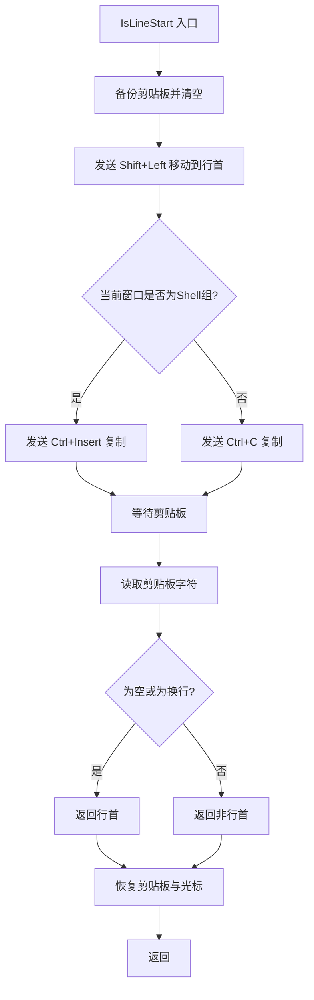
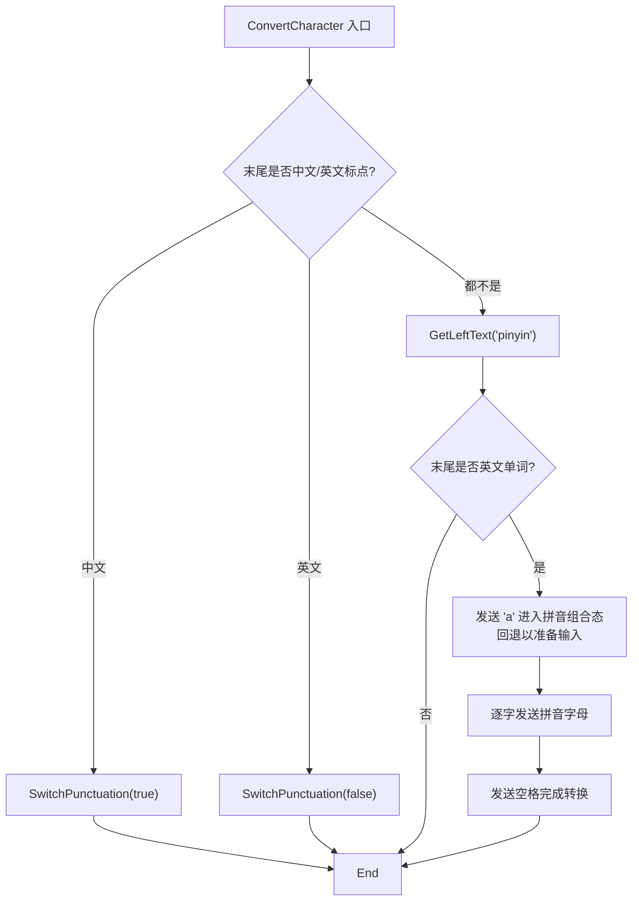
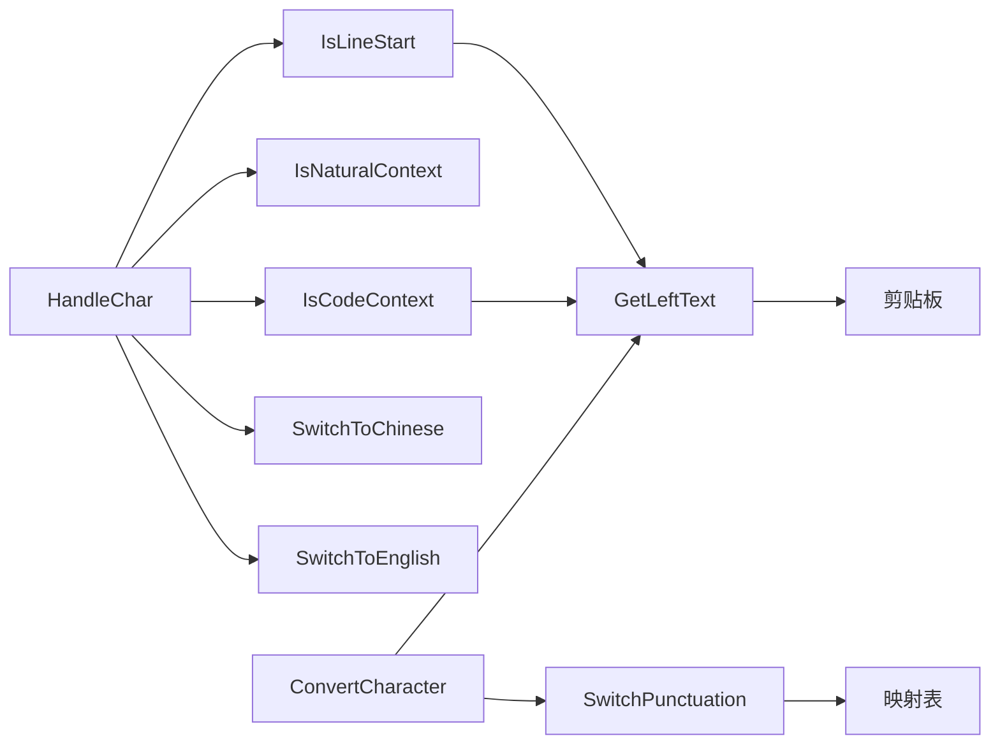

# 输入法引擎函数

<cite>
**本文引用的文件**
- [hotkey.ahk](file://hotkey.ahk)
- [hotkeys_public.ahk](file://hotkeys_public.ahk)
- [lib/UIA.ahk](file://lib/UIA.ahk)
- [lib/Jxon.ahk](file://lib/Jxon.ahk)
</cite>

## 目录
1. [简介](#简介)
2. [项目结构](#项目结构)
3. [核心组件](#核心组件)
4. [架构总览](#架构总览)
5. [详细组件分析](#详细组件分析)
6. [依赖关系分析](#依赖关系分析)
7. [性能考量](#性能考量)
8. [故障排查指南](#故障排查指南)
9. [结论](#结论)
10. [附录](#附录)

## 简介
本文件聚焦于输入法引擎函数的实现与分析，围绕以下目标展开：
- 深入解析 HandleChar 的核心策略逻辑：组合键检测、字母输入判断、代码上下文识别、自然语言环境判断。
- 详解上下文检测函数（IsCodeContext、IsNaturalContext、IsLineStart）的工作原理，涵盖剪贴板操作、键盘模拟、文本获取的技术细节。
- 分析标点符号转换函数 SwitchPunctuation 的映射机制，以及拼音转换函数 ConvertCharacter 的实现逻辑。
- 提供输入法切换的配置选项与性能优化建议。

## 项目结构
该项目基于 AutoHotkey v2，输入法引擎位于主脚本中，通过 InputHook 拦截字符事件，结合上下文检测与输入法切换函数实现智能中英文输入法自动切换。同时引入 UIA 与 JSON 工具库用于扩展能力与数据处理。

图表来源
- [hotkey.ahk:1-20](file://hotkey.ahk#L1-L20)
- [lib/UIA.ahk:1-50](file://lib/UIA.ahk#L1-L50)
- [lib/Jxon.ahk:1-30](file://lib/Jxon.ahk#L1-L30)

章节来源
- [hotkey.ahk:1-20](file://hotkey.ahk#L1-L20)
- [lib/UIA.ahk:1-50](file://lib/UIA.ahk#L1-L50)
- [lib/Jxon.ahk:1-30](file://lib/Jxon.ahk#L1-L30)

## 核心组件
- 输入法状态与切换
  - 全局状态：g_IME，默认中文。
  - 切换函数：SwitchToChinese、SwitchToEnglish。
  - 确保拼音组合态：EnsurePinyinReady。
- 上下文检测
  - IsCodeContext：判断光标前文本末尾是否为字母/数字/下划线，判定为代码上下文。
  - IsNaturalContext：自然语言环境（非代码上下文）。
  - IsLineStart：判断光标所在行是否为行首，用于区分代码与自然语言输入。
  - GetLeftText：通过键盘模拟与剪贴板获取光标前文本，支持“标点符号”与“拼音”两种模式。
- 核心策略：HandleChar
  - 组合键过滤：若处于 Ctrl/Alt/LWin 按下状态则跳过处理。
  - 字母输入：优先判断行首与代码上下文，其次自然语言。
  - 代码符号：统一切换至英文输入法。
  - 中文标点/空格：切换至中文输入法。
- 标点转换：SwitchPunctuation
  - 基于映射表进行中文/英文标点互转。
- 拼音转中文：ConvertCharacter
  - 识别光标前中文标点或英文标点，分别执行相应转换。
  - 识别末尾连续英文单词，触发拼音组合态并发送空格完成转换。

章节来源
- [hotkey.ahk:308-326](file://hotkey.ahk#L308-L326)
- [hotkey.ahk:330-355](file://hotkey.ahk#L330-L355)
- [hotkey.ahk:409-440](file://hotkey.ahk#L409-L440)
- [hotkey.ahk:367-404](file://hotkey.ahk#L367-L404)
- [hotkey.ahk:521-563](file://hotkey.ahk#L521-L563)
- [hotkey.ahk:453-518](file://hotkey.ahk#L453-L518)

## 架构总览
输入法引擎通过 InputHook 捕获字符事件，交由 HandleChar 进行策略判断，并调用上下文检测与输入法切换函数完成自动切换。GetLeftText 作为底层文本获取工具，统一了剪贴板与键盘模拟的交互流程。

图表来源
- [hotkey.ahk:367-404](file://hotkey.ahk#L367-L404)
- [hotkey.ahk:341-355](file://hotkey.ahk#L341-L355)
- [hotkey.ahk:330-339](file://hotkey.ahk#L330-L339)
- [hotkey.ahk:409-440](file://hotkey.ahk#L409-L440)

## 详细组件分析

### HandleChar 核心策略逻辑
- 组合键过滤
  - 若当前处于 Ctrl/Alt/LWin 按下状态，直接返回，避免误触。
- 字母输入判断
  - 行首输入字母：多数情况下为代码，切换至英文。
  - 光标前为代码上下文：切换至英文。
  - 其余情况：自然语言，切换至中文。
- 代码符号输入
  - 统一切换至英文输入法。
- 中文标点/空格
  - 切换至中文输入法。

图表来源
- [hotkey.ahk:367-404](file://hotkey.ahk#L367-L404)

章节来源
- [hotkey.ahk:367-404](file://hotkey.ahk#L367-L404)

### 上下文检测函数
- IsCodeContext
  - 通过 GetLeftText 获取光标前文本，使用正则判断末尾是否为字母/数字/下划线。
- IsNaturalContext
  - 通过取反 IsCodeContext 判断自然语言环境。
- IsLineStart
  - 保存并清空剪贴板，模拟“Shift+Left”移动到行首，随后在 Shell 环境使用 Insert 复制，在其他环境使用 Ctrl+C 复制。
  - 等待剪贴板内容，读取字符，判断是否为空或换行符，从而确定是否为行首。
  - 恢复剪贴板与光标位置。

图表来源
- [hotkey.ahk:341-355](file://hotkey.ahk#L341-L355)

章节来源
- [hotkey.ahk:330-339](file://hotkey.ahk#L330-L339)
- [hotkey.ahk:341-355](file://hotkey.ahk#L341-L355)

### GetLeftText 文本获取技术细节
- 作用：获取光标前文本，支持“标点符号”与“拼音”两种模式。
- 技术要点：
  - 通过 SendEvent 模拟键盘操作（如 Shift+Left、Ctrl+Shift+Left），实现精确选择。
  - 在 Shell 环境使用 Ctrl+Insert 复制，在其他环境使用 Ctrl+C 复制。
  - 使用 ClipWait 等待剪贴板内容可用，超时则回退。
  - 恢复剪贴板与光标位置，保证输入体验无副作用。

章节来源
- [hotkey.ahk:409-440](file://hotkey.ahk#L409-L440)

### SwitchPunctuation 标点映射机制
- 映射表：维护中文标点与英文标点的双向映射。
- 判定逻辑：
  - 若末尾字符为中文标点，将其替换为对应的英文标点。
  - 若末尾字符为英文标点，将其替换为对应的中文标点。
- 输出方式：使用 SendText 直接向当前输入上下文插入 Unicode 文本，不生成按键事件。

章节来源
- [hotkey.ahk:521-563](file://hotkey.ahk#L521-L563)

### ConvertCharacter 拼音转换逻辑
- 标点转换分支：
  - 若末尾为中文标点，调用 SwitchPunctuation(true, char) 进行中文转英文标点。
  - 若末尾为英文标点，调用 SwitchPunctuation(false, char) 进行英文转中文标点。
- 拼音转中文分支：
  - 使用 GetLeftText("pinyin") 获取光标前文本。
  - 正则提取末尾连续英文单词。
  - 触发拼音组合态（发送 a 并回退），逐字发送拼音字母，最后发送空格完成转换。

图表来源
- [hotkey.ahk:453-518](file://hotkey.ahk#L453-L518)
- [hotkey.ahk:521-563](file://hotkey.ahk#L521-L563)

章节来源
- [hotkey.ahk:453-518](file://hotkey.ahk#L453-L518)
- [hotkey.ahk:521-563](file://hotkey.ahk#L521-L563)

### 输入法切换与状态管理
- SwitchToChinese/SwitchToEnglish：切换 g_IME 状态，并在切换中文时触发 EnsurePinyinReady 以确保输入法处于拼音组合态。
- EnsurePinyinReady：通过发送“a”并回退的方式，确保输入法进入拼音组合态，便于后续拼音输入。

章节来源
- [hotkey.ahk:310-326](file://hotkey.ahk#L310-L326)
- [hotkey.ahk:443-450](file://hotkey.ahk#L443-L450)

## 依赖关系分析
- 主脚本依赖
  - UIA 库：用于 UIA 相关扩展（如 UIAPasteEnter），但输入法引擎核心未直接使用。
  - JSON 库：用于数据序列化与处理（如配置读写），与输入法引擎无直接耦合。
- 输入法引擎内部依赖
  - HandleChar 依赖上下文检测函数与输入法切换函数。
  - GetLeftText 依赖剪贴板与键盘模拟。
  - SwitchPunctuation 依赖映射表与 SendText。
  - ConvertCharacter 依赖 GetLeftText、正则与 SendText。

图表来源
- [hotkey.ahk:367-404](file://hotkey.ahk#L367-L404)
- [hotkey.ahk:330-355](file://hotkey.ahk#L330-L355)
- [hotkey.ahk:409-440](file://hotkey.ahk#L409-L440)
- [hotkey.ahk:521-563](file://hotkey.ahk#L521-L563)
- [hotkey.ahk:453-518](file://hotkey.ahk#L453-L518)

章节来源
- [hotkey.ahk:367-404](file://hotkey.ahk#L367-L404)
- [hotkey.ahk:330-355](file://hotkey.ahk#L330-L355)
- [hotkey.ahk:409-440](file://hotkey.ahk#L409-L440)
- [hotkey.ahk:521-563](file://hotkey.ahk#L521-L563)
- [hotkey.ahk:453-518](file://hotkey.ahk#L453-L518)

## 性能考量
- 剪贴板等待与键盘模拟
  - ClipWait 与 SendEvent/ SendInput 的使用会引入等待与输入延迟，建议在必要场景下调小等待时间或减少调用频率。
- 正则匹配与循环
  - GetLeftText 与 ConvertCharacter 中的正则匹配与逐字发送拼音字母，应避免在高频输入场景下过度触发。
- 输入法状态切换
  - EnsurePinyinReady 通过发送“a”+回退确保拼音组合态，建议仅在切换中文时触发，避免频繁调用。
- UIA 与 JSON 库
  - UIA 与 Jxon 为可选扩展，若不使用其功能，可避免引入额外依赖，降低内存占用。

[本节为通用性能建议，无需特定文件来源]

## 故障排查指南
- 输入法未切换
  - 检查 g_IME 是否正确更新，确认 SwitchToChinese/SwitchToEnglish 是否被调用。
  - 确认 EnsurePinyinReady 是否在切换中文时执行。
- 行首判断异常
  - 检查 IsLineStart 的剪贴板备份与恢复逻辑，确保在 Shell 环境与普通环境分别使用 Ctrl+Insert 与 Ctrl+C。
  - 确认 ClipWait 的等待时间是否足够，避免因等待过短导致读取失败。
- 标点转换无效
  - 检查 SwitchPunctuation 的映射表是否包含目标字符，确认 SendText 是否正确插入。
- 拼音转换失败
  - 检查 GetLeftText 的“pinyin”模式是否正确，确认末尾英文单词提取是否成功。
  - 确认拼音组合态是否正确触发（发送“a”并回退），以及空格触发是否生效。

章节来源
- [hotkey.ahk:310-326](file://hotkey.ahk#L310-L326)
- [hotkey.ahk:341-355](file://hotkey.ahk#L341-L355)
- [hotkey.ahk:521-563](file://hotkey.ahk#L521-L563)
- [hotkey.ahk:453-518](file://hotkey.ahk#L453-L518)

## 结论
输入法引擎通过 InputHook 拦截字符事件，结合上下文检测与输入法切换函数，实现了对自然语言与代码输入的智能识别与切换。GetLeftText 作为底层文本获取工具，统一了剪贴板与键盘模拟的交互流程；SwitchPunctuation 与 ConvertCharacter 则分别负责标点转换与拼音转中文。通过合理配置与性能优化，可在保证准确性的前提下提升响应速度与稳定性。

[本节为总结性内容，无需特定文件来源]

## 附录
- 配置选项建议
  - g_IME：默认输入法状态（中文/英文）。
  - ShellGroup：Shell 环境窗口组，用于区分复制方式（Ctrl+Insert vs Ctrl+C）。
  - 热键绑定：可通过现有热键（如 Win+Z）触发 ConvertCharacter，实现快速拼音转中文。
- 扩展与集成
  - UIA 库可用于更复杂的 UI 自动化场景，但输入法引擎核心未直接依赖。
  - JSON 库可用于配置文件的读写与序列化，便于动态调整策略参数。

章节来源
- [hotkey.ahk:817-831](file://hotkey.ahk#L817-L831)
- [hotkey.ahk:565-571](file://hotkey.ahk#L565-L571)
- [lib/UIA.ahk:1-50](file://lib/UIA.ahk#L1-L50)
- [lib/Jxon.ahk:1-30](file://lib/Jxon.ahk#L1-L30)