# 模块化设计原理

<cite>
**本文档引用的文件**
- [hotkey.ahk](file://hotkey.ahk)
- [Jxon.ahk](file://lib/Jxon.ahk)
- [UIA.ahk](file://lib/UIA.ahk)
- [UIA_Browser.ahk](file://lib/UIA_Browser.ahk)
- [get_line_number.ahk](file://get-source-panel-line-number/get_line_number.ahk)
- [package.json](file://get-source-panel-line-number/package.json)
- [hotkeys_public.ahk](file://hotkeys_public.ahk)
- [OpenControllerFromNetwork.ahk](file://OpenControllerFromNetwork.ahk)
- [rdp.ahk](file://rdp.ahk)
- [CycleExplorerSwitcher.ahk](file://CycleExplorerSwitcher.ahk)
</cite>

## 目录
1. [简介](#简介)
2. [项目结构](#项目结构)
3. [核心组件](#核心组件)
4. [架构总览](#架构总览)
5. [详细组件分析](#详细组件分析)
6. [依赖关系分析](#依赖关系分析)
7. [性能考虑](#性能考虑)
8. [故障排除指南](#故障排除指南)
9. [结论](#结论)

## 简介
本项目采用模块化设计，通过 AutoHotkey v2 的包含机制（#Include）将功能拆分为多个独立模块，实现高内聚、低耦合的架构。主要模块包括：
- 核心入口模块：负责权限提升、任务计划注册、通用工具函数
- 库模块：提供 JSON 解析（Jxon）和 UI 自动化（UIA）能力
- 工具模块：浏览器控制、远程桌面管理、文件资源管理器切换等
- 外部工具集成：基于 Node.js 的 Chrome DevTools 行号获取工具

## 项目结构
项目采用清晰的模块化组织方式，每个功能领域都有独立的模块文件：

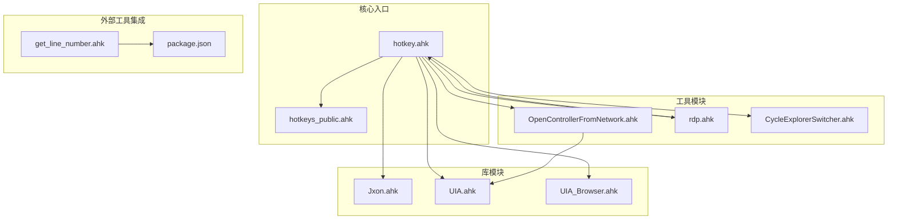

**图表来源**
- [hotkey.ahk:1-25](file://hotkey.ahk#L1-L25)
- [Jxon.ahk:1-10](file://lib/Jxon.ahk#L1-L10)
- [UIA.ahk:1-50](file://lib/UIA.ahk#L1-L50)
- [UIA_Browser.ahk:1-50](file://lib/UIA_Browser.ahk#L1-L50)

**章节来源**
- [hotkey.ahk:1-25](file://hotkey.ahk#L1-L25)
- [README.md:1-2](file://README.md#L1-L2)

## 核心组件

### 主入口模块（hotkey.ahk）
主入口模块采用模块化包含机制，通过 #Include 指令引入各个功能模块：

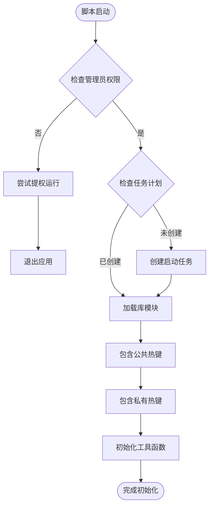

**图表来源**
- [hotkey.ahk:24-52](file://hotkey.ahk#L24-L52)
- [hotkey.ahk:14-19](file://hotkey.ahk#L14-L19)

主入口模块的核心职责：
- 权限管理：自动提权运行，确保系统任务注册权限
- 任务计划：注册开机自启动任务
- 模块加载：通过 #Include 机制动态加载功能模块
- 工具函数：提供通用的应用启动、窗口切换等工具函数

**章节来源**
- [hotkey.ahk:24-118](file://hotkey.ahk#L24-L118)

### 库模块体系
库模块提供基础功能支撑，采用独立文件组织：

#### JSON 解析库（Jxon.ahk）
轻量级 JSON 解析库，支持 Map/Array 的双向转换：

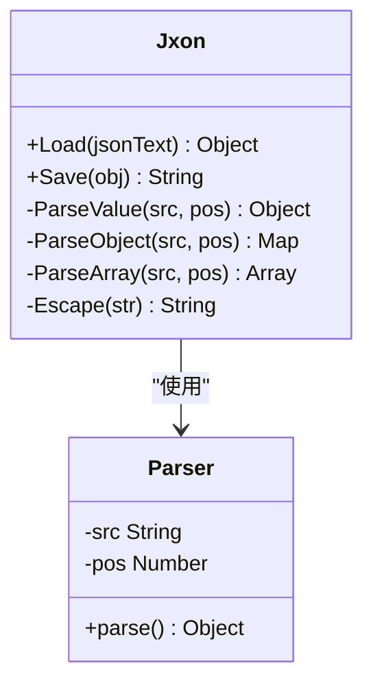

**图表来源**
- [Jxon.ahk:10-48](file://lib/Jxon.ahk#L10-L48)
- [Jxon.ahk:67-101](file://lib/Jxon.ahk#L67-L101)

#### UI 自动化库（UIA.ahk）
完整的 Microsoft UI Automation 框架实现，提供跨应用程序的自动化能力：

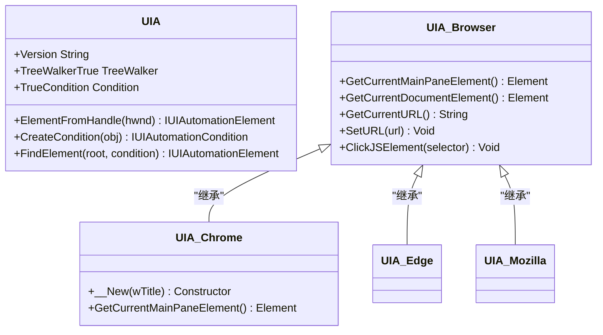

**图表来源**
- [UIA.ahk:51-138](file://lib/UIA.ahk#L51-L138)
- [UIA_Browser.ahk:458-488](file://lib/UIA_Browser.ahk#L458-L488)

**章节来源**
- [Jxon.ahk:1-301](file://lib/Jxon.ahk#L1-L301)
- [UIA.ahk:1-800](file://lib/UIA.ahk#L1-L800)
- [UIA_Browser.ahk:1-945](file://lib/UIA_Browser.ahk#L1-L945)

### 工具模块集合
工具模块提供具体的功能实现，每个模块专注于特定的业务领域：

#### 浏览器控制器（OpenControllerFromNetwork.ahk）
基于 UIA 的 Chrome DevTools 自动化工具：

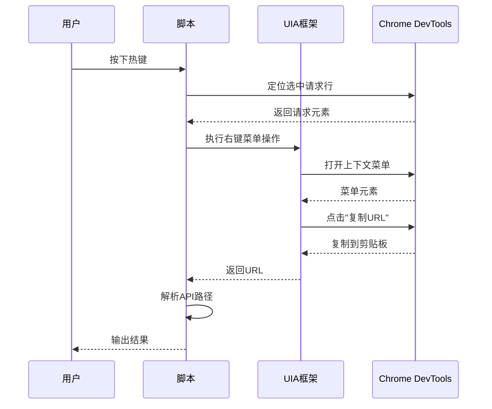

**图表来源**
- [OpenControllerFromNetwork.ahk:34-55](file://OpenControllerFromNetwork.ahk#L34-L55)
- [OpenControllerFromNetwork.ahk:139-195](file://OpenControllerFromNetwork.ahk#L139-L195)

#### 远程桌面管理（rdp.ahk）
提供 RDP 连接管理和剪贴板桥接功能：

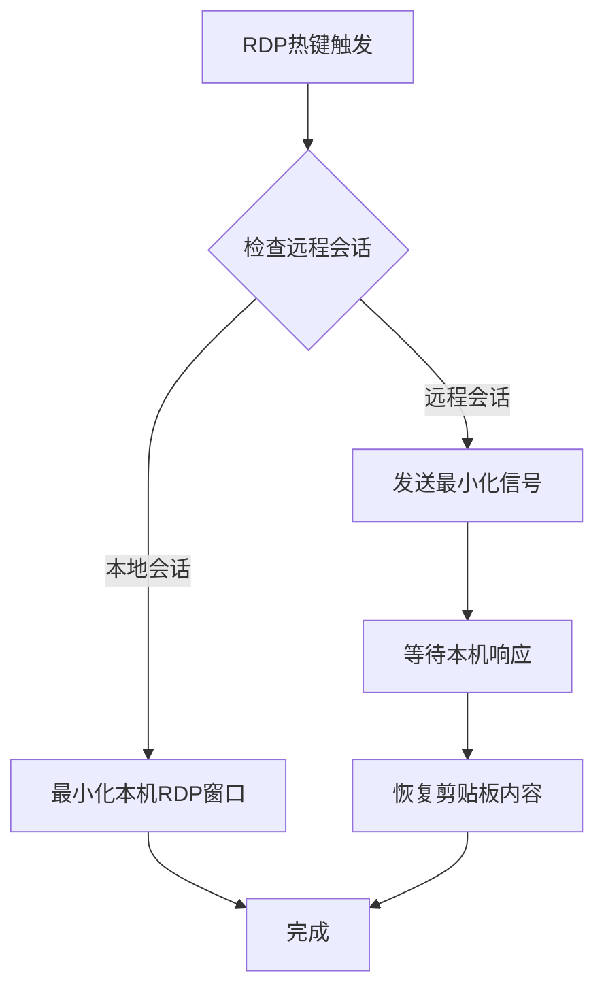

**图表来源**
- [rdp.ahk:189-221](file://rdp.ahk#L189-L221)
- [rdp.ahk:306-324](file://rdp.ahk#L306-L324)

#### 文件资源管理器切换器（CycleExplorerSwitcher.ahk）
提供类似 Alt+Tab 的文件资源管理器轮询切换功能：

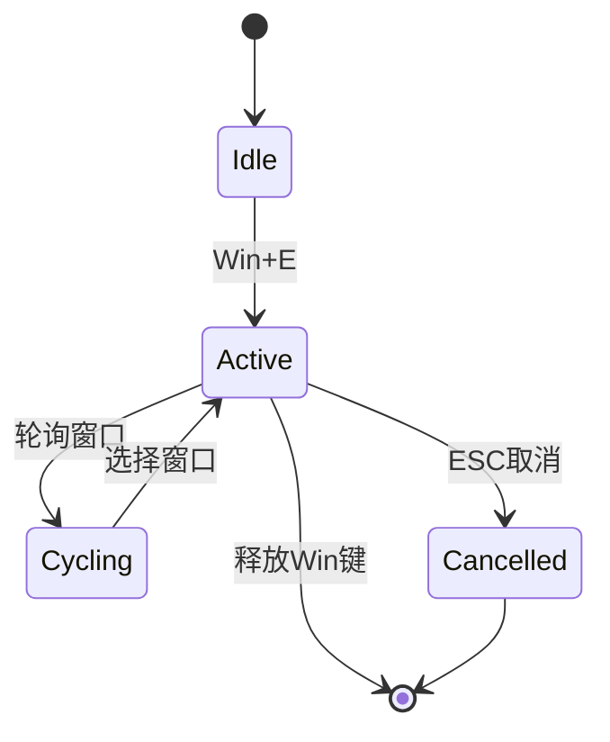

**图表来源**
- [CycleExplorerSwitcher.ahk:68-96](file://CycleExplorerSwitcher.ahk#L68-L96)
- [CycleExplorerSwitcher.ahk:155-167](file://CycleExplorerSwitcher.ahk#L155-L167)

**章节来源**
- [OpenControllerFromNetwork.ahk:1-877](file://OpenControllerFromNetwork.ahk#L1-L877)
- [rdp.ahk:1-417](file://rdp.ahk#L1-L417)
- [CycleExplorerSwitcher.ahk:1-478](file://CycleExplorerSwitcher.ahk#L1-L478)

### 外部工具集成
项目集成了 Node.js 工具链，通过外部进程与 Chrome DevTools 交互：

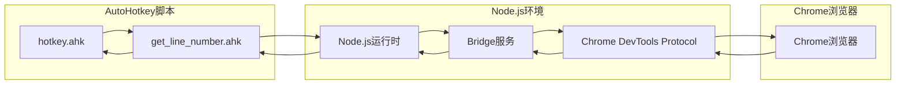

**图表来源**
- [get_line_number.ahk:15-66](file://get-source-panel-line-number/get_line_number.ahk#L15-L66)
- [package.json:1-6](file://get-source-panel-line-number/package.json#L1-L6)

**章节来源**
- [get_line_number.ahk:1-148](file://get-source-panel-line-number/get_line_number.ahk#L1-L148)
- [package.json:1-6](file://get-source-panel-line-number/package.json#L1-L6)

## 架构总览

### 模块依赖关系图
项目采用分层架构设计，各模块间通过明确的接口进行通信：

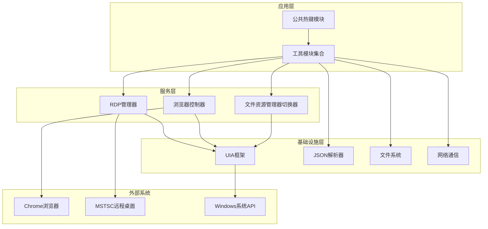

**图表来源**
- [hotkey.ahk:3-6](file://hotkey.ahk#L3-L6)
- [OpenControllerFromNetwork.ahk:313-366](file://OpenControllerFromNetwork.ahk#L313-L366)
- [rdp.ahk:70-146](file://rdp.ahk#L70-L146)

### 通信机制分析
模块间的通信主要通过以下几种方式实现：

1. **函数调用**：模块内部的函数调用，如工具函数的复用
2. **类继承**：UIA_Browser 系列类的继承关系
3. **事件回调**：剪贴板变化监听等异步事件处理
4. **进程间通信**：通过外部进程与 Chrome DevTools 交互

**章节来源**
- [hotkey.ahk:752-800](file://hotkey.ahk#L752-L800)
- [OpenControllerFromNetwork.ahk:301-311](file://OpenControllerFromNetwork.ahk#L301-L311)

## 详细组件分析

### 权限管理与任务注册模块
主入口模块实现了完整的权限管理和任务计划注册机制：

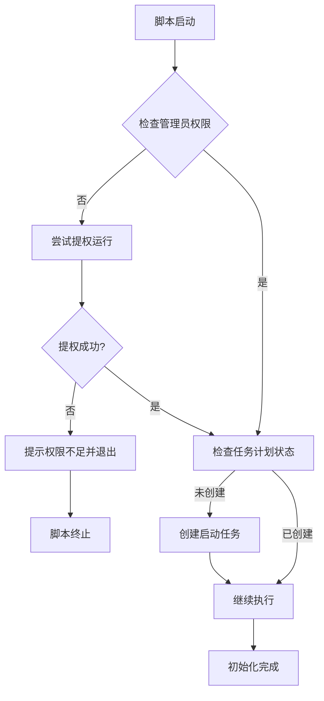

**图表来源**
- [hotkey.ahk:24-52](file://hotkey.ahk#L24-L52)

该模块的关键特性：
- 自动权限提升：通过 `#Require` 指令和 `RunAs` 方式确保管理员权限
- 任务计划注册：使用 `schtasks` 命令创建开机自启动任务
- 配置持久化：通过 `IniWrite` 和 `IniRead` 管理配置状态

**章节来源**
- [hotkey.ahk:24-52](file://hotkey.ahk#L24-L52)

### JSON 解析模块（Jxon）
Jxon 模块提供了轻量级的 JSON 解析能力，支持复杂数据结构的序列化和反序列化：

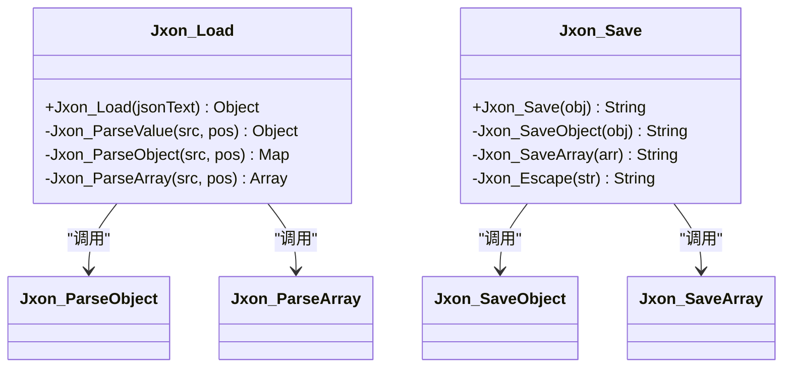

**图表来源**
- [Jxon.ahk:10-48](file://lib/Jxon.ahk#L10-L48)
- [Jxon.ahk:178-245](file://lib/Jxon.ahk#L178-L245)

模块特点：
- 支持 Map 和 Array 的双向转换
- 提供完整的 JSON 解析和序列化功能
- 内置字符串转义和特殊字符处理

**章节来源**
- [Jxon.ahk:1-301](file://lib/Jxon.ahk#L1-L301)

### UI 自动化框架（UIA）
UIA 模块实现了完整的 Microsoft UI Automation 框架，提供跨应用程序的自动化能力：

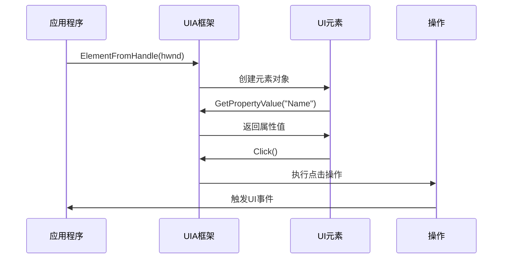

**图表来源**
- [UIA.ahk:51-138](file://lib/UIA.ahk#L51-L138)

UIA 框架的核心能力：
- 元素定位：通过句柄、条件等方式定位UI元素
- 属性访问：获取元素的各种属性值
- 事件处理：注册和处理UI事件
- 导航遍历：在UI树中进行导航和遍历

**章节来源**
- [UIA.ahk:1-800](file://lib/UIA.ahk#L1-L800)

### 浏览器自动化模块（UIA_Browser）
UIA_Browser 模块专门针对浏览器自动化，提供了针对不同浏览器的适配：

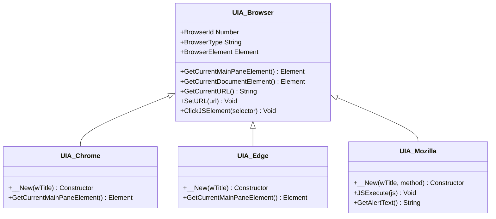

**图表来源**
- [UIA_Browser.ahk:458-488](file://lib/UIA_Browser.ahk#L458-L488)
- [UIA_Browser.ahk:327-456](file://lib/UIA_Browser.ahk#L327-L456)

浏览器模块的特色功能：
- 自动浏览器检测：根据进程名自动识别浏览器类型
- JavaScript 执行：通过地址栏执行JavaScript代码
- 元素定位：基于CSS选择器定位页面元素
- 警告框处理：自动处理JavaScript弹窗

**章节来源**
- [UIA_Browser.ahk:1-945](file://lib/UIA_Browser.ahk#L1-L945)

### 外部工具集成模块
get_line_number.ahk 模块集成了 Node.js 工具链，实现与 Chrome DevTools 的深度集成：

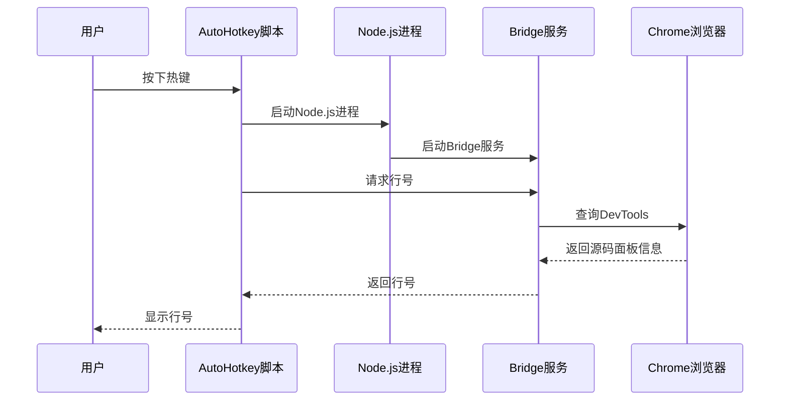

**图表来源**
- [get_line_number.ahk:15-66](file://get-source-panel-line-number/get_line_number.ahk#L15-L66)

外部工具集成的特点：
- 自动环境检测：检查 Chrome 调试端口状态
- 进程管理：自动启动和管理 Node.js 进程
- 错误处理：完善的异常捕获和错误报告机制

**章节来源**
- [get_line_number.ahk:1-148](file://get-source-panel-line-number/get_line_number.ahk#L1-L148)
- [package.json:1-6](file://get-source-panel-line-number/package.json#L1-L6)

## 依赖关系分析

### 模块依赖矩阵
项目模块间的依赖关系如下：

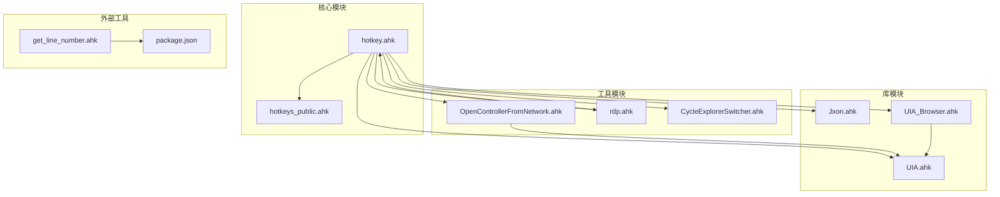

**图表来源**
- [hotkey.ahk:3-6](file://hotkey.ahk#L3-L6)
- [OpenControllerFromNetwork.ahk:319-319](file://OpenControllerFromNetwork.ahk#L319-L319)

### 依赖层次分析
项目采用清晰的依赖层次结构：

1. **底层基础设施**：UIA 框架和 JSON 解析器
2. **中间层服务**：浏览器自动化和远程桌面管理
3. **上层应用**：公共热键和工具模块
4. **外部集成**：Node.js 工具链

**章节来源**
- [hotkey.ahk:14-19](file://hotkey.ahk#L14-L19)

## 性能考虑
模块化设计在性能方面的优势：

### 加载优化
- 按需加载：通过 #Include 机制实现模块的延迟加载
- 缓存机制：UIA 框架内置元素缓存和条件缓存
- 配置优化：外部工具的进程池管理和连接复用

### 运行时优化
- 异步处理：剪贴板变化监听采用异步回调机制
- 资源管理：GUI 组件的生命周期管理和内存回收
- 错误恢复：完善的异常处理和自动重试机制

## 故障排除指南

### 常见问题及解决方案

#### 权限相关问题
- **问题**：脚本无法以管理员权限运行
- **解决方案**：检查 `#Require` 指令和 `RunAs` 参数配置

#### UIA 框架问题
- **问题**：UIA 元素定位失败
- **解决方案**：检查 UIA 版本兼容性和元素可见性状态

#### 外部工具问题
- **问题**：Chrome DevTools 无法连接
- **解决方案**：检查调试端口状态和 Node.js 服务运行情况

**章节来源**
- [hotkey.ahk:24-52](file://hotkey.ahk#L24-L52)
- [get_line_number.ahk:105-148](file://get-source-panel-line-number/get_line_number.ahk#L105-L148)

## 结论
本项目通过精心设计的模块化架构，实现了功能解耦和代码复用。主要成果包括：

1. **清晰的模块边界**：每个模块职责单一，接口明确
2. **灵活的依赖管理**：通过 #Include 机制实现动态模块加载
3. **强大的扩展能力**：新的功能模块可以轻松集成到现有架构中
4. **良好的维护性**：模块间的低耦合设计便于代码维护和升级

这种模块化设计为大型 AutoHotkey 项目提供了可借鉴的最佳实践，特别是在处理复杂系统集成和多平台兼容性方面具有重要参考价值。