# 模块化库系统

<cite>
**本文档引用的文件**
- [README.md](file://README.md)
- [hotkey.ahk](file://hotkey.ahk)
- [superFlow.ahk](file://superFlow.ahk)
- [lib/AppLauncher.ahk](file://lib/AppLauncher.ahk)
- [lib/Jxon.ahk](file://lib/Jxon.ahk)
- [lib/WindowToggle.ahk](file://lib/WindowToggle.ahk)
- [lib/ImeSwitcher.ahk](file://lib/ImeSwitcher.ahk)
- [lib/UIA.ahk](file://lib/UIA.ahk)
- [lib/UIA_Browser.ahk](file://lib/UIA_Browser.ahk)
- [hotkeys_public.ahk](file://hotkeys_public.ahk)
- [config.ini](file://config.ini)
- [browser_apps.json](file://browser_apps.json)
</cite>

## 目录
1. [简介](#简介)
2. [项目结构](#项目结构)
3. [核心组件](#核心组件)
4. [架构概览](#架构概览)
5. [详细组件分析](#详细组件分析)
6. [依赖关系分析](#依赖关系分析)
7. [性能考虑](#性能考虑)
8. [故障排除指南](#故障排除指南)
9. [结论](#结论)

## 简介

这是一个基于 AutoHotkey v2 的模块化库系统，旨在提供高效的热键管理和应用程序自动化功能。该系统通过模块化设计实现了功能分离，包括窗口切换、应用启动、输入法切换、UI自动化等功能模块。

该项目的核心目标是为用户提供一个可扩展的热键管理系统，支持多种应用程序的快速启动和切换，以及智能的输入法管理功能。

## 项目结构

项目采用清晰的模块化组织结构：

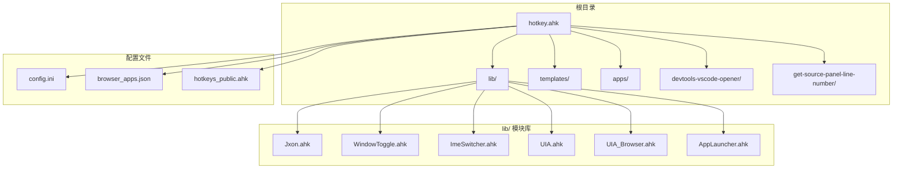

**图表来源**
- [hotkey.ahk:1-50](file://hotkey.ahk#L1-L50)
- [lib/Jxon.ahk:1-301](file://lib/Jxon.ahk#L1-L301)
- [lib/WindowToggle.ahk:1-131](file://lib/WindowToggle.ahk#L1-L131)

**章节来源**
- [README.md:1-2](file://README.md#L1-L2)
- [hotkey.ahk:1-800](file://hotkey.ahk#L1-L800)

## 核心组件

### 主要模块架构

系统采用模块化设计，每个功能领域都有专门的模块：

1. **应用启动模块** - AppLauncher.ahk
2. **窗口切换模块** - WindowToggle.ahk  
3. **输入法切换模块** - ImeSwitcher.ahk
4. **UI自动化模块** - UIA.ahk 和 UIA_Browser.ahk
5. **JSON处理模块** - Jxon.ahk
6. **超级流程模块** - superFlow.ahk

### 模块间协作关系

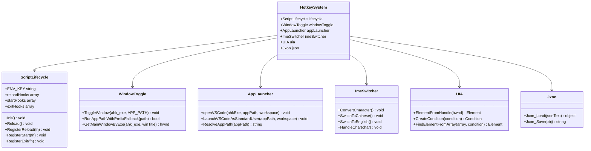

**图表来源**
- [hotkey.ahk:312-373](file://hotkey.ahk#L312-L373)
- [lib/WindowToggle.ahk:80-131](file://lib/WindowToggle.ahk#L80-L131)
- [lib/AppLauncher.ahk:21-72](file://lib/AppLauncher.ahk#L21-L72)
- [lib/ImeSwitcher.ahk:19-243](file://lib/ImeSwitcher.ahk#L19-L243)
- [lib/Jxon.ahk:10-48](file://lib/Jxon.ahk#L10-L48)

**章节来源**
- [hotkey.ahk:312-373](file://hotkey.ahk#L312-L373)
- [lib/WindowToggle.ahk:1-131](file://lib/WindowToggle.ahk#L1-L131)
- [lib/AppLauncher.ahk:1-146](file://lib/AppLauncher.ahk#L1-L146)

## 架构概览

### 系统启动流程

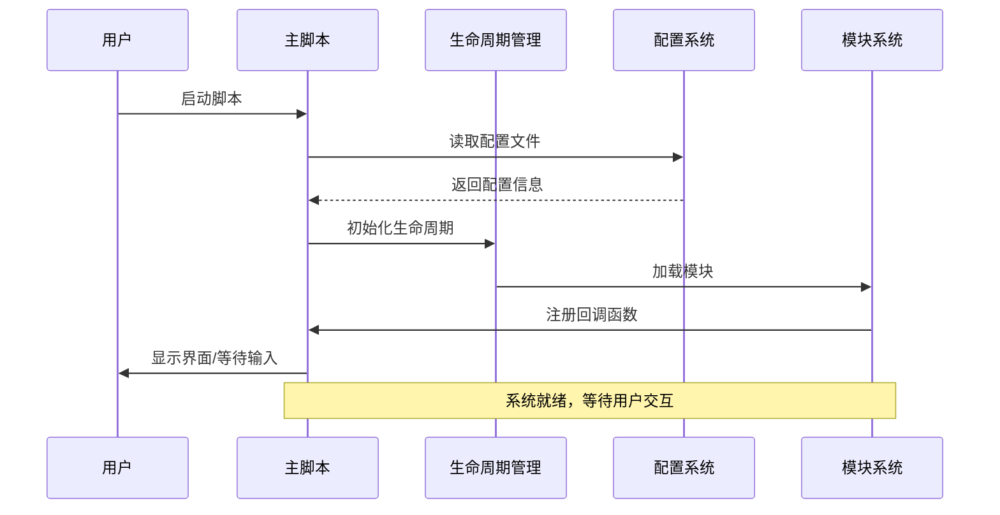

**图表来源**
- [hotkey.ahk:30-57](file://hotkey.ahk#L30-L57)
- [hotkey.ahk:312-373](file://hotkey.ahk#L312-L373)

### 模块加载机制

系统采用延迟加载和条件加载相结合的方式：

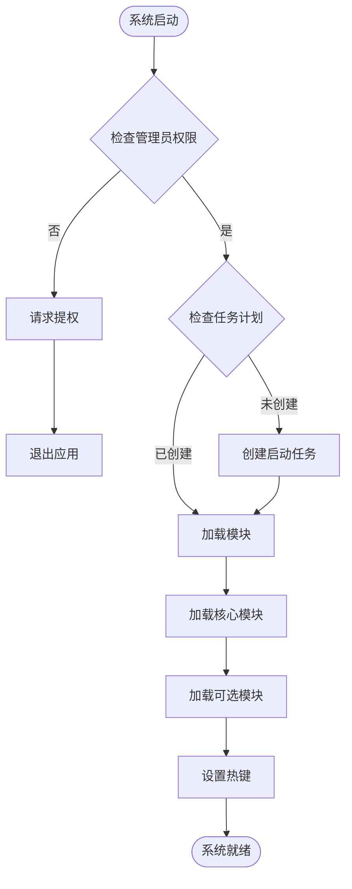

**图表来源**
- [hotkey.ahk:30-28](file://hotkey.ahk#L30-L28)
- [hotkey.ahk:67-67](file://hotkey.ahk#L67-L67)

**章节来源**
- [hotkey.ahk:30-28](file://hotkey.ahk#L30-L28)
- [hotkey.ahk:66-68](file://hotkey.ahk#L66-L68)

## 详细组件分析

### 应用启动框架

#### AppLauncher 模块

AppLauncher 模块提供了完整的应用启动解决方案：

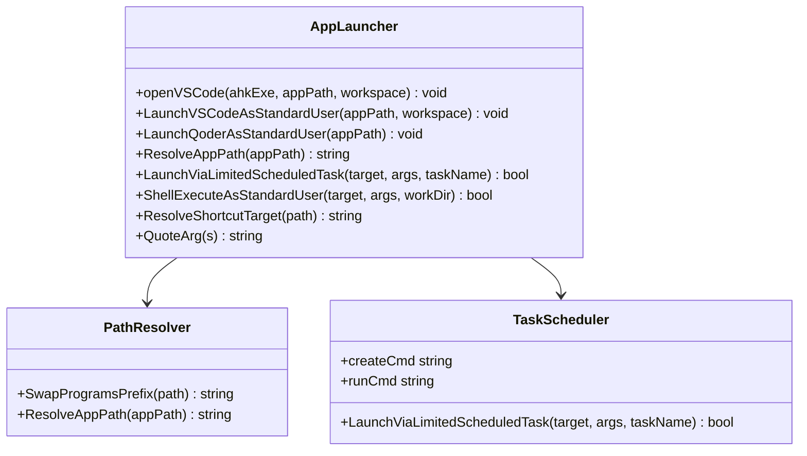

**图表来源**
- [lib/AppLauncher.ahk:21-146](file://lib/AppLauncher.ahk#L21-L146)

**章节来源**
- [lib/AppLauncher.ahk:21-146](file://lib/AppLauncher.ahk#L21-L146)

#### WindowToggle 模块

WindowToggle 模块专注于窗口管理和切换：

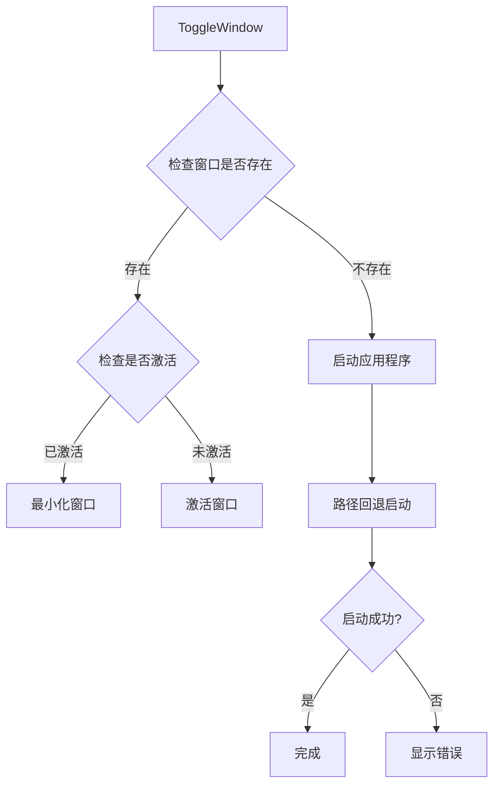

**图表来源**
- [lib/WindowToggle.ahk:80-117](file://lib/WindowToggle.ahk#L80-L117)

**章节来源**
- [lib/WindowToggle.ahk:80-117](file://lib/WindowToggle.ahk#L80-L117)

### 输入法切换引擎

#### ImeSwitcher 模块

ImeSwitcher 提供智能的中英文输入法切换功能：

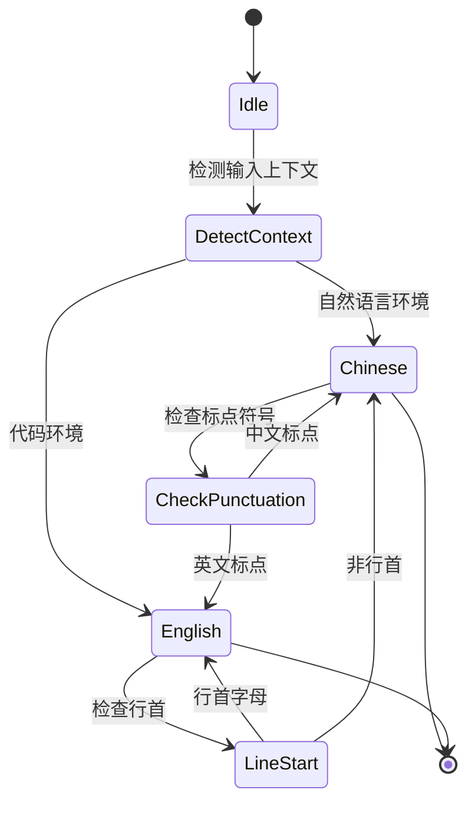

**图表来源**
- [lib/ImeSwitcher.ahk:77-110](file://lib/ImeSwitcher.ahk#L77-L110)

**章节来源**
- [lib/ImeSwitcher.ahk:19-243](file://lib/ImeSwitcher.ahk#L19-L243)

### UI自动化框架

#### UIA 模块

UIA 模块实现了完整的 Microsoft UI Automation 框架：

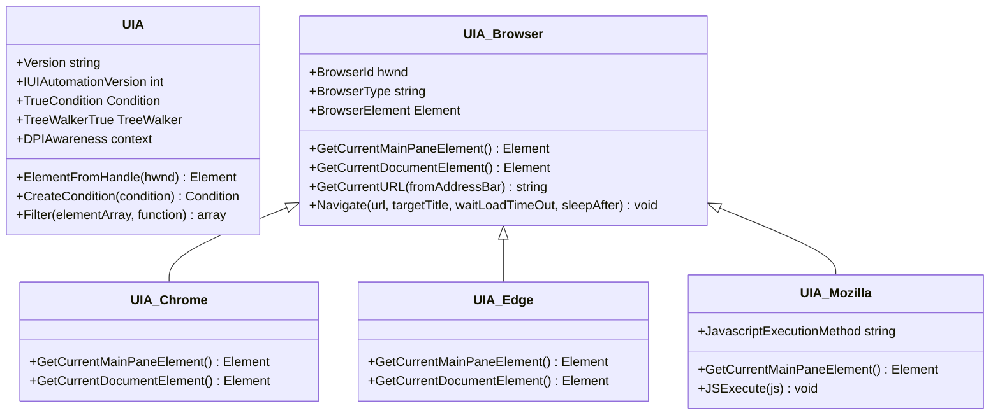

**图表来源**
- [lib/UIA.ahk:51-152](file://lib/UIA.ahk#L51-L152)
- [lib/UIA_Browser.ahk:458-488](file://lib/UIA_Browser.ahk#L458-L488)

**章节来源**
- [lib/UIA.ahk:51-800](file://lib/UIA.ahk#L51-L800)
- [lib/UIA_Browser.ahk:1-800](file://lib/UIA_Browser.ahk#L1-L800)

### JSON处理库

#### Jxon 模块

Jxon 提供轻量级的 JSON 解析和序列化功能：

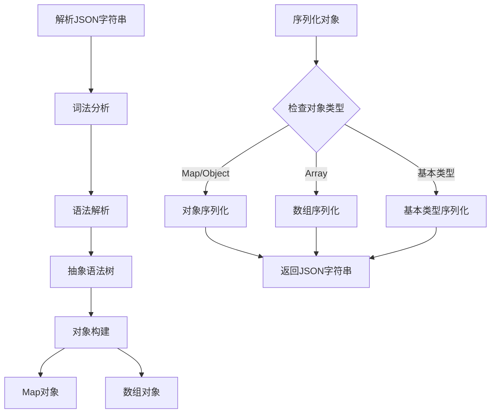

**图表来源**
- [lib/Jxon.ahk:10-280](file://lib/Jxon.ahk#L10-L280)

**章节来源**
- [lib/Jxon.ahk:10-301](file://lib/Jxon.ahk#L10-L301)

### 超级流程模块

#### superFlow 模块

superFlow 模块提供了常用工具自动化操作：

**章节来源**
- [superFlow.ahk:1-72](file://superFlow.ahk#L1-L72)

## 依赖关系分析

### 模块依赖图

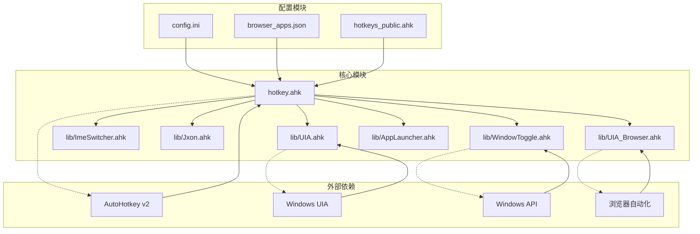

**图表来源**
- [hotkey.ahk:1-28](file://hotkey.ahk#L1-L28)
- [lib/WindowToggle.ahk:1-14](file://lib/WindowToggle.ahk#L1-L14)

### 依赖注入和接口设计

系统采用松耦合的设计模式：

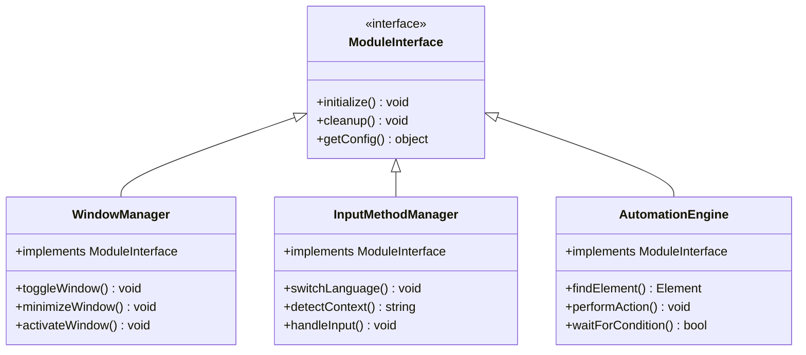

**图表来源**
- [lib/WindowToggle.ahk:80-131](file://lib/WindowToggle.ahk#L80-L131)
- [lib/ImeSwitcher.ahk:19-243](file://lib/ImeSwitcher.ahk#L19-L243)

**章节来源**
- [lib/WindowToggle.ahk:80-131](file://lib/WindowToggle.ahk#L80-L131)
- [lib/ImeSwitcher.ahk:19-243](file://lib/ImeSwitcher.ahk#L19-L243)

## 性能考虑

### 内存管理

系统采用了多种内存优化策略：

1. **延迟初始化** - 模块在首次使用时才加载
2. **对象池** - 重复使用的对象进行缓存
3. **垃圾回收** - 及时释放不再使用的资源

### 执行效率

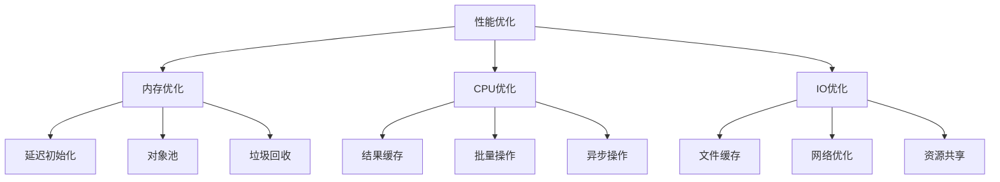

### 缓存策略

系统实现了多层次的缓存机制：

1. **配置缓存** - 配置文件读取后缓存
2. **窗口句柄缓存** - 常用窗口句柄缓存
3. **路径解析缓存** - 应用程序路径解析缓存

## 故障排除指南

### 常见问题诊断

#### 权限相关问题

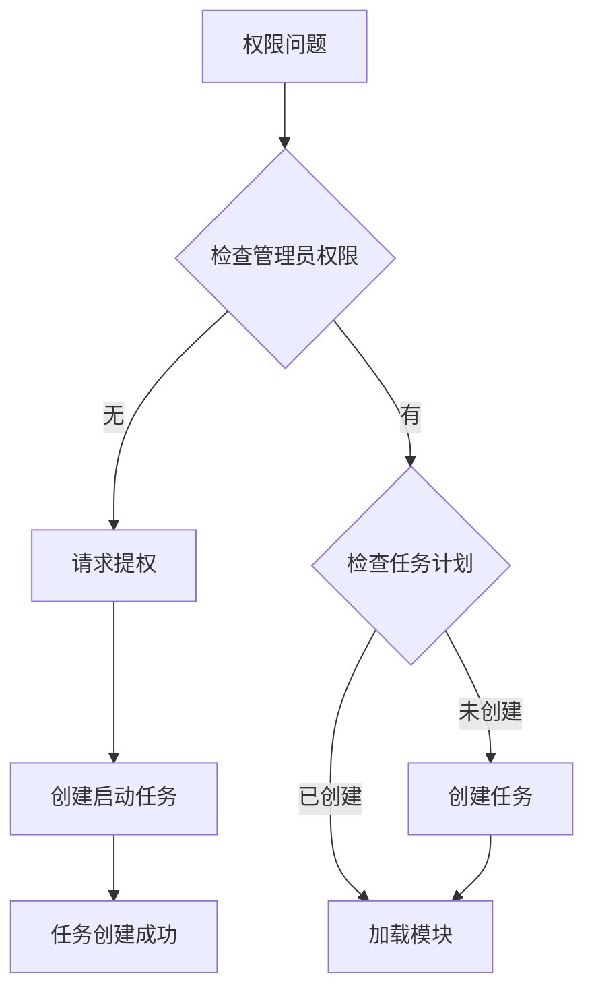

**图表来源**
- [hotkey.ahk:30-57](file://hotkey.ahk#L30-L57)

#### 模块加载失败

当模块加载失败时，系统会：

1. **记录详细错误信息**
2. **尝试降级方案**
3. **提供恢复选项**

#### 热键冲突

系统提供了热键冲突检测和解决机制：

**章节来源**
- [hotkey.ahk:30-57](file://hotkey.ahk#L30-L57)

### 调试工具

系统内置了多种调试工具：

1. **日志系统** - 详细的执行日志
2. **状态监控** - 实时系统状态
3. **错误报告** - 自动生成错误报告

## 结论

这个模块化库系统展现了优秀的软件工程实践：

### 设计优势

1. **模块化设计** - 清晰的功能分离和职责划分
2. **可扩展性** - 易于添加新功能和模块
3. **可靠性** - 完善的错误处理和恢复机制
4. **性能优化** - 多层次的性能优化策略

### 技术特色

1. **智能输入法切换** - 基于上下文的自动切换
2. **强大的UI自动化** - 完整的Windows UIA支持
3. **灵活的应用管理** - 多种启动和切换策略
4. **高效的数据处理** - 轻量级JSON处理库

### 未来发展方向

1. **云同步功能** - 跨设备配置同步
2. **机器学习集成** - 智能热键推荐
3. **增强的UI自动化** - 更丰富的自动化操作
4. **更好的性能监控** - 实时性能分析工具

这个系统为AutoHotkey用户提供了强大而灵活的自动化解决方案，其模块化设计为未来的功能扩展奠定了良好的基础。