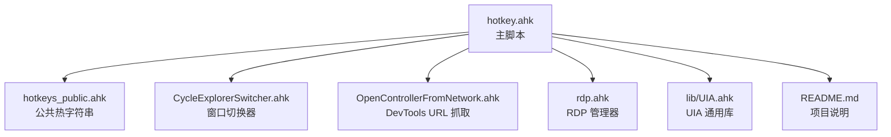
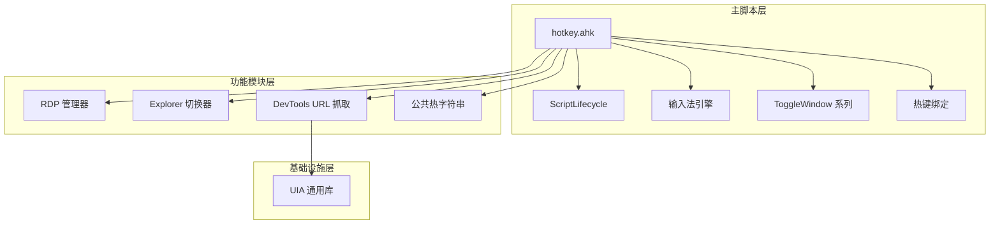
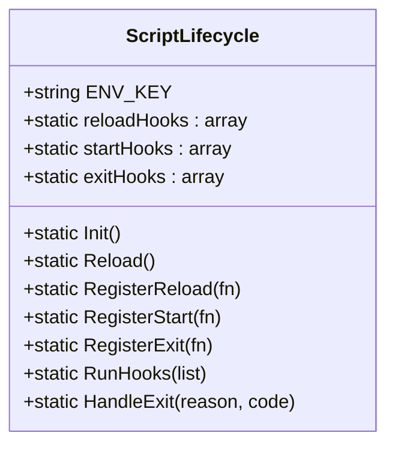
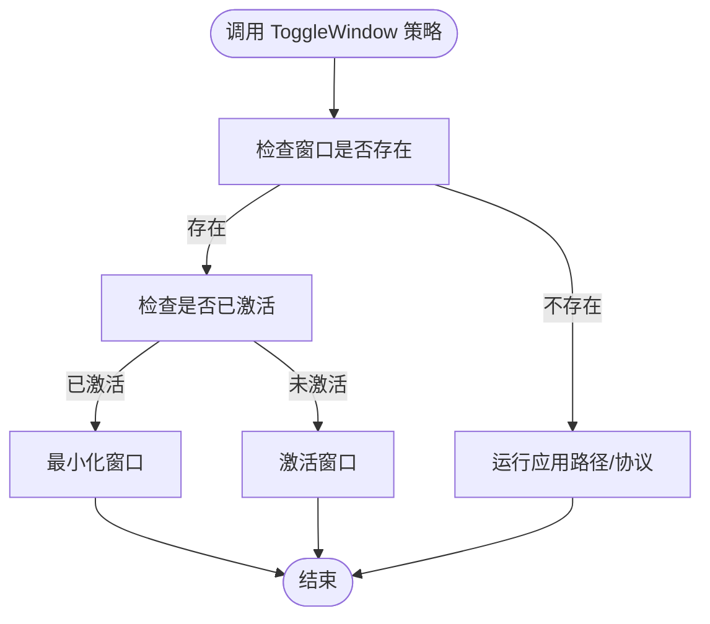
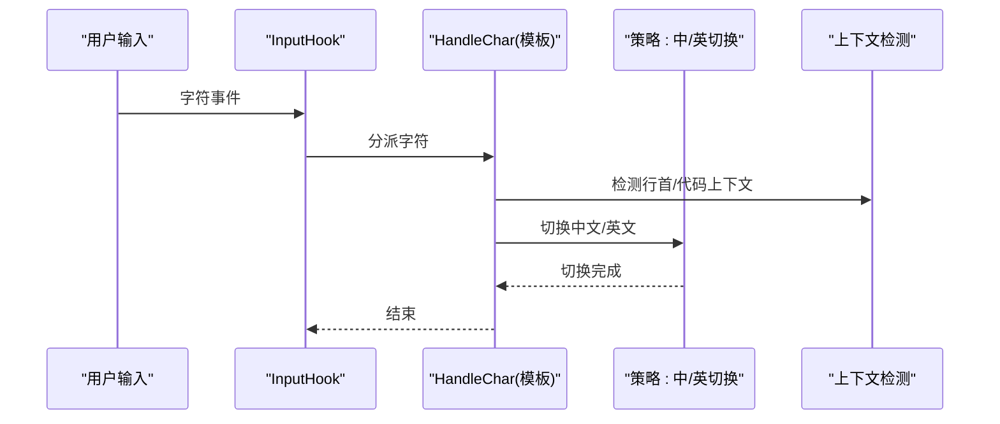
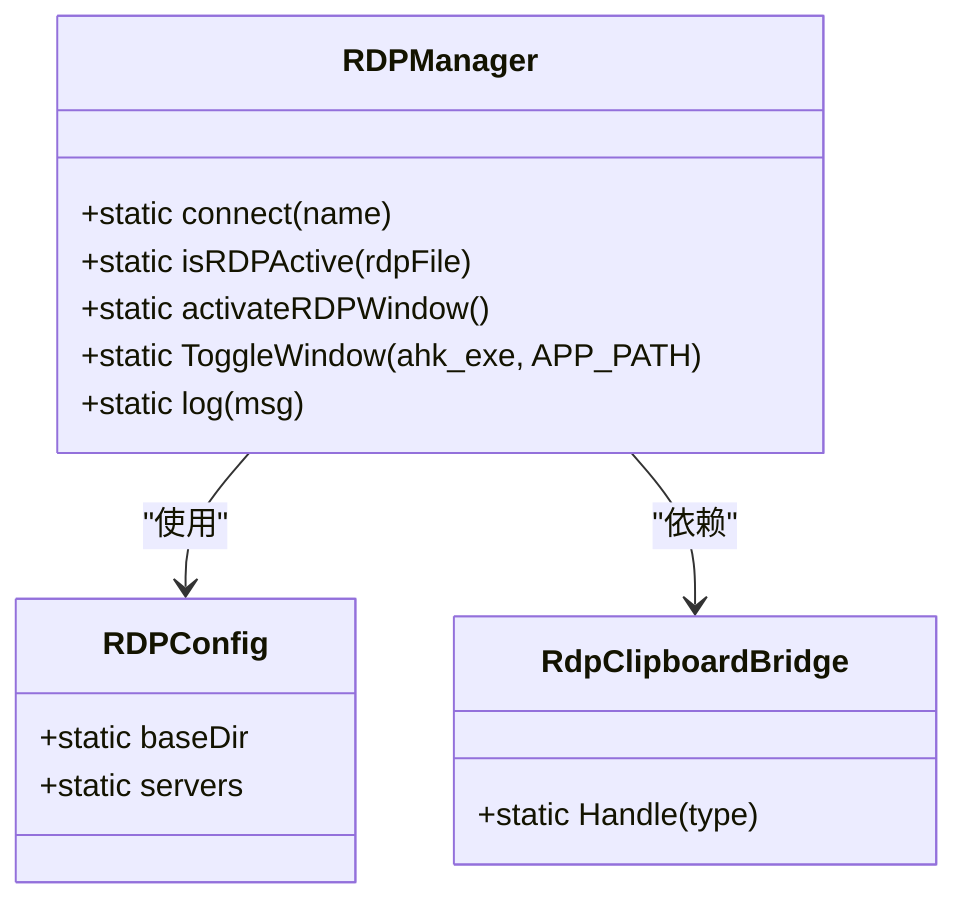
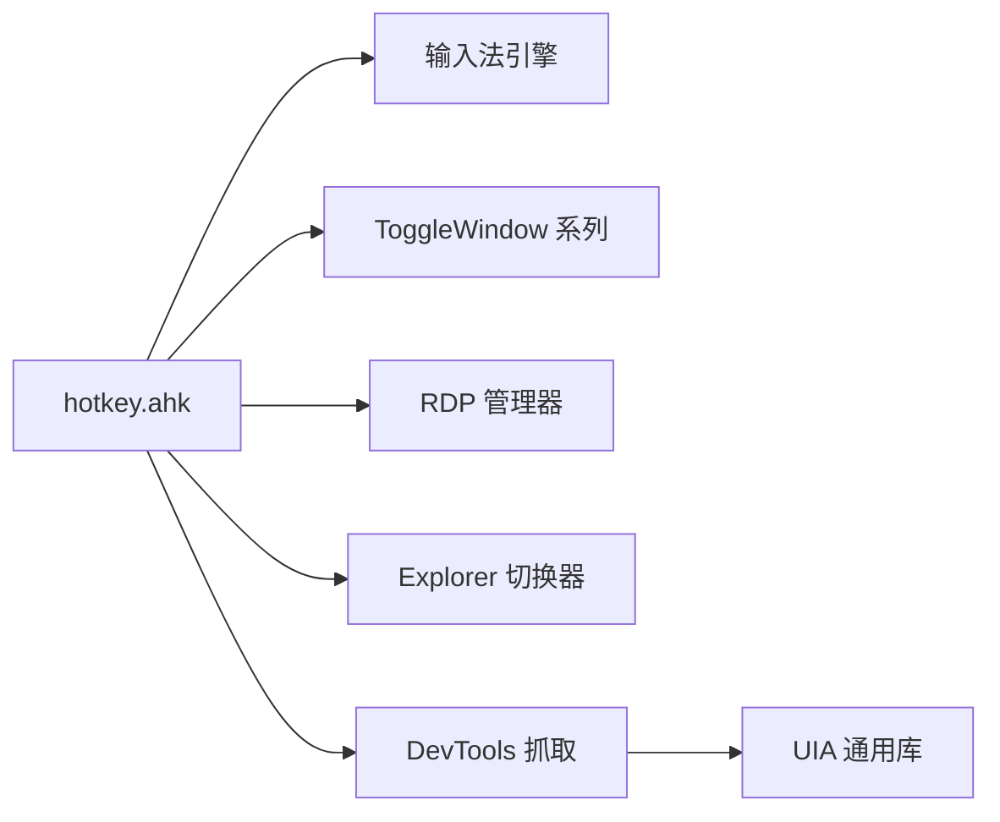

# 设计模式实现

<cite>
**本文档引用的文件**
- [hotkey.ahk](file://hotkey.ahk)
- [CycleExplorerSwitcher.ahk](file://CycleExplorerSwitcher.ahk)
- [OpenControllerFromNetwork.ahk](file://OpenControllerFromNetwork.ahk)
- [rdp.ahk](file://rdp.ahk)
- [hotkeys_public.ahk](file://hotkeys_public.ahk)
- [README.md](file://README.md)
- [lib/UIA.ahk](file://lib/UIA.ahk)
</cite>

## 目录
1. [简介](#简介)
2. [项目结构](#项目结构)
3. [核心组件](#核心组件)
4. [架构总览](#架构总览)
5. [详细组件分析](#详细组件分析)
6. [依赖关系分析](#依赖关系分析)
7. [性能考量](#性能考量)
8. [故障排查指南](#故障排查指南)
9. [结论](#结论)

## 简介
本项目基于 AutoHotkey v2 实现，围绕热键管理、窗口切换、输入法智能切换、远程桌面交互以及开发工具链自动化等场景，系统性地应用了多种设计模式。本文重点分析以下三种设计模式在项目中的具体实现与价值：
- 生命周期管理模式：通过 ScriptLifecycle 类统一管理脚本启动、重载与退出阶段的钩子回调，确保模块化初始化与清理的一致性。
- 策略模式：在窗口切换（ToggleWindow 系列）中，通过不同的切换策略（按进程名、按标题、按多窗口枚举）实现灵活的窗口激活/最小化控制。
- 模板方法模式：在输入法引擎中，HandleChar 作为模板方法，定义输入拦截与切换的骨架流程，具体策略（中文/英文切换、标点处理、拼音处理）在子步骤中实现。

同时，本文还对项目中其他实用组件（如 RDP 管理器、Explorer 切换器、DevTools URL 抓取）进行简要说明，并给出优缺点分析与改进建议。

## 项目结构
项目采用“主脚本 + 功能模块 + 库文件”的组织方式：
- 主脚本负责全局配置、权限校验、任务计划注册、输入法引擎与热键绑定等。
- 功能模块独立封装业务能力，如 RDP 管理、Explorer 切换、网络面板 URL 抓取等。
- 库文件提供 UIA（通用无障碍）能力，支撑复杂 UI 元素定位与操作。

**图表来源**
- [hotkey.ahk:1-2416](file://hotkey.ahk#L1-L2416)
- [hotkeys_public.ahk:1-57](file://hotkeys_public.ahk#L1-L57)
- [CycleExplorerSwitcher.ahk:1-478](file://CycleExplorerSwitcher.ahk#L1-L478)
- [OpenControllerFromNetwork.ahk:1-877](file://OpenControllerFromNetwork.ahk#L1-L877)
- [rdp.ahk:1-417](file://rdp.ahk#L1-L417)
- [README.md:1-2](file://README.md#L1-L2)
- [lib/UIA.ahk:2023-5188](file://lib/UIA.ahk#L2023-L5188)

**章节来源**
- [hotkey.ahk:1-2416](file://hotkey.ahk#L1-L2416)
- [README.md:1-2](file://README.md#L1-L2)

## 核心组件
- ScriptLifecycle：生命周期管理器，提供启动、重载、退出钩子注册与执行，保证模块化初始化与清理的统一入口。
- ToggleWindow 系列：窗口切换策略集合，支持按进程名、标题、多窗口列表等不同策略进行激活/最小化。
- 输入法引擎：基于 InputHook 的拦截与策略决策，实现中文/英文自动切换、标点转换、拼音转中文等。
- RDP 管理器：封装 RDP 连接、最小化、剪贴板桥接与环境检测，提供安全/快速两种连接模式。
- Explorer 切换器：提供文件资源管理器窗口的可视化切换与快捷键导航。
- DevTools URL 抓取：通过 UIA 与鼠标交互，自动定位菜单项并复制请求 URL，具备多级兜底策略。

**章节来源**
- [hotkey.ahk:752-813](file://hotkey.ahk#L752-L813)
- [hotkey.ahk:120-221](file://hotkey.ahk#L120-L221)
- [hotkey.ahk:307-506](file://hotkey.ahk#L307-L506)
- [rdp.ahk:47-146](file://rdp.ahk#L47-L146)
- [CycleExplorerSwitcher.ahk:68-153](file://CycleExplorerSwitcher.ahk#L68-L153)
- [OpenControllerFromNetwork.ahk:34-195](file://OpenControllerFromNetwork.ahk#L34-L195)

## 架构总览
整体架构以主脚本为中心，向上提供输入法引擎与热键绑定，向下集成各功能模块与 UIA 库。生命周期管理贯穿始终，确保模块在启动/重载/退出时正确执行钩子。

**图表来源**
- [hotkey.ahk:752-813](file://hotkey.ahk#L752-L813)
- [hotkey.ahk:307-506](file://hotkey.ahk#L307-L506)
- [hotkey.ahk:120-221](file://hotkey.ahk#L120-L221)
- [hotkeys_public.ahk:1-57](file://hotkeys_public.ahk#L1-L57)
- [OpenControllerFromNetwork.ahk:34-195](file://OpenControllerFromNetwork.ahk#L34-L195)
- [lib/UIA.ahk:2023-5188](file://lib/UIA.ahk#L2023-L5188)

## 详细组件分析

### 生命周期管理模式：ScriptLifecycle
- 设计要点
  - 通过环境变量标记区分“启动”与“重载”场景，分别执行对应钩子列表。
  - 提供注册接口：RegisterStart、RegisterReload、RegisterExit，便于模块化注册初始化与清理逻辑。
  - 在 OnExit 中统一触发退出钩子，确保资源回收与日志落盘。
- 选择原因
  - AutoHotkey v2 的脚本重载机制不提供统一的生命周期回调，ScriptLifecycle 通过环境变量与钩子列表弥补这一不足，提升模块化程度与一致性。
- 实现细节
  - 初始化时读取环境变量，判断是否为重载场景并执行相应钩子。
  - 重载时设置环境变量并触发 Reload，随后在新实例中恢复钩子执行。
  - 退出时统一调用 exitHooks。
- 应用场景
  - 用于注册浏览器缓存构建、UIA 资源初始化、剪贴板监听等跨模块的初始化/清理逻辑。
- 优缺点分析
  - 优点：集中管理生命周期，降低模块耦合；钩子顺序可控，便于调试。
  - 缺点：环境变量依赖带来外部状态管理成本；钩子执行顺序需谨慎设计，避免相互干扰。
- 改进建议
  - 增加钩子优先级与去重机制；提供钩子执行超时与异常隔离；增加生命周期日志与统计。

**图表来源**
- [hotkey.ahk:752-813](file://hotkey.ahk#L752-L813)

**章节来源**
- [hotkey.ahk:752-813](file://hotkey.ahk#L752-L813)

### 策略模式：ToggleWindow 系列
- 设计要点
  - 通过多个同名但参数不同的函数（如按进程名、按标题、按多窗口列表）实现不同策略的窗口切换。
  - 核心逻辑：若窗口存在则激活/最小化，否则尝试运行指定路径或协议。
- 选择原因
  - 不同应用的窗口特征差异较大（进程名、类名、标题、多实例），策略模式使调用方无需关心具体实现细节，只需选择合适的策略。
- 实现细节
  - ToggleWindow：按进程名匹配窗口，存在则激活/最小化，否则运行路径。
  - ToggleWindowByTitle：按标题匹配窗口，存在则激活/最小化，否则运行路径。
  - ToggleWindow2/ToggleWindow12/ToggleWindow22：针对多窗口场景，提供枚举与交互提示，增强可用性。
- 应用场景
  - 快速打开/切换常用应用窗口，如浏览器、终端、数据库工具、聊天工具等。
- 优缺点分析
  - 优点：调用简洁、策略可插拔；对多实例场景友好。
  - 缺点：策略过多可能导致维护成本上升；部分策略对标题/类名敏感，易受 UI 变更影响。
- 改进建议
  - 引入统一的窗口匹配器抽象，支持正则/模糊匹配；为策略增加可配置的容错与回退机制。

**图表来源**
- [hotkey.ahk:120-221](file://hotkey.ahk#L120-L221)

**章节来源**
- [hotkey.ahk:120-221](file://hotkey.ahk#L120-L221)

### 模板方法模式：输入法引擎
- 设计要点
  - HandleChar 作为模板方法，定义输入拦截与切换的骨架流程：先排除组合键，再按字符类型与上下文判断切换策略。
  - 具体策略在子步骤中实现：按字母/符号/标点分别切换中/英；行首与代码上下文采用不同规则。
- 选择原因
  - 输入法切换涉及多种上下文与规则，模板方法将通用流程与可变策略分离，便于扩展与维护。
- 实现细节
  - 模板方法：HandleChar
  - 子步骤策略：
    - SwitchToChinese/SwitchToEnglish：切换中/英输入法。
    - IsLineStart/IsCodeContext：上下文检测。
    - GetLeftText：复制光标前文本辅助判断。
    - EnsurePinyinReady：确保拼音组合态。
    - ConvertCharacter/SwitchPunctuation：标点与拼音处理。
- 应用场景
  - 在自然语言与代码混合输入时，自动切换中/英输入法，提升输入效率与准确性。
- 优缺点分析
  - 优点：规则清晰、可扩展性强；与 UIA/剪贴板配合完善。
  - 缺点：上下文检测依赖剪贴板与键盘事件，存在竞态与延迟；标点映射表需持续维护。
- 改进建议
  - 引入更鲁棒的上下文检测（如结合光标位置 API）；提供策略开关与自定义映射；增加日志与回退策略。

**图表来源**
- [hotkey.ahk:367-404](file://hotkey.ahk#L367-L404)
- [hotkey.ahk:310-326](file://hotkey.ahk#L310-L326)
- [hotkey.ahk:342-354](file://hotkey.ahk#L342-L354)
- [hotkey.ahk:409-440](file://hotkey.ahk#L409-L440)

**章节来源**
- [hotkey.ahk:307-506](file://hotkey.ahk#L307-L506)

### 其他组件简述

#### RDP 管理器（策略模式变体）
- 设计要点
  - 提供“快速直连”和“安全探测”两种连接策略，依据网络条件动态选择。
  - 通过剪贴板桥接实现本地与远程会话间的最小化信号传递。
- 实现细节
  - RDPManager.connect/ToggleOrConnectRDP：统一入口，按策略调用。
  - RDPConfig：集中管理 RDP 文件与服务器映射。
  - RdpClipboardBridge：监听剪贴板变化，处理最小化信号。
- 优缺点分析
  - 优点：策略清晰、可扩展；剪贴板桥接避免了额外 IPC。
  - 缺点：远程会话检测依赖系统 API，存在平台差异风险。
- 改进建议
  - 增加连接结果回调与失败重试；提供策略优先级与手动选择。

**图表来源**
- [rdp.ahk:47-146](file://rdp.ahk#L47-L146)
- [rdp.ahk:16-45](file://rdp.ahk#L16-L45)

**章节来源**
- [rdp.ahk:47-146](file://rdp.ahk#L47-L146)

#### Explorer 切换器（策略模式）
- 设计要点
  - 通过 GUI 列表展示多窗口，支持键盘导航与点击确认，提供“当前窗口优先”策略。
- 实现细节
  - StartExplorerSwitcher/RefreshExplorerSwitcherList/HighlightExplorerSwitcherSelection：策略执行。
  - WatchExplorerModifierRelease：基于修饰键释放提交选择。
- 优缺点分析
  - 优点：交互直观、可扩展性强。
  - 缺点：GUI 绘制与消息处理对性能有一定影响。
- 改进建议
  - 增加分页与搜索；优化绘制回调；提供快捷键直达。

**章节来源**
- [CycleExplorerSwitcher.ahk:68-153](file://CycleExplorerSwitcher.ahk#L68-L153)
- [CycleExplorerSwitcher.ahk:155-167](file://CycleExplorerSwitcher.ahk#L155-L167)
- [CycleExplorerSwitcher.ahk:338-364](file://CycleExplorerSwitcher.ahk#L338-L364)

#### DevTools URL 抓取（模板方法 + 策略）
- 设计要点
  - 模板方法：DevTools_CopyURLViaContextMenu 定义抓取流程，包含快速路径、次级兜底与极限兜底。
  - 策略：UIA 定位、鼠标右键、Ctrl+C 等多种策略组合，自适应不同页面与渲染速度。
- 实现细节
  - 快速路径：优先在聚焦/选中请求行上右键，尝试三连 C 或 UIA 定位菜单项。
  - 兜底路径：在选中行上打开菜单、全桌面扫描、最终 Ctrl+C。
  - 性能日志：PerfLog 记录关键步骤耗时，便于优化。
- 优缺点分析
  - 优点：鲁棒性强、自适应度高。
  - 缺点：UIA 扫描成本较高；菜单项名称本地化可能影响匹配。
- 改进建议
  - 增加缓存与锚点记忆；提供策略开关与阈值配置。

**章节来源**
- [OpenControllerFromNetwork.ahk:34-195](file://OpenControllerFromNetwork.ahk#L34-L195)
- [OpenControllerFromNetwork.ahk:197-299](file://OpenControllerFromNetwork.ahk#L197-L299)
- [OpenControllerFromNetwork.ahk:301-311](file://OpenControllerFromNetwork.ahk#L301-L311)

## 依赖关系分析
- 主脚本依赖各功能模块与 UIA 库；功能模块之间相对独立，通过主脚本统一调度。
- 输入法引擎依赖 UIA 与剪贴板；DevTools 抓取依赖 UIA 与鼠标/键盘事件。
- 生命周期管理器被多个模块注册为钩子，形成弱耦合的初始化/清理通道。

**图表来源**
- [hotkey.ahk:307-506](file://hotkey.ahk#L307-L506)
- [hotkey.ahk:120-221](file://hotkey.ahk#L120-L221)
- [OpenControllerFromNetwork.ahk:34-195](file://OpenControllerFromNetwork.ahk#L34-L195)
- [lib/UIA.ahk:2023-5188](file://lib/UIA.ahk#L2023-L5188)

**章节来源**
- [hotkey.ahk:307-506](file://hotkey.ahk#L307-L506)
- [OpenControllerFromNetwork.ahk:34-195](file://OpenControllerFromNetwork.ahk#L34-L195)

## 性能考量
- UIA 扫描与菜单定位成本较高，建议：
  - 优先使用局部锚点与缓存，减少全桌面扫描。
  - 为 UIA 操作设置合理的重试与等待时间，避免过早失败。
- 输入法引擎的上下文检测依赖剪贴板与键盘事件，建议：
  - 控制复制范围与等待时间，减少对前台应用的影响。
  - 对拼音组合态的触发增加幂等保护，避免重复按键。
- 窗口切换与 GUI 绘制：
  - 列表项更新与重绘应批量进行，减少消息循环压力。
  - 修饰键监听采用轮询而非热键，避免误触发。

[本节为通用指导，无需列出具体文件来源]

## 故障排查指南
- 权限问题
  - 脚本需管理员权限运行，否则任务计划注册与部分窗口操作会失败。
- 输入法切换异常
  - 检查 Shift 切换是否生效、拼音组合态是否正确；必要时手动触发 EnsurePinyinReady。
- DevTools 抓取失败
  - 检查当前页面是否为 DevTools 网络面板；确认鼠标悬停在请求行上；查看性能日志定位失败步骤。
- RDP 最小化信号无效
  - 确认本地会话与远程会话区分；检查剪贴板桥接是否被其他程序覆盖。
- Explorer 切换无响应
  - 检查修饰键释放监听是否正常；确认 GUI 是否被其他窗口遮挡。

**章节来源**
- [hotkey.ahk:24-52](file://hotkey.ahk#L24-L52)
- [hotkey.ahk:310-326](file://hotkey.ahk#L310-L326)
- [OpenControllerFromNetwork.ahk:301-311](file://OpenControllerFromNetwork.ahk#L301-L311)
- [rdp.ahk:189-221](file://rdp.ahk#L189-L221)
- [CycleExplorerSwitcher.ahk:155-167](file://CycleExplorerSwitcher.ahk#L155-L167)

## 结论
本项目通过生命周期管理、策略模式与模板方法等多种设计模式，实现了热键、窗口切换、输入法、远程桌面与开发工具链的高效集成。这些模式提升了代码的可维护性与可扩展性，但也带来了外部依赖与竞态处理的挑战。建议在现有基础上引入钩子优先级与去重、策略开关与阈值配置、UIA 锚点缓存与性能日志等改进，进一步增强系统的稳定性与用户体验。