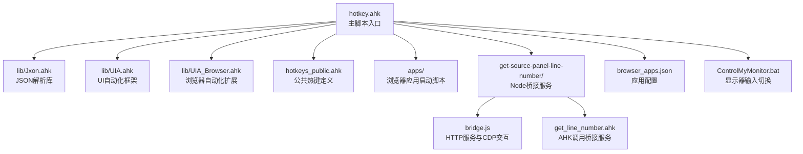
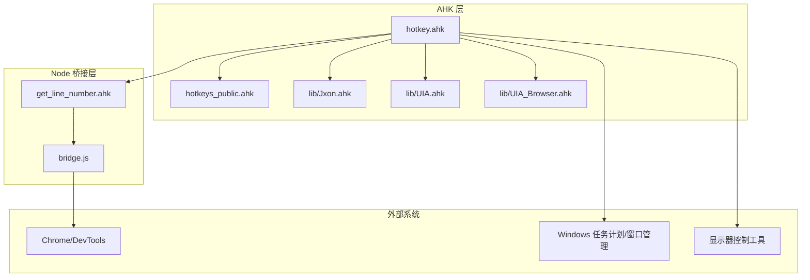
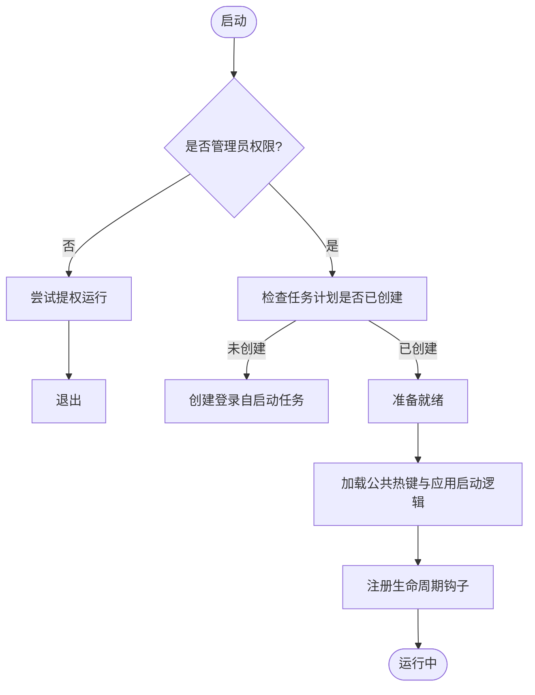
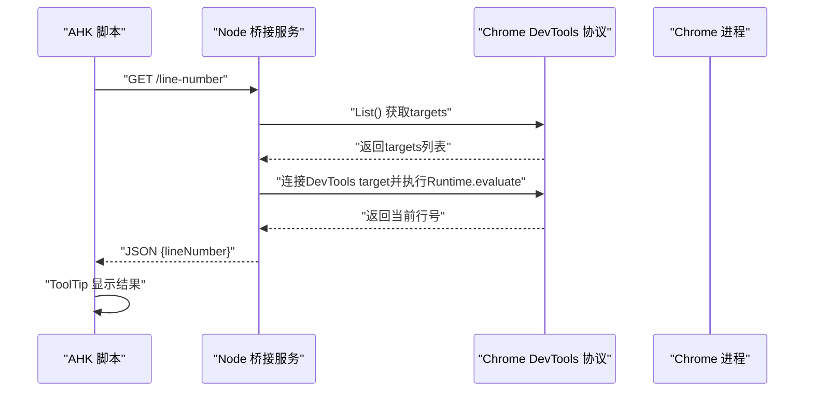
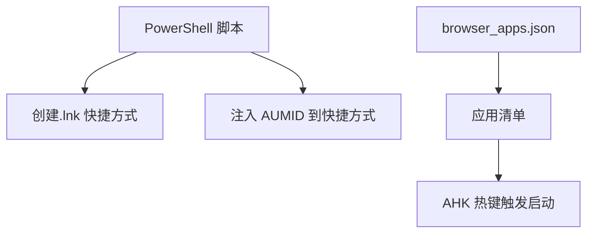
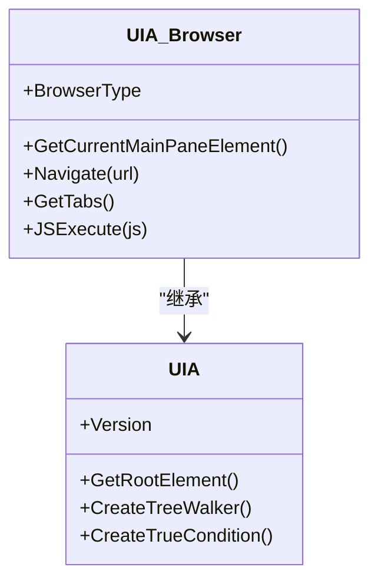
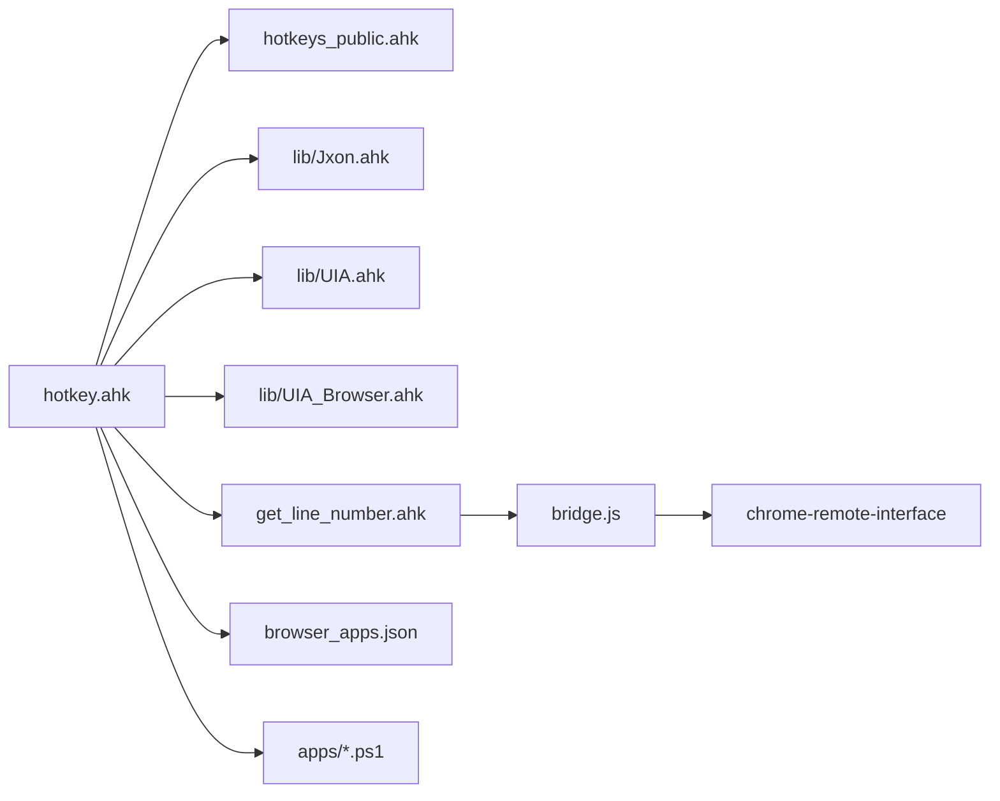

# 开发环境搭建

<cite>
**本文引用的文件**
- [README.md](file://README.md)
- [nvm-node-pnpm-setup-guide.md](file://nvm-node-pnpm-setup-guide.md)
- [setup-node-pnpm-lite.ps1](file://setup-node-pnpm-lite.ps1)
- [get-source-panel-line-number/package.json](file://get-source-panel-line-number/package.json)
- [get-source-panel-line-number/bridge.js](file://get-source-panel-line-number/bridge.js)
- [get-source-panel-line-number/get_line_number.ahk](file://get-source-panel-line-number/get_line_number.ahk)
- [hotkey.ahk](file://hotkey.ahk)
- [hotkeys_public.ahk](file://hotkeys_public.ahk)
- [lib/Jxon.ahk](file://lib/Jxon.ahk)
- [lib/UIA.ahk](file://lib/UIA.ahk)
- [lib/UIA_Browser.ahk](file://lib/UIA_Browser.ahk)
- [apps/run_ChatGPT.ps1](file://apps/run_ChatGPT.ps1)
- [apps/run_DMS.ps1](file://apps/run_DMS.ps1)
- [ControlMyMonitor.bat](file://ControlMyMonitor.bat)
- [browser_apps.json](file://browser_apps.json)
</cite>

## 目录
1. [简介](#简介)
2. [项目结构](#项目结构)
3. [核心组件](#核心组件)
4. [架构总览](#架构总览)
5. [详细组件分析](#详细组件分析)
6. [依赖关系分析](#依赖关系分析)
7. [性能考虑](#性能考虑)
8. [故障排查指南](#故障排查指南)
9. [结论](#结论)
10. [附录](#附录)

## 简介
本指南面向hotkey项目的开发者，提供从零搭建开发环境的完整步骤，涵盖AutoHotkey v2、Node.js与pnpm的安装配置、开发工具推荐、测试与调试方法，以及版本控制与协作开发最佳实践。项目以AHK v2为核心，结合Node.js桥接服务实现与浏览器调试协议交互，辅以JSON配置驱动的应用启动与快捷键管理。

## 项目结构
仓库采用按功能域组织的结构：顶层为主脚本与公共热键定义，lib目录提供通用库（JSON解析、UI自动化），apps目录包含浏览器应用启动脚本与批处理工具，get-source-panel-line-number为Node桥接模块，用于从DevTools源码面板获取当前行号。

图表来源
- [hotkey.ahk:1-20](file://hotkey.ahk#L1-L20)
- [lib/Jxon.ahk:1-20](file://lib/Jxon.ahk#L1-L20)
- [lib/UIA.ahk:1-20](file://lib/UIA.ahk#L1-L20)
- [lib/UIA_Browser.ahk:1-20](file://lib/UIA_Browser.ahk#L1-L20)
- [hotkeys_public.ahk:1-20](file://hotkeys_public.ahk#L1-L20)
- [get-source-panel-line-number/bridge.js:1-20](file://get-source-panel-line-number/bridge.js#L1-L20)
- [get-source-panel-line-number/get_line_number.ahk:1-20](file://get-source-panel-line-number/get_line_number.ahk#L1-L20)
- [browser_apps.json:1-20](file://browser_apps.json#L1-L20)
- [ControlMyMonitor.bat:1-20](file://ControlMyMonitor.bat#L1-L20)

章节来源
- [README.md:1-2](file://README.md#L1-L2)
- [hotkey.ahk:1-20](file://hotkey.ahk#L1-L20)

## 核心组件
- AutoHotkey v2主脚本：负责系统级热键绑定、窗口切换、任务计划注册、应用启动与辅助功能（如IME智能切换、标点转换等）。
- UI自动化库：封装UIA框架，提供浏览器自动化、元素定位与事件监听能力。
- JSON解析库：轻量级JSON编解码，支撑配置与数据交换。
- Node桥接模块：通过Chrome DevTools Protocol（CDP）从DevTools源码面板获取当前行号，并暴露HTTP接口供AHK调用。
- 浏览器应用启动脚本：基于PowerShell创建带参数的Chrome快捷方式，支持AUMID注入，便于系统识别与窗口管理。
- 显示器输入切换批处理：通过ControlMyMonitor.exe读取/设置显示器VCP值，自动在不同输入源间切换。

章节来源
- [hotkey.ahk:1-20](file://hotkey.ahk#L1-L20)
- [lib/UIA.ahk:1-20](file://lib/UIA.ahk#L1-L20)
- [lib/Jxon.ahk:1-20](file://lib/Jxon.ahk#L1-L20)
- [get-source-panel-line-number/bridge.js:1-20](file://get-source-panel-line-number/bridge.js#L1-L20)
- [get-source-panel-line-number/get_line_number.ahk:1-20](file://get-source-panel-line-number/get_line_number.ahk#L1-L20)
- [apps/run_ChatGPT.ps1:1-20](file://apps/run_ChatGPT.ps1#L1-L20)
- [ControlMyMonitor.bat:1-20](file://ControlMyMonitor.bat#L1-L20)

## 架构总览
hotkey整体采用“AHK v2主控 + Node桥接 + 浏览器/系统交互”的分层架构。AHK负责热键与系统操作，Node桥接负责与浏览器调试协议通信，lib目录提供跨平台UI自动化与JSON处理能力。

图表来源
- [hotkey.ahk:1-20](file://hotkey.ahk#L1-L20)
- [hotkeys_public.ahk:1-20](file://hotkeys_public.ahk#L1-L20)
- [lib/Jxon.ahk:1-20](file://lib/Jxon.ahk#L1-L20)
- [lib/UIA.ahk:1-20](file://lib/UIA.ahk#L1-L20)
- [lib/UIA_Browser.ahk:1-20](file://lib/UIA_Browser.ahk#L1-L20)
- [get-source-panel-line-number/get_line_number.ahk:1-20](file://get-source-panel-line-number/get_line_number.ahk#L1-L20)
- [get-source-panel-line-number/bridge.js:1-20](file://get-source-panel-line-number/bridge.js#L1-L20)

## 详细组件分析

### AutoHotkey v2 主脚本与热键体系
- 系统权限与自启动：要求管理员权限，首次运行注册登录自启动任务，确保开机即生效。
- 窗口切换与应用启动：提供统一的开关窗口与路径回退逻辑，支持协议路径与本地路径双重回退。
- 热键绑定：集中于公共热键文件，覆盖常用应用与工具的快速启动与窗口控制。
- IME智能切换与标点转换：根据输入上下文自动切换中/英输入法与标点格式，提升编码体验。
- 生命周期钩子：支持启动/重载/退出钩子，便于扩展与调试。

图表来源
- [hotkey.ahk:24-52](file://hotkey.ahk#L24-L52)
- [hotkeys_public.ahk:1-20](file://hotkeys_public.ahk#L1-L20)

章节来源
- [hotkey.ahk:24-52](file://hotkey.ahk#L24-L52)
- [hotkeys_public.ahk:1-57](file://hotkeys_public.ahk#L1-L57)

### Node桥接模块：从DevTools获取行号
- Node服务：通过CDP列出targets，定位DevTools自身target，执行JS表达式获取源码面板当前选中行号。
- AHK调用：AHK通过HTTP请求调用Node服务，等待响应并展示提示。
- 状态诊断：提供F12诊断热键，检查Chrome进程、调试端口与Node服务在线状态。

图表来源
- [get-source-panel-line-number/bridge.js:8-40](file://get-source-panel-line-number/bridge.js#L8-L40)
- [get-source-panel-line-number/get_line_number.ahk:71-86](file://get-source-panel-line-number/get_line_number.ahk#L71-L86)

章节来源
- [get-source-panel-line-number/bridge.js:1-51](file://get-source-panel-line-number/bridge.js#L1-L51)
- [get-source-panel-line-number/get_line_number.ahk:1-148](file://get-source-panel-line-number/get_line_number.ahk#L1-L148)

### 浏览器应用启动与配置
- PowerShell脚本：创建Chrome快捷方式，注入AUMID以便系统识别，设置应用模式与禁用项。
- JSON配置：集中管理浏览器路径、通用参数与应用清单（名称、标题、URL、热键、内存占用、AUMID）。

图表来源
- [apps/run_ChatGPT.ps1:1-18](file://apps/run_ChatGPT.ps1#L1-L18)
- [apps/run_DMS.ps1:1-18](file://apps/run_DMS.ps1#L1-L18)
- [browser_apps.json:1-48](file://browser_apps.json#L1-L48)

章节来源
- [apps/run_ChatGPT.ps1:1-18](file://apps/run_ChatGPT.ps1#L1-L18)
- [apps/run_DMS.ps1:1-18](file://apps/run_DMS.ps1#L1-L18)
- [browser_apps.json:1-48](file://browser_apps.json#L1-L48)

### UI自动化与浏览器扩展
- UIA框架：封装IUIAutomation接口，提供元素查找、属性读取、事件监听等能力。
- 浏览器扩展：针对Chrome/Edge/Mozilla等浏览器提供导航、标签页管理、JS执行等高级操作。

图表来源
- [lib/UIA.ahk:51-138](file://lib/UIA.ahk#L51-L138)
- [lib/UIA_Browser.ahk:1-60](file://lib/UIA_Browser.ahk#L1-L60)

章节来源
- [lib/UIA.ahk:1-200](file://lib/UIA.ahk#L1-L200)
- [lib/UIA_Browser.ahk:1-200](file://lib/UIA_Browser.ahk#L1-L200)

### JSON解析库
- 轻量实现：支持Map/Array的序列化与反序列化，内部递归解析对象、数组、字符串、数字、布尔与null。
- 性能与兼容：避免复杂依赖，适配AHK v2语法与数据模型。

章节来源
- [lib/Jxon.ahk:1-200](file://lib/Jxon.ahk#L1-L200)

## 依赖关系分析
- Node桥接模块依赖chrome-remote-interface与Node内置HTTP模块，需确保Chrome以调试端口运行。
- AHK主脚本依赖UIA库与JSON库，热键定义依赖公共配置文件。
- 浏览器应用启动依赖PowerShell与Chrome快捷方式，配置依赖JSON文件。

图表来源
- [hotkey.ahk:1-20](file://hotkey.ahk#L1-L20)
- [hotkeys_public.ahk:1-20](file://hotkeys_public.ahk#L1-L20)
- [lib/Jxon.ahk:1-20](file://lib/Jxon.ahk#L1-L20)
- [lib/UIA.ahk:1-20](file://lib/UIA.ahk#L1-L20)
- [lib/UIA_Browser.ahk:1-20](file://lib/UIA_Browser.ahk#L1-L20)
- [get-source-panel-line-number/get_line_number.ahk:1-20](file://get-source-panel-line-number/get_line_number.ahk#L1-L20)
- [get-source-panel-line-number/bridge.js:1-5](file://get-source-panel-line-number/bridge.js#L1-L5)
- [browser_apps.json:1-20](file://browser_apps.json#L1-L20)
- [apps/run_ChatGPT.ps1:1-10](file://apps/run_ChatGPT.ps1#L1-L10)

章节来源
- [get-source-panel-line-number/package.json:1-6](file://get-source-panel-line-number/package.json#L1-L6)

## 性能考虑
- Node桥接：CDP调用与HTTP服务开销较低，但需避免频繁轮询；建议在AHK侧增加超时与重试策略。
- UI自动化：元素查找与事件监听可能受窗口可见性与渲染延迟影响，必要时增加等待与重试。
- JSON解析：轻量实现适合小到中等规模数据，大规模嵌套结构建议分段处理或缓存中间结果。
- 浏览器应用启动：禁用扩展与后台网络有助于减少启动时间与资源占用。

## 故障排查指南
- Node环境问题
  - nvm镜像源异常：将nvm镜像切换至官方源后重装指定版本。
  - pnpm缓存与全局目录迁移：将npm/pnpm缓存与全局目录迁移到D盘，避免C盘空间不足。
  - Git代理：若访问GitHub超时，配置系统代理后验证远程仓库可达。
- Chrome调试端口
  - 若端口未开放，AHK会尝试以独立用户数据目录启动Chrome实例；也可强制重启以重置状态。
  - F12诊断热键可快速检查Chrome进程、调试端口与Node服务在线状态。
- 权限与自启动
  - 首次运行需管理员权限；若任务计划创建失败，检查系统策略与账户权限。
- 浏览器应用启动
  - AUMID注入失败会导致系统无法识别应用窗口；确认PowerShell脚本执行成功并检查快捷方式二进制头。

章节来源
- [nvm-node-pnpm-setup-guide.md:18-128](file://nvm-node-pnpm-setup-guide.md#L18-L128)
- [setup-node-pnpm-lite.ps1:34-120](file://setup-node-pnpm-lite.ps1#L34-L120)
- [get-source-panel-line-number/get_line_number.ahk:115-148](file://get-source-panel-line-number/get_line_number.ahk#L115-L148)
- [hotkey.ahk:24-52](file://hotkey.ahk#L24-L52)
- [apps/run_ChatGPT.ps1:14-18](file://apps/run_ChatGPT.ps1#L14-L18)

## 结论
通过本指南，开发者可在Windows环境下快速搭建hotkey项目的开发与调试环境。建议优先使用提供的PowerShell脚本完成Node/pnpm环境初始化，随后在AHK中验证Chrome调试端口与Node桥接服务连通性，最后结合公共热键与UIA库进行功能扩展与测试。

## 附录

### 开发环境安装与配置
- AutoHotkey v2
  - 安装AHK v2并确保支持#UseHook与单实例特性。
- Node.js与pnpm
  - 使用nvm安装指定版本Node，启用corepack并激活最新pnpm。
  - 将npm/pnpm缓存与全局目录迁移到D盘，避免C盘空间不足。
  - 如遇nvm镜像源问题，切换至官方源后重试安装。
- 代码编辑器与语法高亮
  - 推荐VS Code，安装AutoHotkey与AutoHotkey v2语法高亮插件。
  - 配置任务与调试启动项，便于一键运行AHK脚本与Node服务。
- 调试工具
  - Chrome DevTools：用于验证CDP交互与源码面板行号获取。
  - Windows系统工具：任务计划、窗口管理与显示器控制工具。

章节来源
- [nvm-node-pnpm-setup-guide.md:18-128](file://nvm-node-pnpm-setup-guide.md#L18-L128)
- [setup-node-pnpm-lite.ps1:60-120](file://setup-node-pnpm-lite.ps1#L60-L120)

### 测试环境搭建
- 单元测试
  - 建议为关键逻辑（如JSON解析、热键上下文判断）编写小型AHK测试脚本，验证边界条件与错误处理。
- 集成测试
  - 使用浏览器应用启动脚本与配置文件，验证应用启动、窗口识别与AUMID注入。
  - 通过F12诊断热键验证Chrome进程、调试端口与Node服务状态。
- 自动化脚本
  - 将常用环境初始化与验证步骤封装为PowerShell脚本，便于团队共享与CI复现。

章节来源
- [get-source-panel-line-number/get_line_number.ahk:121-148](file://get-source-panel-line-number/get_line_number.ahk#L121-L148)
- [browser_apps.json:1-48](file://browser_apps.json#L1-L48)

### 版本控制与协作最佳实践
- 分支管理
  - 主分支保护，功能开发在feature分支，修复bug在hotfix分支。
- 提交规范
  - 使用清晰的提交信息描述变更内容，关联Issue编号。
- 代码审查
  - 强制PR审查，关注安全、性能与可维护性。
- 持续集成
  - 在CI中执行环境初始化脚本、Node依赖安装与基础功能验证，确保主干可运行。