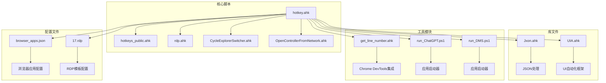
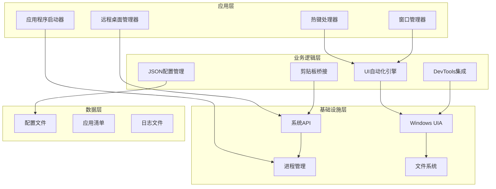
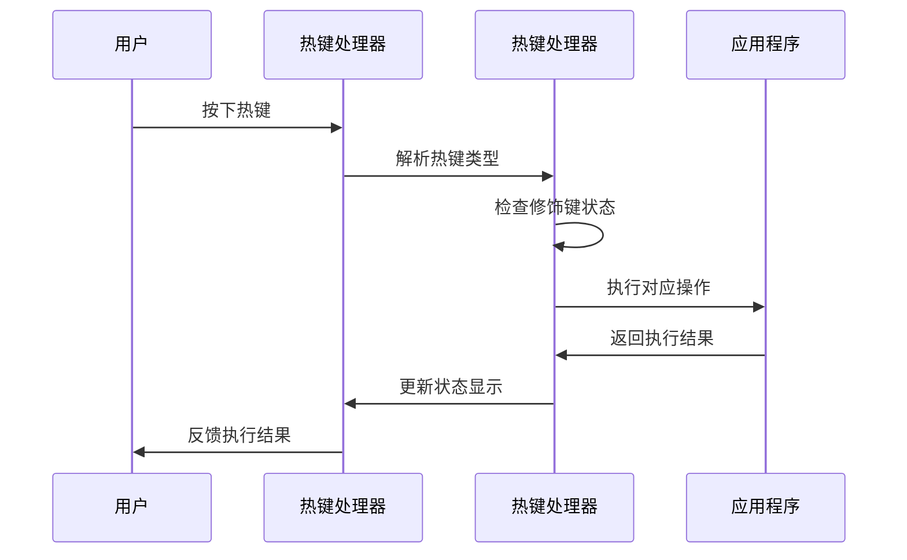
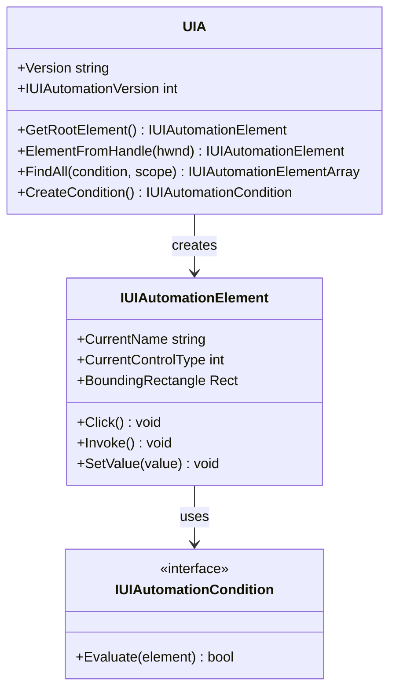
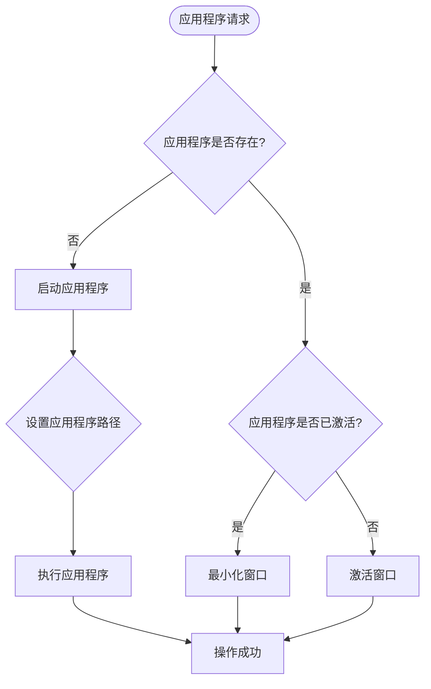
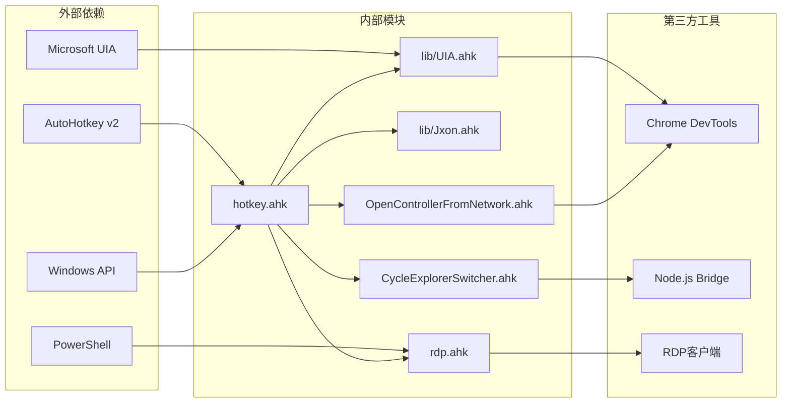
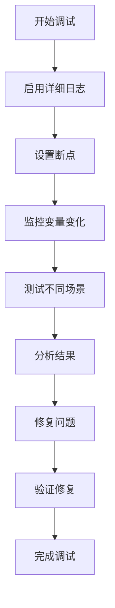
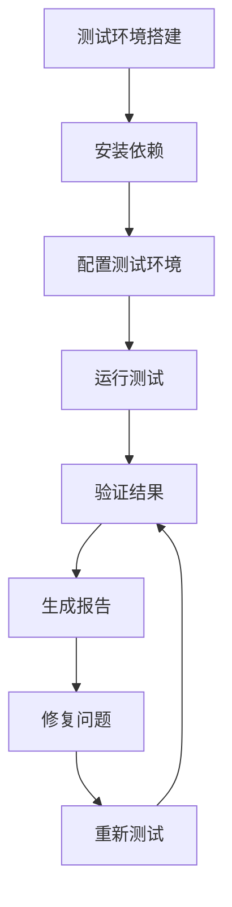
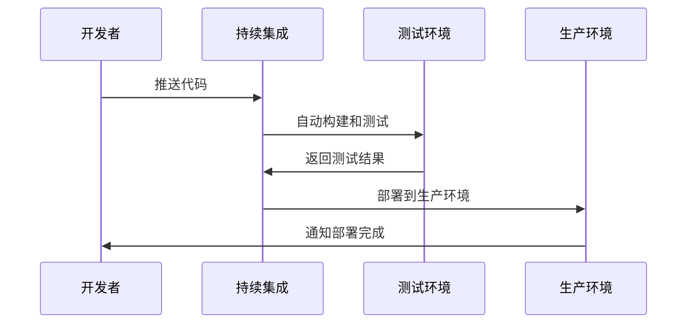
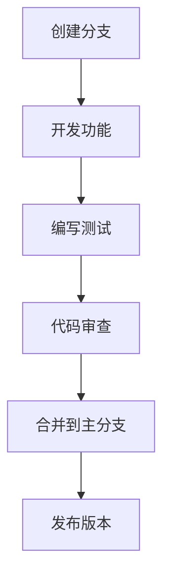

# 开发者指南

<cite>
**本文档引用的文件**
- [hotkey.ahk](file://hotkey.ahk)
- [hotkeys_public.ahk](file://hotkeys_public.ahk)
- [lib/UIA.ahk](file://lib/UIA.ahk)
- [lib/Jxon.ahk](file://lib/Jxon.ahk)
- [rdp.ahk](file://rdp.ahk)
- [CycleExplorerSwitcher.ahk](file://CycleExplorerSwitcher.ahk)
- [OpenControllerFromNetwork.ahk](file://OpenControllerFromNetwork.ahk)
- [get-source-panel-line-number/get_line_number.ahk](file://get-source-panel-line-number/get_line_number.ahk)
- [browser_apps.json](file://browser_apps.json)
- [apps/run_ChatGPT.ps1](file://apps/run_ChatGPT.ps1)
- [apps/run_DMS.ps1](file://apps/run_DMS.ps1)
- [templates/17.rdp](file://templates/17.rdp)
- [templates/README_SaveCredentials.md](file://templates/README_SaveCredentials.md)
- [README.md](file://README.md)
</cite>

## 目录
1. [简介](#简介)
2. [项目结构](#项目结构)
3. [核心组件](#核心组件)
4. [架构概览](#架构概览)
5. [详细组件分析](#详细组件分析)
6. [依赖关系分析](#依赖关系分析)
7. [性能考虑](#性能考虑)
8. [调试指南](#调试指南)
9. [扩展开发指南](#扩展开发指南)
10. [测试方法](#测试方法)
11. [发布流程](#发布流程)
12. [贡献规范](#贡献规范)
13. [结论](#结论)

## 简介

hotkey 是一个基于 AutoHotkey v2 的强大脚本系统，旨在为用户提供高度定制化的热键解决方案。该项目通过模块化设计实现了应用程序快速启动、窗口管理、UI 自动化、远程桌面连接等功能，为开发者提供了完整的扩展平台。

该项目的核心特点包括：
- **模块化架构**：清晰的功能模块分离，便于维护和扩展
- **UI 自动化**：深度集成 Microsoft UIA 框架，支持复杂的界面交互
- **多应用支持**：内置多种应用程序的快速启动和管理功能
- **远程桌面集成**：提供智能的 RDP 连接管理和剪贴板桥接功能
- **开发工具集成**：支持 Chrome DevTools 集成和源码面板行号获取

## 项目结构

项目采用清晰的模块化组织结构，每个功能领域都有独立的文件和职责分工：



**图表来源**
- [hotkey.ahk:1-50](file://hotkey.ahk#L1-L50)
- [lib/UIA.ahk:1-50](file://lib/UIA.ahk#L1-L50)
- [lib/Jxon.ahk:1-50](file://lib/Jxon.ahk#L1-L50)

**章节来源**
- [hotkey.ahk:1-200](file://hotkey.ahk#L1-L200)
- [README.md:1-2](file://README.md#L1-L2)

## 核心组件

### 主控制器 (hotkey.ahk)

作为整个系统的入口点，hotkey.ahk 负责：
- **权限管理**：自动提升为管理员权限，确保系统级功能可用
- **任务计划注册**：自动注册开机自启动任务
- **全局工具函数**：提供应用程序路径切换、窗口切换等通用功能
- **热键定义**：集中管理所有热键绑定

### UI 自动化框架 (lib/UIA.ahk)

这是一个完整的 Microsoft UI Automation 框架实现，提供：
- **元素定位**：支持基于属性、类型、条件等多种方式定位 UI 元素
- **事件处理**：监听和响应 UI 变化事件
- **跨进程交互**：能够与各种应用程序进行深度交互
- **性能优化**：提供缓存机制和批量操作支持

### JSON 处理库 (lib/Jxon.ahk)

轻量级的 JSON 解析和序列化库，支持：
- **双向转换**：Map 和 Array 对象与 JSON 字符串之间的转换
- **类型安全**：严格的类型检查和错误处理
- **性能优化**：针对 AHK v2 的优化实现

**章节来源**
- [hotkey.ahk:1-250](file://hotkey.ahk#L1-L250)
- [lib/UIA.ahk:1-200](file://lib/UIA.ahk#L1-L200)
- [lib/Jxon.ahk:1-150](file://lib/Jxon.ahk#L1-L150)

## 架构概览

系统采用分层架构设计，从底层的系统接口到高层的应用功能：



**图表来源**
- [hotkey.ahk:750-850](file://hotkey.ahk#L750-L850)
- [lib/UIA.ahk:500-700](file://lib/UIA.ahk#L500-L700)

## 详细组件分析

### 热键管理系统

系统实现了多层次的热键处理机制：



**图表来源**
- [hotkey.ahk:565-625](file://hotkey.ahk#L565-L625)
- [hotkeys_public.ahk:1-57](file://hotkeys_public.ahk#L1-L57)

### UI 自动化引擎

UIA 引擎提供了强大的界面自动化能力：



**图表来源**
- [lib/UIA.ahk:51-150](file://lib/UIA.ahk#L51-L150)
- [lib/UIA.ahk:310-450](file://lib/UIA.ahk#L310-L450)

### 应用程序管理器

系统提供了多种应用程序管理功能：



**图表来源**
- [hotkey.ahk:120-147](file://hotkey.ahk#L120-L147)
- [hotkey.ahk:751-800](file://hotkey.ahk#L751-L800)

**章节来源**
- [hotkey.ahk:120-250](file://hotkey.ahk#L120-L250)
- [lib/UIA.ahk:150-350](file://lib/UIA.ahk#L150-L350)

## 依赖关系分析

系统采用松耦合的设计原则，通过明确的接口和依赖注入实现模块间的解耦：



**图表来源**
- [hotkey.ahk:1-10](file://hotkey.ahk#L1-L10)
- [lib/UIA.ahk:1-30](file://lib/UIA.ahk#L1-L30)

**章节来源**
- [hotkey.ahk:1-50](file://hotkey.ahk#L1-L50)
- [lib/Jxon.ahk:1-30](file://lib/Jxon.ahk#L1-L30)

## 性能考虑

### 内存管理
- **延迟初始化**：UIA 框架采用延迟初始化策略，仅在首次使用时加载
- **对象池**：频繁使用的对象通过对象池减少内存分配
- **垃圾回收**：合理使用 `__Delete` 方法进行资源清理

### 执行效率
- **异步操作**：长时间运行的操作采用异步执行避免阻塞主线程
- **缓存机制**：UI 元素和配置信息使用缓存减少重复查询
- **批处理**：多个相关操作合并执行减少系统调用次数

### 资源优化
- **最小权限原则**：仅申请必要的系统权限
- **文件访问优化**：配置文件采用一次性读取并缓存
- **网络请求优化**：DevTools 集成使用连接复用

## 调试指南

### 常用调试技巧

1. **日志记录**：系统提供了完善的日志记录机制
2. **状态监控**：通过工具提示显示当前状态
3. **错误处理**：详细的异常捕获和错误信息
4. **性能分析**：内置性能计时和统计功能

### 调试工具



**章节来源**
- [OpenControllerFromNetwork.ahk:301-311](file://OpenControllerFromNetwork.ahk#L301-L311)
- [rdp.ahk:140-146](file://rdp.ahk#L140-L146)

## 扩展开发指南

### 自定义热键开发

要添加新的热键功能，需要遵循以下步骤：

1. **定义热键**：在主脚本中添加新的热键绑定
2. **实现功能**：编写对应的处理函数
3. **错误处理**：添加适当的异常处理
4. **测试验证**：进行全面的功能测试

### 应用程序扩展

系统支持通过配置文件添加新的应用程序：

```json
{
  "apps": [
    {
      "name": "新应用",
      "title": "应用标题",
      "url": "https://example.com",
      "browser": "chrome",
      "memory": 1,
      "hotkey": "#n",
      "aumid": "NewApp"
    }
  ]
}
```

### UIA 功能扩展

要扩展 UI 自动化功能：

1. **分析目标应用**：使用 UIA Viewer 分析目标应用的结构
2. **定位元素**：编写条件表达式定位目标元素
3. **实现交互**：根据需求实现相应的交互操作
4. **测试验证**：在不同环境下测试功能稳定性

**章节来源**
- [browser_apps.json:25-46](file://browser_apps.json#L25-L46)
- [lib/UIA.ahk:647-671](file://lib/UIA.ahk#L647-L671)

## 测试方法

### 单元测试

系统提供了多种测试方法：

1. **功能测试**：验证每个热键功能的正确性
2. **集成测试**：测试模块间的协作功能
3. **回归测试**：确保新功能不影响现有功能
4. **性能测试**：评估系统的响应时间和资源使用

### 测试环境搭建



### 测试用例设计

- **正常场景**：验证基本功能的正确性
- **边界条件**：测试极端情况下的行为
- **错误处理**：验证异常情况的处理
- **性能基准**：建立性能基线用于比较

## 发布流程

### 版本管理

系统采用语义化版本控制：

1. **主版本**：重大架构变更
2. **次版本**：新增功能
3. **修订版本**：bug 修复和小改进

### 构建流程



### 发布检查清单

- [ ] 代码审查完成
- [ ] 所有测试通过
- [ ] 文档更新
- [ ] 版本标签创建
- [ ] 发布说明编写

## 贡献规范

### 代码风格

1. **命名约定**：使用清晰的函数和变量命名
2. **注释规范**：为复杂逻辑添加详细注释
3. **错误处理**：统一的错误处理模式
4. **性能考虑**：避免不必要的性能开销

### 提交流程



### 提交规范

- **提交信息**：清晰描述变更内容
- **变更范围**：限制每次提交的变更范围
- **测试要求**：确保所有相关测试通过

## 结论

hotkey 项目通过精心设计的模块化架构和丰富的功能特性，为用户提供了强大而灵活的热键解决方案。项目的设计充分考虑了可扩展性和可维护性，为开发者提供了良好的扩展平台。

主要优势包括：
- **模块化设计**：清晰的功能分离便于维护和扩展
- **强大的 UI 自动化**：深入集成 Microsoft UIA 框架
- **完善的错误处理**：健壮的异常处理机制
- **详细的文档**：清晰的开发指南和 API 文档
- **活跃的社区**：开放的贡献和反馈机制

未来的发展方向包括：
- 进一步优化性能表现
- 扩展更多应用程序的支持
- 增强配置管理功能
- 改进用户体验和易用性

通过遵循本文档提供的开发指南和最佳实践，开发者可以有效地扩展和定制 hotkey 项目，满足各种复杂的自动化需求。