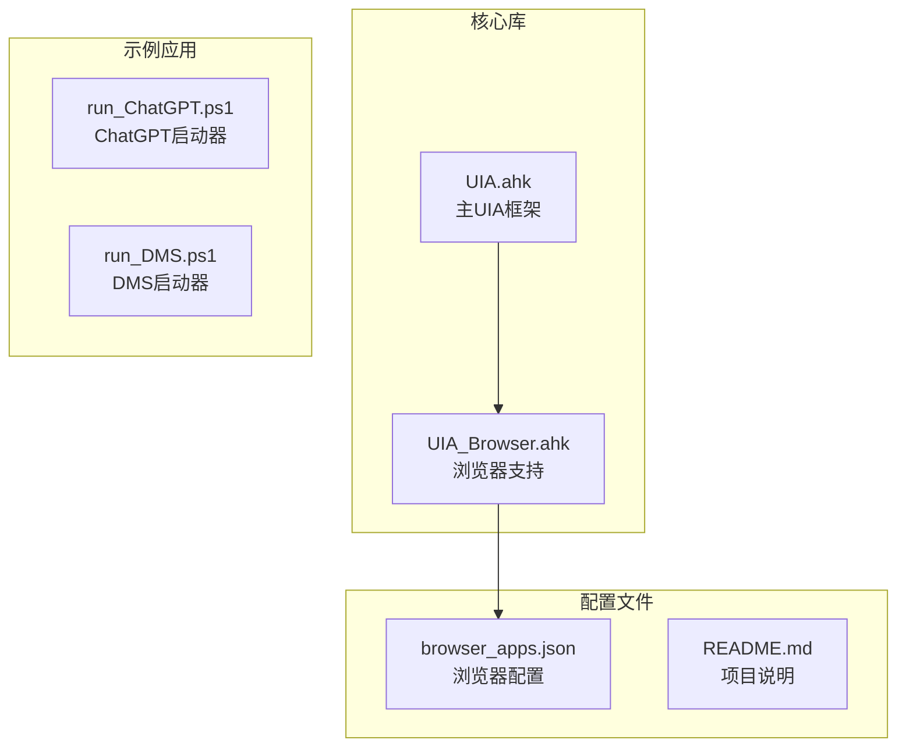
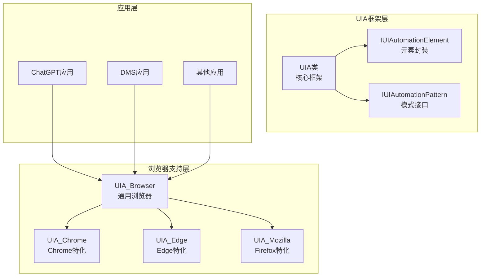
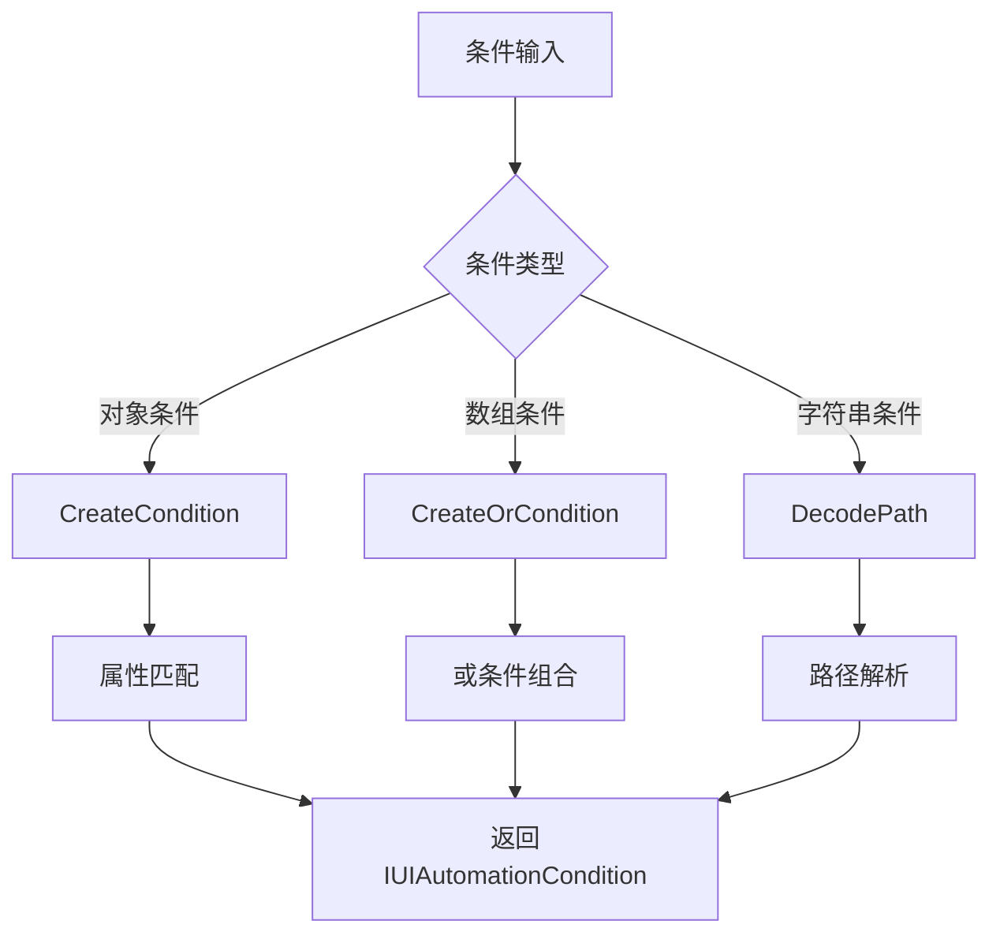
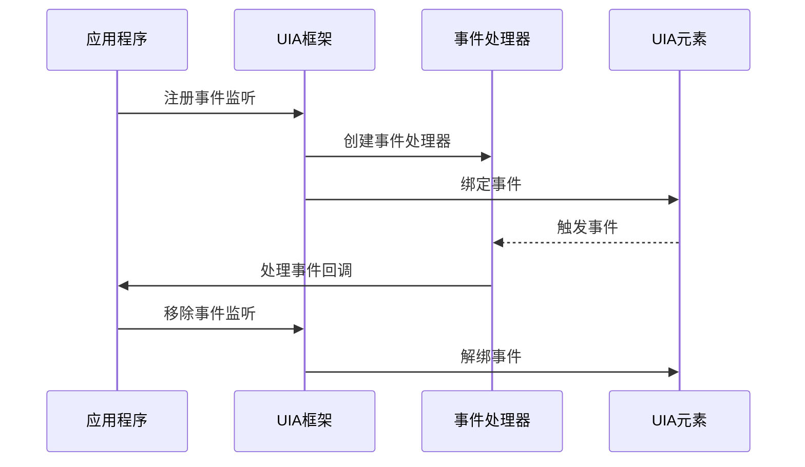
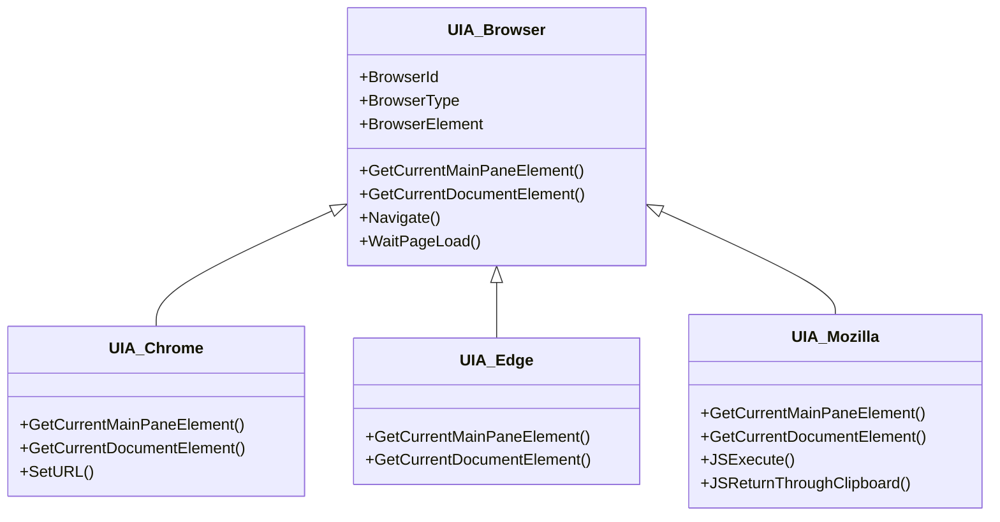
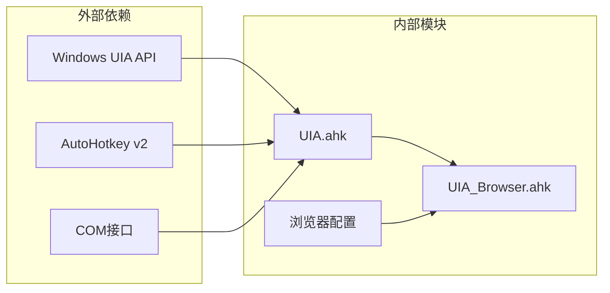
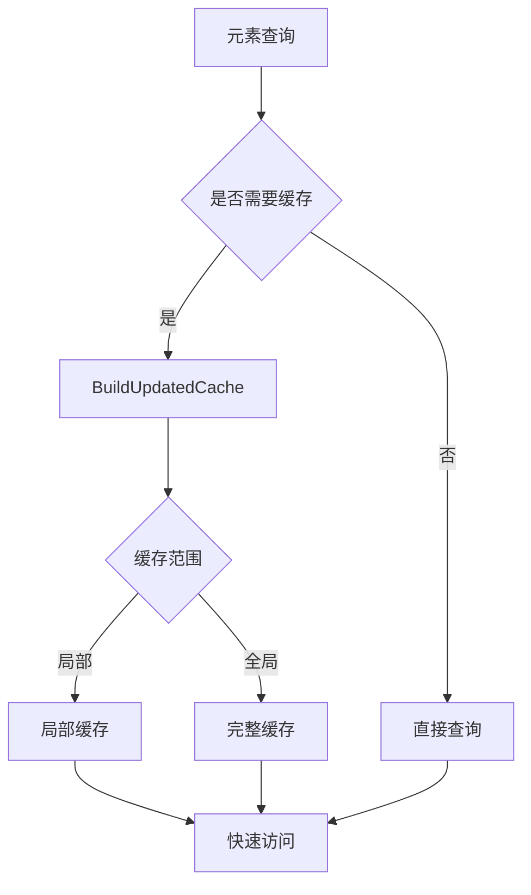

# UIA功能扩展开发

<cite>
**本文档引用的文件**
- [UIA.ahk](file://lib/UIA.ahk)
- [UIA_Browser.ahk](file://lib/UIA_Browser.ahk)
- [README.md](file://README.md)
- [browser_apps.json](file://browser_apps.json)
</cite>

## 目录
1. [简介](#简介)
2. [项目结构](#项目结构)
3. [核心组件](#核心组件)
4. [架构概览](#架构概览)
5. [详细组件分析](#详细组件分析)
6. [依赖关系分析](#依赖关系分析)
7. [性能考虑](#性能考虑)
8. [故障排除指南](#故障排除指南)
9. [结论](#结论)

## 简介

本指南面向需要在AutoHotkey环境中开发UIA（Windows UI自动化）功能扩展的开发者。项目提供了完整的UIA框架实现，包括元素定位、事件处理、浏览器支持增强等功能。本文档将深入解析代码库，提供实用的开发指导和最佳实践。

## 项目结构

项目采用模块化设计，主要包含以下核心文件：

**图表来源**
- [UIA.ahk](file://lib/UIA.ahk)
- [UIA_Browser.ahk](file://lib/UIA_Browser.ahk)
- [browser_apps.json](file://browser_apps.json)

**章节来源**
- [README.md](file://README.md)
- [browser_apps.json](file://browser_apps.json)

## 核心组件

### UIA主框架类

UIA类是整个框架的核心，提供了完整的UIA功能封装：

- **初始化管理**：自动检测和加载合适的UIA版本
- **条件构建**：支持复杂的元素查找条件
- **缓存机制**：优化性能的元素属性缓存
- **事件处理**：全面的UIA事件监听能力

### 浏览器支持模块

UIA_Browser类专门处理浏览器自动化：

- **多浏览器适配**：Chrome、Edge、Firefox、Vivaldi等
- **页面元素识别**：地址栏、标签页、导航按钮等
- **交互自动化**：导航、点击、文本输入等操作

**章节来源**
- [UIA.ahk](file://lib/UIA.ahk)
- [UIA_Browser.ahk](file://lib/UIA_Browser.ahk)

## 架构概览

**图表来源**
- [UIA.ahk](file://lib/UIA.ahk)
- [UIA_Browser.ahk](file://lib/UIA_Browser.ahk)

## 详细组件分析

### 元素定位策略

#### 条件构建系统

UIA框架提供了强大的条件构建能力：

**图表来源**
- [UIA.ahk](file://lib/UIA.ahk)

#### 属性匹配机制

支持多种匹配模式：
- **精确匹配** (`MatchMode.Exact`)
- **包含匹配** (`MatchMode.Substring`)
- **前缀匹配** (`MatchMode.StartsWith`)
- **正则表达式** (`MatchMode.RegEx`)

#### 层级遍历技术

提供多种遍历方式：
- **深度优先** (`TreeTraversalOptions.PostOrder`)
- **广度优先** (`TreeTraversalOptions.FirstToLastOrder`)
- **反向遍历** (`TreeTraversalOptions.LastToFirstOrder`)

**章节来源**
- [UIA.ahk](file://lib/UIA.ahk)

### 事件处理扩展开发

#### 事件监听机制

UIA框架支持多种事件类型：

**图表来源**
- [UIA.ahk](file://lib/UIA.ahk)

#### 自定义事件处理器

支持异步事件处理：
- **同步处理**：立即响应事件
- **异步处理**：后台线程处理
- **事件队列**：批量处理多个事件

**章节来源**
- [UIA.ahk](file://lib/UIA.ahk)

### 浏览器支持增强

#### 新浏览器适配

**图表来源**
- [UIA_Browser.ahk](file://lib/UIA_Browser.ahk)

#### 页面元素识别

浏览器元素识别策略：
- **地址栏识别**：通过Edit控件识别
- **标签页识别**：通过Tab控件识别
- **导航按钮识别**：通过Button控件识别
- **文档区域识别**：通过Document控件识别

**章节来源**
- [UIA_Browser.ahk](file://lib/UIA_Browser.ahk)

## 依赖关系分析

**图表来源**
- [UIA.ahk](file://lib/UIA.ahk)
- [UIA_Browser.ahk](file://lib/UIA_Browser.ahk)

**章节来源**
- [UIA.ahk](file://lib/UIA.ahk)
- [UIA_Browser.ahk](file://lib/UIA_Browser.ahk)

## 性能考虑

### 缓存优化策略

1. **属性缓存**：使用`CreateCacheRequest`预加载常用属性
2. **元素缓存**：缓存树结构以避免重复查询
3. **条件缓存**：缓存复杂条件的计算结果

### 查询优化技术

**图表来源**
- [UIA.ahk](file://lib/UIA.ahk)

### 内存管理

- **自动释放**：COM对象自动内存管理
- **循环引用**：避免对象间的循环引用
- **资源清理**：及时释放UIA资源

## 故障排除指南

### 常见问题及解决方案

#### 元素查找失败

**问题**：`TargetError: An element matching the condition was not found`

**解决方案**：
1. 检查条件是否过于严格
2. 使用更宽松的匹配模式
3. 验证元素是否可见且可交互

#### 事件处理异常

**问题**：事件处理器无法正常工作

**解决方案**：
1. 确保事件处理器对象未被销毁
2. 检查事件注册和注销的时机
3. 验证事件参数的正确性

#### 浏览器兼容性问题

**问题**：特定浏览器元素识别失败

**解决方案**：
1. 检查浏览器版本兼容性
2. 更新浏览器配置
3. 实现特定浏览器的适配类

**章节来源**
- [UIA.ahk](file://lib/UIA.ahk)
- [UIA_Browser.ahk](file://lib/UIA_Browser.ahk)

## 结论

本项目提供了完整的UIA功能扩展开发框架，具有以下特点：

1. **功能完整性**：覆盖了UIA的主要功能领域
2. **扩展性强**：支持自定义浏览器适配和事件处理
3. **性能优化**：内置缓存和优化机制
4. **易于使用**：提供简洁的API接口

开发者可以基于此框架快速实现各种UI自动化需求，包括元素定位、事件监听、浏览器自动化等功能。建议在实际开发中重点关注性能优化和错误处理，确保系统的稳定性和可靠性。