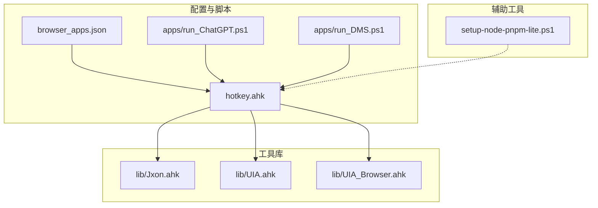
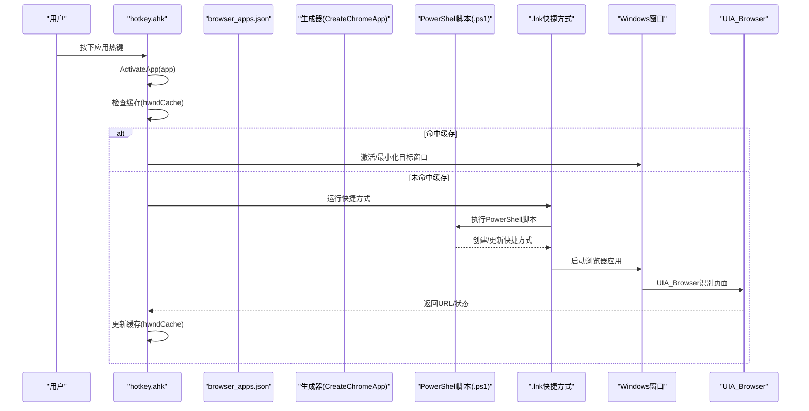
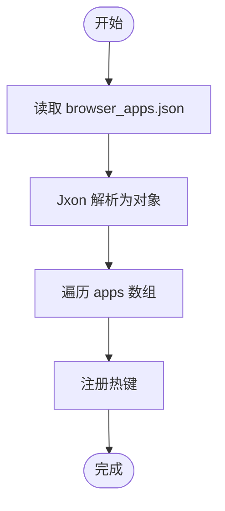
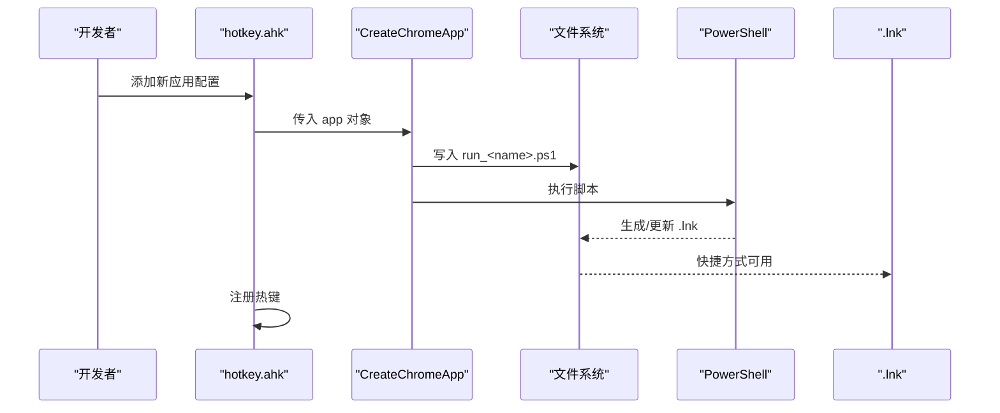
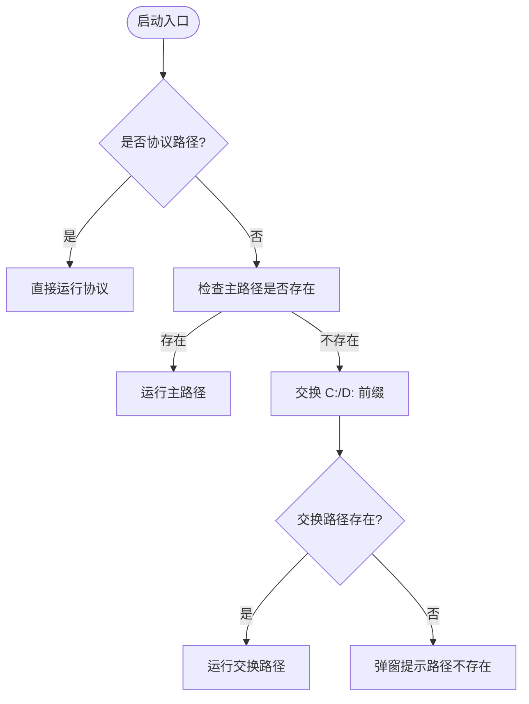
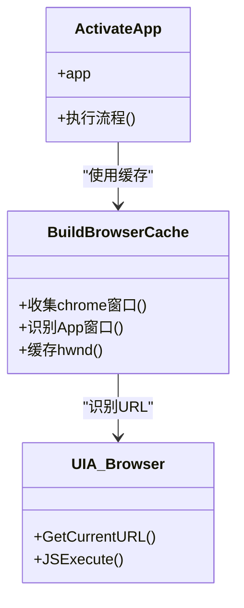
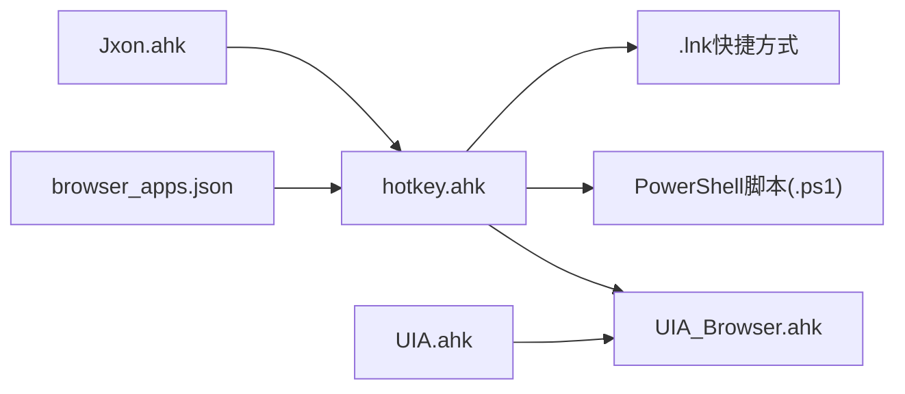

# 应用程序扩展开发

<cite>
**本文档引用的文件**
- [browser_apps.json](file://browser_apps.json)
- [hotkey.ahk](file://hotkey.ahk)
- [apps/run_ChatGPT.ps1](file://apps/run_ChatGPT.ps1)
- [apps/run_DMS.ps1](file://apps/run_DMS.ps1)
- [lib/Jxon.ahk](file://lib/Jxon.ahk)
- [lib/UIA.ahk](file://lib/UIA.ahk)
- [lib/UIA_Browser.ahk](file://lib/UIA_Browser.ahk)
- [setup-node-pnpm-lite.ps1](file://setup-node-pnpm-lite.ps1)
- [README.md](file://README.md)
</cite>

## 目录
1. [简介](#简介)
2. [项目结构](#项目结构)
3. [核心组件](#核心组件)
4. [架构总览](#架构总览)
5. [详细组件分析](#详细组件分析)
6. [依赖关系分析](#依赖关系分析)
7. [性能考虑](#性能考虑)
8. [故障排除指南](#故障排除指南)
9. [结论](#结论)
10. [附录](#附录)

## 简介
本指南面向希望基于现有 AutoHotkey v2 脚本扩展应用程序启动能力的开发者。文档聚焦于以下目标：
- 浏览器应用程序配置格式与定义方法（browser_apps.json）
- 新应用程序添加流程（PowerShell 脚本生成、快捷方式创建、路径前缀切换支持）
- 应用程序配置验证机制（路径存在性检查、权限验证、启动测试）
- 应用程序生命周期管理、多实例处理与协议应用程序支持的实现方法

本项目通过 JSON 配置驱动，结合 PowerShell 快捷方式生成与 AutoHotkey 热键绑定，实现一键启动浏览器 PWA 应用，并提供窗口复用、缓存与 UIA 辅助能力。

**章节来源**
- [README.md:1-2](file://README.md#L1-L2)

## 项目结构
项目采用“配置驱动 + 脚本自动化”的组织方式：
- 配置文件：browser_apps.json
- 应用程序启动脚本：apps/run_*.ps1
- 核心脚本：hotkey.ahk
- 工具库：lib/Jxon.ahk、lib/UIA.ahk、lib/UIA_Browser.ahk
- 开发辅助：setup-node-pnpm-lite.ps1

**图表来源**
- [browser_apps.json:1-48](file://browser_apps.json#L1-L48)
- [hotkey.ahk:2135-2152](file://hotkey.ahk#L2135-L2152)
- [apps/run_ChatGPT.ps1:1-18](file://apps/run_ChatGPT.ps1#L1-L18)
- [apps/run_DMS.ps1:1-18](file://apps/run_DMS.ps1#L1-L18)
- [lib/Jxon.ahk:1-301](file://lib/Jxon.ahk#L1-L301)
- [lib/UIA.ahk:1-800](file://lib/UIA.ahk#L1-L800)
- [lib/UIA_Browser.ahk:1-800](file://lib/UIA_Browser.ahk#L1-L800)
- [setup-node-pnpm-lite.ps1:1-121](file://setup-node-pnpm-lite.ps1#L1-L121)

**章节来源**
- [browser_apps.json:1-48](file://browser_apps.json#L1-L48)
- [hotkey.ahk:2135-2152](file://hotkey.ahk#L2135-L2152)

## 核心组件
- 配置加载与解析：通过 Jxon 库加载 browser_apps.json，解析浏览器与应用列表。
- 应用程序生成：根据配置生成 PowerShell 快捷方式脚本，创建 .lnk 快捷方式并写入 AUMID。
- 热键绑定：遍历应用列表，为每个应用注册热键，触发激活逻辑。
- 应用生命周期：通过缓存已打开的应用窗口句柄，实现“激活/最小化”切换；未命中则启动快捷方式。
- 路径前缀切换：支持 C:/D: 盘路径互换，兼容不同安装位置。
- 协议应用支持：对协议（如 ms-phone:）直接运行，不进行文件存在性检查。

**章节来源**
- [hotkey.ahk:2135-2152](file://hotkey.ahk#L2135-L2152)
- [hotkey.ahk:2224-2248](file://hotkey.ahk#L2224-L2248)
- [hotkey.ahk:64-118](file://hotkey.ahk#L64-L118)
- [hotkey.ahk:752-800](file://hotkey.ahk#L752-L800)

## 架构总览
整体流程从配置文件出发，经由脚本生成快捷方式，再由热键触发激活逻辑，必要时通过 UIA 获取页面信息辅助识别。

**图表来源**
- [hotkey.ahk:2154-2248](file://hotkey.ahk#L2154-L2248)
- [hotkey.ahk:2077-2114](file://hotkey.ahk#L2077-L2114)
- [lib/UIA_Browser.ahk:458-528](file://lib/UIA_Browser.ahk#L458-L528)

## 详细组件分析

### 配置格式与定义方法（browser_apps.json）
- 结构要点
  - browsers：定义浏览器路径与默认配置
  - commonArgs：通用启动参数集合
  - apps：应用数组，每项包含 name、title、url、browser、memory、hotkey、aumid 等字段
- 字段说明
  - name：应用标识，用于生成脚本与快捷方式文件名
  - title：应用显示标题
  - url：应用地址（支持 PWA 场景）
  - browser：引用 browsers 中的浏览器键
  - memory：内存占用相关标记（用于脚本逻辑）
  - hotkey：热键绑定
  - aumid：应用用户模型 ID，用于快捷方式元数据写入
- 加载与使用
  - 通过 Jxon 库加载 JSON 并遍历 apps 数组，注册热键

**图表来源**
- [hotkey.ahk:2135-2152](file://hotkey.ahk#L2135-L2152)
- [lib/Jxon.ahk:10-48](file://lib/Jxon.ahk#L10-L48)

**章节来源**
- [browser_apps.json:1-48](file://browser_apps.json#L1-L48)
- [hotkey.ahk:2135-2152](file://hotkey.ahk#L2135-L2152)
- [lib/Jxon.ahk:10-48](file://lib/Jxon.ahk#L10-L48)

### 新应用程序添加流程
- 生成 PowerShell 脚本
  - 依据浏览器路径、配置参数与应用 URL，拼装 PowerShell 脚本内容
  - 写入 .ps1 文件并执行，创建 .lnk 快捷方式
- 快捷方式创建
  - 设置 TargetPath、Arguments、IconLocation、WorkingDirectory
  - 写入 AUMID 到快捷方式元数据偏移处
- 注册热键
  - 遍历配置中的 apps，为每个应用注册热键
- 启动与激活
  - 按下热键后，先检查缓存，命中则激活/最小化，未命中则运行 .lnk

**图表来源**
- [hotkey.ahk:2077-2114](file://hotkey.ahk#L2077-L2114)
- [apps/run_ChatGPT.ps1:1-18](file://apps/run_ChatGPT.ps1#L1-L18)
- [apps/run_DMS.ps1:1-18](file://apps/run_DMS.ps1#L1-L18)

**章节来源**
- [hotkey.ahk:2077-2114](file://hotkey.ahk#L2077-L2114)
- [apps/run_ChatGPT.ps1:1-18](file://apps/run_ChatGPT.ps1#L1-L18)
- [apps/run_DMS.ps1:1-18](file://apps/run_DMS.ps1#L1-L18)

### 应用程序配置验证机制
- 路径存在性检查
  - RunAppPathWithPrefixFallback：支持协议路径与文件路径，优先检查主路径，其次尝试 C:/D: 替换路径
  - 若均不存在，弹出错误提示
- 权限验证
  - 脚本启动时检查管理员权限，必要时尝试以管理员权限重启
- 启动测试
  - 通过 UIA_Browser 获取当前 URL，辅助识别已存在的应用窗口，避免重复启动
  - 缓存窗口句柄，实现快速激活

**图表来源**
- [hotkey.ahk:64-118](file://hotkey.ahk#L64-L118)

**章节来源**
- [hotkey.ahk:64-118](file://hotkey.ahk#L64-L118)
- [hotkey.ahk:2163-2209](file://hotkey.ahk#L2163-L2209)

### 应用程序生命周期管理与多实例处理
- 生命周期
  - 启动：运行 .lnk 快捷方式
  - 激活：通过 UIA_Browser 识别页面 URL，缓存窗口句柄
  - 切换：若已激活则最小化，否则激活
- 多实例处理
  - 通过 hwndCache 映射 URL 到窗口句柄，避免重复创建
  - UIA_Browser 识别 App 窗口，优先使用 UIA 获取 URL，失败回退 JS 方案
- 协议应用程序支持
  - 协议路径（如 ms-phone:）绕过文件存在性检查，直接运行

**图表来源**
- [hotkey.ahk:2224-2248](file://hotkey.ahk#L2224-L2248)
- [hotkey.ahk:2163-2209](file://hotkey.ahk#L2163-L2209)
- [lib/UIA_Browser.ahk:458-528](file://lib/UIA_Browser.ahk#L458-L528)

**章节来源**
- [hotkey.ahk:2224-2248](file://hotkey.ahk#L2224-L2248)
- [hotkey.ahk:2163-2209](file://hotkey.ahk#L2163-L2209)
- [lib/UIA_Browser.ahk:458-528](file://lib/UIA_Browser.ahk#L458-L528)

## 依赖关系分析
- 配置依赖：hotkey.ahk 依赖 browser_apps.json；Jxon 用于 JSON 解析
- UIA 依赖：UIA_Browser 依赖 UIA；用于浏览器窗口识别与页面信息获取
- PowerShell 依赖：PowerShell 脚本用于创建快捷方式与写入 AUMID
- 路径前缀：SwapProgramsPrefix 与 RunAppPathWithPrefixFallback 实现 C:/D: 切换

**图表来源**
- [hotkey.ahk:2135-2152](file://hotkey.ahk#L2135-L2152)
- [lib/Jxon.ahk:10-48](file://lib/Jxon.ahk#L10-L48)
- [lib/UIA_Browser.ahk:458-528](file://lib/UIA_Browser.ahk#L458-L528)

**章节来源**
- [hotkey.ahk:2135-2152](file://hotkey.ahk#L2135-L2152)
- [lib/Jxon.ahk:10-48](file://lib/Jxon.ahk#L10-L48)
- [lib/UIA_Browser.ahk:458-528](file://lib/UIA_Browser.ahk#L458-L528)

## 性能考虑
- UIA 初始化成本：UIA_Browser 在构造时会尝试定位浏览器元素，建议在脚本启动时预热或按需初始化
- 缓存命中率：通过 hwndCache 减少 UIA 查询次数，提高激活速度
- 路径前缀切换：仅在路径不存在时触发，避免不必要的 IO
- PowerShell 执行：脚本生成与执行为一次性操作，后续启动直接运行 .lnk

[本节为通用指导，无需特定文件引用]

## 故障排除指南
- 管理员权限不足
  - 现象：脚本无法注册系统任务或执行某些操作
  - 处理：以管理员身份运行脚本；脚本会在非管理员时提示并退出
- 路径不存在
  - 现象：启动失败并提示路径不存在
  - 处理：检查 browser_apps.json 中的浏览器路径；使用 RunAppPathWithPrefixFallback 的 C:/D: 切换逻辑
- 快捷方式未创建
  - 现象：热键无响应
  - 处理：确认 run_<name>.ps1 是否成功生成；检查 .lnk 是否存在；查看托盘提示
- UIA 识别失败
  - 现象：无法识别应用窗口或 URL
  - 处理：确保浏览器窗口可见；尝试刷新缓存 BuildBrowserCache；检查 UIA_Browser 版本与兼容性

**章节来源**
- [hotkey.ahk:24-52](file://hotkey.ahk#L24-L52)
- [hotkey.ahk:64-118](file://hotkey.ahk#L64-L118)
- [hotkey.ahk:2021-2034](file://hotkey.ahk#L2021-L2034)
- [hotkey.ahk:2163-2209](file://hotkey.ahk#L2163-L2209)

## 结论
本项目通过“配置驱动 + 脚本自动化 + UIA 辅助”的方式，实现了浏览器 PWA 应用的一键启动与高效管理。开发者只需在 browser_apps.json 中新增应用条目，即可自动生成 PowerShell 脚本与快捷方式，并通过热键实现激活/最小化切换。路径前缀切换与协议应用支持进一步增强了跨环境与协议场景的适配能力。

[本节为总结，无需特定文件引用]

## 附录

### 配置字段参考
- browsers
  - path：浏览器可执行文件路径
  - profile：浏览器配置文件目录
- commonArgs：启动参数数组
- apps[]
  - name：应用标识
  - title：应用标题
  - url：应用地址
  - browser：引用 browsers 键
  - memory：内存占用标记
  - hotkey：热键
  - aumid：应用用户模型 ID

**章节来源**
- [browser_apps.json:1-48](file://browser_apps.json#L1-L48)

### 开发辅助工具
- setup-node-pnpm-lite.ps1：用于 Node.js 生态环境的轻量级配置与校验

**章节来源**
- [setup-node-pnpm-lite.ps1:1-121](file://setup-node-pnpm-lite.ps1#L1-L121)