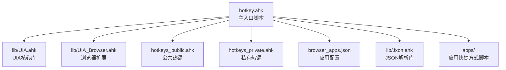
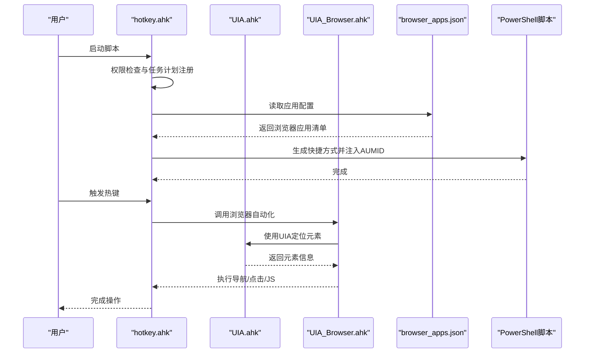
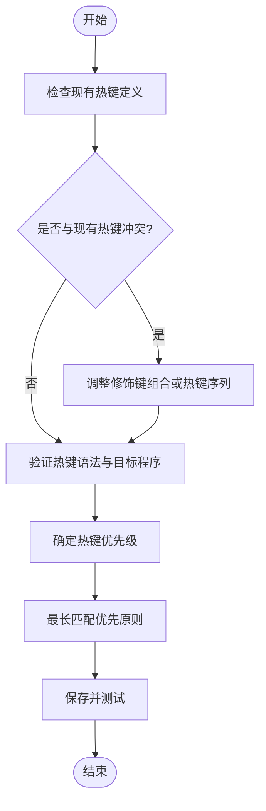
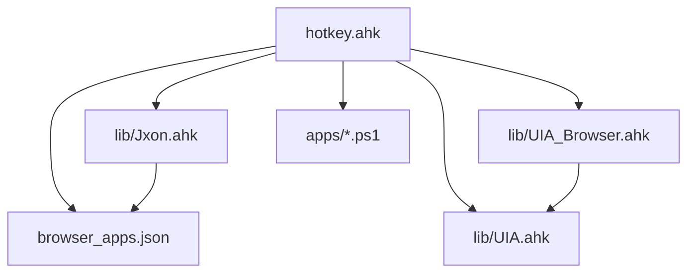

# 扩展开发指南

<cite>
**本文档引用的文件**
- [hotkey.ahk](file://hotkey.ahk)
- [hotkeys_public.ahk](file://hotkeys_public.ahk)
- [hotkeys_private.ahk](file://hotkeys_private.ahk)
- [browser_apps.json](file://browser_apps.json)
- [UIA.ahk](file://lib/UIA.ahk)
- [UIA_Browser.ahk](file://lib/UIA_Browser.ahk)
- [Jxon.ahk](file://lib/Jxon.ahk)
- [run_ChatGPT.ps1](file://apps/run_ChatGPT.ps1)
- [run_DMS.ps1](file://apps/run_DMS.ps1)
- [README.md](file://README.md)
</cite>

## 目录
1. [简介](#简介)
2. [项目结构](#项目结构)
3. [核心组件](#核心组件)
4. [架构总览](#架构总览)
5. [详细组件分析](#详细组件分析)
6. [依赖关系分析](#依赖关系分析)
7. [性能考虑](#性能考虑)
8. [故障排除指南](#故障排除指南)
9. [结论](#结论)
10. [附录](#附录)

## 简介
本指南面向希望扩展 hotkey 项目的开发者，涵盖以下主题：
- 在 hotkeys_private.ahk 中添加自定义热键
- 热键冲突避免策略与优先级管理
- 应用程序扩展方法：browser_apps.json 配置格式、新增应用流程与配置验证
- UIA 功能扩展：自定义 UIA 元素定位、事件处理扩展与浏览器支持增强
- 提供完整的扩展开发示例与最佳实践

## 项目结构
该项目基于 AutoHotkey v2，采用模块化组织：
- 主入口脚本负责权限提升、任务计划注册、通用工具函数与热键定义
- lib 目录提供 UIA 核心与浏览器扩展库
- apps 目录包含应用快捷方式生成脚本
- 配置文件 browser_apps.json 描述浏览器应用清单

图表来源
- [hotkey.ahk:1-50](file://hotkey.ahk#L1-L50)
- [lib/UIA.ahk:1-50](file://lib/UIA.ahk#L1-L50)
- [lib/UIA_Browser.ahk:1-50](file://lib/UIA_Browser.ahk#L1-L50)
- [browser_apps.json:1-48](file://browser_apps.json#L1-L48)

章节来源
- [hotkey.ahk:1-50](file://hotkey.ahk#L1-L50)
- [README.md:1-2](file://README.md#L1-L2)

## 核心组件
- 主入口脚本 hotkey.ahk
  - 权限自提升与任务计划注册
  - 通用工具函数：路径切换、窗口切换、输入法切换、热字符串等
  - 热键定义与生命周期管理
- UIA 核心库 UIA.ahk
  - UIA 初始化、条件构建、元素遍历、事件处理等
- 浏览器扩展 UIA_Browser.ahk
  - Chrome/Edge/Mozilla/Vivaldi/Brave 等浏览器自动化
  - 地址栏导航、标签页管理、JS 执行、元素定位等
- JSON 解析库 Jxon.ahk
  - 轻量 JSON 加载/保存，用于配置文件解析
- 应用快捷方式生成脚本
  - PowerShell 脚本生成带 AUMID 的快捷方式

章节来源
- [hotkey.ahk:1-200](file://hotkey.ahk#L1-L200)
- [lib/UIA.ahk:1-200](file://lib/UIA.ahk#L1-L200)
- [lib/UIA_Browser.ahk:1-120](file://lib/UIA_Browser.ahk#L1-L120)
- [lib/Jxon.ahk:1-100](file://lib/Jxon.ahk#L1-L100)

## 架构总览
hotkey.ahk 作为控制中心，通过 #Include 引入公共与私有热键、UIA 库与浏览器扩展，并在启动时完成权限检查与任务计划注册。浏览器应用清单由 browser_apps.json 提供，配合 PowerShell 脚本生成快捷方式并注入 AUMID，便于脚本识别与窗口管理。

图表来源
- [hotkey.ahk:14-52](file://hotkey.ahk#L14-L52)
- [browser_apps.json:1-48](file://browser_apps.json#L1-L48)
- [apps/run_ChatGPT.ps1:1-18](file://apps/run_ChatGPT.ps1#L1-L18)
- [apps/run_DMS.ps1:1-18](file://apps/run_DMS.ps1#L1-L18)

## 详细组件分析

### 热键扩展：hotkeys_private.ahk
- 作用域
  - 用于存放个人定制热键，避免与公共热键冲突
  - 通过 #Include *i hotkeys_private.ahk 实现可选包含，不存在时不报错
- 添加步骤
  1. 在 hotkeys_private.ahk 中新增热键定义
  2. 使用合适的修饰键组合，避免与现有热键冲突
  3. 如需热字符串，遵循 AutoHotkey v2 语法
- 冲突避免策略
  - 优先使用组合键（Win/Ctrl/Alt/Shift），减少与系统默认热键冲突
  - 避免与主入口脚本中的常用热键（如 #F2/#F3/#F4/#F5/#F6/#F7/#F8/#F9）重复
  - 使用热字符串时，注意前缀与触发条件，避免误触发
- 优先级管理
  - AutoHotkey v2 的热键匹配遵循“最长匹配优先”的规则
  - 将更具体的热键放在前面，避免被更宽泛的热键覆盖
- 示例参考
  - 热字符串示例：见 [hotkeys_private.ahk:1-18](file://hotkeys_private.ahk#L1-L18)

章节来源
- [hotkey.ahk:19](file://hotkey.ahk#L19)
- [hotkeys_private.ahk:1-18](file://hotkeys_private.ahk#L1-L18)

### 应用程序扩展：browser_apps.json
- 配置格式
  - browsers：浏览器定义（路径、默认配置文件）
  - commonArgs：通用启动参数（禁用扩展、同步、后台网络等）
  - apps：应用清单（名称、标题、URL、浏览器、内存占用、热键、AUMID）
- 新增应用流程
  1. 在 apps 目录编写 PowerShell 脚本生成快捷方式并注入 AUMID
  2. 在 browser_apps.json 的 apps 数组中添加新应用条目
  3. 在 hotkeys_private.ahk 中为新应用添加热键
  4. 重启脚本以加载新配置
- 配置验证机制
  - JSON 语法校验：使用 Jxon.ahk 进行加载与保存
  - 浏览器路径与参数校验：启动前检查路径是否存在
  - AUMID 注入：PowerShell 脚本将 AUMID 写入快捷方式尾部偏移位置
- 示例参考
  - 浏览器应用清单：见 [browser_apps.json:1-48](file://browser_apps.json#L1-L48)
  - 快捷方式生成脚本：见 [run_ChatGPT.ps1:1-18](file://apps/run_ChatGPT.ps1#L1-L18)、[run_DMS.ps1:1-18](file://apps/run_DMS.ps1#L1-L18)

章节来源
- [browser_apps.json:1-48](file://browser_apps.json#L1-L48)
- [lib/Jxon.ahk:1-100](file://lib/Jxon.ahk#L1-L100)
- [apps/run_ChatGPT.ps1:1-18](file://apps/run_ChatGPT.ps1#L1-L18)
- [apps/run_DMS.ps1:1-18](file://apps/run_DMS.ps1#L1-L18)

### UIA 功能扩展：自定义元素定位与事件处理
- 自定义 UIA 元素定位
  - 使用 UIA.CreateCondition 构建属性条件（类型、名称、AutomationId 等）
  - 通过 TreeWalker 导航树，结合 FindFirst/FindAll/WaitElement 等方法定位元素
  - 支持缓存请求与更新缓存，提高性能
- 事件处理扩展
  - 使用 CreateEventHandler 注册事件处理器（如结构变化、属性变化、焦点变化）
  - 通过 RemoveAllEventHandlers 清理事件处理器，避免内存泄漏
- 浏览器支持增强
  - UIA_Browser 提供浏览器特定的导航、标签页管理、JS 执行与元素定位
  - 支持 Chrome/Edge/Mozilla/Vivaldi/Brave 等主流浏览器
  - 可通过继承 UIA_Browser 或其子类扩展新的浏览器支持
- 示例参考
  - UIA 条件构建与元素遍历：见 [UIA.ahk:680-721](file://lib/UIA.ahk#L680-L721)
  - 事件处理注册与清理：见 [UIA.ahk:140-151](file://lib/UIA.ahk#L140-L151)
  - 浏览器自动化示例：见 [UIA_Browser.ahk:458-520](file://lib/UIA_Browser.ahk#L458-L520)

章节来源
- [lib/UIA.ahk:680-721](file://lib/UIA.ahk#L680-L721)
- [lib/UIA.ahk:140-151](file://lib/UIA.ahk#L140-L151)
- [lib/UIA_Browser.ahk:458-520](file://lib/UIA_Browser.ahk#L458-L520)

### 热键冲突避免与优先级管理流程

图表来源
- [hotkey.ahk:19](file://hotkey.ahk#L19)
- [hotkeys_private.ahk:1-18](file://hotkeys_private.ahk#L1-L18)

## 依赖关系分析
- 主入口脚本依赖
  - lib/Jxon.ahk：用于 browser_apps.json 的 JSON 解析
  - lib/UIA.ahk：UIA 核心能力
  - lib/UIA_Browser.ahk：浏览器自动化扩展
  - apps/*.ps1：生成快捷方式与注入 AUMID
- 配置依赖
  - browser_apps.json：提供浏览器与应用清单
- 运行时依赖
  - Windows UIA 框架
  - 浏览器进程与窗口类名

图表来源
- [hotkey.ahk:1-50](file://hotkey.ahk#L1-L50)
- [lib/Jxon.ahk:1-100](file://lib/Jxon.ahk#L1-L100)
- [lib/UIA.ahk:1-200](file://lib/UIA.ahk#L1-L200)
- [lib/UIA_Browser.ahk:1-120](file://lib/UIA_Browser.ahk#L1-L120)
- [browser_apps.json:1-48](file://browser_apps.json#L1-L48)

## 性能考虑
- UIA 查询优化
  - 使用缓存请求（CacheRequest）减少重复查询
  - 限定 TreeScope 与条件范围，避免全树扫描
  - 合理使用 WaitElement 与超时参数，避免长时间阻塞
- 热键响应
  - 避免在热键回调中执行耗时操作，必要时异步处理
  - 合理安排热键顺序，确保“最长匹配优先”生效
- 文件与网络访问
  - 配置文件读取尽量缓存，减少频繁 IO
  - 浏览器启动参数减少不必要的扩展与同步，缩短启动时间

## 故障排除指南
- 权限问题
  - 脚本需管理员权限运行，否则任务计划注册失败
  - 若提示权限受限，请以管理员身份重新运行
- UIA 元素不可见
  - 某些应用（如 Teams）需要激活或交互后才会暴露 UIA 元素
  - 可尝试激活窗口或触发 UI 更新后再查询
- 浏览器自动化失败
  - 确认浏览器窗口可见性与焦点状态
  - 检查 commonArgs 是否正确，必要时调整参数
- 热键不生效
  - 检查修饰键组合是否与系统或其他应用冲突
  - 确认热键定义顺序与最长匹配规则

章节来源
- [hotkey.ahk:24-52](file://hotkey.ahk#L24-L52)
- [lib/UIA.ahk:140-151](file://lib/UIA.ahk#L140-L151)
- [lib/UIA_Browser.ahk:718-760](file://lib/UIA_Browser.ahk#L718-L760)

## 结论
通过本指南，开发者可以在不破坏现有功能的前提下，安全地扩展热键、应用程序与 UIA 功能。建议遵循冲突避免策略与优先级管理原则，合理利用 UIA 与浏览器扩展库，结合 browser_apps.json 与 PowerShell 脚本实现可维护的应用程序扩展方案。

## 附录
- 快速参考
  - 在 hotkeys_private.ahk 中添加热键：参考 [hotkeys_private.ahk:1-18](file://hotkeys_private.ahk#L1-L18)
  - 浏览器应用清单配置：参考 [browser_apps.json:1-48](file://browser_apps.json#L1-L48)
  - UIA 条件构建：参考 [UIA.ahk:680-721](file://lib/UIA.ahk#L680-L721)
  - 浏览器自动化：参考 [UIA_Browser.ahk:458-520](file://lib/UIA_Browser.ahk#L458-L520)