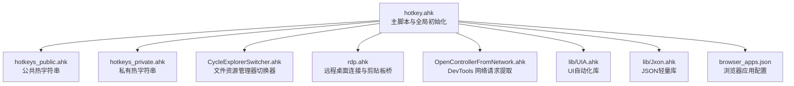
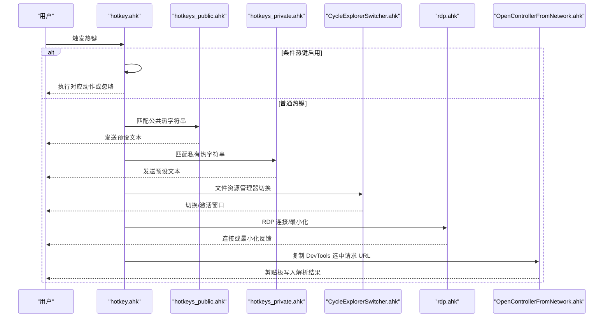
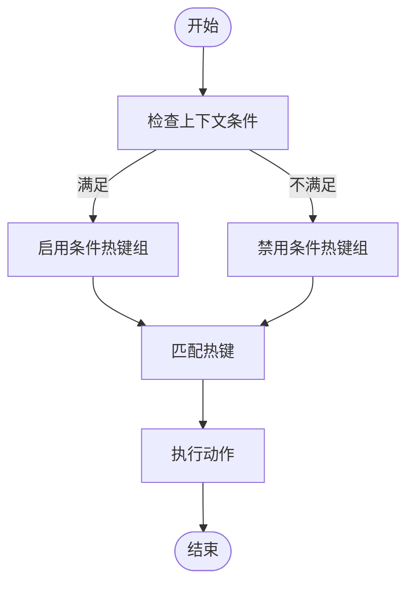
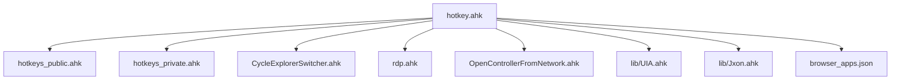

# 热键扩展开发

<cite>
**本文档引用的文件**
- [hotkey.ahk](file://hotkey.ahk)
- [hotkeys_private.ahk](file://hotkeys_private.ahk)
- [hotkeys_public.ahk](file://hotkeys_public.ahk)
- [CycleExplorerSwitcher.ahk](file://CycleExplorerSwitcher.ahk)
- [rdp.ahk](file://rdp.ahk)
- [OpenControllerFromNetwork.ahk](file://OpenControllerFromNetwork.ahk)
- [UIA.ahk](file://lib/UIA.ahk)
- [Jxon.ahk](file://lib/Jxon.ahk)
- [browser_apps.json](file://browser_apps.json)
- [README.md](file://README.md)
</cite>

## 目录
1. [简介](#简介)
2. [项目结构](#项目结构)
3. [核心组件](#核心组件)
4. [架构总览](#架构总览)
5. [详细组件分析](#详细组件分析)
6. [依赖关系分析](#依赖关系分析)
7. [性能考虑](#性能考虑)
8. [故障排除指南](#故障排除指南)
9. [结论](#结论)
10. [附录](#附录)

## 简介
本指南面向希望在现有 AutoHotkey v2 热键系统基础上扩展自定义热键功能的开发者。文档围绕 hotkey.ahk 主脚本及其模块化热键文件（hotkeys_public.ahk、hotkeys_private.ahk、CycleExplorerSwitcher.ahk、rdp.ahk、OpenControllerFromNetwork.ahk）展开，系统讲解热键语法规范、修饰键组合规则、热键优先级管理、冲突避免策略、调试技巧、性能优化与常见问题解决方案。

## 项目结构
该项目采用“主脚本 + 模块化热键 + 工具库”的组织方式：
- 主脚本负责全局初始化、权限与自启任务注册、通用工具函数与热键入口。
- 模块化热键文件分别承担公共热字符串、私有热字符串、应用切换器、RDP 连接与剪贴板桥、网络控制器等功能。
- lib 目录提供 UIA 与 JSON 工具库，支撑复杂 UI 自动化与配置解析。
- browser_apps.json 提供浏览器应用的热键与启动参数配置。

图表来源
- [hotkey.ahk](file://hotkey.ahk)
- [hotkeys_public.ahk](file://hotkeys_public.ahk)
- [hotkeys_private.ahk](file://hotkeys_private.ahk)
- [CycleExplorerSwitcher.ahk](file://CycleExplorerSwitcher.ahk)
- [rdp.ahk](file://rdp.ahk)
- [OpenControllerFromNetwork.ahk](file://OpenControllerFromNetwork.ahk)
- [UIA.ahk](file://lib/UIA.ahk)
- [Jxon.ahk](file://lib/Jxon.ahk)
- [browser_apps.json](file://browser_apps.json)

章节来源
- [hotkey.ahk](file://hotkey.ahk)
- [README.md](file://README.md)

## 核心组件
- 主脚本与全局初始化
  - 强制使用键盘钩子、禁用 CapsLock、包含公共与模块化热键、可选包含私有热键、权限自提升与任务计划注册、跨路径程序启动辅助函数、窗口切换与激活工具函数、输入法智能切换引擎、条件热键与动态热键切换机制。
- 公共热字符串（hotkeys_public.ahk）
  - 定义常用代码片段与 SQL 片段的热字符串，支持即时发送与剪贴板注入。
- 私有热字符串（hotkeys_private.ahk）
  - 定义个人敏感信息与常用文本的热字符串，便于快速输入。
- 文件资源管理器切换器（CycleExplorerSwitcher.ahk）
  - 实现 Win+Alt+E 等热键触发的文件资源管理器窗口轮询切换，支持 Esc 取消、GUI 高亮与自绘。
- 远程桌面连接与剪贴板桥（rdp.ahk）
  - 提供 RDP 快速直连/安全探测、远程最小化请求、剪贴板信号桥接、调试信息展示与窗口根句柄识别。
- 网络控制器（OpenControllerFromNetwork.ahk）
  - 通过 DevTools UIA 定位与菜单项点击，复制选中请求 URL 并解析为 API 路径，支持多种容错路径与性能日志。
- UIA 与 JSON 工具库（lib/UIA.ahk、lib/Jxon.ahk）
  - UIA 提供跨版本接口、元素定位、树遍历、事件处理与屏幕阅读器适配；Jxon 提供 Map/Array 与 JSON 互转。
- 浏览器应用配置（browser_apps.json）
  - 定义浏览器与应用的启动路径、参数、热键与 AUMID，为主脚本构建浏览器缓存提供依据。

章节来源
- [hotkey.ahk](file://hotkey.ahk)
- [hotkeys_public.ahk](file://hotkeys_public.ahk)
- [hotkeys_private.ahk](file://hotkeys_private.ahk)
- [CycleExplorerSwitcher.ahk](file://CycleExplorerSwitcher.ahk)
- [rdp.ahk](file://rdp.ahk)
- [OpenControllerFromNetwork.ahk](file://OpenControllerFromNetwork.ahk)
- [UIA.ahk](file://lib/UIA.ahk)
- [Jxon.ahk](file://lib/Jxon.ahk)
- [browser_apps.json](file://browser_apps.json)

## 架构总览
下图展示了主脚本如何组织与调度各模块热键，以及条件热键与动态热键切换的工作流。

图表来源
- [hotkey.ahk](file://hotkey.ahk)
- [hotkeys_public.ahk](file://hotkeys_public.ahk)
- [hotkeys_private.ahk](file://hotkeys_private.ahk)
- [CycleExplorerSwitcher.ahk](file://CycleExplorerSwitcher.ahk)
- [rdp.ahk](file://rdp.ahk)
- [OpenControllerFromNetwork.ahk](file://OpenControllerFromNetwork.ahk)

## 详细组件分析

### 热键语法规范与修饰键组合
- 修饰键前缀
  - Win: #、Ctrl: ^、Shift: +、Alt: !
  - 例如：#f、^!t、+Esc、!#z
- 盲注修饰符
  - {Blind} 保留先前按下的修饰键组合，避免与当前热键冲突。
- 热键修饰符
  - ~：不阻止默认按键功能（常用于在保留原按键功能的同时附加操作）
  - $：禁用热键的自动重复
  - *：允许热键在按键被按下或释放时触发（常用于组合键）
- 热键体
  - 字母、数字、符号、功能键（F1-F24）、鼠标键（LButton、MButton、RButton、WheelUp、WheelDown、XButton1/2）
  - 特殊键：Enter、Tab、Space、Backspace、Escape、CapsLock、LWin、RWin、LAlt、RAlt、LControl、RControl、AppsKey、ScrollLock、Pause、PrintScreen、Snapshot、Insert、Delete、Home、End、Prior、Next、Up、Down、Left、Right
- 热字符串语法
  - :*: 延迟触发（按下一个字符才判定）
  - :o: 触发后保留光标位置
  - 可与修饰键组合使用

章节来源
- [hotkey.ahk](file://hotkey.ahk)
- [hotkeys_public.ahk](file://hotkeys_public.ahk)
- [hotkeys_private.ahk](file://hotkeys_private.ahk)

### 修饰键组合规则与优先级
- 修饰键顺序与组合
  - 修饰键顺序不影响匹配，但会影响按键行为与默认系统行为。
  - 建议统一使用 #^!+ 前缀风格，保持一致性。
- 优先级与冲突处理
  - 热键匹配遵循“最长前缀优先”与“最后声明者优先”的原则。
  - 若多个热键同时匹配，后者声明的热键生效。
  - 使用条件热键（#HotIf）隔离上下文，避免全局冲突。
- 条件热键与动态热键切换
  - #HotIf 条件热键：在满足条件时启用一组热键，否则忽略。
  - #HotIf 结束：恢复全局热键。
  - 示例：终端环境禁用中键粘贴，非终端环境启用中键粘贴；RDP 环境下最小化请求通过剪贴板桥传递。

图表来源
- [hotkey.ahk](file://hotkey.ahk)
- [CycleExplorerSwitcher.ahk](file://CycleExplorerSwitcher.ahk)
- [rdp.ahk](file://rdp.ahk)

章节来源
- [hotkey.ahk](file://hotkey.ahk)
- [CycleExplorerSwitcher.ahk](file://CycleExplorerSwitcher.ahk)
- [rdp.ahk](file://rdp.ahk)

### 热键开发示例

#### 基本热键
- 目标：Win+F 打开 Microsoft Edge
- 实现要点：使用 Win 修饰键与功能键组合，结合窗口切换函数
- 参考路径
  - [hotkey.ahk](file://hotkey.ahk)

章节来源
- [hotkey.ahk](file://hotkey.ahk)

#### 组合热键
- 目标：Ctrl+Alt+G 复制 DevTools 选中请求 URL
- 实现要点：使用 UIA 定位菜单项，模拟右键与点击，复制 URL 至剪贴板
- 参考路径
  - [OpenControllerFromNetwork.ahk](file://OpenControllerFromNetwork.ahk)
  - [UIA.ahk](file://lib/UIA.ahk)

章节来源
- [OpenControllerFromNetwork.ahk](file://OpenControllerFromNetwork.ahk)
- [UIA.ahk](file://lib/UIA.ahk)

#### 特殊功能热键
- 目标：Win+Alt+E 切换文件资源管理器窗口
- 实现要点：使用 #HotIf 控制开关，配合 GUI 高亮与自绘，支持 Esc 取消
- 参考路径
  - [CycleExplorerSwitcher.ahk](file://CycleExplorerSwitcher.ahk)

章节来源
- [CycleExplorerSwitcher.ahk](file://CycleExplorerSwitcher.ahk)

#### RDP 热键与剪贴板桥
- 目标：Win+Shift+] 在远程桌面环境下最小化本地 mstsc 窗口
- 实现要点：通过剪贴板信号桥接，远程端检测信号并最小化本地窗口
- 参考路径
  - [rdp.ahk](file://rdp.ahk)

章节来源
- [rdp.ahk](file://rdp.ahk)

### 热键冲突避免策略
- 使用条件热键隔离上下文
  - 例如：终端环境禁用中键粘贴，避免与终端复制冲突
- 动态热键切换
  - 通过 #HotIf 与状态变量控制热键启用/禁用
- 修饰键与盲注修饰符
  - 使用 {Blind} 保留修饰键组合，避免与系统默认行为冲突
- 热键优先级
  - 后声明者优先；避免重复定义相同热键
- 窗口类与进程名限定
  - 使用 ahk_class、ahk_exe、ahk_id 精确匹配窗口，减少误触

章节来源
- [hotkey.ahk](file://hotkey.ahk)
- [CycleExplorerSwitcher.ahk](file://CycleExplorerSwitcher.ahk)
- [OpenControllerFromNetwork.ahk](file://OpenControllerFromNetwork.ahk)
- [rdp.ahk](file://rdp.ahk)

### 调试技巧
- 条件热键调试
  - 通过 ToolTip 输出当前上下文状态，验证 #HotIf 是否按预期生效
- 热键动作验证
  - 在热键动作中加入短暂 ToolTip 提示，确认热键是否被触发
- UIA 定位调试
  - 使用 UIA.Viewer 或输出调试信息，确认元素定位与属性
- 性能日志
  - 使用性能日志函数记录关键步骤耗时，定位瓶颈
- 剪贴板桥调试
  - 在远程端与本地端分别输出 ToolTip，确认剪贴板信号传递与回滚

章节来源
- [hotkey.ahk](file://hotkey.ahk)
- [OpenControllerFromNetwork.ahk](file://OpenControllerFromNetwork.ahk)
- [UIA.ahk](file://lib/UIA.ahk)
- [rdp.ahk](file://rdp.ahk)

### 性能优化建议
- 减少 UIA 树扫描范围
  - 优先使用锚点与局部扫描，避免全桌面 Subtree 扫描
- 缓存与记忆化
  - 缓存菜单锚点与窗口句柄，减少重复定位成本
- 异步与定时器
  - 使用 SetTimer 分散 CPU 压力，避免阻塞主线程
- 剪贴板桥优化
  - 信号发送后尽快恢复原剪贴板，避免污染用户复制内容
- 输入法切换
  - 通过状态变量与最小化切换，减少不必要的输入法切换开销

章节来源
- [OpenControllerFromNetwork.ahk](file://OpenControllerFromNetwork.ahk)
- [UIA.ahk](file://lib/UIA.ahk)
- [rdp.ahk](file://rdp.ahk)

### 常见问题解决方案
- 热键无响应
  - 检查是否被条件热键屏蔽；确认修饰键顺序与盲注修饰符使用正确
- 热键冲突
  - 使用 #HotIf 隔离上下文；调整热键声明顺序；避免重复定义
- UIA 定位失败
  - 确认目标应用的 UIA 支持；使用更精确的属性条件；增加重试与兜底路径
- RDP 剪贴板桥异常
  - 确认远程端与本地端会话状态；检查剪贴板信号格式；确保信号发送后及时恢复原剪贴板
- 权限不足
  - 确保脚本以管理员权限运行；检查任务计划注册与自启逻辑

章节来源
- [hotkey.ahk](file://hotkey.ahk)
- [OpenControllerFromNetwork.ahk](file://OpenControllerFromNetwork.ahk)
- [UIA.ahk](file://lib/UIA.ahk)
- [rdp.ahk](file://rdp.ahk)

## 依赖关系分析
- 主脚本依赖
  - lib/UIA.ahk：UIA 自动化能力
  - lib/Jxon.ahk：JSON 解析与序列化
  - hotkeys_public.ahk、hotkeys_private.ahk：热字符串定义
  - CycleExplorerSwitcher.ahk、rdp.ahk、OpenControllerFromNetwork.ahk：功能模块
  - browser_apps.json：浏览器应用配置
- 模块间耦合
  - 条件热键与上下文函数（如 isTerminal、IsExplorerSwitcherActive）贯穿多个模块
  - 剪贴板桥与 RDP 模块存在跨会话通信依赖
  - UIA 作为底层工具被网络控制器与切换器广泛使用

图表来源
- [hotkey.ahk](file://hotkey.ahk)
- [hotkeys_public.ahk](file://hotkeys_public.ahk)
- [hotkeys_private.ahk](file://hotkeys_private.ahk)
- [CycleExplorerSwitcher.ahk](file://CycleExplorerSwitcher.ahk)
- [rdp.ahk](file://rdp.ahk)
- [OpenControllerFromNetwork.ahk](file://OpenControllerFromNetwork.ahk)
- [UIA.ahk](file://lib/UIA.ahk)
- [Jxon.ahk](file://lib/Jxon.ahk)
- [browser_apps.json](file://browser_apps.json)

章节来源
- [hotkey.ahk](file://hotkey.ahk)
- [UIA.ahk](file://lib/UIA.ahk)
- [Jxon.ahk](file://lib/Jxon.ahk)
- [browser_apps.json](file://browser_apps.json)

## 性能考虑
- UIA 定位与扫描
  - 局部扫描优于全树扫描；合理使用锚点与缓存
- 热键响应
  - 避免在热键动作中执行耗时操作；必要时异步化
- 剪贴板操作
  - 信号桥接后尽快恢复原剪贴板，减少对用户复制的干扰
- 条件热键
  - 将昂贵的上下文判断放在 #HotIf 中，减少全局热键数量

## 故障排除指南
- 热键无效
  - 检查是否被条件热键屏蔽；确认修饰键顺序与盲注修饰符
- UIA 定位失败
  - 使用 UIA.Viewer 或输出调试信息；确认元素属性与树结构
- RDP 剪贴板桥异常
  - 检查远程端会话状态；确认信号格式与发送时机
- 权限问题
  - 确保以管理员权限运行；检查任务计划注册与自启

章节来源
- [hotkey.ahk](file://hotkey.ahk)
- [OpenControllerFromNetwork.ahk](file://OpenControllerFromNetwork.ahk)
- [UIA.ahk](file://lib/UIA.ahk)
- [rdp.ahk](file://rdp.ahk)

## 结论
通过模块化设计与条件热键机制，本项目实现了灵活、可扩展的热键体系。开发者可在 hotkeys_private.ahk 中安全地添加自定义热键，在 hotkeys_public.ahk 中共享常用片段，并利用条件热键与动态切换机制避免冲突。配合 UIA 与剪贴板桥等工具库，可实现复杂的自动化与跨会话交互。建议在新增热键时遵循修饰键规范、优先使用条件热键隔离上下文、并通过调试与性能日志持续优化体验。

## 附录
- 热键语法速查
  - 修饰键：#（Win）、^（Ctrl）、+（Shift）、!（Alt）
  - 修饰符：~（不阻止默认）、$（禁用重复）、*（允许按下/释放）
  - 热字符串：:o:（保留光标）、:*:（延迟触发）
- 推荐实践
  - 统一修饰键风格；优先使用条件热键；避免重复定义；在热键动作中加入调试提示；对耗时操作异步化