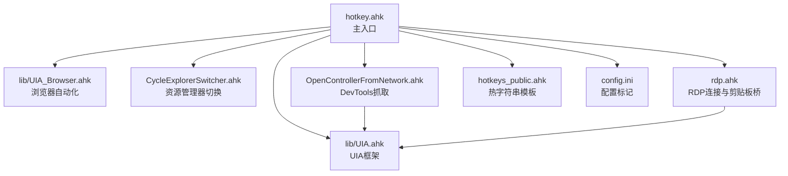
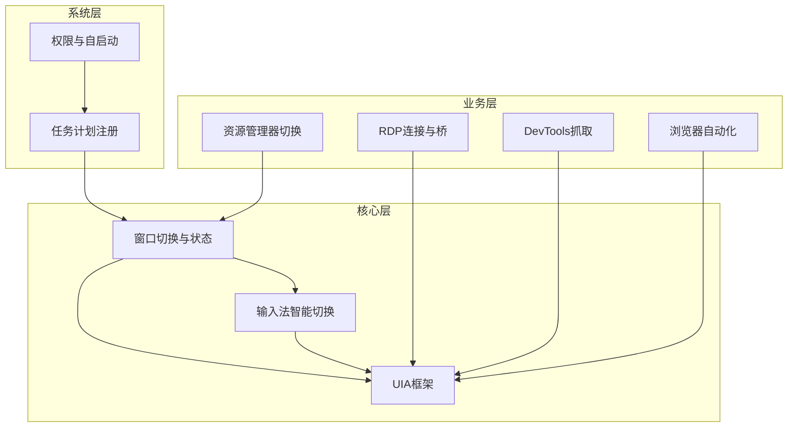
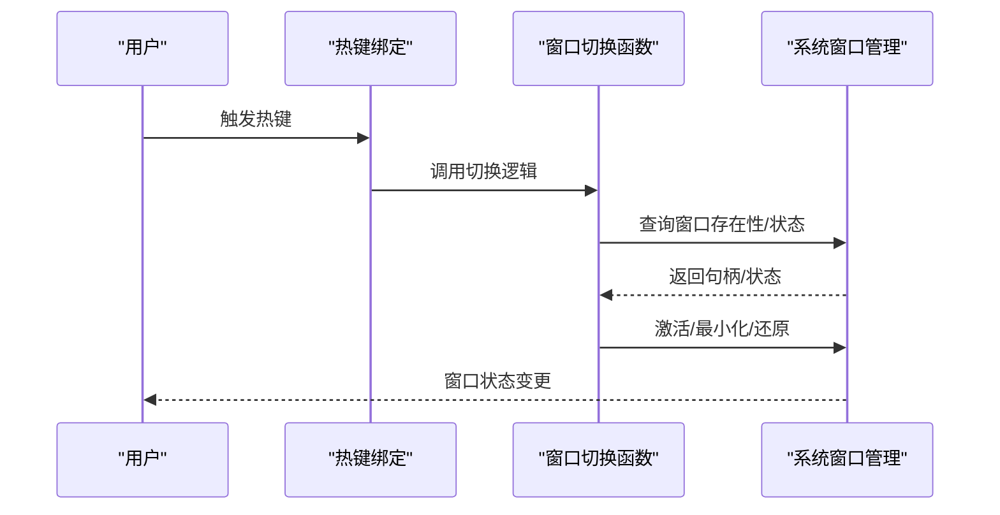
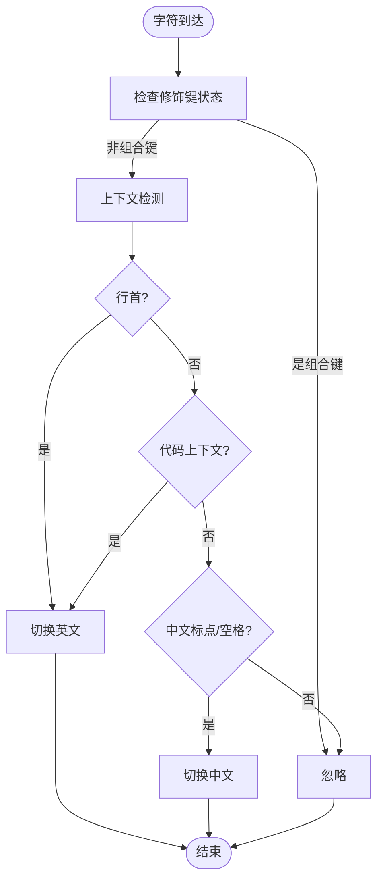
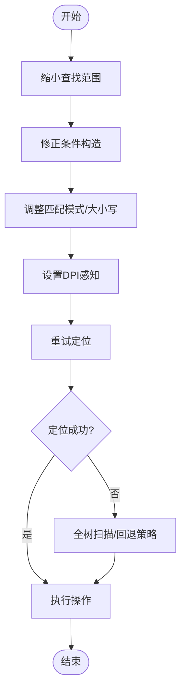
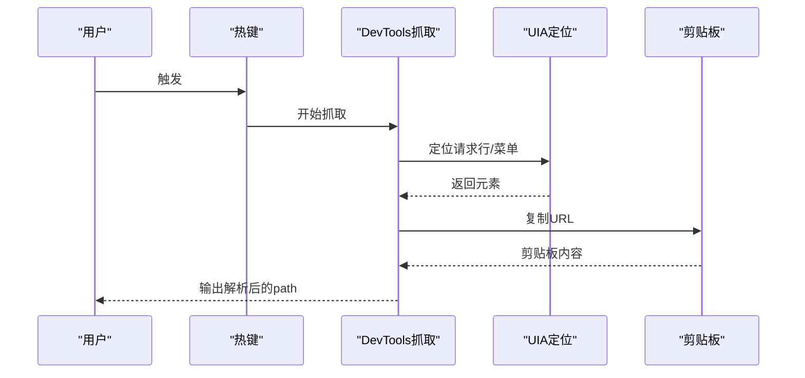
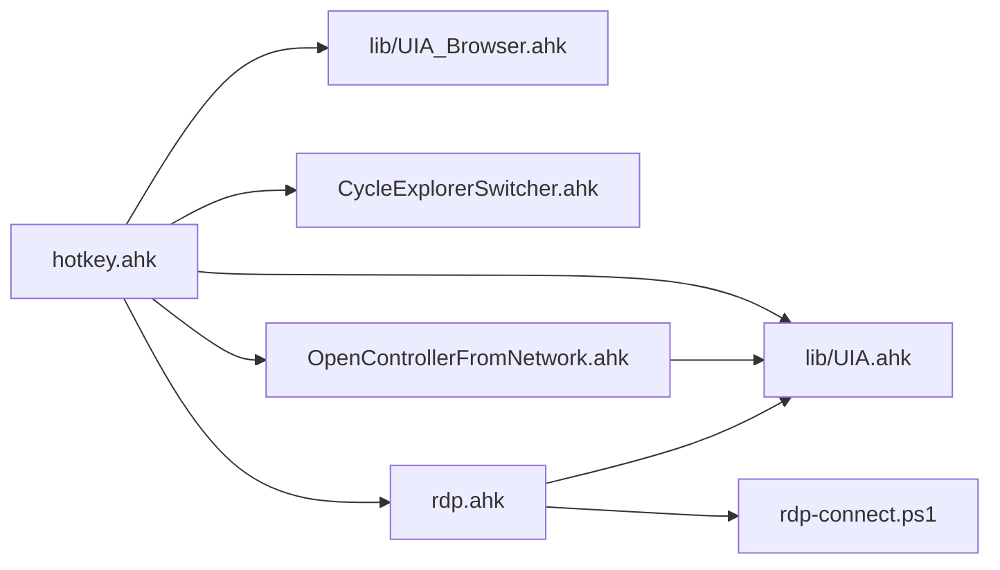

# 调试与故障排除

<cite>
**本文引用的文件**
- [hotkey.ahk](file://hotkey.ahk)
- [UIA.ahk](file://lib/UIA.ahk)
- [UIA_Browser.ahk](file://lib/UIA_Browser.ahk)
- [CycleExplorerSwitcher.ahk](file://CycleExplorerSwitcher.ahk)
- [rdp.ahk](file://rdp.ahk)
- [OpenControllerFromNetwork.ahk](file://OpenControllerFromNetwork.ahk)
- [hotkeys_public.ahk](file://hotkeys_public.ahk)
- [README.md](file://README.md)
- [config.ini](file://config.ini)
- [ahk_devtools_perf.log](file://ahk_devtools_perf.log)
- [rdp.log](file://rdp.log)
- [rdp-connect.ps1](file://rdp-connect.ps1)
</cite>

## 目录
1. [简介](#简介)
2. [项目结构](#项目结构)
3. [核心组件](#核心组件)
4. [架构总览](#架构总览)
5. [详细组件分析](#详细组件分析)
6. [依赖关系分析](#依赖关系分析)
7. [性能考虑](#性能考虑)
8. [故障排除指南](#故障排除指南)
9. [结论](#结论)
10. [附录](#附录)

## 简介
本指南面向使用 hotkey 项目的开发者与高级用户，聚焦于调试与故障排除实践，涵盖以下主题：
- 热键冲突检测与规避
- 窗口状态跟踪与切换
- 输入法切换问题诊断
- UIA 元素定位失败排查
- 常见问题处理：权限、启动失败、输入法异常、UIA 失效
- 性能优化：内存、事件处理、UIA 操作效率
- 日志记录与错误诊断工具使用

## 项目结构
hotkey 项目采用模块化组织，核心入口脚本加载多个功能模块与库文件，形成统一的热键与窗口控制体系。关键文件与职责如下：
- hotkey.ahk：主入口，权限自举、任务计划注册、窗口切换、输入法引擎、热键绑定
- lib/UIA.ahk：UIA 自动化框架封装，提供元素查找、属性访问、事件处理等能力
- lib/UIA_Browser.ahk：浏览器自动化增强，针对 Chrome/Edge/Firefox 的导航、标签页、地址栏、菜单等
- CycleExplorerSwitcher.ahk：文件资源管理器多窗口循环切换与可视化高亮
- rdp.ahk：远程桌面连接与剪贴板桥接，含最小化请求、调试信息输出
- OpenControllerFromNetwork.ahk：DevTools 网络面板请求 URL 抓取与 UIA 菜单定位
- hotkeys_public.ahk：公共热字符串模板，辅助开发与运维常用片段
- 日志文件：ahk_devtools_perf.log、rdp.log 等，记录性能与连接过程

图示来源
- [hotkey.ahk](file://hotkey.ahk)
- [UIA.ahk](file://lib/UIA.ahk)
- [UIA_Browser.ahk](file://lib/UIA_Browser.ahk)
- [CycleExplorerSwitcher.ahk](file://CycleExplorerSwitcher.ahk)
- [rdp.ahk](file://rdp.ahk)
- [OpenControllerFromNetwork.ahk](file://OpenControllerFromNetwork.ahk)
- [hotkeys_public.ahk](file://hotkeys_public.ahk)
- [config.ini](file://config.ini)

章节来源
- [README.md](file://README.md)
- [hotkey.ahk](file://hotkey.ahk)

## 核心组件
- 权限与自启动：主脚本在启动时检测管理员权限，必要时提权并注册登录自启动任务，确保 UIA 与窗口操作可用
- 窗口切换与状态管理：提供通用切换函数，支持按进程名、标题、路径启动与激活，同时处理最小化/还原/激活
- 输入法智能切换：基于 InputHook 的字符级监听，结合上下文判断（行首、代码上下文、标点）自动切换中/英文输入法
- UIA 自动化：封装 UIA 查询、条件构造、元素定位、点击/输入、文本读取等，支持浏览器自动化扩展
- 浏览器自动化：针对 Chrome/Edge/Firefox 的导航、标签页、地址栏、菜单项的定位与交互
- RDP 连接与桥接：通过 PowerShell 脚本安全探测端口与解析主机，支持本地最小化请求与剪贴板桥
- DevTools 抓取：通过 UIA 定位网络面板请求行，优先右键菜单复制 URL，失败时回退 Ctrl+C 或全树扫描

章节来源
- [hotkey.ahk](file://hotkey.ahk)
- [UIA.ahk](file://lib/UIA.ahk)
- [UIA_Browser.ahk](file://lib/UIA_Browser.ahk)
- [CycleExplorerSwitcher.ahk](file://CycleExplorerSwitcher.ahk)
- [rdp.ahk](file://rdp.ahk)
- [OpenControllerFromNetwork.ahk](file://OpenControllerFromNetwork.ahk)

## 架构总览
hotkey 的运行时架构围绕“主入口 + 库 + 功能模块”的模式展开。主入口负责系统级能力（权限、任务计划、窗口状态），功能模块负责具体业务（输入法、RDP、DevTools、浏览器）。UIA 作为底层自动化基础设施被广泛复用。

图示来源
- [hotkey.ahk](file://hotkey.ahk)
- [UIA.ahk](file://lib/UIA.ahk)
- [UIA_Browser.ahk](file://lib/UIA_Browser.ahk)
- [CycleExplorerSwitcher.ahk](file://CycleExplorerSwitcher.ahk)
- [rdp.ahk](file://rdp.ahk)
- [OpenControllerFromNetwork.ahk](file://OpenControllerFromNetwork.ahk)

## 详细组件分析

### 热键冲突检测与规避
- 现象：热键无响应或触发其他程序快捷键
- 排查要点：
  - 检查主脚本与模块中是否存在重复热键定义
  - 使用“热键冲突”思路：优先使用组合键（Win/Ctrl/Alt/Shift），避免与系统或应用默认冲突
  - 在模块中使用条件热键（#HotIf）限定作用域，减少全局干扰
- 实战建议：
  - 将常用热键集中在主脚本中集中管理，模块内通过函数调用替代直接热键绑定
  - 对于浏览器/DevTools/资源管理器等特定场景，使用 #HotIf 限定热键生效范围

章节来源
- [hotkey.ahk](file://hotkey.ahk)
- [CycleExplorerSwitcher.ahk](file://CycleExplorerSwitcher.ahk)
- [OpenControllerFromNetwork.ahk](file://OpenControllerFromNetwork.ahk)

### 窗口状态跟踪与切换
- 关键函数：窗口存在性判断、激活/最小化、主窗口定位、进程 PID 获取
- 常见问题：
  - 窗口不可见或最小化导致激活失败
  - 多实例窗口标题相同，误判目标
- 诊断步骤：
  - 使用窗口枚举与标题/类名/样式过滤，确认目标句柄
  - 对最小化窗口先恢复再激活，必要时发送 Alt 激活
  - 对多实例场景，结合唯一标识（如 PID、主窗口句柄）精准定位

图示来源
- [hotkey.ahk](file://hotkey.ahk)

章节来源
- [hotkey.ahk](file://hotkey.ahk)

### 输入法切换问题诊断
- 核心机制：InputHook 监听字符事件，结合上下文（行首、代码上下文、标点）决定中/英
- 常见问题：
  - 组合键（Ctrl/Alt/Win）误触发
  - 输入法状态未正确切换（拼音组合态未就绪）
  - 特定应用（如终端、IDE）对 Shift 切换敏感
- 诊断与修复：
  - 检查修饰键状态，跳过组合键
  - 切换前确保拼音组合态就绪（发送占位字符并回删）
  - 针对特殊应用，增加应用白名单/黑名单策略

图示来源
- [hotkey.ahk](file://hotkey.ahk)

章节来源
- [hotkey.ahk](file://hotkey.ahk)

### UIA 元素定位失败排查
- 常见原因：
  - 元素不可见或延迟生成（Teams/浏览器等）
  - 条件构造不准确（匹配模式、大小写、属性类型）
  - 屏幕缩放/DPI 导致坐标偏差
- 排查步骤：
  - 使用 UIA Viewer（库内置）或系统工具验证元素树
  - 缩小查找范围（父节点/兄弟节点），避免全树扫描
  - 调整匹配模式（Exact/SubString/RegEx），必要时启用缓存
  - 设置 DPI 一致性（DPIAwareness）

图示来源
- [UIA.ahk](file://lib/UIA.ahk)

章节来源
- [UIA.ahk](file://lib/UIA.ahk)

### 浏览器自动化（UIA_Browser）
- 能力概览：地址栏、导航按钮、标签页、文档区域、JS 注入与元素点击
- 常见问题：
  - 地址栏元素不稳定（不同版本差异）
  - 标签页定位困难（名称匹配、可见性）
  - JS 执行结果读取（剪贴板/标题）
- 诊断与优化：
  - 优先使用稳定的 TreeWalker/条件组合，避免硬编码路径
  - 对慢响应页面，增加等待与重试
  - 使用浏览器特定类（UIA_Chrome/UIA_Edge/UIA_Mozilla）以获得更佳适配

章节来源
- [UIA_Browser.ahk](file://lib/UIA_Browser.ahk)

### DevTools 抓取（OpenControllerFromNetwork）
- 流程：右键菜单复制 URL → 剪贴板校验 → 失败回退到 Ctrl+C 或全树扫描
- 性能日志：ahk_devtools_perf.log 记录各阶段耗时，便于定位瓶颈
- 优化建议：
  - 优先命中缓存锚点，减少全树扫描
  - 自适应重试与等待，避免卡顿
  - 对连续失败进入“跳过模式”，稳定优先

图示来源
- [OpenControllerFromNetwork.ahk](file://OpenControllerFromNetwork.ahk)
- [ahk_devtools_perf.log](file://ahk_devtools_perf.log)

章节来源
- [OpenControllerFromNetwork.ahk](file://OpenControllerFromNetwork.ahk)
- [ahk_devtools_perf.log](file://ahk_devtools_perf.log)

### RDP 连接与桥接（rdp.ahk + rdp-connect.ps1）
- 能力概览：安全探测（DNS/端口）→ 连接 → 剪贴板桥（最小化请求）
- 常见问题：
  - 3389 端口不可达或被防火墙阻断
  - 本地/远程会话识别错误
  - 剪贴板桥信号污染
- 诊断与修复：
  - 使用 rdp.log 观察失败原因（端口关闭/解析失败）
  - rdp-connect.ps1 提供快速探测与回退策略
  - 剪贴板桥使用唯一信号，完成后尽快恢复

章节来源
- [rdp.ahk](file://rdp.ahk)
- [rdp-connect.ps1](file://rdp-connect.ps1)
- [rdp.log](file://rdp.log)

## 依赖关系分析
- 主入口依赖 UIA 框架与浏览器扩展，用于窗口与自动化操作
- 资源管理器切换依赖系统窗口 API 与 GUI 控件
- RDP 模块依赖 PowerShell 脚本与系统网络能力
- DevTools 抓取依赖 UIA 与浏览器元素树

图示来源
- [hotkey.ahk](file://hotkey.ahk)
- [UIA.ahk](file://lib/UIA.ahk)
- [UIA_Browser.ahk](file://lib/UIA_Browser.ahk)
- [CycleExplorerSwitcher.ahk](file://CycleExplorerSwitcher.ahk)
- [rdp.ahk](file://rdp.ahk)
- [OpenControllerFromNetwork.ahk](file://OpenControllerFromNetwork.ahk)
- [rdp-connect.ps1](file://rdp-connect.ps1)

章节来源
- [hotkey.ahk](file://hotkey.ahk)

## 性能考虑
- 内存使用优化
  - 避免在循环中频繁创建大对象，复用 UIA 条件与 TreeWalker
  - 及时释放句柄与字体资源（如自绘 GUI）
- 事件处理性能提升
  - 使用 #HotIf 限定热键作用域，减少全局监听开销
  - 对高频操作（如输入法切换）采用轻量状态缓存
- UIA 操作效率改进
  - 优先局部扫描（锚点/父节点/兄弟节点），避免全树扫描
  - 合理设置等待与重试参数，避免过度轮询
  - 对慢响应页面增加“可靠兜底”流程，兼顾稳定性

章节来源
- [OpenControllerFromNetwork.ahk](file://OpenControllerFromNetwork.ahk)
- [CycleExplorerSwitcher.ahk](file://CycleExplorerSwitcher.ahk)

## 故障排除指南

### 权限相关问题
- 现象：UIA 失效、窗口操作失败、任务计划注册失败
- 处理：
  - 确认以管理员权限运行
  - 首次运行会尝试注册登录自启动任务，失败时弹窗提示
  - 若失败，手动以管理员身份执行注册命令或检查系统策略

章节来源
- [hotkey.ahk](file://hotkey.ahk)
- [config.ini](file://config.ini)

### 应用程序启动失败
- 现象：热键无法打开目标程序
- 排查：
  - 检查路径是否存在（支持主/副盘符互换）
  - 若为协议路径（如 ms-phone:），直接运行协议
  - 启动失败时弹出错误消息，记录失败路径

章节来源
- [hotkey.ahk](file://hotkey.ahk)

### 输入法切换异常
- 现象：切换不生效、拼音态未就绪、组合键误触发
- 处理：
  - 跳过组合键（Ctrl/Alt/Win）
  - 切换前发送占位字符并回删，确保拼音组合态
  - 针对特定应用增加白名单/黑名单

章节来源
- [hotkey.ahk](file://hotkey.ahk)

### UIA 自动化失效
- 现象：元素定位失败、点击无效、属性读取为空
- 处理：
  - 使用 UIA Viewer 验证元素树
  - 缩小查找范围，修正条件与匹配模式
  - 设置 DPI 感知，避免坐标偏差
  - 对延迟生成元素（如 Teams）增加等待或触发生成

章节来源
- [UIA.ahk](file://lib/UIA.ahk)

### 浏览器自动化异常
- 现象：地址栏/导航按钮定位失败、标签页切换异常
- 处理：
  - 使用浏览器特定类（UIA_Chrome/UIA_Edge/UIA_Mozilla）
  - 优先 TreeWalker/条件组合，避免硬编码
  - 页面加载慢时增加等待与重试

章节来源
- [UIA_Browser.ahk](file://lib/UIA_Browser.ahk)

### DevTools 抓取失败
- 现象：无法复制 URL、超时、返回空
- 处理：
  - 查看 ahk_devtools_perf.log，定位耗时阶段
  - 优先右键菜单复制，失败回退 Ctrl+C 或全树扫描
  - 对连续失败进入“跳过模式”，稳定优先

章节来源
- [OpenControllerFromNetwork.ahk](file://OpenControllerFromNetwork.ahk)
- [ahk_devtools_perf.log](file://ahk_devtools_perf.log)

### RDP 连接失败
- 现象：端口 3389 不可达、解析失败
- 处理：
  - 查看 rdp.log，确认失败原因
  - 使用 rdp-connect.ps1 的安全探测（DNS/端口/ARP/MAC）
  - 短主机名解析：尝试 DNS 后缀、本地子网探测、回退常见前缀

章节来源
- [rdp.ahk](file://rdp.ahk)
- [rdp-connect.ps1](file://rdp-connect.ps1)
- [rdp.log](file://rdp.log)

### 日志记录与错误诊断工具
- DevTools 性能日志：ahk_devtools_perf.log 记录各阶段耗时，便于定位瓶颈
- RDP 连接日志：rdp.log 记录探测与失败信息
- UIA 错误：主脚本捕获异常并弹窗提示，便于快速定位
- 剪贴板桥：RDP 模块通过 OnClipboardChange 监听信号，避免污染

章节来源
- [OpenControllerFromNetwork.ahk](file://OpenControllerFromNetwork.ahk)
- [ahk_devtools_perf.log](file://ahk_devtools_perf.log)
- [rdp.ahk](file://rdp.ahk)
- [rdp.log](file://rdp.log)

## 结论
hotkey 项目通过模块化设计与 UIA 自动化，提供了强大的窗口控制、输入法智能切换、浏览器与 DevTools 自动化以及 RDP 连接能力。调试与故障排除的关键在于：
- 明确模块边界与依赖关系
- 使用日志与性能分析工具定位瓶颈
- 针对不同场景（UIA、浏览器、RDP）采用差异化策略
- 在权限、路径、输入法、DPI 等系统层面做好兼容与容错

## 附录
- 热字符串模板：位于 hotkeys_public.ahk，便于快速插入常用 SQL/命令片段
- 配置标记：config.ini 记录任务计划创建状态，避免重复注册

章节来源
- [hotkeys_public.ahk](file://hotkeys_public.ahk)
- [config.ini](file://config.ini)