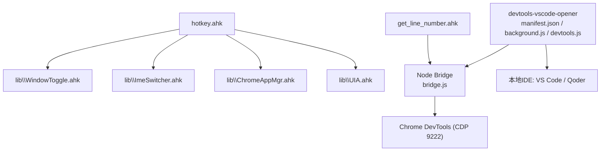
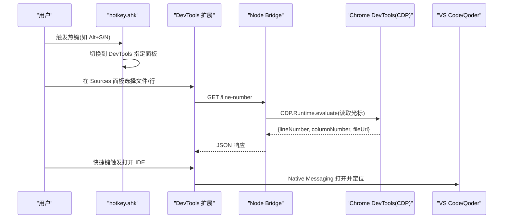
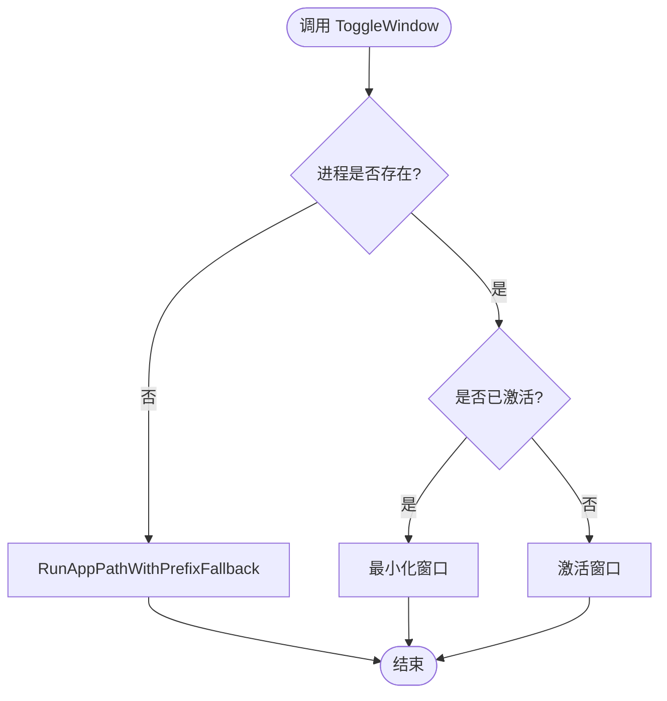
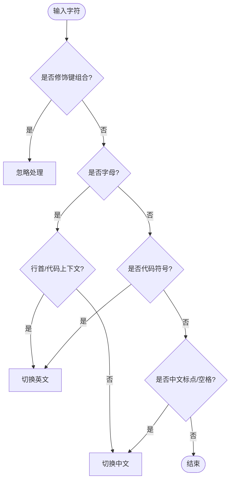
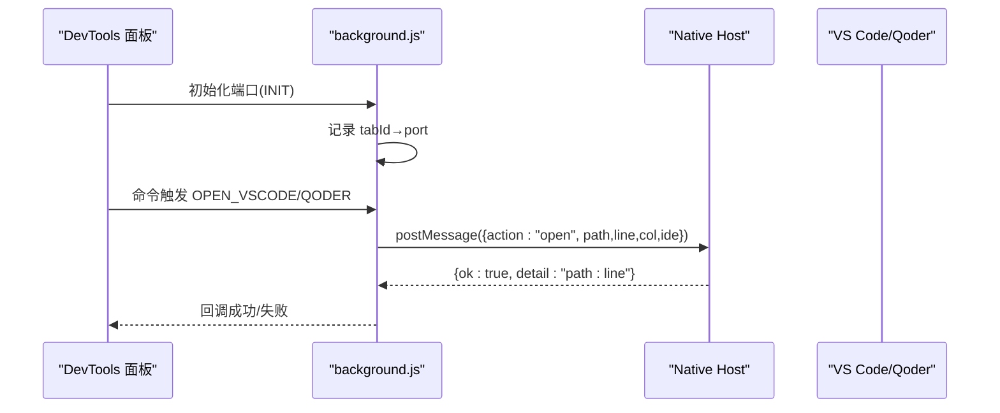
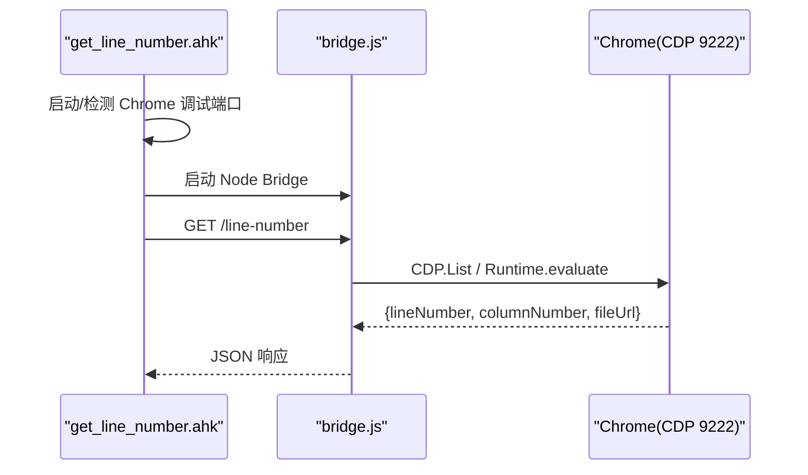
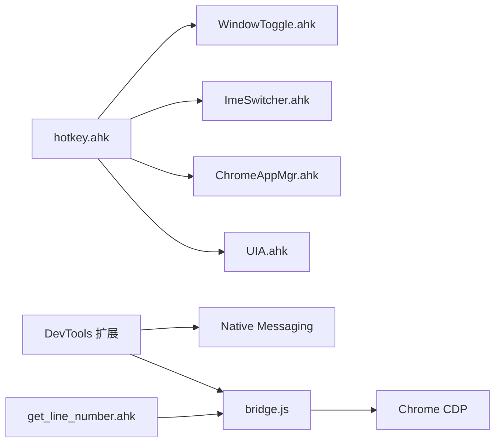

# 调试与诊断工具集

<cite>
**本文引用的文件**
- [README.md](file://README.md)
- [hotkey.ahk](file://hotkey.ahk)
- [superFlow.ahk](file://superFlow.ahk)
- [lib\WindowToggle.ahk](file://lib/WindowToggle.ahk)
- [lib\ImeSwitcher.ahk](file://lib/ImeSwitcher.ahk)
- [lib\ChromeAppMgr.ahk](file://lib/ChromeAppMgr.ahk)
- [lib\UIA.ahk](file://lib/UIA.ahk)
- [devtools-vscode-opener\manifest.json](file://devtools-vscode-opener/manifest.json)
- [devtools-vscode-opener\background.js](file://devtools-vscode-opener/background.js)
- [devtools-vscode-opener\devtools.js](file://devtools-vscode-opener/devtools.js)
- [get-source-panel-line-number\bridge.js](file://get-source-panel-line-number/bridge.js)
- [get-source-panel-line-number\get_line_number.ahk](file://get-source-panel-line-number/get_line_number.ahk)
- [apps\run_ChatGPT.ps1](file://apps/run_ChatGPT.ps1)
</cite>

## 目录
1. [简介](#简介)
2. [项目结构](#项目结构)
3. [核心组件](#核心组件)
4. [架构总览](#架构总览)
5. [详细组件分析](#详细组件分析)
6. [依赖关系分析](#依赖关系分析)
7. [性能考量](#性能考量)
8. [故障排查指南](#故障排查指南)
9. [结论](#结论)
10. [附录](#附录)

## 简介
本仓库是一个基于 AutoHotkey v2 的“调试与诊断工具集”，提供以下能力：
- 全局热键与窗口切换、应用启动（含协议路径）与任务计划自注册
- 智能输入法切换与字符转换，提升编码与文档输入效率
- Chrome DevTools 与 VS Code/Qoder 联动：从浏览器 Sources 面板一键打开到编辑器并定位行列
- 通过 Node Bridge + CDP 获取当前 Sources 面板光标位置，支持缓存与自动重启
- PWA/Chrome App 管理与生成，便于将 Web 应用以独立窗口运行

## 项目结构
- 根脚本 hotkey.ahk 作为主入口，统一加载公共模块、定义热键与系统级逻辑
- lib 目录封装可复用能力：窗口切换、输入法切换、Chrome 应用管理、UIA 自动化
- devtools-vscode-opener 为 Chrome 扩展，桥接 DevTools 与本地 IDE（VS Code/Qoder）
- get-source-panel-line-number 提供 Node Bridge 与 AHK 客户端，用于读取 DevTools Sources 光标信息
- apps 目录存放生成的 PWA/Chrome App 快捷方式脚本

**图示来源**
- [hotkey.ahk:1-30](file://hotkey.ahk#L1-L30)
- [devtools-vscode-opener\manifest.json:1-32](file://devtools-vscode-opener/manifest.json#L1-L32)
- [devtools-vscode-opener\background.js:1-95](file://devtools-vscode-opener/background.js#L1-L95)
- [devtools-vscode-opener\devtools.js:1-151](file://devtools-vscode-opener/devtools.js#L1-L151)
- [get-source-panel-line-number\bridge.js:1-142](file://get-source-panel-line-number/bridge.js#L1-L142)
- [get-source-panel-line-number\get_line_number.ahk:1-159](file://get-source-panel-line-number/get_line_number.ahk#L1-L159)

**章节来源**
- [README.md:1-2](file://README.md#L1-L2)
- [hotkey.ahk:1-30](file://hotkey.ahk#L1-L30)

## 核心组件
- 窗口与应用管理
  - 统一按进程名或标题切换窗口；支持协议路径启动与路径前缀回退（C/D盘互换）
  - 临时屏蔽 Win+P 避免显示器切换干扰
- 输入法智能切换
  - 根据上下文（代码/自然语言/行首/标点）自动切换中英文，不影响修饰键组合
  - 提供中文标点转英文、拼音转中文等便捷转换
- DevTools ↔ IDE 联动
  - Chrome 扩展监听 DevTools 面板事件，通过 Native Messaging 调用本地 IDE
  - Node Bridge 使用 CDP 读取 Sources 面板当前文件与行列，提供 HTTP 接口供前端查询
  - AHK 客户端负责启动 Chrome 调试实例与 Bridge 服务，并提供状态诊断热键
- PWA/Chrome App 管理
  - 读取配置生成 .lnk 与 .ps1，写入 AUMID，便于独立窗口与任务栏固定

**章节来源**
- [lib\WindowToggle.ahk:17-131](file://lib/WindowToggle.ahk#L17-L131)
- [lib\ImeSwitcher.ahk:19-200](file://lib/ImeSwitcher.ahk#L19-L200)
- [devtools-vscode-opener\background.js:1-95](file://devtools-vscode-opener/background.js#L1-L95)
- [devtools-vscode-opener\devtools.js:1-151](file://devtools-vscode-opener/devtools.js#L1-L151)
- [get-source-panel-line-number\bridge.js:1-142](file://get-source-panel-line-number/bridge.js#L1-L142)
- [get-source-panel-line-number\get_line_number.ahk:15-159](file://get-source-panel-line-number/get_line_number.ahk#L15-L159)
- [lib\ChromeAppMgr.ahk:24-200](file://lib/ChromeAppMgr.ahk#L24-L200)

## 架构总览
整体由三层构成：
- 交互层：AHK 主脚本与扩展命令，承载热键、窗口切换、输入法切换、PWA 管理等
- 数据层：Node Bridge 通过 CDP 访问 DevTools，暴露 HTTP API 提供光标位置
- 集成层：Chrome 扩展通过 Native Messaging 与本地 IDE 通信，完成“打开并定位”

**图示来源**
- [hotkey.ahk:432-449](file://hotkey.ahk#L432-L449)
- [devtools-vscode-opener\devtools.js:57-126](file://devtools-vscode-opener/devtools.js#L57-L126)
- [get-source-panel-line-number\bridge.js:14-65](file://get-source-panel-line-number/bridge.js#L14-L65)
- [devtools-vscode-opener\background.js:6-38](file://devtools-vscode-opener/background.js#L6-L38)

## 详细组件分析

### 窗口切换与应用启动框架
- 功能要点
  - 按进程名或标题切换窗口，不存在则启动应用
  - 支持协议路径（如 ms-phone:）直接运行
  - 路径前缀互换（ProgramsCommon ↔ Programs），提高跨环境兼容性
  - 临时屏蔽 Win+P，避免切换显示器时误触
- 关键流程
  - ToggleWindow/ToggleWindowByTitle：存在→激活/最小化；不存在→RunAppPathWithPrefixFallback
  - RunAppPathWithPrefixFallback：优先尝试原始路径，失败则尝试互换前缀路径，均失败提示错误

**图示来源**
- [lib\WindowToggle.ahk:80-131](file://lib/WindowToggle.ahk#L80-L131)

**章节来源**
- [lib\WindowToggle.ahk:17-131](file://lib/WindowToggle.ahk#L17-L131)

### 智能输入法切换引擎
- 策略
  - 行首字母 → 英文（函数/变量命名）
  - 光标前为代码上下文 → 英文
  - 输入代码符号 → 强制英文
  - 中文标点/空格 → 中文
  - 忽略 Ctrl/Alt/Win 组合键
- 辅助
  - GetLeftText：复制光标前内容（终端与普通窗口分别处理）
  - EnsurePinyinReady：确保 IME 进入拼音组合态
  - ConvertCharacter：中文标点↔英文标点、拼音→中文

**图示来源**
- [lib\ImeSwitcher.ahk:77-110](file://lib/ImeSwitcher.ahk#L77-L110)
- [lib\ImeSwitcher.ahk:114-152](file://lib/ImeSwitcher.ahk#L114-L152)
- [lib\ImeSwitcher.ahk:155-200](file://lib/ImeSwitcher.ahk#L155-L200)

**章节来源**
- [lib\ImeSwitcher.ahk:19-200](file://lib/ImeSwitcher.ahk#L19-L200)

### DevTools 与 IDE 联动（Chrome 扩展 + Native Messaging）
- 扩展职责
  - 维护 DevTools 端口映射，接收 INIT/KEEPALIVE
  - 监听命令（Alt+Shift+O/Q）转发 TRIGGER_OPEN
  - 通过 Native Messaging 向本地宿主发送 open 指令（含路径、行列、目标 IDE）
- 本地宿主职责
  - 接收消息，调用 IDE 打开文件并定位行列
  - 超时与断连处理，返回结果给扩展

**图示来源**
- [devtools-vscode-opener\background.js:1-95](file://devtools-vscode-opener/background.js#L1-L95)
- [devtools-vscode-opener\manifest.json:1-32](file://devtools-vscode-opener/manifest.json#L1-L32)

**章节来源**
- [devtools-vscode-opener\background.js:1-95](file://devtools-vscode-opener/background.js#L1-L95)
- [devtools-vscode-opener\manifest.json:1-32](file://devtools-vscode-opener/manifest.json#L1-L32)

### 获取 Sources 面板光标位置（Node Bridge + CDP）
- 流程
  - AHK 客户端检测/启动 Chrome 调试实例（9222）
  - 启动 Node Bridge（3000），Bridge 通过 CDP 连接 DevTools
  - 前端请求 /line-number，Bridge 执行 Runtime.evaluate 读取 sourcesView 内部状态
  - 连续失败超过阈值自动重启 Bridge，期间返回缓存结果
- 关键点
  - 兼容多种 sourcesView 内部字段名称
  - 健康检查与端口占用检测，避免重复启动
  - 超时与重试机制保证鲁棒性

**图示来源**
- [get-source-panel-line-number\get_line_number.ahk:15-97](file://get-source-panel-line-number/get_line_number.ahk#L15-L97)
- [get-source-panel-line-number\bridge.js:14-114](file://get-source-panel-line-number/bridge.js#L14-L114)

**章节来源**
- [get-source-panel-line-number\get_line_number.ahk:15-159](file://get-source-panel-line-number/get_line_number.ahk#L15-L159)
- [get-source-panel-line-number\bridge.js:1-142](file://get-source-panel-line-number/bridge.js#L1-L142)

### PWA/Chrome App 管理
- 功能
  - 读取 browser_apps.json，生成 .ps1/.lnk，写入 AUMID
  - GUI 列表展示，支持生成与删除选中项
  - 构建 Chrome 启动参数（profile-directory、app、通用参数）
- 输出
  - 生成独立窗口快捷方式，便于任务栏固定与窗口管理

**章节来源**
- [lib\ChromeAppMgr.ahk:24-200](file://lib/ChromeAppMgr.ahk#L24-L200)
- [apps\run_ChatGPT.ps1:1-18](file://apps/run_ChatGPT.ps1#L1-L18)

### UIA 自动化基础
- 作用
  - 提供 UI Automation 封装，用于定位与控制桌面控件（如有道词典输入框）
  - 支持元素查找、值设置、点击等操作
- 在本项目中的使用
  - 通过 UIA 直接设置有道词典输入框值并回车，避免剪贴板与焦点竞态问题

**章节来源**
- [lib\UIA.ahk:1-200](file://lib/UIA.ahk#L1-L200)
- [hotkey.ahk:112-133](file://hotkey.ahk#L112-L133)

## 依赖关系分析
- 主脚本 hotkey.ahk 依赖 lib 下的多个模块，实现解耦与复用
- DevTools 联动链：扩展 → Native Messaging → 本地 IDE；同时通过 Node Bridge 与 CDP 获取光标信息
- 输入法切换依赖 AHK 的 InputHook 与剪贴板操作，区分终端与普通窗口
- PWA 管理依赖 PowerShell 创建快捷方式与写入 AUMID

**图示来源**
- [hotkey.ahk:1-30](file://hotkey.ahk#L1-L30)
- [devtools-vscode-opener\background.js:1-95](file://devtools-vscode-opener/background.js#L1-L95)
- [get-source-panel-line-number\bridge.js:1-142](file://get-source-panel-line-number/bridge.js#L1-L142)
- [get-source-panel-line-number\get_line_number.ahk:1-159](file://get-source-panel-line-number/get_line_number.ahk#L1-L159)

**章节来源**
- [hotkey.ahk:1-30](file://hotkey.ahk#L1-L30)
- [devtools-vscode-opener\background.js:1-95](file://devtools-vscode-opener/background.js#L1-L95)
- [get-source-panel-line-number\bridge.js:1-142](file://get-source-panel-line-number/bridge.js#L1-L142)
- [get-source-panel-line-number\get_line_number.ahk:1-159](file://get-source-panel-line-number/get_line_number.ahk#L1-L159)

## 性能考量
- 热键与 SendInput
  - 使用 SendInput 替代 SendEvent，减少按键交错与延迟
  - KeyWait 等待修饰键释放，避免残留修饰键污染后续输入
- 剪贴板与焦点
  - 对易变控件（如 Chrome_WidgetWin_01）加入重试循环，降低竞态失败率
  - 终端与普通窗口采用不同复制策略，提升稳定性
- CDP 与 Bridge
  - 连续失败自动重启 Bridge，期间返回缓存结果，保障可用性
  - 端口占用检测与健康检查，避免重复启动与服务不可用
- 窗口切换
  - 过滤可见且有标题的主窗口，排除后台隐藏窗口，减少误判

[本节为通用指导，不直接分析具体文件]

## 故障排查指南
- 无法打开 DevTools 面板
  - 确认已安装并启用 DevTools 扩展
  - 检查浏览器中是否处于 Sources 面板
- 无法定位到 IDE
  - 检查 Native Messaging 是否可用（扩展日志）
  - 确认目标 IDE 已安装且可通过命令行打开
- 无法获取 Sources 光标
  - 确认 Chrome 以调试模式运行（9222 端口）
  - 确认 Node Bridge 在线（3000 端口）
  - 使用 ^F12 查看系统链路状态报告
- 输入法切换异常
  - 确认未按住修饰键（Ctrl/Alt/Win）
  - 检查终端与普通窗口的复制行为差异

**章节来源**
- [get-source-panel-line-number\get_line_number.ahk:131-159](file://get-source-panel-line-number/get_line_number.ahk#L131-L159)
- [devtools-vscode-opener\background.js:6-38](file://devtools-vscode-opener/background.js#L6-L38)
- [get-source-panel-line-number\bridge.js:69-114](file://get-source-panel-line-number/bridge.js#L69-L114)

## 结论
本工具集以 AHK 为核心，结合 Chrome 扩展、Node Bridge 与 CDP，构建了从“全局热键→DevTools→IDE”的完整调试工作流。通过模块化设计（窗口切换、输入法切换、PWA 管理、UIA 自动化），既提升了日常开发效率，又保证了系统的可扩展性与可维护性。建议在生产环境中：
- 固定 Chrome 调试端口与 Bridge 端口，避免冲突
- 定期更新扩展与 Bridge，适配 DevTools 内部结构变化
- 结合团队规范，统一热键与快捷键映射，减少学习成本

[本节为总结性内容，不直接分析具体文件]

## 附录
- 常用热键参考（示例）
  - Alt+S/N：切换 DevTools 面板（Source/Network）
  - Alt+Shift+O/Q：在 VS Code/Qoder 中打开当前文件
  - ^!l：获取 Sources 面板行列号（AHK 客户端）
  - ^F12：系统链路诊断报告
- 配置文件
  - browser_apps.json：PWA/Chrome App 配置
  - config.ini：任务计划注册标记

[本节为补充说明，不直接分析具体文件]