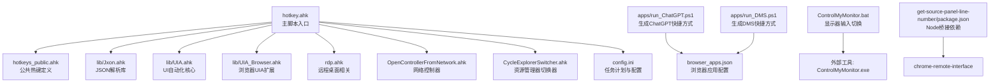
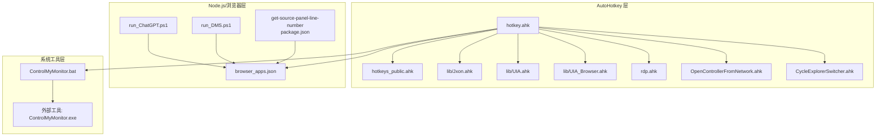
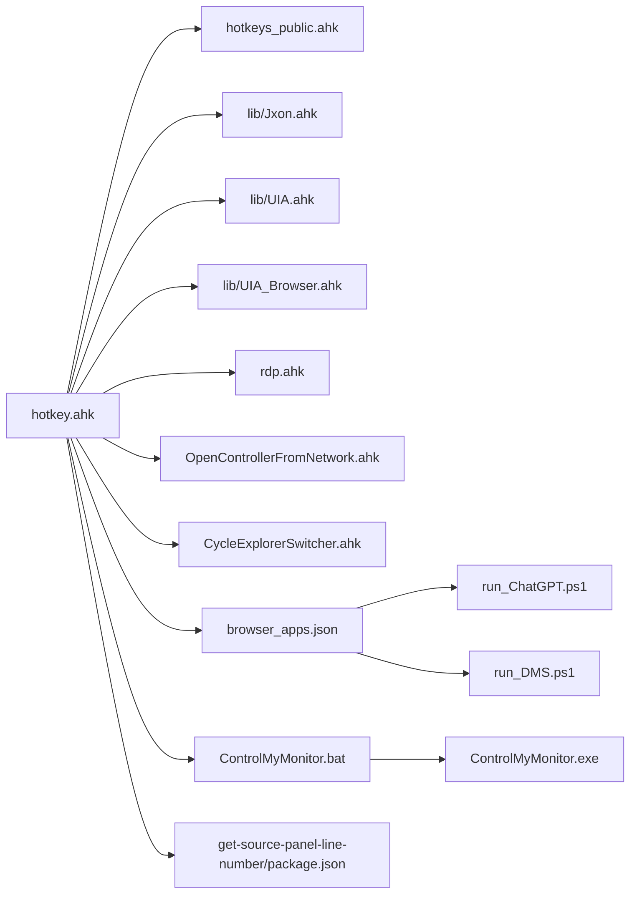

# 快速开始

<cite>
**本文引用的文件**
- [README.md](file://README.md)
- [hotkey.ahk](file://hotkey.ahk)
- [hotkeys_public.ahk](file://hotkeys_public.ahk)
- [nvm-node-pnpm-setup-guide.md](file://nvm-node-pnpm-setup-guide.md)
- [setup-node-pnpm-lite.ps1](file://setup-node-pnpm-lite.ps1)
- [browser_apps.json](file://browser_apps.json)
- [run_ChatGPT.ps1](file://apps/run_ChatGPT.ps1)
- [run_DMS.ps1](file://apps/run_DMS.ps1)
- [ControlMyMonitor.bat](file://ControlMyMonitor.bat)
- [package.json](file://get-source-panel-line-number/package.json)
</cite>

## 目录
1. [简介](#简介)
2. [项目结构](#项目结构)
3. [核心组件](#核心组件)
4. [架构总览](#架构总览)
5. [详细组件分析](#详细组件分析)
6. [依赖关系分析](#依赖关系分析)
7. [性能考虑](#性能考虑)
8. [故障排除指南](#故障排除指南)
9. [结论](#结论)
10. [附录](#附录)

## 简介
本指南面向新手用户，帮助你在约30分钟内完成 hotkey 项目的安装与首次运行。hotkey 是基于 AutoHotkey v2 的脚本，用于自定义热键以快速打开程序或执行工具。项目同时提供了 Node.js 生态的辅助能力（如浏览器应用快捷启动），并通过 PowerShell 脚本与批处理工具实现更丰富的自动化场景。

## 项目结构
仓库采用按功能分层的组织方式：
- 根目录包含主脚本、公共热键定义、第三方库、模板与工具脚本
- apps 目录提供浏览器应用的快捷方式生成脚本
- get-source-panel-line-number 目录包含 Node.js 桥接模块（用于与 Chrome DevTools 协同）
- lib 目录存放 UI 自动化与 JSON 解析等通用库
- templates 目录提供 RDP 凭据保存模板与说明

图表来源
- [hotkey.ahk:1-20](file://hotkey.ahk#L1-L20)
- [hotkeys_public.ahk:1-57](file://hotkeys_public.ahk#L1-L57)
- [browser_apps.json:1-48](file://browser_apps.json#L1-L48)
- [run_ChatGPT.ps1:1-18](file://apps/run_ChatGPT.ps1#L1-L18)
- [run_DMS.ps1:1-18](file://apps/run_DMS.ps1#L1-L18)
- [ControlMyMonitor.bat:1-74](file://ControlMyMonitor.bat#L1-L74)
- [package.json:1-6](file://get-source-panel-line-number/package.json#L1-L6)

章节来源
- [README.md:1-2](file://README.md#L1-L2)
- [hotkey.ahk:1-20](file://hotkey.ahk#L1-L20)

## 核心组件
- 主脚本与热键系统
  - 主入口脚本负责权限提升、任务计划注册、程序路径切换与窗口切换逻辑，并通过 #Include 引入多个功能模块。
  - 热键定义集中在公共模块与主脚本中，覆盖常用应用开关、窗口切换、输入法切换等场景。
- 浏览器应用快捷启动
  - 通过 PowerShell 脚本生成带参数的 Chrome 快捷方式，并写入 AUMID 以便系统识别应用。
  - browser_apps.json 提供浏览器与应用清单的统一配置，便于集中维护。
- Node.js 桥接与工具
  - get-source-panel-line-number 目录提供 Node 桥接，结合 chrome-remote-interface 实现与浏览器调试接口的交互。
  - nvm-node-pnpm-setup-guide.md 与 setup-node-pnpm-lite.ps1 提供 Node.js 与 pnpm 的安装与迁移指南，确保开发与构建环境稳定。
- 辅助工具
  - ControlMyMonitor.bat 用于自动检测并切换显示器输入源，适合多设备连接场景。

章节来源
- [hotkey.ahk:1-20](file://hotkey.ahk#L1-L20)
- [hotkeys_public.ahk:1-57](file://hotkeys_public.ahk#L1-L57)
- [browser_apps.json:1-48](file://browser_apps.json#L1-L48)
- [run_ChatGPT.ps1:1-18](file://apps/run_ChatGPT.ps1#L1-L18)
- [run_DMS.ps1:1-18](file://apps/run_DMS.ps1#L1-L18)
- [nvm-node-pnpm-setup-guide.md:1-160](file://nvm-node-pnpm-setup-guide.md#L1-L160)
- [setup-node-pnpm-lite.ps1:1-121](file://setup-node-pnpm-lite.ps1#L1-L121)
- [ControlMyMonitor.bat:1-74](file://ControlMyMonitor.bat#L1-L74)
- [package.json:1-6](file://get-source-panel-line-number/package.json#L1-L6)

## 架构总览
hotkey 的运行架构由“主脚本 + 多个功能模块 + 外部工具/脚本”构成，形成“热键驱动 + 应用控制 + 浏览器集成 + 系统自动化”的整体能力。

图表来源
- [hotkey.ahk:1-20](file://hotkey.ahk#L1-L20)
- [hotkeys_public.ahk:1-57](file://hotkeys_public.ahk#L1-L57)
- [browser_apps.json:1-48](file://browser_apps.json#L1-L48)
- [run_ChatGPT.ps1:1-18](file://apps/run_ChatGPT.ps1#L1-L18)
- [run_DMS.ps1:1-18](file://apps/run_DMS.ps1#L1-L18)
- [ControlMyMonitor.bat:1-74](file://ControlMyMonitor.bat#L1-L74)
- [package.json:1-6](file://get-source-panel-line-number/package.json#L1-L6)

## 详细组件分析

### 安装与环境准备
- 系统要求
  - Windows 系统（支持 Windows Terminal、Edge/Chrome、任务计划服务等）
  - 管理员权限（用于注册开机自启任务）
- AutoHotkey v2
  - 主脚本明确声明需要 AutoHotkey v2.0 并强制单实例运行
  - 首次运行会尝试以管理员权限提权，若失败会弹窗提示
- Node.js 与 pnpm（可选）
  - 若需使用浏览器应用快捷启动或 Node 桥接功能，建议安装 Node.js 与 pnpm
  - 提供完整安装与迁移指南与一键脚本，可将缓存与全局目录迁移到 D 盘

章节来源
- [hotkey.ahk:1-33](file://hotkey.ahk#L1-L33)
- [nvm-node-pnpm-setup-guide.md:1-160](file://nvm-node-pnpm-setup-guide.md#L1-L160)
- [setup-node-pnpm-lite.ps1:1-121](file://setup-node-pnpm-lite.ps1#L1-L121)

### 配置第一个热键
- 基本热键定义语法
  - 修饰键前缀：Win(#)/Ctrl(^)/Shift(+)/Alt(!)
  - 热键格式：修饰键 + 键位（如 #f、#^r、#F2）
  - 常见模式：Win+F2 打开腾讯会议；Win+F3 打开 Clash Verge；Win+F4 打开小红书等
- 常用热键组合示例
  - Win+F2：打开/切换腾讯会议
  - Win+F3：打开/切换 Clash Verge
  - Win+F4：打开/切换小红书
  - Win+F5：打开/切换微信读书
  - Win+F6：打开/切换搜狗PDF阅读编辑器
  - Win+F9：打开/切换 LocalSend
  - Win+`：打开 Obsidian
  - Win+F：打开 Microsoft Edge
  - Win+9：打开 PowerDesigner
  - Win+8：打开 Navicat
  - Win+y：打开手机连接（ms-phone 协议）
  - Win+^r：打开 PowerShell（通过 Windows Terminal）
  - Win+^t：打开 Telegram
- 热键行为逻辑
  - ToggleWindow/ByTitle/2 等函数根据进程名或窗口标题判断是否存在，存在则激活/最小化，否则尝试运行程序路径
  - 支持协议路径（如 ms-phone:）与本地可执行路径两种启动方式

章节来源
- [hotkey.ahk:565-750](file://hotkey.ahk#L565-L750)

### 浏览器应用快捷启动
- 配置文件
  - browser_apps.json 定义浏览器与应用清单，包含 Chrome/Edge 路径、通用启动参数、应用名称、URL、热键等
- 快捷方式生成
  - run_ChatGPT.ps1 与 run_DMS.ps1 通过 PowerShell 生成带参数的 Chrome 快捷方式，并写入 AUMID 以提升系统识别度
- 使用流程
  - 修改 browser_apps.json 中的应用信息
  - 运行对应 PowerShell 脚本生成快捷方式
  - 在热键中绑定生成的快捷方式或通过浏览器直接启动

章节来源
- [browser_apps.json:1-48](file://browser_apps.json#L1-L48)
- [run_ChatGPT.ps1:1-18](file://apps/run_ChatGPT.ps1#L1-L18)
- [run_DMS.ps1:1-18](file://apps/run_DMS.ps1#L1-L18)

### Node.js 桥接与工具
- 依赖说明
  - get-source-panel-line-number/package.json 声明 chrome-remote-interface 作为依赖，用于与浏览器调试接口通信
- 使用场景
  - 通过 Node 桥接实现与浏览器面板的交互（如获取行号、定位源码面板等）
- 环境准备
  - 使用 nvm-node-pnpm-setup-guide.md 或 setup-node-pnpm-lite.ps1 完成 Node.js 与 pnpm 的安装与配置

章节来源
- [package.json:1-6](file://get-source-panel-line-number/package.json#L1-L6)
- [nvm-node-pnpm-setup-guide.md:1-160](file://nvm-node-pnpm-setup-guide.md#L1-L160)
- [setup-node-pnpm-lite.ps1:1-121](file://setup-node-pnpm-lite.ps1#L1-L121)

### 系统自动化工具
- 显示器输入切换
  - ControlMyMonitor.bat 通过 ControlMyMonitor.exe 读取并设置显示器输入源（VCP 60/E2），自动检测当前输入并切换到 HDMI
  - 适用于多设备连接场景，减少手动切换的繁琐

章节来源
- [ControlMyMonitor.bat:1-74](file://ControlMyMonitor.bat#L1-L74)

## 依赖关系分析
- 模块耦合
  - 主脚本通过 #Include 引入多个功能模块，形成松耦合的插件化结构
  - 热键定义与应用启动逻辑分离，便于维护与扩展
- 外部依赖
  - Node.js 生态（pnpm、chrome-remote-interface）用于浏览器交互
  - Windows 系统工具（任务计划、PowerShell、批处理）用于系统级自动化
- 可能的循环依赖
  - 通过 #Include 方式引入，避免直接相互引用，降低循环依赖风险

图表来源
- [hotkey.ahk:1-20](file://hotkey.ahk#L1-L20)
- [hotkeys_public.ahk:1-57](file://hotkeys_public.ahk#L1-L57)
- [browser_apps.json:1-48](file://browser_apps.json#L1-L48)
- [run_ChatGPT.ps1:1-18](file://apps/run_ChatGPT.ps1#L1-L18)
- [run_DMS.ps1:1-18](file://apps/run_DMS.ps1#L1-L18)
- [ControlMyMonitor.bat:1-74](file://ControlMyMonitor.bat#L1-L74)
- [package.json:1-6](file://get-source-panel-line-number/package.json#L1-L6)

## 性能考虑
- 热键响应
  - 使用 #UseHook true 强制键盘钩子，确保热键触发的实时性
- 窗口切换
  - ToggleWindow 系列函数优先检查窗口存在与激活状态，避免不必要的启动开销
- 浏览器启动
  - 通过快捷方式与 AUMID 提升系统识别效率，减少重复启动
- Node 桥接
  - 仅在需要时启动 Node 进程，避免常驻进程带来的资源占用

## 故障排除指南
- 权限问题
  - 首次运行会尝试以管理员权限提权，若失败请手动以管理员身份运行
- 任务计划注册失败
  - 检查系统任务计划服务是否可用，确认脚本路径正确
- 程序路径不存在
  - RunAppPathWithPrefixFallback 会在主路径与 D 盘镜像路径间切换，若仍失败请检查路径配置
- 浏览器应用无法启动
  - 确认 Chrome/Edge 路径与 profile 参数正确，必要时重新生成快捷方式
- Node.js 环境异常
  - 使用 nvm-node-pnpm-setup-guide.md 或 setup-node-pnpm-lite.ps1 修复镜像源与路径配置
- 显示器输入切换失败
  - 检查 HDMI 信号与 DDC/CI 设置，确认 ControlMyMonitor.exe 路径正确

章节来源
- [hotkey.ahk:24-52](file://hotkey.ahk#L24-L52)
- [hotkey.ahk:76-118](file://hotkey.ahk#L76-L118)
- [nvm-node-pnpm-setup-guide.md:18-40](file://nvm-node-pnpm-setup-guide.md#L18-L40)
- [setup-node-pnpm-lite.ps1:60-88](file://setup-node-pnpm-lite.ps1#L60-L88)
- [ControlMyMonitor.bat:19-70](file://ControlMyMonitor.bat#L19-L70)

## 结论
通过本指南，你可以在30分钟内完成 hotkey 项目的安装与首次运行。从系统要求检查、AutoHotkey v2 与 Node.js 环境配置，到第一个热键的定义与常用应用的快速启动，再到常见问题的排查，都提供了清晰的步骤与参考路径。建议在完成基础配置后，逐步探索浏览器应用快捷启动与 Node 桥接功能，进一步提升日常效率。

## 附录
- 快速开始清单
  - 安装 AutoHotkey v2 并以管理员权限运行主脚本
  - 如需浏览器应用快捷启动，安装 Node.js 与 pnpm，并运行相应 PowerShell 脚本
  - 在主脚本中添加或修改热键，绑定常用应用
  - 使用 ControlMyMonitor.bat 管理显示器输入源
- 参考路径
  - 主脚本入口：[hotkey.ahk](file://hotkey.ahk)
  - 公共热键定义：[hotkeys_public.ahk](file://hotkeys_public.ahk)
  - 浏览器应用配置：[browser_apps.json](file://browser_apps.json)
  - Node 桥接依赖：[package.json](file://get-source-panel-line-number/package.json)
  - 显示器切换脚本：[ControlMyMonitor.bat](file://ControlMyMonitor.bat)