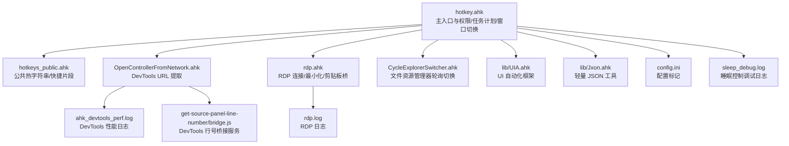
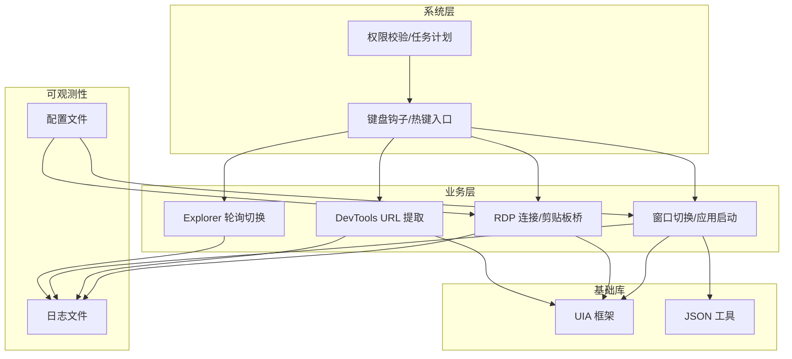
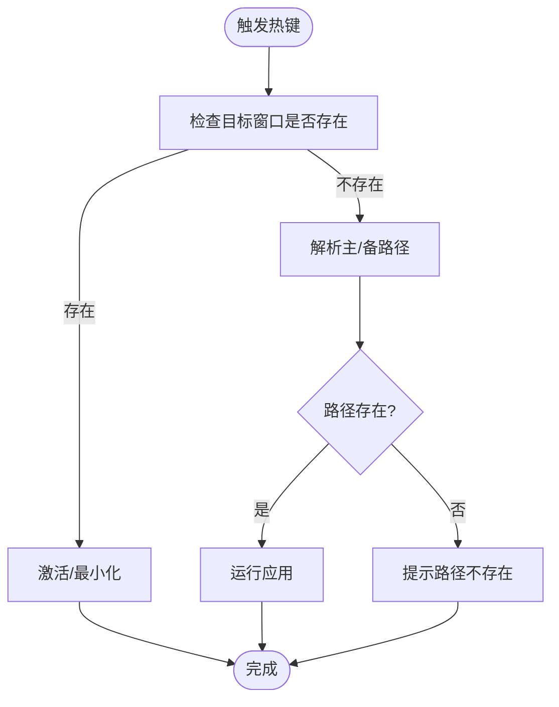
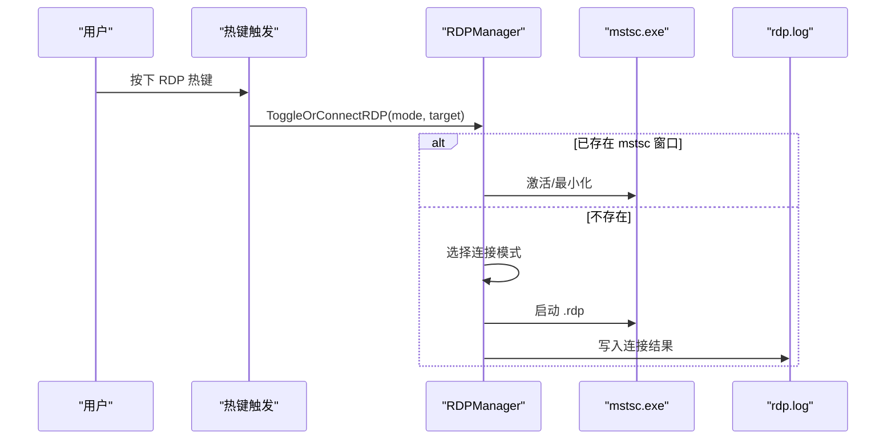
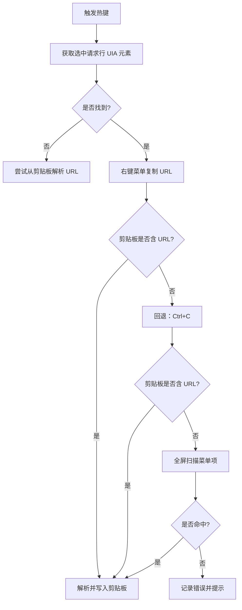
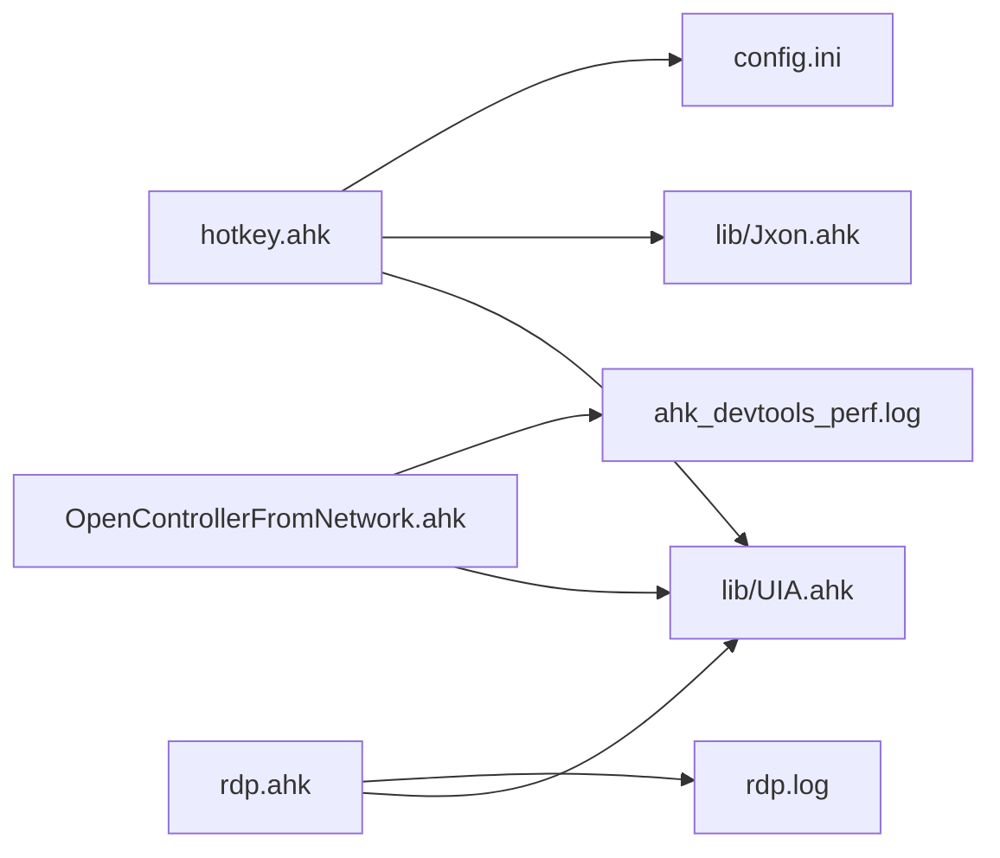

# 故障排除与常见问题

<cite>
**本文引用的文件**   
- [README.md](file://README.md)
- [hotkey.ahk](file://hotkey.ahk)
- [hotkeys_public.ahk](file://hotkeys_public.ahk)
- [rdp.ahk](file://rdp.ahk)
- [OpenControllerFromNetwork.ahk](file://OpenControllerFromNetwork.ahk)
- [CycleExplorerSwitcher.ahk](file://CycleExplorerSwitcher.ahk)
- [lib/UIA.ahk](file://lib/UIA.ahk)
- [lib/Jxon.ahk](file://lib/Jxon.ahk)
- [config.ini](file://config.ini)
- [ahk_devtools_perf.log](file://ahk_devtools_perf.log)
- [rdp.log](file://rdp.log)
- [sleep_debug.log](file://sleep_debug.log)
- [get-source-panel-line-number/bridge.js](file://get-source-panel-line-number/bridge.js)
</cite>

## 目录
1. [简介](#简介)
2. [项目结构](#项目结构)
3. [核心组件](#核心组件)
4. [架构总览](#架构总览)
5. [详细组件分析](#详细组件分析)
6. [依赖关系分析](#依赖关系分析)
7. [性能考虑](#性能考虑)
8. [故障排除指南](#故障排除指南)
9. [结论](#结论)
10. [附录](#附录)

## 简介
本文件面向使用 hotkey 项目的用户与维护者，提供系统性的故障排除与常见问题解答。内容涵盖权限相关问题、热键冲突、应用程序启动失败、日志分析技巧、性能排查与内存泄漏检测方法、社区支持与问题报告流程，以及已知限制与解决方案。项目基于 AutoHotkey v2，包含热键定义、窗口切换、远程桌面连接、开发者工具辅助等功能模块。

## 项目结构
项目采用“主脚本 + 模块化热键/工具 + 第三方库”的组织方式：
- 主脚本负责权限校验、任务计划注册、通用窗口切换与应用启动逻辑
- 独立模块分别实现 RDP 连接、DevTools 辅助、文件资源管理器切换等能力
- lib 目录提供 UIA 与 JSON 工具库
- 日志文件用于记录 RDP 与性能调试信息

图表来源
- [hotkey.ahk](file://hotkey.ahk)
- [hotkeys_public.ahk](file://hotkeys_public.ahk)
- [OpenControllerFromNetwork.ahk](file://OpenControllerFromNetwork.ahk)
- [rdp.ahk](file://rdp.ahk)
- [CycleExplorerSwitcher.ahk](file://CycleExplorerSwitcher.ahk)
- [lib/UIA.ahk](file://lib/UIA.ahk)
- [lib/Jxon.ahk](file://lib/Jxon.ahk)
- [config.ini](file://config.ini)
- [ahk_devtools_perf.log](file://ahk_devtools_perf.log)
- [rdp.log](file://rdp.log)
- [sleep_debug.log](file://sleep_debug.log)
- [get-source-panel-line-number/bridge.js](file://get-source-panel-line-number/bridge.js)

章节来源
- [README.md](file://README.md)
- [hotkey.ahk](file://hotkey.ahk)

## 核心组件
- 权限与自启动
  - 脚本启动即检查管理员权限，不具备时尝试以管理员重新运行；失败则提示并退出
  - 首次运行注册“登录时以最高权限运行”的任务计划，便于开机自启
- 窗口切换与应用启动
  - 提供统一的“切换/启动”函数，支持路径回退（C:/D: 盘符互换）、协议路径（如 ms-phone:）与错误提示
- RDP 工具链
  - 剪贴板桥：在远程会话与本地之间通过剪贴板信号最小化本地 mstsc
  - 连接管理：快速直连与安全探测（DNS/端口探测）两种模式
  - 调试：窗口根句柄识别、远程会话判定、日志落盘
- DevTools 辅助
  - 通过 UIA 定位网络面板请求行，优先右键菜单复制 URL，失败时回退 Ctrl+C 或全屏扫描
  - 性能日志记录关键步骤耗时，便于定位卡顿
- 文件资源管理器切换
  - Win+E 实现多窗口轮询切换，支持 GUI 高亮与键盘/鼠标交互
- UIA/JSON 工具
  - UIA 提供跨版本初始化、事件处理器、元素遍历等能力
  - Jxon 提供 Map/Array 与 JSON 的互转

章节来源
- [hotkey.ahk](file://hotkey.ahk)
- [rdp.ahk](file://rdp.ahk)
- [OpenControllerFromNetwork.ahk](file://OpenControllerFromNetwork.ahk)
- [CycleExplorerSwitcher.ahk](file://CycleExplorerSwitcher.ahk)
- [lib/UIA.ahk](file://lib/UIA.ahk)
- [lib/Jxon.ahk](file://lib/Jxon.ahk)

## 架构总览
整体采用“主脚本调度 + 子模块协作 + 日志/配置支撑”的分层设计。主脚本负责系统级能力（权限、任务计划、窗口切换），子模块聚焦具体工具链（RDP、DevTools、Explorer 切换），UIA/Jxon 提供底层能力与数据处理。

图表来源
- [hotkey.ahk](file://hotkey.ahk)
- [rdp.ahk](file://rdp.ahk)
- [OpenControllerFromNetwork.ahk](file://OpenControllerFromNetwork.ahk)
- [CycleExplorerSwitcher.ahk](file://CycleExplorerSwitcher.ahk)
- [lib/UIA.ahk](file://lib/UIA.ahk)
- [lib/Jxon.ahk](file://lib/Jxon.ahk)
- [config.ini](file://config.ini)

## 详细组件分析

### 权限与自启动
- 权限检查：若非管理员，尝试以管理员权限重启当前脚本；失败弹窗提示并退出
- 任务计划：首次运行创建“登录时以最高权限运行”的任务，标记在配置文件中，避免重复创建
- 建议：若开机自启无效，请手动检查任务计划服务状态与账户权限

章节来源
- [hotkey.ahk](file://hotkey.ahk)
- [config.ini](file://config.ini)

### 窗口切换与应用启动
- 通用切换函数：若目标窗口存在则激活/最小化，否则尝试运行指定路径
- 路径回退：针对 C/D 盘符差异，提供主备路径检测与错误提示
- 协议路径：对协议类路径（如 ms-phone:）直接运行，失败时弹窗说明

图表来源
- [hotkey.ahk](file://hotkey.ahk)

章节来源
- [hotkey.ahk](file://hotkey.ahk)

### RDP 工具链
- 剪贴板桥：在本地检测到远程信号时最小化 mstsc 并回滚剪贴板
- 连接模式：
  - 快速直连：直接使用 .rdp 文件启动
  - 安全探测：先进行 DNS/端口探测，失败则记录日志
- 调试能力：识别根窗口、远程会话、窗口类名，便于定位最小化/激活问题

图表来源
- [rdp.ahk](file://rdp.ahk)

章节来源
- [rdp.ahk](file://rdp.ahk)
- [rdp.log](file://rdp.log)

### DevTools 辅助
- 核心流程：优先右键菜单复制 URL，失败回退 Ctrl+C 或全屏扫描
- 性能日志：记录各阶段耗时，便于定位 UIA 扫描瓶颈
- 外部桥接：Node 桥服务暴露 HTTP 接口，供外部工具获取行号

图表来源
- [OpenControllerFromNetwork.ahk](file://OpenControllerFromNetwork.ahk)

章节来源
- [OpenControllerFromNetwork.ahk](file://OpenControllerFromNetwork.ahk)
- [ahk_devtools_perf.log](file://ahk_devtools_perf.log)
- [get-source-panel-line-number/bridge.js](file://get-source-panel-line-number/bridge.js)

### 文件资源管理器切换
- 多窗口轮询：Win+E 触发后列出当前所有“文件资源管理器”窗口，支持高亮与点击/键盘确认
- 键盘释放监控：松开 Win 键后提交切换，避免误触
- 激活增强：最小化状态先还原，失败时尝试 Alt 激活

章节来源
- [CycleExplorerSwitcher.ahk](file://CycleExplorerSwitcher.ahk)

## 依赖关系分析
- 主脚本依赖 UIA 与 JSON 工具库，用于窗口/元素操作与数据处理
- RDP 模块依赖 UIA 与系统窗口 API，结合日志文件定位问题
- DevTools 模块依赖 UIA 与浏览器调试协议，配合性能日志定位瓶颈
- 配置文件用于持久化任务计划标记

图表来源
- [hotkey.ahk](file://hotkey.ahk)
- [lib/UIA.ahk](file://lib/UIA.ahk)
- [lib/Jxon.ahk](file://lib/Jxon.ahk)
- [rdp.ahk](file://rdp.ahk)
- [OpenControllerFromNetwork.ahk](file://OpenControllerFromNetwork.ahk)
- [config.ini](file://config.ini)

章节来源
- [hotkey.ahk](file://hotkey.ahk)
- [lib/UIA.ahk](file://lib/UIA.ahk)
- [lib/Jxon.ahk](file://lib/Jxon.ahk)
- [rdp.ahk](file://rdp.ahk)
- [OpenControllerFromNetwork.ahk](file://OpenControllerFromNetwork.ahk)
- [config.ini](file://config.ini)

## 性能考虑
- UIA 扫描成本：全屏扫描比局部/锚点扫描更昂贵，建议优先使用 UIA 缓存与局部扫描
- 超时与重试：合理设置重试次数与等待时间，避免长时间阻塞
- 日志粒度：性能日志仅在启用时写入，避免生产环境产生过多 IO
- 窗口激活：多次尝试与延时有助于降低焦点竞争导致的失败

## 故障排除指南

### 权限相关问题
- 现象
  - 脚本启动即退出或无法注册自启动任务
- 排查步骤
  - 确认以管理员身份运行
  - 检查任务计划服务是否可用
  - 查看配置文件标记是否正确
- 解决方案
  - 以管理员权限重新运行脚本
  - 手动创建任务计划或修复系统服务

章节来源
- [hotkey.ahk](file://hotkey.ahk)
- [config.ini](file://config.ini)

### 热键冲突问题
- 现象
  - 某些热键无响应或被系统/第三方软件拦截
- 排查步骤
  - 更换组合键（如改用 Win+Ctrl+Shift）
  - 在系统设置中检查冲突应用（如输入法、截图工具）
  - 使用“热键测试”思路：单独测试目标热键是否触发
- 解决方案
  - 选择不常用的组合键
  - 在目标应用中禁用相同热键

### 应用程序启动问题
- 现象
  - 点击热键无反应或提示路径不存在
- 排查步骤
  - 检查路径是否存在于 C: 或 D:（脚本会自动回退）
  - 确认协议路径（如 ms-phone:）是否被系统识别
  - 查看错误弹窗中的具体路径
- 解决方案
  - 更新热键绑定中的路径
  - 使用“切换/启动”函数的备用路径策略

章节来源
- [hotkey.ahk](file://hotkey.ahk)

### RDP 连接问题
- 现象
  - 安全探测失败，提示端口 3389 关闭或被过滤
- 排查步骤
  - 查看 RDP 日志中的失败原因
  - 确认目标主机可达、防火墙放行 3389
  - 尝试快速直连（绕过探测）
- 解决方案
  - 修复网络/防火墙策略
  - 使用快速直连模式

章节来源
- [rdp.ahk](file://rdp.ahk)
- [rdp.log](file://rdp.log)

### DevTools URL 提取失败
- 现象
  - 提示未在 Network 面板选中请求行
- 排查步骤
  - 确认鼠标悬停在某条请求行上
  - 查看性能日志中的扫描阶段与耗时
  - 检查 DevTools 是否处于可访问状态
- 解决方案
  - 先在 DevTools 中选中请求行再触发
  - 降低 UIA 扫描范围或等待界面渲染

章节来源
- [OpenControllerFromNetwork.ahk](file://OpenControllerFromNetwork.ahk)
- [ahk_devtools_perf.log](file://ahk_devtools_perf.log)

### Explorer 切换异常
- 现象
  - 多窗口切换无效或无法激活
- 排查步骤
  - 确认存在多个“文件资源管理器”窗口
  - 检查 GUI 是否正确显示与高亮
  - 观察键盘释放监控是否生效
- 解决方案
  - 先手动关闭不需要的窗口
  - 重新触发热键以刷新列表

章节来源
- [CycleExplorerSwitcher.ahk](file://CycleExplorerSwitcher.ahk)

### 日志分析技巧
- RDP 日志
  - 关注“端口 3389 关闭/被过滤”的提示，定位网络策略问题
- DevTools 性能日志
  - 关注“anchor-wide-scan/full-scan”等关键字，判断 UIA 扫描范围
  - 结合耗时数值评估 UIA 成本
- 通用建议
  - 在问题复现时开启对应日志，保留至少 1~2 次完整流程
  - 分析日志时间戳，定位卡顿阶段

章节来源
- [rdp.ahk](file://rdp.ahk)
- [OpenControllerFromNetwork.ahk](file://OpenControllerFromNetwork.ahk)
- [rdp.log](file://rdp.log)
- [ahk_devtools_perf.log](file://ahk_devtools_perf.log)

### 性能问题排查
- UIA 扫描优化
  - 优先使用局部锚点扫描，避免全屏扫描
  - 合理设置重试次数与等待时间
- 窗口操作
  - 减少频繁最小化/激活，合并操作
  - 使用“先还原再激活”的策略降低失败率

章节来源
- [OpenControllerFromNetwork.ahk](file://OpenControllerFromNetwork.ahk)
- [CycleExplorerSwitcher.ahk](file://CycleExplorerSwitcher.ahk)

### 内存泄漏检测方法
- 建议
  - 长时间运行后观察脚本占用内存变化
  - 关注 UIA 对象生命周期，避免持有过多元素引用
  - 定期重启脚本以回收资源
- 依据
  - UIA 库提供清理与事件处理器移除能力，可在退出时调用

章节来源
- [lib/UIA.ahk](file://lib/UIA.ahk)

### 社区支持与问题报告流程
- 支持渠道
  - 仓库 Issues：提交问题时附带日志与复现步骤
- 报告模板建议
  - 环境信息（操作系统版本、AutoHotkey 版本）
  - 复现步骤与期望行为
  - 相关日志片段与截图
  - 已尝试的解决方法

[本节为通用指导，无需文件引用]

### 已知限制与解决方案
- UIA 版本与可用性
  - 不同系统版本的 UIA 接口可能不同，库会自动选择可用版本
- DevTools 界面稳定性
  - 某些界面渲染延迟可能导致定位失败，建议等待或降低扫描范围
- RDP 连接受网络策略影响
  - 防火墙/代理可能阻止 3389 端口，需在网络侧放行

章节来源
- [lib/UIA.ahk](file://lib/UIA.ahk)
- [OpenControllerFromNetwork.ahk](file://OpenControllerFromNetwork.ahk)
- [rdp.ahk](file://rdp.ahk)

## 结论
通过权限自检与任务计划、窗口切换与路径回退、RDP 剪贴板桥与连接模式、DevTools UIA 定位与性能日志、Explorer 轮询切换与 UIA 能力，hotkey 项目提供了完整的自动化工具链。遵循本文的故障排除与性能优化建议，可显著提升稳定性与用户体验。

## 附录
- 常用日志位置
  - RDP：rdp.log
  - DevTools：ahk_devtools_perf.log
  - 睡眠控制：sleep_debug.log
- 配置位置
  - config.ini（任务计划标记）

章节来源
- [rdp.log](file://rdp.log)
- [ahk_devtools_perf.log](file://ahk_devtools_perf.log)
- [sleep_debug.log](file://sleep_debug.log)
- [config.ini](file://config.ini)