# UI自动化框架

<cite>
**本文档引用的文件**
- [UIA.ahk](file://lib/UIA.ahk)
- [UIA_Browser.ahk](file://lib/UIA_Browser.ahk)
- [hotkey.ahk](file://hotkey.ahk)
- [README.md](file://README.md)
</cite>

## 目录
1. [简介](#简介)
2. [项目结构](#项目结构)
3. [核心组件](#核心组件)
4. [架构概览](#架构概览)
5. [详细组件分析](#详细组件分析)
6. [依赖关系分析](#依赖关系分析)
7. [性能考虑](#性能考虑)
8. [故障排除指南](#故障排除指南)
9. [结论](#结论)

## 简介

hotkey项目是一个基于AutoHotkey v2的UI自动化框架，专门用于Windows应用程序的界面自动化测试和控制。该项目实现了完整的Microsoft UI Automation (UIA)框架，提供了强大的元素定位、操作和事件处理能力。

UI自动化框架的核心目标是：
- 提供对Windows应用程序界面元素的完整访问
- 支持多种UIA API和模式
- 实现高效的元素缓存机制
- 提供浏览器自动化扩展
- 支持屏幕读取器集成

## 项目结构

项目采用模块化设计，主要包含以下核心组件：

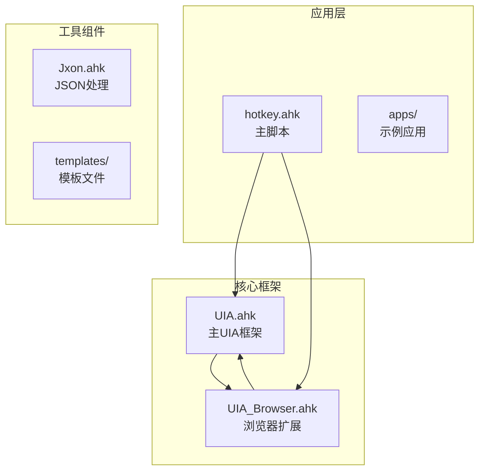

**图表来源**
- [UIA.ahk](file://lib/UIA.ahk)
- [UIA_Browser.ahk](file://lib/UIA_Browser.ahk)
- [hotkey.ahk](file://hotkey.ahk)

**章节来源**
- [README.md:1-2](file://README.md#L1-L2)
- [hotkey.ahk:1-20](file://hotkey.ahk#L1-L20)

## 核心组件

### UIA主框架

UIA主框架提供了完整的Microsoft UI Automation API实现，包括：

#### 核心功能特性
- **多版本兼容性**：支持IUIAutomation版本2到7
- **智能初始化**：自动检测和使用最新可用的UIA版本
- **条件构建器**：提供灵活的元素查找条件
- **缓存机制**：高效的元素属性缓存系统
- **事件处理**：完整的UIA事件监听和处理

#### 关键API接口

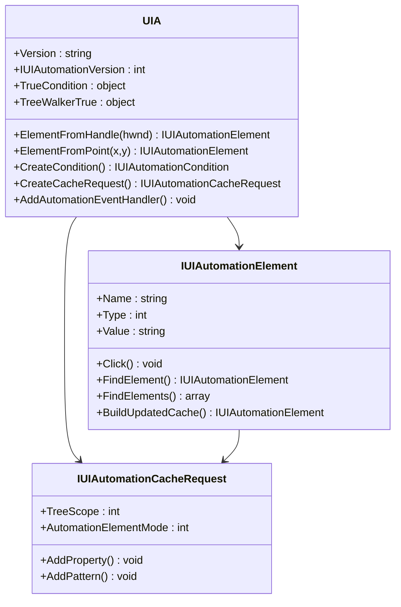

**图表来源**
- [UIA.ahk:51-150](file://lib/UIA.ahk#L51-L150)
- [UIA.ahk:1877-2050](file://lib/UIA.ahk#L1877-L2050)

**章节来源**
- [UIA.ahk:1-100](file://lib/UIA.ahk#L1-L100)
- [UIA.ahk:51-150](file://lib/UIA.ahk#L51-L150)

### 浏览器自动化扩展

UIA_Browser模块专为浏览器自动化而设计，支持Chrome、Firefox、Edge等多种浏览器：

#### 支持的浏览器类型
- **Chrome/Chromium系列**：Chrome、Brave、Vivaldi
- **Firefox**：Mozilla Firefox
- **Edge**：Microsoft Edge

#### 核心功能
- **页面导航**：前进、后退、刷新、主页
- **标签页管理**：创建、关闭、切换标签页
- **JavaScript执行**：通过地址栏执行JavaScript
- **元素定位**：基于CSS选择器的元素定位
- **文本提取**：从页面提取所有文本内容

**章节来源**
- [UIA_Browser.ahk:1-120](file://lib/UIA_Browser.ahk#L1-L120)
- [UIA_Browser.ahk:458-520](file://lib/UIA_Browser.ahk#L458-L520)

## 架构概览

UI自动化框架采用分层架构设计，确保了良好的可扩展性和维护性：

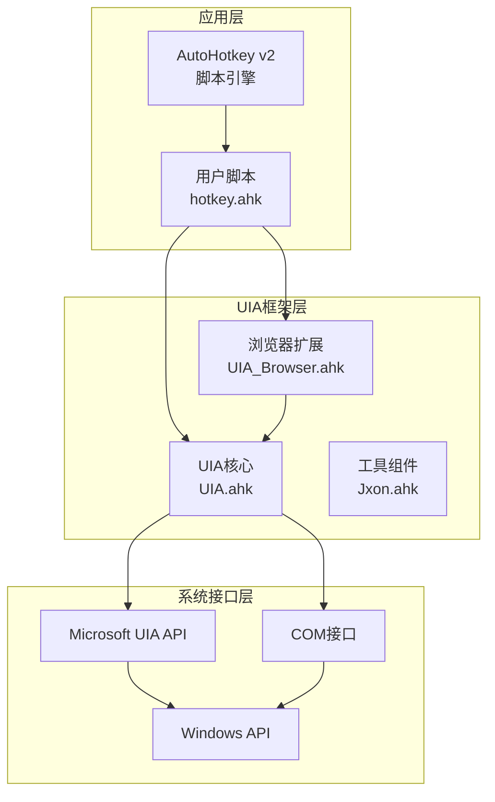

**图表来源**
- [hotkey.ahk:1-10](file://hotkey.ahk#L1-L10)
- [UIA.ahk:1-50](file://lib/UIA.ahk#L1-L50)

## 详细组件分析

### UIA核心框架深度解析

#### 初始化和版本管理

UIA框架在首次使用时自动初始化，支持动态版本检测和选择：

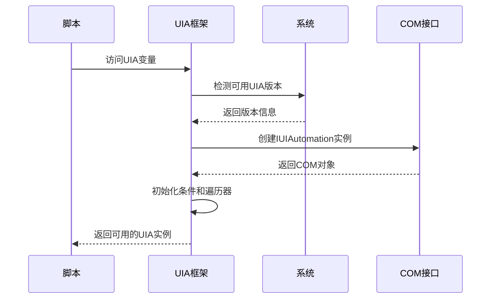

**图表来源**
- [UIA.ahk:60-138](file://lib/UIA.ahk#L60-L138)

#### 元素定位策略

UIA框架提供了多种元素定位方法，每种都有其特定的使用场景：

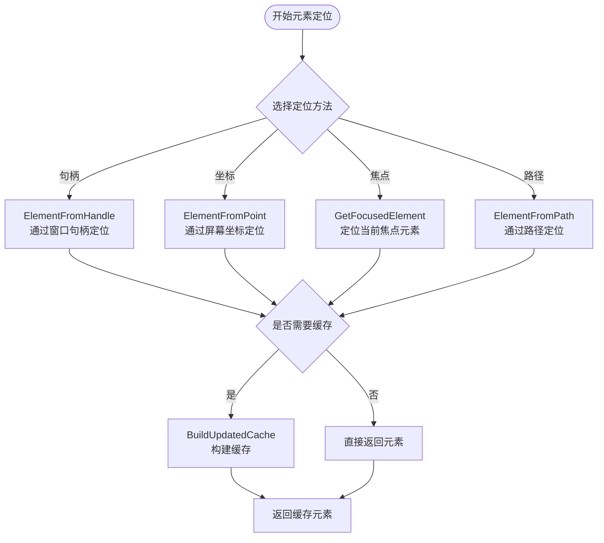

**图表来源**
- [UIA.ahk:964-1009](file://lib/UIA.ahk#L964-L1009)
- [UIA.ahk:1104-1127](file://lib/UIA.ahk#L1104-L1127)

**章节来源**
- [UIA.ahk:945-1009](file://lib/UIA.ahk#L945-L1009)
- [UIA.ahk:1104-1127](file://lib/UIA.ahk#L1104-L1127)

### 事件处理机制

UIA框架实现了完整的事件监听和处理系统：

#### 事件类型分类

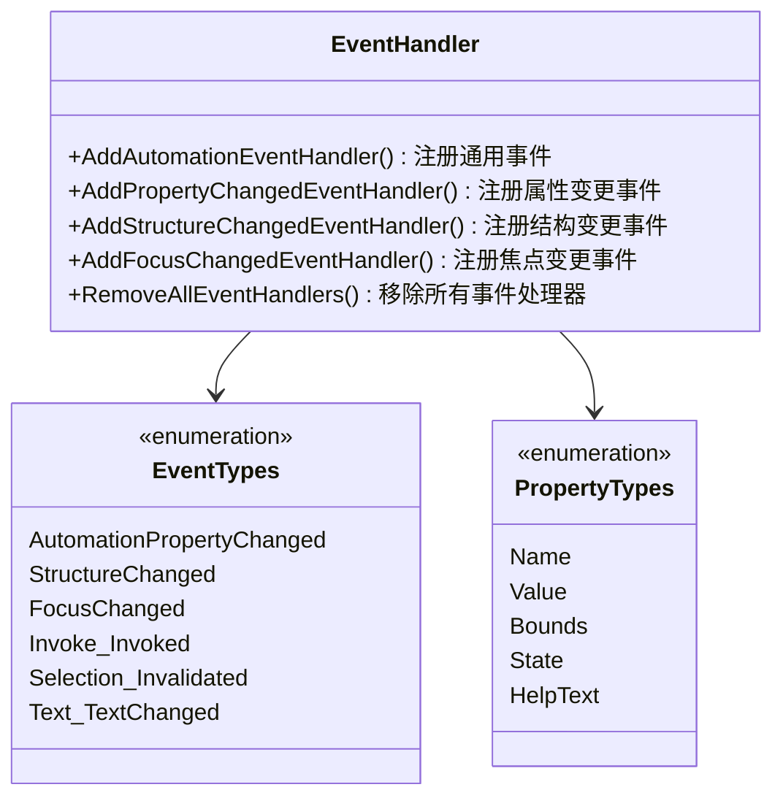

**图表来源**
- [UIA.ahk:1289-1360](file://lib/UIA.ahk#L1289-L1360)

#### 事件处理流程

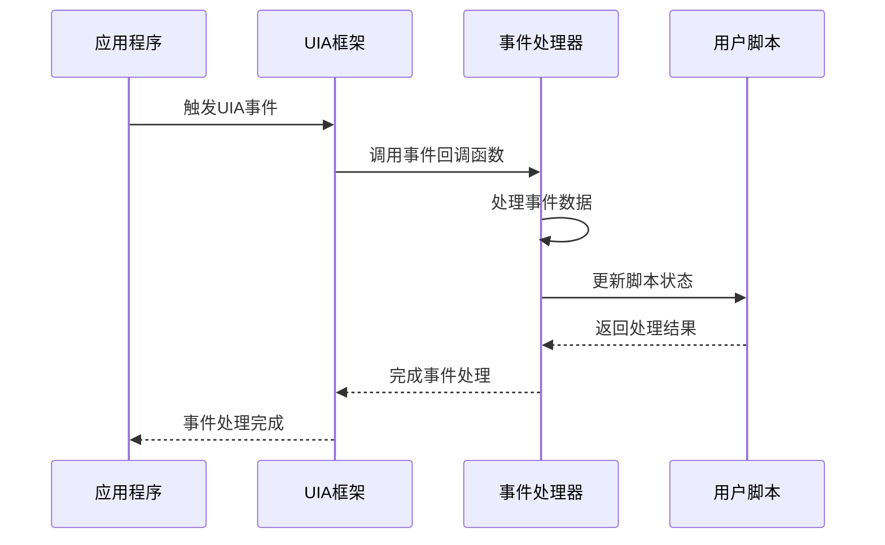

**图表来源**
- [UIA.ahk:1297-1333](file://lib/UIA.ahk#L1297-L1333)

**章节来源**
- [UIA.ahk:1285-1360](file://lib/UIA.ahk#L1285-L1360)

### 缓存机制和性能优化

#### 缓存策略

UIA框架实现了多层次的缓存机制来提高性能：

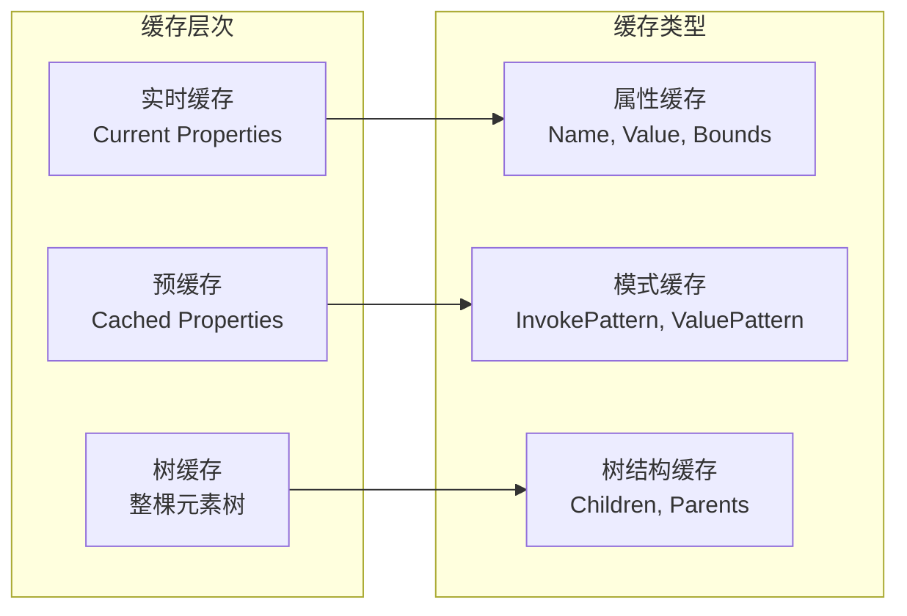

**图表来源**
- [UIA.ahk:1145-1183](file://lib/UIA.ahk#L1145-L1183)

#### 性能优化技术

1. **智能缓存更新**：仅在必要时更新缓存
2. **批量操作**：支持批量元素查找和操作
3. **延迟加载**：按需加载元素属性
4. **内存管理**：自动释放不再使用的资源

**章节来源**
- [UIA.ahk:1145-1183](file://lib/UIA.ahk#L1145-L1183)
- [UIA.ahk:2287-2344](file://lib/UIA.ahk#L2287-L2344)

### 屏幕读取器支持

UIA框架内置了对Windows屏幕读取器的支持：

#### 屏幕读取器集成

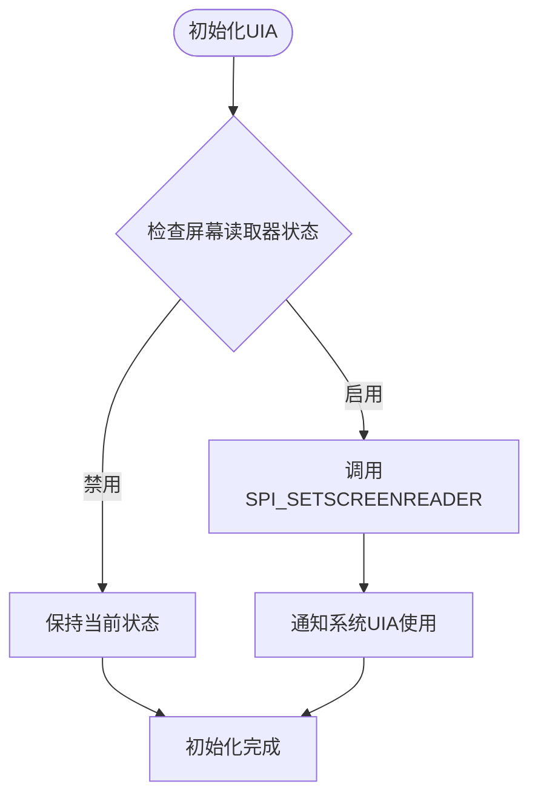

**图表来源**
- [UIA.ahk:139-152](file://lib/UIA.ahk#L139-L152)

**章节来源**
- [UIA.ahk:1529-1535](file://lib/UIA.ahk#L1529-L1535)

## 依赖关系分析

### 外部依赖

UIA框架依赖于以下外部组件：

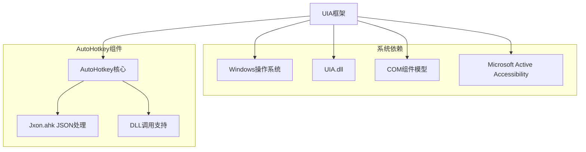

**图表来源**
- [hotkey.ahk:3-6](file://hotkey.ahk#L3-L6)

### 内部模块依赖

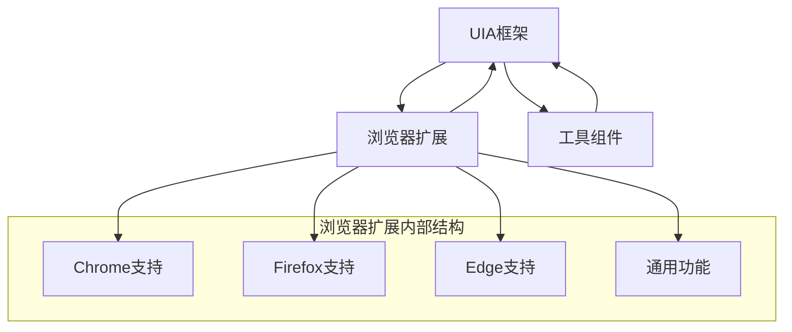

**图表来源**
- [UIA_Browser.ahk:458-488](file://lib/UIA_Browser.ahk#L458-L488)

**章节来源**
- [hotkey.ahk:3-6](file://hotkey.ahk#L3-L6)
- [UIA_Browser.ahk:458-488](file://lib/UIA_Browser.ahk#L458-L488)

## 性能考虑

### 性能优化策略

#### 元素查找优化

1. **条件预编译**：将复杂的查找条件预编译为UIA条件对象
2. **缓存策略**：根据使用频率智能缓存元素属性
3. **批量操作**：支持批量元素查找和操作减少API调用次数

#### 内存管理

1. **自动释放**：COM对象使用后自动释放
2. **缓存清理**：定期清理不再使用的缓存数据
3. **资源监控**：监控内存使用情况避免泄漏

#### 并发处理

1. **线程安全**：确保事件处理器的线程安全性
2. **异步操作**：支持异步元素查找和操作
3. **超时机制**：防止长时间阻塞操作

## 故障排除指南

### 常见问题和解决方案

#### 元素定位失败

**问题描述**：无法找到指定的UI元素

**可能原因**：
1. 元素尚未加载完成
2. 条件过于严格
3. 应用程序使用非标准UIA实现

**解决方案**：
```autohotkey
; 使用等待机制
element := parentElement.WaitElement({Name:"按钮名称"}, 5000)

; 使用更宽松的条件
element := parentElement.FindElement({Type:"Button"}, 4)

; 检查元素是否存在
if element := parentElement.ElementExist({Name:"目标元素"})
    ; 执行操作
```

#### 事件处理问题

**问题描述**：事件处理器无法正常工作

**解决步骤**：
1. 确认事件处理器已正确注册
2. 检查事件作用域设置
3. 验证事件回调函数签名

**章节来源**
- [UIA.ahk:2759-2804](file://lib/UIA.ahk#L2759-L2804)
- [UIA.ahk:1297-1333](file://lib/UIA.ahk#L1297-L1333)

### 错误处理最佳实践

#### 异常捕获

```autohotkey
try {
    element := UIA.ElementFromHandle(hwnd)
    element.Click()
} catch TargetError as e {
    ; 处理元素未找到错误
    MsgBox("元素未找到: " e.Message)
} catch Error as e {
    ; 处理其他UIA错误
    MsgBox("UIA操作失败: " e.Message)
}
```

#### 资源清理

```autohotkey
; 确保事件处理器被正确移除
UIA.RemoveAllEventHandlers()

; 手动清理大对象
if IsObject(largeElementArray) {
    largeElementArray := []
}
```

**章节来源**
- [UIA.ahk:1358-1360](file://lib/UIA.ahk#L1358-L1360)

## 结论

hotkey项目的UI自动化框架是一个功能强大、设计精良的自动化测试和控制工具。其主要特点包括：

### 核心优势

1. **完整的UIA实现**：提供了Microsoft UIA框架的完整API覆盖
2. **智能缓存机制**：显著提升了元素查找和操作的性能
3. **浏览器扩展支持**：专门针对现代浏览器的自动化需求
4. **屏幕读取器集成**：确保了无障碍访问的兼容性
5. **灵活的事件处理**：支持多种类型的UIA事件监听

### 技术特色

- **多版本兼容**：支持从Windows 7到最新版本的Windows系统
- **高性能设计**：通过智能缓存和优化算法提升执行效率
- **易于使用**：提供了简洁的API接口和丰富的示例代码
- **稳定可靠**：完善的错误处理和资源管理机制

### 应用场景

该框架适用于以下场景：
- 自动化测试和质量保证
- 用户界面自动化脚本
- 屏幕读取器辅助工具
- 界面元素监控和数据分析
- 跨平台应用程序控制

通过合理使用这个框架，开发者可以高效地实现各种UI自动化需求，同时保持代码的可维护性和性能表现。