# UI自动化框架

<cite>
**本文档引用的文件**
- [UIA.ahk](file://lib/UIA.ahk)
- [UIA_Browser.ahk](file://lib/UIA_Browser.ahk)
- [OpenControllerFromNetwork.ahk](file://OpenControllerFromNetwork.ahk)
- [hotkey.ahk](file://hotkey.ahk)
- [README.md](file://README.md)
</cite>

## 更新摘要
**变更内容**
- 更新了IDEA集成功能，改进了UI自动化元素检测机制
- 使用UIA.ElementFromHandle替代简单的键盘快捷键序列
- 增强了IDE搜索对话框处理的可靠性和稳定性
- 添加了新的UIA元素等待和定位策略

## 目录
1. [简介](#简介)
2. [项目结构](#项目结构)
3. [核心组件](#核心组件)
4. [架构概览](#架构概览)
5. [详细组件分析](#详细组件分析)
6. [依赖关系分析](#依赖关系分析)
7. [性能考虑](#性能考虑)
8. [故障排除指南](#故障排除指南)
9. [结论](#结论)

## 简介

hotkey项目是一个基于AutoHotkey v2的UI自动化框架，专门用于Windows应用程序的界面自动化测试和控制。该项目实现了完整的Microsoft UI Automation (UIA)框架，提供了强大的元素定位、操作和事件处理能力。

UI自动化框架的核心目标是：
- 提供对Windows应用程序界面元素的完整访问
- 支持多种UIA API和模式
- 实现高效的元素缓存机制
- 提供浏览器自动化扩展
- 支持屏幕读取器集成
- **增强IDE集成能力**：通过UIA.ElementFromHandle提供更可靠的IDE窗口元素检测

## 项目结构

项目采用模块化设计，主要包含以下核心组件：

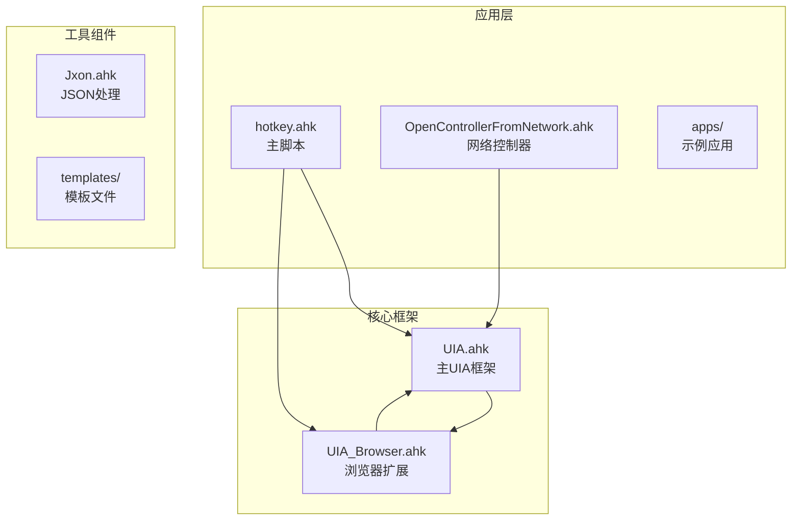
```mermaid
graph TB
subgraph "核心框架"
UIA[UIA.ahk<br/>主UIA框架]
Browser[UIA_Browser.ahk<br/>浏览器扩展]
end
subgraph "应用层"
Hotkey[hotkey.ahk<br/>主脚本]
NetworkCtrl[OpenControllerFromNetwork.ahk<br/>网络控制器]
Apps[apps/<br/>示例应用]
end
subgraph "工具组件"
Jxon[Jxon.ahk<br/>JSON处理]
Templates[templates/<br/>模板文件]
end
UIA --> Browser
Hotkey --> UIA
Hotkey --> Browser
NetworkCtrl --> UIA
Browser --> UIA
```

**图表来源**
- [UIA.ahk](file://lib/UIA.ahk)
- [UIA_Browser.ahk](file://lib/UIA_Browser.ahk)
- [OpenControllerFromNetwork.ahk](file://OpenControllerFromNetwork.ahk)
- [hotkey.ahk](file://hotkey.ahk)

**章节来源**
- [README.md:1-2](file://README.md#L1-L2)
- [hotkey.ahk:1-20](file://hotkey.ahk#L1-L20)

## 核心组件

### UIA主框架

UIA主框架提供了完整的Microsoft UI Automation API实现，包括：

#### 核心功能特性
- **多版本兼容性**：支持IUIAutomation版本2到7
- **智能初始化**：自动检测和使用最新可用的UIA版本
- **条件构建器**：提供灵活的元素查找条件
- **缓存机制**：高效的元素属性缓存系统
- **事件处理**：完整的UIA事件监听和处理
- **增强的元素定位**：支持ElementFromHandle等高级API

#### 关键API接口

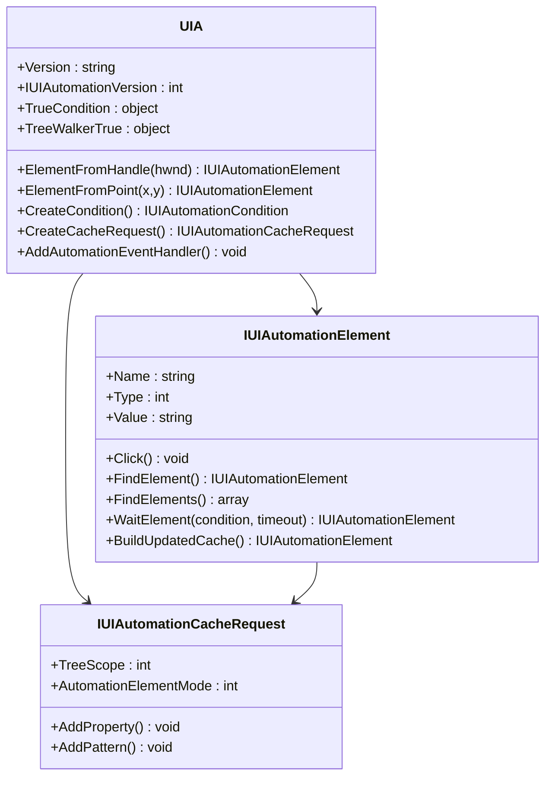
```mermaid
classDiagram
class UIA {
+Version : string
+IUIAutomationVersion : int
+TrueCondition : object
+TreeWalkerTrue : object
+ElementFromHandle(hwnd) IUIAutomationElement
+ElementFromPoint(x,y) IUIAutomationElement
+CreateCondition() IUIAutomationCondition
+CreateCacheRequest() IUIAutomationCacheRequest
+AddAutomationEventHandler() void
}
class IUIAutomationElement {
+Name : string
+Type : int
+Value : string
+Click() void
+FindElement() IUIAutomationElement
+FindElements() array
+WaitElement(condition, timeout) IUIAutomationElement
+BuildUpdatedCache() IUIAutomationElement
}
class IUIAutomationCacheRequest {
+AddProperty() void
+AddPattern() void
+TreeScope : int
+AutomationElementMode : int
}
UIA --> IUIAutomationElement
UIA --> IUIAutomationCacheRequest
IUIAutomationElement --> IUIAutomationCacheRequest
```

**图表来源**
- [UIA.ahk:51-150](file://lib/UIA.ahk#L51-L150)
- [UIA.ahk:1877-2050](file://lib/UIA.ahk#L1877-L2050)

**章节来源**
- [UIA.ahk:1-100](file://lib/UIA.ahk#L1-L100)
- [UIA.ahk:51-150](file://lib/UIA.ahk#L51-L150)

### IDEA集成功能增强

**新增** OpenControllerFromNetwork.ahk中的IDEA集成功能得到了显著增强，采用了更可靠的UIA元素检测机制：

#### 改进的IDEA搜索对话框处理流程

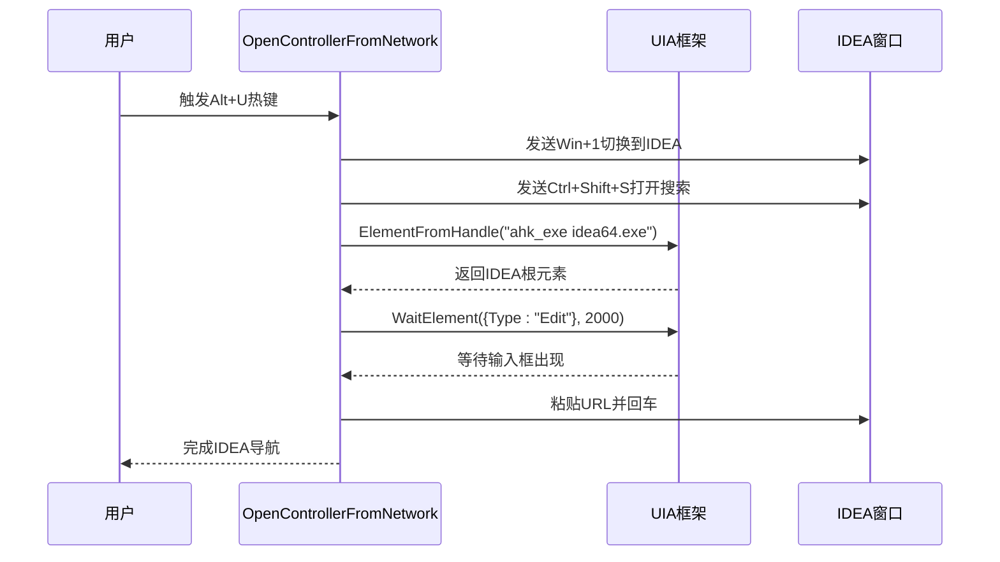
```mermaid
sequenceDiagram
participant User as 用户
participant Script as OpenControllerFromNetwork
participant UIA as UIA框架
participant IDEA as IDEA窗口
User->>Script : 触发Alt+U热键
Script->>IDEA : 发送Win+1切换到IDEA
Script->>IDEA : 发送Ctrl+Shift+S打开搜索
Script->>UIA : ElementFromHandle("ahk_exe idea64.exe")
UIA-->>Script : 返回IDEA根元素
Script->>UIA : WaitElement({Type : "Edit"}, 2000)
UIA-->>Script : 等待输入框出现
Script->>IDEA : 粘贴URL并回车
Script-->>User : 完成IDEA导航
```

**图表来源**
- [OpenControllerFromNetwork.ahk:42-56](file://OpenControllerFromNetwork.ahk#L42-L56)

#### 增强的可靠性特性

1. **UIA元素检测**：使用`UIA.ElementFromHandle()`替代简单的窗口检测
2. **智能等待机制**：通过`WaitElement()`方法等待特定类型的元素出现
3. **异常处理**：包含try-catch块确保即使UIA检测失败也能继续执行
4. **超时控制**：设置合理的超时时间避免无限等待

**章节来源**
- [OpenControllerFromNetwork.ahk:42-56](file://OpenControllerFromNetwork.ahk#L42-L56)

### 浏览器自动化扩展

UIA_Browser模块专为浏览器自动化而设计，支持Chrome、Firefox、Edge等多种浏览器：

#### 支持的浏览器类型
- **Chrome/Chromium系列**：Chrome、Brave、Vivaldi
- **Firefox**：Mozilla Firefox
- **Edge**：Microsoft Edge

#### 核心功能
- **页面导航**：前进、后退、刷新、主页
- **标签页管理**：创建、关闭、切换标签页
- **JavaScript执行**：通过地址栏执行JavaScript
- **元素定位**：基于CSS选择器的元素定位
- **文本提取**：从页面提取所有文本内容

**章节来源**
- [UIA_Browser.ahk:1-120](file://lib/UIA_Browser.ahk#L1-L120)
- [UIA_Browser.ahk:458-520](file://lib/UIA_Browser.ahk#L458-L520)

## 架构概览

UI自动化框架采用分层架构设计，确保了良好的可扩展性和维护性：

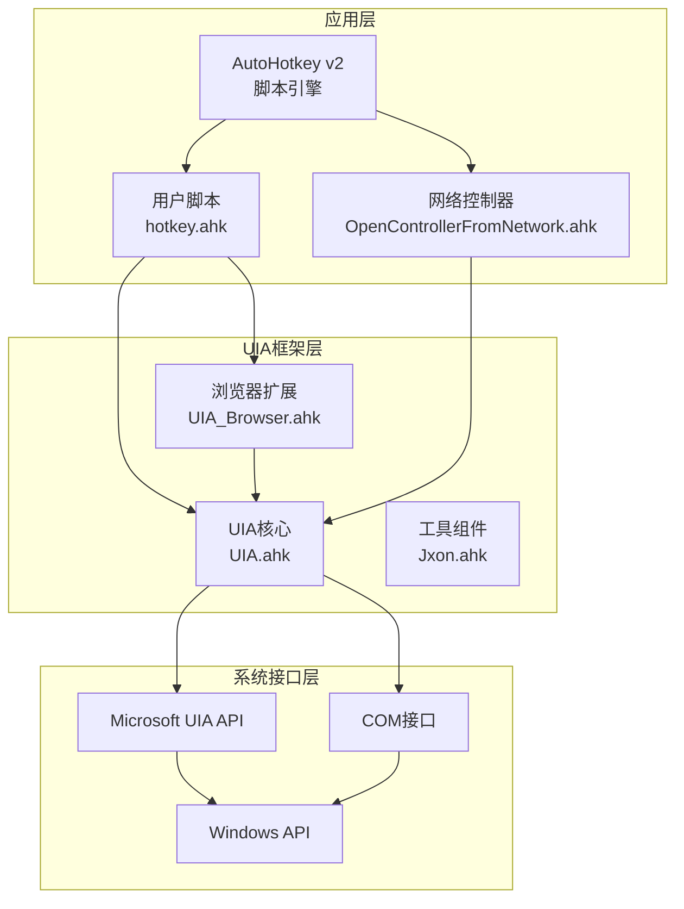
```mermaid
graph TD
subgraph "应用层"
AHK[AutoHotkey v2<br/>脚本引擎]
Scripts[用户脚本<br/>hotkey.ahk]
NetworkCtrl[网络控制器<br/>OpenControllerFromNetwork.ahk]
end
subgraph "UIA框架层"
Core[UIA核心<br/>UIA.ahk]
Browser[浏览器扩展<br/>UIA_Browser.ahk]
Utils[工具组件<br/>Jxon.ahk]
end
subgraph "系统接口层"
UIA_API[Microsoft UIA API]
COM[COM接口]
Windows[Windows API]
end
AHK --> Scripts
AHK --> NetworkCtrl
Scripts --> Core
Scripts --> Browser
NetworkCtrl --> Core
Core --> UIA_API
Browser --> Core
Core --> COM
UIA_API --> Windows
COM --> Windows
```

**图表来源**
- [hotkey.ahk:1-10](file://hotkey.ahk#L1-L10)
- [UIA.ahk:1-50](file://lib/UIA.ahk#L1-L50)
- [OpenControllerFromNetwork.ahk:1-50](file://OpenControllerFromNetwork.ahk#L1-L50)

## 详细组件分析

### UIA核心框架深度解析

#### 初始化和版本管理

UIA框架在首次使用时自动初始化，支持动态版本检测和选择：

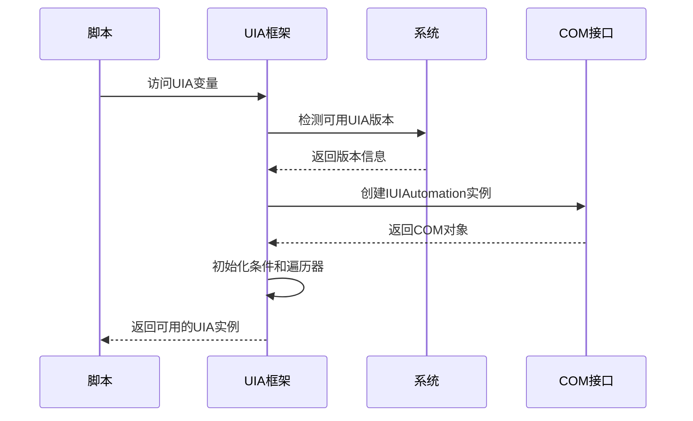
```mermaid
sequenceDiagram
participant Script as 脚本
participant UIA as UIA框架
participant System as 系统
participant COM as COM接口
Script->>UIA : 访问UIA变量
UIA->>System : 检测可用UIA版本
System-->>UIA : 返回版本信息
UIA->>COM : 创建IUIAutomation实例
COM-->>UIA : 返回COM对象
UIA->>UIA : 初始化条件和遍历器
UIA-->>Script : 返回可用的UIA实例
```

**图表来源**
- [UIA.ahk:60-138](file://lib/UIA.ahk#L60-L138)

#### 增强的元素定位策略

**更新** UIA框架现在提供了更强大的元素定位方法，特别是针对IDE应用的优化：

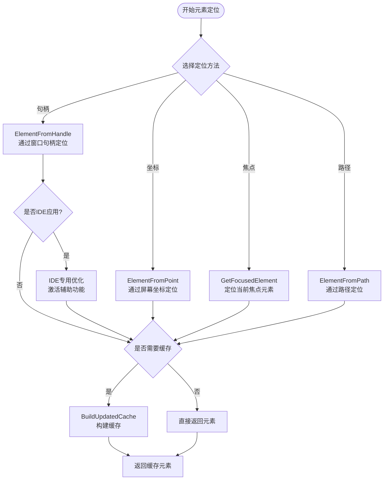
```mermaid
flowchart TD
Start([开始元素定位]) --> Method{选择定位方法}
Method --> |句柄| Handle[ElementFromHandle<br/>通过窗口句柄定位]
Method --> |坐标| Point[ElementFromPoint<br/>通过屏幕坐标定位]
Method --> |焦点| Focus[GetFocusedElement<br/>定位当前焦点元素]
Method --> |路径| Path[ElementFromPath<br/>通过路径定位]
Handle --> IDECheck{是否IDE应用?}
IDECheck --> |是| IDEOptimize[IDE专用优化<br/>激活辅助功能]
IDECheck --> |否| Cache{是否需要缓存}
IDEOptimize --> Cache
Point --> Cache
Focus --> Cache
Path --> Cache
Cache --> |是| BuildCache[BuildUpdatedCache<br/>构建缓存]
Cache --> |否| Direct[直接返回元素]
BuildCache --> Return[返回缓存元素]
Direct --> Return
```

**图表来源**
- [UIA.ahk:964-1009](file://lib/UIA.ahk#L964-L1009)
- [UIA.ahk:1104-1127](file://lib/UIA.ahk#L1104-L1127)

**章节来源**
- [UIA.ahk:945-1009](file://lib/UIA.ahk#L945-L1009)
- [UIA.ahk:1104-1127](file://lib/UIA.ahk#L1104-L1127)

### 增强的IDE集成工作流

**新增** 基于UIA.ElementFromHandle的IDE集成工作流提供了更高的可靠性：

#### IDEA搜索对话框处理流程

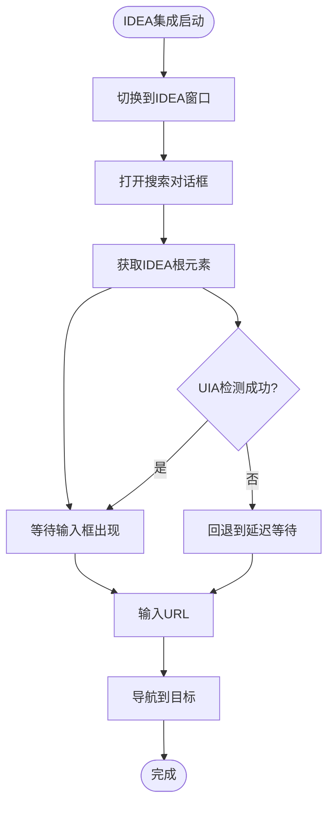
```mermaid
flowchart TD
Start([IDEA集成启动]) --> SwitchWindow[切换到IDEA窗口]
SwitchWindow --> OpenSearch[打开搜索对话框]
OpenSearch --> GetRootEl[获取IDEA根元素]
GetRootEl --> WaitInput[等待输入框出现]
WaitInput --> InputURL[输入URL]
InputURL --> Navigate[导航到目标]
Navigate --> Complete([完成])
GetRootEl --> TryCatch{UIA检测成功?}
TryCatch --> |否| FallbackSleep[回退到延迟等待]
FallbackSleep --> InputURL
TryCatch --> |是| WaitInput
```

**图表来源**
- [OpenControllerFromNetwork.ahk:42-56](file://OpenControllerFromNetwork.ahk#L42-L56)

#### 错误处理和容错机制

1. **UIA异常捕获**：当UIA元素检测失败时自动回退
2. **延迟重试机制**：提供额外的等待时间确保元素可用性
3. **用户体验优化**：显示友好的提示信息

**章节来源**
- [OpenControllerFromNetwork.ahk:42-56](file://OpenControllerFromNetwork.ahk#L42-L56)

### 事件处理机制

UIA框架实现了完整的事件监听和处理系统：

#### 事件类型分类

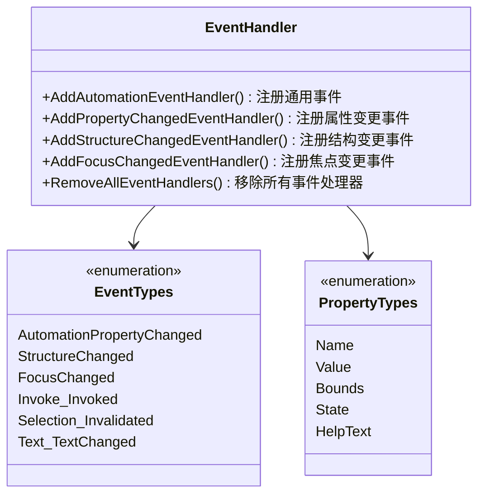
```mermaid
classDiagram
class EventHandler {
+AddAutomationEventHandler() 注册通用事件
+AddPropertyChangedEventHandler() 注册属性变更事件
+AddStructureChangedEventHandler() 注册结构变更事件
+AddFocusChangedEventHandler() 注册焦点变更事件
+RemoveAllEventHandlers() 移除所有事件处理器
}
class EventTypes {
<<enumeration>>
AutomationPropertyChanged
StructureChanged
FocusChanged
Invoke_Invoked
Selection_Invalidated
Text_TextChanged
}
class PropertyTypes {
<<enumeration>>
Name
Value
Bounds
State
HelpText
}
EventHandler --> EventTypes
EventHandler --> PropertyTypes
```

**图表来源**
- [UIA.ahk:1289-1360](file://lib/UIA.ahk#L1289-L1360)

#### 事件处理流程

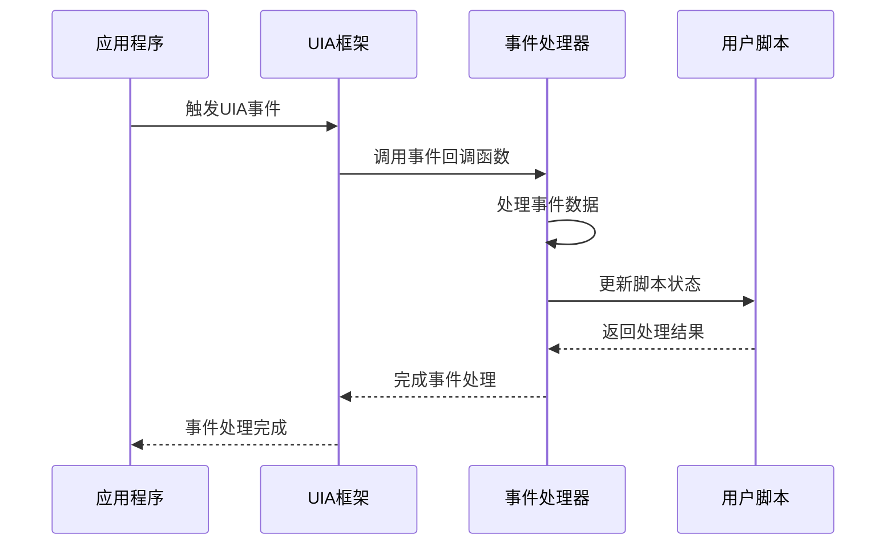
```mermaid
sequenceDiagram
participant App as 应用程序
participant UIA as UIA框架
participant Handler as 事件处理器
participant Script as 用户脚本
App->>UIA : 触发UIA事件
UIA->>Handler : 调用事件回调函数
Handler->>Handler : 处理事件数据
Handler->>Script : 更新脚本状态
Script-->>Handler : 返回处理结果
Handler-->>UIA : 完成事件处理
UIA-->>App : 事件处理完成
```

**图表来源**
- [UIA.ahk:1297-1333](file://lib/UIA.ahk#L1297-L1333)

**章节来源**
- [UIA.ahk:1285-1360](file://lib/UIA.ahk#L1285-L1360)

### 缓存机制和性能优化

#### 缓存策略

UIA框架实现了多层次的缓存机制来提高性能：

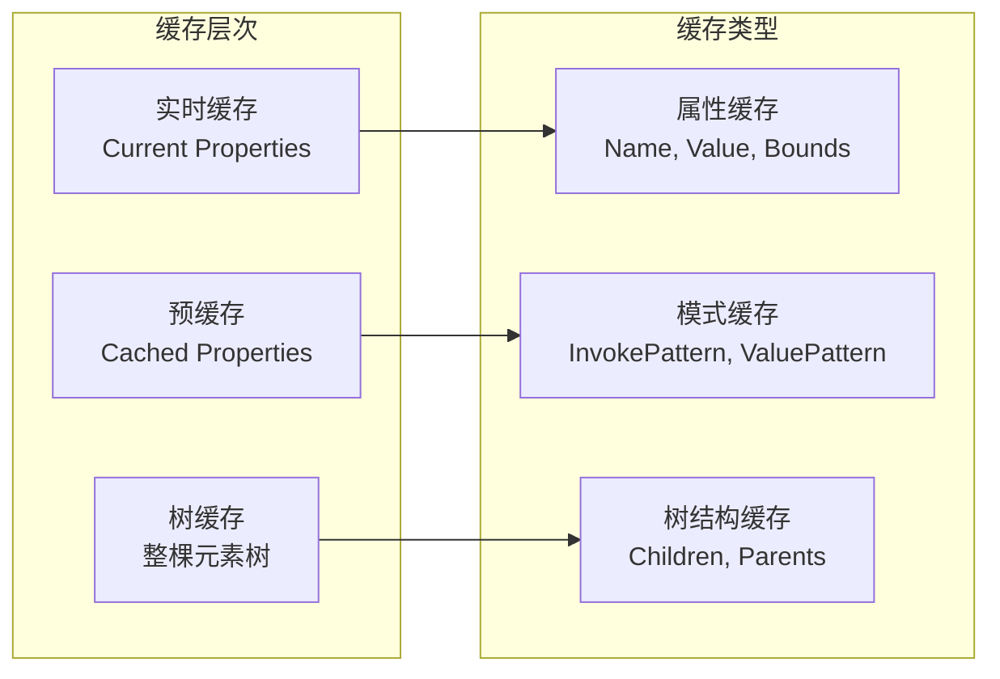
```mermaid
graph LR
subgraph "缓存层次"
Level1[实时缓存<br/>Current Properties]
Level2[预缓存<br/>Cached Properties]
Level3[树缓存<br/>整棵元素树]
end
subgraph "缓存类型"
Type1[属性缓存<br/>Name, Value, Bounds]
Type2[模式缓存<br/>InvokePattern, ValuePattern]
Type3[树结构缓存<br/>Children, Parents]
end
Level1 --> Type1
Level2 --> Type2
Level3 --> Type3
```

**图表来源**
- [UIA.ahk:1145-1183](file://lib/UIA.ahk#L1145-L1183)

#### 性能优化技术

1. **智能缓存更新**：仅在必要时更新缓存
2. **批量操作**：支持批量元素查找和操作
3. **延迟加载**：按需加载元素属性
4. **内存管理**：自动释放不再使用的资源
5. **IDE专用优化**：针对IDE应用的特殊缓存策略

**章节来源**
- [UIA.ahk:1145-1183](file://lib/UIA.ahk#L1145-L1183)
- [UIA.ahk:2287-2344](file://lib/UIA.ahk#L2287-L2344)

### 屏幕读取器支持

UIA框架内置了对Windows屏幕读取器的支持：

#### 屏幕读取器集成

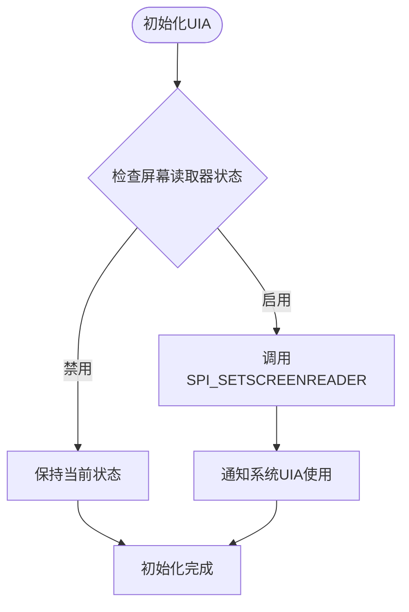
```mermaid
flowchart TD
Start([初始化UIA]) --> Check{检查屏幕读取器状态}
Check --> |启用| Enable[调用SPI_SETSCREENREADER]
Check --> |禁用| Disable[保持当前状态]
Enable --> Notify[通知系统UIA使用]
Disable --> Complete[初始化完成]
Notify --> Complete
```

**图表来源**
- [UIA.ahk:139-152](file://lib/UIA.ahk#L139-L152)

**章节来源**
- [UIA.ahk:1529-1535](file://lib/UIA.ahk#L1529-L1535)

## 依赖关系分析

### 外部依赖

UIA框架依赖于以下外部组件：

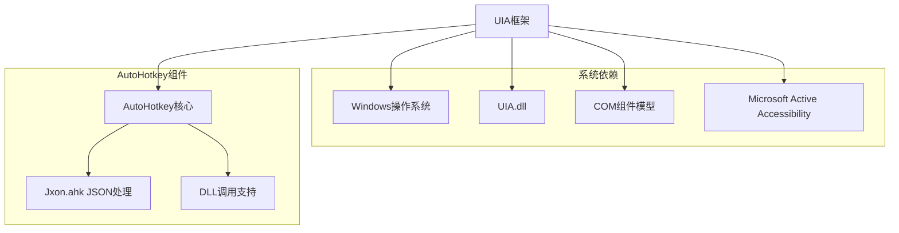
```mermaid
graph TB
subgraph "系统依赖"
Windows[Windows操作系统]
UIA_DLL[UIA.dll]
COM[COM组件模型]
MSAA[Microsoft Active Accessibility]
end
subgraph "AutoHotkey组件"
AHK_Core[AutoHotkey核心]
Jxon[Jxon.ahk JSON处理]
DllCall[DLL调用支持]
end
UIA_Framework[UIA框架] --> Windows
UIA_Framework --> UIA_DLL
UIA_Framework --> COM
UIA_Framework --> MSAA
AHK_Core --> Jxon
AHK_Core --> DllCall
UIA_Framework --> AHK_Core
```

**图表来源**
- [hotkey.ahk:3-6](file://hotkey.ahk#L3-L6)

### 内部模块依赖

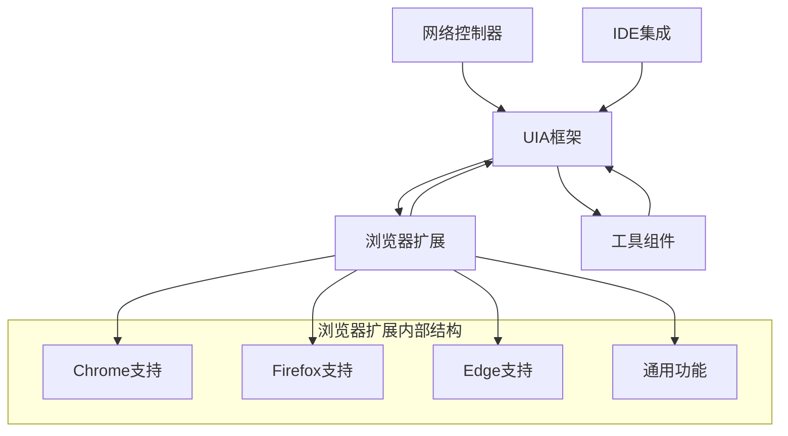
```mermaid
graph TD
UIA_Framework[UIA框架] --> Browser_Extension[浏览器扩展]
UIA_Framework --> Utils[工具组件]
Browser_Extension --> UIA_Framework
Utils --> UIA_Framework
NetworkCtrl[网络控制器] --> UIA_Framework
IDE_Integration[IDE集成] --> UIA_Framework
subgraph "浏览器扩展内部结构"
Chrome[Chrome支持]
Firefox[Firefox支持]
Edge[Edge支持]
Common[通用功能]
end
Browser_Extension --> Chrome
Browser_Extension --> Firefox
Browser_Extension --> Edge
Browser_Extension --> Common
```

**图表来源**
- [UIA_Browser.ahk:458-488](file://lib/UIA_Browser.ahk#L458-L488)
- [OpenControllerFromNetwork.ahk:45-50](file://OpenControllerFromNetwork.ahk#L45-L50)

**章节来源**
- [hotkey.ahk:3-6](file://hotkey.ahk#L3-L6)
- [UIA_Browser.ahk:458-488](file://lib/UIA_Browser.ahk#L458-L488)

## 性能考虑

### 性能优化策略

#### 元素查找优化

1. **条件预编译**：将复杂的查找条件预编译为UIA条件对象
2. **缓存策略**：根据使用频率智能缓存元素属性
3. **批量操作**：支持批量元素查找和操作减少API调用次数
4. **IDE专用优化**：针对IDE应用的快速路径查找

#### 内存管理

1. **自动释放**：COM对象使用后自动释放
2. **缓存清理**：定期清理不再使用的缓存数据
3. **资源监控**：监控内存使用情况避免泄漏

#### 并发处理

1. **线程安全**：确保事件处理器的线程安全性
2. **异步操作**：支持异步元素查找和操作
3. **超时机制**：防止长时间阻塞操作

## 故障排除指南

### 常见问题和解决方案

#### 元素定位失败

**问题描述**：无法找到指定的UI元素

**可能原因**：
1. 元素尚未加载完成
2. 条件过于严格
3. 应用程序使用非标准UIA实现
4. **IDE窗口未正确激活**

**解决方案**：
```autohotkey
; 使用等待机制
element := parentElement.WaitElement({Name:"按钮名称"}, 5000)

; 使用更宽松的条件
element := parentElement.FindElement({Type:"Button"}, 4)

; 检查元素是否存在
if element := parentElement.ElementExist({Name:"目标元素"})
    ; 执行操作

; IDEA专用：使用ElementFromHandle
ideaEl := UIA.ElementFromHandle("ahk_exe idea64.exe")
inputEl := ideaEl.WaitElement({Type:"Edit"}, 2000)
```

#### IDEA集成问题

**新增** IDEA集成功能的常见问题：

**问题描述**：IDEA搜索对话框无法正确识别

**解决方案**：
1. 确保IDEA窗口已完全激活
2. 检查UIA辅助功能是否正确启用
3. 验证搜索对话框已正确打开
4. 使用try-catch块处理异常情况

#### 事件处理问题

**问题描述**：事件处理器无法正常工作

**解决步骤**：
1. 确认事件处理器已正确注册
2. 检查事件作用域设置
3. 验证事件回调函数签名

**章节来源**
- [UIA.ahk:2759-2804](file://lib/UIA.ahk#L2759-L2804)
- [UIA.ahk:1297-1333](file://lib/UIA.ahk#L1297-L1333)
- [OpenControllerFromNetwork.ahk:45-50](file://OpenControllerFromNetwork.ahk#L45-L50)

### 错误处理最佳实践

#### 异常捕获

```autohotkey
try {
    element := UIA.ElementFromHandle(hwnd)
    element.Click()
} catch TargetError as e {
    ; 处理元素未找到错误
    MsgBox("元素未找到: " e.Message)
} catch Error as e {
    ; 处理其他UIA错误
    MsgBox("UIA操作失败: " e.Message)
}
```

#### 资源清理

```autohotkey
; 确保事件处理器被正确移除
UIA.RemoveAllEventHandlers()

; 手动清理大对象
if IsObject(largeElementArray) {
    largeElementArray := []
}
```

**章节来源**
- [UIA.ahk:1358-1360](file://lib/UIA.ahk#L1358-L1360)

## 结论

hotkey项目的UI自动化框架是一个功能强大、设计精良的自动化测试和控制工具。其主要特点包括：

### 核心优势

1. **完整的UIA实现**：提供了Microsoft UIA框架的完整API覆盖
2. **智能缓存机制**：显著提升了元素查找和操作的性能
3. **浏览器扩展支持**：专门针对现代浏览器的自动化需求
4. **屏幕读取器集成**：确保了无障碍访问的兼容性
5. **灵活的事件处理**：支持多种类型的UIA事件监听
6. **增强的IDE集成**：通过UIA.ElementFromHandle提供更可靠的IDE应用支持

### 技术特色

- **多版本兼容**：支持从Windows 7到最新版本的Windows系统
- **高性能设计**：通过智能缓存和优化算法提升执行效率
- **易于使用**：提供了简洁的API接口和丰富的示例代码
- **稳定可靠**：完善的错误处理和资源管理机制
- **IDE专用优化**：针对IDE应用的特殊优化和容错机制

### 应用场景

该框架适用于以下场景：
- 自动化测试和质量保证
- 用户界面自动化脚本
- 屏幕读取器辅助工具
- 界面元素监控和数据分析
- 跨平台应用程序控制
- **IDE开发工作流集成**：与IDEA等开发工具的无缝集成

### 最新改进

**新增** 通过OpenControllerFromNetwork.ahk中的IDEA集成功能增强，框架现在能够：
- 使用UIA.ElementFromHandle进行更可靠的IDE窗口检测
- 通过WaitElement方法智能等待IDE对话框元素
- 提供更好的异常处理和容错机制
- 显著提升IDE搜索对话框处理的稳定性和可靠性

通过合理使用这个框架，开发者可以高效地实现各种UI自动化需求，同时保持代码的可维护性和性能表现。特别是在IDE集成方面，新的UIA元素检测机制为开发工作流自动化提供了更强的支持。